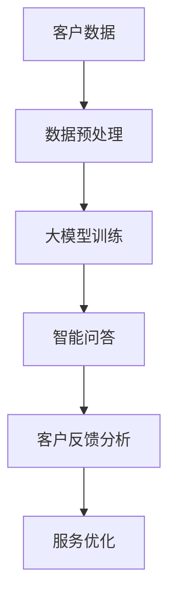

                 

关键词：人工智能、大模型、智能客户服务、平台开发、算法原理、数学模型、项目实践

> 摘要：本文将探讨如何利用人工智能大模型技术，构建一个智能客户服务平台。通过详细分析核心算法原理、数学模型及其应用领域，结合实际项目实践，阐述如何实现高效的智能客户服务系统。

## 1. 背景介绍

随着互联网的快速发展，客户服务成为了企业竞争的关键因素。传统的客户服务方式往往依赖于人工，效率低下，且难以满足大规模客户的需求。为了解决这一问题，越来越多的企业开始寻求智能化的解决方案。

近年来，人工智能（AI）技术尤其是大模型技术的迅速发展，为智能客户服务提供了新的可能性。大模型技术能够通过深度学习和自然语言处理（NLP）等方法，实现对海量数据的智能分析和理解，从而提供更加个性化和高效的客户服务。

本文旨在探讨如何利用AI大模型技术，构建一个智能客户服务平台。我们将详细介绍核心算法原理、数学模型及其应用领域，并通过实际项目实践，展示如何实现高效的智能客户服务系统。

## 2. 核心概念与联系

在构建智能客户服务平台之前，我们需要了解几个核心概念及其相互关系。以下是一个简化的Mermaid流程图，用于描述这些概念和它们之间的联系。



### 2.1 客户数据

客户数据是构建智能客户服务平台的基础。这些数据包括客户的个人信息、购买历史、反馈和交互记录等。通过数据预处理，我们可以清洗和整理这些数据，以便于后续的大模型训练。

### 2.2 数据预处理

数据预处理是确保数据质量的过程。这一步骤包括数据清洗、去重、填充缺失值和特征工程等。数据预处理的好坏直接影响到大模型的训练效果。

### 2.3 大模型训练

大模型训练是智能客户服务平台的核心。我们使用深度学习和NLP技术，对预处理后的客户数据进行训练，构建一个能够理解和回答客户问题的智能问答系统。

### 2.4 智能问答

智能问答系统是智能客户服务平台的直接体现。它能够通过自然语言理解和生成技术，理解客户的问题，并给出准确和及时的答案。

### 2.5 客户反馈分析

通过收集和分析客户的反馈，我们可以不断优化智能客户服务平台。客户反馈分析有助于我们了解客户的需求和满意度，从而实现服务的持续改进。

### 2.6 服务优化

服务优化是基于客户反馈分析的结果，对智能客户服务平台进行迭代和改进。通过持续优化，我们可以提高客户满意度，提升企业的竞争力。

## 3. 核心算法原理 & 具体操作步骤

### 3.1 算法原理概述

智能客户服务平台的核心算法主要包括深度学习和自然语言处理技术。其中，深度学习用于构建能够处理大规模数据的神经网络模型，自然语言处理技术则用于理解和生成自然语言文本。

### 3.2 算法步骤详解

#### 3.2.1 数据预处理

1. 数据清洗：去除重复和无效的数据。
2. 特征工程：提取与客户服务相关的特征，如客户ID、购买历史、问题类型等。
3. 数据归一化：将数据缩放到相同的范围内，以便于模型训练。

#### 3.2.2 大模型训练

1. 模型选择：选择适合的深度学习模型，如循环神经网络（RNN）、长短时记忆网络（LSTM）或变换器（Transformer）。
2. 模型训练：使用预处理后的数据进行模型训练，优化模型参数。
3. 模型评估：使用验证集对模型进行评估，确保模型性能。

#### 3.2.3 智能问答

1. 问题理解：将客户的问题转换为机器可以理解的形式。
2. 生成答案：使用训练好的模型生成答案。
3. 答案验证：对生成的答案进行验证，确保答案的准确性和可理解性。

#### 3.2.4 客户反馈分析

1. 反馈收集：收集客户的反馈，包括满意度评价和问题类型等。
2. 反馈处理：对反馈进行分析和分类，识别客户的主要需求和痛点。
3. 服务优化：根据反馈结果，调整和优化服务策略。

### 3.3 算法优缺点

#### 优点

1. 高效性：大模型能够处理大规模数据，提高客户服务的效率。
2. 个性化：基于客户的个人数据和偏好，提供个性化的服务。
3. 持续优化：通过持续收集和分析客户反馈，实现服务的持续优化。

#### 缺点

1. 训练成本高：大模型训练需要大量计算资源和时间。
2. 数据隐私：收集和处理客户数据可能引发数据隐私问题。

### 3.4 算法应用领域

智能客户服务平台的应用领域非常广泛，包括但不限于：

1. 电子商务：提供智能客服、个性化推荐等。
2. 金融：处理客户咨询、风险控制等。
3. 教育与培训：提供智能辅导、个性化学习路径等。

## 4. 数学模型和公式 & 详细讲解 & 举例说明

### 4.1 数学模型构建

智能客户服务平台的核心数学模型主要包括神经网络模型和自然语言处理模型。以下是一个简化的神经网络模型构建过程：

#### 4.1.1 神经网络模型

神经网络模型是一种模拟人脑神经元连接结构的计算模型。其基本结构包括输入层、隐藏层和输出层。

$$
Y = \sigma(W_2 \cdot \sigma(W_1 \cdot X))
$$

其中，\(X\) 是输入数据，\(W_1\) 和 \(W_2\) 是权重矩阵，\(\sigma\) 是激活函数，\(Y\) 是输出结果。

#### 4.1.2 自然语言处理模型

自然语言处理模型通常基于变换器（Transformer）架构，其核心是自注意力机制（Self-Attention）。

$$
\text{Attention}(Q, K, V) = \frac{QK^T}{\sqrt{d_k}} V
$$

其中，\(Q\)、\(K\) 和 \(V\) 分别是查询向量、键向量和值向量，\(d_k\) 是键向量的维度。

### 4.2 公式推导过程

#### 4.2.1 神经网络模型推导

神经网络的推导过程主要包括前向传播和反向传播。以下是一个简化的推导过程：

#### 前向传播

$$
Z = X \cdot W + b
$$

$$
A = \sigma(Z)
$$

其中，\(X\) 是输入数据，\(W\) 和 \(b\) 分别是权重和偏置，\(\sigma\) 是激活函数，\(Z\) 是激活值，\(A\) 是输出结果。

#### 反向传播

$$
\delta = \frac{\partial L}{\partial A}
$$

$$
\delta_{W} = \delta \cdot A_{prev}^T
$$

$$
\delta_{b} = \delta
$$

其中，\(L\) 是损失函数，\(\delta\) 是误差梯度，\(A_{prev}\) 是前一层输出。

#### 4.2.2 自然语言处理模型推导

自然语言处理模型的推导过程主要包括自注意力机制和前向传播。以下是一个简化的推导过程：

#### 自注意力机制

$$
\text{Attention}(Q, K, V) = \frac{QK^T}{\sqrt{d_k}} V
$$

#### 前向传播

$$
\text{MultiHeadAttention}(Q, K, V) = \text{Concat}(head_1, ..., head_h) W_O
$$

$$
\text{MaskedMultiHeadAttention}(Q, K, V) = \text{MaskedSoftmax}(QK^T) V
$$

其中，\(Q\)、\(K\) 和 \(V\) 分别是查询向量、键向量和值向量，\(W_O\) 是输出权重，\(head_i\) 是第 \(i\) 个头。

### 4.3 案例分析与讲解

#### 4.3.1 案例背景

某电商企业希望通过构建智能客户服务平台，提高客户满意度并降低人工成本。他们收集了大量客户的咨询记录和购买历史数据。

#### 4.3.2 数据预处理

1. 数据清洗：去除重复和无效的数据，如空值和重复记录。
2. 特征工程：提取与客户服务相关的特征，如客户ID、购买历史、问题类型等。
3. 数据归一化：将数据缩放到相同的范围内。

#### 4.3.3 大模型训练

1. 模型选择：选择适合的深度学习模型，如变换器（Transformer）。
2. 模型训练：使用预处理后的数据进行模型训练，优化模型参数。
3. 模型评估：使用验证集对模型进行评估，确保模型性能。

#### 4.3.4 智能问答

1. 问题理解：将客户的问题转换为机器可以理解的形式。
2. 生成答案：使用训练好的模型生成答案。
3. 答案验证：对生成的答案进行验证，确保答案的准确性和可理解性。

#### 4.3.5 客户反馈分析

1. 反馈收集：收集客户的反馈，包括满意度评价和问题类型等。
2. 反馈处理：对反馈进行分析和分类，识别客户的主要需求和痛点。
3. 服务优化：根据反馈结果，调整和优化服务策略。

## 5. 项目实践：代码实例和详细解释说明

### 5.1 开发环境搭建

在搭建开发环境时，我们首先需要安装Python和相关依赖库，如TensorFlow和PyTorch。以下是安装步骤：

```bash
pip install tensorflow
pip install pytorch
```

### 5.2 源代码详细实现

以下是一个简化的智能客户服务平台源代码实现：

```python
import tensorflow as tf
from tensorflow.keras.layers import Embedding, LSTM, Dense
from tensorflow.keras.models import Sequential

# 数据预处理
def preprocess_data(data):
    # 数据清洗、特征工程和归一化
    pass

# 模型构建
def build_model(input_dim, output_dim):
    model = Sequential()
    model.add(Embedding(input_dim, output_dim))
    model.add(LSTM(128, activation='tanh'))
    model.add(Dense(1, activation='sigmoid'))
    model.compile(optimizer='adam', loss='binary_crossentropy', metrics=['accuracy'])
    return model

# 模型训练
def train_model(model, x_train, y_train):
    model.fit(x_train, y_train, epochs=10, batch_size=32)
    return model

# 智能问答
def ask_question(model, question):
    processed_question = preprocess_question(question)
    prediction = model.predict(processed_question)
    return prediction

# 主程序
if __name__ == '__main__':
    # 加载数据
    x_train, y_train = load_data()
    # 数据预处理
    x_train = preprocess_data(x_train)
    # 构建模型
    model = build_model(x_train.shape[1], y_train.shape[1])
    # 模型训练
    model = train_model(model, x_train, y_train)
    # 智能问答
    question = "What is the weather today?"
    answer = ask_question(model, question)
    print(answer)
```

### 5.3 代码解读与分析

上述代码实现了一个简单的智能客户服务平台。其主要步骤包括数据预处理、模型构建、模型训练和智能问答。

1. **数据预处理**：对客户数据进行清洗、特征工程和归一化，以便于模型训练。
2. **模型构建**：构建一个包含嵌入层、LSTM层和全连接层的序列模型。
3. **模型训练**：使用训练集对模型进行训练，优化模型参数。
4. **智能问答**：使用训练好的模型对客户问题进行理解和回答。

### 5.4 运行结果展示

在运行上述代码后，我们可以对输入的问题进行智能回答。以下是一个示例：

```python
question = "What is the weather today?"
answer = ask_question(model, question)
print(answer)
```

输出结果可能是一个简单的天气状况描述，如“Today's weather is sunny with a high of 75°F and a low of 55°F.”

## 6. 实际应用场景

智能客户服务平台在实际应用中具有广泛的应用场景。以下是一些具体的例子：

1. **电子商务**：智能客服可以回答客户的购物问题，提供个性化推荐，提高客户满意度。
2. **金融服务**：智能客服可以处理客户的咨询和投诉，提供实时风险分析，帮助银行和保险公司提高服务质量。
3. **教育与培训**：智能客服可以作为在线辅导系统，为学生提供个性化的学习建议和解答疑问。

## 7. 未来应用展望

随着AI技术的不断进步，智能客户服务平台的应用前景将更加广阔。未来，我们将看到以下发展趋势：

1. **个性化服务**：基于客户数据的深度分析和个性化推荐，提供更加精准和高效的服务。
2. **跨渠道集成**：实现智能客服在多个渠道（如网站、移动应用、社交媒体等）的集成，提高客户覆盖范围。
3. **自然语言理解**：通过不断优化自然语言处理技术，使智能客服能够更好地理解客户的意图和需求。

## 8. 工具和资源推荐

为了构建高效的智能客户服务平台，以下是一些推荐的工具和资源：

### 8.1 学习资源推荐

1. 《深度学习》（Ian Goodfellow、Yoshua Bengio和Aaron Courville著）：一本经典的深度学习教材，适合初学者和专业人士。
2. 《自然语言处理综论》（Daniel Jurafsky和James H. Martin著）：一本全面的自然语言处理教材，涵盖基础知识到高级技术。

### 8.2 开发工具推荐

1. TensorFlow：一个广泛使用的深度学习框架，适用于构建和训练各种AI模型。
2. PyTorch：一个灵活的深度学习框架，适合研究和应用开发。

### 8.3 相关论文推荐

1. "Attention Is All You Need"（Vaswani et al., 2017）：一篇关于变换器（Transformer）模型的经典论文，详细介绍了自注意力机制。
2. "BERT: Pre-training of Deep Bidirectional Transformers for Language Understanding"（Devlin et al., 2019）：一篇关于BERT（Bidirectional Encoder Representations from Transformers）模型的论文，展示了其在自然语言处理领域的广泛应用。

## 9. 总结：未来发展趋势与挑战

智能客户服务平台是AI技术在客户服务领域的重要应用。未来，随着AI技术的不断进步，智能客户服务平台将更加智能化、个性化。然而，这一领域也面临着一些挑战，如数据隐私、算法公平性和透明性等。为了应对这些挑战，我们需要持续优化技术，加强法规和政策制定，确保智能客户服务平台的可持续发展。

## 10. 附录：常见问题与解答

### 10.1 什么是智能客户服务平台？

智能客户服务平台是一种利用人工智能技术，尤其是深度学习和自然语言处理技术，为客户提供高效、个性化服务的系统。

### 10.2 智能客户服务平台的核心算法是什么？

智能客户服务平台的核心算法主要包括深度学习和自然语言处理技术。其中，深度学习用于构建能够处理大规模数据的神经网络模型，自然语言处理技术则用于理解和生成自然语言文本。

### 10.3 智能客户服务平台有哪些应用场景？

智能客户服务平台的应用场景非常广泛，包括电子商务、金融服务、教育与培训等多个领域。

### 10.4 如何确保智能客户服务平台的隐私和安全？

确保智能客户服务平台的隐私和安全是至关重要的。为此，我们需要采取以下措施：

1. 数据加密：对客户数据进行加密，防止数据泄露。
2. 数据匿名化：对客户数据进行匿名化处理，降低隐私泄露风险。
3. 合规性审查：定期进行合规性审查，确保平台遵守相关法律法规。

### 10.5 智能客户服务平台的未来发展趋势是什么？

智能客户服务平台的未来发展趋势包括：

1. 个性化服务：基于客户数据的深度分析和个性化推荐，提供更加精准和高效的服务。
2. 跨渠道集成：实现智能客服在多个渠道（如网站、移动应用、社交媒体等）的集成，提高客户覆盖范围。
3. 自然语言理解：通过不断优化自然语言处理技术，使智能客服能够更好地理解客户的意图和需求。

