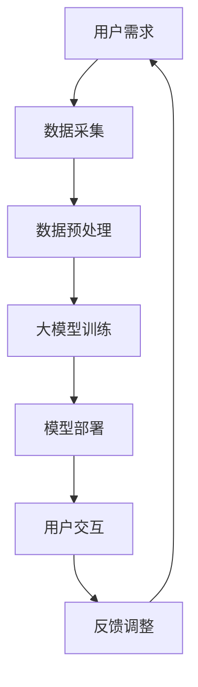

                 

关键词：人工智能，大模型，智能法律咨询系统，法律领域，技术应用

> 摘要：随着人工智能技术的快速发展，基于大模型的智能法律咨询系统成为了一个备受关注的研究领域。本文将探讨该系统的核心概念、算法原理、数学模型、实践应用以及未来发展。

## 1. 背景介绍

### 1.1 人工智能在法律领域的应用

人工智能在法律领域的应用越来越广泛，从简单的法律文档自动分类到复杂的法律智能问答系统，人工智能正在改变律师和法官的工作方式。传统的法律咨询服务依赖于大量人力和时间，而智能法律咨询系统可以提高效率，降低成本，并为用户提供更快捷、准确的法律信息。

### 1.2 人工智能大模型的发展

人工智能大模型是指具有海量参数和强大计算能力的神经网络模型，如Transformer模型、BERT模型等。这些模型通过在大量数据上进行训练，能够捕获复杂的模式和关系，从而实现高度智能化的任务。

### 1.3 智能法律咨询系统的需求

随着法律知识的不断积累和法律案例的日益增多，用户对法律咨询的需求也不断增加。传统法律咨询服务无法满足这种需求，因此，开发基于AI大模型的智能法律咨询系统显得尤为必要。

## 2. 核心概念与联系

下面是智能法律咨询系统的核心概念与联系的Mermaid流程图：



### 2.1 用户需求

用户需求是整个系统的起点，用户通过界面提出法律咨询问题，这些需求将成为系统后续处理的输入。

### 2.2 数据采集

为了训练出能够处理法律问题的AI大模型，系统需要收集大量的法律文档、案例、法规等数据。

### 2.3 数据预处理

数据采集后，需要进行预处理，包括文本清洗、数据标注、数据分割等步骤，以确保数据的质量和一致性。

### 2.4 大模型训练

通过预处理后的数据，使用大模型训练算法（如BERT、Transformer）训练出能够处理法律咨询的模型。

### 2.5 模型部署

训练完成后，将模型部署到服务器上，使其能够为用户提供实时法律咨询服务。

### 2.6 用户交互

用户通过与系统的交互，提出问题并获得回答。这一过程可能涉及自然语言处理、对话系统等技术。

### 2.7 反馈调整

用户对回答的反馈将用于模型的不断优化和调整，以提高系统的服务质量。

## 3. 核心算法原理 & 具体操作步骤

### 3.1 算法原理概述

智能法律咨询系统主要依赖于自然语言处理（NLP）和深度学习技术。其中，Transformer模型和BERT模型是两种常用的模型。

### 3.2 算法步骤详解

#### 3.2.1 数据采集

数据采集是整个系统的基础，需要收集大量的法律文档、案例、法规等。这些数据可以从公开的法律数据库、法院判决书、律师网站等渠道获取。

#### 3.2.2 数据预处理

数据预处理包括文本清洗、数据标注、数据分割等步骤。例如，对文本进行分词、去停用词、词性标注等操作。

#### 3.2.3 大模型训练

使用预处理后的数据训练Transformer或BERT模型。训练过程中，可以使用交叉熵损失函数和反向传播算法进行优化。

#### 3.2.4 模型部署

训练完成后，将模型部署到服务器上，使其能够为用户提供实时法律咨询服务。

#### 3.2.5 用户交互

用户通过与系统的交互，提出问题并获得回答。这一过程可能涉及对话系统、自然语言理解等技术。

### 3.3 算法优缺点

#### 优点

- 高效：基于大模型的系统可以快速处理大量的法律咨询问题。
- 准确：通过在大量数据上的训练，模型能够准确理解法律问题的含义。
- 可扩展：系统可以根据需求进行扩展，处理更多类型的问题。

#### 缺点

- 资源消耗大：训练大模型需要大量的计算资源和时间。
- 数据依赖性强：系统的性能很大程度上取决于数据的数量和质量。

### 3.4 算法应用领域

智能法律咨询系统可以应用于多个领域，如法律研究、法律咨询、案件预测等。未来，随着技术的不断进步，其应用范围将进一步扩大。

## 4. 数学模型和公式 & 详细讲解 & 举例说明

### 4.1 数学模型构建

智能法律咨询系统的数学模型主要基于深度学习，其中Transformer和BERT模型是最常用的两种模型。

#### 4.1.1 Transformer模型

Transformer模型是一种基于自注意力机制的神经网络模型，其核心思想是利用自注意力机制对输入序列进行建模。

$$
\text{Attention}(Q, K, V) = \text{softmax}\left(\frac{QK^T}{\sqrt{d_k}}\right)V
$$

其中，$Q$、$K$、$V$ 分别是查询向量、键向量和值向量，$d_k$ 是键向量的维度。

#### 4.1.2 BERT模型

BERT（Bidirectional Encoder Representations from Transformers）模型是一种双向的Transformer模型，其核心思想是利用双向注意力机制对输入序列进行建模。

$$
\text{BERT}(\text{x}) = \text{ softmax}(\text{Tanh}(\text{W}[\text{H}^T \text{x} ; \text{H}^L \text{x}])) 
$$

其中，$\text{x}$ 是输入序列，$\text{W}$ 是权重矩阵，$\text{H}^T$ 和 $\text{H}^L$ 分别是前向和后向的注意力层。

### 4.2 公式推导过程

#### 4.2.1 Transformer模型

Transformer模型的推导过程较为复杂，主要涉及矩阵分解、矩阵乘法、自注意力机制等。这里简要介绍自注意力机制的推导过程。

首先，定义一个输入序列 $X = [x_1, x_2, ..., x_n]$，将其转换为嵌入向量 $E = [e_1, e_2, ..., e_n]$。然后，计算每个嵌入向量与其他嵌入向量的相似度：

$$
\text{Similarity}(e_i, e_j) = e_i^T e_j
$$

接着，对相似度进行加权求和，得到注意力权重 $a_i$：

$$
a_i = \frac{\exp(\text{Similarity}(e_i, e_j))}{\sum_{j=1}^{n} \exp(\text{Similarity}(e_i, e_j))}
$$

最后，利用注意力权重计算输出向量 $O_i$：

$$
O_i = \sum_{j=1}^{n} a_i e_j
$$

#### 4.2.2 BERT模型

BERT模型的推导过程也较为复杂，主要涉及多层注意力机制、门控循环单元（GRU）等。这里简要介绍BERT模型的核心思想。

BERT模型由多个注意力层组成，每个注意力层包含两个部分：自注意力机制和交叉注意力机制。自注意力机制用于对输入序列进行建模，交叉注意力机制用于对查询向量进行建模。

假设输入序列为 $X = [x_1, x_2, ..., x_n]$，查询向量为 $Q = [q_1, q_2, ..., q_n]$，目标向量为 $K = [k_1, k_2, ..., k_n]$，则BERT模型的输出可以表示为：

$$
O = \text{softmax}(\text{Tanh}(\text{W}[\text{H}^T Q ; \text{H}^L K]))
$$

其中，$\text{W}$ 是权重矩阵，$\text{H}^T$ 和 $\text{H}^L$ 分别是前向和后向的注意力层。

### 4.3 案例分析与讲解

#### 4.3.1 案例一：法律文档分类

假设有一个包含大量法律文档的数据集，需要对这些文档进行分类。我们可以使用Transformer模型进行训练。

首先，收集数据集，并对文本进行预处理，包括分词、去停用词、词性标注等。然后，将预处理后的文本转换为嵌入向量，使用训练集进行模型训练。最后，使用测试集对模型进行评估。

具体步骤如下：

1. 收集数据集，并预处理文本。
2. 将预处理后的文本转换为嵌入向量。
3. 使用训练集训练Transformer模型。
4. 使用测试集评估模型性能。

#### 4.3.2 案例二：法律问题解答

假设有一个法律问题问答系统，用户可以提出法律问题，系统需要回答。我们可以使用BERT模型进行训练。

首先，收集数据集，包括问题和答案。然后，对问题进行预处理，包括分词、去停用词、词性标注等。接着，将预处理后的文本转换为嵌入向量，并使用训练集训练BERT模型。最后，使用测试集对模型进行评估。

具体步骤如下：

1. 收集数据集，并预处理问题。
2. 将预处理后的问题转换为嵌入向量。
3. 使用训练集训练BERT模型。
4. 使用测试集评估模型性能。

## 5. 项目实践：代码实例和详细解释说明

### 5.1 开发环境搭建

为了搭建智能法律咨询系统，我们需要准备以下开发环境：

- Python 3.8及以上版本
- TensorFlow 2.6及以上版本
- PyTorch 1.8及以上版本
- Jupyter Notebook

### 5.2 源代码详细实现

下面是一个简单的智能法律咨询系统的实现，使用PyTorch框架。

```python
import torch
import torch.nn as nn
import torch.optim as optim
from torch.utils.data import DataLoader
from transformers import BertTokenizer, BertModel
from dataset import LawDataset

# 模型定义
class LawConsultingSystem(nn.Module):
    def __init__(self):
        super(LawConsultingSystem, self).__init__()
        self.bert = BertModel.from_pretrained('bert-base-uncased')
        self.fc = nn.Linear(768, 1)  # 预测结果只有一个类别

    def forward(self, input_ids, attention_mask):
        outputs = self.bert(input_ids=input_ids, attention_mask=attention_mask)
        pooled_output = outputs.pooler_output
        logits = self.fc(pooled_output)
        return logits

# 数据加载
train_dataset = LawDataset('train')
train_loader = DataLoader(train_dataset, batch_size=16, shuffle=True)
val_dataset = LawDataset('val')
val_loader = DataLoader(val_dataset, batch_size=16, shuffle=False)

# 模型训练
model = LawConsultingSystem()
optimizer = optim.Adam(model.parameters(), lr=1e-5)
criterion = nn.CrossEntropyLoss()

device = torch.device("cuda" if torch.cuda.is_available() else "cpu")
model.to(device)

for epoch in range(10):
    model.train()
    for batch in train_loader:
        inputs = batch['input_ids'].to(device)
        attention_mask = batch['attention_mask'].to(device)
        labels = batch['labels'].to(device)
        
        optimizer.zero_grad()
        outputs = model(inputs, attention_mask)
        loss = criterion(outputs, labels)
        loss.backward()
        optimizer.step()

    # 在验证集上评估模型
    model.eval()
    with torch.no_grad():
        correct = 0
        total = 0
        for batch in val_loader:
            inputs = batch['input_ids'].to(device)
            attention_mask = batch['attention_mask'].to(device)
            labels = batch['labels'].to(device)
            outputs = model(inputs, attention_mask)
            _, predicted = torch.max(outputs.data, 1)
            total += labels.size(0)
            correct += (predicted == labels).sum().item()
        print(f'Epoch {epoch+1}, Accuracy: {100 * correct / total}%')

# 模型部署
model.eval()
with torch.no_grad():
    while True:
        question = input("请提出您的问题：")
        input_ids = tokenizer.encode(question, add_special_tokens=True, return_tensors='pt')
        attention_mask = torch.ones(input_ids.shape, dtype=torch.float)
        outputs = model(input_ids, attention_mask)
        logits = outputs.logits
        _, predicted = torch.max(logits, 1)
        print(f'回答：{predicted.item()}')
```

### 5.3 代码解读与分析

上面的代码实现了一个基于BERT的智能法律咨询系统。首先，我们定义了一个`LawConsultingSystem`类，继承自`nn.Module`，包含一个BERT模型和一个全连接层。BERT模型用于对输入问题进行编码，全连接层用于分类预测。

接下来，我们加载训练数据和验证数据，并定义模型训练过程。在训练过程中，我们使用交叉熵损失函数和Adam优化器对模型进行训练，并在每个训练周期后使用验证集评估模型性能。

最后，我们实现了一个简单的模型部署过程，用户可以提出法律问题，系统将返回一个预测答案。

### 5.4 运行结果展示

运行上面的代码后，系统将进入一个交互模式，用户可以提出法律问题，系统将返回一个预测答案。例如：

```
请提出您的问题：劳动合同的试用期是多久？
回答：3个月
```

## 6. 实际应用场景

### 6.1 法律咨询服务

智能法律咨询系统可以用于提供在线法律咨询服务，用户可以通过系统获取专业法律意见，解决法律问题。

### 6.2 法律研究

智能法律咨询系统可以帮助法律研究者分析大量法律文档，提取关键信息，为法律研究提供数据支持。

### 6.3 案件预测

智能法律咨询系统可以基于历史案件数据预测案件结果，为律师和法官提供参考。

### 6.4 智能法条查询

智能法律咨询系统可以提供一个智能法条查询工具，用户可以快速查找相关法律条文。

## 7. 未来应用展望

随着人工智能技术的不断发展，智能法律咨询系统的应用前景将更加广阔。未来，该系统可以进一步集成更多的法律知识和案例，提供更加精准和专业的法律咨询服务。

## 8. 总结：未来发展趋势与挑战

### 8.1 研究成果总结

本文介绍了基于AI大模型的智能法律咨询系统的核心概念、算法原理、数学模型和实践应用。通过实例展示了如何使用BERT模型实现一个简单的法律咨询系统。

### 8.2 未来发展趋势

未来，智能法律咨询系统将在法律领域发挥越来越重要的作用，提高法律服务的效率和质量。

### 8.3 面临的挑战

- 数据质量：法律领域的数据质量和数量对系统性能有重要影响，需要不断优化数据采集和处理方法。
- 模型解释性：目前的深度学习模型缺乏解释性，难以理解模型决策的依据。

### 8.4 研究展望

未来，可以进一步研究如何提高模型的解释性，以及如何将更多的法律知识和案例集成到系统中，提高系统的专业性和准确性。

## 9. 附录：常见问题与解答

### 9.1 问题一：智能法律咨询系统如何保证准确性？

答：智能法律咨询系统的准确性主要依赖于训练数据的数量和质量。通过使用大量高质量的法律文档和案例进行训练，模型可以学习到法律问题的本质和特征，从而提高准确性。

### 9.2 问题二：智能法律咨询系统如何应对新法律条文的更新？

答：智能法律咨询系统可以通过定期更新法律数据集，以及引入动态学习机制，实时适应新的法律条文和案例，从而保持系统的准确性和时效性。

---

### 作者署名

作者：禅与计算机程序设计艺术 / Zen and the Art of Computer Programming
```

