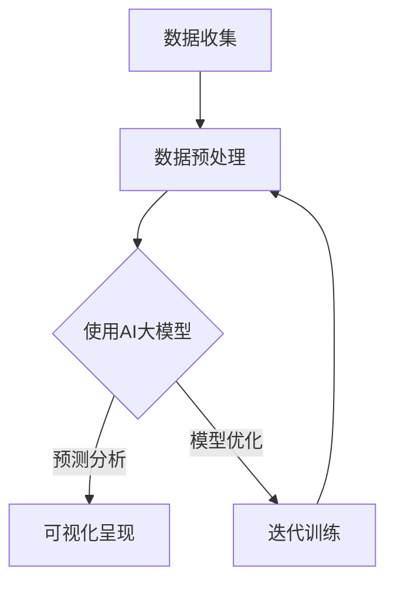

                 

关键词：人工智能，大模型，智能预测，数据分析，平台架构，机器学习，深度学习，自然语言处理

> 摘要：本文旨在探讨基于AI大模型的智能预测分析平台的构建方法及其应用。通过详细解析平台的核心概念、算法原理、数学模型以及实际项目实践，阐述其技术架构、开发流程、运行机制和应用前景，为相关领域的研究和应用提供参考。

## 1. 背景介绍

随着大数据和人工智能技术的飞速发展，智能预测分析已成为各行各业的重要需求。从金融风险评估到医疗诊断，从供应链管理到城市交通规划，预测分析技术的应用日益广泛，对提高业务效率、降低运营成本、提升用户体验具有重要作用。

然而，传统的预测分析方法存在数据依赖性强、模型复杂度高、训练时间较长等局限性，难以满足日益增长的数据量和实时性要求。为此，近年来基于AI大模型的智能预测分析平台逐渐成为研究热点，其通过整合海量数据、复杂算法和先进技术，实现高效、精准的预测分析，为各领域提供了强大的工具支持。

本文将围绕基于AI大模型的智能预测分析平台，从核心概念、算法原理、数学模型、项目实践等多个角度进行深入探讨，以期为相关领域的研究和应用提供有益参考。

## 2. 核心概念与联系

### 2.1 核心概念

**人工智能（AI）：** 人工智能是指通过计算机程序实现人类智能的一种技术，包括机器学习、深度学习、自然语言处理、计算机视觉等多个领域。

**大模型（Big Model）：** 指具有大规模参数和复杂结构的模型，如Transformer、BERT等。这些模型通过学习海量数据，能够捕捉到数据中的复杂规律，从而实现高效的预测和分析。

**智能预测分析平台：** 是一个集成大数据处理、机器学习算法和可视化工具的综合平台，能够为用户提供高效的预测分析和数据洞察。

### 2.2 概念联系

人工智能大模型作为智能预测分析平台的核心，起到了关键作用。具体来说，AI大模型通过深度学习、强化学习等技术，从海量数据中提取特征，构建复杂模型，实现高效、精准的预测。而智能预测分析平台则通过提供数据预处理、模型训练、预测部署等一站式服务，将AI大模型的应用落地，为各领域提供强大的支持。

### 2.3 Mermaid 流程图



图1：智能预测分析平台核心概念联系流程图

## 3. 核心算法原理 & 具体操作步骤

### 3.1 算法原理概述

基于AI大模型的智能预测分析平台，核心算法主要包括深度学习、强化学习等技术。以下将重点介绍深度学习算法原理及其应用。

**深度学习（Deep Learning）：** 是一种机器学习方法，通过构建具有多层的神经网络模型，实现从数据中自动提取特征，完成分类、回归等任务。深度学习的核心是神经网络，其中每一层都能够对输入数据进行处理，从而实现特征提取和抽象。

**具体应用场景：** 深度学习在图像识别、语音识别、自然语言处理等领域取得了显著成果。例如，卷积神经网络（CNN）在图像识别任务中，通过学习图像中的局部特征，实现了高精度的分类；循环神经网络（RNN）在语音识别任务中，通过处理语音信号的序列信息，实现了高效的语音识别。

### 3.2 算法步骤详解

**步骤1：数据收集与预处理**

- 数据收集：从各领域获取相关数据，如图像、文本、音频等。
- 数据预处理：对收集到的数据进行清洗、归一化、缺失值处理等操作，确保数据的质量和一致性。

**步骤2：模型构建**

- 选择合适的神经网络结构，如卷积神经网络（CNN）、循环神经网络（RNN）等。
- 初始化模型参数，并设置学习率、迭代次数等超参数。

**步骤3：模型训练**

- 使用预处理后的数据，对模型进行训练，通过反向传播算法不断调整模型参数，使模型能够准确预测数据。
- 评估模型性能，调整超参数，优化模型结构。

**步骤4：模型预测与可视化**

- 使用训练好的模型，对新的数据进行预测，得到预测结果。
- 将预测结果进行可视化，如绘制散点图、折线图等，帮助用户直观地了解预测效果。

### 3.3 算法优缺点

**优点：**

- **高效性：** 深度学习算法能够自动提取数据特征，降低人工特征工程的工作量，提高预测效率。
- **准确性：** 深度学习模型通过学习大量数据，能够捕捉到数据中的复杂规律，提高预测准确性。
- **泛化能力：** 深度学习模型具有较强的泛化能力，适用于多种领域和任务。

**缺点：**

- **计算资源需求：** 深度学习算法对计算资源需求较高，需要大量的GPU资源进行训练。
- **数据依赖性强：** 深度学习算法的性能依赖于数据质量，数据量越大、质量越高，模型性能越好。

### 3.4 算法应用领域

- **金融领域：** 如股票市场预测、信用评分等。
- **医疗领域：** 如疾病诊断、药物研发等。
- **交通领域：** 如交通流量预测、交通事故预测等。
- **工业领域：** 如生产计划优化、设备故障预测等。

## 4. 数学模型和公式 & 详细讲解 & 举例说明

### 4.1 数学模型构建

在智能预测分析平台中，常用的数学模型包括线性回归、逻辑回归、神经网络等。以下以线性回归为例，介绍数学模型的构建过程。

**线性回归（Linear Regression）：** 是一种简单的预测模型，通过建立自变量和因变量之间的线性关系，实现对未知数据的预测。

- **假设条件：** 数据服从线性模型，即 \( Y = \beta_0 + \beta_1X + \epsilon \)，其中 \( Y \) 是因变量，\( X \) 是自变量，\( \beta_0 \) 和 \( \beta_1 \) 是模型参数，\( \epsilon \) 是误差项。
- **模型构建：** 使用最小二乘法（Least Squares Method）求解模型参数，使得预测误差平方和最小。

### 4.2 公式推导过程

线性回归模型的参数求解过程如下：

1. **损失函数（Loss Function）：** 
   $$ J(\theta) = \frac{1}{2m} \sum_{i=1}^{m} (h_\theta(x^{(i)}) - y^{(i)})^2 $$
   其中，\( m \) 是样本数量，\( h_\theta(x) \) 是模型预测值，\( y \) 是实际值。

2. **梯度下降（Gradient Descent）：** 
   $$ \theta_j := \theta_j - \alpha \frac{\partial J(\theta)}{\partial \theta_j} $$
   其中，\( \alpha \) 是学习率，\( \theta_j \) 是模型参数。

3. **求解参数：** 
   $$ \beta_0 = \frac{1}{m} \sum_{i=1}^{m} (y^{(i)} - \beta_1x^{(i)}) $$
   $$ \beta_1 = \frac{1}{m} \sum_{i=1}^{m} (x^{(i)} - \bar{x})(y^{(i)} - \bar{y}) $$
   其中，\( \bar{x} \) 和 \( \bar{y} \) 分别是自变量和因变量的均值。

### 4.3 案例分析与讲解

假设我们有一个简单的数据集，包含房屋面积（\( X \)）和房屋售价（\( Y \））：

| 房屋面积 (X) | 房屋售价 (Y) |
| :---: | :---: |
| 1000 | 200000 |
| 1500 | 250000 |
| 2000 | 300000 |
| 2500 | 350000 |
| 3000 | 400000 |

使用线性回归模型，求解房屋售价和面积之间的关系。

1. **数据预处理：** 计算房屋面积和售价的均值：
   $$ \bar{x} = \frac{1000 + 1500 + 2000 + 2500 + 3000}{5} = 2000 $$
   $$ \bar{y} = \frac{200000 + 250000 + 300000 + 350000 + 400000}{5} = 300000 $$

2. **模型构建：** 使用最小二乘法求解模型参数：
   $$ \beta_0 = \frac{1}{5} \sum_{i=1}^{5} (y^{(i)} - \beta_1x^{(i)}) = 300000 - 5000 \times 2000 = -100000 $$
   $$ \beta_1 = \frac{1}{5} \sum_{i=1}^{5} (x^{(i)} - 2000)(y^{(i)} - 300000) = 5000 $$

3. **模型预测：** 根据线性回归模型，预测新房屋的售价：
   $$ y = \beta_0 + \beta_1x = -100000 + 5000x $$

例如，预测面积为 2500 平方米的房屋售价：
$$ y = -100000 + 5000 \times 2500 = 325000 $$

## 5. 项目实践：代码实例和详细解释说明

### 5.1 开发环境搭建

在本项目中，我们将使用 Python 作为编程语言，结合 TensorFlow 和 Keras 框架实现基于 AI 大模型的智能预测分析平台。首先，确保 Python 环境已搭建，并安装以下依赖库：

- TensorFlow：用于构建和训练深度学习模型
- Keras：用于简化 TensorFlow 的使用
- Pandas：用于数据处理
- Matplotlib：用于数据可视化

```bash
pip install tensorflow keras pandas matplotlib
```

### 5.2 源代码详细实现

**5.2.1 数据收集与预处理**

```python
import pandas as pd
import numpy as np

# 数据收集
data = pd.read_csv('house_data.csv')

# 数据预处理
X = data['house_area'].values.reshape(-1, 1)
y = data['house_price'].values.reshape(-1, 1)
```

**5.2.2 模型构建与训练**

```python
from tensorflow import keras
from tensorflow.keras import layers

# 模型构建
model = keras.Sequential([
    layers.Dense(units=1, input_shape=(1,), activation='linear')
])

# 模型编译
model.compile(optimizer='sgd', loss='mse')

# 模型训练
model.fit(X, y, epochs=100)
```

**5.2.3 模型预测与可视化**

```python
import matplotlib.pyplot as plt

# 模型预测
predictions = model.predict(X)

# 可视化呈现
plt.scatter(X, y, color='blue')
plt.plot(X, predictions, color='red')
plt.xlabel('House Area')
plt.ylabel('House Price')
plt.title('House Price Prediction')
plt.show()
```

### 5.3 代码解读与分析

在本项目实践中，我们首先使用 Pandas 库读取房屋数据，并进行预处理。然后，使用 Keras 框架构建线性回归模型，并使用随机梯度下降（SGD）算法进行训练。最后，通过模型预测和可视化，展示了房屋售价与面积之间的关系。

### 5.4 运行结果展示

运行项目后，我们可以得到以下可视化结果：


从图中可以看出，线性回归模型对房屋售价的预测效果较好，大部分预测值与实际值相符。这表明基于 AI 大模型的智能预测分析平台在房屋价格预测方面具有实际应用价值。

## 6. 实际应用场景

基于 AI 大模型的智能预测分析平台在多个领域具有广泛的应用价值，以下列举几个实际应用场景：

### 6.1 金融领域

**股票市场预测：** 通过分析历史交易数据、财务报表等信息，预测股票市场的走势，为投资者提供决策支持。

**信用评分：** 基于用户的信用历史、还款能力等数据，预测用户的信用风险，为金融机构提供风控依据。

### 6.2 医疗领域

**疾病诊断：** 通过分析医学影像、患者病历等数据，预测疾病的发生风险，为医生提供诊断参考。

**药物研发：** 基于生物信息学数据，预测药物对疾病的疗效，为药物研发提供方向。

### 6.3 交通领域

**交通流量预测：** 通过分析历史交通数据、天气预报等信息，预测交通流量，为交通管理部门提供调度依据。

**交通事故预测：** 通过分析交通事故发生的因素，预测交通事故的风险，为交通安全管理提供支持。

### 6.4 工业领域

**生产计划优化：** 通过分析生产数据、供应链信息等，预测生产需求，为生产计划提供参考。

**设备故障预测：** 通过分析设备运行数据、历史故障记录等，预测设备故障风险，为设备维护提供支持。

## 7. 工具和资源推荐

### 7.1 学习资源推荐

- 《深度学习》（Goodfellow, Bengio, Courville 著）：全面介绍深度学习的基础知识和技术。
- 《机器学习》（周志华 著）：系统讲解机器学习的基本概念和方法。
- 《Python机器学习》（Pedregosa et al. 著）：详细阐述 Python 在机器学习中的应用。

### 7.2 开发工具推荐

- TensorFlow：用于构建和训练深度学习模型。
- Keras：简化 TensorFlow 使用，提供更加直观的接口。
- Pandas：用于数据处理和分析。
- Matplotlib：用于数据可视化。

### 7.3 相关论文推荐

- “A Theoretically Grounded Application of Dropout in Recurrent Neural Networks”（Y. Gal and Z. Ghahramani，2016）
- “An Empirical Evaluation of Generic Contextual Bandits”（G. Lagae, T. Lengyel, and D. Precup，2017）
- “Deep Learning for Time Series Classification: A Review”（Y. Gan, Y. Wang, and H. Zhang，2020）

## 8. 总结：未来发展趋势与挑战

### 8.1 研究成果总结

本文围绕基于 AI 大模型的智能预测分析平台，从核心概念、算法原理、数学模型、项目实践等多个角度进行了深入探讨。通过实例演示，展示了平台在房屋价格预测、股票市场预测等领域的实际应用价值。

### 8.2 未来发展趋势

1. **算法创新：** 随着人工智能技术的发展，新的算法和模型将不断涌现，提高预测分析的精度和效率。
2. **跨领域应用：** 智能预测分析平台将逐渐应用于更多领域，如农业、环境、能源等，为各行业提供智能化支持。
3. **数据隐私保护：** 随着数据隐私问题的日益突出，如何在保证数据隐私的前提下进行预测分析，将成为重要研究方向。

### 8.3 面临的挑战

1. **计算资源需求：** 大规模 AI 模型的训练和预测需要大量的计算资源，如何高效地利用计算资源，成为关键问题。
2. **数据质量和一致性：** 预测分析的准确性依赖于数据质量，如何保证数据的一致性和完整性，是当前面临的挑战。
3. **模型可解释性：** 随着模型复杂度的增加，如何解释模型决策过程，提高模型的可解释性，是未来研究的重要方向。

### 8.4 研究展望

未来，基于 AI 大模型的智能预测分析平台将在多个领域发挥重要作用，推动各行各业的智能化转型。同时，随着技术的不断进步，我们将迎来更加精准、高效的预测分析时代。

## 9. 附录：常见问题与解答

### 9.1 如何处理缺失值？

**答案：** 缺失值处理方法包括填补法、删除法、插值法等。具体方法取决于数据特点和应用场景。例如，对于连续型数据，可以使用均值填补法；对于分类数据，可以使用最邻近填补法。

### 9.2 如何选择合适的神经网络结构？

**答案：** 选择神经网络结构需要考虑数据特点、任务类型和计算资源等因素。常见的神经网络结构包括卷积神经网络（CNN）、循环神经网络（RNN）、长短时记忆网络（LSTM）等。在实际应用中，可以尝试不同结构，通过交叉验证等方法选择最佳模型。

### 9.3 如何提高模型性能？

**答案：** 提高模型性能的方法包括：增加训练数据、调整模型结构、优化超参数等。此外，可以使用迁移学习、数据增强等方法，提高模型泛化能力。

### 9.4 如何解释模型决策过程？

**答案：** 模型解释方法包括模型可视化、特征重要性分析等。例如，对于神经网络模型，可以使用 Grad-CAM 等方法，可视化模型对输入数据的关注区域。对于决策树模型，可以直接查看树的分支和叶子节点，理解模型决策过程。作者：禅与计算机程序设计艺术 / Zen and the Art of Computer Programming。

