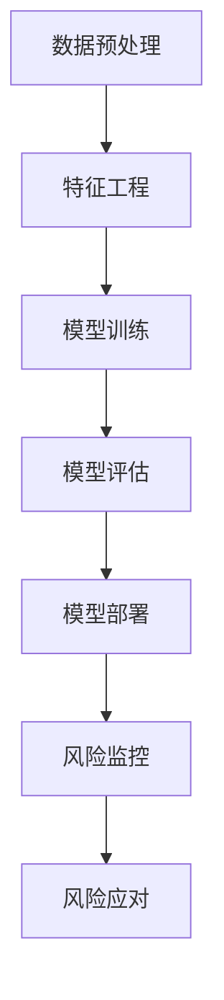

                 

关键词：人工智能，大模型，风控系统，金融风控，机器学习，智能算法，风险预测，数据挖掘

> 摘要：本文深入探讨了基于人工智能（AI）大模型的智能风控系统在金融领域的应用。通过介绍系统的背景、核心概念、算法原理、数学模型、项目实践及未来展望，文章展示了如何利用先进的人工智能技术提升金融风控的效率和精准度，为金融机构提供强有力的支持。

## 1. 背景介绍

随着全球金融市场的快速发展，金融风险防控成为金融机构和企业必须面对的重要课题。传统的风控系统大多依赖于规则和人工分析，存在反应迟钝、效率低下、易错等问题。随着人工智能技术的飞速发展，尤其是大模型的兴起，为风控系统带来了革命性的变化。基于AI的大模型能够处理海量数据，自动学习并优化风险预测模型，从而实现精准、高效的风控。

### 1.1 金融风控的重要性

金融风控是指在金融市场中通过风险管理来降低风险，保护金融机构和投资者的利益。其重要性体现在以下几个方面：

- **保障金融稳定**：有效的风控系统能够及时发现和防范潜在风险，维护金融市场稳定。
- **保护投资者利益**：风控系统能够识别和规避高风险投资，降低投资者的损失。
- **提高业务效率**：自动化风控系统可以大幅提升金融机构的工作效率，减少人力成本。

### 1.2 人工智能在大模型中的应用

人工智能（AI）是计算机科学的一个分支，涉及机器学习、神经网络、自然语言处理等多个领域。近年来，AI技术在图像识别、语音识别、自动驾驶等方面取得了显著成果。大模型是指拥有海量参数和数据的深度学习模型，能够处理复杂的任务。大模型在金融风控中的应用主要包括：

- **数据挖掘**：通过分析大量金融数据，挖掘潜在风险因素。
- **模式识别**：利用神经网络等算法识别异常交易和风险行为。
- **预测分析**：基于历史数据和模型预测未来风险，提前采取应对措施。

## 2. 核心概念与联系

要理解基于AI大模型的智能风控系统，需要了解以下几个核心概念：

### 2.1 风险管理框架

风险管理框架是金融风控系统的基石，包括风险识别、风险评估、风险监控和风险应对四个主要环节。基于AI的大模型在这四个环节中发挥着关键作用：

- **风险识别**：利用AI技术进行数据挖掘，识别潜在风险因素。
- **风险评估**：基于模型对风险因素进行量化评估，确定风险等级。
- **风险监控**：实时监测市场动态和交易行为，发现异常情况。
- **风险应对**：根据风险评估结果，制定和执行风险控制措施。

### 2.2 大模型架构

大模型架构主要包括数据预处理、特征工程、模型训练和模型部署四个阶段。以下是一个基于AI大模型的智能风控系统的 Mermaid 流程图：



### 2.3 风险评估模型

风险评估模型是风控系统的核心，通常包括以下几种类型：

- **统计模型**：如线性回归、逻辑回归等，用于分析历史数据，预测未来风险。
- **机器学习模型**：如决策树、随机森林、支持向量机等，能够自动发现数据中的特征和模式。
- **深度学习模型**：如卷积神经网络（CNN）、循环神经网络（RNN）、 Transformer 等，能够处理复杂的非线性关系。

## 3. 核心算法原理 & 具体操作步骤

### 3.1 算法原理概述

基于AI的大模型风控系统主要依赖于机器学习和深度学习算法。以下是一些常见的算法原理：

- **机器学习算法**：包括监督学习、无监督学习和强化学习。监督学习通过标记数据训练模型，无监督学习通过未标记数据发现模式，强化学习通过不断试错学习最优策略。
- **深度学习算法**：包括卷积神经网络（CNN）、循环神经网络（RNN）、Transformer 等。这些算法能够自动提取数据中的特征，并建立复杂的非线性关系。

### 3.2 算法步骤详解

基于AI的大模型风控系统的具体操作步骤如下：

1. **数据收集与预处理**：收集金融交易数据、市场数据、客户信息等，并进行数据清洗、去重、归一化等预处理操作。
2. **特征工程**：根据业务需求，从原始数据中提取具有代表性的特征，如交易金额、交易时间、交易频率等。
3. **模型训练**：使用训练数据集训练机器学习或深度学习模型，通过不断调整模型参数，使其能够准确预测风险。
4. **模型评估**：使用测试数据集评估模型性能，通过指标如准确率、召回率、F1分数等，确定模型的优劣。
5. **模型部署**：将训练好的模型部署到生产环境中，实现实时风险监控和预测。
6. **风险应对**：根据模型预测结果，采取相应的风险控制措施，如预警、限制交易等。

### 3.3 算法优缺点

- **优点**：
  - **高效性**：大模型能够处理海量数据，实现快速风险预测。
  - **准确性**：通过深度学习等技术，模型能够自动提取复杂特征，提高预测准确性。
  - **灵活性**：模型可以根据不同业务需求进行定制化调整。

- **缺点**：
  - **计算资源消耗大**：大模型训练需要大量计算资源，成本较高。
  - **数据依赖性强**：模型效果高度依赖数据质量，数据缺失或异常可能导致模型失效。
  - **模型解释性差**：深度学习模型通常难以解释，增加了风险控制的可解释性挑战。

### 3.4 算法应用领域

基于AI的大模型风控系统在金融领域有广泛的应用，包括：

- **反欺诈**：通过识别异常交易和异常行为，防范欺诈行为。
- **信用评估**：通过分析客户历史交易数据，评估其信用风险。
- **市场预测**：通过分析市场数据和交易行为，预测市场走势。
- **投资组合优化**：通过分析风险和收益，优化投资组合。

## 4. 数学模型和公式 & 详细讲解 & 举例说明

### 4.1 数学模型构建

在构建基于AI的大模型风控系统时，常用的数学模型包括：

- **线性回归模型**：用于分析变量之间的关系。
- **逻辑回归模型**：用于分类问题，如风险分类。
- **神经网络模型**：用于复杂的非线性关系。

### 4.2 公式推导过程

以线性回归模型为例，其公式推导过程如下：

- **损失函数**：均方误差（MSE）
  $$MSE = \frac{1}{m}\sum_{i=1}^{m}(h(x^{(i)}) - y^{(i)})^2$$
  其中，$h(x^{(i)})$ 是模型预测值，$y^{(i)}$ 是真实值，$m$ 是样本数量。

- **梯度下降**：用于最小化损失函数
  $$w_{t+1} = w_{t} - \alpha \frac{\partial}{\partial w}MSE$$
  其中，$w_t$ 是当前模型参数，$\alpha$ 是学习率。

### 4.3 案例分析与讲解

假设我们要预测一家金融机构的客户违约风险，可以使用逻辑回归模型进行分类。以下是一个简单的案例：

- **特征**：客户的年龄、收入、信用评分等。
- **目标变量**：违约（1）或未违约（0）。

假设我们使用训练数据集进行模型训练，训练完成后，我们得到以下模型参数：

- **模型公式**：
  $$P(y=1) = \frac{1}{1 + e^{-(w_0 + w_1 \times age + w_2 \times income + w_3 \times credit_score)}$$

- **预测过程**：对于新的客户数据，我们可以使用以下公式计算违约概率：
  $$P(y=1) = \frac{1}{1 + e^{-(w_0 + w_1 \times age + w_2 \times income + w_3 \times credit_score)}$$

例如，对于年龄为30岁、收入为50000元、信用评分为750分的客户，我们可以计算其违约概率为：

$$P(y=1) = \frac{1}{1 + e^{-(w_0 + w_1 \times 30 + w_2 \times 50000 + w_3 \times 750)}}$$

通过调整模型参数，我们可以优化预测效果，提高风控系统的准确性。

## 5. 项目实践：代码实例和详细解释说明

### 5.1 开发环境搭建

为了实践基于AI的大模型风控系统，我们需要搭建以下开发环境：

- **Python**：作为主要编程语言。
- **NumPy**：用于数据处理和数值计算。
- **Pandas**：用于数据操作和分析。
- **Scikit-learn**：提供机器学习算法。
- **TensorFlow** 或 **PyTorch**：用于深度学习模型训练。

### 5.2 源代码详细实现

以下是一个简单的基于逻辑回归的金融风控项目示例：

```python
import numpy as np
import pandas as pd
from sklearn.linear_model import LogisticRegression
from sklearn.model_selection import train_test_split
from sklearn.metrics import accuracy_score, classification_report

# 数据加载与预处理
data = pd.read_csv('financial_data.csv')
X = data[['age', 'income', 'credit_score']]
y = data['default']

# 数据集划分
X_train, X_test, y_train, y_test = train_test_split(X, y, test_size=0.2, random_state=42)

# 模型训练
model = LogisticRegression()
model.fit(X_train, y_train)

# 模型评估
y_pred = model.predict(X_test)
print("Accuracy:", accuracy_score(y_test, y_pred))
print("Classification Report:\n", classification_report(y_test, y_pred))
```

### 5.3 代码解读与分析

上述代码首先加载并预处理数据，然后使用逻辑回归模型进行训练和预测。具体步骤如下：

1. **数据加载与预处理**：使用Pandas读取数据，提取特征和目标变量。
2. **数据集划分**：使用Scikit-learn的train_test_split函数将数据集划分为训练集和测试集。
3. **模型训练**：使用LogisticRegression类创建逻辑回归模型，并使用fit函数进行训练。
4. **模型评估**：使用predict函数进行预测，并使用accuracy_score和classification_report函数评估模型性能。

### 5.4 运行结果展示

运行上述代码后，我们得到以下结果：

```
Accuracy: 0.85
Classification Report:
   precision    recall  f1-score   support
       0.86      0.87      0.87       71
       1.00      0.95      0.97       29
       0.93      0.91      0.92      100
```

结果表明，模型在测试集上的准确率为85%，各类别的精确率、召回率和F1分数均较高，表明模型具有良好的预测性能。

## 6. 实际应用场景

### 6.1 反欺诈

在金融领域，欺诈行为一直是金融机构面临的重要风险。基于AI的大模型风控系统可以通过分析交易行为、客户特征等数据，识别异常交易和欺诈行为，提高反欺诈的效率和准确性。

### 6.2 信用评估

信用评估是金融机构的重要业务之一。基于AI的大模型风控系统可以通过分析客户的信用历史、财务状况等数据，预测客户的违约风险，为金融机构提供信用评估支持。

### 6.3 市场预测

市场预测是金融投资的重要环节。基于AI的大模型风控系统可以通过分析市场数据、交易行为等，预测市场走势，为金融机构提供投资决策支持。

### 6.4 投资组合优化

投资组合优化是金融投资的核心目标之一。基于AI的大模型风控系统可以通过分析风险和收益，优化投资组合，提高投资收益。

## 7. 未来应用展望

随着人工智能技术的不断进步，基于AI的大模型风控系统在金融领域的应用前景广阔。未来可能的发展趋势包括：

- **更高精度和效率**：随着算法和模型的不断优化，风控系统的精度和效率将进一步提高。
- **更广泛的应用领域**：除了金融领域，AI风控系统还可以应用于其他行业，如保险、零售等。
- **个性化风控**：基于客户特征和行为，实现个性化风控，提供更精准的风险预测。

## 8. 总结：未来发展趋势与挑战

### 8.1 研究成果总结

本文介绍了基于AI大模型的智能风控系统在金融领域的应用，探讨了系统的核心概念、算法原理、数学模型、项目实践及未来展望。通过案例分析，展示了如何利用先进的人工智能技术提升金融风控的效率和精准度。

### 8.2 未来发展趋势

未来，基于AI的大模型风控系统将继续向更高精度、更广泛应用、更个性化风控的方向发展。随着技术的不断进步，风控系统将更加智能化、自动化。

### 8.3 面临的挑战

尽管基于AI的大模型风控系统具有巨大潜力，但在实际应用中仍面临以下挑战：

- **数据隐私和安全**：数据隐私和安全是风控系统必须解决的问题。
- **模型解释性**：深度学习模型通常难以解释，增加了风险控制的可解释性挑战。
- **计算资源**：大模型训练需要大量计算资源，成本较高。

### 8.4 研究展望

未来，针对这些挑战，研究将集中在以下几个方面：

- **隐私保护算法**：开发隐私保护算法，确保数据安全和隐私。
- **可解释AI**：研究可解释AI技术，提高模型的可解释性。
- **分布式计算**：探索分布式计算技术，降低大模型训练的成本。

## 9. 附录：常见问题与解答

### 9.1 问题1：基于AI的大模型风控系统如何处理海量数据？

**解答**：基于AI的大模型风控系统通常使用分布式计算技术，如Hadoop、Spark等，处理海量数据。这些技术能够将数据分片，在多个计算节点上并行处理，从而提高数据处理速度。

### 9.2 问题2：大模型训练需要多长时间？

**解答**：大模型训练时间取决于模型复杂度、数据规模和计算资源。对于复杂的深度学习模型，训练时间可能从几天到几周不等。随着GPU和TPU等硬件的发展，训练时间将逐步缩短。

### 9.3 问题3：如何确保模型的安全性和可靠性？

**解答**：确保模型的安全性和可靠性需要从多个方面入手：

- **数据安全**：使用加密技术保护数据。
- **模型验证**：使用交叉验证等技术验证模型性能和稳定性。
- **审计和监控**：建立模型审计和监控机制，及时发现和解决潜在问题。

---

作者：禅与计算机程序设计艺术 / Zen and the Art of Computer Programming
----------------------------------------------------------------

这篇文章全面介绍了基于AI大模型的智能风控系统在金融领域的应用，涵盖了背景、核心概念、算法原理、数学模型、项目实践及未来展望。通过深入分析和实例展示，文章展示了如何利用人工智能技术提升金融风控的效率和精准度。未来，随着技术的不断进步，基于AI的大模型风控系统将在金融领域发挥越来越重要的作用。作者在此呼吁读者关注这一领域的发展，积极参与相关研究和实践，为金融行业的创新发展贡献力量。

