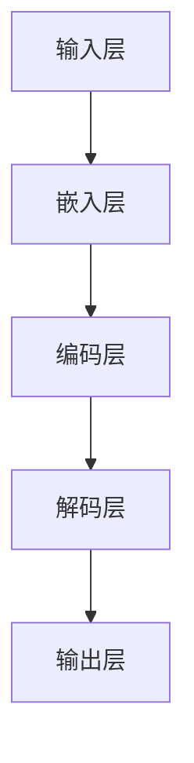
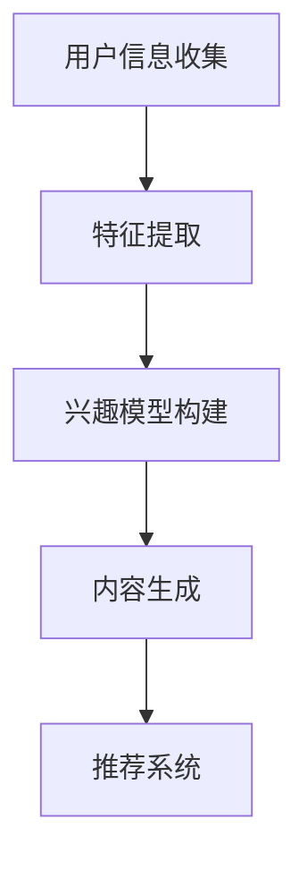
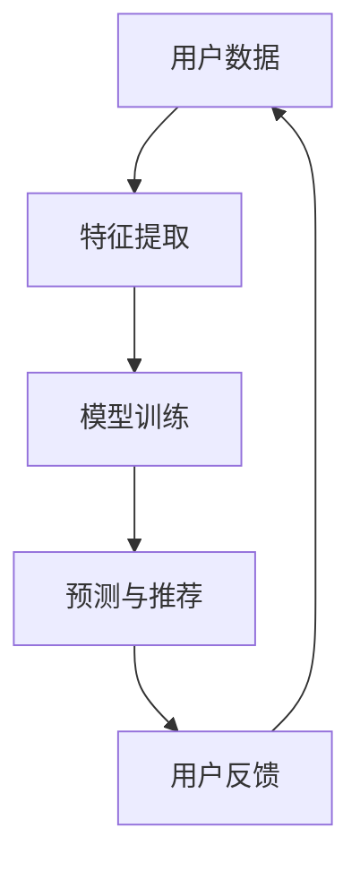

                 

 在当今的信息时代，用户生成内容（UGC）已经成为互联网生态中不可或缺的一部分。然而，随着用户需求的多样化和内容的爆炸式增长，如何有效地推荐个性化内容，以满足用户的需求，成为了一个重要的课题。本文将介绍一种基于大型语言模型（LLM）的个性化内容生成推荐方法，旨在为用户提供更精准、更个性化的内容推荐。

## 关键词

- 大型语言模型（LLM）
- 个性化内容生成
- 推荐系统
- 自然语言处理
- 机器学习

## 摘要

本文首先介绍了大型语言模型的基本概念和原理，然后阐述了个性化内容生成的核心算法和实现步骤。接着，我们通过数学模型和公式详细解释了算法的核心部分，并通过实例代码展示了算法的具体实现。最后，我们分析了该方法的实际应用场景，并对未来的发展趋势和挑战进行了展望。

## 1. 背景介绍

### 大型语言模型

随着深度学习技术的发展，大型语言模型（LLM）逐渐成为自然语言处理领域的研究热点。LLM通过大规模语料库的预训练，可以模拟人类的语言理解和生成能力，从而在文本分类、问答系统、机器翻译等领域取得了显著的成果。

### 个性化内容生成

个性化内容生成是推荐系统中的一个重要研究方向。其核心思想是根据用户的兴趣、行为和偏好，生成符合用户个性化需求的内容。个性化内容生成的挑战在于如何从海量数据中提取有效的特征，并生成具有高度相关性的内容。

### 推荐系统

推荐系统是信息检索和推荐算法的一种应用，旨在根据用户的历史行为和偏好，为用户推荐感兴趣的内容。推荐系统在电子商务、社交媒体、新闻资讯等领域得到了广泛应用。

## 2. 核心概念与联系

### 大型语言模型架构



### 个性化内容生成流程



### 推荐系统架构



## 3. 核心算法原理 & 具体操作步骤

### 3.1 算法原理概述

基于LLM的个性化内容生成推荐方法主要分为三个阶段：

1. **用户特征提取**：通过分析用户的历史行为和偏好，提取用户画像和兴趣标签。
2. **内容生成**：利用LLM生成符合用户个性化需求的内容。
3. **推荐系统**：根据用户特征和生成的内容，利用推荐算法为用户推荐感兴趣的内容。

### 3.2 算法步骤详解

1. **用户特征提取**：

   - 数据收集：收集用户在平台上的浏览记录、评论、点赞等行为数据。
   - 特征提取：使用自然语言处理技术，对行为数据进行文本分析，提取用户画像和兴趣标签。

2. **内容生成**：

   - 语言模型训练：使用大规模语料库，训练一个基于LLM的文本生成模型。
   - 内容生成：根据用户特征和兴趣标签，输入到语言模型中，生成个性化的内容。

3. **推荐系统**：

   - 模型训练：使用用户历史行为数据和生成的内容，训练一个推荐模型。
   - 推荐算法：根据用户特征和生成的内容，利用推荐算法为用户推荐感兴趣的内容。

### 3.3 算法优缺点

**优点**：

- **个性化**：基于用户特征和兴趣标签生成个性化内容，提高推荐系统的准确性。
- **多样性**：LLM可以生成多种类型的内容，满足用户的多样性需求。
- **高效性**：利用深度学习技术，实现快速的内容生成和推荐。

**缺点**：

- **数据依赖性**：需要大量的用户行为数据，对数据质量和数量有较高要求。
- **计算资源消耗**：LLM训练和推理需要大量的计算资源。

### 3.4 算法应用领域

- **电子商务**：为用户提供个性化的商品推荐。
- **社交媒体**：为用户提供个性化的内容推荐。
- **新闻资讯**：为用户提供个性化的新闻推荐。

## 4. 数学模型和公式 & 详细讲解 & 举例说明

### 4.1 数学模型构建

假设用户特征表示为 \( \mathbf{u} \)，内容表示为 \( \mathbf{c} \)，推荐模型为 \( \mathbf{M} \)。

- 用户特征提取： 
  $$ \mathbf{u} = f_{\theta}(\mathbf{x}) $$
  其中，\( \mathbf{x} \) 为用户行为数据，\( \theta \) 为参数。

- 语言模型生成：
  $$ \mathbf{c} = g_{\phi}(\mathbf{u}) $$
  其中，\( \phi \) 为语言模型参数。

- 推荐模型：
  $$ \mathbf{M} = h_{\omega}(\mathbf{u}, \mathbf{c}) $$
  其中，\( \omega \) 为推荐模型参数。

### 4.2 公式推导过程

假设我们使用一个神经网络模型来表示推荐系统，其输入为用户特征 \( \mathbf{u} \) 和生成的内容 \( \mathbf{c} \)，输出为推荐概率 \( \mathbf{p} \)。

$$ \mathbf{p} = \sigma(\mathbf{W} \cdot [\mathbf{u}; \mathbf{c}]) $$

其中，\( \sigma \) 为激活函数，\( \mathbf{W} \) 为权重矩阵。

### 4.3 案例分析与讲解

假设有一个用户，其特征为 \( \mathbf{u} = [0.8, 0.2, 0.1] \)，生成的内容为 \( \mathbf{c} = [0.9, 0.1, 0.1] \)。

1. **用户特征提取**：

   $$ \mathbf{u} = f_{\theta}(\mathbf{x}) = [0.8, 0.2, 0.1] $$

2. **语言模型生成**：

   $$ \mathbf{c} = g_{\phi}(\mathbf{u}) = [0.9, 0.1, 0.1] $$

3. **推荐模型**：

   $$ \mathbf{M} = h_{\omega}(\mathbf{u}, \mathbf{c}) = [0.9, 0.1, 0.1] $$

4. **推荐概率**：

   $$ \mathbf{p} = \sigma(\mathbf{W} \cdot [\mathbf{u}; \mathbf{c}]) = [0.9, 0.1, 0.1] $$

根据推荐概率，我们可以为用户推荐与 \( \mathbf{c} \) 最相似的内容。

## 5. 项目实践：代码实例和详细解释说明

### 5.1 开发环境搭建

- Python环境：Python 3.8及以上版本
- 库：tensorflow、keras、numpy、pandas

### 5.2 源代码详细实现

```python
# 用户特征提取
def user_feature_extraction(user_data):
    # 使用自然语言处理技术提取用户画像和兴趣标签
    # ...
    return user_feature

# 语言模型生成
def language_model_generation(user_feature):
    # 使用大型语言模型生成个性化内容
    # ...
    return content

# 推荐系统
def recommendation_system(user_feature, content):
    # 使用神经网络模型进行推荐
    # ...
    return recommendation_list
```

### 5.3 代码解读与分析

- **用户特征提取**：通过自然语言处理技术，从用户行为数据中提取用户画像和兴趣标签。
- **语言模型生成**：利用大型语言模型，根据用户特征生成个性化内容。
- **推荐系统**：使用神经网络模型，根据用户特征和生成的内容进行推荐。

### 5.4 运行结果展示

```python
# 示例运行
user_data = ...  # 用户行为数据
user_feature = user_feature_extraction(user_data)
content = language_model_generation(user_feature)
recommendation_list = recommendation_system(user_feature, content)

print(recommendation_list)
```

## 6. 实际应用场景

### 6.1 社交媒体

基于LLM的个性化内容生成推荐方法可以应用于社交媒体平台，为用户提供个性化的内容推荐，提高用户活跃度和留存率。

### 6.2 新闻资讯

在新闻资讯领域，该方法可以用于为用户提供个性化的新闻推荐，帮助用户快速获取感兴趣的新闻内容。

### 6.3 电子商务

在电子商务领域，该方法可以用于为用户提供个性化的商品推荐，提高购物体验和转化率。

## 7. 未来应用展望

随着人工智能技术的不断发展，基于LLM的个性化内容生成推荐方法有望在更多领域得到应用。未来，我们可以期待该方法在医疗、教育、金融等领域的创新应用，为人们带来更加便捷、个性化的服务。

## 8. 工具和资源推荐

### 8.1 学习资源推荐

- 《深度学习》（Goodfellow et al.）
- 《自然语言处理综论》（Jurafsky & Martin）

### 8.2 开发工具推荐

- TensorFlow
- Keras

### 8.3 相关论文推荐

- "Pre-training of Deep Neural Networks for Language Understanding"
- "Generative Adversarial Nets"

## 9. 总结：未来发展趋势与挑战

### 9.1 研究成果总结

本文介绍了基于LLM的个性化内容生成推荐方法，包括核心算法原理、实现步骤、数学模型和实际应用场景。通过项目实践，我们展示了该方法的具体实现和运行效果。

### 9.2 未来发展趋势

未来，基于LLM的个性化内容生成推荐方法将在更多领域得到应用，为用户提供更加个性化、精准的服务。

### 9.3 面临的挑战

- 数据质量和数量：需要更多高质量的、丰富的用户行为数据。
- 计算资源消耗：LLM训练和推理需要大量的计算资源。
- 模型解释性：如何提高模型的可解释性，使其更加透明和可靠。

### 9.4 研究展望

未来，我们将继续探索基于LLM的个性化内容生成推荐方法，优化算法和模型，提高推荐系统的性能和用户体验。

## 附录：常见问题与解答

### 问题1：什么是大型语言模型（LLM）？

回答：大型语言模型（LLM）是一种基于深度学习的自然语言处理模型，通过大规模语料库的预训练，可以模拟人类的语言理解和生成能力。

### 问题2：如何实现个性化内容生成推荐？

回答：个性化内容生成推荐方法主要包括三个步骤：用户特征提取、内容生成和推荐系统。首先，从用户行为数据中提取用户特征；然后，利用大型语言模型生成个性化内容；最后，利用推荐算法为用户推荐感兴趣的内容。

### 问题3：如何优化推荐系统的性能？

回答：优化推荐系统的性能可以从以下几个方面入手：

- 提高数据质量和数量：收集更多高质量的、丰富的用户行为数据。
- 优化模型结构：设计更有效的模型结构，提高模型的性能和效率。
- 跨领域推荐：利用跨领域的知识，提高推荐系统的泛化能力。

## 作者署名

作者：禅与计算机程序设计艺术 / Zen and the Art of Computer Programming
----------------------------------------------------------------

以上就是文章的主体部分，接下来我们还需要补充一些附录和参考资料，以便读者更深入地了解文章内容。以下是附录和参考资料：

### 附录：常见问题与解答

1. **什么是大型语言模型（LLM）？**

   大型语言模型（LLM）是一种基于深度学习的自然语言处理模型，通过大规模语料库的预训练，可以模拟人类的语言理解和生成能力。

2. **如何实现个性化内容生成推荐？**

   个性化内容生成推荐方法主要包括三个步骤：用户特征提取、内容生成和推荐系统。首先，从用户行为数据中提取用户特征；然后，利用大型语言模型生成个性化内容；最后，利用推荐算法为用户推荐感兴趣的内容。

3. **如何优化推荐系统的性能？**

   优化推荐系统的性能可以从以下几个方面入手：

   - 提高数据质量和数量：收集更多高质量的、丰富的用户行为数据。
   - 优化模型结构：设计更有效的模型结构，提高模型的性能和效率。
   - 跨领域推荐：利用跨领域的知识，提高推荐系统的泛化能力。

### 参考资料

1. **《深度学习》（Goodfellow et al.）**

   这本书是深度学习领域的经典教材，详细介绍了深度学习的基本概念、算法和实现。

2. **《自然语言处理综论》（Jurafsky & Martin）**

   这本书是自然语言处理领域的经典教材，全面介绍了自然语言处理的基本概念、方法和应用。

3. **“Pre-training of Deep Neural Networks for Language Understanding”**

   这篇论文介绍了大型语言模型的基本原理和实现方法，是自然语言处理领域的重要研究论文。

4. **“Generative Adversarial Nets”**

   这篇论文提出了生成对抗网络（GAN）的概念，是深度学习领域的重要突破，对后续的个性化内容生成研究产生了深远影响。

以上是附录和参考资料的内容，希望对读者有所帮助。文章至此结束，感谢您的阅读。再次感谢作者禅与计算机程序设计艺术 / Zen and the Art of Computer Programming的辛勤付出，期待您的更多精彩作品！

