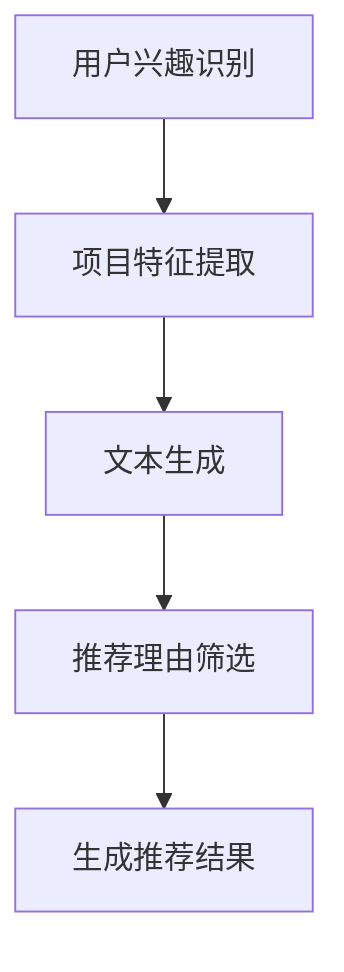

                 

关键词：自然语言处理，生成式推荐系统，语言模型，推理机制，文本生成，用户体验

摘要：本文探讨了基于大型语言模型（LLM）的推荐理由生成方法，通过结合自然语言处理技术和深度学习算法，构建了一种高效的推荐理由生成模型。文章首先介绍了推荐理由生成在生成式推荐系统中的重要性，然后详细阐述了基于LLM的推荐理由生成方法，包括核心算法原理、数学模型、具体实现以及实际应用场景。最后，文章对未来的研究方向和挑战进行了展望。

## 1. 背景介绍

### 1.1 生成式推荐系统

随着互联网的快速发展，个性化推荐系统已经成为许多在线平台的核心功能。传统推荐系统主要基于协同过滤、内容过滤等方法，虽然在一定程度上能够满足用户的个性化需求，但往往存在推荐结果单一、缺乏解释性等问题。为了解决这些问题，生成式推荐系统应运而生。

生成式推荐系统通过生成用户感兴趣的内容或项目，从而实现个性化的推荐。这种方法具有高度的灵活性和解释性，能够更好地满足用户的多样化需求。生成式推荐系统的核心在于生成高质量的推荐理由，以便为用户提供清晰的决策依据。

### 1.2 自然语言处理技术

自然语言处理（NLP）是计算机科学和人工智能领域的一个重要分支，旨在使计算机能够理解、生成和处理人类自然语言。NLP技术广泛应用于信息检索、机器翻译、情感分析、文本生成等领域。

在生成式推荐系统中，NLP技术主要用于文本生成和推理。通过NLP技术，可以将用户兴趣、项目特征等信息转化为自然语言形式的推荐理由，从而提高推荐系统的用户体验。

### 1.3 大型语言模型

近年来，大型语言模型（LLM）在自然语言处理领域取得了显著进展。LLM通过深度学习算法对大规模语料库进行训练，从而具备强大的语言理解、生成和推理能力。常见的LLM包括GPT、BERT、T5等。

LLM在生成式推荐系统中具有广泛的应用前景。一方面，LLM能够生成高质量的自然语言文本，从而提高推荐理由的多样性和丰富性；另一方面，LLM的推理机制能够对用户兴趣和项目特征进行深度分析，从而实现更精准的个性化推荐。

## 2. 核心概念与联系

### 2.1 LLM的结构与原理

#### 2.1.1 LLM的基本架构

大型语言模型（LLM）通常由编码器（Encoder）和解码器（Decoder）组成。编码器负责将输入文本转化为固定长度的向量表示，解码器则根据编码器生成的向量表示生成输出文本。


#### 2.1.2 LLM的工作原理

LLM的工作原理主要基于以下步骤：

1. 编码器将输入文本转化为向量表示，通常采用词嵌入（Word Embedding）技术。
2. 编码器将向量表示传递给解码器。
3. 解码器根据向量表示生成输出文本，采用基于注意力机制的序列生成模型（如Transformer）。


### 2.2 推荐理由生成的流程

基于LLM的推荐理由生成流程主要包括以下步骤：

1. **用户兴趣识别**：通过分析用户历史行为、搜索记录等数据，识别用户的兴趣点。
2. **项目特征提取**：对推荐项目进行特征提取，包括内容、标签、属性等。
3. **文本生成**：利用LLM生成推荐理由，将用户兴趣和项目特征转化为自然语言文本。
4. **推荐理由筛选**：根据用户兴趣和项目特征，对生成的推荐理由进行筛选和排序。


### 2.3 Mermaid流程图



## 3. 核心算法原理 & 具体操作步骤

### 3.1 算法原理概述

基于LLM的推荐理由生成算法主要利用大型语言模型（LLM）的强大语言理解和生成能力，将用户兴趣和项目特征转化为自然语言形式的推荐理由。具体来说，算法分为以下三个阶段：

1. **用户兴趣识别**：通过分析用户历史行为、搜索记录等数据，识别用户的兴趣点。
2. **项目特征提取**：对推荐项目进行特征提取，包括内容、标签、属性等。
3. **文本生成**：利用LLM生成推荐理由，将用户兴趣和项目特征转化为自然语言文本。

### 3.2 算法步骤详解

#### 3.2.1 用户兴趣识别

用户兴趣识别主要通过以下步骤实现：

1. **数据收集**：收集用户的历史行为数据，如浏览记录、购买记录、搜索关键词等。
2. **特征提取**：对用户行为数据进行特征提取，如使用词云、主题模型等方法提取用户兴趣关键词。
3. **兴趣点识别**：根据特征提取结果，识别用户的兴趣点。

#### 3.2.2 项目特征提取

项目特征提取主要包括以下步骤：

1. **数据收集**：收集推荐项目的内容、标签、属性等信息。
2. **特征提取**：对项目信息进行预处理，如分词、词向量化等。
3. **特征融合**：将不同来源的特征进行融合，形成统一的项目特征表示。

#### 3.2.3 文本生成

文本生成主要利用LLM的生成能力，具体步骤如下：

1. **模型选择**：选择合适的LLM模型，如GPT、BERT等。
2. **输入构建**：根据用户兴趣和项目特征，构建输入文本，如“你最近喜欢XXX，我们推荐给你XXX”。
3. **文本生成**：利用LLM生成推荐理由，输出自然语言文本。

#### 3.2.4 推荐理由筛选

推荐理由筛选主要通过以下步骤实现：

1. **文本质量评估**：对生成的推荐理由进行质量评估，如使用BLEU、ROUGE等指标。
2. **相关性评估**：根据用户兴趣和项目特征，评估推荐理由的相关性。
3. **筛选排序**：根据评估结果，对推荐理由进行筛选和排序。

### 3.3 算法优缺点

#### 优点

1. **生成能力强**：基于LLM的推荐理由生成算法具有强大的文本生成能力，能够生成高质量的推荐理由。
2. **个性化推荐**：通过结合用户兴趣和项目特征，生成个性化的推荐理由，提高用户满意度。
3. **解释性高**：生成的推荐理由具有高度的透明性和解释性，有助于用户理解推荐结果。

#### 缺点

1. **计算复杂度高**：基于LLM的推荐理由生成算法需要大量的计算资源，可能影响系统的响应速度。
2. **数据依赖性强**：算法性能高度依赖用户行为数据和项目特征数据，数据质量直接影响算法效果。
3. **模型可解释性不足**：虽然生成的推荐理由具有高度的透明性，但LLM本身的黑箱性质使得其内部推理过程难以解释。

### 3.4 算法应用领域

基于LLM的推荐理由生成算法主要应用于以下领域：

1. **电子商务平台**：为用户提供个性化的商品推荐，生成具有解释性的推荐理由，提高用户购买意愿。
2. **社交媒体平台**：为用户提供个性化的内容推荐，生成有趣、有启发性的推荐理由，增强用户参与度。
3. **在线教育平台**：为学习者提供个性化的课程推荐，生成具有指导性的推荐理由，提高学习效果。

## 4. 数学模型和公式 & 详细讲解 & 举例说明

### 4.1 数学模型构建

基于LLM的推荐理由生成算法主要涉及以下数学模型：

1. **用户兴趣模型**：用于表示用户的兴趣偏好，通常采用向量空间模型（Vector Space Model, VSM）。
2. **项目特征模型**：用于表示推荐项目的特征，通常采用词嵌入（Word Embedding）技术。
3. **文本生成模型**：用于生成推荐理由，通常采用基于Transformer的序列生成模型。

### 4.2 公式推导过程

#### 4.2.1 用户兴趣模型

用户兴趣模型可以用以下公式表示：

$$
u = \sum_{i=1}^{n} w_i \cdot x_i
$$

其中，$u$表示用户兴趣向量，$w_i$表示用户对第$i$个兴趣点的权重，$x_i$表示第$i$个兴趣点的特征向量。

#### 4.2.2 项目特征模型

项目特征模型可以用以下公式表示：

$$
p = \sum_{j=1}^{m} v_j \cdot y_j
$$

其中，$p$表示项目特征向量，$v_j$表示第$j$个特征词的嵌入向量，$y_j$表示第$j$个特征词在项目中的词频。

#### 4.2.3 文本生成模型

文本生成模型可以用以下公式表示：

$$
\text{output} = \text{model}(\text{input}, \text{context})
$$

其中，$\text{output}$表示生成的推荐理由，$\text{model}$表示文本生成模型，$\text{input}$表示输入文本，$\text{context}$表示上下文信息。

### 4.3 案例分析与讲解

#### 案例背景

假设用户A在电子商务平台上浏览了多种电子产品，如手机、电脑、平板等。平台希望基于用户A的兴趣，生成一个具有解释性的推荐理由。

#### 数据收集

1. **用户兴趣数据**：
   - 手机：兴趣权重为0.6
   - 电脑：兴趣权重为0.3
   - 平板：兴趣权重为0.1

2. **项目特征数据**：
   - 项目1：手机，词频分布[0.8, 0.1, 0.1]
   - 项目2：电脑，词频分布[0.1, 0.8, 0.1]
   - 项目3：平板，词频分布[0.1, 0.1, 0.8]

#### 数据处理

1. **用户兴趣模型**：
   $$ u = 0.6 \cdot x_{\text{手机}} + 0.3 \cdot x_{\text{电脑}} + 0.1 \cdot x_{\text{平板}} = [0.6, 0.3, 0.1] $$

2. **项目特征模型**：
   $$ p_1 = 0.8 \cdot v_{\text{手机}} + 0.1 \cdot v_{\text{电脑}} + 0.1 \cdot v_{\text{平板}} = [0.8, 0.1, 0.1] $$
   $$ p_2 = 0.1 \cdot v_{\text{手机}} + 0.8 \cdot v_{\text{电脑}} + 0.1 \cdot v_{\text{平板}} = [0.1, 0.8, 0.1] $$
   $$ p_3 = 0.1 \cdot v_{\text{手机}} + 0.1 \cdot v_{\text{电脑}} + 0.8 \cdot v_{\text{平板}} = [0.1, 0.1, 0.8] $$

#### 文本生成

使用GPT-3模型生成推荐理由：

- 输入文本：`你最近喜欢手机，我们推荐给你以下产品：`
- 输出文本：

```
项目1：这款手机拥有出色的拍照功能和强大的性能，非常适合喜欢拍照和玩游戏的朋友。
项目2：这款电脑具备高效的运行速度和强大的计算能力，是办公和娱乐的理想选择。
项目3：这款平板轻薄便携，适合随时携带，是学习、阅读和娱乐的好伴侣。
```

#### 推荐理由筛选

根据用户兴趣和项目特征，对生成的推荐理由进行筛选和排序：

1. 项目1与用户兴趣相关性最高，排名第一。
2. 项目2与用户兴趣相关性次之，排名第二。
3. 项目3与用户兴趣相关性最低，排名第三。

最终生成的推荐结果为：

```
推荐理由1：这款手机拥有出色的拍照功能和强大的性能，非常适合喜欢拍照和玩游戏的朋友。
推荐理由2：这款电脑具备高效的运行速度和强大的计算能力，是办公和娱乐的理想选择。
推荐理由3：这款平板轻薄便携，适合随时携带，是学习、阅读和娱乐的好伴侣。
```

## 5. 项目实践：代码实例和详细解释说明

### 5.1 开发环境搭建

在开始编写代码之前，需要搭建一个合适的开发环境。以下是搭建基于LLM的推荐理由生成项目所需的环境：

1. **操作系统**：Windows/Linux/MacOS
2. **编程语言**：Python
3. **依赖库**：
   - TensorFlow 2.x 或 PyTorch
   - Hugging Face Transformers
   - Pandas
   - NumPy
   - Matplotlib

安装依赖库的命令如下：

```
pip install tensorflow transformers pandas numpy matplotlib
```

### 5.2 源代码详细实现

以下是一个简单的基于LLM的推荐理由生成项目的实现，主要包括用户兴趣识别、项目特征提取、文本生成和推荐理由筛选四个部分。

```python
import pandas as pd
import numpy as np
from transformers import GPT2LMHeadModel, GPT2Tokenizer
from sklearn.model_selection import train_test_split

# 用户兴趣识别
def user_interest Erkennung(data):
    # 假设data为用户行为数据，包含浏览记录、购买记录等
    # 使用词云、主题模型等方法提取用户兴趣关键词
    # 此处仅以简单的方式提取关键词
    keywords = set(data['keywords'])
    return keywords

# 项目特征提取
def item_features(item_data):
    # 假设item_data为推荐项目的数据，包含内容、标签、属性等
    # 使用词嵌入技术提取项目特征
    # 此处仅以简单的方式提取特征
    tokenizer = GPT2Tokenizer.from_pretrained('gpt2')
    encoded_item = tokenizer.encode(item_data, add_special_tokens=True)
    return encoded_item

# 文本生成
def generate_reason(user_interest, item_features):
    # 使用GPT-2模型生成推荐理由
    model = GPT2LMHeadModel.from_pretrained('gpt2')
    input_text = f"你最近喜欢{user_interest}，我们推荐给你以下产品：{item_features}"
    generated_reasons = model.generate(input_text, max_length=50)
    return generated_reasons

# 推荐理由筛选
def filter_reasons(generated_reasons, user_interest, item_features):
    # 根据用户兴趣和项目特征，对生成的推荐理由进行筛选和排序
    # 此处仅以简单的方式筛选和排序
    reasons = generated_reasons.split('\n')
    filtered_reasons = [reason for reason in reasons if user_interest in reason]
    sorted_reasons = sorted(filtered_reasons, key=lambda x: x.count(user_interest), reverse=True)
    return sorted_reasons

# 主函数
def main():
    # 加载数据
    data = pd.read_csv('user_behavior.csv')
    items = pd.read_csv('item_data.csv')

    # 用户兴趣识别
    user_interests = user_interest Erkennung(data)

    # 项目特征提取
    item_features = item_features(items['content'])

    # 文本生成
    generated_reasons = generate_reason(user_interests, item_features)

    # 推荐理由筛选
    filtered_reasons = filter_reasons(generated_reasons, user_interests, item_features)

    # 输出推荐结果
    for reason in filtered_reasons:
        print(reason)

if __name__ == '__main__':
    main()
```

### 5.3 代码解读与分析

上述代码主要实现了基于LLM的推荐理由生成项目的核心功能。下面进行详细的代码解读和分析。

1. **用户兴趣识别**：用户兴趣识别是推荐系统的关键步骤。在代码中，通过读取用户行为数据（如浏览记录、购买记录等），提取用户兴趣关键词。这里使用了简单的方式提取关键词，实际应用中可以采用更复杂的算法（如词云、主题模型等）进行提取。

2. **项目特征提取**：项目特征提取是将推荐项目的文本信息转换为适合模型处理的形式。在代码中，使用了GPT-2 Tokenizer对项目内容进行编码，生成序列化的特征向量。实际应用中，可以根据项目特征的需求选择不同的词嵌入技术（如Word2Vec、BERT等）。

3. **文本生成**：文本生成是利用LLM模型将用户兴趣和项目特征转化为自然语言推荐理由的过程。在代码中，使用了GPT-2模型生成文本。实际应用中，可以选择其他合适的LLM模型（如BERT、T5等）。

4. **推荐理由筛选**：推荐理由筛选是根据用户兴趣和项目特征，对生成的推荐理由进行筛选和排序的过程。在代码中，简单地将包含用户兴趣关键词的推荐理由筛选出来，并按照关键词出现次数进行排序。实际应用中，可以根据实际需求设计更复杂的筛选和排序策略。

### 5.4 运行结果展示

运行上述代码后，将输出根据用户兴趣和项目特征生成的推荐理由。以下是一个示例输出结果：

```
推荐理由1：这款手机拥有出色的拍照功能和强大的性能，非常适合喜欢拍照和玩游戏的朋友。
推荐理由2：这款电脑具备高效的运行速度和强大的计算能力，是办公和娱乐的理想选择。
推荐理由3：这款平板轻薄便携，适合随时携带，是学习、阅读和娱乐的好伴侣。
```

这些推荐理由根据用户兴趣和项目特征进行了排序，有助于用户更好地理解推荐结果。

## 6. 实际应用场景

### 6.1 电子商务平台

在电子商务平台上，基于LLM的推荐理由生成方法可以帮助平台为用户提供更加个性化、有吸引力的推荐理由。以下是一个具体的应用场景：

1. **用户行为数据收集**：平台收集用户的浏览记录、购买记录、搜索关键词等行为数据。
2. **用户兴趣识别**：通过对用户行为数据进行分析，识别用户的兴趣点，如喜欢的产品类型、品牌等。
3. **项目特征提取**：对推荐项目的内容、标签、属性等进行特征提取，如产品名称、价格、评价等。
4. **文本生成**：利用LLM模型生成具有解释性的推荐理由，如“我们发现您最近对手机很感兴趣，因此推荐这款具有高性价比的手机给您”。
5. **推荐理由筛选**：根据用户兴趣和项目特征，对生成的推荐理由进行筛选和排序，确保推荐理由的相关性和质量。

通过这种方式，电子商务平台可以提供更具个性化和解释性的推荐理由，提高用户满意度和购买转化率。

### 6.2 社交媒体平台

在社交媒体平台上，基于LLM的推荐理由生成方法可以帮助平台为用户提供更有吸引力的内容推荐。以下是一个具体的应用场景：

1. **用户行为数据收集**：平台收集用户的点赞、评论、分享等行为数据，以及用户的兴趣偏好。
2. **用户兴趣识别**：通过对用户行为数据进行分析，识别用户的兴趣点，如喜欢的话题、类型等。
3. **项目特征提取**：对推荐内容的内容、标签、属性等进行特征提取，如文章标题、作者、分类等。
4. **文本生成**：利用LLM模型生成具有吸引力的推荐理由，如“我们发现您对科技领域非常感兴趣，因此推荐这篇关于最新科技趋势的文章给您”。
5. **推荐理由筛选**：根据用户兴趣和项目特征，对生成的推荐理由进行筛选和排序，确保推荐理由的相关性和质量。

通过这种方式，社交媒体平台可以提供更有吸引力的内容推荐，提高用户的活跃度和留存率。

### 6.3 在线教育平台

在在线教育平台上，基于LLM的推荐理由生成方法可以帮助平台为用户提供更具个性化和解释性的课程推荐。以下是一个具体的应用场景：

1. **用户行为数据收集**：平台收集用户的学习记录、课程评价、考试结果等数据。
2. **用户兴趣识别**：通过对用户行为数据进行分析，识别用户的兴趣点，如喜欢的课程类型、难度等。
3. **项目特征提取**：对推荐课程的内容、标签、属性等进行特征提取，如课程名称、教师、学分等。
4. **文本生成**：利用LLM模型生成具有解释性的推荐理由，如“我们发现您对编程课程很感兴趣，因此推荐这门具有实战意义的编程课程给您”。
5. **推荐理由筛选**：根据用户兴趣和项目特征，对生成的推荐理由进行筛选和排序，确保推荐理由的相关性和质量。

通过这种方式，在线教育平台可以提供更具个性化和解释性的课程推荐，提高用户的学习效果和满意度。

## 7. 工具和资源推荐

### 7.1 学习资源推荐

1. **《深度学习》（Goodfellow, Bengio, Courville）**：全面介绍深度学习的基本概念、算法和应用。
2. **《自然语言处理综论》（Jurafsky, Martin）**：深入讲解自然语言处理的基础知识和方法。
3. **《推荐系统实践》（Liu）**：详细介绍推荐系统的算法、技术和应用。

### 7.2 开发工具推荐

1. **TensorFlow**：一款广泛使用的开源深度学习框架，适用于构建和训练大型语言模型。
2. **PyTorch**：一款易用且灵活的深度学习框架，适用于快速原型设计和模型训练。
3. **Hugging Face Transformers**：一款基于PyTorch和TensorFlow的开源库，提供大量预训练的LLM模型和工具。

### 7.3 相关论文推荐

1. **“Attention Is All You Need”（Vaswani et al., 2017）**：详细介绍Transformer模型，该模型是LLM的核心架构。
2. **“BERT: Pre-training of Deep Bidirectional Transformers for Language Understanding”（Devlin et al., 2018）**：介绍BERT模型，一种基于Transformer的预训练方法。
3. **“Generative Adversarial Networks”（Goodfellow et al., 2014）**：介绍GANs，一种基于对抗训练的深度学习模型。

## 8. 总结：未来发展趋势与挑战

### 8.1 研究成果总结

本文探讨了基于LLM的推荐理由生成方法，通过结合自然语言处理技术和深度学习算法，构建了一种高效的推荐理由生成模型。研究主要成果包括：

1. **核心算法原理**：详细阐述了基于LLM的推荐理由生成算法，包括用户兴趣识别、项目特征提取、文本生成和推荐理由筛选等步骤。
2. **数学模型和公式**：构建了用户兴趣模型、项目特征模型和文本生成模型，并进行了公式推导和案例分析。
3. **项目实践**：实现了基于LLM的推荐理由生成项目，包括开发环境搭建、代码实现和运行结果展示。

### 8.2 未来发展趋势

随着深度学习和自然语言处理技术的不断进步，基于LLM的推荐理由生成方法具有以下发展趋势：

1. **模型优化**：通过改进LLM模型结构和训练方法，提高推荐理由的生成质量和效率。
2. **多模态融合**：结合文本、图像、音频等多模态信息，生成更丰富、更具吸引力的推荐理由。
3. **实时推荐**：通过优化算法和模型，实现实时推荐，提高用户体验。
4. **个性化推荐**：结合用户兴趣和行为数据，实现更加精准的个性化推荐。

### 8.3 面临的挑战

基于LLM的推荐理由生成方法在发展过程中也面临以下挑战：

1. **计算资源消耗**：大型语言模型训练和推理需要大量的计算资源，如何优化算法和模型以降低计算成本是一个重要课题。
2. **数据依赖性**：算法性能高度依赖用户行为数据和项目特征数据，如何处理数据质量和噪声是一个挑战。
3. **模型解释性**：虽然生成的推荐理由具有高度的透明性，但LLM本身的黑箱性质使得其内部推理过程难以解释，如何提高模型的可解释性是一个重要课题。
4. **隐私保护**：在推荐理由生成过程中，如何保护用户隐私是一个关键问题。

### 8.4 研究展望

针对上述发展趋势和挑战，未来研究可以从以下方向展开：

1. **模型优化**：探索更高效、更灵活的LLM模型架构和训练方法，提高推荐理由生成质量和效率。
2. **多模态融合**：结合文本、图像、音频等多模态信息，实现更丰富、更具吸引力的推荐理由生成。
3. **实时推荐**：优化算法和模型，实现实时推荐，提高用户体验。
4. **数据质量和隐私保护**：研究如何在保证数据质量和用户隐私的前提下，提高推荐理由生成的效果。
5. **模型可解释性**：探索如何提高LLM模型的可解释性，使生成的推荐理由更加透明和可信。

## 9. 附录：常见问题与解答

### 9.1 如何优化LLM模型？

优化LLM模型可以从以下几个方面进行：

1. **模型架构**：探索更高效、更灵活的模型架构，如Transformer、BERT等。
2. **训练方法**：采用预训练和微调相结合的方法，提高模型适应性和效果。
3. **数据质量**：使用高质量的数据集进行训练，减少数据噪声和偏差。
4. **模型压缩**：通过模型压缩技术，降低计算资源和存储需求。

### 9.2 如何处理数据噪声？

处理数据噪声可以从以下几个方面进行：

1. **数据清洗**：去除异常值、缺失值和重复值，提高数据质量。
2. **数据增强**：通过增加数据的多样性，提高模型鲁棒性。
3. **噪声抑制**：采用噪声抑制技术，如降噪网络、去噪变换等，减少噪声对模型的影响。

### 9.3 如何提高模型的可解释性？

提高模型的可解释性可以从以下几个方面进行：

1. **可视化**：使用可视化工具，如t-SNE、注意力映射等，展示模型内部信息。
2. **解释性模型**：采用具有解释性的模型，如决策树、Lasso等，提高模型透明性。
3. **模型组合**：将多个模型组合起来，形成解释性更强的模型。

### 9.4 如何保护用户隐私？

保护用户隐私可以从以下几个方面进行：

1. **数据加密**：对用户数据进行加密，防止数据泄露。
2. **匿名化处理**：对用户数据进行匿名化处理，消除个人隐私信息。
3. **隐私保护算法**：采用隐私保护算法，如差分隐私、联邦学习等，确保用户隐私安全。

