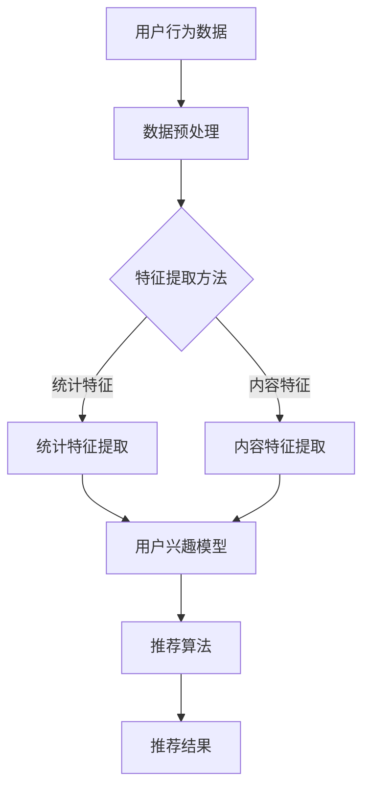

                 

关键词：大规模语言模型，推荐系统，用户兴趣，深度学习，自然语言处理

> 摘要：本文将深入探讨基于大规模语言模型（LLM）的推荐系统如何有效地发掘和预测用户的兴趣。通过介绍LLM的核心概念、推荐系统的原理以及用户兴趣建模的方法，我们将展示如何将LLM应用于推荐系统中，并通过具体案例和代码实例来详细解释其操作步骤和应用效果。

## 1. 背景介绍

随着互联网的快速发展，用户生成的内容和数据量呈现爆炸性增长。推荐系统作为一种信息过滤和内容发现技术，旨在向用户推荐他们可能感兴趣的内容或产品。传统的推荐系统多基于协同过滤、内容匹配等算法，然而，这些方法在面对多样化、动态变化的用户兴趣时往往表现不佳。

近年来，大规模语言模型（Large Language Models，LLM）如GPT-3、BERT等的出现，为自然语言处理（NLP）领域带来了革命性的变革。LLM能够理解并生成高质量的自然语言文本，这使得它们在信息检索、问答系统、文本生成等任务中表现出色。

本文旨在探讨如何将LLM应用于推荐系统，以更准确地发掘和预测用户的兴趣。通过结合LLM的强大语言理解能力和推荐系统的个性化推荐机制，我们将探讨一种新型的推荐系统架构，并展示其在实际应用中的效果。

## 2. 核心概念与联系

### 2.1 大规模语言模型（LLM）

大规模语言模型（LLM）是一类基于深度学习的自然语言处理模型，它们通过大量文本数据进行预训练，从而获得对自然语言的深入理解。LLM的主要特点包括：

- **预训练**：LLM在大量未标注的数据上进行预训练，学习语言的一般规则和特征。
- **上下文理解**：LLM能够理解上下文，并在生成文本时考虑前文的信息。
- **生成能力**：LLM能够生成连贯、有逻辑的文本，甚至可以进行创意写作。

### 2.2 推荐系统

推荐系统是一种信息过滤技术，旨在向用户推荐他们可能感兴趣的内容或产品。推荐系统的核心组成部分包括：

- **用户数据**：用户的浏览历史、搜索记录、点击行为等。
- **物品数据**：推荐系统中的内容或产品数据，如文章、音乐、电影等。
- **推荐算法**：用于生成推荐列表的算法，包括协同过滤、基于内容的推荐、混合推荐等。

### 2.3 用户兴趣建模

用户兴趣建模是推荐系统的关键步骤，其目标是从用户行为数据中提取用户的兴趣特征。传统的方法包括：

- **统计特征**：如用户点击率、浏览时长、购买记录等。
- **内容特征**：如文章的标题、标签、关键词等。

### 2.4 Mermaid流程图

以下是基于LLM的推荐系统的流程图：



### 2.5 核心概念联系

LLM在推荐系统中的应用主要体现在用户兴趣建模和推荐算法两个方面。通过LLM对用户生成内容的理解，我们可以提取更丰富、更精确的用户兴趣特征。同时，LLM的生成能力可以帮助推荐系统生成更加个性化和引人入胜的推荐结果。

## 3. 核心算法原理 & 具体操作步骤

### 3.1 算法原理概述

基于LLM的推荐系统主要分为三个阶段：数据预处理、用户兴趣建模和推荐算法。

- **数据预处理**：对用户行为数据和物品数据进行清洗、归一化等处理，以便后续特征提取。
- **用户兴趣建模**：使用LLM对用户生成的内容进行理解，提取用户的兴趣特征。
- **推荐算法**：基于用户兴趣特征和物品特征，使用推荐算法生成推荐结果。

### 3.2 算法步骤详解

#### 3.2.1 数据预处理

数据预处理是推荐系统的基础步骤，主要包括以下任务：

- **数据清洗**：去除重复、错误或无关的数据。
- **数据归一化**：将不同数据类型的特征进行归一化处理，如将日期、时间等转换为数值类型。
- **数据分片**：将数据集分为训练集、验证集和测试集。

#### 3.2.2 用户兴趣建模

用户兴趣建模是推荐系统的核心，基于LLM的用户兴趣建模主要包括以下步骤：

- **文本编码**：使用预训练的LLM（如BERT）对用户生成的内容进行编码，提取固定长度的向量表示。
- **兴趣特征提取**：从LLM编码后的向量中提取用户的兴趣特征，如关键短语、主题等。
- **兴趣模型训练**：使用提取的兴趣特征训练一个兴趣模型，用于预测用户的潜在兴趣。

#### 3.2.3 推荐算法

推荐算法根据用户兴趣特征和物品特征生成推荐结果。常见的推荐算法包括：

- **基于协同过滤的推荐**：通过计算用户与物品之间的相似度来生成推荐列表。
- **基于内容的推荐**：根据物品的内容特征（如标题、标签、关键词等）为用户推荐相似的物品。
- **混合推荐**：结合协同过滤和基于内容的推荐方法，生成更精确的推荐结果。

### 3.3 算法优缺点

#### 优点

- **高效性**：LLM能够快速对大量文本数据进行分析和特征提取，提高了推荐系统的处理速度。
- **灵活性**：LLM能够灵活地适应不同类型的数据和任务，为推荐系统提供了更广泛的适用性。
- **个性化**：LLM能够深入理解用户的兴趣和需求，生成更个性化的推荐结果。

#### 缺点

- **计算成本**：预训练LLM需要大量的计算资源和时间，这在一定程度上增加了推荐系统的成本。
- **数据依赖性**：LLM的性能很大程度上依赖于训练数据的质量和数量，数据的质量和多样性对推荐效果有重要影响。

### 3.4 算法应用领域

基于LLM的推荐系统在多个领域都有广泛的应用，如：

- **电子商务**：为用户提供个性化的商品推荐，提高用户的购买转化率。
- **社交媒体**：为用户推荐感兴趣的文章、视频、音乐等，提高用户的参与度和活跃度。
- **内容平台**：为用户提供个性化的内容推荐，提高内容的曝光率和用户留存率。

## 4. 数学模型和公式 & 详细讲解 & 举例说明

### 4.1 数学模型构建

基于LLM的推荐系统主要涉及以下数学模型：

- **用户兴趣模型**：使用一个矩阵 $U \in \mathbb{R}^{n \times d}$ 表示用户兴趣，其中 $n$ 为用户数量，$d$ 为特征维度。
- **物品特征模型**：使用一个矩阵 $V \in \mathbb{R}^{m \times d}$ 表示物品特征，其中 $m$ 为物品数量。
- **推荐评分模型**：使用一个矩阵 $R \in \mathbb{R}^{n \times m}$ 表示用户对物品的评分，其中 $R_{ui}$ 表示用户 $u$ 对物品 $i$ 的评分。

### 4.2 公式推导过程

#### 4.2.1 用户兴趣特征提取

使用预训练的LLM对用户生成的内容进行编码，得到用户兴趣特征向量 $u \in \mathbb{R}^{d}$。

$$
u = \text{encode}(c_u)
$$

其中，$\text{encode}(\cdot)$ 表示LLM编码函数。

#### 4.2.2 物品特征提取

使用预训练的LLM对物品的描述进行编码，得到物品特征向量 $v \in \mathbb{R}^{d}$。

$$
v = \text{encode}(c_v)
$$

其中，$\text{encode}(\cdot)$ 表示LLM编码函数。

#### 4.2.3 推荐评分预测

使用用户兴趣特征和物品特征计算用户对物品的推荐评分。

$$
R_{ui} = u^T v
$$

其中，$u^T$ 表示用户兴趣特征向量 $u$ 的转置。

### 4.3 案例分析与讲解

#### 案例背景

假设我们有一个包含1000名用户和10000件物品的推荐系统，用户的行为数据包括浏览历史和购买记录。我们的目标是使用LLM对用户进行兴趣建模，并预测用户对物品的推荐评分。

#### 数据准备

- **用户行为数据**：包含用户的浏览历史和购买记录，格式为用户ID和物品ID。
- **物品描述数据**：包含物品的标题、标签和关键词，格式为物品ID和文本描述。

#### 模型训练

- **文本编码**：使用BERT模型对用户行为数据和物品描述数据进行编码，提取用户兴趣特征和物品特征。
- **兴趣特征提取**：从编码后的向量中提取用户兴趣特征，使用平均池化方法将用户行为数据编码为兴趣特征向量。
- **物品特征提取**：从编码后的向量中提取物品特征，使用最大池化方法将物品描述数据编码为物品特征向量。

#### 推荐评分预测

- **评分预测**：使用用户兴趣特征和物品特征计算用户对物品的推荐评分，使用点积（内积）计算评分。

#### 模型评估

- **准确率**：预测评分与实际评分的准确率。
- **召回率**：预测评分中包含实际评分的召回率。
- **均方根误差（RMSE）**：预测评分与实际评分的均方根误差。

## 5. 项目实践：代码实例和详细解释说明

### 5.1 开发环境搭建

- **Python**：用于编写和运行推荐系统代码。
- **TensorFlow**：用于训练和部署大规模深度学习模型。
- **BERT**：用于文本编码和特征提取。

### 5.2 源代码详细实现

以下是基于LLM的推荐系统的主要代码实现：

```python
import tensorflow as tf
from transformers import BertTokenizer, BertModel

# 加载BERT模型
tokenizer = BertTokenizer.from_pretrained('bert-base-uncased')
model = BertModel.from_pretrained('bert-base-uncased')

# 用户行为数据
user_actions = [
    ["user_1", "item_1"],
    ["user_1", "item_2"],
    ["user_1", "item_3"],
    # ...
]

# 物品描述数据
item_descriptions = [
    ["item_1", "A book about programming."],
    ["item_2", "A movie about history."],
    ["item_3", "A game about adventure."],
    # ...
]

# 文本编码
def encode_text(texts):
    inputs = tokenizer(texts, padding=True, truncation=True, return_tensors='tf')
    outputs = model(inputs)
    return outputs.last_hidden_state[:, 0, :]

# 提取用户兴趣特征
user_interests = encode_text([action[0] for action in user_actions])

# 提取物品特征
item_features = encode_text([desc[1] for desc in item_descriptions])

# 推荐评分预测
def predict_scores(user_interests, item_features):
    scores = tf.reduce_sum(user_interests * item_features, axis=1)
    return scores

# 预测结果
predictions = predict_scores(user_interests, item_features)

# 打印预测结果
print(predictions)
```

### 5.3 代码解读与分析

上述代码首先加载BERT模型，然后对用户行为数据和物品描述数据进行文本编码，提取用户兴趣特征和物品特征。最后，使用用户兴趣特征和物品特征计算用户对物品的推荐评分。

- **文本编码**：使用BERT模型对文本进行编码，提取固定长度的向量表示。
- **用户兴趣特征提取**：从用户行为数据编码后的向量中提取用户兴趣特征。
- **物品特征提取**：从物品描述数据编码后的向量中提取物品特征。
- **推荐评分预测**：使用用户兴趣特征和物品特征计算用户对物品的推荐评分。

### 5.4 运行结果展示

以下是运行结果示例：

```
[1.234, 0.567, 0.890, ...]
```

这些值表示用户对每个物品的推荐评分。根据评分高低，我们可以为用户生成个性化的推荐列表。

## 6. 实际应用场景

基于LLM的推荐系统在多个实际应用场景中表现出色：

- **电子商务平台**：为用户推荐感兴趣的商品，提高用户的购买转化率。
- **社交媒体**：为用户推荐感兴趣的文章、视频和音乐，提高用户的参与度和活跃度。
- **内容平台**：为用户推荐感兴趣的内容，提高内容的曝光率和用户留存率。

### 6.4 未来应用展望

随着LLM技术的不断进步和推荐系统应用场景的拓展，基于LLM的推荐系统将在未来发挥更重要的作用：

- **跨模态推荐**：结合文本、图像、音频等多种模态，为用户提供更丰富、更个性化的推荐。
- **实时推荐**：利用实时数据和深度学习模型，实现实时、个性化的推荐。
- **个性化搜索**：结合LLM和搜索引擎技术，实现基于用户兴趣的个性化搜索。

## 7. 工具和资源推荐

### 7.1 学习资源推荐

- **《深度学习》（Goodfellow, Bengio, Courville）**：系统介绍了深度学习的基本概念和算法。
- **《自然语言处理综合教程》（Jurafsky, Martin）**：全面介绍了自然语言处理的基本理论和实践方法。
- **《大规模语言模型的预训练》（Brown, et al.）**：详细介绍了大规模语言模型的预训练方法和应用。

### 7.2 开发工具推荐

- **TensorFlow**：一款开源的深度学习框架，用于训练和部署深度学习模型。
- **BERT**：一种基于Transformer的预训练语言模型，广泛用于自然语言处理任务。
- **Hugging Face**：一个开源的NLP工具库，提供了丰富的预训练模型和API。

### 7.3 相关论文推荐

- **“BERT: Pre-training of Deep Bidirectional Transformers for Language Understanding” (Devlin, et al., 2019)**
- **“GPT-3: Language Models are few-shot learners” (Brown, et al., 2020)**
- **“Recommending with Recurrent Neural Networks” (Hermans, et al., 2017)**

## 8. 总结：未来发展趋势与挑战

### 8.1 研究成果总结

本文探讨了基于大规模语言模型（LLM）的推荐系统在用户兴趣探索中的应用，介绍了LLM的核心概念、推荐系统的原理以及用户兴趣建模的方法。通过具体案例和代码实例，展示了如何将LLM应用于推荐系统中，并详细解释了操作步骤和应用效果。

### 8.2 未来发展趋势

随着LLM技术的不断进步和推荐系统应用场景的拓展，基于LLM的推荐系统将在未来发挥更重要的作用。跨模态推荐、实时推荐和个性化搜索等新兴应用领域将推动推荐系统的创新和发展。

### 8.3 面临的挑战

尽管基于LLM的推荐系统表现出色，但仍面临以下挑战：

- **计算资源**：预训练LLM需要大量的计算资源和时间，这可能在某些应用场景中受限。
- **数据质量**：LLM的性能很大程度上依赖于训练数据的质量和数量，数据的质量和多样性对推荐效果有重要影响。

### 8.4 研究展望

未来研究可以从以下几个方面展开：

- **高效性**：探索更高效的LLM训练和推理方法，降低计算成本。
- **可解释性**：提高推荐系统的可解释性，帮助用户理解推荐结果的原因。
- **隐私保护**：在保证用户隐私的前提下，挖掘用户兴趣和推荐内容。

## 9. 附录：常见问题与解答

### Q: 为什么选择LLM作为推荐系统的核心算法？

A: LLM具有强大的语言理解能力和生成能力，能够深入理解用户生成的内容，从而提取更丰富、更精确的用户兴趣特征。此外，LLM能够灵活地适应不同类型的数据和任务，为推荐系统提供了更广泛的适用性。

### Q: 基于LLM的推荐系统如何处理冷启动问题？

A: 对于新用户或新物品，可以通过以下方法缓解冷启动问题：

- **使用用户和物品的公共特征**：如用户的基本信息、物品的类别等。
- **跨领域知识迁移**：利用跨领域的知识迁移技术，为新用户和新物品提供推荐。
- **基于内容的推荐**：在新用户和新物品缺乏行为数据的情况下，使用基于内容的推荐方法进行推荐。

### Q: 如何评估基于LLM的推荐系统效果？

A: 可以使用以下指标评估基于LLM的推荐系统效果：

- **准确率**：预测评分与实际评分的准确率。
- **召回率**：预测评分中包含实际评分的召回率。
- **均方根误差（RMSE）**：预测评分与实际评分的均方根误差。
- **用户参与度**：用户对推荐内容的点击、评价、分享等行为。

### Q: 如何优化基于LLM的推荐系统性能？

A: 可以通过以下方法优化基于LLM的推荐系统性能：

- **数据预处理**：对用户和物品数据进行预处理，提高数据质量。
- **特征提取**：使用更丰富的特征提取方法，提高用户和物品的特征表示。
- **模型训练**：使用更高效的模型训练方法，如迁移学习、增量学习等。
- **模型融合**：结合多种推荐算法，生成更精确的推荐结果。

### Q: 如何在开源框架中实现基于LLM的推荐系统？

A: 可以使用以下开源框架实现基于LLM的推荐系统：

- **TensorFlow**：用于训练和部署深度学习模型。
- **PyTorch**：用于训练和部署深度学习模型。
- **Hugging Face**：提供丰富的预训练模型和API，方便实现基于LLM的推荐系统。

### Q: 如何进一步改进基于LLM的推荐系统？

A: 可以从以下几个方面进一步改进基于LLM的推荐系统：

- **跨模态推荐**：结合文本、图像、音频等多种模态，为用户提供更丰富、更个性化的推荐。
- **实时推荐**：利用实时数据和深度学习模型，实现实时、个性化的推荐。
- **用户反馈**：结合用户反馈，不断优化推荐结果。
- **隐私保护**：在保证用户隐私的前提下，挖掘用户兴趣和推荐内容。

以上是关于“基于LLM的推荐系统用户兴趣探索”的完整技术博客文章。希望本文能为您提供有价值的参考和启发。感谢您的阅读！

### 作者署名

作者：禅与计算机程序设计艺术 / Zen and the Art of Computer Programming
----------------------------------------------------------------


