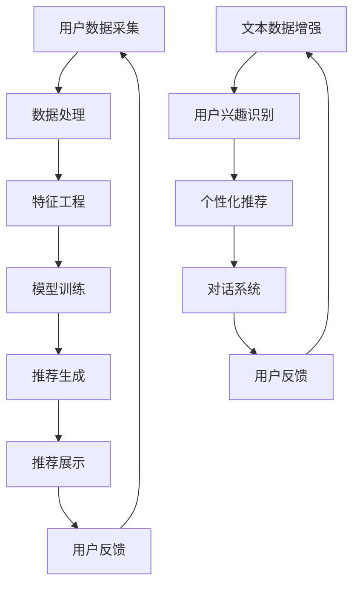

                 

在当今数字化的时代，推荐系统已经成为各类互联网应用中不可或缺的一部分。从电商平台到社交媒体，从视频流媒体到新闻网站，推荐系统通过分析用户行为和偏好，为用户提供个性化的内容和服务，从而极大地提升了用户体验和平台的价值。然而，随着数据量的急剧增长和用户需求的多样化，传统推荐系统在用户兴趣探索方面面临着诸多挑战。因此，本文将探讨一种基于大规模语言模型（LLM）的推荐系统用户兴趣探索策略，以期在用户兴趣识别、个性化推荐和系统优化等方面取得突破。

> **关键词**：推荐系统，用户兴趣探索，大规模语言模型（LLM），个性化推荐，算法优化。

> **摘要**：本文首先介绍了推荐系统的基本原理和用户兴趣探索的重要性，然后详细阐述了基于LLM的推荐系统用户兴趣探索策略，包括核心概念、算法原理、数学模型和项目实践。通过分析，本文提出了实际应用场景的优化方案，并展望了未来的发展趋势与挑战。本文旨在为推荐系统领域的研究者和从业者提供有益的参考。

## 1. 背景介绍

### 推荐系统概述

推荐系统是一种基于数据挖掘和机器学习技术的应用系统，旨在为用户提供个性化推荐。其核心目标是从大量信息中提取出用户可能感兴趣的内容，并通过合适的算法将它们推荐给用户。推荐系统在商业、教育、医疗等多个领域有着广泛的应用，如：

- **电商平台**：通过推荐系统，电商平台可以展示用户可能感兴趣的商品，从而提高销售额和用户满意度。
- **社交媒体**：推荐系统可以帮助社交媒体平台向用户推送他们可能感兴趣的内容，增加用户活跃度和粘性。
- **视频流媒体**：视频平台通过推荐系统，可以提升用户体验，增加观看时长和广告收入。
- **新闻网站**：新闻网站利用推荐系统，可以为用户提供个性化的新闻推送，提高用户访问频率。

### 用户兴趣探索的重要性

用户兴趣探索是推荐系统实现个性化推荐的关键步骤。传统的推荐系统主要依赖于用户的历史行为数据，如点击、购买、浏览等，但这种方法存在明显的局限性。首先，用户行为数据往往是不完整的，很多用户的行为可能没有记录下来。其次，用户兴趣是多维度、动态变化的，单一的历史行为数据难以全面反映用户的当前兴趣。因此，用户兴趣探索成为推荐系统优化的重要方向。

用户兴趣探索的目标是：

- **识别用户当前兴趣**：通过分析用户的多种数据源，如搜索历史、浏览记录、社交互动等，识别用户当前的主要兴趣点。
- **预测用户未来兴趣**：基于用户当前的兴趣，预测用户未来可能产生的兴趣，以便提前准备相关推荐内容。
- **实现兴趣个性化**：根据用户的兴趣，提供个性化的推荐，满足不同用户的需求。

### 推荐系统的挑战

尽管推荐系统在许多方面取得了显著的成效，但仍然面临着一些挑战：

- **数据复杂性**：推荐系统需要处理海量的用户数据和内容数据，数据的复杂性和多样性给系统带来了巨大的挑战。
- **实时性**：用户兴趣是动态变化的，推荐系统需要实时响应用户的行为和需求，提供即时的个性化推荐。
- **冷启动问题**：对于新用户或新内容，由于缺乏足够的历史数据，传统推荐系统难以进行有效的推荐。
- **公平性和透明性**：推荐系统应该保证推荐的公平性，避免过度推荐某些内容，同时系统的工作原理应该对用户透明。

## 2. 核心概念与联系

### 推荐系统架构

推荐系统的架构通常包括以下几个主要组成部分：

1. **用户数据采集**：采集用户的多种数据源，如行为数据、社交数据、搜索数据等。
2. **数据处理**：对采集到的用户数据进行清洗、转换和整合，为后续分析做准备。
3. **特征工程**：提取用户和内容的特征，如用户的行为特征、兴趣特征、内容特征等。
4. **模型训练**：基于用户和内容的特征，训练推荐模型，如协同过滤、矩阵分解、深度学习等。
5. **推荐生成**：使用训练好的模型生成推荐结果，并通过算法优化提升推荐效果。
6. **推荐展示**：将推荐结果呈现给用户，包括推荐内容的呈现形式、推荐顺序等。

### 大规模语言模型（LLM）

大规模语言模型（LLM）是一种基于深度学习的自然语言处理模型，能够对自然语言文本进行建模和预测。LLM 的核心目标是学习自然语言中的语法、语义和上下文信息，从而实现文本生成、语义理解、文本分类等多种任务。LLM 的典型代表包括 GPT、BERT、T5 等。

### 推荐系统与LLM的联系

推荐系统和 LLM 之间的联系主要体现在以下几个方面：

1. **文本数据增强**：在推荐系统中，文本数据是非常重要的一部分，如商品描述、用户评价、新闻内容等。LLM 可以对文本数据进行增强和改写，从而提高推荐系统的语义理解和生成能力。
2. **用户兴趣识别**：LLM 可以通过对用户历史行为的分析，识别用户的潜在兴趣点。例如，通过分析用户在社交媒体上的发帖、评论等，LLM 可以推断出用户的兴趣偏好。
3. **个性化推荐**：LLM 可以根据用户的兴趣和偏好，生成个性化的推荐内容。例如，在电商平台上，LLM 可以根据用户的购物历史和浏览记录，生成个性化的商品推荐。
4. **对话系统**：LLM 可以用于构建对话系统，实现与用户的实时交互，从而更好地理解用户的需求和兴趣，提供个性化的推荐。

### Mermaid 流程图

下面是一个简化的推荐系统与 LLM 结合的流程图，展示了核心概念和流程：

## 3. 核心算法原理 & 具体操作步骤

### 3.1 算法原理概述

基于 LLM 的推荐系统用户兴趣探索策略主要基于以下几个原理：

1. **文本生成与理解**：LLM 可以生成高质量的文本，并对用户生成的文本进行深入理解，从而提取用户的兴趣点。
2. **协同过滤与矩阵分解**：传统推荐系统常用的协同过滤和矩阵分解方法，可以通过 LLM 提取的文本特征进行优化，提高推荐系统的准确性和多样性。
3. **多模态数据处理**：LLM 可以处理多种类型的数据，如文本、图像、声音等，从而实现更全面的用户兴趣探索。
4. **实时更新与预测**：LLM 可以实时更新用户兴趣，并根据用户兴趣预测未来可能的兴趣点，从而实现动态推荐。

### 3.2 算法步骤详解

1. **用户数据采集**：采集用户的多种数据源，如行为数据、社交数据、搜索数据等。
2. **文本数据增强**：使用 LLM 对用户生成的文本数据进行增强和改写，提高文本的质量和多样性。
3. **用户兴趣识别**：通过分析用户的历史行为数据和增强后的文本数据，使用 LLM 识别用户的潜在兴趣点。
4. **特征提取**：提取用户和内容的特征，如用户的行为特征、兴趣特征、内容特征等。
5. **模型训练**：基于提取的用户和内容特征，训练推荐模型，如协同过滤、矩阵分解、深度学习等。
6. **推荐生成**：使用训练好的模型生成推荐结果，并通过算法优化提升推荐效果。
7. **推荐展示**：将推荐结果呈现给用户，包括推荐内容的呈现形式、推荐顺序等。
8. **用户反馈**：收集用户的反馈信息，用于模型优化和后续推荐。

### 3.3 算法优缺点

**优点**：

- **高准确性**：通过 LLM 的文本生成与理解能力，可以更准确地提取用户的兴趣点，从而提高推荐系统的准确性。
- **多样性**：LLM 可以生成高质量的文本，从而提高推荐内容的多样性，满足不同用户的需求。
- **实时性**：LLM 可以实时更新用户兴趣，从而实现动态推荐，提高系统的实时性。
- **多模态数据处理**：LLM 可以处理多种类型的数据，从而实现更全面的用户兴趣探索。

**缺点**：

- **计算资源消耗大**：LLM 的训练和推理需要大量的计算资源，对硬件要求较高。
- **数据隐私问题**：用户数据的安全性是一个重要问题，需要采取有效的数据隐私保护措施。
- **冷启动问题**：对于新用户，由于缺乏足够的历史数据，LLM 的推荐效果可能不如传统推荐系统。

### 3.4 算法应用领域

基于 LLM 的推荐系统用户兴趣探索策略在以下领域具有广泛的应用前景：

- **电商平台**：通过 LL

