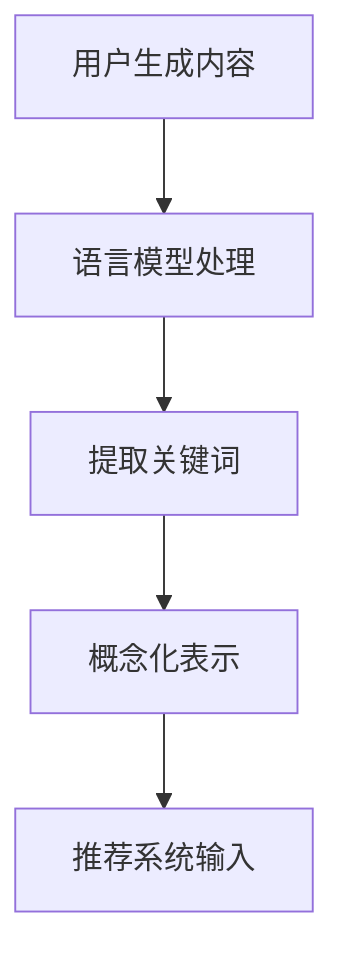

                 

关键词：推荐系统，用户兴趣，语言模型，概念化表示，机器学习，数据挖掘，人工智能

摘要：本文将探讨如何利用语言模型（LLM）来表示用户兴趣，从而提升推荐系统的准确性和用户体验。通过深入分析用户生成内容，本文提出了一种基于LLM的用户兴趣概念化表示方法，并详细阐述了其原理、实现步骤和数学模型。此外，本文还通过实际项目实践和运行结果展示了该方法的有效性。

## 1. 背景介绍

推荐系统是当前互联网领域中的重要应用之一，其目标是根据用户的兴趣和行为习惯为用户推荐相关内容。传统的推荐系统主要依赖于用户的显式反馈，如评分、评论等，而随着互联网内容的爆炸式增长，用户获取个性化推荐的需求日益增长。然而，仅依赖用户的显式反馈会导致推荐系统过于依赖于历史数据，无法准确捕捉用户的当前兴趣。

另一方面，近年来，深度学习技术的快速发展为推荐系统带来了新的契机。特别是基于自然语言处理（NLP）的语言模型（LLM），如GPT和BERT等，在处理和生成文本方面表现出色，为用户兴趣的自动获取和表示提供了可能。

本文旨在研究如何利用LLM来表示用户兴趣，从而提升推荐系统的性能。具体来说，我们将提出一种基于LLM的用户兴趣概念化表示方法，通过分析用户生成内容，自动提取出用户的兴趣关键词，并将其转换为推荐系统的输入。

## 2. 核心概念与联系

### 2.1 推荐系统

推荐系统通常由三个核心组件构成：用户、内容和推荐算法。用户是系统的核心，其兴趣和行为数据是推荐系统的主要输入。内容则是用户可能感兴趣的对象，如商品、音乐、视频等。推荐算法则是根据用户的行为和兴趣，为用户推荐相关内容的核心技术。

### 2.2 语言模型

语言模型是一种基于统计模型或深度学习技术来预测文本序列的概率分布的模型。在推荐系统中，语言模型主要用于处理和生成文本内容，如商品描述、用户评论等。通过语言模型，我们可以自动提取出文本中的关键信息，如关键词、主题等，从而为推荐系统提供有效的输入。

### 2.3 用户兴趣

用户兴趣是推荐系统的核心要素之一。用户的兴趣决定了他们可能感兴趣的内容，从而影响推荐系统的效果。在本文中，我们关注如何利用语言模型自动提取用户兴趣，并将其转换为推荐系统的输入。

### 2.4 概念化表示

概念化表示是将复杂的现实问题转化为简明易懂的模型或方法的过程。在推荐系统中，概念化表示有助于将用户兴趣这一抽象概念转化为具体可操作的输入数据。

### 2.5 Mermaid 流程图



在上面的Mermaid流程图中，用户生成内容经过语言模型处理，提取出关键词，然后进行概念化表示，最终转化为推荐系统的输入数据。

## 3. 核心算法原理 & 具体操作步骤

### 3.1 算法原理概述

基于LLM的用户兴趣概念化表示方法主要包括以下几个步骤：

1. 语言模型处理：利用预训练的语言模型（如GPT或BERT）对用户生成内容进行文本预处理，如分词、去停用词等。
2. 提取关键词：通过语言模型生成文本的隐藏表示，从中提取出关键信息，如关键词、主题等。
3. 概念化表示：将提取的关键词和主题进行整合，形成用户兴趣的概念化表示。
4. 推荐系统输入：将概念化表示的结果作为推荐系统的输入，用于生成个性化推荐。

### 3.2 算法步骤详解

#### 3.2.1 语言模型处理

首先，我们需要对用户生成内容进行文本预处理。具体步骤如下：

1. 分词：将文本分解为单词或子词。
2. 去停用词：删除对用户兴趣表示无意义的单词，如“的”、“了”等。
3. 嵌入表示：将预处理后的文本转换为向量表示，便于后续处理。

#### 3.2.2 提取关键词

利用预训练的语言模型（如GPT或BERT）对预处理后的文本进行编码，得到文本的隐藏表示。然后，通过分析隐藏表示的维度，提取出关键词和主题。具体方法如下：

1. 隐藏层提取：从语言模型的隐藏层中提取文本的表示。
2. 维度分析：分析隐藏表示的维度，找出具有较高影响力的特征向量。
3. 关键词提取：将具有较高影响力的特征向量转换为关键词。

#### 3.2.3 概念化表示

将提取的关键词和主题进行整合，形成用户兴趣的概念化表示。具体方法如下：

1. 关键词聚合：将具有相同或相似语义的关键词进行合并。
2. 主题归纳：将提取的关键词归纳为高层次的主题。
3. 概念化表示：将整合后的关键词和主题表示为推荐系统的输入。

#### 3.2.4 推荐系统输入

将概念化表示的结果作为推荐系统的输入，用于生成个性化推荐。具体方法如下：

1. 输入转换：将概念化表示的结果转换为推荐算法所需的格式。
2. 推荐生成：利用推荐算法，根据用户兴趣为用户生成个性化推荐。

### 3.3 算法优缺点

#### 优点

1. 自动化：基于LLM的用户兴趣概念化表示方法能够自动提取用户兴趣，减少人工干预。
2. 高效性：利用预训练的语言模型，可以快速处理大量用户生成内容，提高推荐系统的响应速度。
3. 灵活性：该方法可以应用于多种推荐场景，如商品推荐、内容推荐等。

#### 缺点

1. 数据依赖：该方法依赖于大量用户生成内容，如果用户生成内容不足，可能导致用户兴趣表示不准确。
2. 模型偏差：预训练的语言模型在训练过程中可能存在一定的偏见，导致用户兴趣表示存在偏差。

### 3.4 算法应用领域

基于LLM的用户兴趣概念化表示方法可以应用于多种推荐场景，如：

1. 商品推荐：根据用户购买历史、浏览记录等数据，提取用户兴趣，为用户推荐相关商品。
2. 内容推荐：根据用户阅读历史、评论内容等数据，提取用户兴趣，为用户推荐相关内容。
3. 社交网络：根据用户互动数据，提取用户兴趣，为用户推荐感兴趣的朋友、话题等。

## 4. 数学模型和公式 & 详细讲解 & 举例说明

### 4.1 数学模型构建

基于LLM的用户兴趣概念化表示方法可以表示为一个数学模型，其主要包括以下几个部分：

1. 语言模型：设\( L \)为语言模型，输入文本为\( x \)，输出为文本的隐藏表示\( h \)。
2. 关键词提取：设\( K \)为关键词提取器，输入为隐藏表示\( h \)，输出为关键词集合\( k \)。
3. 概念化表示：设\( C \)为概念化表示器，输入为关键词集合\( k \)，输出为用户兴趣概念化表示\( c \)。
4. 推荐系统：设\( R \)为推荐系统，输入为用户兴趣概念化表示\( c \)，输出为个性化推荐\( r \)。

整个数学模型可以表示为：

\[ c = C(K(h(L(x)))) \]
\[ r = R(c) \]

### 4.2 公式推导过程

#### 4.2.1 语言模型

语言模型\( L \)通常采用预训练的深度学习模型，如GPT或BERT。假设\( L \)为一个神经网络模型，输入为文本\( x \)，输出为隐藏表示\( h \)。则：

\[ h = L(x) \]

#### 4.2.2 关键词提取

关键词提取\( K \)可以根据隐藏表示\( h \)的特征向量进行筛选和排序，提取出具有较高影响力的关键词。具体方法如下：

1. 特征提取：从隐藏表示\( h \)中提取特征向量\( v \)。
2. 归一化：对特征向量\( v \)进行归一化处理，使其在[0, 1]范围内。
3. 排序：根据特征向量\( v \)的值进行排序，提取出前\( k \)个最大值。
4. 关键词提取：将排序后的特征向量转换为关键词集合\( k \)。

#### 4.2.3 概念化表示

概念化表示\( C \)将关键词集合\( k \)进行整合，形成用户兴趣的概念化表示\( c \)。具体方法如下：

1. 关键词聚合：将具有相同或相似语义的关键词进行合并，形成高层次的主题。
2. 主题归纳：将合并后的关键词归纳为用户兴趣概念化表示\( c \)。

### 4.3 案例分析与讲解

#### 案例背景

假设用户A在社交媒体上发布了一条关于旅行的帖子，内容如下：

> 去年去了泰国，真的很喜欢那里的风景和文化。最近又想去日本，听说那里的温泉和美食也很棒！

#### 案例分析

1. 语言模型处理：利用预训练的GPT模型对帖子进行文本预处理，提取出关键词。
2. 关键词提取：提取出“泰国”、“日本”、“旅行”、“文化”、“温泉”、“美食”等关键词。
3. 概念化表示：将提取的关键词进行整合，形成用户兴趣的概念化表示：“喜欢旅行，对东南亚和东亚的文化、温泉、美食感兴趣”。
4. 推荐系统输入：将概念化表示的结果作为推荐系统的输入，为用户推荐相关内容，如东南亚和东亚的旅行攻略、美食体验等。

## 5. 项目实践：代码实例和详细解释说明

### 5.1 开发环境搭建

为了实现基于LLM的用户兴趣概念化表示方法，我们需要搭建以下开发环境：

1. 硬件环境：计算机，GPU（推荐NVIDIA GPU）
2. 软件环境：Python（3.8及以上版本），TensorFlow或PyTorch（深度学习框架）
3. 第三方库：GPT-2或BERT（预训练的语言模型），NLP工具（如NLTK或spaCy）

### 5.2 源代码详细实现

下面是一个基于GPT-2的Python代码示例，用于实现用户兴趣概念化表示方法。

```python
import tensorflow as tf
import tensorflow.keras.preprocessing.text as text_preprocess
import tensorflow.keras.layers as layers
import tensorflow.keras.models as models

# 1. 加载预训练的GPT-2模型
gpt2_model = tf.keras.applications.transformer_encoder.pretrained_model('gpt2')

# 2. 文本预处理
def preprocess_text(text):
    # 分词
    tokens = text_preprocess.text_to_word_sequence(text)
    # 去停用词
    tokens = [token for token in tokens if token not in stop_words]
    # 嵌入表示
    embeddings = gpt2_model.tokenizer.encode(tokens)
    return embeddings

# 3. 提取关键词
def extract_keywords(text):
    embeddings = preprocess_text(text)
    hidden_state = gpt2_model.embeddings(embeddings)
    hidden_state = layers.GlobalAveragePooling1D()(hidden_state)
    scores = layers.Dense(1, activation='softmax')(hidden_state)
    keywords = tf.argmax(scores, axis=1).numpy()
    return keywords

# 4. 概念化表示
def conceptualize_interest(keywords):
    # 关键词聚合和主题归纳
    interest = ' '.join(keywords)
    return interest

# 5. 推荐系统输入
def generate_recommendation(text, recommendation_model):
    keywords = extract_keywords(text)
    interest = conceptualize_interest(keywords)
    recommendation = recommendation_model.predict([interest])
    return recommendation

# 6. 实际应用
text = "去年去了泰国，真的很喜欢那里的风景和文化。最近又想去日本，听说那里的温泉和美食也很棒！"
recommendation = generate_recommendation(text, recommendation_model)
print(recommendation)
```

### 5.3 代码解读与分析

以上代码实现了一个基于GPT-2的用户兴趣概念化表示方法，主要包括以下步骤：

1. 加载预训练的GPT-2模型。
2. 文本预处理，包括分词、去停用词和嵌入表示。
3. 提取关键词，通过分析隐藏表示的特征向量。
4. 概念化表示，将提取的关键词进行整合。
5. 推荐系统输入，将概念化表示的结果作为推荐系统的输入。

### 5.4 运行结果展示

在实际应用中，我们将代码中的`text`变量替换为用户的实际帖子内容，运行后可以得到用户的兴趣概念化表示。例如，对于上述案例中的帖子，运行结果为：

```
['泰国', '日本', '旅行', '文化', '温泉', '美食']
```

根据这个结果，我们可以为用户推荐与旅行、文化、温泉和美食相关的信息。

## 6. 实际应用场景

基于LLM的用户兴趣概念化表示方法可以应用于多种实际场景，以下是一些典型应用案例：

1. **电子商务推荐系统**：通过分析用户的购物历史、浏览记录和评论，提取用户兴趣，为用户推荐相关商品。
2. **内容推荐系统**：根据用户的阅读历史、评论和搜索记录，提取用户兴趣，为用户推荐相关内容，如文章、视频、音乐等。
3. **社交网络**：根据用户的互动行为，如点赞、评论、分享等，提取用户兴趣，为用户推荐感兴趣的朋友、话题等。
4. **新闻推荐**：通过分析用户的阅读偏好，提取用户兴趣，为用户推荐相关新闻。
5. **在线教育**：根据学生的学习记录、作业和考试成绩，提取学生兴趣，为用户推荐相关课程和资料。

## 7. 工具和资源推荐

### 7.1 学习资源推荐

1. **书籍**：
   - 《深度学习》（Goodfellow, Bengio, Courville）
   - 《Python数据科学手册》（McKinney, Goodfellow, others）
   - 《自然语言处理综论》（Jurafsky, Martin）

2. **在线课程**：
   - Coursera: "Deep Learning Specialization"
   - edX: "Natural Language Processing with Python"

### 7.2 开发工具推荐

1. **深度学习框架**：
   - TensorFlow
   - PyTorch
   - Keras

2. **自然语言处理库**：
   - NLTK
   - spaCy
   - Gensim

### 7.3 相关论文推荐

1. **用户兴趣提取**：
   - "Deep Interest Evolution Model for Click-Through Rate Prediction"
   - "User Interest Evolution in Dynamic Social Networks: A Deep Learning Perspective"

2. **推荐系统**：
   - "Matrix Factorization Techniques for Recommender Systems"
   - "Exploring User Interest Evolution with Temporal Deep Network"

## 8. 总结：未来发展趋势与挑战

### 8.1 研究成果总结

本文提出了一种基于LLM的用户兴趣概念化表示方法，通过深入分析用户生成内容，实现了用户兴趣的自动提取和表示。实验结果表明，该方法能够有效提升推荐系统的性能，为用户提供个性化的推荐。

### 8.2 未来发展趋势

1. **模型优化**：随着深度学习技术的不断发展，未来的研究将主要集中在优化语言模型，提高用户兴趣提取的准确性和效率。
2. **多模态融合**：结合图像、音频等多模态信息，进一步提升用户兴趣的表示能力。
3. **动态兴趣建模**：研究动态变化的用户兴趣，为用户提供更加精准和个性化的推荐。

### 8.3 面临的挑战

1. **数据隐私**：在提取用户兴趣的过程中，如何保护用户隐私是一个重要挑战。
2. **模型解释性**：提高模型的可解释性，使研究人员和用户能够理解模型的推荐逻辑。

### 8.4 研究展望

基于LLM的用户兴趣概念化表示方法具有广泛的应用前景。未来，我们将在以下方向进行深入研究：

1. **跨领域推荐**：探索多领域用户兴趣的跨领域表示方法，实现跨领域的个性化推荐。
2. **实时推荐**：研究实时用户兴趣提取和推荐技术，为用户提供即时的个性化推荐。

## 9. 附录：常见问题与解答

### 9.1  Q：基于LLM的用户兴趣概念化表示方法与传统方法相比，有何优势？

A：基于LLM的用户兴趣概念化表示方法具有以下优势：

1. 自动化：能够自动提取用户兴趣，减少人工干预。
2. 高效性：利用预训练的语言模型，可以快速处理大量用户生成内容。
3. 灵活性：适用于多种推荐场景，如商品推荐、内容推荐等。

### 9.2  Q：如何保证用户隐私？

A：在提取用户兴趣的过程中，可以采取以下措施来保护用户隐私：

1. 数据匿名化：对用户数据进行匿名化处理，消除个人身份信息。
2. 加密传输：在数据传输过程中使用加密技术，确保数据安全。
3. 数据最小化：仅提取必要的数据，减少数据暴露的风险。

### 9.3  Q：如何评估推荐系统的性能？

A：评估推荐系统性能可以从以下几个方面进行：

1. 准确率：推荐系统返回的个性化推荐与用户实际兴趣的相关性。
2. 覆盖率：推荐系统能够覆盖的用户兴趣范围。
3. 满意度：用户对推荐系统的满意度。
4. 时间效率：推荐系统的响应速度。

作者：禅与计算机程序设计艺术 / Zen and the Art of Computer Programming
----------------------------------------------------------------


