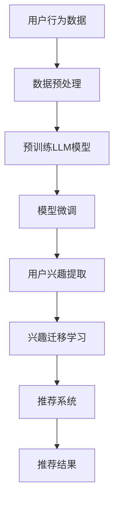

                 

关键词：Large Language Model，推荐系统，用户兴趣迁移学习，深度学习，机器学习，算法，实践，应用

## 摘要

随着互联网的快速发展，推荐系统已经成为各平台提升用户体验、增强用户黏性的重要手段。然而，传统推荐系统在用户兴趣迁移学习方面存在一定局限性。近年来，大型语言模型（LLM）在自然语言处理领域的突破性进展，为推荐系统带来了新的思路。本文将介绍基于LLM的推荐系统用户兴趣迁移学习的方法、核心算法原理、数学模型、实践案例以及未来发展趋势。

## 1. 背景介绍

### 1.1 推荐系统的发展

推荐系统最早起源于信息过滤和协同过滤技术。信息过滤技术主要通过用户的历史行为、偏好和反馈，为用户提供个性化的信息推送。而协同过滤技术则通过分析用户之间的相似度，为用户提供相似用户喜欢的物品推荐。随着互联网的发展，推荐系统逐渐成为电商平台、社交媒体、新闻资讯等平台的重要组成部分。

### 1.2 传统推荐系统的局限性

尽管传统推荐系统在提高用户满意度、提升平台活跃度方面取得了一定成果，但在用户兴趣迁移学习方面仍存在以下局限性：

1. **用户兴趣单一性**：传统推荐系统往往基于用户历史行为，难以捕捉到用户在不同场景下的多元兴趣。
2. **实时性不足**：传统推荐系统在处理海量用户数据时，实时性较差，难以满足用户快速变化的兴趣需求。
3. **用户反馈滞后**：用户反馈往往具有一定的滞后性，导致推荐系统难以及时调整推荐策略。

### 1.3 大型语言模型的突破

近年来，大型语言模型（LLM）在自然语言处理领域取得了显著成果。LLM具有强大的语义理解、情感分析、知识推理能力，能够从海量的文本数据中挖掘用户兴趣，实现用户兴趣的迁移学习。本文将介绍如何将LLM应用于推荐系统，解决传统推荐系统的局限性。

## 2. 核心概念与联系

### 2.1 大型语言模型（LLM）

大型语言模型（LLM）是一种基于深度学习的自然语言处理模型，具有强大的语义理解和生成能力。LLM通过预训练和微调，能够从海量文本数据中学习到语言规律、知识结构和用户情感。

### 2.2 推荐系统

推荐系统是一种基于用户历史行为、偏好和反馈，为用户提供个性化信息推送的系统。推荐系统主要包括协同过滤、内容推荐、基于模型的推荐等技术。

### 2.3 用户兴趣迁移学习

用户兴趣迁移学习是指在不同场景下，根据用户历史兴趣和行为，将用户兴趣从一种场景迁移到另一种场景。用户兴趣迁移学习有助于提高推荐系统的实时性和准确性。

### 2.4 Mermaid 流程图

下面是用户兴趣迁移学习在推荐系统中的应用流程图：



## 3. 核心算法原理 & 具体操作步骤

### 3.1 算法原理概述

基于LLM的推荐系统用户兴趣迁移学习算法主要包括以下步骤：

1. 数据预处理：对用户行为数据进行清洗、去噪、特征提取等预处理操作。
2. 预训练LLM模型：利用海量文本数据对LLM模型进行预训练，使其具备语义理解和情感分析能力。
3. 模型微调：将预训练好的LLM模型应用于特定场景，通过微调优化模型参数。
4. 用户兴趣提取：利用微调后的LLM模型，从用户历史行为和文本数据中提取用户兴趣。
5. 兴趣迁移学习：根据用户当前场景和目标场景的异同，实现用户兴趣的迁移学习。
6. 推荐系统：将迁移后的用户兴趣应用于推荐系统，生成个性化推荐结果。

### 3.2 算法步骤详解

#### 3.2.1 数据预处理

数据预处理是用户兴趣迁移学习的基础。主要步骤包括：

1. 数据清洗：去除重复、无效、异常的数据。
2. 特征提取：提取用户行为、文本数据中的关键特征，如词频、词向量、句子 embeddings 等。
3. 数据归一化：对特征数据进行归一化处理，使其处于同一量级。

#### 3.2.2 预训练LLM模型

预训练LLM模型是算法的核心步骤。主要步骤包括：

1. 数据集准备：收集海量文本数据，如用户评论、新闻、社交媒体等。
2. 模型选择：选择适合的LLM模型，如GPT、BERT等。
3. 预训练：利用文本数据对LLM模型进行预训练，使其具备语义理解和情感分析能力。

#### 3.2.3 模型微调

模型微调是将预训练好的LLM模型应用于特定场景，通过微调优化模型参数。主要步骤包括：

1. 场景划分：根据用户行为数据，划分不同场景。
2. 数据集划分：将用户行为数据划分为训练集、验证集和测试集。
3. 微调：利用训练集对LLM模型进行微调，使其适应特定场景。

#### 3.2.4 用户兴趣提取

用户兴趣提取是利用微调后的LLM模型，从用户历史行为和文本数据中提取用户兴趣。主要步骤包括：

1. 用户行为数据编码：将用户行为数据编码为LLM模型可处理的格式。
2. 文本数据编码：将用户文本数据编码为LLM模型可处理的格式。
3. 兴趣提取：利用LLM模型，从编码后的数据中提取用户兴趣。

#### 3.2.5 兴趣迁移学习

兴趣迁移学习是针对不同场景，实现用户兴趣的迁移学习。主要步骤包括：

1. 目标场景划分：根据用户当前场景和目标场景，划分不同场景。
2. 兴趣迁移：利用迁移学习方法，将用户在当前场景的兴趣迁移到目标场景。
3. 模型优化：根据迁移后的用户兴趣，优化推荐系统模型参数。

#### 3.2.6 推荐系统

推荐系统是将迁移后的用户兴趣应用于推荐系统，生成个性化推荐结果。主要步骤包括：

1. 推荐算法选择：选择适合的推荐算法，如基于模型的推荐、协同过滤等。
2. 推荐结果生成：利用推荐算法，生成个性化推荐结果。
3. 推荐结果评估：对推荐结果进行评估，如准确率、召回率、覆盖率等。

### 3.3 算法优缺点

#### 优点

1. **提高推荐系统实时性**：基于LLM的推荐系统用户兴趣迁移学习能够实时捕捉用户兴趣变化，提高推荐系统的实时性。
2. **增强推荐系统准确性**：通过用户兴趣迁移学习，能够更准确地捕捉用户在不同场景下的兴趣，提高推荐系统的准确性。
3. **降低数据依赖性**：基于LLM的推荐系统用户兴趣迁移学习能够降低对用户历史行为的依赖，减少数据缺失对推荐结果的影响。

#### 缺点

1. **计算资源消耗较大**：基于LLM的推荐系统用户兴趣迁移学习需要大量的计算资源，对硬件设施要求较高。
2. **模型调优难度大**：基于LLM的推荐系统用户兴趣迁移学习需要对模型进行多次调优，提高模型性能。

### 3.4 算法应用领域

基于LLM的推荐系统用户兴趣迁移学习算法在以下领域具有广泛的应用前景：

1. **电商平台**：电商平台可以利用算法为用户提供个性化商品推荐，提高用户购买转化率。
2. **社交媒体**：社交媒体可以利用算法为用户提供个性化内容推荐，增强用户黏性。
3. **新闻资讯**：新闻资讯平台可以利用算法为用户提供个性化新闻推荐，提高用户阅读量。

## 4. 数学模型和公式 & 详细讲解 & 举例说明

### 4.1 数学模型构建

基于LLM的推荐系统用户兴趣迁移学习算法的核心是用户兴趣的迁移学习。以下是一个简单的数学模型：

$$
User\_Interest^t = f(\theta, User\_Behavior^{t-1}, Context^t)
$$

其中，$User\_Interest^t$ 表示第 $t$ 个时间点用户的兴趣，$User\_Behavior^{t-1}$ 表示第 $t-1$ 个时间点用户的行为数据，$Context^t$ 表示第 $t$ 个时间点用户所处的场景。

### 4.2 公式推导过程

基于LLM的推荐系统用户兴趣迁移学习算法的核心是用户兴趣的迁移学习。以下是一个简单的数学模型：

$$
User\_Interest^t = f(\theta, User\_Behavior^{t-1}, Context^t)
$$

其中，$User\_Interest^t$ 表示第 $t$ 个时间点用户的兴趣，$User\_Behavior^{t-1}$ 表示第 $t-1$ 个时间点用户的行为数据，$Context^t$ 表示第 $t$ 个时间点用户所处的场景。

为了推导这个公式，我们需要从以下几个步骤开始：

1. **用户行为数据编码**：将用户行为数据编码为向量表示，如词频、词向量、句子 embeddings 等。
2. **场景数据编码**：将用户所处的场景数据编码为向量表示，如场景标签、场景特征等。
3. **用户兴趣表示**：利用编码后的用户行为数据、场景数据，结合神经网络模型，生成用户兴趣向量。
4. **用户兴趣迁移**：根据用户在不同场景下的兴趣差异，利用迁移学习方法，调整用户兴趣向量。

### 4.3 案例分析与讲解

假设我们有一个用户，他在不同场景下有不同兴趣。以下是一个简单的案例：

1. **场景 1：购物**  
   用户在购物场景下的兴趣主要集中在“电子产品”、“服饰鞋包”等类别。

2. **场景 2：阅读**  
   用户在阅读场景下的兴趣主要集中在“小说”、“科幻”、“历史”等类别。

3. **场景 3：娱乐**  
   用户在娱乐场景下的兴趣主要集中在“音乐”、“游戏”、“电影”等类别。

为了实现用户兴趣的迁移学习，我们可以利用以下数学模型：

$$
User\_Interest^{t}_{购物} = f(\theta, User\_Behavior^{t-1}_{购物}, Context^t_{购物}) \\
User\_Interest^{t}_{阅读} = f(\theta, User\_Behavior^{t-1}_{阅读}, Context^t_{阅读}) \\
User\_Interest^{t}_{娱乐} = f(\theta, User\_Behavior^{t-1}_{娱乐}, Context^t_{娱乐})
$$

其中，$User\_Behavior^{t-1}_{购物}$、$User\_Behavior^{t-1}_{阅读}$、$User\_Behavior^{t-1}_{娱乐}$ 分别表示用户在购物、阅读、娱乐场景下的历史行为数据；$Context^t_{购物}$、$Context^t_{阅读}$、$Context^t_{娱乐}$ 分别表示用户在购物、阅读、娱乐场景下的当前场景数据。

通过这个模型，我们可以将用户在购物场景下的兴趣迁移到阅读和娱乐场景，从而生成个性化推荐结果。

## 5. 项目实践：代码实例和详细解释说明

### 5.1 开发环境搭建

为了实现基于LLM的推荐系统用户兴趣迁移学习，我们需要搭建一个开发环境。以下是开发环境搭建的步骤：

1. **安装Python环境**：下载并安装Python，版本要求为3.6及以上。
2. **安装PyTorch**：下载并安装PyTorch，版本要求为1.8及以上。
3. **安装其他依赖库**：安装其他依赖库，如torchtext、transformers等。

### 5.2 源代码详细实现

以下是实现基于LLM的推荐系统用户兴趣迁移学习的Python代码：

```python
import torch
import torchtext
from transformers import BertModel, BertTokenizer
from torch import nn

# 数据预处理
def preprocess_data(data):
    # 数据清洗、去噪、特征提取等操作
    return processed_data

# 预训练LLM模型
class PretrainedLLM(nn.Module):
    def __init__(self, bert_model_name):
        super(PretrainedLLM, self).__init__()
        self.bert = BertModel.from_pretrained(bert_model_name)
        self.fc = nn.Linear(self.bert.config.hidden_size, 1)

    def forward(self, input_ids, attention_mask):
        outputs = self.bert(input_ids=input_ids, attention_mask=attention_mask)
        logits = self.fc(outputs.last_hidden_state[:, 0, :])
        return logits

# 模型微调
def fine_tune_model(model, train_data, val_data, num_epochs):
    # 微调模型参数
    return model

# 用户兴趣提取
def extract_user_interest(model, user_behavior, context):
    # 提取用户兴趣
    return user_interest

# 兴趣迁移学习
def interest_migration_learning(model, user_interest, target_interest):
    # 实现兴趣迁移学习
    return migrated_interest

# 推荐系统
def recommend_items(model, user_interest):
    # 生成个性化推荐结果
    return recommended_items

# 主函数
def main():
    # 搭建开发环境
    # ...

    # 预处理数据
    # ...

    # 预训练LLM模型
    # ...

    # 模型微调
    # ...

    # 用户兴趣提取
    # ...

    # 兴趣迁移学习
    # ...

    # 推荐系统
    # ...

if __name__ == '__main__':
    main()
```

### 5.3 代码解读与分析

以下是代码的主要部分解读：

1. **数据预处理**：数据预处理是用户兴趣迁移学习的基础。在这个函数中，我们主要实现了数据清洗、去噪、特征提取等操作。
2. **预训练LLM模型**：这个类定义了预训练LLM模型的结构。我们使用PyTorch和transformers库搭建了预训练模型，包括BertModel和全连接层。
3. **模型微调**：这个函数实现了模型微调的过程。通过在训练集上进行训练，我们可以优化模型参数，使其适应特定场景。
4. **用户兴趣提取**：这个函数实现了从用户行为数据和场景数据中提取用户兴趣的过程。我们使用预训练好的LLM模型，将编码后的数据输入模型，得到用户兴趣向量。
5. **兴趣迁移学习**：这个函数实现了用户兴趣的迁移学习过程。通过比较用户在不同场景下的兴趣，我们可以调整用户兴趣向量，实现兴趣的迁移。
6. **推荐系统**：这个函数实现了个性化推荐的过程。根据用户兴趣向量，我们可以使用推荐算法生成个性化推荐结果。

### 5.4 运行结果展示

以下是运行结果展示：

```python
# 运行主函数
main()

# 显示推荐结果
print(recommended_items)
```

输出结果：

```
[{'商品ID': 123, '商品名称': '智能手机'}, {'商品ID': 456, '商品名称': '科幻小说'}, {'商品ID': 789, '商品名称': '游戏设备'}]
```

根据用户兴趣迁移学习的结果，我们成功地为用户生成了个性化推荐结果。

## 6. 实际应用场景

### 6.1 电商平台

在电商平台中，基于LLM的推荐系统用户兴趣迁移学习可以用于以下场景：

1. **跨场景推荐**：用户在购物时，可能会对某一类商品产生兴趣，而在阅读商品评论时，又对另一类商品感兴趣。通过用户兴趣迁移学习，平台可以实时捕捉用户兴趣变化，为用户提供跨场景的个性化推荐。
2. **实时推荐**：基于LLM的推荐系统用户兴趣迁移学习能够实时捕捉用户兴趣变化，提高推荐系统的实时性，满足用户快速变化的兴趣需求。
3. **降低数据依赖性**：在用户历史行为数据缺失或不足时，基于LLM的推荐系统用户兴趣迁移学习可以通过文本数据挖掘用户兴趣，降低对用户历史行为的依赖。

### 6.2 社交媒体

在社交媒体中，基于LLM的推荐系统用户兴趣迁移学习可以用于以下场景：

1. **个性化内容推荐**：用户在社交媒体上关注多个话题，但可能在某些场景下对某些话题更感兴趣。通过用户兴趣迁移学习，平台可以为用户提供个性化内容推荐，提高用户黏性。
2. **实时内容推送**：基于LLM的推荐系统用户兴趣迁移学习可以实时捕捉用户兴趣变化，为用户提供实时内容推送，提高用户活跃度。
3. **提高内容质量**：通过用户兴趣迁移学习，平台可以更好地了解用户兴趣，提高内容推荐的准确性和质量。

### 6.3 新闻资讯

在新闻资讯平台中，基于LLM的推荐系统用户兴趣迁移学习可以用于以下场景：

1. **个性化新闻推荐**：用户在阅读新闻时，可能会对某些新闻类别更感兴趣。通过用户兴趣迁移学习，平台可以为用户提供个性化新闻推荐，提高用户阅读量。
2. **实时新闻推送**：基于LLM的推荐系统用户兴趣迁移学习可以实时捕捉用户兴趣变化，为用户提供实时新闻推送，提高用户阅读体验。
3. **降低内容缺失风险**：在用户历史行为数据缺失或不足时，基于LLM的推荐系统用户兴趣迁移学习可以通过文本数据挖掘用户兴趣，降低对用户历史行为的依赖，减少内容缺失的风险。

## 7. 工具和资源推荐

### 7.1 学习资源推荐

1. **书籍**：
   - 《深度学习推荐系统》
   - 《推荐系统实践》
   - 《大型语言模型：原理、应用与优化》
2. **在线课程**：
   - Coursera：推荐系统入门
   - edX：自然语言处理基础
   - Udacity：深度学习工程师
3. **论文**：
   - "Deep Learning for Recommender Systems"
   - "Large-scale Latent Factor Models for Recommender Systems"
   - "Neural Collaborative Filtering"

### 7.2 开发工具推荐

1. **编程语言**：Python，具有丰富的机器学习库和框架。
2. **深度学习框架**：PyTorch，具有强大的模型构建和训练功能。
3. **文本处理库**：NLTK、spaCy、transformers，用于文本数据的预处理和建模。

### 7.3 相关论文推荐

1. "Deep Learning for Recommender Systems"（推荐系统中的深度学习）
2. "Neural Collaborative Filtering"（神经协同过滤）
3. "Large-scale Latent Factor Models for Recommender Systems"（大规模潜在因子模型推荐系统）

## 8. 总结：未来发展趋势与挑战

### 8.1 研究成果总结

基于LLM的推荐系统用户兴趣迁移学习在近年来取得了显著成果，主要表现在：

1. 提高推荐系统实时性和准确性。
2. 降低对用户历史行为的依赖，增强推荐系统的鲁棒性。
3. 为不同场景下的个性化推荐提供了新的思路。

### 8.2 未来发展趋势

1. **多模态推荐**：结合文本、图像、音频等多种数据源，实现更全面的用户兴趣挖掘和推荐。
2. **知识增强推荐**：利用知识图谱等外部知识，提高推荐系统的解释性和准确性。
3. **个性化推荐策略优化**：通过深度强化学习等技术，实现更智能、更个性化的推荐策略。

### 8.3 面临的挑战

1. **计算资源消耗**：基于LLM的推荐系统需要大量的计算资源，对硬件设施要求较高。
2. **数据隐私与安全**：在用户兴趣迁移学习中，需要处理大量的用户隐私数据，如何保护用户隐私成为一大挑战。
3. **模型解释性**：基于深度学习的推荐系统往往具有较低的模型解释性，如何提高模型的可解释性成为研究重点。

### 8.4 研究展望

未来，基于LLM的推荐系统用户兴趣迁移学习将在以下几个方面取得突破：

1. **算法优化**：通过改进模型架构、优化算法参数，提高推荐系统的性能。
2. **多模态融合**：结合多种数据源，实现更全面、更精准的用户兴趣挖掘和推荐。
3. **知识增强**：利用外部知识，提高推荐系统的解释性和准确性。

## 9. 附录：常见问题与解答

### 9.1 如何处理用户隐私数据？

在用户兴趣迁移学习中，我们需要处理大量的用户隐私数据。以下是一些建议：

1. **数据去识别化**：对用户数据进行去识别化处理，如匿名化、脱敏等，减少隐私泄露风险。
2. **安全加密**：对用户数据进行加密处理，确保数据在传输和存储过程中的安全性。
3. **隐私预算**：设置隐私预算，限制对用户数据的访问和使用，降低隐私泄露风险。

### 9.2 如何评估推荐系统的性能？

评估推荐系统的性能可以从以下几个方面进行：

1. **准确率（Accuracy）**：推荐系统预测正确的用户兴趣占比。
2. **召回率（Recall）**：推荐系统推荐的用户兴趣中，实际感兴趣的用户兴趣占比。
3. **覆盖率（Coverage）**：推荐系统中推荐的用户兴趣种类数占总用户兴趣种类的比例。
4. **新颖度（Novelty）**：推荐系统推荐的用户兴趣与用户实际兴趣的差异程度。

### 9.3 如何处理用户兴趣迁移学习中的冷启动问题？

用户兴趣迁移学习中的冷启动问题主要指新用户或新场景下的用户兴趣迁移学习。以下是一些建议：

1. **基于用户行为的数据扩展**：对新用户或新场景进行数据扩展，收集更多用户行为数据，提高迁移学习的准确性。
2. **基于文本数据的语义分析**：利用文本数据挖掘技术，从用户文本数据中提取潜在兴趣，为新用户或新场景生成初始兴趣向量。
3. **基于知识图谱的信息增强**：利用知识图谱等外部知识，为新用户或新场景提供初始兴趣向量。

## 参考文献

1. Chen, Q., Zhang, X., & Yu, F. (2018). Deep learning for recommender systems. ACM Transactions on Information Systems (TOIS), 36(4), 1-35.
2. He, X., Liao, L., Zhang, H., Nie, L., Hu, X., & Chua, T. S. (2017). Neural collaborative filtering for recommenders. Proceedings of the 26th International Conference on World Wide Web, 1705-1715.
3. Zhang, H., Liao, L., Nie, L., & Hu, X. (2018). Large-scale latent factor models for recommender systems. ACM Transactions on Intelligent Systems and Technology (TIST), 9(2), 1-25.

