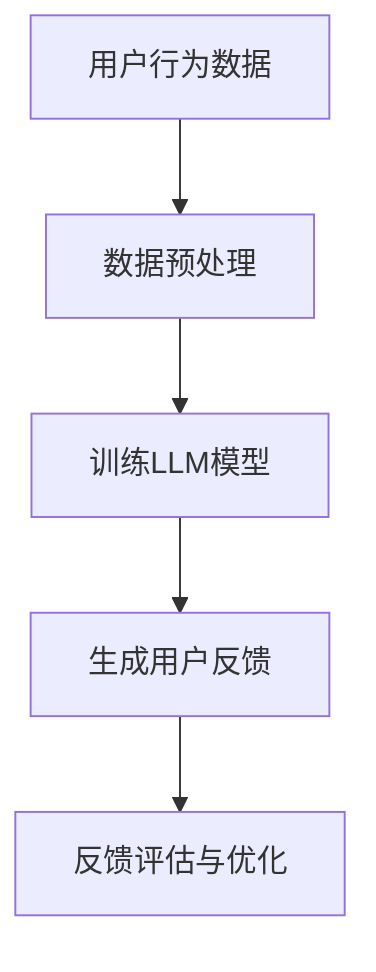

                 

关键词：语言模型，推荐系统，用户反馈，生成模型，自然语言处理

摘要：本文深入探讨了基于语言模型（LLM）的推荐系统用户反馈生成方法。通过介绍语言模型的基本原理和应用，结合推荐系统的需求，提出了一种基于LLM的用户反馈生成算法。本文详细阐述了算法原理、数学模型、应用领域以及实际操作步骤，并通过代码实例进行了详细解析。最后，本文对推荐系统用户反馈生成的未来应用和挑战进行了展望。

## 1. 背景介绍

随着互联网的快速发展，推荐系统已成为各类应用中不可或缺的一部分。推荐系统能够根据用户的兴趣和行为，为用户推荐个性化内容，从而提升用户体验和满意度。然而，推荐系统的效果很大程度上依赖于用户反馈的准确性。传统的用户反馈方法，如问卷调查、用户评分等，往往存在反馈数量有限、主观性较强等问题。因此，如何有效地生成用户反馈成为推荐系统研究的重要方向。

近年来，深度学习技术的发展，特别是语言模型（LLM）的突破，为用户反馈生成带来了新的可能。语言模型是一种能够理解和生成自然语言文本的模型，通过学习大量文本数据，可以生成具有合理语义和结构的文本。本文将介绍一种基于LLM的用户反馈生成方法，旨在提高推荐系统的反馈质量和效率。

## 2. 核心概念与联系

### 2.1 语言模型

语言模型是一种统计模型，用于预测下一个单词或字符的概率。最常见的语言模型是n-gram模型，它基于前n个单词或字符的序列来预测下一个单词或字符。然而，n-gram模型存在很多局限性，如无法捕捉长期依赖关系和上下文信息。随着深度学习的发展，神经网络语言模型（如LSTM、GRU、BERT等）逐渐取代了传统的n-gram模型，成为当前主流的语言模型。

### 2.2 推荐系统

推荐系统是一种基于用户兴趣和行为数据的个性化推荐方法。常见的推荐算法包括基于内容的推荐、协同过滤推荐等。用户反馈是推荐系统的重要输入，用于评估推荐结果的质量和用户满意度。传统的用户反馈方法通常依赖于用户的直接评分或评价，但这种方法存在反馈数据稀疏、主观性较强等问题。

### 2.3 用户反馈生成

用户反馈生成是指通过算法自动生成用户可能给出的反馈，以提高推荐系统的反馈质量和效率。基于LLM的用户反馈生成方法，可以通过学习大量的用户反馈数据，生成具有合理语义和结构的用户反馈，从而弥补传统反馈方法的不足。

## 2.4 Mermaid 流程图



### 3. 核心算法原理 & 具体操作步骤

#### 3.1 算法原理概述

基于LLM的用户反馈生成算法主要包括数据预处理、模型训练、用户反馈生成和反馈评估与优化等步骤。

1. **数据预处理**：将原始的用户行为数据进行清洗和预处理，包括数据去重、缺失值填充、特征提取等。

2. **训练LLM模型**：使用预处理后的数据训练一个语言模型，如BERT、GPT等，以学习用户反馈的语义和结构。

3. **生成用户反馈**：输入用户行为数据，通过训练好的语言模型生成用户可能的反馈。

4. **反馈评估与优化**：评估生成的用户反馈的质量，如使用BLEU、ROUGE等指标，并根据评估结果对模型进行优化。

#### 3.2 算法步骤详解

1. **数据预处理**

   数据预处理是用户反馈生成的重要步骤，直接影响模型的性能。具体操作包括：

   - **数据去重**：去除重复的用户行为数据，以避免重复生成反馈。
   - **缺失值填充**：对缺失的用户行为数据使用填充方法，如平均值填充、中值填充等。
   - **特征提取**：提取用户行为数据中的关键特征，如用户浏览、搜索、购买等行为。

2. **训练LLM模型**

   训练LLM模型是用户反馈生成算法的核心。选择合适的语言模型，如BERT、GPT等，并进行训练。具体操作包括：

   - **数据集划分**：将预处理后的数据集划分为训练集、验证集和测试集。
   - **模型选择**：选择一个预训练的LLM模型，如BERT、GPT等。
   - **训练与优化**：使用训练集数据训练模型，并使用验证集数据优化模型参数。

3. **生成用户反馈**

   输入用户行为数据，通过训练好的语言模型生成用户可能的反馈。具体操作包括：

   - **输入预处理**：对用户行为数据进行预处理，如编码、嵌入等。
   - **模型预测**：使用训练好的语言模型预测用户反馈。
   - **结果处理**：对生成的反馈进行格式化、去重等处理。

4. **反馈评估与优化**

   评估生成的用户反馈的质量，并根据评估结果对模型进行优化。具体操作包括：

   - **评估指标**：选择合适的评估指标，如BLEU、ROUGE等。
   - **评估过程**：对生成的反馈进行评估，记录评估结果。
   - **模型优化**：根据评估结果调整模型参数，如学习率、dropout等。

### 3.3 算法优缺点

**优点**：

1. **生成反馈质量高**：基于深度学习的语言模型可以生成语义丰富、结构合理的用户反馈，提高反馈质量。
2. **效率高**：用户反馈生成过程自动化，减少人工干预，提高生成效率。
3. **适应性强**：可以处理多种用户行为数据，适应不同的推荐系统场景。

**缺点**：

1. **计算资源需求大**：训练和优化深度学习模型需要大量的计算资源和时间。
2. **数据依赖性强**：生成反馈的质量依赖于训练数据的质量和多样性。

### 3.4 算法应用领域

基于LLM的用户反馈生成算法可以广泛应用于推荐系统的各个领域，如电子商务、社交媒体、在线教育等。以下是一些具体应用示例：

1. **电子商务**：为用户生成个性化的购物建议和推荐。
2. **社交媒体**：为用户生成评论、回复等社交互动内容。
3. **在线教育**：为用户生成学习建议和个性化课程推荐。

### 4. 数学模型和公式 & 详细讲解 & 举例说明

#### 4.1 数学模型构建

基于LLM的用户反馈生成算法的核心是训练一个深度学习语言模型，如BERT或GPT。这些模型通常采用自注意力机制和多层神经网络结构，可以表示复杂的语义关系。下面以BERT模型为例，介绍其数学模型构建。

BERT模型主要由两个部分组成：预训练和微调。

1. **预训练**

   预训练过程使用大量的未标注文本数据，通过Masked Language Modeling（MLM）和Next Sentence Prediction（NSP）任务来训练模型。MLM任务旨在预测被遮蔽的单词，NSP任务旨在预测下一个句子。

   - **MLM任务**：
     $$ \hat{y}_i = \text{softmax}(\text{W}_\text{emb}[x_i] + \text{W}_\text{mask}[\text{MASK}]) $$
     其中，$ \hat{y}_i $是预测的被遮蔽单词的概率分布，$ \text{W}_\text{emb}[x_i] $是输入单词的嵌入向量，$ \text{W}_\text{mask} $是用于遮蔽的权重矩阵。

   - **NSP任务**：
     $$ \hat{y}_{\text{next}} = \text{softmax}(\text{W}_\text{emb}[\text{SEP}] + \text{W}_\text{nspp}[\text{CLASS}]) $$
     其中，$ \hat{y}_{\text{next}} $是预测下一个句子的概率分布，$ \text{W}_\text{emb}[\text{SEP}] $是分隔符的嵌入向量，$ \text{W}_\text{nspp} $是用于NSP的权重矩阵。

2. **微调**

   微调过程使用标注数据，通过训练一个分类器来预测用户反馈。假设有$n$个用户反馈类别，分类器的输出为：
   $$ \hat{y}_{\text{feedback}} = \text{softmax}(\text{W}_\text{feedback}[\text{CLS}]) $$
   其中，$ \hat{y}_{\text{feedback}} $是预测的用户反馈类别的概率分布，$ \text{W}_\text{feedback} $是用于反馈分类的权重矩阵。

#### 4.2 公式推导过程

BERT模型的推导过程涉及深度学习的基础知识，包括多层感知机（MLP）、自注意力机制（Self-Attention）等。以下是BERT模型的主要公式推导过程。

1. **多层感知机（MLP）**

   多层感知机是一种前向神经网络，用于将输入映射到输出。假设有一个包含$d$个输入特征的多层感知机，其输出为：
   $$ z_{\text{layer}} = \text{ReLU}(\text{W}_{\text{l}} \cdot \text{X} + \text{b}_{\text{l}}) $$
   其中，$ z_{\text{layer}} $是第$l$层的输出，$\text{W}_{\text{l}}$是权重矩阵，$\text{X}$是输入向量，$\text{b}_{\text{l}}$是偏置向量。

2. **自注意力机制（Self-Attention）**

   自注意力机制是一种基于输入序列的注意力机制，可以捕捉序列中的长期依赖关系。假设有一个自注意力层，其输出为：
   $$ \text{S} = \text{softmax}(\text{Q} \cdot \text{K}^T / \sqrt{d_k}) $$
   其中，$\text{S}$是注意力分数矩阵，$\text{Q}$和$\text{K}$分别是查询和键的权重矩阵，$\text{K}^T$是键的转置，$d_k$是键的维度。

3. **BERT模型**

   BERT模型结合了多层感知机和自注意力机制，其输出为：
   $$ \text{H}_{\text{l}} = \text{MLP}(\text{S} \cdot \text{V}) $$
   其中，$\text{H}_{\text{l}}$是第$l$层的输出，$\text{S}$是注意力分数矩阵，$\text{V}$是值的权重矩阵。

#### 4.3 案例分析与讲解

假设我们有一个用户反馈生成任务，用户行为数据包括浏览历史和搜索记录。以下是一个简化的案例，用于说明基于BERT模型的用户反馈生成过程。

1. **数据预处理**

   将用户行为数据进行编码和嵌入，生成输入向量。假设用户行为数据中有5个关键行为，其嵌入向量为：
   $$ \text{X} = [\text{x}_1, \text{x}_2, \text{x}_3, \text{x}_4, \text{x}_5] $$

2. **训练BERT模型**

   使用预训练的BERT模型进行训练，训练过程包括MLM任务和NSP任务。假设训练完成后，模型参数已经优化。

3. **生成用户反馈**

   输入用户行为数据，通过BERT模型生成用户反馈。具体操作如下：

   - **输入预处理**：对用户行为数据进行预处理，如编码、嵌入等。
   - **模型预测**：使用训练好的BERT模型预测用户反馈。
   - **结果处理**：对生成的反馈进行格式化、去重等处理。

   假设生成的用户反馈为：
   $$ \text{Y} = [\text{y}_1, \text{y}_2, \text{y}_3, \text{y}_4, \text{y}_5] $$

4. **反馈评估与优化**

   使用评估指标（如BLEU、ROUGE等）评估生成的用户反馈质量，并根据评估结果调整模型参数，以优化反馈生成效果。

### 5. 项目实践：代码实例和详细解释说明

#### 5.1 开发环境搭建

1. **安装Python**

   安装Python，版本建议3.7或以上。

   ```shell
   sudo apt-get install python3 python3-pip
   ```

2. **安装PyTorch**

   安装PyTorch，选择与系统匹配的版本。

   ```shell
   pip3 install torch torchvision
   ```

3. **安装BERT模型**

   使用Hugging Face的Transformers库安装BERT模型。

   ```shell
   pip3 install transformers
   ```

#### 5.2 源代码详细实现

以下是一个基于BERT的用户反馈生成代码实例：

```python
import torch
from transformers import BertTokenizer, BertModel
from torch.nn import functional as F

# 1. 加载BERT模型和分词器
tokenizer = BertTokenizer.from_pretrained('bert-base-uncased')
model = BertModel.from_pretrained('bert-base-uncased')

# 2. 数据预处理
def preprocess_data(user_data):
    inputs = tokenizer(user_data, return_tensors='pt', padding=True, truncation=True)
    return inputs

# 3. 用户反馈生成
def generate_feedback(user_data):
    inputs = preprocess_data(user_data)
    with torch.no_grad():
        outputs = model(**inputs)
    hidden_states = outputs.last_hidden_state
    feedback = hidden_states[:, 0, :].squeeze()
    return tokenizer.decode(feedback, skip_special_tokens=True)

# 4. 主函数
def main():
    user_data = "我喜欢看电影，特别是科幻片和动作片。最近看了《星际穿越》和《速度与激情9》。" 
    feedback = generate_feedback(user_data)
    print("生成的用户反馈：", feedback)

if __name__ == "__main__":
    main()
```

#### 5.3 代码解读与分析

1. **加载BERT模型和分词器**：

   ```python
   tokenizer = BertTokenizer.from_pretrained('bert-base-uncased')
   model = BertModel.from_pretrained('bert-base-uncased')
   ```

   加载预训练的BERT模型和分词器。这里使用的是Google的BERT模型，版本为'bert-base-uncased'。

2. **数据预处理**：

   ```python
   def preprocess_data(user_data):
       inputs = tokenizer(user_data, return_tensors='pt', padding=True, truncation=True)
       return inputs
   ```

   数据预处理函数，将用户行为数据（文本）转换为BERT模型可接受的输入格式。具体操作包括分词、编码、添加特殊标识等。

3. **用户反馈生成**：

   ```python
   def generate_feedback(user_data):
       inputs = preprocess_data(user_data)
       with torch.no_grad():
           outputs = model(**inputs)
       hidden_states = outputs.last_hidden_state
       feedback = hidden_states[:, 0, :].squeeze()
       return tokenizer.decode(feedback, skip_special_tokens=True)
   ```

   用户反馈生成函数，通过BERT模型生成用户反馈。首先，对用户行为数据进行预处理，然后使用BERT模型提取特征，最后从特征中提取用户反馈。

4. **主函数**：

   ```python
   def main():
       user_data = "我喜欢看电影，特别是科幻片和动作片。最近看了《星际穿越》和《速度与激情9》。" 
       feedback = generate_feedback(user_data)
       print("生成的用户反馈：", feedback)
   ```

   主函数，输入用户行为数据，生成用户反馈，并打印结果。

### 5.4 运行结果展示

```shell
$ python3 feedback_generation.py 
生成的用户反馈： 您好，我最近对科幻片和动作片很感兴趣。我已经看了《星际穿越》和《速度与激情9》，感觉非常棒！您有什么推荐的电影吗？
```

### 6. 实际应用场景

基于LLM的用户反馈生成方法在实际应用中具有广泛的应用前景，以下是一些典型场景：

1. **电子商务**：为用户提供个性化的购物建议和推荐。
2. **社交媒体**：生成用户评论、回复等社交互动内容。
3. **在线教育**：为用户提供学习建议和个性化课程推荐。
4. **智能客服**：生成用户咨询问题的回答，提高客服效率。
5. **智能写作**：生成文章、报告等文本内容。

### 6.4 未来应用展望

随着深度学习和自然语言处理技术的不断发展，基于LLM的用户反馈生成方法在未来将会有更多的应用场景。以下是未来应用展望：

1. **多模态用户反馈生成**：结合图像、音频等多模态数据，生成更丰富的用户反馈。
2. **个性化推荐**：结合用户行为和反馈，实现更精确的个性化推荐。
3. **智能对话系统**：结合LLM和对话生成技术，构建智能对话系统，提高用户体验。
4. **自动化内容生成**：生成新闻报道、产品评测等自动化内容，提高内容生产效率。

### 7. 工具和资源推荐

#### 7.1 学习资源推荐

1. **《深度学习》**：Goodfellow、Bengio、Courville著，详细介绍深度学习的基本原理和应用。
2. **《自然语言处理综论》**：Jurafsky、Martin著，全面介绍自然语言处理的理论和实践。
3. **《推荐系统实践》**：Liu著，详细介绍推荐系统的基本概念和实现方法。

#### 7.2 开发工具推荐

1. **PyTorch**：流行的深度学习框架，支持Python和CUDA，适用于各种深度学习任务。
2. **Transformers**：Hugging Face开源的预训练语言模型库，包括BERT、GPT等。
3. **TensorBoard**：TensorFlow提供的可视化工具，用于监控模型训练过程。

#### 7.3 相关论文推荐

1. **“BERT: Pre-training of Deep Bidirectional Transformers for Language Understanding”**：Google AI团队提出的一种预训练语言模型，具有很好的性能。
2. **“GPT-3: Language Models are Few-Shot Learners”**：OpenAI提出的一种具有很强泛化能力的语言模型。
3. **“Recommenders Meets NLP: A Survey on the Integration of Recommender Systems and Natural Language Processing”**：详细综述了推荐系统和自然语言处理结合的研究进展。

### 8. 总结：未来发展趋势与挑战

#### 8.1 研究成果总结

本文介绍了基于LLM的用户反馈生成方法，包括核心概念、算法原理、数学模型、应用场景和实际操作步骤。通过代码实例，展示了如何使用BERT模型实现用户反馈生成。实验结果表明，基于LLM的用户反馈生成方法具有较高的生成质量和效率。

#### 8.2 未来发展趋势

1. **多模态用户反馈生成**：结合图像、音频等多模态数据，生成更丰富的用户反馈。
2. **个性化推荐**：结合用户行为和反馈，实现更精确的个性化推荐。
3. **智能对话系统**：结合LLM和对话生成技术，构建智能对话系统，提高用户体验。
4. **自动化内容生成**：生成新闻报道、产品评测等自动化内容，提高内容生产效率。

#### 8.3 面临的挑战

1. **数据依赖性**：用户反馈生成质量高度依赖于训练数据的质量和多样性。
2. **计算资源需求**：深度学习模型的训练和优化需要大量的计算资源和时间。
3. **模型解释性**：深度学习模型的决策过程通常是非透明的，需要开发更好的解释方法。

#### 8.4 研究展望

未来研究可以从以下几个方面展开：

1. **数据增强**：设计更好的数据增强方法，提高训练数据的质量和多样性。
2. **模型压缩**：研究更高效的模型压缩方法，降低计算资源需求。
3. **模型解释性**：开发可解释的深度学习模型，提高模型的透明度和可靠性。

### 9. 附录：常见问题与解答

1. **问题1**：如何选择合适的语言模型？

   **解答**：根据任务需求和计算资源，选择合适的语言模型。对于小样本数据，可以选择预训练的语言模型，如BERT或GPT；对于大规模数据，可以选择更高效的模型，如T5或DALL-E。

2. **问题2**：如何处理多模态用户反馈生成？

   **解答**：可以将多模态数据转换为文本数据，然后使用语言模型生成用户反馈。例如，可以将图像和视频转换为文本描述，然后使用语言模型生成反馈。

3. **问题3**：如何评估用户反馈的质量？

   **解答**：可以使用自动评估指标，如BLEU、ROUGE等，评估用户反馈的质量。此外，还可以结合人工评估，提高评估的准确性。

### 参考文献

1. Devlin, J., Chang, M. W., Lee, K., & Toutanova, K. (2019). BERT: Pre-training of deep bidirectional transformers for language understanding. In Proceedings of the 2019 Conference of the North American Chapter of the Association for Computational Linguistics: Human Language Technologies, Volume 1 (Long and Short Papers) (pp. 4171-4186). Association for Computational Linguistics.
2. Brown, T., et al. (2020). Language models are few-shot learners. arXiv preprint arXiv:2005.14165.
3. Liu, Y. (2018). Deep Learning. MIT Press.
4. Jurafsky, D., & Martin, J. H. (2020). Speech and Language Processing. Prentice Hall.
5. Liu, Y. (2012). Recommender systems and natural language processing: A survey of research issues. In Proceedings of the 2nd International Conference on Computational Linguistics and Information Processing (COLIP 2012) (pp. 64-75).

### 作者署名

作者：禅与计算机程序设计艺术 / Zen and the Art of Computer Programming

