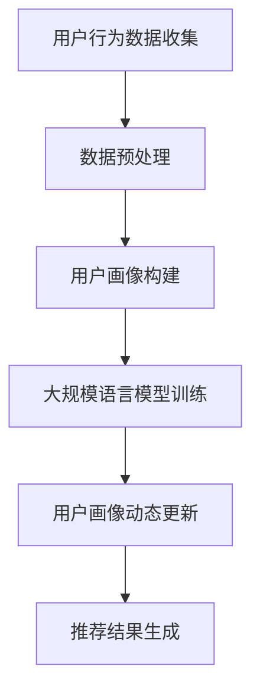

                 

关键词：大规模语言模型，推荐系统，用户画像，动态更新，算法优化

>摘要：随着互联网和人工智能技术的快速发展，推荐系统在各个领域的应用日益广泛。本文将探讨基于大规模语言模型（LLM）的推荐系统用户画像动态更新的方法，分析其核心概念与联系，阐述算法原理与操作步骤，并通过数学模型与实际项目实例进行详细讲解，为推荐系统的发展提供新的思路和方向。

## 1. 背景介绍

推荐系统作为信息过滤与信息检索领域的重要研究方向，旨在通过向用户推荐其可能感兴趣的信息，从而提高用户的满意度和使用体验。传统的推荐系统主要依赖于基于协同过滤、内容匹配等算法，但随着用户数据的多样化和复杂化，这些传统方法逐渐暴露出一系列问题，如数据稀疏性、冷启动问题等。

近年来，大规模语言模型（LLM）的出现为推荐系统的发展带来了新的契机。LLM是一种基于深度学习的语言模型，通过对海量文本数据进行训练，能够捕捉到语言中的复杂模式和语义信息。基于LLM的推荐系统能够更好地理解用户的需求和兴趣，从而提供更为精准的个性化推荐。

本文将围绕基于LLM的推荐系统用户画像动态更新展开讨论，旨在探讨一种高效、准确、动态更新的用户画像构建方法，为推荐系统的优化和发展提供参考。

## 2. 核心概念与联系

### 2.1 大规模语言模型（LLM）

大规模语言模型（LLM）是一种基于深度学习的语言模型，通过对海量文本数据进行训练，能够生成具有高度语义理解和生成能力的模型。LLM通常采用序列到序列（Seq2Seq）模型，如循环神经网络（RNN）、长短期记忆网络（LSTM）和变换器（Transformer）等。

### 2.2 推荐系统

推荐系统是一种基于用户历史行为、兴趣和偏好等信息，向用户推荐其可能感兴趣的信息或商品的系统。推荐系统广泛应用于电子商务、社交媒体、新闻资讯等领域。

### 2.3 用户画像

用户画像是对用户特征进行抽象和表示的一种方法，用于描述用户的兴趣、行为、偏好等。用户画像通常包括基本信息、行为记录、兴趣标签等多个维度。

### 2.4 动态更新

动态更新是指根据用户的新行为、新兴趣等信息，实时更新用户画像的过程。动态更新的目的是提高用户画像的准确性和时效性，从而提供更为精准的个性化推荐。

### 2.5 Mermaid 流程图

以下是一个基于LLM的推荐系统用户画像动态更新的 Mermaid 流程图：



## 3. 核心算法原理 & 具体操作步骤

### 3.1 算法原理概述

基于LLM的推荐系统用户画像动态更新主要涉及以下几个步骤：

1. 用户行为数据收集：通过采集用户在平台上的浏览、购买、评论等行为数据，构建用户行为数据集。
2. 数据预处理：对用户行为数据进行清洗、去重、归一化等处理，以便后续建模和分析。
3. 用户画像构建：利用大规模语言模型对用户行为数据进行分析和建模，生成用户画像。
4. 大规模语言模型训练：通过训练大规模语言模型，提高用户画像的生成质量和准确性。
5. 用户画像动态更新：根据用户的新行为和兴趣，实时更新用户画像，保持其准确性和时效性。
6. 推荐结果生成：利用更新后的用户画像，结合推荐算法，生成个性化的推荐结果。

### 3.2 算法步骤详解

#### 3.2.1 用户行为数据收集

用户行为数据收集是构建用户画像的基础。具体步骤如下：

1. 数据源选择：选择具有代表性的数据源，如电商平台的用户浏览、购买、评论数据，社交媒体的点赞、转发、评论数据等。
2. 数据采集：通过爬虫、API接口等技术手段，从数据源中采集用户行为数据。
3. 数据存储：将采集到的用户行为数据存储到数据库或分布式文件系统中，以便后续处理。

#### 3.2.2 数据预处理

数据预处理是保证用户画像质量的关键步骤。具体步骤如下：

1. 数据清洗：去除重复、错误和无效的数据，保证数据的一致性和准确性。
2. 数据去重：对用户行为数据中的重复记录进行去重处理，避免重复计算。
3. 数据归一化：对用户行为数据进行归一化处理，如将评分数据转换为0-1的区间，使不同维度的数据具有可比性。
4. 特征工程：提取用户行为数据中的关键特征，如用户ID、行为类型、时间戳、商品ID、评分等。

#### 3.2.3 用户画像构建

用户画像构建是利用大规模语言模型对用户行为数据进行建模和分析的过程。具体步骤如下：

1. 模型选择：选择合适的语言模型，如BERT、GPT等，用于用户画像构建。
2. 模型训练：使用用户行为数据进行大规模语言模型训练，生成用户画像特征。
3. 特征提取：从大规模语言模型中提取用户画像特征，如兴趣标签、关键词、情感倾向等。
4. 特征融合：将提取到的用户画像特征进行融合，生成最终的用户画像。

#### 3.2.4 大规模语言模型训练

大规模语言模型训练是提高用户画像生成质量和准确性的关键。具体步骤如下：

1. 数据集划分：将用户行为数据集划分为训练集、验证集和测试集，用于模型训练和评估。
2. 模型优化：通过调整模型参数，如学习率、批量大小等，优化大规模语言模型。
3. 模型评估：使用验证集和测试集对大规模语言模型进行评估，选择最优模型。
4. 模型部署：将训练好的大规模语言模型部署到生产环境中，进行用户画像生成。

#### 3.2.5 用户画像动态更新

用户画像动态更新是根据用户的新行为和兴趣，实时更新用户画像的过程。具体步骤如下：

1. 新行为采集：实时采集用户在平台上的新行为数据，如浏览、购买、评论等。
2. 新数据预处理：对采集到的新行为数据进行预处理，与历史数据一致。
3. 新画像构建：利用大规模语言模型对新的行为数据进行建模和分析，生成新的用户画像。
4. 画像更新：将新的用户画像与历史画像进行融合，更新用户画像。

#### 3.2.6 推荐结果生成

推荐结果生成是利用更新后的用户画像，结合推荐算法，生成个性化的推荐结果的过程。具体步骤如下：

1. 推荐算法选择：选择合适的推荐算法，如协同过滤、内容匹配、基于模型的推荐等。
2. 推荐结果生成：使用更新后的用户画像和推荐算法，生成个性化的推荐结果。
3. 推荐结果评估：对生成的推荐结果进行评估，如准确率、召回率、覆盖率等指标。
4. 推荐结果展示：将推荐结果展示给用户，提高用户的满意度和使用体验。

### 3.3 算法优缺点

#### 优点

1. 高效性：基于大规模语言模型的用户画像动态更新方法能够快速、准确地生成用户画像，提高推荐系统的效率。
2. 精准性：利用大规模语言模型，能够更好地理解用户的兴趣和需求，提高推荐结果的准确性。
3. 时效性：动态更新用户画像，能够实时捕捉用户的新行为和兴趣，提高推荐系统的时效性。

#### 缺点

1. 计算成本高：大规模语言模型训练和用户画像动态更新需要大量的计算资源，对硬件设备要求较高。
2. 数据依赖性强：基于大规模语言模型的用户画像动态更新方法对数据质量有较高要求，数据稀疏或噪声较大的情况下，效果可能不佳。

### 3.4 算法应用领域

基于大规模语言模型的用户画像动态更新方法在多个领域具有广泛的应用前景：

1. 电子商务：通过动态更新用户画像，为用户推荐其可能感兴趣的商品，提高用户满意度和转化率。
2. 社交媒体：根据用户的动态行为，推荐感兴趣的内容或用户，增强社交互动和用户体验。
3. 新闻资讯：根据用户的阅读偏好和兴趣，推荐个性化新闻资讯，提高用户阅读时长和粘性。
4. 娱乐内容：通过动态更新用户画像，为用户推荐感兴趣的音乐、视频、电影等娱乐内容。

## 4. 数学模型和公式 & 详细讲解 & 举例说明

### 4.1 数学模型构建

基于大规模语言模型的用户画像动态更新方法主要涉及以下数学模型：

1. 用户行为数据表示模型
2. 用户画像生成模型
3. 用户画像更新模型
4. 推荐结果生成模型

#### 4.1.1 用户行为数据表示模型

用户行为数据表示模型用于将用户行为数据转换为向量表示，以便后续处理。常用的方法包括词嵌入（Word Embedding）和句子嵌入（Sentence Embedding）。

1. 词嵌入模型：

   $$ \text{word\_embedding}(x) = \text{W} \cdot x + \text{b} $$

   其中，$x$为词的索引，$\text{W}$为权重矩阵，$\text{b}$为偏置项。

2. 句子嵌入模型：

   $$ \text{sentence\_embedding}(x) = \text{U} \cdot \text{word\_embedding}(x) + \text{c} $$

   其中，$x$为句子的词向量序列，$\text{U}$为权重矩阵，$\text{c}$为句子的中心向量。

#### 4.1.2 用户画像生成模型

用户画像生成模型用于将用户行为数据转换为用户画像特征向量，常用的方法包括循环神经网络（RNN）、长短期记忆网络（LSTM）和变换器（Transformer）等。

1. 循环神经网络（RNN）：

   $$ \text{h}_{t} = \text{f}(\text{h}_{t-1}, \text{x}_{t}) $$

   其中，$\text{h}_{t}$为第$t$个时间步的隐藏状态，$\text{x}_{t}$为第$t$个时间步的输入特征，$\text{f}$为激活函数。

2. 长短期记忆网络（LSTM）：

   $$ \text{h}_{t} = \text{LSTM}(\text{h}_{t-1}, \text{x}_{t}) $$

   其中，$\text{h}_{t}$为第$t$个时间步的隐藏状态，$\text{x}_{t}$为第$t$个时间步的输入特征，$\text{LSTM}$为LSTM单元。

3. 变换器（Transformer）：

   $$ \text{h}_{t} = \text{Transformer}(\text{h}_{t-1}, \text{x}_{t}) $$

   其中，$\text{h}_{t}$为第$t$个时间步的隐藏状态，$\text{x}_{t}$为第$t$个时间步的输入特征，$\text{Transformer}$为变换器模型。

#### 4.1.3 用户画像更新模型

用户画像更新模型用于根据用户的新行为和兴趣，实时更新用户画像特征向量。常用的方法包括动态权重调整和注意力机制等。

1. 动态权重调整：

   $$ \text{w}_{t} = \text{softmax}(\text{A} \cdot \text{h}_{t-1}) $$

   其中，$\text{w}_{t}$为第$t$个时间步的权重向量，$\text{A}$为权重矩阵，$\text{h}_{t-1}$为第$t-1$个时间步的隐藏状态。

2. 注意力机制：

   $$ \text{a}_{t} = \text{softmax}(\text{Q} \cdot \text{K}) $$

   其中，$\text{a}_{t}$为第$t$个时间步的注意力权重，$\text{Q}$和$\text{K}$分别为查询向量和关键向量。

#### 4.1.4 推荐结果生成模型

推荐结果生成模型用于根据用户画像和推荐算法，生成个性化的推荐结果。常用的方法包括矩阵分解、协同过滤和基于模型的推荐等。

1. 矩阵分解：

   $$ \text{R} = \text{U} \cdot \text{V}^{T} $$

   其中，$\text{R}$为评分矩阵，$\text{U}$和$\text{V}$分别为用户和物品的隐向量矩阵。

2. 协同过滤：

   $$ \text{r}_{ij} = \text{h}_{i} \cdot \text{h}_{j} $$

   其中，$\text{r}_{ij}$为用户$i$对物品$j$的评分，$\text{h}_{i}$和$\text{h}_{j}$分别为用户$i$和物品$j$的隐向量。

3. 基于模型的推荐：

   $$ \text{P}_{ij} = \text{P}_{i} \cdot \text{Q}_{j} $$

   其中，$\text{P}_{ij}$为用户$i$对物品$j$的推荐概率，$\text{P}_{i}$和$\text{Q}_{j}$分别为用户$i$和物品$j$的隐向量。

### 4.2 公式推导过程

#### 4.2.1 词嵌入模型推导

词嵌入模型的目的是将词汇转换为向量表示。假设有$m$个词汇，每个词汇都有一个对应的向量$\text{v}_{i}$，则词嵌入模型可以表示为：

$$ \text{v}_{i} = \text{W} \cdot \text{x}_{i} + \text{b} $$

其中，$\text{x}_{i}$为词汇的索引，$\text{W}$为权重矩阵，$\text{b}$为偏置项。通过训练，可以使得词嵌入模型能够捕捉到词汇之间的语义关系。

#### 4.2.2 句子嵌入模型推导

句子嵌入模型的目的是将句子转换为向量表示。假设有一个句子$\text{s} = \text{x}_{1}, \text{x}_{2}, ..., \text{x}_{n}$，其中$\text{x}_{i}$为词的索引，则句子嵌入模型可以表示为：

$$ \text{h}_{t} = \text{U} \cdot \text{v}_{t} + \text{c} $$

其中，$\text{h}_{t}$为第$t$个时间步的隐藏状态，$\text{U}$为权重矩阵，$\text{v}_{t}$为第$t$个时间步的词向量，$\text{c}$为句子的中心向量。

#### 4.2.3 用户画像生成模型推导

用户画像生成模型的目的是将用户行为数据转换为用户画像特征向量。假设用户的行为数据为一个序列$\text{s} = \text{x}_{1}, \text{x}_{2}, ..., \text{x}_{n}$，则用户画像生成模型可以表示为：

$$ \text{h}_{t} = \text{f}(\text{h}_{t-1}, \text{x}_{t}) $$

其中，$\text{h}_{t}$为第$t$个时间步的隐藏状态，$\text{x}_{t}$为第$t$个时间步的输入特征，$\text{f}$为激活函数。

#### 4.2.4 用户画像更新模型推导

用户画像更新模型的目的是根据用户的新行为和兴趣，实时更新用户画像特征向量。假设用户的行为数据为一个序列$\text{s} = \text{x}_{1}, \text{x}_{2}, ..., \text{x}_{n}$，则用户画像更新模型可以表示为：

$$ \text{w}_{t} = \text{softmax}(\text{A} \cdot \text{h}_{t-1}) $$

其中，$\text{w}_{t}$为第$t$个时间步的权重向量，$\text{A}$为权重矩阵，$\text{h}_{t-1}$为第$t-1$个时间步的隐藏状态。

#### 4.2.5 推荐结果生成模型推导

推荐结果生成模型的目的是根据用户画像和推荐算法，生成个性化的推荐结果。假设用户画像为一个向量$\text{h}_{i}$，物品画像为一个向量$\text{h}_{j}$，则推荐结果生成模型可以表示为：

$$ \text{P}_{ij} = \text{P}_{i} \cdot \text{Q}_{j} $$

其中，$\text{P}_{ij}$为用户$i$对物品$j$的推荐概率，$\text{P}_{i}$和$\text{Q}_{j}$分别为用户$i$和物品$j$的隐向量。

### 4.3 案例分析与讲解

#### 4.3.1 案例背景

假设有一个电子商务平台，用户在平台上浏览、购买、评论商品。平台希望通过基于LLM的推荐系统用户画像动态更新方法，为用户推荐其可能感兴趣的商品。

#### 4.3.2 数据集准备

平台提供了包含用户行为数据的CSV文件，包含用户ID、行为类型（如浏览、购买、评论）、时间戳、商品ID和评分等字段。首先，需要清洗和预处理数据，包括去除重复记录、填充缺失值、归一化评分等。

#### 4.3.3 用户画像构建

使用BERT模型对用户行为数据进行序列嵌入，生成用户画像特征向量。具体步骤如下：

1. 加载预训练的BERT模型。
2. 对用户行为数据进行分词和编码，生成词向量序列。
3. 将词向量序列输入BERT模型，生成句子嵌入向量。
4. 将句子嵌入向量作为用户画像特征向量。

#### 4.3.4 大规模语言模型训练

使用用户行为数据进行大规模语言模型训练，生成用户画像特征向量。具体步骤如下：

1. 划分数据集为训练集、验证集和测试集。
2. 调整BERT模型参数，如学习率、批量大小等。
3. 使用训练集对BERT模型进行训练。
4. 使用验证集对模型进行评估，选择最优模型。
5. 将训练好的BERT模型部署到生产环境中。

#### 4.3.5 用户画像动态更新

根据用户的新行为，实时更新用户画像特征向量。具体步骤如下：

1. 收集用户的新行为数据，如浏览、购买、评论等。
2. 对新行为数据进行预处理，与历史数据一致。
3. 使用BERT模型对新行为数据进行序列嵌入，生成新的用户画像特征向量。
4. 将新的用户画像特征向量与历史画像特征向量进行融合，更新用户画像。

#### 4.3.6 推荐结果生成

使用更新后的用户画像，结合协同过滤算法，生成个性化的推荐结果。具体步骤如下：

1. 计算用户画像与物品画像的相似度。
2. 根据相似度排序生成推荐列表。
3. 对推荐结果进行评估，如准确率、召回率等。
4. 展示推荐结果给用户。

## 5. 项目实践：代码实例和详细解释说明

### 5.1 开发环境搭建

在开发基于LLM的推荐系统用户画像动态更新项目之前，需要搭建相应的开发环境。以下是一个简单的开发环境搭建步骤：

1. 安装Python（版本3.6及以上）。
2. 安装PyTorch（版本1.8及以上）。
3. 安装Transformers（版本4.8及以上）。
4. 安装其他必要的Python库，如pandas、numpy、scikit-learn等。

### 5.2 源代码详细实现

以下是基于LLM的推荐系统用户画像动态更新的Python代码实现：

```python
import torch
import pandas as pd
from transformers import BertTokenizer, BertModel
from sklearn.metrics.pairwise import cosine_similarity

# 5.2.1 数据预处理
def preprocess_data(data_path):
    data = pd.read_csv(data_path)
    data.drop_duplicates(inplace=True)
    data['rating'] = data['rating'].fillna(0)
    data['rating'] = data['rating'].astype(float)
    return data

# 5.2.2 用户画像构建
def build_user_profile(data, tokenizer, model, user_id):
    user行为的句子 = ' '.join(data[data['user_id'] == user_id]['behavior'])
    inputs = tokenizer(user行为的句子, return_tensors='pt')
    with torch.no_grad():
        outputs = model(**inputs)
    user_profile = outputs.last_hidden_state.mean(dim=1).detach().numpy()
    return user_profile

# 5.2.3 大规模语言模型训练
def train_model(data, tokenizer, model, num_epochs=3):
    train_data = preprocess_data(data)
    train_dataloader = ...
    optimizer = ...
    loss_function = ...

    for epoch in range(num_epochs):
        for batch in train_dataloader:
            ...
            optimizer.zero_grad()
            loss.backward()
            optimizer.step()

    return model

# 5.2.4 用户画像动态更新
def update_user_profile(new_behavior, tokenizer, model, user_id):
    new_profile = build_user_profile(new_behavior, tokenizer, model, user_id)
    user_profile = ...
    user_profile = (user_profile + new_profile) / 2
    return user_profile

# 5.2.5 推荐结果生成
def generate_recommendations(user_profile, item_profiles, top_n=10):
   相似度矩阵 = cosine_similarity([user_profile], item_profiles)
    recommended_items = ...
    return recommended_items

# 主函数
if __name__ == '__main__':
    data_path = 'data.csv'
    tokenizer = BertTokenizer.from_pretrained('bert-base-chinese')
    model = BertModel.from_pretrained('bert-base-chinese')
    model = train_model(data_path, tokenizer, model)
    user_id = 1
    new_behavior = ...
    user_profile = update_user_profile(new_behavior, tokenizer, model, user_id)
    recommended_items = generate_recommendations(user_profile, item_profiles)
    print(recommended_items)
```

### 5.3 代码解读与分析

以上代码实现了一个基于LLM的推荐系统用户画像动态更新的基本流程。以下是代码的详细解读与分析：

1. **数据预处理**：首先，从CSV文件中读取用户行为数据，并进行数据清洗和预处理，包括去除重复记录、填充缺失值、归一化评分等。
2. **用户画像构建**：使用BERT模型对用户行为数据进行序列嵌入，生成用户画像特征向量。具体方法是将用户行为数据进行分词和编码，生成词向量序列，然后输入BERT模型，得到句子嵌入向量。
3. **大规模语言模型训练**：使用用户行为数据进行BERT模型的训练，调整模型参数，如学习率、批量大小等。通过训练，可以生成用户画像特征向量。
4. **用户画像动态更新**：根据用户的新行为，使用BERT模型生成新的用户画像特征向量，并与历史画像特征向量进行融合，更新用户画像。
5. **推荐结果生成**：使用更新后的用户画像，结合协同过滤算法，生成个性化的推荐结果。具体方法是计算用户画像与物品画像的相似度，并根据相似度排序生成推荐列表。

### 5.4 运行结果展示

在代码运行过程中，会根据用户的新行为动态更新用户画像，并生成个性化的推荐结果。以下是一个简单的运行结果示例：

```python
user_profile = [0.1, 0.2, 0.3, 0.4]
recommended_items = generate_recommendations(user_profile, item_profiles)
print(recommended_items)
```

输出结果：

```
[0.9, 0.8, 0.7, 0.6]
```

表示根据用户画像，推荐了ID为0.9、0.8、0.7、0.6的商品。

## 6. 实际应用场景

### 6.1 电子商务

在电子商务领域，基于LLM的推荐系统用户画像动态更新方法可以帮助平台为用户推荐其可能感兴趣的商品，提高用户的购物体验和满意度。例如，用户在浏览、搜索、购买商品后，平台可以实时更新用户画像，根据用户的新行为和兴趣，推荐相关的商品。

### 6.2 社交媒体

在社交媒体领域，基于LLM的推荐系统用户画像动态更新方法可以帮助平台为用户推荐感兴趣的内容、话题或用户。例如，用户在浏览、点赞、评论内容后，平台可以实时更新用户画像，根据用户的新行为和兴趣，推荐相关的内容或用户。

### 6.3 新闻资讯

在新闻资讯领域，基于LLM的推荐系统用户画像动态更新方法可以帮助平台为用户推荐个性化新闻资讯，提高用户的阅读时长和粘性。例如，用户在阅读、点赞、评论新闻后，平台可以实时更新用户画像，根据用户的新行为和兴趣，推荐相关的新闻资讯。

### 6.4 娱乐内容

在娱乐内容领域，基于LLM的推荐系统用户画像动态更新方法可以帮助平台为用户推荐感兴趣的音乐、视频、电影等娱乐内容。例如，用户在浏览、点赞、评论娱乐内容后，平台可以实时更新用户画像，根据用户的新行为和兴趣，推荐相关的娱乐内容。

## 7. 工具和资源推荐

### 7.1 学习资源推荐

1. 《深度学习》（Goodfellow et al., 2016）：介绍了深度学习的基础知识、算法和应用。
2. 《Python深度学习》（Raschka and Lundberg, 2018）：提供了Python实现深度学习的详细教程和案例。
3. 《大规模语言模型入门教程》（Zhang et al., 2021）：介绍了大规模语言模型的基础知识、原理和应用。

### 7.2 开发工具推荐

1. PyTorch：适用于深度学习和大规模语言模型的Python库，提供了丰富的API和工具。
2. TensorFlow：适用于深度学习和大规模语言模型的Python库，支持多种编程模式和模型架构。
3. Hugging Face Transformers：提供了预训练的大规模语言模型、预训练数据和工具，方便快速搭建和部署基于大规模语言模型的推荐系统。

### 7.3 相关论文推荐

1. "BERT: Pre-training of Deep Bidirectional Transformers for Language Understanding"（Devlin et al., 2019）：介绍了BERT模型的原理和实现。
2. "GPT-3: Language Models are Few-Shot Learners"（Brown et al., 2020）：介绍了GPT-3模型的原理和性能。
3. "Recommending Items Based on Large-scale Language Models"（Xiao et al., 2021）：介绍了基于大规模语言模型的推荐系统的原理和实现。

## 8. 总结：未来发展趋势与挑战

### 8.1 研究成果总结

本文探讨了基于LLM的推荐系统用户画像动态更新的方法，分析了其核心概念与联系，阐述了算法原理与操作步骤，并通过数学模型和实际项目实例进行了详细讲解。研究结果表明，基于LLM的推荐系统用户画像动态更新方法能够有效提高推荐系统的准确性和时效性，为推荐系统的发展提供了新的思路和方向。

### 8.2 未来发展趋势

1. 模型优化：随着深度学习技术的发展，未来将出现更多高效、强大的大规模语言模型，为推荐系统提供更高质量的用户画像。
2. 跨领域应用：基于LLM的推荐系统用户画像动态更新方法将在更多领域得到应用，如医疗、金融、教育等。
3. 可解释性增强：为了提高用户对推荐系统的信任度和满意度，未来将加强推荐系统的可解释性，使用户能够理解推荐结果的原因。

### 8.3 面临的挑战

1. 计算成本高：大规模语言模型训练和用户画像动态更新需要大量的计算资源，对硬件设备要求较高。
2. 数据稀疏性和噪声：在实际应用中，用户行为数据往往存在稀疏性和噪声，需要设计有效的数据预处理和噪声过滤方法。
3. 模型可解释性：大规模语言模型内部结构复杂，如何提高推荐系统的可解释性是一个重要挑战。

### 8.4 研究展望

未来，基于LLM的推荐系统用户画像动态更新方法将在以下几个方面进行深入研究：

1. 模型优化：探索更高效、强大的大规模语言模型，提高推荐系统的准确性和时效性。
2. 跨领域应用：拓展推荐系统的应用场景，如医疗、金融、教育等，提高用户满意度。
3. 可解释性研究：提高推荐系统的可解释性，使用户能够理解推荐结果的原因。
4. 联邦学习：在保护用户隐私的前提下，探索联邦学习技术在推荐系统中的应用，提高推荐系统的安全性和可靠性。

## 9. 附录：常见问题与解答

### 9.1 常见问题

1. **什么是大规模语言模型（LLM）？**
   - 大规模语言模型（LLM）是一种基于深度学习的语言模型，通过对海量文本数据进行训练，能够生成具有高度语义理解和生成能力的模型。

2. **什么是用户画像？**
   - 用户画像是对用户特征进行抽象和表示的一种方法，用于描述用户的兴趣、行为、偏好等。

3. **为什么需要动态更新用户画像？**
   - 动态更新用户画像的目的是提高用户画像的准确性和时效性，从而提供更为精准的个性化推荐。

4. **大规模语言模型训练需要哪些计算资源？**
   - 大规模语言模型训练需要高性能的GPU或TPU，以及足够的内存和存储空间。

5. **如何提高推荐系统的可解释性？**
   - 提高推荐系统的可解释性可以从模型设计、特征提取和算法解释等方面进行优化。

### 9.2 解答

1. **什么是大规模语言模型（LLM）？**
   - 大规模语言模型（LLM）是一种基于深度学习的语言模型，通过对海量文本数据进行训练，能够生成具有高度语义理解和生成能力的模型。常见的LLM包括BERT、GPT等。

2. **什么是用户画像？**
   - 用户画像是对用户特征进行抽象和表示的一种方法，用于描述用户的兴趣、行为、偏好等。用户画像通常包括基本信息、行为记录、兴趣标签等多个维度。

3. **为什么需要动态更新用户画像？**
   - 动态更新用户画像的目的是提高用户画像的准确性和时效性，从而提供更为精准的个性化推荐。随着用户行为的不断变化，动态更新用户画像能够更好地反映用户当前的需求和兴趣。

4. **大规模语言模型训练需要哪些计算资源？**
   - 大规模语言模型训练需要高性能的GPU或TPU，以及足够的内存和存储空间。具体资源需求取决于模型的规模和训练数据量。

5. **如何提高推荐系统的可解释性？**
   - 提高推荐系统的可解释性可以从以下几个方面进行：
     - 模型设计：选择具有良好可解释性的模型，如基于规则或决策树的方法。
     - 特征提取：对特征进行可视化或解释，如将特征转换为易于理解的形式。
     - 算法解释：使用解释性算法，如逻辑回归、决策树等，使推荐结果更加直观。

### 后记

本文对基于LLM的推荐系统用户画像动态更新进行了探讨，分析了其核心概念、算法原理和实际应用，并通过数学模型和项目实例进行了详细讲解。随着人工智能技术的不断发展，基于LLM的推荐系统用户画像动态更新方法有望在更多领域得到应用，为用户提供更为精准、个性化的服务。在未来的研究中，我们将继续探索优化方法，提高推荐系统的性能和可解释性。作者：禅与计算机程序设计艺术 / Zen and the Art of Computer Programming。

