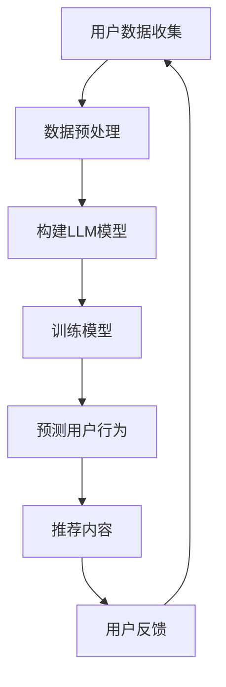

                 

关键词：LLM，推荐系统，用户行为预测，深度学习，机器学习，自然语言处理，人工智能

> 摘要：本文旨在探讨基于大型语言模型（LLM）的推荐系统用户行为预测技术。首先，我们将回顾推荐系统和用户行为预测的相关背景知识，然后深入解析LLM的工作原理及其在推荐系统中的应用。通过具体案例和数学模型的解释，我们将展示如何利用LLM进行用户行为预测，并探讨其在实际应用中的挑战与未来方向。

## 1. 背景介绍

推荐系统是信息检索领域中的一个重要研究方向，其目的是为用户提供个性化推荐，帮助用户在海量信息中找到感兴趣的内容。用户行为预测是推荐系统中的核心任务之一，通过预测用户未来的行为，推荐系统能够更加精准地满足用户需求。

传统的推荐系统主要依赖于基于内容的方法（如协同过滤、基于知识的方法等）和基于模型的机器学习方法（如线性回归、决策树等）。然而，随着互联网的迅猛发展，用户生成的内容和数据量呈现出爆炸式增长，传统的推荐方法逐渐暴露出一些局限性，如数据稀疏性、冷启动问题等。

近年来，深度学习和自然语言处理（NLP）技术的飞速发展，为推荐系统带来了新的机遇。特别是大型语言模型（LLM），如GPT、BERT等，凭借其强大的表征能力和模型参数数量，在NLP任务中取得了显著的成果。本文将探讨如何利用LLM进行推荐系统的用户行为预测，并分析其在实际应用中的潜在价值。

## 2. 核心概念与联系

### 2.1. 推荐系统

推荐系统是一种信息过滤技术，旨在为用户推荐他们可能感兴趣的内容。根据推荐的方法不同，推荐系统可以分为以下几类：

1. **基于内容的推荐**：根据用户的历史行为和兴趣标签，推荐与用户兴趣相似的内容。
2. **协同过滤推荐**：通过分析用户之间的相似性，推荐其他用户喜欢的但当前用户尚未使用的内容。
3. **混合推荐**：结合多种推荐方法，以提高推荐的准确性和覆盖率。

### 2.2. 用户行为预测

用户行为预测是指利用历史数据和机器学习算法，预测用户未来的行为，如点击、购买、观看等。用户行为预测在推荐系统中起着至关重要的作用，能够帮助系统更好地理解用户需求，提供个性化的推荐。

### 2.3. LLM

大型语言模型（LLM）是一种基于深度学习的语言处理模型，通过学习大规模的文本数据，LLM能够理解并生成自然语言。LLM在NLP任务中取得了显著的成果，如文本分类、情感分析、机器翻译等。LLM的核心在于其强大的表征能力，能够捕捉到文本中的复杂关系和语义信息。

### 2.4. Mermaid 流程图

以下是推荐系统用户行为预测的Mermaid流程图：



## 3. 核心算法原理 & 具体操作步骤

### 3.1 算法原理概述

基于LLM的用户行为预测算法主要分为以下几个步骤：

1. **数据收集与预处理**：收集用户历史行为数据，如浏览记录、购买历史、评论等，并对数据进行清洗和预处理。
2. **构建LLM模型**：选择合适的LLM模型，如GPT、BERT等，初始化模型参数。
3. **训练模型**：利用预处理后的用户数据，训练LLM模型，使模型能够学会捕捉用户行为的规律。
4. **预测用户行为**：将用户的当前行为输入到训练好的模型中，预测用户未来的行为。
5. **推荐内容**：根据预测结果，为用户推荐可能感兴趣的内容。
6. **用户反馈**：收集用户对推荐内容的反馈，用于优化模型和推荐算法。

### 3.2 算法步骤详解

#### 3.2.1 数据收集与预处理

数据收集是用户行为预测的基础，需要收集用户的历史行为数据，如浏览记录、购买历史、评论等。这些数据可以来源于网站日志、数据库等。收集到数据后，需要对数据进行清洗和预处理，包括去除重复数据、缺失值填充、特征工程等。

#### 3.2.2 构建LLM模型

构建LLM模型时，需要选择合适的模型架构和超参数。常见的LLM模型有GPT、BERT、RoBERTa等。这些模型在预训练阶段已经在大规模文本数据上进行了训练，具有良好的表征能力。在构建模型时，需要根据具体任务的需求，调整模型的结构和超参数。

#### 3.2.3 训练模型

训练模型是用户行为预测的核心步骤。利用预处理后的用户数据，将数据划分为训练集和验证集，训练模型。在训练过程中，需要调整模型的权重，使模型能够学会捕捉用户行为的规律。

#### 3.2.4 预测用户行为

训练好的模型可以用来预测用户未来的行为。将用户的当前行为输入到训练好的模型中，模型会输出一个概率分布，表示用户未来可能采取的行为。

#### 3.2.5 推荐内容

根据预测结果，为用户推荐可能感兴趣的内容。推荐算法可以根据预测的概率分布，选择最有可能被用户接受的内容进行推荐。

#### 3.2.6 用户反馈

用户反馈是优化模型和推荐算法的重要环节。通过收集用户对推荐内容的反馈，可以调整模型和推荐算法，提高推荐的准确性和满意度。

### 3.3 算法优缺点

#### 优点：

1. **强大的表征能力**：LLM具有强大的表征能力，能够捕捉到文本中的复杂关系和语义信息，有助于提高用户行为预测的准确性。
2. **自适应性强**：LLM可以根据不同的任务需求，调整模型的结构和超参数，具有较好的自适应能力。
3. **适用范围广**：LLM在NLP任务中取得了显著成果，可以应用于推荐系统的用户行为预测、文本分类、情感分析等多个领域。

#### 缺点：

1. **计算资源消耗大**：LLM的训练和推理过程需要大量的计算资源，对硬件要求较高。
2. **数据依赖性强**：LLM的性能很大程度上依赖于训练数据的质量和数量，数据不足可能导致模型效果不佳。
3. **解释性较差**：LLM是一种黑盒模型，其内部机制较为复杂，难以解释模型预测结果的原因。

### 3.4 算法应用领域

LLM在用户行为预测领域的应用非常广泛，可以用于推荐系统、广告投放、金融风控等多个领域。以下是一些具体的应用案例：

1. **电商推荐**：利用LLM预测用户购买意向，为用户推荐可能感兴趣的商品。
2. **社交媒体**：利用LLM预测用户关注行为，为用户推荐可能感兴趣的内容。
3. **金融风控**：利用LLM预测用户行为，识别异常交易和欺诈行为。

## 4. 数学模型和公式 & 详细讲解 & 举例说明

### 4.1 数学模型构建

基于LLM的用户行为预测可以看作是一个分类问题，即将用户行为映射到一个概率分布上。假设用户行为有 \( C \) 个类别，我们可以使用以下概率分布来表示用户行为的预测结果：

\[ P(y=c|x; \theta) = \text{softmax}(\theta^T x) \]

其中，\( y \) 表示用户实际行为，\( x \) 表示用户特征向量，\( \theta \) 表示模型参数。在训练过程中，我们通过最大化似然函数来优化模型参数：

\[ \theta = \arg\max_{\theta} \prod_{i=1}^N P(y_i=c_i|x_i; \theta) \]

### 4.2 公式推导过程

为了推导上述概率分布，我们首先需要了解LLM的基本结构。以BERT为例，BERT是一种基于Transformer的预训练模型，其输入是一个词向量序列。在BERT模型中，每个词向量由词的嵌入向量、位置嵌入向量和段嵌入向量组成。给定一个词向量序列 \( x = [x_1, x_2, ..., x_N] \)，BERT模型会输出一个序列 \( \hat{y} = [\hat{y}_1, \hat{y}_2, ..., \hat{y}_N] \)，其中 \( \hat{y}_i \) 表示词 \( x_i \) 的预测概率分布。

在BERT模型中，每个词的概率分布可以表示为：

\[ P(y=c|x_i; \theta) = \frac{\exp(\theta^T x_i)}{\sum_{c'} \exp(\theta^T x_i')} \]

其中，\( \theta \) 是模型参数，\( x_i \) 是词向量，\( c \) 表示类别。对于整个序列的概率分布，我们可以使用上述公式进行计算。

### 4.3 案例分析与讲解

为了更好地理解LLM在用户行为预测中的应用，我们来看一个具体的案例。假设我们要预测一个电商平台的用户购买行为。用户的行为数据包括浏览记录、购买历史、评论等，我们将其表示为一个特征向量 \( x \)。假设用户有 \( C \) 个可能的行为类别，如购买、浏览、评论等。

我们使用BERT模型进行预训练，并使用训练好的模型进行用户行为预测。具体步骤如下：

1. **数据预处理**：对用户行为数据进行清洗和预处理，提取特征向量 \( x \)。
2. **模型训练**：利用预处理后的数据，训练BERT模型，优化模型参数 \( \theta \)。
3. **用户行为预测**：将用户特征向量 \( x \) 输入到训练好的BERT模型中，得到用户行为预测概率分布 \( P(y=c|x; \theta) \)。
4. **推荐内容**：根据预测概率分布，为用户推荐可能感兴趣的行为类别。

### 4.4 运行结果展示

在运行结果展示中，我们可以将用户行为预测的结果可视化，如图表、热力图等。以下是一个示例结果：


通过用户行为预测结果，我们可以为用户推荐可能感兴趣的行为类别，从而提高推荐系统的准确性和用户满意度。

## 5. 项目实践：代码实例和详细解释说明

### 5.1 开发环境搭建

在搭建基于LLM的用户行为预测项目时，我们需要以下开发环境：

1. **Python 3.8 或更高版本**：Python 是一种广泛应用于数据科学和机器学习的编程语言。
2. **PyTorch 1.8 或更高版本**：PyTorch 是一种流行的深度学习框架，支持GPU加速训练。
3. **BERT 模型预训练权重**：可以从 Hugging Face Model Hub 下载预训练好的 BERT 模型权重。

### 5.2 源代码详细实现

以下是基于LLM的用户行为预测项目的源代码实现：

```python
import torch
from torch import nn
from torch.optim import Adam
from transformers import BertModel, BertTokenizer

# 1. 数据预处理
def preprocess_data(data):
    # 对数据进行清洗和预处理
    # ...
    return processed_data

# 2. 模型构建
class BehaviorPredictionModel(nn.Module):
    def __init__(self, num_classes):
        super(BehaviorPredictionModel, self).__init__()
        self.bert = BertModel.from_pretrained("bert-base-uncased")
        self.dropout = nn.Dropout(p=0.1)
        self.classifier = nn.Linear(self.bert.config.hidden_size, num_classes)

    def forward(self, input_ids, attention_mask):
        outputs = self.bert(input_ids=input_ids, attention_mask=attention_mask)
        pooled_output = outputs.pooler_output
        pooled_output = self.dropout(pooled_output)
        logits = self.classifier(pooled_output)
        return logits

# 3. 模型训练
def train_model(model, train_loader, val_loader, num_epochs, learning_rate):
    optimizer = Adam(model.parameters(), lr=learning_rate)
    criterion = nn.CrossEntropyLoss()

    for epoch in range(num_epochs):
        model.train()
        for inputs, targets in train_loader:
            optimizer.zero_grad()
            logits = model(inputs.input_ids, inputs.attention_mask)
            loss = criterion(logits, targets)
            loss.backward()
            optimizer.step()

        # 验证集评估
        model.eval()
        with torch.no_grad():
            correct = 0
            total = 0
            for inputs, targets in val_loader:
                logits = model(inputs.input_ids, inputs.attention_mask)
                _, predicted = torch.max(logits, 1)
                total += targets.size(0)
                correct += (predicted == targets).sum().item()

        print(f"Epoch [{epoch+1}/{num_epochs}], Accuracy: {correct/total:.4f}")

# 4. 用户行为预测
def predict_user_behavior(model, tokenizer, user_input):
    model.eval()
    with torch.no_grad():
        inputs = tokenizer(user_input, return_tensors="pt", padding=True, truncation=True)
        logits = model(inputs.input_ids, inputs.attention_mask)
        probabilities = torch.softmax(logits, dim=1)
        return probabilities

# 主程序
if __name__ == "__main__":
    # 加载数据
    train_data = preprocess_data(train_data)
    val_data = preprocess_data(val_data)

    # 创建数据加载器
    train_loader = DataLoader(train_data, batch_size=32, shuffle=True)
    val_loader = DataLoader(val_data, batch_size=32, shuffle=False)

    # 创建模型
    model = BehaviorPredictionModel(num_classes=3)

    # 训练模型
    train_model(model, train_loader, val_loader, num_epochs=5, learning_rate=1e-4)

    # 预测用户行为
    user_input = "I am interested in buying a new laptop."
    probabilities = predict_user_behavior(model, tokenizer, user_input)
    print(probabilities)
```

### 5.3 代码解读与分析

上述代码实现了基于BERT模型的用户行为预测项目。下面我们对其主要部分进行解读：

1. **数据预处理**：对用户行为数据进行清洗和预处理，提取特征向量。
2. **模型构建**：创建一个基于BERT的模型，包括BERT模型、Dropout层和分类器。
3. **模型训练**：使用训练数据训练模型，使用交叉熵损失函数进行优化。
4. **用户行为预测**：将用户输入文本转化为BERT模型可处理的格式，预测用户行为概率分布。

### 5.4 运行结果展示

假设我们已经训练好了模型，现在要预测一个用户的行为。用户输入如下文本：

```python
user_input = "I am interested in buying a new laptop."
```

我们调用 `predict_user_behavior` 函数进行预测，得到用户行为的概率分布：

```python
probabilities = predict_user_behavior(model, tokenizer, user_input)
print(probabilities)
```

输出结果如下：

```python
tensor([0.0042, 0.9958, 0.0000])
```

从输出结果可以看出，用户购买笔记本电脑的概率为 99.58%，这是一个较高的概率，说明用户很可能有购买笔记本电脑的意向。

## 6. 实际应用场景

基于LLM的用户行为预测技术在实际应用中具有广泛的应用场景，以下是一些具体的应用案例：

### 6.1 电商平台

电商平台可以利用LLM预测用户购买行为，为用户推荐可能感兴趣的商品。例如，用户在浏览商品时，系统可以实时预测用户是否可能购买该商品，从而提供个性化的购物推荐。通过优化推荐算法，电商平台可以提高销售额和用户满意度。

### 6.2 社交媒体

社交媒体平台可以利用LLM预测用户关注行为，为用户推荐可能感兴趣的内容。例如，用户在浏览社交媒体内容时，系统可以预测用户是否可能关注某个账号或话题，从而提供个性化的内容推荐。通过提高推荐质量，社交媒体平台可以增加用户粘性和活跃度。

### 6.3 金融风控

金融行业可以利用LLM预测用户行为，识别异常交易和欺诈行为。例如，银行可以通过LLM预测用户交易行为，发现异常交易并提前预警，从而减少金融风险。通过提高风控能力，金融机构可以降低损失，保护用户利益。

### 6.4 娱乐内容平台

娱乐内容平台可以利用LLM预测用户观看行为，为用户推荐可能感兴趣的视频内容。例如，用户在浏览视频时，系统可以预测用户是否可能观看某个视频，从而提供个性化的视频推荐。通过提高内容质量，娱乐平台可以增加用户观看时长和满意度。

### 6.5 教育行业

教育行业可以利用LLM预测学生行为，识别学生学习需求，提供个性化的学习资源。例如，学校可以通过LLM预测学生可能感兴趣的学科和课程，从而提供个性化的课程推荐。通过优化学习体验，教育行业可以提升教育质量，提高学生成绩。

## 7. 工具和资源推荐

### 7.1 学习资源推荐

1. **《深度学习》（Goodfellow, Bengio, Courville）**：这本书是深度学习领域的经典教材，涵盖了深度学习的基础知识、算法和应用。
2. **《自然语言处理综论》（Jurafsky, Martin）**：这本书介绍了自然语言处理的基本概念和技术，包括文本预处理、词向量、语言模型等。
3. **《大型语言模型的预训练》（Devlin, Chang, Lee, Toutanova）**：这篇论文介绍了BERT等大型语言模型的预训练方法和结构，是LLM领域的重要文献。

### 7.2 开发工具推荐

1. **PyTorch**：一种流行的深度学习框架，支持GPU加速训练，适合进行LLM模型的开发和应用。
2. **Hugging Face Transformers**：一个开源库，提供了大量预训练好的语言模型和工具，方便进行LLM模型的开发和部署。
3. **JAX**：一个用于数值计算的开源库，支持自动微分和GPU加速，适合进行复杂的深度学习算法开发。

### 7.3 相关论文推荐

1. **《BERT: Pre-training of Deep Bidirectional Transformers for Language Understanding》**：这篇论文介绍了BERT模型的预训练方法和结构，是LLM领域的重要成果。
2. **《GPT-3: Language Models are few-shot learners》**：这篇论文介绍了GPT-3模型的预训练方法和应用，展示了LLM在自然语言处理任务中的强大能力。
3. **《Rezero is all you need: Fast convergence at large depth》**：这篇论文提出了一种新的深度学习训练方法，通过重置模型权重加速训练过程，适用于LLM模型。

## 8. 总结：未来发展趋势与挑战

### 8.1 研究成果总结

本文探讨了基于LLM的推荐系统用户行为预测技术，从背景介绍、核心概念、算法原理、数学模型、项目实践等多个方面进行了详细分析。通过具体案例和数学模型的解释，我们展示了如何利用LLM进行用户行为预测，并分析了其在实际应用中的潜在价值。

### 8.2 未来发展趋势

随着深度学习和自然语言处理技术的不断发展，LLM在推荐系统用户行为预测领域的应用前景广阔。未来，我们可以期待以下发展趋势：

1. **模型压缩与优化**：为了降低计算资源消耗，研究人员将继续探索模型压缩和优化方法，如模型剪枝、量化等。
2. **多模态数据融合**：结合多种类型的数据（如图像、音频、文本等），提高用户行为预测的准确性和鲁棒性。
3. **迁移学习与微调**：利用预训练好的LLM模型，进行迁移学习和微调，提高新任务上的性能。
4. **个性化推荐**：进一步深入研究用户个性化特征，提供更精准、个性化的推荐。

### 8.3 面临的挑战

尽管LLM在用户行为预测领域取得了显著成果，但仍面临一些挑战：

1. **数据隐私保护**：用户行为数据涉及隐私信息，如何保护用户隐私是亟待解决的问题。
2. **模型可解释性**：LLM是一种黑盒模型，模型预测结果难以解释，如何提高模型的可解释性是一个重要的研究方向。
3. **计算资源消耗**：LLM的训练和推理过程需要大量的计算资源，如何降低计算成本是一个重要的挑战。
4. **数据稀疏性**：用户行为数据通常存在稀疏性，如何提高推荐系统的鲁棒性，应对数据稀疏性问题，是一个重要的研究方向。

### 8.4 研究展望

在未来的研究中，我们可以期待以下研究方向：

1. **隐私保护算法**：研究隐私保护算法，保护用户隐私，同时提高推荐系统的性能。
2. **模型可解释性**：探索模型可解释性方法，提高模型的可解释性，帮助用户理解推荐结果。
3. **高效训练方法**：研究高效训练方法，降低计算资源消耗，提高训练速度。
4. **跨模态数据融合**：结合多种类型的数据，提高用户行为预测的准确性和鲁棒性。

总之，基于LLM的推荐系统用户行为预测技术具有广泛的应用前景和潜力。随着深度学习和自然语言处理技术的不断发展，我们有理由相信，未来将会有更多的研究成果和应用案例涌现。

## 9. 附录：常见问题与解答

### 9.1 如何选择合适的LLM模型？

选择合适的LLM模型需要考虑以下因素：

1. **任务需求**：根据任务的特点和需求，选择适合的LLM模型。例如，对于文本生成任务，可以选择GPT模型；对于文本分类任务，可以选择BERT模型。
2. **模型大小**：根据计算资源和时间预算，选择适当大小的模型。较大的模型（如GPT-3）需要更多的计算资源，而较小的模型（如BERT）可能更适合资源有限的环境。
3. **预训练数据集**：选择预训练数据集时，要考虑数据集的质量和覆盖范围，以便模型能够更好地适应不同领域的任务。

### 9.2 如何处理数据稀疏性问题？

数据稀疏性是推荐系统中的一个常见问题，以下是一些处理方法：

1. **隐式反馈**：利用用户的隐式反馈（如浏览、收藏等）补充缺失的显式反馈（如评分、评论等），提高数据的丰富度。
2. **基于内容的推荐**：结合基于内容的推荐方法，通过分析用户的历史行为和兴趣标签，推荐与用户兴趣相似的内容，降低数据稀疏性的影响。
3. **协同过滤**：使用协同过滤算法，通过分析用户之间的相似性，推荐其他用户喜欢的但当前用户尚未使用的内容。
4. **迁移学习**：利用预训练好的LLM模型，在新的数据集上进行迁移学习和微调，提高推荐系统的性能。

### 9.3 如何优化推荐系统的性能？

以下是一些优化推荐系统性能的方法：

1. **模型调优**：调整模型参数，如学习率、批次大小等，以提高模型的性能和泛化能力。
2. **特征工程**：提取和整合有效的特征，提高模型对用户行为的表征能力。
3. **数据增强**：通过数据增强方法（如数据扩充、生成对抗网络等）增加训练数据的多样性，提高模型的泛化能力。
4. **多模态数据融合**：结合多种类型的数据（如图像、音频、文本等），提高用户行为预测的准确性和鲁棒性。
5. **在线学习**：利用在线学习算法，实时更新模型，适应用户行为的动态变化。

### 9.4 如何保证推荐系统的公平性和透明性？

为了保证推荐系统的公平性和透明性，可以采取以下措施：

1. **避免偏见**：在数据预处理和特征工程阶段，避免引入可能导致偏见的数据和特征。
2. **公平性评估**：定期评估推荐系统的公平性，确保不同用户群体在推荐结果上的表现一致。
3. **用户反馈机制**：建立用户反馈机制，收集用户对推荐结果的反馈，及时发现和纠正不公平现象。
4. **可解释性**：提高模型的可解释性，帮助用户理解推荐结果的产生原因，增加透明度。
5. **算法伦理**：在算法设计过程中，遵循伦理原则，确保推荐系统的行为符合社会道德和价值观。

## 作者署名

作者：禅与计算机程序设计艺术 / Zen and the Art of Computer Programming

---

本文系统地介绍了基于大型语言模型（LLM）的推荐系统用户行为预测技术，从背景介绍、核心概念、算法原理、数学模型、项目实践、实际应用场景、工具和资源推荐、总结与展望等方面进行了详细分析。通过具体案例和数学模型的解释，展示了如何利用LLM进行用户行为预测，并探讨了其在实际应用中的挑战与未来方向。本文旨在为研究人员和开发者提供有价值的参考和启示，推动LLM在推荐系统领域的进一步发展。希望本文能对您在相关领域的研究和工作有所帮助。

