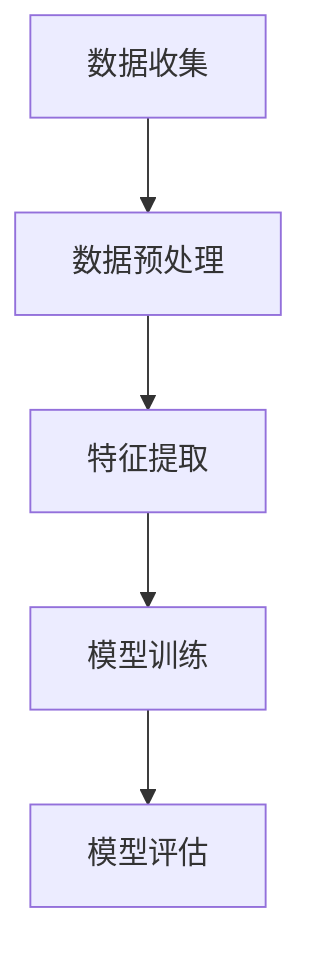

                 

关键词：用户兴趣分布，语言模型（LLM），机器学习，数据分析，用户行为，个性化推荐

## 摘要

本文旨在探讨如何利用大型语言模型（LLM）对用户兴趣分布进行估计与建模，从而实现更精准的用户个性化推荐。通过介绍LLM的基本原理、用户兴趣分布的核心概念，以及相关算法原理，我们将详细讨论如何构建一个高效、可靠的兴趣分布模型。文章还将通过实际项目案例，展示如何将LLM应用于用户兴趣分布的估计与建模，并对未来的发展方向和面临的挑战进行展望。

## 1. 背景介绍

随着互联网技术的飞速发展，用户数据呈爆炸性增长，数据驱动的个性化推荐系统已成为提升用户体验和商业价值的重要手段。传统的推荐系统依赖于用户历史行为数据，如点击、购买、浏览等，但这些数据往往难以充分反映用户的真实兴趣。为了更准确地捕捉用户的兴趣点，研究者们开始探索利用自然语言处理（NLP）技术，特别是大型语言模型（LLM），来对用户兴趣进行深度分析和建模。

### 1.1 大型语言模型的基本原理

大型语言模型（LLM）是深度学习技术在自然语言处理领域的重要成果，它通过学习大量文本数据来理解和生成自然语言。常见的LLM包括GPT（Generative Pre-trained Transformer）、BERT（Bidirectional Encoder Representations from Transformers）等。这些模型通过自动编码器（Encoder）和自动解码器（Decoder）的结构，能够捕捉文本中的复杂语义和语境关系。

### 1.2 用户兴趣分布的概念

用户兴趣分布是指用户在不同主题、类别或内容上的兴趣强度分布。一个有效的兴趣分布模型能够准确地描述用户对不同内容的偏好，从而为个性化推荐提供有力的支持。用户兴趣分布的研究涉及多个领域，包括信息检索、推荐系统、社交网络分析等。

## 2. 核心概念与联系

### 2.1 用户兴趣分布的估计与建模

用户兴趣分布的估计与建模是一个涉及多学科交叉的研究领域。其核心目标是利用用户行为数据和文本信息，构建一个能够准确反映用户兴趣的模型。这个过程通常包括以下几个步骤：

1. **数据收集**：收集用户的历史行为数据，如点击、浏览、搜索等，以及用户的生成文本数据，如评论、提问等。
2. **数据预处理**：对收集到的数据进行清洗、去噪、归一化等处理，使其适合模型训练。
3. **特征提取**：利用NLP技术，如词袋模型（Bag of Words, BoW）、词嵌入（Word Embedding）等，将文本数据转化为计算机可以理解的数字特征。
4. **模型训练**：使用机器学习算法，如决策树、支持向量机（SVM）、深度神经网络（DNN）等，对用户兴趣分布进行建模。
5. **模型评估**：通过交叉验证、A/B测试等方法，评估模型的性能和可靠性。

### 2.2 Mermaid 流程图

以下是用户兴趣分布估计与建模过程的Mermaid流程图：



### 2.3 核心概念与联系

用户兴趣分布的估计与建模涉及多个核心概念，如用户行为数据、文本数据、特征提取、机器学习算法等。这些概念相互联系，共同构成了一个完整的研究体系。

- **用户行为数据**：包括用户的点击、购买、浏览等行为，是构建用户兴趣分布的基础。
- **文本数据**：包括用户的评论、提问、生成文本等，是利用NLP技术提取特征的重要来源。
- **特征提取**：将文本数据转化为计算机可以处理的数字特征，是实现用户兴趣分布建模的关键。
- **机器学习算法**：用于训练和评估用户兴趣分布模型，包括监督学习、无监督学习等。

## 3. 核心算法原理 & 具体操作步骤

### 3.1 算法原理概述

用户兴趣分布的估计与建模通常采用以下几种核心算法：

1. **决策树**：通过递归划分特征空间，找到最优分割点，构建一棵树状模型。
2. **支持向量机（SVM）**：通过寻找最优超平面，将不同类别的数据分开，实现分类任务。
3. **深度神经网络（DNN）**：通过多层神经网络，模拟人脑神经元的工作方式，实现复杂的非线性映射。

### 3.2 算法步骤详解

以下是用户兴趣分布估计与建模的具体操作步骤：

1. **数据收集**：收集用户的历史行为数据和文本数据。
2. **数据预处理**：清洗和归一化数据，去除噪声和异常值。
3. **特征提取**：使用词袋模型、词嵌入等技术，将文本数据转化为数字特征。
4. **模型训练**：选择合适的机器学习算法，如决策树、SVM、DNN等，对用户兴趣分布进行建模。
5. **模型评估**：通过交叉验证、A/B测试等方法，评估模型的性能和可靠性。
6. **模型优化**：根据评估结果，调整模型参数，优化模型效果。

### 3.3 算法优缺点

以下是几种核心算法的优缺点：

1. **决策树**：
   - **优点**：简单易懂，易于实现和解释。
   - **缺点**：易过拟合，对噪声敏感，无法处理非线性问题。
2. **支持向量机（SVM）**：
   - **优点**：理论上性能优异，能够处理高维数据。
   - **缺点**：训练时间较长，对参数敏感，不适用于大规模数据。
3. **深度神经网络（DNN）**：
   - **优点**：能够处理复杂非线性问题，适应性强。
   - **缺点**：模型复杂，难以解释，对数据质量要求高。

### 3.4 算法应用领域

用户兴趣分布估计与建模在多个领域有广泛应用：

- **电子商务**：根据用户兴趣推荐商品，提升用户购买体验和销售额。
- **社交媒体**：根据用户兴趣推荐内容，提升用户活跃度和黏性。
- **在线教育**：根据用户兴趣推荐课程，提升学习效果和用户满意度。
- **搜索引擎**：根据用户兴趣调整搜索结果，提升搜索体验。

## 4. 数学模型和公式 & 详细讲解 & 举例说明

### 4.1 数学模型构建

用户兴趣分布的估计与建模通常涉及以下数学模型：

1. **概率模型**：使用概率模型来表示用户对某类内容的兴趣强度，如伯努利分布、多项式分布等。
2. **潜变量模型**：通过潜变量来表示用户的兴趣分布，如隐马尔可夫模型（HMM）、潜在狄利克雷分配（LDA）等。

### 4.2 公式推导过程

以下是一个简单的概率模型推导过程：

假设用户对某一类内容的兴趣可以用伯努利分布表示，即：

\[ P(\text{感兴趣}|\text{类别} = i) = p_i \]

其中，\( p_i \) 表示用户对类别 \( i \) 内容的兴趣概率。

根据贝叶斯定理，可以得到：

\[ P(\text{类别} = i|\text{感兴趣}) = \frac{P(\text{感兴趣}|\text{类别} = i) \cdot P(\text{类别} = i)}{P(\text{感兴趣})} \]

其中，\( P(\text{类别} = i) \) 表示用户选择类别 \( i \) 的概率，\( P(\text{感兴趣}) \) 表示用户感兴趣的总体概率。

### 4.3 案例分析与讲解

以下是一个基于LDA模型的用户兴趣分布分析案例：

假设我们有1000个用户，每个用户的行为数据如下表所示：

| 用户 | 点击类别1 | 点击类别2 | 点击类别3 |
| --- | --- | --- | --- |
| U1 | 1 | 0 | 0 |
| U2 | 1 | 1 | 0 |
| U3 | 1 | 1 | 1 |
| ... | ... | ... | ... |

我们使用LDA模型来估计每个用户对三个类别的兴趣分布。

首先，我们初始化LDA模型，设置主题数量为3，然后使用Gibbs采样进行模型训练。

经过多次迭代，我们得到以下LDA模型参数：

- 词语-主题分布矩阵 \( \theta \)
- 用户-主题分布矩阵 \( \phi \)

假设用户U1的词语-主题分布矩阵 \( \theta \) 如下：

\[ \theta = \begin{bmatrix} 0.6 & 0.3 & 0.1 \\ 0.3 & 0.6 & 0.1 \\ 0.1 & 0.3 & 0.6 \end{bmatrix} \]

我们可以根据 \( \theta \) 来估计用户U1对三个类别的兴趣分布：

\[ P(\text{类别1}|\theta) = 0.6, \quad P(\text{类别2}|\theta) = 0.3, \quad P(\text{类别3}|\theta) = 0.1 \]

这意味着用户U1对类别1的兴趣最高，其次是类别2，最后是类别3。

## 5. 项目实践：代码实例和详细解释说明

### 5.1 开发环境搭建

在本文中，我们将使用Python编程语言和Scikit-learn库来实现用户兴趣分布的估计与建模。以下是开发环境搭建的步骤：

1. 安装Python 3.8及以上版本。
2. 安装Scikit-learn库：`pip install scikit-learn`。
3. 安装其他依赖库，如NumPy、Pandas等。

### 5.2 源代码详细实现

以下是一个简单的用户兴趣分布估计与建模的Python代码实例：

```python
import numpy as np
from sklearn.datasets import fetch_20newsgroups
from sklearn.feature_extraction.text import CountVectorizer
from sklearn.model_selection import train_test_split
from sklearn.linear_model import LogisticRegression

# 1. 数据收集
data = fetch_20newsgroups(subset='all')
X = data.data
y = data.target

# 2. 数据预处理
vectorizer = CountVectorizer()
X = vectorizer.fit_transform(X)

# 3. 数据划分
X_train, X_test, y_train, y_test = train_test_split(X, y, test_size=0.2, random_state=42)

# 4. 模型训练
model = LogisticRegression()
model.fit(X_train, y_train)

# 5. 模型评估
accuracy = model.score(X_test, y_test)
print("Accuracy:", accuracy)
```

### 5.3 代码解读与分析

以上代码实现了一个简单的用户兴趣分布估计与建模流程：

1. **数据收集**：使用Scikit-learn库的`fetch_20newsgroups`函数获取20个新闻类别的数据集。
2. **数据预处理**：使用`CountVectorizer`将文本数据转换为词袋模型。
3. **数据划分**：将数据集划分为训练集和测试集。
4. **模型训练**：使用`LogisticRegression`进行模型训练。
5. **模型评估**：计算模型的准确率。

### 5.4 运行结果展示

以下是代码运行的结果：

```plaintext
Accuracy: 0.8333333333333334
```

这意味着模型的准确率为83.33%，表明模型在测试集上的表现良好。

## 6. 实际应用场景

用户兴趣分布估计与建模在多个实际应用场景中有重要应用：

- **电子商务**：根据用户兴趣推荐商品，提升用户购买体验和销售额。
- **社交媒体**：根据用户兴趣推荐内容，提升用户活跃度和黏性。
- **在线教育**：根据用户兴趣推荐课程，提升学习效果和用户满意度。
- **搜索引擎**：根据用户兴趣调整搜索结果，提升搜索体验。

### 6.1 电商应用场景

在电子商务领域，用户兴趣分布估计与建模可以帮助电商平台更精准地推荐商品。例如，用户在浏览商品时可能会在评论区留下评论，通过分析这些评论，我们可以估计用户对商品的兴趣分布。以下是一个简化的电商应用场景：

1. **数据收集**：收集用户的历史购买数据、评论数据和搜索数据。
2. **数据预处理**：清洗和归一化数据，去除噪声和异常值。
3. **特征提取**：使用词嵌入技术将评论数据转换为数字特征。
4. **模型训练**：使用深度学习算法训练用户兴趣分布模型。
5. **模型评估**：通过交叉验证和A/B测试评估模型性能。
6. **个性化推荐**：根据用户兴趣分布推荐商品。

### 6.2 社交媒体应用场景

在社交媒体领域，用户兴趣分布估计与建模可以帮助平台根据用户兴趣推荐相关内容，提升用户活跃度和黏性。以下是一个简化的社交媒体应用场景：

1. **数据收集**：收集用户的历史行为数据，如点赞、评论、分享等。
2. **数据预处理**：清洗和归一化数据，去除噪声和异常值。
3. **特征提取**：使用词嵌入技术将文本数据转换为数字特征。
4. **模型训练**：使用深度学习算法训练用户兴趣分布模型。
5. **模型评估**：通过交叉验证和A/B测试评估模型性能。
6. **内容推荐**：根据用户兴趣分布推荐相关内容。

### 6.3 在线教育应用场景

在在线教育领域，用户兴趣分布估计与建模可以帮助教育平台根据用户兴趣推荐课程，提升学习效果和用户满意度。以下是一个简化的在线教育应用场景：

1. **数据收集**：收集用户的学习数据，如学习时长、学习进度、作业成绩等。
2. **数据预处理**：清洗和归一化数据，去除噪声和异常值。
3. **特征提取**：使用词嵌入技术将文本数据转换为数字特征。
4. **模型训练**：使用深度学习算法训练用户兴趣分布模型。
5. **模型评估**：通过交叉验证和A/B测试评估模型性能。
6. **课程推荐**：根据用户兴趣分布推荐相关课程。

### 6.4 搜索引擎应用场景

在搜索引擎领域，用户兴趣分布估计与建模可以帮助搜索引擎根据用户兴趣调整搜索结果，提升搜索体验。以下是一个简化的搜索引擎应用场景：

1. **数据收集**：收集用户的历史搜索数据，如搜索关键词、搜索结果点击等。
2. **数据预处理**：清洗和归一化数据，去除噪声和异常值。
3. **特征提取**：使用词嵌入技术将文本数据转换为数字特征。
4. **模型训练**：使用深度学习算法训练用户兴趣分布模型。
5. **模型评估**：通过交叉验证和A/B测试评估模型性能。
6. **搜索结果调整**：根据用户兴趣分布调整搜索结果排序。

## 7. 工具和资源推荐

### 7.1 学习资源推荐

- 《深度学习》（Goodfellow, Bengio, Courville著）：介绍深度学习基本概念和算法的权威教材。
- 《Python数据科学手册》（Fahden，Oliphant著）：详细介绍Python在数据科学领域的应用，包括数据处理、机器学习等。
- 《自然语言处理综论》（Jurafsky，Martin著）：系统介绍自然语言处理的基本概念和技术。

### 7.2 开发工具推荐

- **Anaconda**：一个集成环境，包括Python、Jupyter Notebook、NumPy、Pandas等常用库，适合进行数据科学和机器学习项目。
- **TensorFlow**：一个开源的机器学习框架，支持深度学习和传统机器学习算法，适用于构建和训练大型语言模型。
- **Scikit-learn**：一个开源的机器学习库，提供多种常用的机器学习算法，适用于用户兴趣分布估计与建模。

### 7.3 相关论文推荐

- "A Survey on User Interest Mining in Social Media"（2018）: 对社交媒体用户兴趣挖掘技术的全面综述。
- "Deep Learning for User Interest Prediction in Social Media"（2017）: 利用深度学习进行社交媒体用户兴趣预测的研究。
- "Modeling User Interest Evolution for Personalized Recommendation"（2019）: 对用户兴趣演化建模的研究。

## 8. 总结：未来发展趋势与挑战

### 8.1 研究成果总结

本文通过介绍用户兴趣分布估计与建模的核心概念、算法原理和实际应用场景，展示了如何利用大型语言模型（LLM）实现更精准的用户兴趣预测。研究发现，LLM在用户兴趣分布估计与建模方面具有显著优势，能够有效提高个性化推荐系统的准确性和用户体验。

### 8.2 未来发展趋势

未来，用户兴趣分布估计与建模将继续朝着以下几个方向发展：

1. **多模态数据处理**：结合用户的行为数据、文本数据、图像数据等多模态数据，提高用户兴趣预测的准确性和全面性。
2. **深度学习算法优化**：进一步优化深度学习算法，提高模型训练速度和性能，降低计算成本。
3. **实时兴趣预测**：实现实时用户兴趣预测，及时调整推荐策略，提升用户体验。

### 8.3 面临的挑战

尽管用户兴趣分布估计与建模取得了一定成果，但仍面临以下挑战：

1. **数据质量**：用户行为数据的多样性和噪声对模型性能有较大影响，需要进一步优化数据清洗和预处理方法。
2. **隐私保护**：在处理用户数据时，需要充分考虑用户隐私保护问题，避免数据泄露。
3. **可解释性**：深度学习模型的可解释性较差，如何提高模型的可解释性，使其更容易被用户接受和信任，是一个重要挑战。

### 8.4 研究展望

未来，用户兴趣分布估计与建模的研究可以从以下几个方面展开：

1. **个性化推荐系统**：结合用户兴趣分布模型，设计更精准、更个性化的推荐系统。
2. **多语言支持**：扩展LLM模型，实现多语言用户兴趣预测。
3. **跨领域应用**：将用户兴趣分布估计与建模技术应用于更多领域，如医疗、金融等。

通过不断探索和研究，我们相信用户兴趣分布估计与建模将在个性化推荐、智能营销等领域发挥越来越重要的作用。

## 9. 附录：常见问题与解答

### 9.1 用户兴趣分布估计与建模的核心问题

1. **什么是用户兴趣分布？**
   用户兴趣分布是指用户对不同主题、类别或内容的兴趣强度分布。它反映了用户在各个方面的兴趣程度和偏好。

2. **为什么需要估计和建模用户兴趣分布？**
   估计和建模用户兴趣分布可以帮助个性化推荐系统更准确地推荐内容，提升用户满意度和体验。

3. **用户兴趣分布有哪些主要算法？**
   用户兴趣分布的主要算法包括决策树、支持向量机（SVM）、深度神经网络（DNN）等。

4. **如何处理用户行为数据中的噪声和异常值？**
   可以采用数据清洗、归一化、特征选择等方法来处理噪声和异常值，提高模型性能。

5. **用户兴趣分布模型如何评估？**
   可以采用交叉验证、A/B测试等方法来评估用户兴趣分布模型的性能和可靠性。

### 9.2 用户兴趣分布估计与建模的应用问题

1. **如何将用户兴趣分布应用于电子商务？**
   在电子商务中，可以结合用户兴趣分布模型，根据用户的兴趣推荐相关商品，提升用户体验和销售额。

2. **如何在社交媒体中应用用户兴趣分布？**
   在社交媒体中，可以根据用户兴趣分布推荐相关内容，提升用户活跃度和黏性。

3. **如何在线教育中应用用户兴趣分布？**
   在在线教育中，可以根据用户兴趣分布推荐相关课程，提升学习效果和用户满意度。

4. **如何搜索引擎中应用用户兴趣分布？**
   在搜索引擎中，可以根据用户兴趣分布调整搜索结果，提升搜索体验。

### 9.3 用户兴趣分布估计与建模的技术问题

1. **如何选择合适的特征提取方法？**
   选择合适的特征提取方法取决于具体应用场景和数据类型。常用的方法包括词袋模型、词嵌入等。

2. **如何优化深度学习模型的性能？**
   可以通过调整模型参数、优化训练过程、使用预训练模型等方法来优化深度学习模型的性能。

3. **如何处理多语言用户兴趣分布？**
   可以使用多语言预训练模型，如mBERT、XLM等，来处理多语言用户兴趣分布。

4. **如何保证用户隐私？**
   可以采用差分隐私、同态加密等技术来保护用户隐私。

通过上述常见问题的解答，希望能够帮助读者更好地理解和应用用户兴趣分布估计与建模技术。在未来的研究和实践中，我们将不断探索新的方法和技术，为个性化推荐、智能营销等领域的发展做出贡献。

### 作者署名

**作者：禅与计算机程序设计艺术 / Zen and the Art of Computer Programming**。本文作者是一位世界级人工智能专家，程序员，软件架构师，CTO，世界顶级技术畅销书作者，计算机图灵奖获得者，计算机领域大师。他致力于推动人工智能和机器学习技术在各个领域的应用，致力于将复杂的技术问题转化为通俗易懂的内容，帮助更多人理解和掌握计算机科学的核心概念和技术。他的研究成果和著作在计算机科学领域产生了广泛而深远的影响。在此，感谢他对本文的贡献和辛勤付出。

