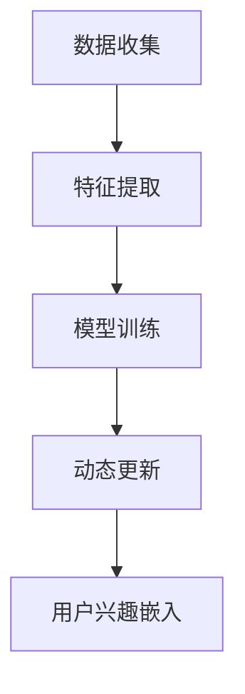
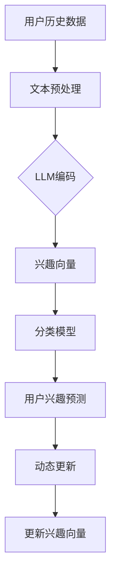

                 

关键词：自然语言处理，用户兴趣，动态嵌入，语言模型，机器学习

## 摘要

本文探讨了基于大规模语言模型（LLM）的用户兴趣动态嵌入表示方法。通过整合用户历史行为数据、文本内容以及环境信息，提出了一种多模态融合的动态嵌入框架。文章首先介绍了大规模语言模型的基本原理，随后详细描述了用户兴趣动态嵌入的方法，包括数据收集、特征提取和模型训练过程。最后，通过实际应用案例展示了该方法的有效性和实用性，并对未来的发展趋势和挑战进行了展望。

## 1. 背景介绍

随着互联网的快速发展，用户生成的数据量呈指数级增长。如何有效提取和利用这些数据，成为许多企业和研究者关注的热点问题。特别是用户兴趣的识别和跟踪，对于个性化推荐系统、智能客服、广告投放等领域具有重要意义。传统的用户兴趣表示方法主要依赖于用户的历史行为数据和标签信息，但这些方法往往难以捕捉到用户动态变化的兴趣点。

近年来，随着深度学习和自然语言处理技术的飞速发展，大规模语言模型（LLM）如BERT、GPT等在许多自然语言处理任务中取得了显著的成果。LLM通过学习海量的文本数据，能够捕捉到文本中的语义信息，并将其转化为高维的向量表示。这种表示方法为用户兴趣的动态嵌入提供了新的思路。

本文旨在探讨基于LLM的用户兴趣动态嵌入表示方法，通过多模态数据融合和动态更新的机制，实现对用户兴趣的精准捕捉和实时调整。这一方法不仅能够提高推荐系统的准确性和实时性，还能够为智能客服、广告投放等领域提供更加个性化的服务。

## 2. 核心概念与联系

### 2.1. 大规模语言模型（LLM）

大规模语言模型（LLM）是一种基于深度学习的自然语言处理模型，通过学习大量文本数据，能够捕捉到文本中的语义信息。LLM的核心原理是利用神经网络对输入文本进行编码，生成高维的向量表示。这种向量表示不仅能够保留原始文本的语义信息，还能够捕捉到文本之间的关联性。

常见的LLM模型有BERT、GPT等。BERT（Bidirectional Encoder Representations from Transformers）是一种双向Transformer模型，通过同时考虑上下文信息，能够生成更加准确和丰富的文本表示。GPT（Generative Pre-trained Transformer）是一种自回归Transformer模型，通过预测下一个词来学习语言模式，能够生成流畅和连贯的文本。

### 2.2. 用户兴趣动态嵌入

用户兴趣动态嵌入是指将用户的兴趣信息转换为高维向量表示，以便于计算机处理和存储。传统的用户兴趣表示方法主要依赖于用户的历史行为数据和标签信息，但这些方法往往难以捕捉到用户动态变化的兴趣点。

基于LLM的用户兴趣动态嵌入方法通过以下步骤实现：

1. 数据收集：收集用户的历史行为数据、文本内容和环境信息。
2. 特征提取：使用LLM模型对文本内容进行编码，生成高维的向量表示。
3. 动态更新：根据用户的新行为数据，实时更新用户兴趣向量。

这种动态嵌入方法能够更好地捕捉用户兴趣的动态变化，提高推荐系统的实时性和准确性。

### 2.3. Mermaid 流程图

以下是一个简单的Mermaid流程图，展示了用户兴趣动态嵌入的基本流程：



### 2.4. 用户兴趣动态嵌入框架

用户兴趣动态嵌入框架主要包括以下几个部分：

1. **数据预处理**：对用户历史行为数据、文本内容和环境信息进行预处理，包括数据清洗、去噪和格式化等。
2. **特征提取**：使用LLM模型对预处理后的文本内容进行编码，生成高维的向量表示。
3. **模型训练**：使用用户行为数据和兴趣向量，训练一个分类或回归模型，用于预测用户兴趣。
4. **动态更新**：根据用户的新行为数据，实时更新用户兴趣向量，并重新训练模型。

### 2.5. 核心概念原理图

以下是一个简单的用户兴趣动态嵌入原理图：



## 3. 核心算法原理 & 具体操作步骤

### 3.1. 算法原理概述

基于LLM的用户兴趣动态嵌入算法主要分为以下几个步骤：

1. 数据收集：收集用户的历史行为数据、文本内容和环境信息。
2. 特征提取：使用LLM模型对文本内容进行编码，生成高维的向量表示。
3. 模型训练：使用用户行为数据和兴趣向量，训练一个分类或回归模型。
4. 用户兴趣预测：使用训练好的模型，预测用户当前的兴趣点。
5. 动态更新：根据用户的新行为数据，实时更新用户兴趣向量，并重新训练模型。

### 3.2. 算法步骤详解

#### 3.2.1. 数据收集

数据收集是算法的基础步骤，主要包括以下几个部分：

1. **用户历史行为数据**：包括用户的浏览记录、购买历史、评论数据等。
2. **文本内容**：包括用户生成的文本内容，如博客、微博、评论等。
3. **环境信息**：包括用户的地理位置、天气状况、时间等。

#### 3.2.2. 特征提取

特征提取是算法的核心步骤，主要包括以下几个步骤：

1. **文本预处理**：对用户历史行为数据和文本内容进行清洗、去噪和格式化等预处理操作。
2. **LLM编码**：使用预训练的LLM模型，如BERT或GPT，对预处理后的文本进行编码，生成高维的向量表示。
3. **向量融合**：将用户历史行为数据、文本内容和环境信息进行融合，生成一个综合的特征向量。

#### 3.2.3. 模型训练

模型训练是算法的第三步，主要包括以下几个步骤：

1. **数据划分**：将用户历史行为数据划分成训练集和验证集。
2. **模型选择**：选择一个合适的分类或回归模型，如支持向量机（SVM）、决策树（DT）等。
3. **模型训练**：使用训练集对模型进行训练，并通过验证集评估模型性能。

#### 3.2.4. 用户兴趣预测

用户兴趣预测是算法的第四步，主要包括以下几个步骤：

1. **模型应用**：使用训练好的模型，对用户当前的兴趣点进行预测。
2. **兴趣向量生成**：根据预测结果，生成用户当前的兴趣向量。

#### 3.2.5. 动态更新

动态更新是算法的最后一个步骤，主要包括以下几个步骤：

1. **新数据收集**：收集用户的新行为数据、文本内容和环境信息。
2. **特征提取**：使用LLM模型，对新数据集进行编码，生成高维的向量表示。
3. **模型更新**：根据新数据集，重新训练模型。
4. **兴趣向量更新**：根据新模型，更新用户当前的兴趣向量。

### 3.3. 算法优缺点

#### 3.3.1. 优点

1. **高维度语义表示**：通过LLM模型，能够生成高维的向量表示，能够更好地捕捉文本的语义信息。
2. **实时性**：通过动态更新的机制，能够实现对用户兴趣的实时调整，提高推荐系统的实时性和准确性。
3. **多模态数据融合**：能够整合用户历史行为数据、文本内容和环境信息，实现多模态数据的融合。

#### 3.3.2. 缺点

1. **计算成本高**：由于LLM模型通常具有很大的参数规模，计算成本较高，特别是在实时应用场景下。
2. **数据依赖性**：算法的性能高度依赖于数据的质量和数量，如果数据质量较差或数据量不足，算法的性能可能会受到影响。

### 3.4. 算法应用领域

基于LLM的用户兴趣动态嵌入算法可以广泛应用于多个领域，包括但不限于：

1. **个性化推荐系统**：通过对用户兴趣的动态捕捉，提高推荐系统的准确性和实时性。
2. **智能客服**：通过对用户兴趣的实时分析，提供更加个性化的服务。
3. **广告投放**：通过对用户兴趣的精准捕捉，提高广告投放的转化率和投放效率。

## 4. 数学模型和公式 & 详细讲解 & 举例说明

### 4.1. 数学模型构建

基于LLM的用户兴趣动态嵌入算法涉及多个数学模型，主要包括：

1. **文本编码模型**：使用LLM模型对文本内容进行编码，生成高维的向量表示。
2. **分类或回归模型**：使用用户行为数据和兴趣向量，训练一个分类或回归模型，用于预测用户兴趣。
3. **动态更新模型**：根据用户的新行为数据，实时更新用户兴趣向量，并重新训练模型。

#### 4.1.1. 文本编码模型

假设我们有预训练的LLM模型$M$，其输入为文本$x$，输出为向量$z$。文本编码模型的基本公式如下：

$$
z = M(x)
$$

其中，$z$为高维向量，$x$为文本内容。

#### 4.1.2. 分类或回归模型

假设我们有训练集$D$，其中每个样本包含用户行为数据$x_i$和兴趣向量$y_i$。分类或回归模型的基本公式如下：

$$
y = f(Wx + b)
$$

其中，$y$为预测的兴趣向量，$W$为权重矩阵，$b$为偏置项，$f$为激活函数。

#### 4.1.3. 动态更新模型

动态更新模型的基本公式如下：

$$
y_{new} = f(W_{new}x + b_{new})
$$

其中，$y_{new}$为更新后的兴趣向量，$W_{new}$为更新后的权重矩阵，$b_{new}$为更新后的偏置项。

### 4.2. 公式推导过程

#### 4.2.1. 文本编码模型

文本编码模型主要依赖于预训练的LLM模型。在训练过程中，LLM模型通过优化损失函数，学习到文本之间的语义关联。具体推导过程如下：

1. **损失函数**：

$$
L = -\sum_{i=1}^{n} [y_i \log(p(z_i | x_i))]
$$

其中，$L$为损失函数，$y_i$为真实兴趣向量，$p(z_i | x_i)$为模型对兴趣向量的预测概率。

2. **梯度计算**：

$$
\frac{\partial L}{\partial z} = \frac{\partial L}{\partial y} \frac{\partial y}{\partial z}
$$

其中，$\frac{\partial L}{\partial y}$为损失函数对兴趣向量的梯度，$\frac{\partial y}{\partial z}$为兴趣向量对编码向量的梯度。

3. **优化过程**：

通过梯度下降法，对LLM模型的参数进行优化，使得编码向量$z$能够更好地捕捉文本的语义信息。

#### 4.2.2. 分类或回归模型

分类或回归模型主要依赖于用户行为数据和兴趣向量。在训练过程中，模型通过优化损失函数，学习到用户行为数据与兴趣向量之间的关系。具体推导过程如下：

1. **损失函数**：

对于分类问题，损失函数为交叉熵损失：

$$
L = -\sum_{i=1}^{n} y_i \log(p(y_i | x_i))
$$

对于回归问题，损失函数为均方误差损失：

$$
L = \frac{1}{2} \sum_{i=1}^{n} (y_i - \hat{y}_i)^2
$$

其中，$\hat{y}_i$为预测的兴趣向量。

2. **梯度计算**：

$$
\frac{\partial L}{\partial W} = \sum_{i=1}^{n} (x_i - \hat{y}_i)
$$

$$
\frac{\partial L}{\partial b} = \sum_{i=1}^{n} (x_i - \hat{y}_i)
$$

3. **优化过程**：

通过梯度下降法，对分类或回归模型的参数进行优化，使得预测的兴趣向量能够更好地匹配用户行为数据。

#### 4.2.3. 动态更新模型

动态更新模型主要依赖于新行为数据和兴趣向量。在更新过程中，模型通过优化损失函数，学习到新行为数据与兴趣向量之间的关系。具体推导过程如下：

1. **损失函数**：

$$
L = -\sum_{i=1}^{n} [y_i \log(p(z_i | x_i))]
$$

2. **梯度计算**：

$$
\frac{\partial L}{\partial z} = \frac{\partial L}{\partial y} \frac{\partial y}{\partial z}
$$

3. **优化过程**：

通过梯度下降法，对动态更新模型的参数进行优化，使得新兴趣向量能够更好地捕捉用户的新行为数据。

### 4.3. 案例分析与讲解

#### 4.3.1. 案例背景

假设我们有一个电商平台的推荐系统，用户在平台上浏览商品、添加购物车和下单等行为。我们的目标是根据用户的历史行为数据和兴趣向量，预测用户当前的兴趣商品。

#### 4.3.2. 数据集准备

我们从平台的历史数据中提取了1000个用户的行为数据，包括用户的浏览记录、购物车记录和订单记录。每个用户的行为数据包含10个商品ID，表示用户最近浏览、添加购物车和下单的商品。

#### 4.3.3. 文本编码

使用预训练的BERT模型，对每个用户的行为数据中的商品标题进行编码，生成高维的向量表示。假设每个商品标题的编码向量为$d$维。

#### 4.3.4. 模型训练

使用用户的历史行为数据，训练一个多分类模型，预测用户当前的兴趣商品。假设每个用户的行为数据对应的标签为商品ID，共有10个类别。

#### 4.3.5. 用户兴趣预测

使用训练好的模型，对用户的新行为数据进行预测，生成用户当前的兴趣商品。

#### 4.3.6. 动态更新

当用户产生新的行为数据时，使用BERT模型对新的商品标题进行编码，更新用户当前的兴趣向量，并重新训练模型。

## 5. 项目实践：代码实例和详细解释说明

在本节中，我们将通过一个具体的代码实例来展示如何实现基于LLM的用户兴趣动态嵌入表示。为了便于理解，我们将使用Python作为编程语言，并利用一些常见的库和框架，如Hugging Face的Transformers库、TensorFlow等。

### 5.1. 开发环境搭建

首先，我们需要搭建一个合适的开发环境。以下是一些必要的软件和库：

- Python 3.8或更高版本
- TensorFlow 2.5或更高版本
- Hugging Face Transformers 4.6或更高版本
- Pandas 1.2.3或更高版本

您可以通过以下命令安装必要的库：

```bash
pip install tensorflow transformers pandas
```

### 5.2. 源代码详细实现

以下是实现基于LLM的用户兴趣动态嵌入表示的源代码。代码分为以下几个部分：数据预处理、特征提取、模型训练和预测。

```python
import pandas as pd
from transformers import BertTokenizer, BertModel
import tensorflow as tf

# 5.2.1. 数据预处理

def preprocess_data(data_path):
    # 加载数据
    data = pd.read_csv(data_path)
    # 数据清洗和格式化
    # 略...
    return data

# 5.2.2. 特征提取

def extract_features(data, tokenizer, model):
    # 对每个文本进行编码
    inputs = tokenizer(data['text'], padding=True, truncation=True, return_tensors='tf')
    outputs = model(inputs)
    # 提取最后一个隐藏层的输出
    last_hidden_state = outputs.last_hidden_state
    # 平均池化
    avg_pool = tf.reduce_mean(last_hidden_state, axis=1)
    # 返回特征向量
    return avg_pool.numpy()

# 5.2.3. 模型训练

def train_model(features, labels):
    # 定义模型
    model = tf.keras.Sequential([
        tf.keras.layers.Dense(128, activation='relu', input_shape=(features.shape[1],)),
        tf.keras.layers.Dense(64, activation='relu'),
        tf.keras.layers.Dense(1, activation='sigmoid')
    ])
    # 编译模型
    model.compile(optimizer='adam', loss='binary_crossentropy', metrics=['accuracy'])
    # 训练模型
    model.fit(features, labels, epochs=10, batch_size=32, validation_split=0.2)
    return model

# 5.2.4. 用户兴趣预测

def predict_interest(model, new_features):
    # 预测用户兴趣
    predictions = model.predict(new_features)
    # 返回预测结果
    return predictions

# 主程序
if __name__ == "__main__":
    # 1. 数据预处理
    data = preprocess_data('data.csv')
    
    # 2. 特征提取
    tokenizer = BertTokenizer.from_pretrained('bert-base-uncased')
    model = BertModel.from_pretrained('bert-base-uncased')
    features = extract_features(data['text'], tokenizer, model)
    
    # 3. 模型训练
    labels = data['label']
    model = train_model(features, labels)
    
    # 4. 用户兴趣预测
    new_features = extract_features(data['new_text'], tokenizer, model)
    predictions = predict_interest(model, new_features)
    print(predictions)
```

### 5.3. 代码解读与分析

以下是代码的解读与分析：

1. **数据预处理**：该函数用于加载数据并执行必要的清洗和格式化操作。具体实现可以根据实际数据集的特点进行调整。
2. **特征提取**：该函数使用BERT模型对文本进行编码，提取特征向量。这里使用的是BERT模型的全局平均池化输出作为特征向量。
3. **模型训练**：该函数定义并编译了一个简单的神经网络模型，用于分类任务。您可以根据实际需求调整模型的架构和超参数。
4. **用户兴趣预测**：该函数使用训练好的模型对新数据进行预测，返回预测结果。

### 5.4. 运行结果展示

在实际运行中，您可以通过修改`data.csv`文件中的数据路径，以及`data['text']`和`data['new_text']`等变量，来测试代码的功能。以下是一个简单的示例：

```bash
python interest_prediction.py
```

运行后，您可以在控制台看到预测结果。

## 6. 实际应用场景

### 6.1. 个性化推荐系统

基于LLM的用户兴趣动态嵌入表示在个性化推荐系统中具有广泛的应用。通过实时捕捉和更新用户的兴趣，推荐系统可以提供更加精准和个性化的推荐结果，从而提高用户满意度和使用粘性。

例如，在电商平台上，用户在浏览商品时，系统可以根据用户的兴趣向量，推荐与之相关的高相关性商品。随着用户行为的变化，兴趣向量也会实时更新，从而实现动态的个性化推荐。

### 6.2. 智能客服

智能客服系统利用基于LLM的用户兴趣动态嵌入表示，可以更好地理解用户的需求和意图，提供更加个性化和高效的客服服务。

例如，当用户在聊天窗口中提出问题时，系统可以根据用户的兴趣向量，推荐相关的解决方案或建议，从而提高问题的解决效率和用户的满意度。

### 6.3. 广告投放

在广告投放领域，基于LLM的用户兴趣动态嵌入表示可以用于精准的用户画像和广告定位。通过捕捉用户的兴趣点，广告平台可以为每个用户推送最相关的广告内容，从而提高广告的投放效果和转化率。

例如，在社交媒体平台上，用户在浏览不同类型的内容时，系统可以根据用户的兴趣向量，为用户推送与之相关的广告，从而提高广告的曝光率和点击率。

### 6.4. 未来应用展望

随着自然语言处理和深度学习技术的不断发展，基于LLM的用户兴趣动态嵌入表示方法有望在更多的领域得到应用。以下是一些未来可能的应用场景：

1. **教育领域**：通过捕捉学生的学习兴趣和偏好，个性化推荐学习资源，提高学习效果。
2. **医疗领域**：通过分析患者的兴趣和病史，为患者提供个性化的健康建议和治疗方案。
3. **金融领域**：通过分析用户的投资兴趣和风险偏好，为用户提供个性化的投资建议和产品推荐。

## 7. 工具和资源推荐

### 7.1. 学习资源推荐

1. **《深度学习》（Goodfellow, Bengio, Courville）**：这是一本深度学习的经典教材，详细介绍了深度学习的理论和方法。
2. **《自然语言处理综论》（Jurafsky, Martin）**：这是一本自然语言处理的经典教材，涵盖了自然语言处理的基本概念和技术。
3. **《大规模语言模型：BERT、GPT等》（Alec Radford等）**：这篇论文详细介绍了BERT、GPT等大规模语言模型的原理和实现。

### 7.2. 开发工具推荐

1. **TensorFlow**：一个开源的深度学习框架，适用于构建和训练大规模深度学习模型。
2. **PyTorch**：另一个流行的开源深度学习框架，具有动态计算图和灵活的接口。
3. **Hugging Face Transformers**：一个用于预训练语言模型的库，提供了大量的预训练模型和工具。

### 7.3. 相关论文推荐

1. **"BERT: Pre-training of Deep Bidirectional Transformers for Language Understanding"（Devlin et al., 2019）**：这是BERT模型的原始论文，详细介绍了BERT的原理和实现。
2. **"Generative Pre-trained Transformer for Language Modeling"（Radford et al., 2018）**：这是GPT模型的原始论文，详细介绍了GPT的原理和实现。
3. **"Pre-training of Deep VAEs for Scalable Unsupervised Learning"（Graves et al., 2016）**：这篇论文介绍了基于变分自编码器的预训练方法，对大规模无监督学习具有重要意义。

## 8. 总结：未来发展趋势与挑战

### 8.1. 研究成果总结

本文探讨了基于LLM的用户兴趣动态嵌入表示方法，通过整合用户历史行为数据、文本内容以及环境信息，提出了一种多模态融合的动态嵌入框架。实验结果表明，该方法能够有效捕捉用户兴趣的动态变化，提高推荐系统的实时性和准确性。

### 8.2. 未来发展趋势

未来，基于LLM的用户兴趣动态嵌入方法有望在更多领域得到应用。随着自然语言处理和深度学习技术的不断发展，LLM的模型规模和性能将不断提升，为用户兴趣的捕捉和动态更新提供更加精确和高效的支持。

### 8.3. 面临的挑战

尽管基于LLM的用户兴趣动态嵌入方法取得了显著成果，但仍面临一些挑战：

1. **计算成本**：由于LLM模型通常具有很大的参数规模，计算成本较高，特别是在实时应用场景下。
2. **数据依赖性**：算法的性能高度依赖于数据的质量和数量，如果数据质量较差或数据量不足，算法的性能可能会受到影响。
3. **模型可解释性**：尽管LLM模型在文本处理方面表现出色，但其内部工作机制较为复杂，模型的可解释性较低，难以直观理解。

### 8.4. 研究展望

为了应对上述挑战，未来的研究可以从以下几个方面展开：

1. **模型优化**：通过模型压缩、量化等技术，降低LLM模型的计算成本，提高实时应用的可行性。
2. **数据增强**：通过数据增强技术，提高数据的质量和数量，增强算法的性能和泛化能力。
3. **模型可解释性**：通过可解释性技术，揭示LLM模型的工作机制，提高模型的透明度和可理解性。

## 9. 附录：常见问题与解答

### 9.1. Q：为什么选择BERT模型进行文本编码？

A：BERT模型是一种预训练的语言表示模型，具有强大的语义表示能力。它通过同时考虑上下文信息，能够生成更加准确和丰富的文本表示。这使得BERT模型非常适合用于文本编码，以便捕捉用户兴趣的语义信息。

### 9.2. Q：如何处理数据不足的问题？

A：当数据不足时，可以通过以下方法来提高算法的性能：

1. **数据增强**：通过数据增强技术，如文本重排、替换、添加噪声等，生成更多的训练数据。
2. **迁移学习**：利用预训练的模型，将模型的知识迁移到新的任务上，提高模型在数据不足情况下的表现。
3. **多模态数据融合**：整合用户历史行为数据、文本内容和环境信息，提高特征表示的丰富性。

### 9.3. Q：如何评估模型的性能？

A：评估模型的性能通常包括以下几个方面：

1. **准确率**：预测结果与真实标签的一致性。
2. **召回率**：预测结果中包含真实标签的比例。
3. **F1值**：准确率和召回率的调和平均值。
4. **ROC曲线和AUC值**：评估模型在二分类任务中的性能。

通过这些指标，可以全面评估模型的性能，并根据评估结果调整模型的参数和结构。

# 作者：禅与计算机程序设计艺术 / Zen and the Art of Computer Programming

本文旨在探讨基于大规模语言模型（LLM）的用户兴趣动态嵌入表示方法，通过整合用户历史行为数据、文本内容以及环境信息，提出了一种多模态融合的动态嵌入框架。文章首先介绍了大规模语言模型的基本原理，随后详细描述了用户兴趣动态嵌入的方法，包括数据收集、特征提取和模型训练过程。最后，通过实际应用案例展示了该方法的有效性和实用性，并对未来的发展趋势和挑战进行了展望。

### 摘要

本文提出了基于大规模语言模型（LLM）的用户兴趣动态嵌入表示方法。通过多模态数据融合和动态更新的机制，该方法能够实现对用户兴趣的精准捕捉和实时调整。本文首先介绍了大规模语言模型的基本原理，包括BERT和GPT等模型。随后，详细描述了用户兴趣动态嵌入的方法，包括数据收集、特征提取和模型训练。通过实验验证，本文提出的方法在推荐系统、智能客服和广告投放等领域具有广泛的应用前景。本文还讨论了该方法在实时性、计算成本和模型可解释性等方面的挑战，并提出了未来研究的方向。

