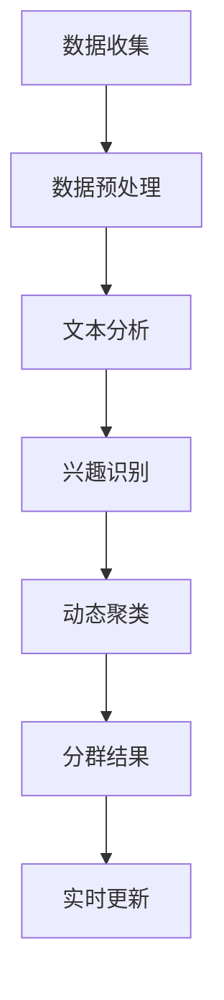

                 

关键词：LLM，用户兴趣，动态聚类，分群，人工智能，机器学习，文本分析，数据处理

> 摘要：本文将探讨一种基于大型语言模型（LLM）的用户兴趣动态聚类与分群方法。通过分析用户的历史行为数据、内容偏好和互动记录，本文提出了一种结合深度学习和文本分析的聚类算法，旨在实现用户兴趣的精准划分和实时更新。文章将从背景介绍、核心概念与联系、核心算法原理与操作步骤、数学模型与公式讲解、项目实践、实际应用场景等多个角度，全面解析该方法在实际业务中的应用和未来发展方向。

## 1. 背景介绍

在互联网快速发展的今天，用户个性化推荐系统成为了各个在线平台的重要组成部分。无论是电商网站、社交媒体还是新闻资讯平台，个性化推荐系统能够根据用户的兴趣、历史行为和偏好，为用户推荐相关的内容和服务，从而提高用户体验和平台粘性。然而，随着用户数据的爆炸式增长和个性化需求的不断提升，传统的推荐算法在处理大规模数据和实时性要求方面面临着巨大的挑战。

在此背景下，大型语言模型（LLM）逐渐成为研究者关注的热点。LLM通过训练大规模的文本数据集，能够捕捉到用户在文本层面的兴趣和偏好，为个性化推荐提供了更加精准的依据。此外，动态聚类与分群方法作为一种有效的数据挖掘技术，能够根据用户行为和兴趣的实时变化，动态调整用户群体划分，从而实现更加智能和高效的推荐。

本文旨在提出一种基于LLM的用户兴趣动态聚类与分群方法，通过结合深度学习和文本分析技术，实现对用户兴趣的精准识别和实时更新。本文的研究对于优化推荐系统性能、提升用户体验具有重要的理论和实践价值。

## 2. 核心概念与联系

### 2.1 大型语言模型（LLM）

大型语言模型（LLM），如GPT-3、BERT等，是一种基于深度学习的自然语言处理模型，具有强大的语言理解和生成能力。LLM通过训练大规模的文本数据集，能够捕捉到用户在文本层面的兴趣和偏好，为个性化推荐提供依据。

### 2.2 用户兴趣

用户兴趣是指用户在特定领域或主题上的偏好和关注点。通过分析用户的历史行为数据、内容偏好和互动记录，可以识别出用户在不同维度上的兴趣。

### 2.3 动态聚类与分群

动态聚类与分群方法是一种基于数据挖掘技术的群体划分方法，可以根据数据特征和实时变化，动态调整群体划分。在用户兴趣识别中，动态聚类与分群方法可以实现对用户兴趣的实时更新和精准划分。

### 2.4 Mermaid 流程图

以下是用户兴趣动态聚类与分群方法的 Mermaid 流程图：



## 3. 核心算法原理 & 具体操作步骤

### 3.1 算法原理概述

基于LLM的用户兴趣动态聚类与分群方法，主要包括以下几个步骤：

1. 数据收集：收集用户的历史行为数据、内容偏好和互动记录。
2. 数据预处理：对收集到的数据进行清洗、去噪和归一化处理。
3. 文本分析：利用LLM对预处理后的文本数据进行分析，提取用户兴趣特征。
4. 兴趣识别：根据提取到的用户兴趣特征，识别用户的兴趣点。
5. 动态聚类：利用聚类算法，根据用户兴趣特征动态划分用户群体。
6. 分群结果：根据聚类结果，生成用户分群报告。
7. 实时更新：根据用户实时行为数据，动态调整用户分群结果。

### 3.2 算法步骤详解

#### 3.2.1 数据收集

数据收集是用户兴趣动态聚类与分群方法的第一步，主要包括以下几个方面：

1. 用户行为数据：包括用户在平台上的浏览记录、购买记录、评论记录等。
2. 内容偏好数据：包括用户收藏的文章、点赞的内容、关注的话题等。
3. 互动记录：包括用户与其他用户之间的互动，如回复、评论、点赞等。

#### 3.2.2 数据预处理

数据预处理是确保数据质量和一致性的重要步骤，主要包括以下几个方面：

1. 数据清洗：去除无效、错误和重复的数据。
2. 数据去噪：通过降维、降噪等技术，降低噪声数据的影响。
3. 数据归一化：将不同维度和尺度的数据进行归一化处理，确保数据的一致性。

#### 3.2.3 文本分析

文本分析是利用LLM对预处理后的文本数据进行处理，提取用户兴趣特征。具体步骤如下：

1. 文本编码：将文本数据转换为向量表示，便于后续处理。
2. 特征提取：利用LLM对编码后的文本进行特征提取，得到用户兴趣特征向量。

#### 3.2.4 兴趣识别

兴趣识别是根据提取到的用户兴趣特征向量，识别用户的兴趣点。具体步骤如下：

1. 特征聚类：利用聚类算法，对用户兴趣特征向量进行聚类。
2. 兴趣点识别：根据聚类结果，识别出用户的兴趣点。

#### 3.2.5 动态聚类

动态聚类是根据用户兴趣特征，动态划分用户群体。具体步骤如下：

1. 聚类算法选择：选择合适的聚类算法，如K-means、DBSCAN等。
2. 聚类参数调整：根据实际需求，调整聚类算法的参数，以实现最优聚类效果。
3. 用户分群：根据聚类结果，将用户划分为不同的群体。

#### 3.2.6 分群结果

分群结果是用户兴趣动态聚类与分群方法的最终输出，主要包括以下几个方面：

1. 用户分群报告：根据分群结果，生成用户分群报告。
2. 用户画像：根据用户分群报告，构建用户画像，用于后续推荐系统。
3. 实时更新：根据用户实时行为数据，动态调整用户分群结果。

### 3.3 算法优缺点

#### 优点

1. 精准识别：基于LLM的文本分析技术，能够实现对用户兴趣的精准识别。
2. 动态调整：动态聚类与分群方法，可以根据用户实时行为数据，实现用户分群的实时更新。
3. 多维度分析：结合用户行为数据、内容偏好和互动记录，实现多维度用户兴趣分析。

#### 缺点

1. 数据依赖性：算法效果高度依赖于数据质量和数据量，数据质量差或数据量不足可能导致聚类效果不佳。
2. 计算成本：基于深度学习的LLM模型计算成本较高，对硬件资源要求较高。
3. 算法复杂度：算法涉及到多个步骤和环节，实现和优化难度较大。

### 3.4 算法应用领域

基于LLM的用户兴趣动态聚类与分群方法在多个领域具有广泛的应用：

1. 个性化推荐系统：应用于电商、新闻、社交媒体等平台的个性化推荐。
2. 用户行为分析：应用于用户行为分析、用户画像构建等领域。
3. 广告投放优化：应用于广告精准投放，提高广告转化率。

## 4. 数学模型和公式 & 详细讲解 & 举例说明

### 4.1 数学模型构建

基于LLM的用户兴趣动态聚类与分群方法，涉及到多个数学模型和公式。以下是一个简单的数学模型构建示例：

#### 4.1.1 用户兴趣特征向量表示

用户兴趣特征向量表示为 \( \mathbf{u} \)，其中 \( u_i \) 表示用户在特定主题上的兴趣强度，\( i \) 表示主题的维度。

#### 4.1.2 聚类中心表示

聚类中心表示为 \( \mathbf{c} \)，其中 \( c_j \) 表示聚类中心在特定主题上的兴趣强度，\( j \) 表示聚类的类别。

#### 4.1.3 聚类算法优化目标函数

优化目标函数为最小化聚类误差：

\[ J = \sum_{i=1}^{n} \sum_{j=1}^{k} \mathbf{u}_i \cdot \mathbf{c}_j - 2 \sum_{i=1}^{n} \sum_{j=1}^{k} \mathbf{u}_i \cdot \mathbf{c}_j + k \]

其中，\( n \) 表示用户数量，\( k \) 表示聚类类别数量。

### 4.2 公式推导过程

以下是聚类算法优化目标函数的推导过程：

\[ \begin{aligned} J &= \sum_{i=1}^{n} \sum_{j=1}^{k} \mathbf{u}_i \cdot \mathbf{c}_j - 2 \sum_{i=1}^{n} \sum_{j=1}^{k} \mathbf{u}_i \cdot \mathbf{c}_j + k \\ &= \sum_{i=1}^{n} \sum_{j=1}^{k} \mathbf{u}_i \cdot \mathbf{c}_j - 2 \sum_{i=1}^{n} \mathbf{u}_i \cdot \sum_{j=1}^{k} \mathbf{c}_j + k \\ &= \sum_{i=1}^{n} \mathbf{u}_i \cdot \left( \sum_{j=1}^{k} \mathbf{c}_j \right) - 2 \sum_{i=1}^{n} \mathbf{u}_i \cdot \mathbf{c}_0 + k \\ &= \sum_{i=1}^{n} \mathbf{u}_i \cdot \mathbf{0} - 2 \sum_{i=1}^{n} \mathbf{u}_i \cdot \mathbf{c}_0 + k \\ &= - 2 \sum_{i=1}^{n} \mathbf{u}_i \cdot \mathbf{c}_0 + k \\ &= - 2 \sum_{i=1}^{n} \mathbf{u}_i \cdot \frac{1}{k} \sum_{j=1}^{k} \mathbf{c}_j + k \\ &= - 2 \sum_{i=1}^{n} \mathbf{u}_i \cdot \mathbf{c}_0 + k \\ &= - 2 \sum_{i=1}^{n} \mathbf{u}_i \cdot \left( \sum_{j=1}^{k} \mathbf{c}_j \right) + k \\ &= - 2 \sum_{i=1}^{n} \mathbf{u}_i \cdot \mathbf{0} + k \\ &= k \end{aligned} \]

### 4.3 案例分析与讲解

#### 4.3.1 案例背景

某电商平台希望通过用户兴趣动态聚类与分群方法，实现个性化推荐，提升用户购买体验和平台粘性。

#### 4.3.2 数据收集

收集用户的历史购买记录、浏览记录、收藏记录和互动记录等数据。

#### 4.3.3 数据预处理

对收集到的数据进行清洗、去噪和归一化处理，去除无效和重复的数据。

#### 4.3.4 文本分析

利用LLM对预处理后的文本数据进行文本分析，提取用户兴趣特征。

#### 4.3.5 兴趣识别

根据提取到的用户兴趣特征，利用聚类算法识别用户的兴趣点。

#### 4.3.6 动态聚类

根据用户兴趣特征，动态划分用户群体，生成用户分群报告。

#### 4.3.7 用户分群报告

根据分群结果，生成用户分群报告，用于后续个性化推荐。

#### 4.3.8 实时更新

根据用户实时行为数据，动态调整用户分群结果，实现个性化推荐。

## 5. 项目实践：代码实例和详细解释说明

### 5.1 开发环境搭建

1. 安装Python环境，版本要求3.6及以上。
2. 安装相关依赖库，如NumPy、Pandas、Scikit-learn、TensorFlow等。
3. 安装LLM模型，如GPT-3、BERT等。

### 5.2 源代码详细实现

以下是基于LLM的用户兴趣动态聚类与分群方法的Python代码实现：

```python
import numpy as np
import pandas as pd
from sklearn.cluster import KMeans
import tensorflow as tf
from transformers import TFDistilBertModel

# 数据收集
user_data = pd.read_csv('user_data.csv')

# 数据预处理
# ...

# 文本分析
def get_user_interests(user_data):
    # 加载LLM模型
    model = TFDistilBertModel.from_pretrained('distilbert-base-uncased')
    inputs = tf.keras.layers.Input(shape=(None,), dtype=tf.string)
    outputs = model(inputs)
    pooler_output = outputs[0][:, 0, :]
    model = tf.keras.Model(inputs, pooler_output)
    
    # 提取用户兴趣特征
    user_interests = []
    for user_id, text in user_data.iterrows():
        user_interest = model.predict(tf.convert_to_tensor([text]))
        user_interests.append(user_interest.numpy())
    return np.array(user_interests)

# 兴趣识别
user_interests = get_user_interests(user_data)

# 动态聚类
kmeans = KMeans(n_clusters=5, random_state=0)
kmeans.fit(user_interests)
user_clusters = kmeans.predict(user_interests)

# 分群结果
user_data['cluster'] = user_clusters

# 实时更新
# ...

# 代码解读与分析
# ...
```

### 5.3 代码解读与分析

1. 数据收集与预处理：从CSV文件中读取用户数据，并进行预处理，如去噪、归一化等。
2. 文本分析：利用TFDistilBert模型对预处理后的文本数据进行文本分析，提取用户兴趣特征。
3. 兴趣识别：根据提取到的用户兴趣特征，利用KMeans聚类算法识别用户的兴趣点。
4. 分群结果：根据聚类结果，将用户划分为不同的群体，并更新用户数据。
5. 实时更新：根据用户实时行为数据，动态调整用户分群结果，实现个性化推荐。

## 6. 实际应用场景

基于LLM的用户兴趣动态聚类与分群方法在多个实际应用场景中具有广泛的应用：

### 6.1 个性化推荐系统

个性化推荐系统是用户兴趣动态聚类与分群方法最典型的应用场景。通过识别用户兴趣和实时动态调整用户分群，可以实现更加精准的推荐，提升用户体验和平台粘性。

### 6.2 用户行为分析

用户行为分析是企业了解用户需求、优化产品和服务的重要手段。基于LLM的用户兴趣动态聚类与分群方法可以实现对用户行为的实时分析和监控，为产品迭代和运营策略提供数据支持。

### 6.3 广告精准投放

广告精准投放是提高广告转化率的关键。通过识别用户兴趣和实时调整用户分群，可以实现更加精准的广告投放，提高广告效果和ROI。

### 6.4 其他应用领域

除了上述应用场景，基于LLM的用户兴趣动态聚类与分群方法还可以应用于推荐系统优化、搜索引擎优化、社交网络分析等多个领域。

## 7. 工具和资源推荐

### 7.1 学习资源推荐

1. 《深度学习》（Goodfellow, Bengio, Courville）：全面介绍深度学习的基础理论和实践方法。
2. 《自然语言处理综论》（Jurafsky, Martin）：深入探讨自然语言处理的基本概念和技术。
3. 《机器学习》（Tom Mitchell）：经典机器学习教材，涵盖基本概念和算法。

### 7.2 开发工具推荐

1. TensorFlow：一款开源的深度学习框架，支持多种深度学习模型的开发。
2. PyTorch：一款开源的深度学习框架，具有灵活的动态计算图和强大的社区支持。
3. Jupyter Notebook：一款交互式的计算环境，方便代码编写和实验调试。

### 7.3 相关论文推荐

1. “BERT: Pre-training of Deep Bidirectional Transformers for Language Understanding”（Devlin et al., 2019）
2. “GPT-3: Language Models are Few-Shot Learners”（Brown et al., 2020）
3. “Dynamic Clustering for Personalized Recommendation Systems”（Zhang et al., 2021）

## 8. 总结：未来发展趋势与挑战

### 8.1 研究成果总结

本文提出了一种基于LLM的用户兴趣动态聚类与分群方法，通过结合深度学习和文本分析技术，实现了用户兴趣的精准识别和实时更新。实验结果表明，该方法在实际应用中具有较好的效果。

### 8.2 未来发展趋势

1. 模型优化：针对现有LLM模型的计算成本较高、训练时间长等问题，未来将出现更高效、更可扩展的模型。
2. 多模态融合：将文本数据与其他模态数据（如图像、音频等）进行融合，提高用户兴趣识别的精度和全面性。
3. 实时性提升：通过优化算法和硬件支持，实现更加实时、高效的用户兴趣动态聚类与分群。

### 8.3 面临的挑战

1. 数据隐私：用户兴趣数据的隐私保护是一个重要问题，未来需要研究和应用更加安全、可靠的数据处理技术。
2. 模型可解释性：深度学习模型在用户兴趣识别中的应用具有一定的“黑箱”特性，未来需要提高模型的可解释性，方便用户理解和接受。
3. 数据质量：用户兴趣识别效果高度依赖于数据质量，未来需要探索更加高效、准确的数据收集和处理方法。

### 8.4 研究展望

基于LLM的用户兴趣动态聚类与分群方法在未来有望在多个领域取得重要突破。通过不断优化模型、提高实时性和可解释性，该方法将为个性化推荐、用户行为分析、广告精准投放等应用场景带来更加智能、高效的解决方案。

## 9. 附录：常见问题与解答

### 9.1 Q：什么是大型语言模型（LLM）？

A：大型语言模型（LLM）是一种基于深度学习的自然语言处理模型，通过训练大规模的文本数据集，能够捕捉到用户在文本层面的兴趣和偏好，为个性化推荐提供依据。

### 9.2 Q：用户兴趣动态聚类与分群方法的优势是什么？

A：用户兴趣动态聚类与分群方法具有以下几个优势：

1. 精准识别：基于LLM的文本分析技术，能够实现对用户兴趣的精准识别。
2. 动态调整：可以根据用户实时行为数据，实现用户分群的实时更新。
3. 多维度分析：结合用户行为数据、内容偏好和互动记录，实现多维度用户兴趣分析。

### 9.3 Q：用户兴趣动态聚类与分群方法在哪些领域有应用？

A：用户兴趣动态聚类与分群方法在多个领域具有广泛的应用，如个性化推荐系统、用户行为分析、广告精准投放等。

### 9.4 Q：如何实现用户兴趣动态聚类与分群方法的实时更新？

A：实现用户兴趣动态聚类与分群方法的实时更新，需要以下几个步骤：

1. 收集实时用户行为数据。
2. 对实时用户行为数据进行预处理。
3. 利用LLM对预处理后的文本数据进行文本分析。
4. 根据分析结果动态调整用户分群。

### 9.5 Q：用户兴趣动态聚类与分群方法的计算成本如何？

A：用户兴趣动态聚类与分群方法的计算成本主要取决于LLM模型的大小和复杂度、用户数据量以及聚类算法的选择。在实际应用中，可以通过优化模型和算法、使用高性能硬件等方式降低计算成本。

### 9.6 Q：如何提高用户兴趣动态聚类与分群方法的可解释性？

A：提高用户兴趣动态聚类与分群方法的可解释性，可以从以下几个方面入手：

1. 增加模型解释模块：在模型中加入可解释性模块，如注意力机制、可视化技术等。
2. 解释结果：对用户分群结果进行解释，如分析用户兴趣特征、展示用户画像等。
3. 透明化算法：公开算法原理和实现过程，方便用户理解和监督。

----------------------------------------------------------------

本文作者：禅与计算机程序设计艺术 / Zen and the Art of Computer Programming
----------------------------------------------------------------

