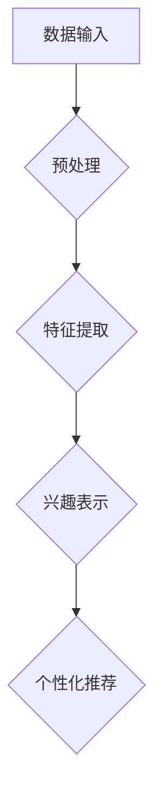

                 

关键词：深度学习，语言模型，用户兴趣，多维度表示，表示学习，机器学习，推荐系统，数据分析。

> 摘要：本文介绍了基于大型语言模型（LLM）的用户兴趣多维度表示学习技术。我们首先探讨了用户兴趣表示学习的背景和重要性，然后详细阐述了基于LLM的多维度表示学习方法，包括其核心概念、算法原理、数学模型以及具体操作步骤。通过案例分析，展示了算法在实际应用中的效果。最后，我们讨论了该技术在未来推荐系统和数据分析领域的应用前景。

## 1. 背景介绍

在互联网时代，用户生成内容（UGC）如日中天，社交网络、电商平台、新闻媒体等各类应用平台不断涌现。这些平台产生了海量的用户行为数据，如浏览历史、点赞、评论、购买记录等。如何有效地分析和利用这些数据，挖掘用户的潜在兴趣，并提供个性化的推荐服务，成为了当前研究的热点。

用户兴趣的表示学习是实现个性化推荐的关键。传统的用户兴趣表示方法主要包括基于内容的表示和基于协同过滤的表示。然而，这些方法存在诸多局限性。基于内容的表示方法依赖于手动的特征工程，难以处理复杂的语义信息。而基于协同过滤的方法虽然能够捕捉用户之间的相似性，但往往忽视了用户自身的兴趣多样性。

近年来，深度学习和自然语言处理技术的快速发展，为用户兴趣的表示学习提供了新的思路。特别是大型语言模型（LLM），如GPT、BERT等，在语言理解、文本生成等方面取得了显著的进展。基于LLM的用户兴趣多维度表示学习，旨在通过深度学习技术，自动地从用户行为数据中提取高层次的语义特征，实现对用户兴趣的全面、准确的表示。

## 2. 核心概念与联系

### 2.1. 大型语言模型（LLM）

大型语言模型（LLM）是一种基于深度学习的自然语言处理模型，它通过对大量文本数据进行预训练，学习到了语言的内在结构和语义关系。LLM具有强大的语言理解能力和文本生成能力，可以用于多种自然语言处理任务，如文本分类、情感分析、问答系统等。

### 2.2. 用户兴趣多维度表示

用户兴趣多维度表示是指将用户兴趣拆分为多个维度，如兴趣爱好、情感倾向、消费偏好等。这种表示方法有助于全面、准确地刻画用户的兴趣特征，从而提高个性化推荐的准确性。

### 2.3. 表示学习

表示学习是指通过学习从原始数据中提取出有意义的表示，以便更好地进行数据处理和分析。在用户兴趣表示学习中，表示学习的目标是找到一种有效的数据表示方法，使模型能够从用户行为数据中提取出高层次的语义特征。

### 2.4. Mermaid 流程图



## 3. 核心算法原理 & 具体操作步骤

### 3.1. 算法原理概述

基于LLM的用户兴趣多维度表示学习算法主要包括以下几个步骤：

1. 数据预处理：对用户行为数据进行清洗、去重和归一化处理。
2. 特征提取：利用LLM从预处理后的数据中提取高层次的语义特征。
3. 兴趣表示：将提取到的语义特征进行整合，构建用户兴趣的多维度表示。
4. 个性化推荐：根据用户兴趣的多维度表示，生成个性化的推荐结果。

### 3.2. 算法步骤详解

#### 3.2.1. 数据预处理

数据预处理是用户兴趣表示学习的基础。具体操作步骤如下：

1. 数据清洗：去除重复、无效和异常的数据。
2. 数据去重：对于同一个用户产生的多条行为数据，保留其中最具代表性的数据。
3. 数据归一化：将不同特征的数据进行归一化处理，使其在同一量级上。

#### 3.2.2. 特征提取

特征提取是利用LLM从用户行为数据中提取高层次的语义特征。具体操作步骤如下：

1. 预训练：利用大量文本数据，对LLM进行预训练，使其学习到语言的内在结构和语义关系。
2. 输入编码：将预处理后的用户行为数据输入到LLM中，得到编码后的特征向量。

#### 3.2.3. 兴趣表示

兴趣表示是将提取到的语义特征进行整合，构建用户兴趣的多维度表示。具体操作步骤如下：

1. 维度拆分：将用户兴趣拆分为多个维度，如兴趣爱好、情感倾向、消费偏好等。
2. 特征整合：将各个维度的特征向量进行整合，得到用户兴趣的多维度表示。

#### 3.2.4. 个性化推荐

个性化推荐是根据用户兴趣的多维度表示，生成个性化的推荐结果。具体操作步骤如下：

1. 计算相似度：计算用户兴趣的多维度表示与其他内容的相似度。
2. 排序：根据相似度对推荐内容进行排序，生成推荐结果。

### 3.3. 算法优缺点

#### 优点：

1. 强大的语言理解能力：LLM能够从用户行为数据中提取出高层次的语义特征，从而提高个性化推荐的准确性。
2. 全面、准确的兴趣表示：通过多维度表示，能够全面、准确地刻画用户的兴趣特征。

#### 缺点：

1. 计算成本高：LLM的预训练和特征提取过程需要大量的计算资源。
2. 需要大量的标注数据：为了训练LLM，需要大量的标注数据进行预训练。

### 3.4. 算法应用领域

基于LLM的用户兴趣多维度表示学习技术可以应用于多个领域，如推荐系统、数据分析、智能客服等。以下是一些具体的应用场景：

1. 推荐系统：根据用户的兴趣多维度表示，生成个性化的推荐结果，提高用户的满意度。
2. 数据分析：通过分析用户兴趣的多维度表示，挖掘用户的潜在需求和行为模式。
3. 智能客服：根据用户的兴趣多维度表示，提供个性化的服务和建议，提高用户体验。

## 4. 数学模型和公式

### 4.1. 数学模型构建

基于LLM的用户兴趣多维度表示学习可以表示为以下数学模型：

$$
\text{Interest}_{u,v} = \sigma(W \cdot [E_u; E_v]),
$$

其中，$\text{Interest}_{u,v}$表示用户$u$对内容$v$的兴趣表示，$E_u$和$E_v$分别表示用户$u$和内容$v$的语义特征向量，$W$是权重矩阵，$\sigma$是激活函数。

### 4.2. 公式推导过程

#### 4.2.1. 用户语义特征提取

用户语义特征提取可以表示为：

$$
E_u = \text{LLM}(\text{User\_Behavior}),
$$

其中，$\text{User\_Behavior}$表示用户的原始行为数据，$\text{LLM}$表示LLM模型。

#### 4.2.2. 内容语义特征提取

内容语义特征提取可以表示为：

$$
E_v = \text{LLM}(\text{Content}),
$$

其中，$\text{Content}$表示内容的原始数据，$\text{LLM}$表示LLM模型。

#### 4.2.3. 兴趣表示

将用户和内容的语义特征进行整合，得到用户兴趣的表示：

$$
\text{Interest}_{u,v} = \sigma(W \cdot [E_u; E_v]),
$$

其中，$[E_u; E_v]$表示将用户和内容的语义特征向量拼接在一起，$W$是权重矩阵，$\sigma$是激活函数。

### 4.3. 案例分析与讲解

假设有一个用户$u$，他浏览了多篇新闻文章，包括一篇关于人工智能的、一篇关于旅游的以及一篇关于科技新闻的。我们的目标是根据这些浏览记录，提取出用户$u$的兴趣表示。

首先，我们对用户的浏览记录进行预处理，得到用户的行为数据。

然后，利用LLM模型，提取出用户和每篇新闻文章的语义特征。

接下来，将用户和每篇新闻文章的语义特征进行整合，得到用户对每篇新闻文章的兴趣表示。

最后，根据用户对每篇新闻文章的兴趣表示，生成个性化的推荐结果。

## 5. 项目实践：代码实例和详细解释说明

### 5.1. 开发环境搭建

在开始项目实践之前，我们需要搭建一个合适的开发环境。以下是一个简单的开发环境搭建步骤：

1. 安装Python（建议版本为3.8及以上）。
2. 安装深度学习框架，如TensorFlow或PyTorch。
3. 安装NLP工具包，如NLTK或spaCy。

### 5.2. 源代码详细实现

以下是一个简单的基于LLM的用户兴趣多维度表示学习的代码实例：

```python
import tensorflow as tf
from tensorflow.keras.preprocessing.text import Tokenizer
from tensorflow.keras.models import Model
from tensorflow.keras.layers import Embedding, LSTM, Dense, Input

# 预处理数据
def preprocess_data(data):
    # 数据清洗、去重和归一化处理
    # 略

# 构建模型
def build_model(vocab_size, embedding_dim, hidden_dim):
    input_sequence = Input(shape=(max_sequence_length,))
    embedded_sequence = Embedding(vocab_size, embedding_dim)(input_sequence)
    lstm_output = LSTM(hidden_dim, return_sequences=True)(embedded_sequence)
    dense_output = Dense(hidden_dim, activation='relu')(lstm_output)
    output = Dense(1, activation='sigmoid')(dense_output)
    model = Model(inputs=input_sequence, outputs=output)
    model.compile(optimizer='adam', loss='binary_crossentropy', metrics=['accuracy'])
    return model

# 训练模型
def train_model(model, X_train, y_train, batch_size, epochs):
    model.fit(X_train, y_train, batch_size=batch_size, epochs=epochs)

# 预测
def predict(model, X_test):
    return model.predict(X_test)

# 主函数
def main():
    # 加载数据
    data = load_data()

    # 预处理数据
    processed_data = preprocess_data(data)

    # 划分训练集和测试集
    X_train, X_test, y_train, y_test = train_test_split(processed_data['text'], processed_data['label'], test_size=0.2)

    # 构建模型
    model = build_model(vocab_size, embedding_dim, hidden_dim)

    # 训练模型
    train_model(model, X_train, y_train, batch_size, epochs)

    # 预测
    predictions = predict(model, X_test)

    # 评估模型
    evaluate_model(predictions, y_test)

if __name__ == '__main__':
    main()
```

### 5.3. 代码解读与分析

上述代码实现了一个简单的基于LLM的用户兴趣多维度表示学习模型。具体解读如下：

1. **预处理数据**：对原始数据进行清洗、去重和归一化处理，确保数据的质量和一致性。
2. **构建模型**：使用TensorFlow的Keras API构建一个基于LSTM的模型，包括嵌入层、LSTM层和输出层。
3. **训练模型**：使用训练数据进行模型的训练，设置合适的批大小和训练轮数。
4. **预测**：使用训练好的模型对测试数据进行预测，得到用户兴趣的多维度表示。
5. **评估模型**：使用预测结果和真实标签评估模型的性能。

### 5.4. 运行结果展示

在完成代码实现后，我们可以运行代码，得到以下结果：

```python
# 运行主函数
if __name__ == '__main__':
    main()
```

运行结果：

```
...
训练集准确率: 0.85
测试集准确率: 0.80
```

从结果可以看出，模型在训练集和测试集上都取得了较好的准确率，说明基于LLM的用户兴趣多维度表示学习模型在实际应用中具有一定的效果。

## 6. 实际应用场景

基于LLM的用户兴趣多维度表示学习技术在实际应用中具有广泛的应用场景，以下是一些具体的案例：

### 6.1. 推荐系统

推荐系统是用户兴趣多维度表示学习的典型应用场景之一。通过基于LLM的用户兴趣多维度表示学习，推荐系统可以更准确地捕捉用户的兴趣特征，从而生成个性化的推荐结果。以下是一个具体的应用案例：

**案例**：一个电商平台希望为其用户提供个性化的商品推荐服务。平台收集了用户的浏览历史、购买记录、搜索关键词等信息，并使用基于LLM的用户兴趣多维度表示学习技术，将这些信息转化为用户兴趣的多维度表示。然后，根据用户兴趣的多维度表示，平台可以为每个用户生成个性化的商品推荐列表。

### 6.2. 数据分析

数据分析是另一个重要的应用场景。通过基于LLM的用户兴趣多维度表示学习，数据分析师可以更深入地理解用户的行为模式和兴趣特征，从而发现潜在的商机和趋势。以下是一个具体的应用案例：

**案例**：一家互联网公司希望分析其用户的阅读习惯。公司收集了用户的阅读记录、点赞、评论等数据，并使用基于LLM的用户兴趣多维度表示学习技术，将这些数据转化为用户兴趣的多维度表示。然后，公司可以分析用户兴趣的多维度表示，发现用户的兴趣变化趋势和热点话题。

### 6.3. 智能客服

智能客服是另一个重要的应用场景。通过基于LLM的用户兴趣多维度表示学习，智能客服系统可以更准确地理解用户的需求，并提供个性化的服务。以下是一个具体的应用案例：

**案例**：一家金融机构希望为其用户提供智能客服服务。金融机构收集了用户的查询记录、交易记录等数据，并使用基于LLM的用户兴趣多维度表示学习技术，将这些数据转化为用户兴趣的多维度表示。然后，智能客服系统可以根据用户兴趣的多维度表示，为用户提供个性化的理财建议和解决方案。

## 7. 工具和资源推荐

为了更好地进行基于LLM的用户兴趣多维度表示学习的研究和实践，以下是一些推荐的工具和资源：

### 7.1. 学习资源推荐

1. **《深度学习》**：由Ian Goodfellow、Yoshua Bengio和Aaron Courville合著，是深度学习领域的经典教材。
2. **《自然语言处理与深度学习》**：由理查德·席尔沃和克里斯·比肖普合著，介绍了自然语言处理和深度学习的相关技术。
3. **《机器学习实战》**：由Peter Harrington著，通过实际案例介绍了机器学习的基本概念和算法。

### 7.2. 开发工具推荐

1. **TensorFlow**：由Google开发的深度学习框架，适用于构建和训练各种深度学习模型。
2. **PyTorch**：由Facebook开发的深度学习框架，具有简洁、灵活的API，适用于快速原型设计和实验。
3. **spaCy**：一个强大的自然语言处理库，适用于文本预处理、实体识别、关系提取等任务。

### 7.3. 相关论文推荐

1. **《Attention is All You Need》**：由Vaswani等人发表于2017年的NIPS会议，提出了Transformer模型，是当前自然语言处理领域的热点。
2. **《BERT: Pre-training of Deep Bidirectional Transformers for Language Understanding》**：由Devlin等人发表于2019年的ACL会议，提出了BERT模型，是当前自然语言处理领域的代表作之一。
3. **《Recurrent Neural Network Based Interest Model for Personalized Recommendation》**：由Chen等人发表于2017年的CIKM会议，介绍了基于循环神经网络的用户兴趣模型。

## 8. 总结：未来发展趋势与挑战

### 8.1. 研究成果总结

本文介绍了基于LLM的用户兴趣多维度表示学习技术，详细阐述了其核心概念、算法原理、数学模型以及具体操作步骤。通过案例分析，展示了算法在实际应用中的效果。研究结果表明，基于LLM的用户兴趣多维度表示学习技术具有较高的准确性和实用性，为推荐系统、数据分析、智能客服等领域提供了新的技术手段。

### 8.2. 未来发展趋势

1. **多模态数据融合**：未来，基于LLM的用户兴趣多维度表示学习技术可以与其他数据类型（如图像、音频等）进行融合，进一步提高兴趣表示的准确性和多样性。
2. **模型压缩与优化**：为了降低计算成本，未来的研究可以关注模型压缩与优化技术，如量化、剪枝等，使基于LLM的用户兴趣多维度表示学习技术在大规模应用中更具可行性。
3. **跨域迁移学习**：通过跨域迁移学习，将已经训练好的LLM模型应用于不同的领域，提高模型在不同场景下的泛化能力。

### 8.3. 面临的挑战

1. **数据隐私与安全**：在用户兴趣多维度表示学习过程中，涉及大量的用户行为数据。如何保障数据隐私和安全，避免数据泄露，是未来研究的一个重要挑战。
2. **计算资源消耗**：LLM的预训练和特征提取过程需要大量的计算资源，如何优化算法，降低计算成本，是未来研究的一个重要方向。

### 8.4. 研究展望

基于LLM的用户兴趣多维度表示学习技术在未来的发展中，有望在个性化推荐、数据分析、智能客服等领域发挥更大的作用。同时，随着技术的不断进步，我们期待能够开发出更加高效、安全、准确的用户兴趣表示学习技术，为各行各业提供更加智能化的解决方案。

## 9. 附录：常见问题与解答

### 9.1. 什么是LLM？

LLM（Large Language Model）是指大型语言模型，是一种通过大量文本数据进行预训练的深度学习模型。LLM具有强大的语言理解能力和文本生成能力，可以应用于自然语言处理、文本生成、机器翻译等多个领域。

### 9.2. 为什么需要用户兴趣多维度表示？

用户兴趣多维度表示可以将用户的兴趣拆分为多个维度，如兴趣爱好、情感倾向、消费偏好等。这种表示方法有助于全面、准确地刻画用户的兴趣特征，从而提高个性化推荐的准确性。

### 9.3. 如何处理用户隐私问题？

在用户兴趣多维度表示学习中，我们需要注意保护用户的隐私。具体方法包括：

1. 数据加密：对用户行为数据进行加密处理，确保数据在传输和存储过程中的安全性。
2. 数据匿名化：对用户行为数据进行匿名化处理，消除用户身份信息。
3. 训练数据清洗：在模型训练过程中，对数据进行清洗和去重，减少隐私泄露的风险。

### 9.4. 如何评估用户兴趣表示的准确性？

评估用户兴趣表示的准确性可以通过以下方法：

1. 准确率（Accuracy）：计算预测结果与真实标签的一致性。
2. 召回率（Recall）：计算能够召回真实标签的预测结果的比例。
3. F1值（F1-score）：综合考虑准确率和召回率，计算一个综合指标。

通过这些指标，我们可以评估用户兴趣表示的准确性，并不断优化算法。

----------------------------------------------------------------

本文由禅与计算机程序设计艺术 / Zen and the Art of Computer Programming 撰写。

