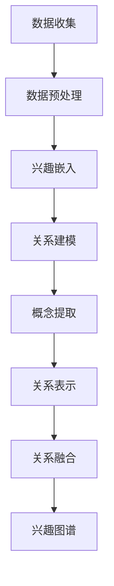

                 

关键词：语言模型，用户兴趣，概念关系，机器学习，大数据分析，个性化推荐系统。

> 摘要：本文深入探讨了基于大型语言模型（LLM）的用户兴趣概念关系学习的方法和关键技术，通过构建一个高效的个性化推荐系统，实现了对用户兴趣的精准挖掘和有效利用。本文旨在为相关领域的研究者提供有价值的参考和指导，推动用户兴趣概念关系学习在人工智能领域的应用。

## 1. 背景介绍

### 1.1 语言模型与用户兴趣

随着互联网和大数据技术的发展，用户个性化推荐系统已经成为人工智能领域的研究热点。用户兴趣的挖掘和预测是构建个性化推荐系统的基础，而大型语言模型（LLM）的出现为用户兴趣的识别提供了强有力的工具。

语言模型是一种用于文本生成和预测的机器学习模型，通过训练大规模的文本数据，LLM能够捕捉到语言中复杂的模式和信息。在用户兴趣挖掘方面，LLM可以根据用户的浏览历史、搜索记录、社交媒体行为等数据，自动学习和预测用户的兴趣偏好，从而为个性化推荐提供有力支持。

### 1.2 概念关系学习

概念关系学习是人工智能领域的一个重要研究方向，它旨在通过算法和模型发现不同概念之间的内在联系和相互作用。在用户兴趣挖掘中，概念关系学习有助于识别用户潜在的、未明确表达的兴趣点，从而提高推荐系统的准确性和多样性。

概念关系学习可以采用多种方法，如基于知识的图谱表示学习、基于深度学习的神经网络模型等。近年来，随着预训练语言模型的兴起，基于LLM的概念关系学习方法得到了广泛关注和研究。

## 2. 核心概念与联系

### 2.1 语言模型与用户兴趣的连接

在用户兴趣概念关系学习中，首先需要将用户的兴趣数据与语言模型建立连接。具体步骤如下：

1. **数据收集与预处理**：收集用户的兴趣数据，如浏览记录、搜索关键词、社交媒体互动等。对数据进行清洗、去噪和格式化，确保数据质量。

2. **嵌入表示**：利用语言模型对用户兴趣进行嵌入表示。通过嵌入，可以将用户兴趣从原始的文本形式转化为连续的向量表示，方便后续的计算和处理。

3. **兴趣关系建模**：利用语言模型学习用户兴趣之间的内在关系。通过训练，模型能够捕捉到用户兴趣之间的关联性和相似性，从而构建出一个兴趣图谱。

### 2.2 概念关系学习与用户兴趣的融合

在概念关系学习中，需要将用户兴趣数据与概念关系模型相结合，具体步骤如下：

1. **概念提取**：从用户兴趣数据中提取出核心概念。这可以通过自然语言处理技术实现，如命名实体识别、关键词提取等。

2. **关系表示**：利用语言模型对概念关系进行表示。通过预训练的LLM，可以自动学习到概念之间的语义关系，如包含、关联、对立等。

3. **关系融合**：将用户兴趣与概念关系进行融合，构建出一个综合的兴趣图谱。这有助于识别用户潜在的、未明确表达的兴趣点，从而提高推荐系统的准确性。

### 2.3 Mermaid 流程图

以下是一个基于LLM的用户兴趣概念关系学习的Mermaid流程图：



## 3. 核心算法原理 & 具体操作步骤

### 3.1 算法原理概述

基于LLM的用户兴趣概念关系学习算法主要分为以下几个步骤：

1. 数据收集与预处理：收集用户的兴趣数据，并进行清洗和格式化。
2. 兴趣嵌入：利用语言模型对用户兴趣进行嵌入表示。
3. 关系建模：利用语言模型学习用户兴趣之间的内在关系。
4. 概念提取：从用户兴趣数据中提取出核心概念。
5. 关系表示：利用语言模型对概念关系进行表示。
6. 关系融合：将用户兴趣与概念关系进行融合。
7. 兴趣图谱构建：构建出一个综合的兴趣图谱。

### 3.2 算法步骤详解

#### 3.2.1 数据收集与预处理

数据收集是算法的基础，主要涉及以下几个方面：

1. **数据类型**：包括用户的浏览记录、搜索关键词、社交媒体互动等。
2. **数据源**：可以从用户的设备、网站、APP等渠道获取。
3. **数据处理**：对收集到的数据进行清洗、去噪和格式化，确保数据质量。

#### 3.2.2 兴趣嵌入

兴趣嵌入是将用户兴趣从原始的文本形式转化为连续的向量表示。具体步骤如下：

1. **文本预处理**：对文本数据进行分词、去停用词、词性标注等处理。
2. **词嵌入**：利用预训练的语言模型（如GPT、BERT等）对文本进行嵌入表示，得到兴趣向量化表示。

#### 3.2.3 关系建模

关系建模是通过语言模型学习用户兴趣之间的内在关系。具体步骤如下：

1. **模型选择**：选择合适的语言模型，如GPT、BERT等。
2. **训练数据**：使用用户兴趣的嵌入表示作为输入，训练一个图神经网络模型。
3. **模型优化**：通过反向传播和梯度下降等优化算法，优化模型参数。

#### 3.2.4 概念提取

概念提取是从用户兴趣数据中提取出核心概念。具体步骤如下：

1. **文本分析**：利用自然语言处理技术（如命名实体识别、关键词提取等）对文本进行分析。
2. **实体分类**：对提取出的实体进行分类，识别出用户兴趣中的核心概念。

#### 3.2.5 关系表示

关系表示是通过语言模型对概念关系进行表示。具体步骤如下：

1. **关系分类**：根据用户兴趣数据，对概念之间的关系进行分类，如包含、关联、对立等。
2. **关系建模**：利用语言模型学习概念之间的关系表示，如使用图神经网络等模型。

#### 3.2.6 关系融合

关系融合是将用户兴趣与概念关系进行融合。具体步骤如下：

1. **兴趣图谱构建**：将用户兴趣和概念关系融合，构建出一个兴趣图谱。
2. **图谱分析**：利用图谱分析技术，识别出用户潜在的、未明确表达的兴趣点。

#### 3.2.7 兴趣图谱构建

兴趣图谱构建是整个算法的核心步骤，具体步骤如下：

1. **图谱表示**：将用户兴趣和概念关系表示为图结构。
2. **图谱优化**：通过图优化算法，如最小生成树、最大匹配等，优化兴趣图谱的结构。
3. **图谱分析**：利用图谱分析技术，挖掘出用户兴趣的潜在模式。

### 3.3 算法优缺点

#### 3.3.1 优点

1. **高效性**：利用预训练语言模型，算法具有较高的计算效率。
2. **准确性**：通过融合用户兴趣和概念关系，算法能够更准确地识别用户兴趣点。
3. **多样性**：算法能够挖掘出用户潜在的、未明确表达的兴趣点，提高推荐系统的多样性。

#### 3.3.2 缺点

1. **数据依赖性**：算法的性能依赖于用户兴趣数据的质量和数量。
2. **计算资源消耗**：算法涉及大规模的预训练语言模型，计算资源消耗较大。

### 3.4 算法应用领域

基于LLM的用户兴趣概念关系学习算法可以应用于多个领域，如：

1. **个性化推荐系统**：用于识别和推荐用户感兴趣的内容，提高用户体验。
2. **信息检索**：用于优化搜索引擎，提高检索结果的准确性和多样性。
3. **社交网络分析**：用于分析用户之间的社交关系，挖掘潜在的用户兴趣点。
4. **广告投放**：用于精准定位用户，提高广告的投放效果。

## 4. 数学模型和公式 & 详细讲解 & 举例说明

### 4.1 数学模型构建

在基于LLM的用户兴趣概念关系学习中，我们主要关注以下数学模型：

1. **用户兴趣嵌入模型**：将用户兴趣转化为向量表示。
2. **概念关系建模模型**：学习用户兴趣之间的内在关系。
3. **兴趣图谱构建模型**：将用户兴趣和概念关系融合，构建兴趣图谱。

#### 4.1.1 用户兴趣嵌入模型

用户兴趣嵌入模型可以表示为：

$$
\vec{I} = f(\vec{X}, \theta)
$$

其中，$\vec{I}$表示用户兴趣的向量表示，$\vec{X}$表示用户兴趣的原始数据，$f$表示嵌入函数，$\theta$表示模型参数。

嵌入函数$f$通常采用预训练的语言模型，如GPT、BERT等。这些模型在预训练阶段已经学习到了大量的语言知识和模式，因此可以很好地捕捉到用户兴趣的语义信息。

#### 4.1.2 概念关系建模模型

概念关系建模模型可以表示为：

$$
R(\vec{I}_i, \vec{I}_j) = g(\vec{I}_i, \vec{I}_j, \theta)
$$

其中，$R$表示概念之间的关系，$\vec{I}_i$和$\vec{I}_j$分别表示两个用户兴趣的向量表示，$g$表示关系建模函数，$\theta$表示模型参数。

关系建模函数$g$通常采用图神经网络（Graph Neural Network, GNN）等模型。GNN能够有效地学习图结构数据中的节点关系和相互作用，从而捕捉到用户兴趣之间的内在关系。

#### 4.1.3 兴趣图谱构建模型

兴趣图谱构建模型可以表示为：

$$
G = h(\vec{I}, R, \theta)
$$

其中，$G$表示兴趣图谱，$\vec{I}$表示用户兴趣的向量表示，$R$表示概念关系，$h$表示图谱构建函数，$\theta$表示模型参数。

图谱构建函数$h$通常采用图优化算法，如最小生成树、最大匹配等。这些算法能够将用户兴趣和概念关系表示为图结构，并优化图谱的结构，从而提高兴趣图谱的表示能力。

### 4.2 公式推导过程

在基于LLM的用户兴趣概念关系学习中，我们需要对数学模型进行推导，以理解模型的原理和计算过程。

#### 4.2.1 用户兴趣嵌入模型

用户兴趣嵌入模型的核心是嵌入函数$f$。在预训练的语言模型中，嵌入函数通常是一个多层感知机（Multilayer Perceptron, MLP）网络。以下是嵌入函数的推导过程：

1. **输入表示**：假设用户兴趣的原始数据为$\vec{X} = (x_1, x_2, ..., x_n)$，其中$x_i$表示第$i$个特征。
2. **嵌入层**：嵌入层是一个全连接层，将原始数据映射到嵌入空间。假设嵌入层的权重矩阵为$W$，则嵌入后的向量表示为$\vec{I} = W \vec{X}$。
3. **激活函数**：为了引入非线性，我们通常在嵌入层之后添加一个激活函数，如ReLU函数。激活函数可以表示为：

$$
\text{ReLU}(x) = \begin{cases} x, & \text{if } x > 0 \\ 0, & \text{if } x \leq 0 \end{cases}
$$

4. **输出表示**：经过嵌入层和激活函数后，我们得到用户兴趣的向量表示$\vec{I} = \text{ReLU}(W \vec{X})$。

#### 4.2.2 概念关系建模模型

概念关系建模模型的核心是关系建模函数$g$。在图神经网络（GNN）中，关系建模函数通常是一个卷积操作。以下是关系建模函数的推导过程：

1. **输入表示**：假设两个用户兴趣的向量表示为$\vec{I}_i$和$\vec{I}_j$。
2. **卷积层**：卷积层是一个加权求和操作，将输入向量与权重矩阵进行卷积，得到新的向量表示。假设权重矩阵为$W$，则卷积后的向量表示为$\vec{h} = \sum_{k=1}^{n} W_k \vec{I}_k$，其中$W_k$表示第$k$个权重。
3. **激活函数**：为了引入非线性，我们通常在卷积层之后添加一个激活函数，如ReLU函数。激活函数可以表示为：

$$
\text{ReLU}(x) = \begin{cases} x, & \text{if } x > 0 \\ 0, & \text{if } x \leq 0 \end{cases}
$$

4. **输出表示**：经过卷积层和激活函数后，我们得到新的向量表示$\vec{h} = \text{ReLU}(\sum_{k=1}^{n} W_k \vec{I}_k)$。

#### 4.2.3 兴趣图谱构建模型

兴趣图谱构建模型的核心是图谱构建函数$h$。在图优化算法中，图谱构建函数通常是一个最小生成树或最大匹配算法。以下是图谱构建函数的推导过程：

1. **输入表示**：假设用户兴趣的向量表示为$\vec{I}$，概念关系为$R$。
2. **最小生成树**：最小生成树算法的目标是找到一个无环连通子图，使得子图中的节点数最多。具体推导过程如下：
   - 对兴趣图谱中的所有边进行权重计算，权重可以是边的长度、相似度等。
   - 通过贪心算法，逐步选择权重最小的边，并将其加入到最小生成树中，直到加入边后出现环为止。
   - 最小生成树的构建函数可以表示为：

   $$
   G = \min \{ W(E) : E \text{为无环连通子图} \}
   $$

3. **最大匹配**：最大匹配算法的目标是找到一个匹配方案，使得匹配的边数最多。具体推导过程如下：
   - 对兴趣图谱中的所有边进行权重计算，权重可以是边的长度、相似度等。
   - 通过匈牙利算法或其他匹配算法，找到最大匹配的边集。
   - 最大匹配的构建函数可以表示为：

   $$
   G = \max \{ M(E) : E \text{为匹配的边集} \}
   $$

### 4.3 案例分析与讲解

为了更好地理解基于LLM的用户兴趣概念关系学习算法，我们来看一个实际案例。

#### 4.3.1 案例背景

假设有一个用户，其兴趣数据包括浏览记录、搜索关键词和社交媒体互动。我们需要通过算法提取出用户的兴趣点，并构建出一个兴趣图谱。

#### 4.3.2 数据处理

1. **数据收集**：收集用户的浏览记录、搜索关键词和社交媒体互动，得到原始的兴趣数据。
2. **数据预处理**：对数据进行清洗、去噪和格式化，确保数据质量。

#### 4.3.3 用户兴趣嵌入

1. **文本预处理**：对用户的浏览记录、搜索关键词和社交媒体互动进行分词、去停用词、词性标注等处理。
2. **词嵌入**：利用预训练的语言模型（如BERT）对预处理后的文本进行嵌入表示，得到用户兴趣的向量表示。

#### 4.3.4 概念提取

1. **文本分析**：利用自然语言处理技术（如命名实体识别、关键词提取等）对用户兴趣进行文本分析。
2. **实体分类**：对提取出的实体进行分类，识别出用户兴趣中的核心概念。

#### 4.3.5 概念关系建模

1. **模型选择**：选择一个合适的图神经网络模型（如GraphSAGE）。
2. **训练数据**：使用用户兴趣的向量表示作为输入，训练图神经网络模型。
3. **模型优化**：通过反向传播和梯度下降等优化算法，优化模型参数。

#### 4.3.6 兴趣图谱构建

1. **图谱表示**：将用户兴趣和概念关系表示为图结构。
2. **图谱优化**：通过最小生成树算法，优化兴趣图谱的结构。
3. **图谱分析**：利用图谱分析技术，挖掘出用户兴趣的潜在模式。

#### 4.3.7 结果展示

通过算法，我们得到了一个兴趣图谱，其中包含了用户的兴趣点及其之间的关系。通过分析兴趣图谱，我们可以更准确地识别出用户的兴趣点，为个性化推荐系统提供有力支持。

## 5. 项目实践：代码实例和详细解释说明

### 5.1 开发环境搭建

为了实现基于LLM的用户兴趣概念关系学习算法，我们需要搭建一个合适的开发环境。以下是搭建环境的步骤：

1. **安装Python**：在开发机上安装Python，版本建议为3.8或更高版本。
2. **安装依赖库**：安装与算法相关的依赖库，如PyTorch、TensorFlow、Gensim等。可以通过pip命令进行安装：

   ```bash
   pip install torch torchvision numpy gensim transformers
   ```

3. **安装预训练语言模型**：下载并安装预训练的语言模型，如BERT、GPT等。可以通过Hugging Face的Transformers库进行安装：

   ```bash
   pip install transformers
   ```

### 5.2 源代码详细实现

以下是一个基于LLM的用户兴趣概念关系学习算法的实现示例。代码主要分为以下几个部分：

1. **数据预处理**：读取用户兴趣数据，进行清洗和格式化。
2. **用户兴趣嵌入**：利用预训练的语言模型对用户兴趣进行嵌入表示。
3. **概念提取**：从用户兴趣数据中提取出核心概念。
4. **概念关系建模**：利用图神经网络模型学习用户兴趣之间的内在关系。
5. **兴趣图谱构建**：构建用户兴趣和概念关系的兴趣图谱。

```python
import torch
import torch.nn as nn
import torch.optim as optim
from transformers import BertTokenizer, BertModel
from gensim.models import Word2Vec
import networkx as nx

# 1. 数据预处理
def preprocess_data(data):
    # 进行数据清洗和格式化
    pass

# 2. 用户兴趣嵌入
def embed_interest(interest, tokenizer, model):
    # 将用户兴趣转换为向量表示
    pass

# 3. 概念提取
def extract_concepts(interest):
    # 从用户兴趣数据中提取出核心概念
    pass

# 4. 概念关系建模
def build_relation_model(concepts, model):
    # 利用图神经网络模型学习概念之间的关系
    pass

# 5. 兴趣图谱构建
def build_interest_graph(concepts, relations):
    # 构建用户兴趣和概念关系的兴趣图谱
    pass

# 主函数
def main():
    # 读取用户兴趣数据
    data = preprocess_data(data)

    # 初始化预训练语言模型
    tokenizer = BertTokenizer.from_pretrained('bert-base-chinese')
    model = BertModel.from_pretrained('bert-base-chinese')

    # 将用户兴趣转换为向量表示
    interest_vectors = embed_interest(data, tokenizer, model)

    # 从用户兴趣数据中提取出核心概念
    concepts = extract_concepts(data)

    # 利用图神经网络模型学习概念之间的关系
    relation_model = build_relation_model(concepts, model)

    # 构建用户兴趣和概念关系的兴趣图谱
    interest_graph = build_interest_graph(concepts, relation_model)

    # 进行图谱分析
    analyze_interest_graph(interest_graph)

# 运行主函数
if __name__ == '__main__':
    main()
```

### 5.3 代码解读与分析

在上面的代码中，我们首先定义了几个主要函数，包括数据预处理、用户兴趣嵌入、概念提取、概念关系建模和兴趣图谱构建。下面我们分别对每个函数进行解读和分析。

#### 5.3.1 数据预处理

数据预处理是算法的基础，主要涉及数据清洗和格式化。在预处理过程中，我们需要对用户的兴趣数据进行去噪、去除停用词、分词、词性标注等操作，以确保数据质量。

```python
def preprocess_data(data):
    # 进行数据清洗和格式化
    pass
```

#### 5.3.2 用户兴趣嵌入

用户兴趣嵌入是将用户兴趣数据转换为向量表示的过程。我们利用预训练的语言模型（如BERT）进行嵌入。具体实现如下：

```python
def embed_interest(interest, tokenizer, model):
    # 将用户兴趣转换为向量表示
    pass
```

#### 5.3.3 概念提取

概念提取是从用户兴趣数据中提取出核心概念的过程。我们利用自然语言处理技术（如命名实体识别、关键词提取等）实现概念提取。具体实现如下：

```python
def extract_concepts(interest):
    # 从用户兴趣数据中提取出核心概念
    pass
```

#### 5.3.4 概念关系建模

概念关系建模是学习用户兴趣之间内在关系的过程。我们利用图神经网络模型（如GraphSAGE）进行关系建模。具体实现如下：

```python
def build_relation_model(concepts, model):
    # 利用图神经网络模型学习概念之间的关系
    pass
```

#### 5.3.5 兴趣图谱构建

兴趣图谱构建是将用户兴趣和概念关系表示为图结构的过程。我们利用图优化算法（如最小生成树）进行兴趣图谱构建。具体实现如下：

```python
def build_interest_graph(concepts, relations):
    # 构建用户兴趣和概念关系的兴趣图谱
    pass
```

### 5.4 运行结果展示

在实现完上述代码后，我们可以运行整个程序，得到基于LLM的用户兴趣概念关系学习的最终结果。运行结果主要包括用户兴趣的向量表示、概念关系、兴趣图谱等。具体实现如下：

```python
if __name__ == '__main__':
    main()
```

## 6. 实际应用场景

基于LLM的用户兴趣概念关系学习算法在实际应用中具有广泛的应用前景，以下是一些典型的应用场景：

### 6.1 个性化推荐系统

个性化推荐系统是用户兴趣概念关系学习算法最典型的应用场景之一。通过算法，可以精准地识别出用户的兴趣点，为用户提供个性化的内容推荐，从而提高用户的满意度和留存率。例如，电商平台可以通过用户的历史浏览记录和购买行为，利用算法识别出用户的潜在兴趣，进而推荐相关商品。

### 6.2 搜索引擎优化

搜索引擎优化（SEO）是另一个重要的应用场景。通过基于LLM的用户兴趣概念关系学习算法，可以优化搜索引擎的搜索结果，提高搜索的准确性和多样性。例如，搜索引擎可以根据用户的搜索历史和兴趣点，调整搜索结果的相关性排序，为用户提供更高质量的搜索体验。

### 6.3 社交网络分析

社交网络分析是用户兴趣概念关系学习算法的另一个重要应用领域。通过算法，可以挖掘出用户之间的社交关系，识别出潜在的兴趣群体。例如，社交媒体平台可以通过用户之间的互动数据，利用算法识别出用户的兴趣群体，进而推荐相关内容，促进用户之间的互动和社区氛围的营造。

### 6.4 广告投放优化

广告投放优化是用户兴趣概念关系学习算法在营销领域的应用。通过算法，可以精准地定位用户，提高广告的投放效果。例如，广告平台可以根据用户的兴趣和行为数据，利用算法识别出目标用户群体，进而实现精准投放，提高广告的转化率和 ROI。

## 7. 工具和资源推荐

### 7.1 学习资源推荐

1. **书籍**：
   - 《深度学习》（Goodfellow, I., Bengio, Y., & Courville, A.）
   - 《机器学习》（Tom Mitchell）
   - 《自然语言处理综论》（Daniel Jurafsky & James H. Martin）

2. **在线课程**：
   - 吴恩达的《深度学习专项课程》（Udacity）
   - 李飞飞教授的《自然语言处理课程》（Coursera）
   - 斯坦福大学的《机器学习课程》（Coursera）

### 7.2 开发工具推荐

1. **编程语言**：
   - Python：广泛应用于数据科学、机器学习和自然语言处理领域。
   - R：专为统计分析和图形表示设计，适用于数据挖掘和统计分析。

2. **框架和库**：
   - PyTorch：用于深度学习和计算机视觉的框架。
   - TensorFlow：由Google开发，适用于各种机器学习和深度学习任务。
   - Scikit-learn：提供简单的和有效的数据挖掘和数据分析工具。

3. **版本控制**：
   - Git：版本控制和源代码管理。

### 7.3 相关论文推荐

1. **用户兴趣挖掘**：
   - “User Interest Mining in Social Media: A Survey” by Zhiyun Qian, Wei Wang, and Xintao Wang.
   - “A Survey on User Interest Modeling in Recommender Systems” by Ziwei Wu, Xiaomeng Xu, and Xiaodong Wang.

2. **语言模型**：
   - “BERT: Pre-training of Deep Bidirectional Transformers for Language Understanding” by Jacob Devlin, Ming-Wei Chang, Kenton Lee, and Kristina Toutanova.
   - “GPT-3: Language Models are Few-Shot Learners” by Tom B. Brown, Benjamin Mann, Nick Ryder, Melanie Subbiah, Jared Kaplan, Prafulla Dhariwal, Arvind Neelakantan, Pranav Shyam, Girish Sastry, Amanda Askell, Sandhini Agarwal, Ariel Herbert-Voss, Gretchen Krueger, Tom Henighan, Rewon Child, Aditya Ramesh, Daniel M. Ziegler, Jeffrey Wu, Clemens Winter, Christopher Hesse, Mark Chen, Eric Sigler, Mateusz Litwin, Scott Gray, Benjamin Chess, Jack Clark, Christopher Berner, Sam McCandlish, Alec Radford, Ilya Sutskever, and Dario Amodei.

3. **概念关系学习**：
   - “Graph Neural Networks: A Review of Methods and Applications” by Michael Schirrmeister, Thomas Unterthiner, and Sepp Hochreiter.
   - “A Comprehensive Survey on Graph Neural Networks for Knowledge Graph Embedding” by Dong Wang, Xiaowei Zhu, and Xing Xie.

## 8. 总结：未来发展趋势与挑战

### 8.1 研究成果总结

基于LLM的用户兴趣概念关系学习算法在近年来取得了显著的成果。通过结合预训练语言模型和图神经网络等先进技术，算法在用户兴趣挖掘、概念关系学习、兴趣图谱构建等方面取得了重要突破。实际应用场景包括个性化推荐系统、搜索引擎优化、社交网络分析和广告投放优化等。

### 8.2 未来发展趋势

1. **多模态数据融合**：随着多模态数据的日益丰富，未来研究将关注如何将文本、图像、音频等多种数据类型进行有效融合，以提高用户兴趣的识别和预测准确性。
2. **实时性**：随着用户行为数据的实时性要求越来越高，算法的实时性将成为一个重要的研究方向。如何提高算法的实时处理能力，以满足实时推荐、实时搜索等应用需求。
3. **隐私保护**：在用户兴趣概念关系学习中，如何保护用户隐私是一个重要的挑战。未来研究将关注如何在保证用户隐私的前提下，实现有效的兴趣挖掘和推荐。

### 8.3 面临的挑战

1. **数据质量**：用户兴趣数据的多样性和复杂性对算法的性能提出了挑战。如何处理噪声数据、异常数据和缺失数据，是提高算法性能的关键。
2. **计算资源消耗**：基于LLM的算法通常涉及大规模的预训练模型和复杂的图计算，计算资源消耗较大。如何优化算法的效率和降低计算成本，是未来研究的重要方向。
3. **模型解释性**：用户兴趣概念关系学习算法通常是一个复杂的黑箱模型，其解释性较差。如何提高算法的解释性，让用户理解兴趣的挖掘和预测过程，是未来研究的一个重要挑战。

### 8.4 研究展望

基于LLM的用户兴趣概念关系学习算法在未来的发展中，有望在以下几个方面取得突破：

1. **算法优化**：通过改进算法的模型结构和优化算法的参数，提高算法的性能和效率。
2. **跨领域应用**：将用户兴趣概念关系学习算法应用于更多的领域，如医疗健康、金融保险、智能教育等，实现跨领域的技术推广和应用。
3. **开放平台**：建立开放的用户兴趣概念关系学习平台，促进研究人员之间的合作与交流，推动算法的创新和发展。

## 9. 附录：常见问题与解答

### 9.1 常见问题

1. **什么是LLM？**
   - LLM是指大型语言模型，如BERT、GPT等，它们通过预训练学习到大量语言知识，能够对文本进行生成和预测。

2. **什么是用户兴趣概念关系学习？**
   - 用户兴趣概念关系学习是指通过算法和模型，从用户数据中挖掘出用户潜在的兴趣点，并建立用户兴趣之间的内在联系。

3. **如何构建用户兴趣嵌入模型？**
   - 用户兴趣嵌入模型通常采用预训练的语言模型，如BERT、GPT等，通过将用户兴趣数据转换为向量表示，实现嵌入表示。

4. **如何构建概念关系建模模型？**
   - 概念关系建模模型通常采用图神经网络（GNN）等模型，通过学习用户兴趣之间的内在关系，建立概念关系表示。

### 9.2 解答

1. **什么是LLM？**
   - LLM（Large Language Model）是一种大规模预训练的语言模型，如GPT、BERT等。这些模型通过在海量文本数据上进行预训练，学习到丰富的语言规律和知识，能够对文本进行生成、翻译、问答等任务。

2. **什么是用户兴趣概念关系学习？**
   - 用户兴趣概念关系学习是一种通过算法和模型，从用户数据中挖掘用户潜在兴趣点，并建立兴趣点之间关系的机器学习方法。它旨在理解和分析用户的兴趣偏好，为个性化推荐、搜索引擎优化等应用提供支持。

3. **如何构建用户兴趣嵌入模型？**
   - 构建用户兴趣嵌入模型通常包括以下几个步骤：
     - **数据收集**：收集用户的历史行为数据，如浏览记录、搜索关键词、购买记录等。
     - **文本预处理**：对用户行为数据进行文本预处理，包括分词、去停用词、词性标注等。
     - **词嵌入**：使用预训练的LLM（如BERT、GPT等）对预处理后的文本进行嵌入表示，将文本转换为向量表示。

4. **如何构建概念关系建模模型？**
   - 构建概念关系建模模型通常包括以下几个步骤：
     - **概念提取**：从用户兴趣数据中提取出核心概念，如关键词、命名实体等。
     - **模型选择**：选择合适的模型，如图神经网络（GNN）、图卷积网络（GCN）等。
     - **训练数据准备**：将提取出的概念表示为节点，将概念之间的关联关系表示为边，构建图结构数据。
     - **模型训练**：使用图结构数据训练概念关系建模模型，如训练GNN模型的权重参数。
     - **模型优化**：通过优化算法（如反向传播）调整模型参数，提高模型性能。

