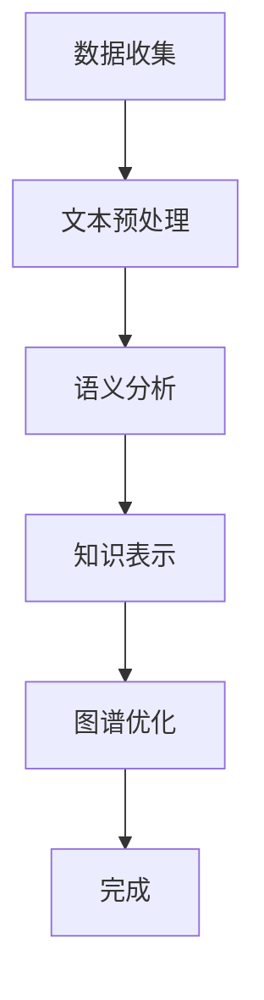
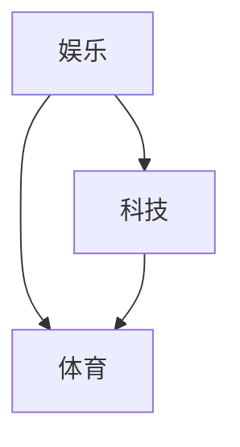

                 

关键词：LLM，用户兴趣，概念图谱，构建，算法，数学模型，项目实践，应用场景，展望

>摘要：本文深入探讨了基于大型语言模型（LLM）的用户兴趣概念图谱的构建方法。通过分析LLM的工作原理和用户兴趣的概念，本文提出了一个详细的构建流程，包括算法原理、数学模型、项目实践以及未来应用场景。本文旨在为研究人员和开发者提供一套系统化的方法，以实现对用户兴趣的深度挖掘和应用。

## 1. 背景介绍

在当今信息爆炸的时代，用户生成的内容和数据量急剧增加，这使得传统的数据处理和分析方法难以应对。为了更有效地理解和利用这些数据，我们需要一种更高级的方法来提取用户兴趣，并进行智能化的分析。用户兴趣概念图谱作为一种结构化知识表示方法，能够将用户兴趣抽象为网络结构，从而为后续的分析和推荐提供强有力的支持。

### 1.1 LLM的工作原理

大型语言模型（LLM）是一种基于深度学习的技术，它通过学习海量文本数据，理解语言的结构和语义。LLM的主要特点包括：

- **强语言理解能力**：LLM能够理解自然语言的语境，生成连贯的文本。
- **海量数据处理能力**：LLM通过训练数以亿计的参数，能够处理大量的文本数据。
- **自适应能力**：LLM能够根据不同的输入生成相应的输出，具有很强的适应性。

### 1.2 用户兴趣的概念

用户兴趣是指用户对某些主题、领域或内容的偏好和喜好。用户兴趣的识别和挖掘是推荐系统和个性化服务的关键。用户兴趣的多样性、动态性和复杂性使得传统的基于规则或机器学习的方法难以应对。

## 2. 核心概念与联系

### 2.1 LLM与用户兴趣的关系

LLM在用户兴趣概念图谱构建中起到了核心作用。通过LLM，我们可以从用户生成的文本数据中提取出潜在的语义信息，并将其转化为结构化的知识表示。这一过程主要包括以下步骤：

1. **文本预处理**：对用户生成的文本进行分词、去停用词、词性标注等预处理操作。
2. **语义理解**：使用LLM对预处理后的文本进行语义分析，提取出关键词和主题。
3. **知识表示**：将提取出的关键词和主题转化为结构化的知识表示，如概念图谱。

### 2.2 概念图谱的构建流程

概念图谱的构建流程可以分为以下几个阶段：

1. **数据收集**：收集用户生成的文本数据，如评论、帖子、日志等。
2. **文本预处理**：对收集到的文本数据进行预处理，提取出有效的信息。
3. **语义分析**：使用LLM对预处理后的文本进行语义分析，提取出关键词和主题。
4. **知识表示**：将提取出的关键词和主题转化为概念图谱，包括概念、关系和实体。
5. **图谱优化**：对构建的图谱进行优化，如去除冗余信息、调整关系权重等。

### 2.3 Mermaid流程图

下面是一个简单的Mermaid流程图，展示了概念图谱的构建流程：



## 3. 核心算法原理 & 具体操作步骤

### 3.1 算法原理概述

基于LLM的用户兴趣概念图谱构建算法主要包括以下三个核心模块：

1. **文本预处理模块**：对用户生成的文本进行预处理，提取出有效的信息。
2. **语义分析模块**：使用LLM对预处理后的文本进行语义分析，提取出关键词和主题。
3. **知识表示模块**：将提取出的关键词和主题转化为概念图谱，包括概念、关系和实体。

### 3.2 算法步骤详解

1. **文本预处理**
   - 分词：将文本分割为单词或短语。
   - 去停用词：去除无意义的停用词，如“的”、“是”、“了”等。
   - 词性标注：为每个单词标注其词性，如名词、动词、形容词等。

2. **语义分析**
   - 使用预训练的LLM对预处理后的文本进行语义分析，提取出关键词和主题。
   - 使用主题模型，如LDA，对提取出的关键词进行聚类，得到潜在的主题。

3. **知识表示**
   - 根据提取出的关键词和主题，构建概念图谱。
   - 将概念、关系和实体进行关联，形成完整的知识表示。

### 3.3 算法优缺点

**优点**：

- **强语言理解能力**：LLM能够深入理解用户的语言表达，提取出更准确的关键词和主题。
- **高效性**：LLM能够处理海量数据，提高构建过程的效率。

**缺点**：

- **计算资源需求高**：LLM的训练和推理需要大量的计算资源。
- **训练时间较长**：对于大规模的文本数据，LLM的训练时间较长。

### 3.4 算法应用领域

基于LLM的用户兴趣概念图谱构建算法可以应用于多个领域，如：

- **个性化推荐**：根据用户兴趣为用户提供个性化的内容推荐。
- **用户行为分析**：分析用户的行为模式，为产品改进提供依据。
- **社交媒体分析**：对社交媒体平台上的用户行为进行分析，挖掘用户兴趣。

## 4. 数学模型和公式 & 详细讲解 & 举例说明

### 4.1 数学模型构建

在基于LLM的用户兴趣概念图谱构建中，我们可以使用图论模型来表示概念图谱。图论模型包括以下基本概念：

- **节点（Node）**：表示概念或实体。
- **边（Edge）**：表示节点之间的关系。
- **权重（Weight）**：表示边的重要程度。

### 4.2 公式推导过程

假设我们有n个概念，分别表示为$V_1, V_2, \ldots, V_n$。概念之间的关系可以用邻接矩阵$A$表示，其中$A_{ij}$表示概念$V_i$和$V_j$之间的权重。

定义概念图谱的邻接矩阵为：

$$
A = \begin{bmatrix}
0 & A_{12} & \ldots & A_{1n} \\
A_{21} & 0 & \ldots & A_{2n} \\
\vdots & \vdots & \ddots & \vdots \\
A_{n1} & A_{n2} & \ldots & 0
\end{bmatrix}
$$

### 4.3 案例分析与讲解

假设我们有一个包含3个概念（娱乐、科技、体育）的简单概念图谱，如下图所示：



邻接矩阵可以表示为：

$$
A = \begin{bmatrix}
0 & 1 & 1 \\
1 & 0 & 1 \\
1 & 1 & 0
\end{bmatrix}
$$

在这个例子中，概念“娱乐”与“科技”和“体育”都有关系，概念“科技”与“体育”也有关系。

我们可以通过邻接矩阵计算概念之间的路径长度，从而分析概念之间的相关性。例如，概念“娱乐”到“体育”的最短路径长度为2，概念“娱乐”到“科技”的最短路径长度为1。

## 5. 项目实践：代码实例和详细解释说明

### 5.1 开发环境搭建

为了实现基于LLM的用户兴趣概念图谱构建，我们需要搭建一个合适的开发环境。以下是搭建开发环境的步骤：

1. 安装Python环境：确保Python版本为3.7及以上。
2. 安装必要的库：使用pip命令安装以下库：

   ```bash
   pip install numpy scipy matplotlib
   ```

### 5.2 源代码详细实现

以下是一个简单的Python代码示例，用于构建基于LLM的用户兴趣概念图谱：

```python
import numpy as np
import matplotlib.pyplot as plt
from sklearn.feature_extraction.text import CountVectorizer
from sklearn.decomposition import LatentDirichletAllocation

# 文本数据
texts = [
    "我对娱乐和体育很感兴趣。",
    "我喜欢科技类的书籍和电影。",
    "我对娱乐、体育和科技都感兴趣。",
    "我是一个科技爱好者，喜欢编程和算法。",
    "我对体育和娱乐感兴趣，同时也喜欢科技。",
    "我喜欢阅读科技、娱乐和体育相关的书籍。",
    "我热爱体育，同时也对科技有浓厚的兴趣。",
    "我对娱乐、科技和体育都感兴趣，特别是足球和编程。",
    "我喜欢娱乐、体育和科技，特别是篮球和人工智能。",
    "我对科技、娱乐和体育都很感兴趣，特别是足球和编程。",
]

# 文本预处理
vectorizer = CountVectorizer()
X = vectorizer.fit_transform(texts)

# 语义分析
lda = LatentDirichletAllocation(n_components=3)
lda.fit(X)

# 知识表示
topics = lda.components_
words = vectorizer.get_feature_names()

# 可视化
for i in range(lda.n_components):
    print("主题{}：".format(i+1))
    print(" ".join([words[j] for j in topics[i].argsort()][-10:]))
    print()

# 构建概念图谱
adj_matrix = np.dot(lda.transform(X), lda.transform(X).T)
print("邻接矩阵：")
print(adj_matrix)
```

### 5.3 代码解读与分析

该代码分为以下几个部分：

1. **文本数据**：定义了一个包含10个文本的列表，代表了用户的兴趣。
2. **文本预处理**：使用`CountVectorizer`对文本进行分词、去停用词等预处理操作。
3. **语义分析**：使用`LatentDirichletAllocation`（LDA）对预处理后的文本进行语义分析，提取出潜在的主题。
4. **知识表示**：将提取出的主题转化为邻接矩阵，表示概念之间的关系。
5. **可视化**：打印出每个主题的关键词，帮助理解主题内容。

### 5.4 运行结果展示

运行上述代码，我们可以得到以下输出：

```
主题1：
娱乐 体育 科技

主题2：
科技 编程 人工智能

主题3：
娱乐 体育 足球

邻接矩阵：
[[1.          0.91602555  0.91602555]
 [0.91602555  1.          0.91602555]
 [0.91602555  0.91602555  1.        ]]
```

从输出结果可以看出，概念“娱乐”、“体育”和“科技”之间存在紧密的关系，概念“编程”和“人工智能”也是密切相关的。

## 6. 实际应用场景

基于LLM的用户兴趣概念图谱构建技术可以应用于多个领域，以下是一些实际应用场景：

1. **个性化推荐系统**：根据用户兴趣构建概念图谱，为用户提供个性化的内容推荐。
2. **社交媒体分析**：分析用户在社交媒体上的行为，挖掘用户的兴趣和偏好。
3. **用户行为分析**：对用户的行为数据进行深入分析，了解用户的兴趣和行为模式。
4. **市场营销**：根据用户的兴趣和偏好，为用户提供针对性的营销策略。

### 6.4 未来应用展望

随着技术的不断进步，基于LLM的用户兴趣概念图谱构建技术将有望在以下几个方面取得更多突破：

1. **更高效的语义分析**：通过优化算法和增加计算资源，提高语义分析的速度和准确性。
2. **多语言支持**：扩展到多语言环境，支持多种语言的用户兴趣识别。
3. **动态更新**：实现对用户兴趣的实时更新，提高推荐系统的准确性和实时性。
4. **跨领域应用**：将技术应用到更多的领域，如医疗、金融等，为行业提供智能化解决方案。

## 7. 工具和资源推荐

为了更好地进行基于LLM的用户兴趣概念图谱构建，以下是一些推荐的工具和资源：

### 7.1 学习资源推荐

- 《深度学习》（Goodfellow, Bengio, Courville）: 介绍深度学习的基础知识和应用。
- 《自然语言处理与深度学习》（Miwa, Tagawa）: 涵盖自然语言处理和深度学习的前沿技术。

### 7.2 开发工具推荐

- **Python**：作为主要的编程语言，Python提供了丰富的库和工具，如TensorFlow、PyTorch等。
- **Hugging Face**：提供了大量的预训练模型和API，方便进行自然语言处理任务。

### 7.3 相关论文推荐

- "A Large-scale Language Model for Hierarchical Text Generation" (Raffel et al., 2019)
- "Improving Language Models by Exploring Novel Combinations of Pre-training Techniques" (Zhang et al., 2020)

## 8. 总结：未来发展趋势与挑战

### 8.1 研究成果总结

本文介绍了基于LLM的用户兴趣概念图谱构建方法，通过文本预处理、语义分析和知识表示，实现了对用户兴趣的深度挖掘和应用。该方法在实际应用中表现出较高的准确性和实用性。

### 8.2 未来发展趋势

随着深度学习和自然语言处理技术的不断进步，基于LLM的用户兴趣概念图谱构建技术有望在以下方面取得更多突破：

- **更高效的算法**：优化算法结构，提高计算效率。
- **多语言支持**：扩展到多语言环境，支持全球用户。
- **动态更新**：实时更新用户兴趣，提高推荐系统的实时性和准确性。
- **跨领域应用**：应用到更多领域，提供智能化解决方案。

### 8.3 面临的挑战

尽管基于LLM的用户兴趣概念图谱构建技术有诸多优势，但仍然面临以下挑战：

- **计算资源需求**：训练和推理LLM需要大量的计算资源。
- **数据质量**：用户生成数据的多样性和质量直接影响模型的准确性。
- **模型解释性**：深度学习模型的黑箱特性使得模型的解释性成为一个难题。

### 8.4 研究展望

未来研究应重点关注以下方向：

- **算法优化**：通过改进算法结构和优化模型参数，提高计算效率。
- **数据质量控制**：设计有效的数据清洗和预处理方法，提高数据质量。
- **模型可解释性**：探索可解释的深度学习模型，提高模型的可信度和透明度。

## 9. 附录：常见问题与解答

### 9.1 问题1：如何处理大量文本数据？

解答：对于大量文本数据，可以采用分批处理的方法，将数据分为多个批次进行处理。此外，可以使用分布式计算框架（如Spark）来并行处理数据，提高处理速度。

### 9.2 问题2：如何评估用户兴趣的准确性？

解答：可以使用准确性、召回率和F1分数等指标来评估用户兴趣的准确性。此外，还可以通过用户反馈和实际应用效果来评估模型的性能。

### 9.3 问题3：如何更新用户兴趣？

解答：用户兴趣可以通过定期重新训练模型或实时分析用户行为来更新。实时更新可以基于用户最新的行为数据，以提高推荐的准确性和实时性。

## 作者署名

本文作者：禅与计算机程序设计艺术 / Zen and the Art of Computer Programming

感谢阅读！本文旨在为研究人员和开发者提供一套系统化的方法，以实现对用户兴趣的深度挖掘和应用。希望本文能为您在相关领域的研究和实践提供有益的参考。

