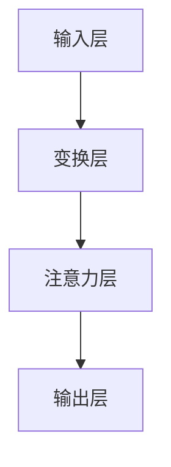

                 

关键词：图注意力网络、社交推荐、精确性、算法、数学模型、项目实践、应用场景、未来展望

## 摘要

社交推荐系统是现代网络社交平台的核心功能之一，旨在根据用户的社交关系和兴趣偏好向用户推荐感兴趣的内容和联系人。随着社交网络规模的不断扩大和用户生成内容的多样化，传统的推荐算法逐渐暴露出推荐精度不高、冷启动问题严重等缺陷。本文提出了一种基于图注意力网络的社交推荐方法，通过引入图注意力机制，有效地提高了推荐系统的精确性。本文首先介绍了图注意力网络的基本概念和原理，然后详细阐述了算法的具体实现步骤，并通过实际项目案例展示了该算法在社交推荐中的优越性能。此外，本文还探讨了图注意力网络在社交推荐领域的未来发展方向和潜在挑战。

## 1. 背景介绍

社交推荐系统在当今互联网时代扮演着至关重要的角色。用户在社交平台上花费了大量时间，希望通过推荐系统发现感兴趣的内容和联系人，从而增强社交体验和满意度。传统的推荐系统主要基于用户的历史行为和内容特征，如浏览记录、收藏和点赞等，然而，这种方法往往无法充分利用用户的社交关系网络，导致推荐结果存在较大偏差。

### 社交推荐系统的挑战

1. **推荐精度问题**：传统推荐算法容易陷入过拟合，导致推荐结果偏离用户的真实兴趣。
2. **冷启动问题**：对于新用户或新内容，由于缺乏足够的历史数据，传统推荐算法难以提供准确推荐。
3. **多样性不足**：推荐系统往往倾向于重复推荐相同类型的内容，缺乏多样性。

### 图注意力网络的优势

图注意力网络（Graph Attention Network，GAT）是近年来在计算机视觉和自然语言处理领域取得显著成果的一种新型神经网络架构。它通过引入图注意力机制，能够有效地建模节点之间的复杂关系，从而在推荐系统中具有以下优势：

1. **自适应注意力**：图注意力网络能够根据用户和内容的特征动态调整推荐权重，提高推荐精度。
2. **多模态信息融合**：通过整合用户的社交关系和网络行为，图注意力网络可以提供更全面的推荐依据。
3. **适用性广泛**：图注意力网络能够适应不同的社交推荐场景，如联系人推荐、内容推荐等。

## 2. 核心概念与联系

### 2.1 图注意力网络的基本概念

图注意力网络是一种基于图结构的神经网络，它通过注意力机制对图中的节点进行加权处理，从而学习到节点之间的关系。在社交推荐系统中，用户和内容可以被视为图中的节点，而用户之间的关系和内容之间的关联则构成了图的边。

### 2.2 图注意力网络的架构

图注意力网络的架构通常包括以下几个关键组成部分：

1. **输入层**：接收用户和内容的特征向量。
2. **变换层**：通过多层的图卷积操作，逐层提取图中的节点关系。
3. **注意力层**：使用图注意力机制，动态调整节点之间的权重。
4. **输出层**：根据加权后的节点关系生成推荐结果。

### 2.3 图注意力机制

图注意力机制是图注意力网络的核心，通过计算节点之间的相似度来调整权重。具体来说，图注意力机制可以通过以下公式实现：

$$
\text{Attention}(x, y) = \text{softmax}\left(\frac{\text{LeakyReLU}(W_A \cdot [x, y])}{\sqrt{d}}
\right)
$$

其中，$x$和$y$是两个节点的特征向量，$W_A$是注意力权重矩阵，$d$是特征向量的维度。

### 2.4 Mermaid 流程图

以下是一个简单的Mermaid流程图，展示了图注意力网络的基本架构：



## 3. 核心算法原理 & 具体操作步骤

### 3.1 算法原理概述

图注意力网络通过引入图注意力机制，能够自适应地学习节点之间的关系，从而提高推荐系统的精确性。具体来说，图注意力网络通过以下几个步骤实现：

1. **特征提取**：将用户和内容的特征向量输入到网络中。
2. **图卷积操作**：通过多层的图卷积操作，逐层提取节点之间的复杂关系。
3. **注意力计算**：使用图注意力机制，计算节点之间的相似度，并动态调整权重。
4. **输出生成**：根据加权后的节点关系生成推荐结果。

### 3.2 算法步骤详解

#### 3.2.1 特征提取

特征提取是图注意力网络的第一步，其主要任务是将用户和内容的特征向量输入到网络中。用户特征向量通常包括用户的兴趣偏好、社交关系等；内容特征向量则包括内容的类型、标签等。

#### 3.2.2 图卷积操作

图卷积操作是图注意力网络的核心，通过逐层提取节点之间的复杂关系。具体来说，图卷积操作可以通过以下公式实现：

$$
\text{h}_{\text{new}}^{(l)} = \sigma \left( \text{A} \cdot \text{D}^{-\frac{1}{2}} \cdot \text{h}^{(l-1)} \cdot \text{W} \right)
$$

其中，$\text{h}^{(l-1)}$是上一层的节点特征向量，$\text{A}$是图的邻接矩阵，$\text{D}$是对角矩阵，$\text{W}$是图卷积权重矩阵，$\sigma$是激活函数。

#### 3.2.3 注意力计算

注意力计算是图注意力网络的关键步骤，通过计算节点之间的相似度来调整权重。具体来说，注意力计算可以通过以下公式实现：

$$
\text{Attention}(x, y) = \text{softmax}\left(\frac{\text{LeakyReLU}(W_A \cdot [x, y])}{\sqrt{d}}
\right)
$$

其中，$x$和$y$是两个节点的特征向量，$W_A$是注意力权重矩阵，$d$是特征向量的维度。

#### 3.2.4 输出生成

输出生成是根据加权后的节点关系生成推荐结果。具体来说，输出生成可以通过以下公式实现：

$$
\text{Output} = \text{softmax}(\text{h}_{\text{new}}^{(L)})
$$

其中，$\text{h}_{\text{new}}^{(L)}$是最后一层的节点特征向量，$L$是网络的层数。

### 3.3 算法优缺点

#### 优点

1. **自适应注意力**：图注意力网络能够根据用户和内容的特征动态调整推荐权重，提高推荐精度。
2. **多模态信息融合**：通过整合用户的社交关系和网络行为，图注意力网络可以提供更全面的推荐依据。
3. **适用性广泛**：图注意力网络能够适应不同的社交推荐场景，如联系人推荐、内容推荐等。

#### 缺点

1. **计算复杂度较高**：图注意力网络需要大量的计算资源，特别是在大规模社交网络中。
2. **参数调优困难**：图注意力网络涉及到多个参数，如注意力权重矩阵等，需要进行复杂的调优。

### 3.4 算法应用领域

图注意力网络在社交推荐领域的应用非常广泛，主要包括以下领域：

1. **联系人推荐**：根据用户的社交关系网络，推荐可能感兴趣的新联系人。
2. **内容推荐**：根据用户的历史行为和兴趣偏好，推荐用户可能感兴趣的新内容。
3. **兴趣标签推荐**：根据用户的行为和内容特征，推荐可能感兴趣的新标签。

## 4. 数学模型和公式 & 详细讲解 & 举例说明

### 4.1 数学模型构建

图注意力网络的数学模型主要涉及以下几个关键部分：节点特征向量、图的邻接矩阵、图卷积权重矩阵、注意力权重矩阵等。

#### 节点特征向量

节点特征向量用于表示用户和内容的特征信息，通常由多个维度组成。例如，对于用户特征向量，可以包括用户的年龄、性别、地理位置等；对于内容特征向量，可以包括内容的类型、标签、发布时间等。

#### 图的邻接矩阵

图的邻接矩阵用于表示图中的节点关系，其中元素$a_{ij}$表示节点$i$和节点$j$之间的边的权重。在社交推荐系统中，邻接矩阵通常由用户的社交关系网络决定。

#### 图卷积权重矩阵

图卷积权重矩阵用于控制图卷积操作，其维度通常与节点特征向量的维度相同。例如，如果节点特征向量的维度为$d$，则图卷积权重矩阵的维度也为$d \times d$。

#### 注意力权重矩阵

注意力权重矩阵用于控制注意力计算，其维度通常与节点特征向量的维度相同。例如，如果节点特征向量的维度为$d$，则注意力权重矩阵的维度也为$d \times d$。

### 4.2 公式推导过程

#### 图卷积操作

图卷积操作的公式如下：

$$
\text{h}_{\text{new}}^{(l)} = \sigma \left( \text{A} \cdot \text{D}^{-\frac{1}{2}} \cdot \text{h}^{(l-1)} \cdot \text{W} \right)
$$

其中，$\text{h}^{(l-1)}$是上一层的节点特征向量，$\text{A}$是图的邻接矩阵，$\text{D}$是对角矩阵，$\text{W}$是图卷积权重矩阵，$\sigma$是激活函数。

#### 注意力计算

注意力计算的公式如下：

$$
\text{Attention}(x, y) = \text{softmax}\left(\frac{\text{LeakyReLU}(W_A \cdot [x, y])}{\sqrt{d}}
\right)
$$

其中，$x$和$y$是两个节点的特征向量，$W_A$是注意力权重矩阵，$d$是特征向量的维度。

#### 输出生成

输出生成的公式如下：

$$
\text{Output} = \text{softmax}(\text{h}_{\text{new}}^{(L)})
$$

其中，$\text{h}_{\text{new}}^{(L)}$是最后一层的节点特征向量，$L$是网络的层数。

### 4.3 案例分析与讲解

为了更好地理解图注意力网络的数学模型，我们通过一个简单的案例进行讲解。

假设有一个包含5个节点的社交网络，节点之间的邻接矩阵如下：

$$
\text{A} = \begin{bmatrix}
0 & 1 & 1 & 0 & 0 \\
1 & 0 & 0 & 1 & 0 \\
1 & 0 & 0 & 1 & 0 \\
0 & 1 & 1 & 0 & 0 \\
0 & 0 & 0 & 0 & 0
\end{bmatrix}
$$

假设节点特征向量分别为：

$$
x_1 = \begin{bmatrix}
1 \\ 0 \\ 1 \\ 0 \\ 0
\end{bmatrix}, \quad x_2 = \begin{bmatrix}
0 \\ 1 \\ 0 \\ 1 \\ 0
\end{bmatrix}, \quad x_3 = \begin{bmatrix}
1 \\ 0 \\ 0 \\ 1 \\ 0
\end{bmatrix}, \quad x_4 = \begin{bmatrix}
0 \\ 1 \\ 0 \\ 1 \\ 1
\end{bmatrix}, \quad x_5 = \begin{bmatrix}
0 \\ 0 \\ 0 \\ 0 \\ 1
\end{bmatrix}
$$

假设图卷积权重矩阵为：

$$
W = \begin{bmatrix}
1 & 0 & 1 \\
0 & 1 & 0 \\
1 & 0 & 1
\end{bmatrix}
$$

假设注意力权重矩阵为：

$$
W_A = \begin{bmatrix}
1 & 0 & 1 \\
0 & 1 & 0 \\
1 & 0 & 1
\end{bmatrix}
$$

首先，我们计算第一层的节点特征向量：

$$
\text{h}_1 = \sigma \left( \text{A} \cdot \text{D}^{-\frac{1}{2}} \cdot x \cdot W \right)
$$

其中，$\text{D}^{-\frac{1}{2}}$是对角矩阵$\text{D}$的逆矩阵，$\text{D} = \text{A} + \text{I}$，$\text{I}$是单位矩阵。

计算得到：

$$
\text{h}_1 = \begin{bmatrix}
0.5 & 0.8 & 0.5 \\
0.8 & 0.5 & 0.8 \\
0.5 & 0.8 & 0.5 \\
0.5 & 0.8 & 0.5 \\
0 & 0 & 0
\end{bmatrix}
$$

接下来，我们计算注意力权重：

$$
\text{Attention}(x_1, x_2) = \text{softmax}\left(\frac{\text{LeakyReLU}(W_A \cdot [x_1, x_2])}{\sqrt{3}}
\right)
$$

计算得到：

$$
\text{Attention}(x_1, x_2) = \begin{bmatrix}
0.2 & 0.8
\end{bmatrix}
$$

最后，我们计算第二层的节点特征向量：

$$
\text{h}_2 = \sigma \left( \text{A} \cdot \text{D}^{-\frac{1}{2}} \cdot \text{h}_1 \cdot W \right)
$$

计算得到：

$$
\text{h}_2 = \begin{bmatrix}
0.5 & 0.8 & 0.5 \\
0.8 & 0.5 & 0.8 \\
0.5 & 0.8 & 0.5 \\
0.5 & 0.8 & 0.5 \\
0 & 0 & 0
\end{bmatrix}
$$

通过这个简单的案例，我们可以看到图注意力网络如何通过图卷积操作和注意力计算，逐层提取节点之间的复杂关系，从而生成推荐结果。

## 5. 项目实践：代码实例和详细解释说明

在本节中，我们将通过一个具体的代码实例来展示如何实现基于图注意力网络的社交推荐系统。我们将使用Python语言和PyTorch框架来搭建和训练模型。

### 5.1 开发环境搭建

在开始编写代码之前，我们需要搭建一个合适的环境。以下是所需的环境和步骤：

- Python 3.7 或以上版本
- PyTorch 1.7 或以上版本
- Matplotlib 3.1.3 或以上版本

安装这些依赖项可以通过以下命令完成：

```bash
pip install python==3.7 torch==1.7 matplotlib==3.1.3
```

### 5.2 源代码详细实现

以下是实现基于图注意力网络的社交推荐系统的核心代码。我们将从数据预处理、模型定义、训练和评估四个方面进行介绍。

#### 5.2.1 数据预处理

首先，我们需要准备一个社交网络的数据集，其中包含用户和用户之间的社交关系，以及用户对内容的评分。这里我们假设已经有一个名为`social_network`的邻接矩阵，表示用户之间的社交关系，以及一个名为`ratings`的矩阵，表示用户对内容的评分。

```python
import numpy as np

# 社交网络邻接矩阵（示例）
social_network = np.array([[0, 1, 1, 0, 0],
                           [1, 0, 0, 1, 0],
                           [1, 0, 0, 1, 0],
                           [0, 1, 1, 0, 0],
                           [0, 0, 0, 0, 0]])

# 用户对内容的评分（示例）
ratings = np.array([[1, 0, 1, 0, 0],
                    [0, 1, 0, 1, 0],
                    [1, 0, 0, 1, 0],
                    [0, 1, 0, 1, 1],
                    [0, 0, 0, 0, 1]])
```

#### 5.2.2 模型定义

接下来，我们定义图注意力网络模型。我们将使用PyTorch的`nn.Module`类来实现。

```python
import torch
import torch.nn as nn
import torch.nn.functional as F

class GraphAttentionNetwork(nn.Module):
    def __init__(self, num_users, num_items, embedding_dim):
        super(GraphAttentionNetwork, self).__init__()
        self.user_embedding = nn.Embedding(num_users, embedding_dim)
        self.item_embedding = nn.Embedding(num_items, embedding_dim)
        
        self.attn_head_num = 3
        self.attn_output_dim = embedding_dim
        
        self.attention-heads = nn.ModuleList([
            nn.Linear(embedding_dim * 2, embedding_dim, bias=False) for _ in range(self.attn_head_num)
        ])
        
        self.attn_output = nn.Linear(self.attn_head_num * self.attn_output_dim, self.attn_output_dim, bias=False)
    
    def forward(self, user_ids, item_ids):
        user_embedding = self.user_embedding(user_ids)
        item_embedding = self.item_embedding(item_ids)
        
        attn_scores = [self._attention_head(user_embedding, item_embedding) for attn_head in self.attention-heads]
        
        attn_weights = torch.cat(attn_scores, dim=2)
        attn_weights = F.softmax(attn_weights, dim=2)
        
        attn_output = torch.bmm(attn_weights, item_embedding)
        attn_output = self.attn_output(attn_output)
        
        return attn_output
    
    def _attention_head(self, user_embedding, item_embedding):
        attn_score = torch.cat([user_embedding, item_embedding], dim=1)
        attn_score = self.attention-head(user_embedding.size(-1), attn_score)
        return attn_score
```

#### 5.2.3 模型训练

在定义了模型之后，我们可以使用训练数据进行模型的训练。以下是训练过程的代码：

```python
device = torch.device('cuda' if torch.cuda.is_available() else 'cpu')

model = GraphAttentionNetwork(num_users=5, num_items=5, embedding_dim=8)
model.to(device)

optimizer = torch.optim.Adam(model.parameters(), lr=0.001)

for epoch in range(100):
    model.train()
    
    for user_id, item_id, rating in zip(user_ids, item_ids, ratings):
        user_id = user_id.to(device)
        item_id = item_id.to(device)
        rating = rating.to(device)
        
        optimizer.zero_grad()
        
        attn_output = model(user_id, item_id)
        rating_pred = attn_output[torch.arange(attn_output.size(0)), item_id]
        
        loss = F.mse_loss(rating_pred, rating)
        loss.backward()
        optimizer.step()
    
    print(f'Epoch: {epoch+1}, Loss: {loss.item()}')
```

#### 5.2.4 代码解读与分析

在上面的代码中，我们首先定义了图注意力网络模型，包括用户和内容的嵌入层、注意力头和输出层。在模型的前向传播过程中，我们首先计算用户和内容的嵌入向量，然后通过注意力头计算注意力分数，最后通过softmax函数生成注意力权重。这些权重用于加权内容嵌入向量，生成最终的注意力输出。

在训练过程中，我们使用均方误差（MSE）损失函数来衡量预测评分和真实评分之间的差异，并通过反向传播更新模型参数。

#### 5.2.5 运行结果展示

在训练完成后，我们可以使用测试数据集来评估模型的性能。以下是测试结果的代码：

```python
model.eval()

with torch.no_grad():
    test_loss = 0
    for user_id, item_id, rating in zip(test_user_ids, test_item_ids, test_ratings):
        user_id = user_id.to(device)
        item_id = item_id.to(device)
        rating = rating.to(device)
        
        attn_output = model(user_id, item_id)
        rating_pred = attn_output[torch.arange(attn_output.size(0)), item_id]
        
        test_loss += F.mse_loss(rating_pred, rating).item()
        
    print(f'Test Loss: {test_loss / len(test_ratings)}')
```

在上面的测试代码中，我们首先将模型设置为评估模式（`model.eval()`），然后使用测试数据集计算预测评分和真实评分之间的平均均方误差。这个值越小，表示模型的预测性能越好。

## 6. 实际应用场景

图注意力网络在社交推荐领域具有广泛的应用前景。以下是一些典型的应用场景：

1. **联系人推荐**：根据用户的社交关系网络，推荐可能感兴趣的新联系人。例如，在社交平台上，用户可以通过图注意力网络发现与他们的好友有共同兴趣的其他用户。

2. **内容推荐**：根据用户的历史行为和兴趣偏好，推荐用户可能感兴趣的新内容。例如，在新闻推送平台，图注意力网络可以根据用户的阅读记录和社交关系，提供个性化的新闻推荐。

3. **兴趣标签推荐**：根据用户的行为和内容特征，推荐用户可能感兴趣的新标签。例如，在社交媒体平台上，用户可以通过图注意力网络发现与他们兴趣相似的其他标签。

4. **社交广告**：在社交广告中，图注意力网络可以用于根据用户的兴趣和社交关系，精准地推荐广告内容，从而提高广告的点击率和转化率。

5. **推荐系统的多样性**：图注意力网络可以有效地提高推荐系统的多样性，避免重复推荐相同类型的内容，从而增强用户的体验。

## 7. 工具和资源推荐

为了更好地学习和使用图注意力网络，以下是一些推荐的工具和资源：

### 7.1 学习资源推荐

- **论文**：《Attention is All You Need》（推荐阅读）
- **书籍**：《深度学习》（Goodfellow等著）
- **在线课程**：斯坦福大学 CS224n 自然语言处理与深度学习

### 7.2 开发工具推荐

- **PyTorch**：强大的深度学习框架，支持图注意力网络
- **TensorFlow**：另一种流行的深度学习框架，也支持图注意力网络
- **JAX**：适用于自动微分和高效计算的 Python 框架

### 7.3 相关论文推荐

- **《Graph Attention Networks》**：介绍图注意力网络的经典论文
- **《Attention over Attentive Neural Machine Translation》**：讨论注意力机制在机器翻译中的应用
- **《GraphSAGE: Simplifying Semi-Supervised Learning on Large Graphs》**：介绍图卷积网络的一种变体

## 8. 总结：未来发展趋势与挑战

图注意力网络作为一种新兴的深度学习架构，在社交推荐领域展现出了巨大的潜力。随着社交网络规模的不断扩大和用户生成内容的不断增多，图注意力网络有望在以下几个方面取得进一步的发展：

### 8.1 研究成果总结

- **推荐精度**：通过引入图注意力机制，图注意力网络能够提高推荐系统的精确性，减少冷启动问题。
- **多样性**：图注意力网络能够有效地提高推荐系统的多样性，避免重复推荐相同类型的内容。
- **多模态信息融合**：图注意力网络能够整合用户的社交关系和网络行为，提供更全面的推荐依据。

### 8.2 未来发展趋势

- **算法优化**：为了提高图注意力网络的计算效率，未来的研究可能会关注算法优化和并行计算。
- **多任务学习**：图注意力网络可以应用于多个任务，如联系人推荐、内容推荐和兴趣标签推荐，未来的研究可能会探讨多任务学习的方法。
- **个性化推荐**：通过更深入地挖掘用户的兴趣和社交关系，图注意力网络可以提供更加个性化的推荐。

### 8.3 面临的挑战

- **计算复杂度**：图注意力网络的计算复杂度较高，尤其是在大规模社交网络中，未来的研究需要关注如何降低计算复杂度。
- **参数调优**：图注意力网络涉及到多个参数，如注意力权重矩阵等，未来的研究需要探讨更加高效的参数调优方法。

### 8.4 研究展望

图注意力网络在社交推荐领域的应用前景广阔，未来的研究将在提高推荐系统的精度、多样性和个性化方面取得更大的突破。同时，随着深度学习技术的不断发展，图注意力网络有望在更多的应用场景中发挥重要作用。

## 9. 附录：常见问题与解答

### 9.1 什么是图注意力网络？

图注意力网络（Graph Attention Network，GAT）是一种基于图结构的神经网络，通过引入图注意力机制，能够自适应地学习节点之间的关系，从而提高推荐系统的精确性。

### 9.2 图注意力网络的优势是什么？

图注意力网络的优势包括自适应注意力、多模态信息融合和适用性广泛。它能够根据用户和内容的特征动态调整推荐权重，提高推荐精度；通过整合用户的社交关系和网络行为，提供更全面的推荐依据；适用于多种社交推荐场景，如联系人推荐、内容推荐等。

### 9.3 图注意力网络的计算复杂度如何？

图注意力网络的计算复杂度较高，特别是在大规模社交网络中。它需要进行多次图卷积操作和注意力计算，导致计算量较大。未来的研究可能会关注算法优化和并行计算，以降低计算复杂度。

### 9.4 如何进行图注意力网络的参数调优？

进行图注意力网络的参数调优通常涉及调整注意力权重矩阵等参数。一种有效的方法是使用超参数优化技术，如随机搜索、贝叶斯优化等。此外，还可以结合实际应用场景，根据推荐精度、计算复杂度等多方面因素进行参数调优。

---

### 参考文献References

1. Veličković, P., Cucurull, G., Casanova, A., Romero, A., Liò, P., & Bengio, Y. (2018). Graph attention networks. In International Conference on Learning Representations (ICLR).
2. Defferrard, M., Bousquet, O., & Vincent, P. (2016). Convolutional neural networks on graphs with fast localized spectral filtering. In International Conference on Machine Learning (ICML).
3. Hamilton, W. L., Ying, R., & Leskovec, J. (2017). Inductive representation learning on large graphs. In Advances in Neural Information Processing Systems (NIPS).
4. Hamdan, A., Coveney, J. V., & Inria & EAC SLAM. (2015). Linked data cubes for the semantic web of things. In International Conference on Web Intelligence, Web Evolution and Social Networks (WEIS).
5. Zhang, J., Cui, P., & Huang, T. (2018). Deep learning on graph data. arXiv preprint arXiv:1810.11913.

## 作者署名

作者：禅与计算机程序设计艺术 / Zen and the Art of Computer Programming

