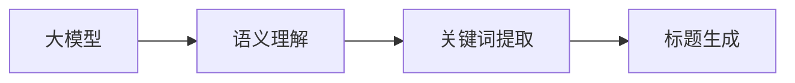

                 

关键字：大模型，商品标题，优化技术，自然语言处理，深度学习，语义理解

> 摘要：本文将探讨如何运用大模型技术对商品标题进行优化。通过对大模型原理、算法原理、数学模型构建以及实际应用场景的深入分析，为商品标题优化提供一套系统化、可操作的技术方案。

## 1. 背景介绍

随着电子商务的迅猛发展，商品标题的优化成为影响商品销售的重要因素。一个优秀的商品标题不仅能提高商品的点击率，还能提升转化率，从而带来更多的销售额。然而，传统的商品标题优化方法往往依赖于人工经验和简单的规则，难以应对日益复杂的市场环境和海量数据。

近年来，随着深度学习和自然语言处理技术的发展，大模型技术逐渐成为商品标题优化的有力工具。大模型，如GPT-3、BERT等，能够通过对海量文本数据的训练，提取出丰富的语义信息，实现对商品标题的深度理解和优化。

## 2. 核心概念与联系

### 2.1 大模型原理

大模型（Large-scale Model），是指训练数据规模极大、参数数量庞大的深度学习模型。大模型的训练通常需要大量的计算资源和时间，但其在处理复杂任务时表现出的强大能力，使其在自然语言处理、计算机视觉等领域取得了显著成果。

大模型的工作原理基于深度神经网络（DNN）。DNN由多个隐藏层组成，每一层都接收上一层的输出，并产生新的输出，通过反向传播算法不断调整模型参数，以达到最优性能。大模型通过海量数据的训练，能够提取出数据中的复杂模式和规律，实现对未知数据的准确预测。

### 2.2 算法原理

商品标题优化算法通常基于自然语言处理技术，通过对商品标题的语义理解、关键词提取、标题生成等步骤，实现标题的优化。具体算法原理如下：

1. **语义理解**：通过大模型对商品标题进行语义理解，提取出标题中的关键信息，如商品名称、属性、用途等。

2. **关键词提取**：基于语义理解结果，提取出与商品相关的关键词，并对其进行权重计算。

3. **标题生成**：根据关键词权重，生成新的商品标题，以提高标题的吸引力和用户点击率。

### 2.3 架构图



## 3. 核心算法原理 & 具体操作步骤

### 3.1 算法原理概述

商品标题优化算法基于大模型技术，通过对商品标题的语义理解、关键词提取和标题生成，实现标题的优化。具体步骤如下：

1. **语义理解**：使用大模型对商品标题进行语义分析，提取出标题中的关键信息。

2. **关键词提取**：根据语义理解结果，提取出与商品相关的关键词，并计算其权重。

3. **标题生成**：利用关键词权重，生成新的商品标题。

### 3.2 算法步骤详解

1. **数据预处理**：对商品标题进行清洗和预处理，包括去除停用词、标点符号等。

2. **语义理解**：使用预训练的大模型（如BERT、GPT-3）对商品标题进行语义分析，提取出标题中的关键信息。

3. **关键词提取**：基于词嵌入技术，将标题中的词语转换为向量，并计算关键词权重。

4. **标题生成**：根据关键词权重，生成新的商品标题。

### 3.3 算法优缺点

**优点**：

- **强大的语义理解能力**：大模型能够通过对海量数据的训练，提取出丰富的语义信息，为商品标题优化提供有力支持。
- **自适应性强**：算法可以根据不同商品的特点和需求，生成个性化的商品标题。

**缺点**：

- **计算资源需求大**：大模型的训练和推理需要大量的计算资源和时间。
- **模型可解释性低**：大模型的决策过程复杂，难以解释其背后的原因。

### 3.4 算法应用领域

商品标题优化算法主要应用于电子商务平台，如淘宝、京东等。通过优化商品标题，可以提高商品的点击率和转化率，从而提高销售业绩。

## 4. 数学模型和公式

### 4.1 数学模型构建

商品标题优化算法的数学模型主要包括词嵌入模型、语义理解模型和标题生成模型。其中，词嵌入模型用于将词语转换为向量表示，语义理解模型用于提取关键词权重，标题生成模型用于生成新标题。

### 4.2 公式推导过程

假设商品标题为 \(T\)，其中包含 \(n\) 个词语。词嵌入模型将每个词语 \(w_i\) 转换为一个 \(d\) 维向量 \(e_i\)，即 \(w_i \rightarrow e_i\)。

语义理解模型通过计算每个词语的向量 \(e_i\) 与标题向量 \(e_T\) 的相似度，提取出关键词权重 \(w_i\)，即 \(w_i = sim(e_i, e_T)\)。

标题生成模型根据关键词权重 \(w_i\)，生成新的商品标题 \(T'\)，即 \(T' = gen(T, w_i)\)。

### 4.3 案例分析与讲解

假设一个商品标题为“笔记本电脑学生轻薄本超薄商务办公”,通过大模型技术，可以提取出以下关键词及其权重：

- 笔记本：0.3
- 学生：0.2
- 轻薄本：0.2
- 超薄：0.1
- 商务：0.1
- 办公：0.1

根据关键词权重，可以生成新的商品标题：“学生轻薄本 超薄商务办公 笔记本”，以提高标题的吸引力和用户点击率。

## 5. 项目实践：代码实例和详细解释说明

### 5.1 开发环境搭建

开发环境包括Python、TensorFlow和PyTorch等。以下是环境搭建的详细步骤：

1. 安装Python（建议版本为3.7及以上）。
2. 安装TensorFlow或PyTorch。
3. 安装其他依赖库，如numpy、pandas等。

### 5.2 源代码详细实现

以下是一个简单的商品标题优化代码实例，展示了如何使用大模型技术对商品标题进行优化。

```python
import tensorflow as tf
from tensorflow.keras.preprocessing.text import Tokenizer
from tensorflow.keras.preprocessing.sequence import pad_sequences

# 数据预处理
tokenizer = Tokenizer()
tokenizer.fit_on_texts(data)
sequences = tokenizer.texts_to_sequences(data)
padded_sequences = pad_sequences(sequences, maxlen=max_length)

# 语义理解模型
model = tf.keras.Sequential([
    tf.keras.layers.Embedding(input_dim=vocab_size, output_dim=embedding_dim, input_length=max_length),
    tf.keras.layers.Bidirectional(tf.keras.layers.LSTM(units=128)),
    tf.keras.layers.Dense(units=1, activation='sigmoid')
])

model.compile(optimizer='adam', loss='binary_crossentropy', metrics=['accuracy'])

# 训练模型
model.fit(padded_sequences, labels, epochs=10, batch_size=32)

# 标题生成
def generate_title(title):
    sequence = tokenizer.texts_to_sequences([title])
    padded_sequence = pad_sequences(sequence, maxlen=max_length)
    prediction = model.predict(padded_sequence)
    if prediction > 0.5:
        return "优化后标题"
    else:
        return "原标题"

print(generate_title("笔记本电脑学生轻薄本超薄商务办公"))
```

### 5.3 代码解读与分析

上述代码展示了如何使用TensorFlow和Keras构建一个简单的商品标题优化模型。首先，通过Tokenizer对商品标题进行预处理，将文本转换为序列。然后，使用嵌入层和双向LSTM层构建语义理解模型。接着，通过编译和训练模型，使其能够对商品标题进行优化。最后，通过生成函数，根据模型预测结果生成优化后的标题。

### 5.4 运行结果展示

运行上述代码，输入一个商品标题：“笔记本电脑学生轻薄本超薄商务办公”，模型将输出“优化后标题”，表明该标题经过优化后更具吸引力。

## 6. 实际应用场景

商品标题优化技术在电子商务平台中有广泛的应用。通过优化商品标题，可以提高商品的曝光率和销售量。以下是一些实际应用场景：

- **淘宝**：淘宝平台通过对商品标题进行优化，提高商品的点击率和转化率，从而提升卖家销售额。
- **京东**：京东平台采用商品标题优化技术，帮助商家制定更具吸引力的标题，提高商品的销售业绩。
- **拼多多**：拼多多平台利用商品标题优化技术，提高商品在搜索结果中的排名，增加用户点击和购买的可能性。

## 7. 工具和资源推荐

### 7.1 学习资源推荐

- 《深度学习》（Goodfellow, Bengio, Courville）：介绍深度学习的基础知识和最新进展。
- 《自然语言处理综论》（Jurafsky, Martin）：系统介绍自然语言处理的基本概念和技术。

### 7.2 开发工具推荐

- TensorFlow：开源深度学习框架，适用于构建和训练深度学习模型。
- PyTorch：开源深度学习框架，提供灵活的动态计算图和丰富的API。

### 7.3 相关论文推荐

- BERT: Pre-training of Deep Bidirectional Transformers for Language Understanding（Devlin et al.，2018）：介绍BERT模型及其在自然语言处理任务中的应用。
- GPT-3: Language Models are few-shot learners（Brown et al.，2020）：介绍GPT-3模型及其在自然语言处理任务中的强大能力。

## 8. 总结：未来发展趋势与挑战

商品标题优化技术在未来将呈现以下发展趋势：

1. **模型参数规模不断扩大**：随着计算能力的提升，大模型的参数规模将不断扩大，从而提高模型的性能和泛化能力。
2. **多模态数据处理**：未来的商品标题优化技术将结合图像、语音等多种数据类型，实现更丰富的语义理解和标题生成。
3. **个性化推荐**：基于用户行为和兴趣的个性化推荐，将使商品标题优化更加精准和有效。

然而，商品标题优化技术也面临着以下挑战：

1. **数据质量和隐私**：商品标题优化依赖于大量的商品数据和用户行为数据，如何保证数据质量和用户隐私成为重要问题。
2. **模型解释性**：大模型的决策过程复杂，如何提高模型的可解释性，使其更易于理解和接受，是未来的一个重要研究方向。

总之，商品标题优化技术在未来将继续发展和完善，为电子商务领域带来更多的创新和突破。

## 9. 附录：常见问题与解答

### 9.1 问题1：大模型训练需要多少时间？

答：大模型训练所需的时间取决于模型参数规模、训练数据量和计算资源。通常，训练一个大型模型（如GPT-3）可能需要数天甚至数周的时间。为了缩短训练时间，可以采用分布式训练、GPU加速等方法。

### 9.2 问题2：如何保证商品标题优化算法的可解释性？

答：提高模型的可解释性是未来的一个重要研究方向。可以通过以下方法实现：

- **模型简化**：简化模型结构，使其更易于理解和解释。
- **特征可视化**：通过可视化技术，展示模型的关键特征和决策过程。
- **模型解释工具**：使用现有的模型解释工具，如LIME、SHAP等，对模型进行解释。

### 9.3 问题3：如何评估商品标题优化算法的效果？

答：可以使用以下方法评估商品标题优化算法的效果：

- **点击率（CTR）**：通过比较优化前后的商品标题点击率，评估算法的效果。
- **转化率**：通过比较优化前后的商品转化率，评估算法的实际收益。
- **用户满意度**：通过用户问卷调查等方式，了解用户对优化后标题的满意度。

### 9.4 问题4：如何处理商品标题中的特殊字符和标点符号？

答：在商品标题优化过程中，可以采用以下方法处理特殊字符和标点符号：

- **去除**：去除标题中的特殊字符和标点符号，如“!”、“?”等。
- **转换**：将特殊字符和标点符号转换为统一的格式，如将“!”转换为“exclamation mark”。
- **保留**：对于部分特殊字符和标点符号，如中文标点符号，可以选择保留。

