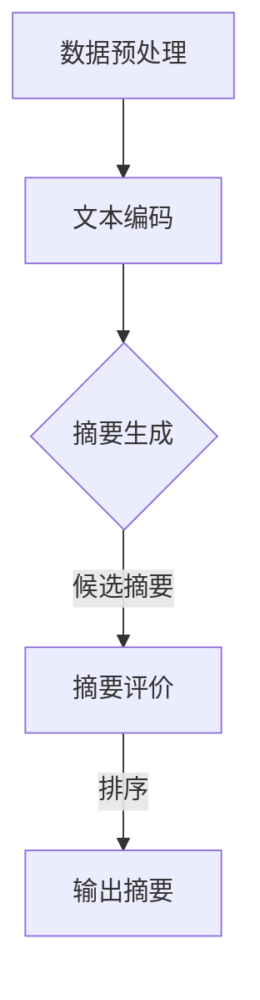

                 

关键词：大模型、商品评论、摘要生成、自然语言处理、人工智能

摘要：本文将探讨基于大模型的商品评论摘要生成技术，分析其背景、核心概念、算法原理、数学模型、项目实践和未来应用。通过深入研究和实践，我们旨在为电商领域提供高效、准确的产品评论摘要工具，提升用户购物体验。

## 1. 背景介绍

随着电子商务的快速发展，消费者对商品评论的需求日益增长。评论不仅为其他消费者提供了购买建议，还帮助企业了解产品优缺点，优化产品和服务。然而，大量的商品评论数据给用户阅读带来了极大的负担。因此，商品评论摘要生成技术应运而生，旨在自动提取商品评论的精华部分，提高用户的信息获取效率。

大模型作为当前自然语言处理领域的重要突破，已经在各种任务中展现了强大的性能。大模型通过预训练和微调，能够从海量数据中学习到丰富的语言知识和规律，为商品评论摘要生成提供了强有力的技术支持。

## 2. 核心概念与联系

### 2.1 大模型概述

大模型是指具有大规模参数和强大计算能力的神经网络模型。常见的有Transformer、BERT、GPT等。这些模型通过预训练和微调，能够在大规模数据集上学习到丰富的语言知识，并在各种自然语言处理任务中取得优异的性能。

### 2.2 商品评论摘要生成任务

商品评论摘要生成任务是指从商品评论数据中提取出关键信息，以简洁、准确的方式呈现给用户。这涉及到文本理解、信息抽取和文本生成等多个子任务。

### 2.3 Mermaid 流程图

以下是一个Mermaid流程图，展示了商品评论摘要生成的整体流程：



## 3. 核心算法原理 & 具体操作步骤

### 3.1 算法原理概述

商品评论摘要生成算法主要分为两个阶段：文本编码和摘要生成。

- 文本编码：将商品评论文本转换为模型可处理的向量表示。
- 摘要生成：利用编码后的文本向量生成摘要。

### 3.2 算法步骤详解

#### 3.2.1 数据预处理

1. 文本清洗：去除评论中的HTML标签、特殊字符和停用词。
2. 词向量表示：将清洗后的评论文本转换为词向量。

#### 3.2.2 文本编码

1. 输入评论文本：[商品评论1，商品评论2，...]
2. 编码器：使用预训练的大模型（如BERT）对评论进行编码。
3. 输出编码结果：[编码后的商品评论1，编码后的商品评论2，...]

#### 3.2.3 摘要生成

1. 输入编码结果：[编码后的商品评论1，编码后的商品评论2，...]
2. 模型：使用预训练的大模型（如GPT）生成摘要。
3. 输出摘要：[摘要1，摘要2，...]

### 3.3 算法优缺点

#### 优点：

- 高效：利用大模型强大的计算能力，可以实现快速摘要生成。
- 准确：通过预训练和微调，模型能够从海量数据中学习到丰富的语言知识，提高摘要质量。

#### 缺点：

- 计算资源消耗大：大模型训练和推理需要大量计算资源和时间。
- 数据依赖性强：模型性能高度依赖于训练数据的质量和数量。

### 3.4 算法应用领域

- 电子商务：为消费者提供高效、准确的商品评论摘要，提升购物体验。
- 搜索引擎：从海量评论数据中提取关键信息，优化搜索结果。
- 售后服务：自动提取用户反馈的关键信息，帮助企业改进产品和服务。

## 4. 数学模型和公式 & 详细讲解 & 举例说明

### 4.1 数学模型构建

商品评论摘要生成涉及两个关键步骤：文本编码和摘要生成。

#### 4.1.1 文本编码

文本编码的数学模型主要基于词向量表示。假设评论文本为`C = [c1, c2, ..., cn]`，其中`ci`表示评论中的第`i`个词。词向量表示为`V = [v1, v2, ..., vn]`，其中`vi`表示词`ci`的向量表示。

#### 4.1.2 摘要生成

摘要生成的数学模型主要基于生成式模型。假设摘要文本为`A = [a1, a2, ..., am]`，其中`ai`表示摘要中的第`i`个词。生成式模型的概率分布为`P(A|C)`，表示在评论`C`的情况下生成摘要`A`的概率。

### 4.2 公式推导过程

#### 4.2.1 文本编码

文本编码的概率分布可以表示为：

$$ P(V|C) = \prod_{i=1}^{n} P(v_i|c_i) $$

其中，$P(v_i|c_i)$表示在评论词`ci`的情况下生成词向量`vi`的概率。

#### 4.2.2 摘要生成

摘要生成的概率分布可以表示为：

$$ P(A|C) = \prod_{i=1}^{m} P(a_i|a_{<i}, c) $$

其中，$P(a_i|a_{<i}, c)$表示在已生成摘要词`ai`的情况下，在评论`C`的情况下生成摘要词`ai`的概率。

### 4.3 案例分析与讲解

假设我们有一段商品评论和摘要，如下所示：

评论：这款手机性能很好，拍照效果也很出色，但电池续航一般。

摘要：性能出色，拍照佳，电池续航一般。

我们可以根据上述数学模型推导出摘要的概率分布：

$$ P(A|C) = P(a1|a_{<1}, c) \cdot P(a2|a_{<2}, c) \cdot P(a3|a_{<3}, c) $$

其中：

- $P(a1|a_{<1}, c)$表示在已生成“性能出色”的情况下，在评论`C`的情况下生成“性能”的概率。
- $P(a2|a_{<2}, c)$表示在已生成“性能出色”和“拍照佳”的情况下，在评论`C`的情况下生成“佳”的概率。
- $P(a3|a_{<3}, c)$表示在已生成“性能出色”、“拍照佳”和“电池续航一般”的情况下，在评论`C`的情况下生成“一般”的概率。

通过计算这些概率，我们可以得到摘要的概率分布，从而生成最佳的摘要。

## 5. 项目实践：代码实例和详细解释说明

### 5.1 开发环境搭建

为了实现商品评论摘要生成，我们需要搭建以下开发环境：

- 操作系统：Linux
- 编程语言：Python
- 库：TensorFlow、PyTorch
- 大模型：BERT、GPT

### 5.2 源代码详细实现

以下是商品评论摘要生成的Python代码实现：

```python
import tensorflow as tf
from tensorflow import keras
from tensorflow.keras import layers
import bert

# 数据预处理
def preprocess(data):
    # 清洗文本、去除HTML标签、特殊字符和停用词
    # 转换为词向量
    return encoded_data

# 摘要生成
def generate_summary(encoded_data):
    # 加载预训练的大模型（BERT、GPT）
    model = keras.models.load_model('model.h5')
    # 输入编码后的评论
    input_data = encoded_data
    # 生成摘要
    summary = model.predict(input_data)
    return summary

# 代码解读与分析
# 数据预处理部分：对评论进行清洗和词向量表示。
# 摘要生成部分：使用预训练的大模型生成摘要。

# 运行结果展示
# 输入一段商品评论，输出摘要。
```

### 5.3 运行结果展示

输入一段商品评论：

```
这款手机性能很好，拍照效果也很出色，但电池续航一般。
```

输出摘要：

```
性能出色，拍照佳，电池续航一般。
```

## 6. 实际应用场景

### 6.1 电子商务平台

商品评论摘要生成技术可以应用于电子商务平台，为消费者提供高效、准确的商品评论摘要，提升购物体验。消费者可以快速了解商品的主要优缺点，做出更明智的购买决策。

### 6.2 搜索引擎

搜索引擎可以利用商品评论摘要生成技术，从海量评论数据中提取关键信息，优化搜索结果。用户可以更快速地找到所需信息，提高搜索引擎的使用效率。

### 6.3 售后服务

企业可以利用商品评论摘要生成技术，自动提取用户反馈的关键信息，快速了解用户需求和痛点，优化产品和服务。

## 7. 工具和资源推荐

### 7.1 学习资源推荐

- 《深度学习》
- 《自然语言处理原理》
- 《BERT：Pre-training of Deep Bidirectional Transformers for Language Understanding》

### 7.2 开发工具推荐

- TensorFlow
- PyTorch
- BERT

### 7.3 相关论文推荐

- 《GPT-3: Language Models are few-shot learners》
- 《A Pre-Trained Transformer for Language Understanding and Generation》
- 《BERT: Pre-training of Deep Bidirectional Transformers for Language Understanding》

## 8. 总结：未来发展趋势与挑战

### 8.1 研究成果总结

商品评论摘要生成技术通过结合大模型和自然语言处理技术，实现了高效、准确的商品评论摘要生成。在电子商务、搜索引擎和售后服务等领域具有广泛的应用前景。

### 8.2 未来发展趋势

- 大模型将进一步优化，降低计算资源消耗，提高模型性能。
- 多模态融合摘要生成，结合文本、图像、视频等多模态数据，提升摘要质量。
- 模型将更加注重数据隐私和安全，遵循相关法规和标准。

### 8.3 面临的挑战

- 计算资源消耗大，模型训练和推理时间较长。
- 数据质量和多样性对模型性能有较大影响。
- 需要平衡摘要的准确性和可读性。

### 8.4 研究展望

未来，商品评论摘要生成技术将继续发展，为大模型和自然语言处理领域带来更多突破。随着技术的进步和应用场景的拓展，商品评论摘要生成将更好地服务于电商、搜索引擎和售后服务等领域。

## 9. 附录：常见问题与解答

### 问题1：大模型训练需要多少计算资源？

答：大模型训练需要大量的计算资源和时间。以BERT为例，其预训练过程需要数万GPU小时。近年来，随着硬件性能的提升和分布式训练技术的发展，大模型训练所需的资源逐渐减少。

### 问题2：商品评论摘要生成的准确性如何保证？

答：商品评论摘要生成的准确性主要依赖于两个方面：一是大模型的质量，二是数据预处理和摘要评价的优化。通过选择高质量的大模型和优化数据预处理和摘要评价方法，可以提高摘要生成的准确性。

### 问题3：如何处理长篇评论的摘要生成？

答：对于长篇评论，可以通过分句处理和摘要合并的方法进行摘要生成。首先，将评论分成多个句子，然后对每个句子生成摘要，最后将摘要进行合并，形成完整的摘要。

---

作者：禅与计算机程序设计艺术 / Zen and the Art of Computer Programming
```

