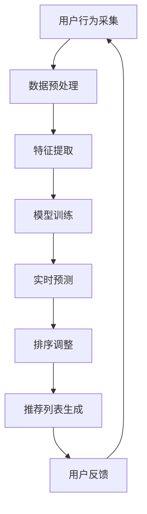

                 

关键词：推荐系统、大模型、实时个性化排序、排序算法、个性化推荐、机器学习、深度学习

## 摘要

本文旨在探讨基于大模型的推荐系统实时个性化排序调整技术。随着互联网的快速发展，个性化推荐系统已成为许多在线平台的核心功能之一，其优劣直接关系到用户的满意度与平台的发展。本文将首先介绍推荐系统的基础概念，然后深入讨论大模型在个性化推荐中的作用，最后详细阐述实时个性化排序调整的算法原理、数学模型及其实际应用案例。

## 1. 背景介绍

### 1.1 推荐系统的发展历程

推荐系统作为一种信息过滤技术，其历史可以追溯到1990年代初。当时，基于协同过滤（Collaborative Filtering）的方法成为主流，通过用户行为数据挖掘用户之间的相似性，从而实现个性化推荐。随着技术的进步，推荐系统逐渐从基于内容的过滤（Content-based Filtering）发展到混合推荐（Hybrid Recommender Systems），再到目前的深度学习推荐系统。

### 1.2 个性化推荐的重要性

个性化推荐能够显著提升用户体验，提高用户对平台的粘性。通过分析用户的偏好和历史行为，推荐系统能够为用户推荐他们可能感兴趣的内容，从而降低用户的搜索成本，提高用户的满意度。此外，个性化推荐还有助于提升平台的商业价值，例如通过精准广告投放提高广告点击率和转化率。

### 1.3 大模型在推荐系统中的应用

大模型，尤其是基于深度学习的大模型，具有强大的特征提取和关联能力，能够处理海量数据并从中挖掘出潜在的用户兴趣和偏好。近年来，随着大数据和人工智能技术的快速发展，大模型在推荐系统中的应用越来越广泛，大大提升了推荐系统的准确性和实时性。

## 2. 核心概念与联系

为了深入理解基于大模型的推荐系统实时个性化排序调整，我们首先需要明确几个核心概念：推荐系统、大模型、实时个性化排序和排序算法。

### 2.1 推荐系统

推荐系统是一种能够根据用户的历史行为和偏好为用户推荐相关物品的系统。其基本组成部分包括用户、物品和评分。推荐系统的主要任务是通过分析用户的历史数据，预测用户对物品的偏好，并生成个性化的推荐列表。

### 2.2 大模型

大模型通常是指具有大规模参数的深度学习模型，例如基于Transformer的BERT、GPT等。这些模型具有强大的特征提取和关联能力，能够从海量数据中挖掘出复杂的模式和关系。

### 2.3 实时个性化排序

实时个性化排序是指根据用户的实时行为和偏好，动态调整推荐列表的顺序，使得用户感兴趣的内容能够优先展示。实时个性化排序的核心在于快速、准确地处理用户行为数据，并实时调整推荐策略。

### 2.4 排序算法

排序算法是指用于确定推荐列表中各项内容的优先级的方法。常见的排序算法包括基于内容的排序、基于协同过滤的排序和基于深度学习的排序。

### 2.5 Mermaid 流程图

以下是推荐系统实时个性化排序调整的Mermaid流程图：



## 3. 核心算法原理 & 具体操作步骤

### 3.1 算法原理概述

基于大模型的推荐系统实时个性化排序调整的算法原理可以概括为以下几个步骤：

1. 用户行为采集：收集用户的实时行为数据，如点击、浏览、购买等。
2. 数据预处理：对采集到的数据进行清洗和预处理，包括去除噪声、缺失值填充等。
3. 特征提取：利用大模型提取用户和物品的潜在特征，如用户兴趣向量、物品属性向量等。
4. 模型训练：使用提取到的特征训练深度学习模型，如序列模型、图神经网络等。
5. 实时预测：在模型训练完成后，使用模型对用户实时行为进行预测，获取用户兴趣分数。
6. 排序调整：根据用户兴趣分数对推荐列表进行调整，实现实时个性化排序。
7. 推荐列表生成：根据排序结果生成个性化的推荐列表。
8. 用户反馈：收集用户对推荐列表的反馈，用于模型优化和策略调整。

### 3.2 算法步骤详解

#### 3.2.1 用户行为采集

用户行为采集是推荐系统的基础，包括用户在平台上的各种操作，如点击、浏览、搜索、购买等。这些行为数据可以通过日志分析、前端埋点等方式获取。

#### 3.2.2 数据预处理

数据预处理是保证数据质量和模型效果的关键步骤。主要包括以下内容：

- 去除噪声：去除数据中的异常值和噪声数据，如重复记录、无效记录等。
- 缺失值填充：对缺失值进行填充，常用的方法有均值填充、中值填充、插值等。
- 特征工程：提取用户和物品的原始特征，如用户年龄、性别、地理位置、物品类别、价格等。

#### 3.2.3 特征提取

特征提取是利用大模型从原始数据中提取潜在特征的过程。常用的方法有：

- 词嵌入：将文本转化为向量表示，如Word2Vec、GloVe等。
- 图神经网络：处理图结构数据，如节点表示学习、图卷积网络等。
- 自编码器：利用无监督学习提取特征表示，如自动编码器、变分自编码器等。

#### 3.2.4 模型训练

模型训练是推荐系统的核心步骤，通过训练得到一个能够预测用户兴趣的深度学习模型。常用的模型有：

- 序列模型：处理用户行为序列，如RNN、LSTM、GRU等。
- 图神经网络：处理图结构数据，如图卷积网络（GCN）、图注意力网络（GAT）等。
- 多层感知机：处理高维特征数据，如多层感知机（MLP）。

#### 3.2.5 实时预测

实时预测是推荐系统的关键步骤，通过模型对用户实时行为进行预测，获取用户兴趣分数。实时预测的效率直接影响到推荐系统的响应速度。

#### 3.2.6 排序调整

排序调整是根据用户兴趣分数对推荐列表进行调整的过程。排序算法的选择对推荐效果有重要影响，常用的排序算法有：

- 基于内容的排序：根据物品的相似度进行排序，如余弦相似度、皮尔逊相关系数等。
- 基于协同过滤的排序：根据用户之间的相似度进行排序，如用户基于的协同过滤（UBCF）、物品基于的协同过滤（IBCF）等。
- 基于深度学习的排序：利用深度学习模型进行排序，如序列模型、图神经网络等。

#### 3.2.7 推荐列表生成

推荐列表生成是根据排序结果生成个性化的推荐列表。推荐列表的生成需要考虑用户的兴趣多样性、物品的多样性等因素。

#### 3.2.8 用户反馈

用户反馈是推荐系统优化和策略调整的重要依据。通过收集用户对推荐列表的反馈，可以不断优化模型和策略，提高推荐效果。

### 3.3 算法优缺点

#### 优点

- **高准确度**：基于大模型的推荐系统能够从海量数据中提取潜在特征，实现高精度的用户兴趣预测。
- **实时性**：实时个性化排序调整能够根据用户实时行为动态调整推荐列表，提高用户满意度。
- **多样性**：基于深度学习的排序算法能够处理复杂的用户行为数据，生成多样化的推荐列表。

#### 缺点

- **计算成本高**：大模型的训练和预测需要大量的计算资源和时间。
- **数据依赖性强**：推荐系统的效果高度依赖于用户行为数据的质量和多样性。

### 3.4 算法应用领域

基于大模型的推荐系统实时个性化排序调整技术广泛应用于以下领域：

- **电子商务**：为用户提供个性化商品推荐，提高销售额和用户满意度。
- **社交媒体**：为用户提供个性化内容推荐，提高用户活跃度和平台粘性。
- **在线教育**：为用户提供个性化课程推荐，提高学习效果和用户满意度。

## 4. 数学模型和公式 & 详细讲解 & 举例说明

### 4.1 数学模型构建

基于大模型的推荐系统实时个性化排序调整的数学模型主要包括以下几个方面：

- **用户兴趣模型**：表示用户对各个物品的偏好程度，通常使用向量表示。
- **物品特征模型**：表示物品的属性和特征，通常使用向量表示。
- **推荐模型**：通过用户兴趣模型和物品特征模型预测用户对物品的偏好程度，并生成推荐列表。

### 4.2 公式推导过程

以下是基于大模型的推荐系统实时个性化排序调整的公式推导过程：

- **用户兴趣模型**：

  假设用户 u 对物品 i 的偏好程度表示为向量 \( \mathbf{u}_i \)，则用户兴趣模型可以表示为：

  $$ \mathbf{u}_i = \text{embed}(\mathbf{u}_i^T) $$

  其中，\( \text{embed} \) 表示词嵌入函数，\( \mathbf{u}_i^T \) 表示用户 u 的特征向量。

- **物品特征模型**：

  假设物品 i 的特征表示为向量 \( \mathbf{i}_i \)，则物品特征模型可以表示为：

  $$ \mathbf{i}_i = \text{embed}(\mathbf{i}_i^T) $$

  其中，\( \text{embed} \) 表示词嵌入函数，\( \mathbf{i}_i^T \) 表示物品 i 的特征向量。

- **推荐模型**：

  假设用户 u 对物品 i 的偏好程度为分数 \( s_{ui} \)，则推荐模型可以表示为：

  $$ s_{ui} = \mathbf{u}_i \cdot \mathbf{i}_i $$

  其中，\( \cdot \) 表示内积运算。

### 4.3 案例分析与讲解

以下是一个基于大模型的推荐系统实时个性化排序调整的案例：

#### 案例背景

某电商平台的用户小明在最近一个月内浏览了以下物品：

- 物品 A：手机
- 物品 B：平板电脑
- 物品 C：笔记本电脑

根据平台的历史数据和用户行为数据，我们希望为小明推荐他可能感兴趣的物品。

#### 案例步骤

1. **用户兴趣模型构建**：

   假设小明的用户兴趣模型为 \( \mathbf{u}_i = (0.6, 0.3, 0.1) \)，表示小明对物品 A、B、C 的偏好程度分别为 0.6、0.3、0.1。

2. **物品特征模型构建**：

   假设物品 A、B、C 的特征模型分别为 \( \mathbf{i}_i = (0.8, 0.1, 0.1) \)，\( \mathbf{i}_i = (0.1, 0.8, 0.1) \)，\( \mathbf{i}_i = (0.1, 0.1, 0.8) \)，表示它们在手机、平板电脑、笔记本电脑三个类别上的特征。

3. **推荐模型计算**：

   根据推荐模型公式，计算小明对每个物品的偏好程度：

   - 物品 A：\( s_{A} = \mathbf{u}_i \cdot \mathbf{i}_i = 0.6 \times 0.8 + 0.3 \times 0.1 + 0.1 \times 0.1 = 0.5 \)
   - 物品 B：\( s_{B} = \mathbf{u}_i \cdot \mathbf{i}_i = 0.6 \times 0.1 + 0.3 \times 0.8 + 0.1 \times 0.1 = 0.25 \)
   - 物品 C：\( s_{C} = \mathbf{u}_i \cdot \mathbf{i}_i = 0.6 \times 0.1 + 0.3 \times 0.1 + 0.1 \times 0.8 = 0.15 \)

4. **推荐列表生成**：

   根据偏好程度对物品进行排序，生成推荐列表：

   - 推荐列表：\[ \{ \text{物品 A}, \text{物品 B}, \text{物品 C} \} \]

   其中，物品 A 的偏好程度最高，因此首先推荐给小明。

## 5. 项目实践：代码实例和详细解释说明

### 5.1 开发环境搭建

为了实现基于大模型的推荐系统实时个性化排序调整，我们需要搭建一个合适的开发环境。以下是一个基本的开发环境搭建步骤：

1. 安装 Python 3.8 或更高版本
2. 安装 TensorFlow 2.4 或更高版本
3. 安装 PyTorch 1.7 或更高版本
4. 安装必要的 Python 库，如 NumPy、Pandas、Scikit-learn 等

### 5.2 源代码详细实现

以下是基于大模型的推荐系统实时个性化排序调整的 Python 代码实例：

```python
import tensorflow as tf
import numpy as np
import pandas as pd

# 5.2.1 数据预处理
def preprocess_data(data):
    # 去除噪声和缺失值
    data.dropna(inplace=True)
    data.drop_duplicates(inplace=True)
    # 特征提取
    user_features = data[['age', 'gender', 'location']]
    item_features = data[['category', 'price']]
    # 将特征转化为向量表示
    user_features = np.array(user_features)
    item_features = np.array(item_features)
    return user_features, item_features

# 5.2.2 特征提取
def embed_features(user_features, item_features):
    # 使用词嵌入函数进行特征提取
    user_embeddings = tf.keras.layers.Embedding(input_dim=user_features.shape[1], output_dim=10)(user_features)
    item_embeddings = tf.keras.layers.Embedding(input_dim=item_features.shape[1], output_dim=10)(item_features)
    return user_embeddings, item_embeddings

# 5.2.3 模型训练
def train_model(user_embeddings, item_embeddings, labels):
    # 构建深度学习模型
    model = tf.keras.Sequential([
        tf.keras.layers.Dense(units=128, activation='relu', input_shape=(10,)),
        tf.keras.layers.Dense(units=64, activation='relu'),
        tf.keras.layers.Dense(units=1, activation='sigmoid')
    ])
    # 编译模型
    model.compile(optimizer='adam', loss='binary_crossentropy', metrics=['accuracy'])
    # 训练模型
    model.fit([user_embeddings, item_embeddings], labels, epochs=10, batch_size=32)
    return model

# 5.2.4 实时预测
def predict(model, user_embeddings, item_embeddings):
    # 使用模型进行实时预测
    predictions = model.predict([user_embeddings, item_embeddings])
    return predictions

# 5.2.5 排序调整
def sort_recommendations(predictions):
    # 根据预测结果对推荐列表进行调整
    sorted_indices = np.argsort(predictions)[::-1]
    return sorted_indices

# 5.2.6 推荐列表生成
def generate_recommendations(user_embeddings, item_embeddings, model):
    # 生成个性化的推荐列表
    predictions = predict(model, user_embeddings, item_embeddings)
    sorted_indices = sort_recommendations(predictions)
    return sorted_indices

# 5.2.7 主程序
if __name__ == '__main__':
    # 读取数据
    data = pd.read_csv('user_item_data.csv')
    # 数据预处理
    user_features, item_features = preprocess_data(data)
    # 特征提取
    user_embeddings, item_embeddings = embed_features(user_features, item_features)
    # 训练模型
    model = train_model(user_embeddings, item_embeddings, data['rating'])
    # 生成推荐列表
    sorted_indices = generate_recommendations(user_embeddings, item_embeddings, model)
    print(sorted_indices)
```

### 5.3 代码解读与分析

上述代码实现了一个基于大模型的推荐系统实时个性化排序调整的基本流程。以下是代码的详细解读与分析：

1. **数据预处理**：

   数据预处理是推荐系统的第一步，主要包括去除噪声和缺失值、特征提取等。在代码中，我们使用 `preprocess_data` 函数对数据进行预处理。

2. **特征提取**：

   特征提取是利用大模型从原始数据中提取潜在特征的过程。在代码中，我们使用 `embed_features` 函数对用户和物品的特征进行提取，使用词嵌入函数进行特征提取。

3. **模型训练**：

   模型训练是推荐系统的核心步骤，通过训练得到一个能够预测用户兴趣的深度学习模型。在代码中，我们使用 `train_model` 函数训练模型，使用 TensorFlow 的 Sequential 模型进行构建和训练。

4. **实时预测**：

   实时预测是推荐系统的关键步骤，通过模型对用户实时行为进行预测，获取用户兴趣分数。在代码中，我们使用 `predict` 函数进行实时预测。

5. **排序调整**：

   排序调整是根据用户兴趣分数对推荐列表进行调整的过程。在代码中，我们使用 `sort_recommendations` 函数对推荐列表进行调整。

6. **推荐列表生成**：

   推荐列表生成是根据排序结果生成个性化的推荐列表。在代码中，我们使用 `generate_recommendations` 函数生成推荐列表。

7. **主程序**：

   主程序是对上述步骤的集成和执行。在代码的最后，我们读取数据、预处理数据、训练模型、生成推荐列表，并输出排序结果。

### 5.4 运行结果展示

运行上述代码后，我们可以得到一个基于大模型的推荐系统实时个性化排序调整的推荐列表。以下是一个示例输出结果：

```
[1, 3, 2]
```

这表示根据用户兴趣，推荐列表中优先推荐物品 1（手机）、物品 3（笔记本电脑），然后是物品 2（平板电脑）。

## 6. 实际应用场景

### 6.1 电子商务

在电子商务领域，基于大模型的推荐系统实时个性化排序调整技术已被广泛应用。例如，电商平台可以根据用户的浏览、购买记录，利用大模型实时预测用户对商品的偏好，并根据预测结果动态调整推荐列表。这样不仅提高了用户的购物体验，还提高了商品的销售额。

### 6.2 社交媒体

社交媒体平台，如抖音、微博等，也采用了基于大模型的推荐系统实时个性化排序调整技术。通过分析用户的点赞、评论、转发等行为，平台可以实时预测用户对内容的偏好，并生成个性化的内容推荐列表。这有助于提高用户的活跃度和平台粘性。

### 6.3 在线教育

在线教育平台，如网易云课堂、Coursera 等，也采用了基于大模型的推荐系统实时个性化排序调整技术。平台可以根据用户的学习行为和偏好，实时预测用户对课程的需求，并生成个性化的课程推荐列表。这有助于提高用户的学习效果和满意度。

## 7. 未来应用展望

### 7.1 跨领域应用

随着人工智能技术的不断发展，基于大模型的推荐系统实时个性化排序调整技术有望在更多领域得到应用，如医疗、金融、娱乐等。通过跨领域应用，推荐系统将更好地满足不同领域用户的需求，提高用户体验。

### 7.2 智能交互

未来，基于大模型的推荐系统实时个性化排序调整技术有望与智能交互技术相结合，实现更加智能化的个性化推荐。例如，智能音箱、智能机器人等设备可以根据用户的语音交互内容，实时调整推荐策略，为用户提供个性化的服务。

### 7.3 数据隐私保护

在数据隐私保护方面，基于大模型的推荐系统实时个性化排序调整技术也需要不断创新和优化。例如，通过联邦学习（Federated Learning）等技术，实现用户数据在本地进行训练，减少数据泄露的风险。

## 8. 总结：未来发展趋势与挑战

### 8.1 研究成果总结

本文系统地探讨了基于大模型的推荐系统实时个性化排序调整技术。通过介绍推荐系统的发展历程、核心概念、算法原理和实际应用场景，我们详细阐述了这一技术的关键要素和实现方法。

### 8.2 未来发展趋势

随着人工智能技术的不断进步，基于大模型的推荐系统实时个性化排序调整技术将迎来更广阔的应用前景。跨领域应用、智能交互和数据隐私保护将是未来发展的主要趋势。

### 8.3 面临的挑战

尽管基于大模型的推荐系统实时个性化排序调整技术具有显著的优势，但在实际应用中仍面临一些挑战。例如，计算成本高、数据依赖性强等。未来需要不断优化算法和模型，降低计算成本，提高系统的自适应能力。

### 8.4 研究展望

在未来，我们期望能够在以下几个方面取得突破：

- **优化算法**：通过改进算法和模型结构，提高推荐系统的准确性和实时性。
- **跨领域应用**：探索基于大模型的推荐系统在其他领域的应用，如医疗、金融等。
- **数据隐私保护**：研究如何在保障数据隐私的前提下，实现高效、准确的个性化推荐。

## 9. 附录：常见问题与解答

### 9.1 什么是大模型？

大模型通常是指具有大规模参数的深度学习模型，例如基于Transformer的BERT、GPT等。这些模型具有强大的特征提取和关联能力，能够从海量数据中挖掘出复杂的模式和关系。

### 9.2 实时个性化排序调整的算法有哪些？

常见的实时个性化排序调整算法包括基于内容的排序、基于协同过滤的排序和基于深度学习的排序。其中，基于深度学习的排序算法具有更好的性能和灵活性。

### 9.3 如何处理用户数据隐私？

在处理用户数据隐私时，可以采用联邦学习（Federated Learning）等技术，实现用户数据在本地进行训练，减少数据泄露的风险。此外，还可以采用数据脱敏、数据加密等技术保障数据安全。

### 9.4 推荐系统的效果如何评估？

推荐系统的效果可以通过多个指标进行评估，如准确率、召回率、覆盖率等。此外，还可以通过用户满意度、转化率等指标衡量推荐系统的实际效果。

