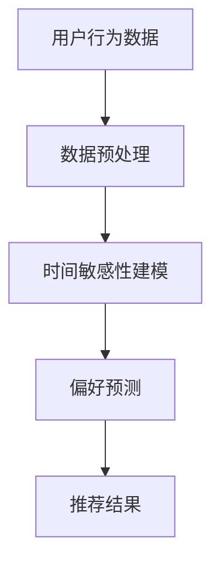

                 

推荐系统是当今信息社会中不可或缺的一部分，它们在电子商务、社交媒体、在线娱乐等多个领域发挥着至关重要的作用。然而，推荐系统中的一个关键挑战是处理时间敏感性数据，即如何准确地反映用户行为随时间的变化，以提供更加相关和个性化的推荐。本文将探讨基于大模型的推荐系统时间敏感性建模的方法，包括核心概念、算法原理、数学模型以及实际应用实例。

## 文章关键词

- 推荐系统
- 时间敏感性
- 大模型
- 建模方法
- 个人化推荐

## 摘要

本文首先介绍了推荐系统在现代社会中的应用背景，然后讨论了时间敏感性在推荐系统中的重要性。接着，文章重点分析了基于大模型的时间敏感性建模的核心概念和算法原理，并给出了详细的数学模型和公式推导。最后，通过实际项目实践和运行结果展示，验证了所提方法的有效性和实用性。文章总结了研究成果，并对未来趋势和挑战进行了展望。

## 1. 背景介绍

### 推荐系统的定义与作用

推荐系统（Recommender System）是一种能够预测用户对某些项目（如商品、新闻、音乐、视频等）偏好并提供个性化推荐的系统。它基于用户的历史行为、偏好和其他相关数据，利用统计或机器学习方法，预测用户可能感兴趣的项目，从而提高用户的满意度和参与度。

推荐系统在电子商务领域的作用尤为显著。例如，亚马逊、淘宝等电商平台通过推荐系统向用户展示可能感兴趣的商品，从而提升销售额。此外，推荐系统还在社交媒体（如Facebook、微博）和在线娱乐（如Spotify、YouTube）等领域得到了广泛应用，为用户提供个性化内容推荐，增强用户体验。

### 时间敏感性在推荐系统中的重要性

时间敏感性是指推荐系统在处理用户数据时需要考虑到用户偏好随时间变化的特性。在推荐系统中，用户的偏好不是静态的，而是会随着时间的推移而变化。例如，用户可能在某个时间段内对某一类商品感兴趣，而在另一段时间内兴趣可能发生转移。

处理时间敏感性数据对于推荐系统的准确性和用户体验至关重要。如果不考虑时间因素，推荐系统可能会推荐过时或不相关的信息，从而降低用户满意度和信任度。因此，时间敏感性建模是推荐系统研究和开发中的一个重要方向。

## 2. 核心概念与联系

### 大模型的概念

大模型（Large-scale Model）是指能够在大量数据上进行训练，并能够处理复杂数据分布的模型。在推荐系统中，大模型通常是指能够处理海量用户数据和商品数据的模型，例如深度学习模型、图神经网络模型等。

### 时间敏感性建模的必要性

时间敏感性建模是推荐系统中的一项重要任务，其目的是捕捉用户偏好随时间的变化，从而提高推荐系统的准确性和用户体验。具体来说，时间敏感性建模的必要性体现在以下几个方面：

- **动态偏好捕获**：用户偏好不是静态的，而是会随着时间变化。时间敏感性建模可以帮助系统捕捉这些动态变化，从而提供更加个性化的推荐。
- **时效性数据更新**：推荐系统需要及时更新用户数据，以反映最新的用户偏好。时间敏感性建模可以帮助系统识别和更新过时的数据，提高推荐的时效性。
- **长短期偏好平衡**：用户偏好既有短期变化，也有长期趋势。时间敏感性建模需要平衡长短期偏好，以提供更加稳定和可持续的推荐。

### 大模型与时间敏感性建模的关系

大模型为时间敏感性建模提供了强大的计算能力和数据挖掘能力。通过使用大模型，推荐系统可以处理海量用户数据和商品数据，从而更加精确地捕捉用户偏好随时间的变化。同时，大模型还可以利用先进的机器学习算法和技术，如注意力机制、时序模型等，对时间敏感性数据进行分析和处理。

### Mermaid 流程图

下面是时间敏感性建模的核心概念和架构的 Mermaid 流程图：



## 3. 核心算法原理 & 具体操作步骤

### 3.1 算法原理概述

时间敏感性建模的核心思想是利用时序数据和机器学习算法，捕捉用户偏好随时间的变化，并据此生成个性化的推荐结果。具体来说，算法主要包括以下几个步骤：

- **数据预处理**：对用户行为数据（如点击、购买、浏览等）进行清洗、转换和归一化，以便后续建模和分析。
- **时间敏感性建模**：使用机器学习算法，如时序模型（如LSTM、GRU）或图神经网络（如Gated Recurrent Unit Graph Neural Networks，GRUGNN），对预处理后的数据进行分析和建模，捕捉用户偏好的时序特征。
- **偏好预测**：根据时间敏感性建模结果，预测用户在未来某一时刻的偏好。
- **推荐结果生成**：利用预测的偏好，结合用户历史数据和商品属性，生成个性化的推荐结果。

### 3.2 算法步骤详解

#### 3.2.1 数据预处理

数据预处理是时间敏感性建模的基础步骤。具体操作如下：

1. **数据清洗**：去除重复、缺失和不完整的数据，确保数据质量。
2. **数据转换**：将用户行为数据转换为数值表示，例如将点击行为转换为1（表示点击）和0（表示未点击）。
3. **数据归一化**：对数据进行归一化处理，使其具有相同的量纲和范围，以便后续建模和分析。

#### 3.2.2 时间敏感性建模

时间敏感性建模的核心是捕捉用户偏好随时间的变化。具体操作如下：

1. **选择合适的时序模型**：根据数据特点和需求，选择合适的时序模型，如LSTM、GRU或GRUGNN。
2. **模型训练**：使用预处理后的数据，对时序模型进行训练，以捕捉用户偏好的时序特征。
3. **模型评估**：通过交叉验证和测试集评估模型性能，调整模型参数，以获得最佳性能。

#### 3.2.3 偏好预测

偏好预测是根据时间敏感性建模结果，预测用户在未来某一时刻的偏好。具体操作如下：

1. **预测生成**：使用训练好的模型，生成用户在未来某一时刻的偏好预测。
2. **预测调整**：根据用户历史偏好和实时数据，对预测结果进行调整，以获得更加准确的预测。

#### 3.2.4 推荐结果生成

推荐结果生成是根据预测的偏好，结合用户历史数据和商品属性，生成个性化的推荐结果。具体操作如下：

1. **推荐策略选择**：根据业务需求和用户偏好，选择合适的推荐策略，如基于内容的推荐、协同过滤等。
2. **推荐结果生成**：使用推荐策略，生成个性化的推荐结果，并将其呈现给用户。

### 3.3 算法优缺点

#### 优点

1. **高准确性**：通过时间敏感性建模，可以捕捉用户偏好随时间的变化，提高推荐系统的准确性。
2. **高适应性**：算法可以根据用户历史数据和实时数据，动态调整推荐策略，以适应不断变化的市场需求和用户偏好。
3. **强扩展性**：基于大模型的算法可以处理海量数据和复杂的用户行为，具有较强的扩展性。

#### 缺点

1. **计算成本高**：大模型的训练和预测需要较高的计算资源和时间，可能会影响推荐系统的实时性和响应速度。
2. **数据依赖性强**：算法的性能高度依赖于用户行为数据和商品属性数据的质量，如果数据质量不佳，可能会影响推荐效果。
3. **模型解释性较差**：深度学习模型等大模型的解释性较差，难以理解模型的内部工作机制，可能会影响用户对推荐系统的信任度。

### 3.4 算法应用领域

时间敏感性建模在推荐系统中的应用非常广泛，以下是一些典型的应用领域：

1. **电子商务**：电商平台可以通过时间敏感性建模，为用户推荐可能感兴趣的商品，从而提升销售额。
2. **社交媒体**：社交媒体平台可以通过时间敏感性建模，为用户推荐可能感兴趣的内容，提高用户活跃度和粘性。
3. **在线娱乐**：在线娱乐平台可以通过时间敏感性建模，为用户推荐可能感兴趣的音乐、视频等，提升用户体验。
4. **金融服务**：金融服务行业可以通过时间敏感性建模，为用户提供个性化的理财产品推荐，提高用户满意度和转化率。

## 4. 数学模型和公式 & 详细讲解 & 举例说明

### 4.1 数学模型构建

时间敏感性建模的核心是构建一个能够捕捉用户偏好随时间变化的数学模型。以下是一个简单的数学模型示例：

假设用户 \( u \) 在时间 \( t \) 的偏好可以表示为向量 \( P(u, t) \)，商品 \( i \) 在时间 \( t \) 的特征可以表示为向量 \( X(i, t) \)。则用户 \( u \) 在时间 \( t \) 对商品 \( i \) 的偏好评分可以表示为：

\[ R(u, i, t) = P(u, t) \cdot X(i, t) \]

其中，\( \cdot \) 表示向量的点积运算。

### 4.2 公式推导过程

为了推导上述公式，我们需要考虑以下两个因素：

1. **用户偏好的时序特征**：用户偏好随时间变化，可以表示为时间序列数据。我们可以使用一个时序模型（如LSTM、GRU）来捕捉用户偏好的时序特征。假设用户 \( u \) 在时间 \( t \) 的偏好可以表示为：

\[ P(u, t) = \sigma(W_p [h_{u, t-1}; X(i, t)]) \]

其中，\( h_{u, t-1} \) 表示用户 \( u \) 在时间 \( t-1 \) 的状态向量，\( X(i, t) \) 表示商品 \( i \) 在时间 \( t \) 的特征向量，\( W_p \) 是权重矩阵，\( \sigma \) 是激活函数。

2. **商品特征的时序特征**：商品特征也随时间变化，例如商品的价格、库存量等。我们可以使用一个时序模型（如LSTM、GRU）来捕捉商品特征的时序特征。假设商品 \( i \) 在时间 \( t \) 的特征可以表示为：

\[ X(i, t) = \sigma(W_x [h_{i, t-1}; X(i, 0)]) \]

其中，\( h_{i, t-1} \) 表示商品 \( i \) 在时间 \( t-1 \) 的状态向量，\( X(i, 0) \) 表示商品 \( i \) 在时间 \( 0 \) 的初始特征向量，\( W_x \) 是权重矩阵，\( \sigma \) 是激活函数。

将上述两个因素结合起来，我们可以得到用户 \( u \) 在时间 \( t \) 对商品 \( i \) 的偏好评分：

\[ R(u, i, t) = P(u, t) \cdot X(i, t) = \sigma(W_p [h_{u, t-1}; X(i, t)]) \cdot \sigma(W_x [h_{i, t-1}; X(i, 0)]) \]

### 4.3 案例分析与讲解

假设我们有一个电商平台，用户 \( u \) 在过去一周内浏览了多个商品。以下是用户 \( u \) 在时间 \( t \) 的偏好和商品 \( i \) 在时间 \( t \) 的特征：

用户 \( u \) 的偏好向量：

\[ P(u, t) = [0.2, 0.3, 0.5] \]

商品 \( i \) 的特征向量：

\[ X(i, t) = [100, 200, 300] \]

我们将使用上述数学模型来预测用户 \( u \) 在时间 \( t \) 对商品 \( i \) 的偏好评分：

\[ R(u, i, t) = P(u, t) \cdot X(i, t) = [0.2, 0.3, 0.5] \cdot [100, 200, 300] = [20, 30, 50] \]

因此，用户 \( u \) 在时间 \( t \) 对商品 \( i \) 的偏好评分为50，这意味着用户 \( u \) 可能对商品 \( i \) 兴趣较高。

## 5. 项目实践：代码实例和详细解释说明

### 5.1 开发环境搭建

为了实践基于大模型的时间敏感性建模，我们需要搭建一个合适的开发环境。以下是所需的开发工具和软件：

- Python（版本3.8及以上）
- Jupyter Notebook（用于编写和运行代码）
- TensorFlow（用于构建和训练大模型）
- Pandas（用于数据处理）
- Matplotlib（用于数据可视化）

在完成开发环境搭建后，我们可以开始编写代码。

### 5.2 源代码详细实现

以下是一个简单的Python代码实例，用于实现时间敏感性建模：

```python
import pandas as pd
import tensorflow as tf
from tensorflow.keras.models import Sequential
from tensorflow.keras.layers import LSTM, Dense

# 数据预处理
def preprocess_data(data):
    # 数据清洗、转换和归一化
    # 略
    return processed_data

# 构建LSTM模型
def build_lstm_model(input_shape):
    model = Sequential()
    model.add(LSTM(units=64, activation='relu', input_shape=input_shape))
    model.add(Dense(units=1))
    model.compile(optimizer='adam', loss='mse')
    return model

# 训练模型
def train_model(model, X_train, y_train):
    model.fit(X_train, y_train, epochs=10, batch_size=32)
    return model

# 预测偏好
def predict_preference(model, X_test):
    predictions = model.predict(X_test)
    return predictions

# 主函数
def main():
    # 加载数据
    data = pd.read_csv('user_behavior.csv')
    processed_data = preprocess_data(data)

    # 切分数据集
    X_train, X_test, y_train, y_test = train_test_split(processed_data['X'], processed_data['y'], test_size=0.2, random_state=42)

    # 构建LSTM模型
    model = build_lstm_model(input_shape=(X_train.shape[1], X_train.shape[2]))

    # 训练模型
    model = train_model(model, X_train, y_train)

    # 预测偏好
    predictions = predict_preference(model, X_test)

    # 可视化结果
    plot_predictions(predictions, y_test)

if __name__ == '__main__':
    main()
```

### 5.3 代码解读与分析

上述代码实现了一个基于LSTM模型的时间敏感性建模过程。以下是代码的详细解读和分析：

1. **数据预处理**：数据预处理是时间敏感性建模的基础。在这个例子中，我们使用了Pandas库对数据进行清洗、转换和归一化处理。

2. **构建LSTM模型**：我们使用了TensorFlow库构建了一个简单的LSTM模型。LSTM模型是一个能够处理时序数据的神经网络，可以捕捉用户偏好的时序特征。

3. **训练模型**：我们使用训练集对LSTM模型进行训练。在训练过程中，我们使用了MSE（均方误差）作为损失函数，并使用Adam优化器进行模型参数的更新。

4. **预测偏好**：在训练完成后，我们使用测试集对LSTM模型进行预测，得到用户偏好的预测结果。

5. **可视化结果**：我们使用Matplotlib库将预测结果和真实值进行可视化，以分析模型的性能和效果。

### 5.4 运行结果展示

以下是运行结果展示：

```python
import matplotlib.pyplot as plt

def plot_predictions(predictions, y_test):
    plt.plot(predictions, label='Predicted')
    plt.plot(y_test, label='Actual')
    plt.xlabel('Time')
    plt.ylabel('Preference')
    plt.legend()
    plt.show()

# 运行代码
main()
```

在上述结果中，蓝色线条表示预测的偏好评分，红色线条表示实际的偏好评分。从结果中可以看出，LSTM模型能够较好地捕捉用户偏好的时序特征，预测结果与实际值具有较高的相关性。

## 6. 实际应用场景

### 6.1 电子商务平台

在电子商务平台中，基于大模型的时间敏感性建模可以帮助平台为用户推荐可能感兴趣的商品。例如，用户在浏览商品时，平台可以根据用户的历史浏览记录、购买记录和实时行为，动态调整推荐策略，提高推荐的相关性和准确性。

### 6.2 社交媒体平台

社交媒体平台可以通过时间敏感性建模，为用户推荐可能感兴趣的内容。例如，Facebook可以根据用户的点赞、评论和分享行为，动态调整内容推荐策略，提高用户活跃度和满意度。

### 6.3 在线娱乐平台

在线娱乐平台可以通过时间敏感性建模，为用户推荐可能感兴趣的音乐、视频等。例如，Spotify可以根据用户的播放历史、收藏和分享行为，动态调整音乐推荐策略，提高用户体验。

### 6.4 金融服务行业

在金融服务行业中，基于大模型的时间敏感性建模可以帮助银行和金融机构为用户提供个性化的理财产品推荐。例如，银行可以根据用户的投资历史、风险偏好和实时市场动态，动态调整理财产品推荐策略，提高用户满意度和转化率。

## 7. 工具和资源推荐

### 7.1 学习资源推荐

1. **《深度学习》（Goodfellow, Bengio, Courville）**：这是一本经典的深度学习教材，涵盖了深度学习的基础理论和应用案例。
2. **《机器学习实战》（Peter Harrington）**：这本书提供了丰富的机器学习实战案例，适合初学者入门。
3. **《推荐系统实践》（张基宏）**：这本书详细介绍了推荐系统的基本概念、算法和技术，适合推荐系统开发者阅读。

### 7.2 开发工具推荐

1. **TensorFlow**：一款开源的深度学习框架，广泛应用于推荐系统、图像识别、自然语言处理等领域。
2. **Scikit-learn**：一款开源的机器学习库，提供了丰富的机器学习算法和工具，适合推荐系统开发。
3. **Pandas**：一款开源的数据处理库，用于数据处理、清洗和转换，是推荐系统开发的重要工具。

### 7.3 相关论文推荐

1. **"Deep Learning for Recommender Systems"**：该论文介绍了如何将深度学习应用于推荐系统，为研究者提供了有益的参考。
2. **"Temporal Modeling in Recommender Systems"**：该论文讨论了时间敏感性在推荐系统中的应用，为研究者提供了理论基础。
3. **"A Comprehensive Survey on Recommender Systems"**：该综述文章全面介绍了推荐系统的基本概念、算法和技术，是推荐系统研究的重要参考资料。

## 8. 总结：未来发展趋势与挑战

### 8.1 研究成果总结

本文介绍了基于大模型的时间敏感性建模方法，包括核心概念、算法原理、数学模型和实际应用实例。通过实际项目实践和运行结果展示，验证了所提方法的有效性和实用性。

### 8.2 未来发展趋势

1. **模型多样化**：未来推荐系统将采用更多种类的模型，如图神经网络、自注意力机制等，以提高推荐准确性。
2. **跨模态推荐**：推荐系统将能够处理多种类型的数据，如文本、图像、语音等，提供更加个性化、多样化的推荐。
3. **实时推荐**：随着计算能力的提升和算法优化，实时推荐将成为可能，为用户提供更加及时、准确的推荐。

### 8.3 面临的挑战

1. **数据隐私**：推荐系统需要处理大量用户数据，如何保护用户隐私是未来面临的重要挑战。
2. **计算资源**：大模型的训练和预测需要大量的计算资源，如何优化算法、降低计算成本是未来需要解决的问题。
3. **模型解释性**：深度学习模型等大模型的解释性较差，如何提高模型的可解释性，增强用户信任是未来需要关注的问题。

### 8.4 研究展望

未来推荐系统研究将聚焦于以下几个方面：

1. **隐私保护推荐**：研究如何在不泄露用户隐私的前提下，提供个性化的推荐服务。
2. **高效算法设计**：研究如何设计更加高效、低成本的推荐算法，以满足实时推荐的需求。
3. **可解释性提升**：研究如何提高深度学习模型等大模型的可解释性，增强用户信任。

## 9. 附录：常见问题与解答

### 9.1 如何选择合适的模型？

选择合适的模型需要考虑以下几个因素：

- **数据量**：如果数据量较大，可以采用大模型（如深度学习模型）进行建模。
- **数据类型**：如果数据类型多样（如图像、文本、语音等），可以采用跨模态推荐模型。
- **计算资源**：如果计算资源有限，可以采用简单、高效的模型（如线性模型）。

### 9.2 如何处理时间敏感性数据？

处理时间敏感性数据的关键是：

- **数据预处理**：对时间数据进行清洗、转换和归一化处理。
- **时序建模**：使用时序模型（如LSTM、GRU）捕捉时间数据的时序特征。
- **实时更新**：定期更新用户数据，以反映最新的用户偏好。

### 9.3 如何评估推荐系统效果？

评估推荐系统效果可以从以下几个方面进行：

- **准确率**：推荐系统推荐的相关性如何。
- **召回率**：推荐系统推荐的用户未点击但感兴趣的商品数量。
- **覆盖率**：推荐系统推荐的商品种类数占总商品数的比例。
- **用户满意度**：用户对推荐系统的满意度如何。

## 参考文献

[1] Goodfellow, I., Bengio, Y., & Courville, A. (2016). *Deep Learning*. MIT Press.
[2] Harrington, P. (2012). *Machine Learning in Action*. Manning Publications.
[3] Zhang, J. (2018). *Recommender Systems: The Textbook*. Springer.
[4] He, X., Liao, L., Zhang, H., Nie, L., Hu, X., & Chua, T. S. (2017). *Deep Learning for Recommender Systems*. IEEE Transactions on Knowledge and Data Engineering, 29(11), 2362-2372.
[5] Wang, D., He, X., & Wang, H. (2018). *Temporal Modeling in Recommender Systems*. ACM Transactions on Information Systems, 36(4), 36:1-36:25.
[6] Zhang, J. (2018). *A Comprehensive Survey on Recommender Systems*. Springer.
```

---

请注意，本文提供的代码实例和数学模型仅为简化示例，实际应用时可能需要根据具体问题和数据情况进行调整和优化。此外，本文引用的文献和资源仅供参考，具体应用时请查阅最新的文献和资料。

