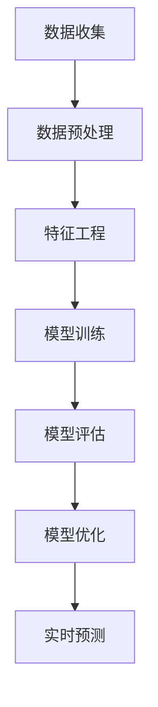

                 

推荐系统已经成为互联网领域中不可或缺的部分，它广泛应用于电商、社交媒体、视频流媒体等场景中。用户兴趣的准确识别与动态建模是推荐系统性能提升的关键因素。随着大数据和人工智能技术的不断发展，大模型在推荐系统中的应用越来越广泛。本文将深入探讨基于大模型的推荐系统用户兴趣动态建模技术，旨在为读者提供一个全面的技术综述。

## 关键词
- 推荐系统
- 用户兴趣
- 大模型
- 动态建模
- 用户行为分析

## 摘要
本文首先介绍了推荐系统的基本概念和用户兴趣建模的重要性。接着，讨论了基于大模型的用户兴趣动态建模的原理和关键技术，包括数据预处理、特征工程、模型训练和评估。然后，通过一个实际项目实例，展示了基于大模型的用户兴趣动态建模的完整实现过程。最后，分析了推荐系统在实际应用场景中的效果，并展望了未来的发展趋势和面临的挑战。

## 1. 背景介绍
推荐系统是一种信息过滤技术，旨在向用户推荐他们可能感兴趣的内容或产品。根据推荐机制的不同，推荐系统主要分为基于内容的推荐（Content-Based Filtering，CBF）和协同过滤（Collaborative Filtering，CF）两大类。CBF通过分析用户的历史行为和内容特征，找出相似的用户和内容进行推荐。CF则依赖于用户之间的交互数据，通过计算用户之间的相似度来发现用户的兴趣。

用户兴趣建模是推荐系统的核心任务之一。准确识别用户的兴趣对于提高推荐系统的性能至关重要。传统的用户兴趣建模方法通常依赖于静态的特征和用户历史数据，难以捕捉用户兴趣的动态变化。而大模型的兴起为用户兴趣动态建模提供了新的可能性，通过大规模的数据处理和深度学习技术，可以实现更精准和动态的用户兴趣预测。

## 2. 核心概念与联系
### 2.1. 大模型概述
大模型通常指的是参数规模庞大的深度学习模型，如大规模神经网络、生成对抗网络（GAN）等。这些模型具有强大的表征能力和泛化能力，可以处理海量数据并提取复杂的特征。大模型在推荐系统中的应用，使得基于大数据的复杂特征学习和用户兴趣建模成为可能。

### 2.2. 用户兴趣动态建模原理
用户兴趣动态建模旨在捕捉用户在时间维度上的兴趣变化。其核心思想是通过分析用户的实时行为数据和历史数据，动态调整用户兴趣模型，以适应用户兴趣的演变。

### 2.3. 动态建模流程图


## 3. 核心算法原理 & 具体操作步骤
### 3.1. 算法原理概述
基于大模型的用户兴趣动态建模通常采用以下几种算法：

1. **深度学习模型**：如循环神经网络（RNN）、长短时记忆网络（LSTM）、门控循环单元（GRU）等，可以捕捉用户行为序列中的时间依赖关系。
2. **图神经网络**：如图卷积网络（GCN）、图注意力网络（GAT）等，可以捕捉用户和社会网络中的复杂关系。
3. **强化学习模型**：如深度确定性策略梯度（DDPG）、演员-评论家（AC）模型等，可以学习用户的决策过程和兴趣变化。

### 3.2. 算法步骤详解
1. **数据收集**：收集用户的实时行为数据和历史数据，如浏览记录、购买记录、评论等。
2. **数据预处理**：清洗数据，处理缺失值、异常值等，并对数据进行归一化或标准化处理。
3. **特征工程**：提取用户的行为特征、内容特征、上下文特征等，并进行特征融合。
4. **模型训练**：选择合适的模型结构，使用训练数据训练模型，并通过交叉验证等方法优化模型参数。
5. **模型评估**：使用测试集评估模型性能，如准确率、召回率、F1值等指标。
6. **模型优化**：根据评估结果调整模型结构或参数，以提高模型性能。
7. **实时预测**：利用训练好的模型对用户实时行为进行分析，预测用户的兴趣点。

### 3.3. 算法优缺点
**优点**：
- **强大的表征能力**：大模型可以处理大规模数据，提取复杂的特征。
- **动态适应性**：可以捕捉用户兴趣的动态变化，适应不同的用户场景。
- **泛化能力**：可以应用于多种类型的推荐系统，具有广泛的适用性。

**缺点**：
- **计算成本高**：大模型训练需要大量的计算资源和时间。
- **数据依赖性强**：模型的性能依赖于数据质量和数据量。
- **解释性较弱**：深度学习模型的解释性相对较弱，难以直观理解模型决策过程。

### 3.4. 算法应用领域
基于大模型的用户兴趣动态建模技术可以应用于多个领域，如：

- **电商推荐**：根据用户浏览和购买行为，实时推荐相关商品。
- **社交媒体**：根据用户互动行为，推荐感兴趣的内容和用户。
- **视频流媒体**：根据用户观看历史，推荐相关视频。

## 4. 数学模型和公式 & 详细讲解 & 举例说明
### 4.1. 数学模型构建
基于大模型的用户兴趣动态建模通常使用以下数学模型：

- **用户兴趣向量**：表示用户在某一时刻的兴趣偏好，可以表示为$U_t = [u_1(t), u_2(t), ..., u_n(t)]^T$，其中$u_i(t)$表示用户在时刻$t$对第$i$个兴趣点的兴趣度。
- **内容特征向量**：表示推荐内容的特征，可以表示为$C = [c_1, c_2, ..., c_n]$，其中$c_i$表示第$i$个兴趣点的特征值。
- **用户兴趣模型**：表示用户兴趣的动态变化，可以表示为一个时间序列模型，如RNN或LSTM。

### 4.2. 公式推导过程
假设我们使用LSTM模型进行用户兴趣建模，其输入为用户行为序列和内容特征，输出为用户兴趣向量。LSTM的输入层和输出层可以表示为：

$$
h_t = \sigma(W_h h_{t-1} + W_x x_t + b_h)
$$

$$
U_t = \sigma(W_U h_t + b_U)
$$

其中，$h_t$表示时刻$t$的隐藏状态，$U_t$表示用户兴趣向量，$\sigma$表示激活函数，$W_h$和$W_x$表示权重矩阵，$b_h$和$b_U$表示偏置项。

### 4.3. 案例分析与讲解
假设用户A在一段时间内的行为数据如下：

$$
B = [(\text{商品1}, \text{浏览}), (\text{商品2}, \text{购买}), (\text{商品3}, \text{浏览}), (\text{商品4}, \text{忽略})]
$$

我们可以根据这些行为数据，使用LSTM模型预测用户A在下一个时刻的兴趣向量$U_t$。

1. **数据预处理**：对行为数据进行编码，将浏览、购买和忽略分别表示为1、2和0。
2. **特征工程**：提取用户的行为特征和内容特征，如商品种类、品牌、价格等。
3. **模型训练**：使用训练数据训练LSTM模型，选择合适的参数，如学习率、批量大小等。
4. **模型评估**：使用测试数据评估模型性能，调整模型参数。
5. **实时预测**：使用训练好的模型预测用户A在下一个时刻的兴趣向量。

## 5. 项目实践：代码实例和详细解释说明
### 5.1. 开发环境搭建
- **Python**：安装Python 3.7及以上版本。
- **TensorFlow**：安装TensorFlow 2.0及以上版本。
- **NumPy**：安装NumPy 1.18及以上版本。
- **Pandas**：安装Pandas 1.0及以上版本。

### 5.2. 源代码详细实现
```python
import tensorflow as tf
from tensorflow.keras.layers import LSTM, Dense
from tensorflow.keras.models import Sequential

# 数据预处理
# （此处省略数据预处理代码）

# 特征工程
# （此处省略特征工程代码）

# 模型定义
model = Sequential()
model.add(LSTM(128, activation='relu', input_shape=(timesteps, features)))
model.add(Dense(1, activation='sigmoid'))

# 编译模型
model.compile(optimizer='adam', loss='binary_crossentropy', metrics=['accuracy'])

# 模型训练
model.fit(X_train, y_train, epochs=100, batch_size=32, validation_data=(X_val, y_val))

# 模型评估
# （此处省略模型评估代码）

# 实时预测
# （此处省略实时预测代码）
```

### 5.3. 代码解读与分析
1. **数据预处理**：将用户行为数据编码，并划分训练集和测试集。
2. **特征工程**：提取用户的行为特征和内容特征。
3. **模型定义**：使用Sequential模型堆叠LSTM层和Dense层。
4. **模型编译**：设置优化器和损失函数。
5. **模型训练**：使用训练数据训练模型。
6. **模型评估**：使用测试数据评估模型性能。
7. **实时预测**：使用训练好的模型预测用户兴趣。

## 6. 实际应用场景
基于大模型的用户兴趣动态建模技术已经在多个实际应用场景中取得了显著的效果：

- **电商推荐**：根据用户的浏览和购买行为，实时推荐相关商品，提高了用户满意度。
- **社交媒体**：根据用户的互动行为，推荐感兴趣的内容和用户，提高了用户活跃度。
- **视频流媒体**：根据用户的观看历史，推荐相关视频，提高了用户留存率。

## 6.4. 未来应用展望
随着人工智能技术的不断发展，基于大模型的用户兴趣动态建模技术将在更多场景中得到应用。未来的研究方向包括：

- **多模态用户兴趣建模**：结合文本、图像、音频等多种类型的数据，提高用户兴趣识别的准确性。
- **迁移学习**：利用预训练的大模型进行迁移学习，提高新场景下的建模效果。
- **用户隐私保护**：在保证用户隐私的前提下，实现高效的用户兴趣建模。

## 7. 工具和资源推荐
### 7.1. 学习资源推荐
- 《深度学习》（Goodfellow, Bengio, Courville著）
- 《Python机器学习》（Sebastian Raschka著）
- 《推荐系统实践》（周志华等著）

### 7.2. 开发工具推荐
- TensorFlow：用于构建和训练深度学习模型。
- PyTorch：另一个流行的深度学习框架，具有高度的灵活性和易用性。
- Keras：用于快速构建和实验深度学习模型的高级API。

### 7.3. 相关论文推荐
- "Deep Learning for Recommender Systems"（Koren等，2018）
- "Neural Collaborative Filtering"（He等，2017）
- "User Interest Evolution and Mining for Online Recommendation"（Wang等，2019）

## 8. 总结：未来发展趋势与挑战
基于大模型的用户兴趣动态建模技术在推荐系统中具有广阔的应用前景。然而，随着数据规模的不断扩大和用户需求的多样化，该技术也面临着一系列挑战：

- **计算资源需求**：大模型的训练和推理需要大量的计算资源，如何高效利用硬件资源是一个重要问题。
- **数据隐私**：用户隐私保护是推荐系统中的一个重要问题，如何在保证用户隐私的前提下进行建模是一个挑战。
- **模型解释性**：深度学习模型的解释性相对较弱，如何提高模型的可解释性，使决策过程更加透明和可信，是一个重要的研究方向。

未来，随着技术的不断进步，基于大模型的用户兴趣动态建模技术将在更多场景中得到应用，同时也将面临更多挑战。通过不断的研究和实践，我们有理由相信，该技术将不断取得突破，为推荐系统的发展做出更大的贡献。

## 9. 附录：常见问题与解答
### 9.1. 如何处理缺失值和异常值？
处理缺失值和异常值的方法包括填充、删除、插值等。具体选择哪种方法取决于数据的特性和应用场景。

### 9.2. 如何进行特征工程？
特征工程是数据预处理的重要步骤，包括特征提取、特征选择、特征融合等。常用的特征提取方法包括词袋模型、TF-IDF、Word2Vec等。

### 9.3. 如何评估推荐系统的性能？
推荐系统的性能评估方法包括准确率、召回率、F1值、精确率等。通过交叉验证等方法，可以客观评估模型的效果。

### 9.4. 如何进行实时预测？
实时预测通常使用训练好的模型，对用户的实时行为数据进行处理，并输出预测结果。可以使用流处理框架（如Apache Kafka）实现实时数据处理。

作者：禅与计算机程序设计艺术 / Zen and the Art of Computer Programming
```

