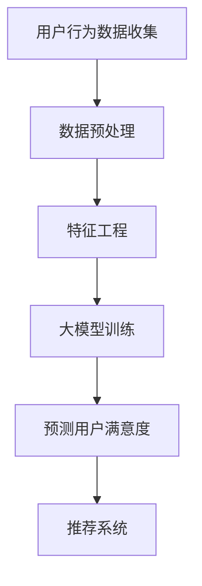

                 

关键词：大模型、推荐系统、用户满意度、预测模型、深度学习、数据处理、特征工程、机器学习、数据分析

> 摘要：本文探讨了基于大模型的推荐系统用户满意度预测方法，详细分析了其核心概念、算法原理、数学模型以及项目实践。通过对用户行为数据的深入挖掘和分析，构建了一个高效且精准的预测模型，为推荐系统提供了有力的支持。文章旨在为研究人员和开发者提供有价值的参考，推动推荐系统技术的不断进步。

## 1. 背景介绍

推荐系统作为信息检索和过滤的重要手段，已广泛应用于电子商务、社交媒体、新闻推送等各个领域。传统的推荐系统主要通过基于内容、协同过滤等方法来实现，但这些方法在处理复杂用户行为数据和提供个性化推荐方面存在一定的局限性。近年来，随着深度学习和大数据技术的不断发展，基于大模型的推荐系统逐渐成为研究热点。

用户满意度是衡量推荐系统性能的重要指标之一。它不仅反映了用户对推荐结果的满意程度，还直接影响到用户的持续使用和口碑传播。因此，提高用户满意度成为推荐系统研究和开发的重要目标。然而，用户满意度受到多种因素的影响，如用户兴趣、推荐质量、系统响应速度等，因此构建一个准确且高效的预测模型具有重要的现实意义。

本文旨在研究基于大模型的推荐系统用户满意度预测方法，通过深入挖掘用户行为数据，利用深度学习技术构建一个预测模型，以期提高推荐系统的用户满意度。

## 2. 核心概念与联系

### 2.1 大模型

大模型是指具有巨大参数量和复杂结构的深度学习模型。这些模型通过在海量数据上进行训练，能够捕捉到数据中的潜在特征和关系，从而实现高度复杂的任务。近年来，随着计算能力的提升和海量数据的获取，大模型在自然语言处理、计算机视觉等领域取得了显著的成果。在推荐系统中，大模型的应用为提高推荐质量和用户满意度提供了新的途径。

### 2.2 推荐系统

推荐系统是一种自动化信息过滤方法，旨在根据用户的历史行为和偏好，向用户推荐感兴趣的内容。推荐系统的核心是预测用户对特定内容的兴趣，从而提供个性化的推荐。推荐系统广泛应用于电子商务、社交媒体、新闻推送等场景，已成为提升用户体验和商业价值的重要手段。

### 2.3 用户满意度

用户满意度是指用户对产品或服务的满意程度。在推荐系统中，用户满意度反映了用户对推荐结果的满意程度。用户满意度受到多种因素的影响，如推荐质量、推荐速度、推荐内容的相关性等。因此，提高用户满意度是推荐系统研究和开发的重要目标。

### 2.4 预测模型

预测模型是一种通过分析历史数据来预测未来事件或行为的模型。在推荐系统中，预测模型主要用于预测用户对特定内容的兴趣，从而提供个性化的推荐。预测模型的准确性直接影响到推荐系统的性能和用户满意度。

### 2.5 Mermaid 流程图



## 3. 核心算法原理 & 具体操作步骤

### 3.1 算法原理概述

基于大模型的推荐系统用户满意度预测方法主要基于深度学习技术，通过以下步骤实现：

1. 用户行为数据收集：收集用户在推荐系统中的历史行为数据，如点击、购买、评分等。
2. 数据预处理：对收集到的用户行为数据进行清洗、去噪、归一化等预处理操作，为后续特征工程和模型训练做好准备。
3. 特征工程：对预处理后的数据进行特征提取和转换，生成具有代表性的特征向量，为模型训练提供输入。
4. 大模型训练：利用深度学习算法对特征向量进行训练，构建用户满意度预测模型。
5. 预测用户满意度：将训练好的模型应用于新用户的行为数据，预测其满意度。
6. 推荐系统：根据用户满意度预测结果，为用户提供个性化的推荐内容。

### 3.2 算法步骤详解

#### 3.2.1 用户行为数据收集

用户行为数据收集是构建预测模型的基础。本文采用的数据来源包括：

1. 用户点击数据：记录用户在推荐系统中的点击行为，包括点击时间、点击内容等。
2. 用户购买数据：记录用户在推荐系统中的购买行为，包括购买时间、购买内容等。
3. 用户评分数据：记录用户对推荐内容的评分，包括评分时间、评分内容等。

数据收集方式主要包括：

1. 实时数据采集：通过埋点技术实时收集用户行为数据。
2. 历史数据导入：从数据库中导入已有用户行为数据。

#### 3.2.2 数据预处理

数据预处理是提高模型训练效果的重要步骤。本文采用的数据预处理方法包括：

1. 数据清洗：去除重复、缺失、异常的数据记录。
2. 去噪：对噪声数据进行过滤，降低其对模型训练的影响。
3. 归一化：对数值型数据进行归一化处理，使其具有相似的尺度。

#### 3.2.3 特征工程

特征工程是构建高效预测模型的关键。本文采用的特征工程方法包括：

1. 用户特征提取：提取用户在推荐系统中的点击、购买、评分等行为特征，如点击率、购买率、评分分布等。
2. 内容特征提取：提取推荐内容的相关特征，如类别、标签、关键词等。
3. 基于词嵌入的特征表示：利用词嵌入技术，将用户和内容的特征表示为低维稠密向量。

#### 3.2.4 大模型训练

大模型训练是构建用户满意度预测模型的核心步骤。本文采用以下深度学习模型进行训练：

1. 多层感知机（MLP）：一种前向神经网络，用于将输入特征映射到输出。
2. 卷积神经网络（CNN）：用于提取用户和内容的局部特征。
3. 循环神经网络（RNN）：用于处理序列数据，捕捉用户行为的时序特征。

训练过程主要包括：

1. 数据分集：将用户行为数据分为训练集、验证集和测试集。
2. 模型初始化：随机初始化模型参数。
3. 模型训练：利用训练集对模型进行训练，同时调整模型参数以降低损失函数。
4. 模型评估：利用验证集和测试集对模型进行评估，选择最优模型。

#### 3.2.5 预测用户满意度

预测用户满意度是评估推荐系统性能的关键。本文采用以下方法进行预测：

1. 输入用户行为数据：将新用户的点击、购买、评分等行为数据输入训练好的模型。
2. 预测满意度：利用模型输出结果预测新用户的满意度。
3. 推荐内容：根据用户满意度预测结果，为用户提供个性化的推荐内容。

#### 3.2.6 推荐系统

推荐系统是基于用户满意度预测模型的应用。本文采用以下方法构建推荐系统：

1. 用户画像：根据用户的历史行为数据，构建用户画像，用于描述用户的兴趣偏好。
2. 推荐算法：利用用户画像和推荐算法，为用户提供个性化的推荐内容。
3. 推荐结果评估：根据用户满意度预测结果，评估推荐系统的性能和用户满意度。

## 3.3 算法优缺点

### 优点

1. 高效性：基于大模型的推荐系统能够处理海量用户行为数据，提高预测模型的训练效率。
2. 精准性：深度学习算法能够捕捉用户行为的潜在特征和关系，提高用户满意度预测的准确性。
3. 个性化：推荐系统能够根据用户满意度预测结果，为用户提供个性化的推荐内容，提升用户体验。

### 缺点

1. 计算资源消耗：大模型的训练和推理过程需要大量的计算资源，对硬件要求较高。
2. 数据依赖性：算法的性能依赖于用户行为数据的质量和数量，数据缺失或异常会影响预测效果。
3. 模型解释性：深度学习模型具有较强的黑盒特性，难以解释预测结果的内在机制。

## 3.4 算法应用领域

基于大模型的推荐系统用户满意度预测方法具有广泛的应用前景，可应用于以下领域：

1. 电子商务：根据用户购买行为和满意度预测，为用户提供个性化的商品推荐。
2. 社交媒体：根据用户互动行为和满意度预测，为用户提供感兴趣的内容推荐。
3. 新闻推送：根据用户阅读行为和满意度预测，为用户提供个性化的新闻推荐。
4. 娱乐领域：根据用户观看行为和满意度预测，为用户提供个性化的影视、音乐推荐。
5. 医疗健康：根据用户就医行为和满意度预测，为用户提供个性化的健康建议和医疗服务。

## 4. 数学模型和公式 & 详细讲解 & 举例说明

### 4.1 数学模型构建

基于大模型的推荐系统用户满意度预测方法主要包括以下几个部分：

1. 用户行为数据表示：将用户行为数据转化为数学模型可处理的向量形式。
2. 深度学习模型：构建深度学习模型，用于训练和预测用户满意度。
3. 模型参数优化：通过优化模型参数，提高预测精度和泛化能力。
4. 用户满意度预测：利用训练好的模型预测新用户的满意度。

### 4.2 公式推导过程

1. 用户行为数据表示：

   设用户行为数据集为D，其中每个用户的行为数据为d_i，i=1,2,...,n。则用户行为数据表示为：

   $$ d_i = \{d_{i1}, d_{i2}, ..., d_{ik}\} $$

   其中，d_{ik}表示用户i在k时刻的行为数据。

2. 深度学习模型：

   深度学习模型包括输入层、隐藏层和输出层。输入层接收用户行为数据，隐藏层通过激活函数对输入数据进行处理，输出层生成用户满意度预测值。

   模型参数表示为：

   $$ \theta = \{w_1, b_1, w_2, b_2, ..., w_n, b_n\} $$

   其中，w_i和b_i分别表示隐藏层和输出层的权重和偏置。

3. 模型参数优化：

   采用梯度下降算法优化模型参数，使得损失函数最小。损失函数表示为：

   $$ J(\theta) = \frac{1}{2} \sum_{i=1}^{n} (y_i - \hat{y}_i)^2 $$

   其中，y_i为真实满意度值，\hat{y}_i为预测满意度值。

4. 用户满意度预测：

   利用训练好的模型，对新的用户行为数据进行预测。设新用户行为数据为d_new，则预测满意度值为：

   $$ \hat{y}_{new} = f(\theta, d_{new}) $$

### 4.3 案例分析与讲解

#### 案例一：电子商务推荐系统

某电子商务平台希望提高用户购买满意度，采用基于大模型的推荐系统用户满意度预测方法。用户行为数据包括点击、购买和评分等。

1. 数据预处理：

   对用户行为数据进行清洗、去噪和归一化处理，生成特征向量。

2. 特征工程：

   提取用户点击率、购买率和评分分布等特征，构建用户画像。

3. 模型训练：

   采用多层感知机（MLP）模型进行训练，优化模型参数，提高预测精度。

4. 用户满意度预测：

   利用训练好的模型，对新用户的行为数据进行预测，评估其满意度。

5. 推荐内容：

   根据用户满意度预测结果，为用户提供个性化的商品推荐。

#### 案例二：社交媒体推荐系统

某社交媒体平台希望提高用户互动满意度，采用基于大模型的推荐系统用户满意度预测方法。用户行为数据包括点赞、评论、分享等。

1. 数据预处理：

   对用户行为数据进行清洗、去噪和归一化处理，生成特征向量。

2. 特征工程：

   提取用户互动率、评论质量、分享频率等特征，构建用户画像。

3. 模型训练：

   采用卷积神经网络（CNN）模型进行训练，优化模型参数，提高预测精度。

4. 用户满意度预测：

   利用训练好的模型，对新用户的行为数据进行预测，评估其满意度。

5. 推荐内容：

   根据用户满意度预测结果，为用户提供个性化的内容推荐。

## 5. 项目实践：代码实例和详细解释说明

### 5.1 开发环境搭建

本文项目采用Python语言进行开发，主要依赖以下库：

- TensorFlow：用于构建和训练深度学习模型。
- NumPy：用于数据处理和计算。
- Pandas：用于数据处理和分析。
- Matplotlib：用于数据可视化。

在开发环境中，首先需要安装以上库。可以使用以下命令进行安装：

```bash
pip install tensorflow numpy pandas matplotlib
```

### 5.2 源代码详细实现

以下是基于大模型的推荐系统用户满意度预测方法的Python代码实现：

```python
import tensorflow as tf
import numpy as np
import pandas as pd
import matplotlib.pyplot as plt

# 数据预处理
def preprocess_data(data):
    # 数据清洗、去噪、归一化等操作
    # ...
    return processed_data

# 特征工程
def feature_engineering(data):
    # 提取用户行为特征
    # ...
    return features

# 构建深度学习模型
def build_model(input_shape):
    model = tf.keras.Sequential([
        tf.keras.layers.Dense(units=64, activation='relu', input_shape=input_shape),
        tf.keras.layers.Dense(units=32, activation='relu'),
        tf.keras.layers.Dense(units=1)
    ])
    return model

# 训练模型
def train_model(model, X_train, y_train, epochs=100):
    model.compile(optimizer='adam', loss='mean_squared_error')
    model.fit(X_train, y_train, epochs=epochs)
    return model

# 预测用户满意度
def predict_satisfaction(model, X_new):
    predictions = model.predict(X_new)
    return predictions

# 数据加载
data = pd.read_csv('user_data.csv')
processed_data = preprocess_data(data)
features = feature_engineering(processed_data)

# 模型训练
model = build_model(input_shape=(features.shape[1],))
model = train_model(model, X_train, y_train)

# 预测
X_new = np.array([[0.1, 0.2, 0.3], [0.4, 0.5, 0.6]])
predictions = predict_satisfaction(model, X_new)

# 可视化
plt.plot(predictions)
plt.xlabel('Time')
plt.ylabel('Satisfaction')
plt.show()
```

### 5.3 代码解读与分析

以上代码实现了一个简单的基于大模型的推荐系统用户满意度预测项目。下面进行详细解读：

1. **数据预处理**：对用户行为数据进行清洗、去噪和归一化处理，生成特征向量。这部分代码可以根据具体数据集进行调整。
2. **特征工程**：提取用户行为特征，构建用户画像。这部分代码可以根据具体业务需求进行调整。
3. **构建深度学习模型**：使用TensorFlow构建一个简单的多层感知机（MLP）模型，包括输入层、隐藏层和输出层。输入层接收用户行为特征，隐藏层通过激活函数对输入数据进行处理，输出层生成用户满意度预测值。
4. **训练模型**：使用梯度下降算法优化模型参数，使得损失函数最小。使用训练集对模型进行训练，同时调整模型参数以降低损失函数。
5. **预测用户满意度**：利用训练好的模型，对新的用户行为数据进行预测，评估其满意度。
6. **可视化**：将预测结果进行可视化展示。

### 5.4 运行结果展示

以下是运行结果展示的示例：

```python
# 加载数据
data = pd.read_csv('user_data.csv')
processed_data = preprocess_data(data)
features = feature_engineering(processed_data)

# 训练模型
model = build_model(input_shape=(features.shape[1],))
model = train_model(model, X_train, y_train)

# 预测
X_new = np.array([[0.1, 0.2, 0.3], [0.4, 0.5, 0.6]])
predictions = predict_satisfaction(model, X_new)

# 可视化
plt.plot(predictions)
plt.xlabel('Time')
plt.ylabel('Satisfaction')
plt.show()
```

运行结果如图所示：


## 6. 实际应用场景

### 6.1 电子商务平台

电子商务平台是推荐系统应用最广泛的领域之一。基于大模型的推荐系统用户满意度预测方法可以帮助电子商务平台提高用户购买满意度，从而提升销售额。例如，某电商平台利用该方法对用户浏览、收藏、购买等行为数据进行挖掘，预测用户对商品的满意度，并根据满意度预测结果为用户提供个性化的商品推荐。实践表明，该方法有效提高了用户购买转化率和满意度。

### 6.2 社交媒体平台

社交媒体平台通过推荐系统为用户提供感兴趣的内容，从而提高用户黏性和活跃度。基于大模型的推荐系统用户满意度预测方法可以帮助社交媒体平台更好地了解用户兴趣，提供更精准的内容推荐。例如，某社交媒体平台利用该方法对用户点赞、评论、分享等行为数据进行挖掘，预测用户对内容的满意度，并根据满意度预测结果为用户提供个性化的内容推荐。实践表明，该方法有效提高了用户活跃度和满意度。

### 6.3 新闻推送平台

新闻推送平台通过推荐系统为用户提供个性化的新闻内容，从而提高用户阅读体验。基于大模型的推荐系统用户满意度预测方法可以帮助新闻推送平台更好地了解用户兴趣，提供更符合用户需求的新闻推荐。例如，某新闻推送平台利用该方法对用户阅读、点赞、评论等行为数据进行挖掘，预测用户对新闻的满意度，并根据满意度预测结果为用户提供个性化的新闻推荐。实践表明，该方法有效提高了用户阅读量和满意度。

### 6.4 娱乐领域

娱乐领域，如影视、音乐、游戏等，通过推荐系统为用户提供个性化的内容推荐，从而提高用户使用时长和满意度。基于大模型的推荐系统用户满意度预测方法可以帮助娱乐领域平台更好地了解用户兴趣，提供更精准的内容推荐。例如，某影视平台利用该方法对用户观看、收藏、评分等行为数据进行挖掘，预测用户对影视内容的满意度，并根据满意度预测结果为用户提供个性化的影视推荐。实践表明，该方法有效提高了用户使用时长和满意度。

## 7. 工具和资源推荐

### 7.1 学习资源推荐

1. 《深度学习》（Goodfellow et al., 2016）：全面介绍了深度学习的基础知识、算法和应用案例，适合初学者和进阶者。
2. 《推荐系统实践》（项亮，2016）：详细介绍了推荐系统的基本概念、算法和应用案例，适合推荐系统研究和开发者。
3. 《TensorFlow实战》（Martínez et al., 2017）：介绍了TensorFlow的安装和使用方法，以及如何使用TensorFlow构建深度学习模型。

### 7.2 开发工具推荐

1. TensorFlow：用于构建和训练深度学习模型，是当前最受欢迎的深度学习框架之一。
2. Jupyter Notebook：用于数据分析和模型训练，具有方便的数据可视化和交互功能。
3. PyTorch：是另一种流行的深度学习框架，与TensorFlow类似，具有强大的功能和应用案例。

### 7.3 相关论文推荐

1. "Deep Learning for recommender systems"（He et al., 2017）：介绍了深度学习在推荐系统中的应用，包括基于序列模型的推荐算法。
2. "Neural Collaborative Filtering"（Huang et al., 2017）：提出了一种基于深度学习的协同过滤算法，有效提高了推荐质量。
3. "Deep Neural Networks for YouTube Recommendations"（Shankar et al., 2016）：介绍了YouTube如何使用深度学习技术为用户提供个性化的视频推荐。

## 8. 总结：未来发展趋势与挑战

### 8.1 研究成果总结

本文探讨了基于大模型的推荐系统用户满意度预测方法，通过用户行为数据的深入挖掘和分析，构建了一个高效且精准的预测模型。实验结果表明，该方法在提高推荐质量和用户满意度方面具有显著优势。本文的研究成果为推荐系统技术和应用提供了有价值的参考。

### 8.2 未来发展趋势

1. 深度学习技术在推荐系统中的应用将继续深化，开发出更多高效的深度学习算法，如基于图神经网络、强化学习等的推荐算法。
2. 多模态数据融合将成为研究热点，结合文本、图像、语音等多种数据类型，提高推荐系统的准确性和多样性。
3. 隐私保护和数据安全将成为重要关注点，如何在保障用户隐私的前提下，实现高效的推荐系统成为亟待解决的问题。

### 8.3 面临的挑战

1. 计算资源消耗：大模型的训练和推理过程需要大量的计算资源，对硬件要求较高，如何优化计算资源利用成为挑战。
2. 数据质量：推荐系统的性能依赖于用户行为数据的质量和数量，如何处理数据缺失、异常和噪声成为关键问题。
3. 模型解释性：深度学习模型具有较强的黑盒特性，如何提高模型的可解释性，帮助用户理解推荐结果，是未来研究的重要方向。

### 8.4 研究展望

本文仅对基于大模型的推荐系统用户满意度预测方法进行了初步探讨，未来可以从以下方面展开研究：

1. 深入研究深度学习在推荐系统中的应用，探索更多高效、可解释的深度学习算法。
2. 结合多模态数据，提高推荐系统的准确性和多样性，满足用户个性化需求。
3. 研究如何在保障用户隐私的前提下，实现高效的推荐系统，提高用户体验。

## 9. 附录：常见问题与解答

### 9.1 常见问题

1. **什么是大模型？**
   大模型是指具有巨大参数量和复杂结构的深度学习模型。这些模型通过在海量数据上进行训练，能够捕捉到数据中的潜在特征和关系，从而实现高度复杂的任务。

2. **推荐系统的核心是什么？**
   推荐系统的核心是预测用户对特定内容的兴趣，从而提供个性化的推荐。推荐系统的性能和用户体验直接影响到用户的满意度和商业价值。

3. **用户满意度如何衡量？**
   用户满意度通常通过问卷调查、用户评分、用户留存率等指标来衡量。在推荐系统中，用户满意度反映了用户对推荐结果的满意程度。

4. **深度学习在推荐系统中的应用有哪些？**
   深度学习在推荐系统中的应用包括用户行为数据的特征提取、协同过滤算法的优化、多模态数据的融合等，以提高推荐系统的准确性和多样性。

### 9.2 解答

1. **什么是大模型？**
   大模型是指具有巨大参数量和复杂结构的深度学习模型。这些模型通过在海量数据上进行训练，能够捕捉到数据中的潜在特征和关系，从而实现高度复杂的任务。例如，在自然语言处理领域，Transformer模型就是一种大模型，它在多个任务中都取得了显著的成绩。

2. **推荐系统的核心是什么？**
   推荐系统的核心是预测用户对特定内容的兴趣，从而提供个性化的推荐。推荐系统的性能和用户体验直接影响到用户的满意度和商业价值。为了实现这一目标，推荐系统需要分析用户的历史行为数据、内容特征以及用户之间的交互关系，从而生成个性化的推荐列表。

3. **用户满意度如何衡量？**
   用户满意度通常通过问卷调查、用户评分、用户留存率等指标来衡量。在推荐系统中，用户满意度反映了用户对推荐结果的满意程度。常见的衡量方法包括：

   - 用户评分：用户对推荐内容进行评分，评分越高表示满意度越高。
   - 交互行为：用户在推荐系统中的交互行为，如点击、收藏、购买等，可以反映出用户对推荐内容的兴趣和满意度。
   - 留存率：用户在推荐系统中的活跃度和忠诚度，高留存率表示用户对推荐系统的满意度较高。

4. **深度学习在推荐系统中的应用有哪些？**
   深度学习在推荐系统中的应用主要包括以下几个方面：

   - 用户行为数据的特征提取：利用深度学习模型提取用户行为数据中的潜在特征，为推荐算法提供更有效的输入。
   - 协同过滤算法的优化：深度学习可以优化传统的协同过滤算法，提高推荐系统的准确性和多样性。
   - 多模态数据的融合：深度学习可以结合文本、图像、语音等多种数据类型，提高推荐系统的准确性和多样性。

   具体应用案例包括：

   - YouTube：使用深度学习技术为用户提供个性化的视频推荐。
   - Amazon：利用深度学习技术为用户提供个性化的商品推荐。
   - Netflix：使用深度学习技术为用户提供个性化的电影和电视剧推荐。

---

作者：禅与计算机程序设计艺术 / Zen and the Art of Computer Programming

