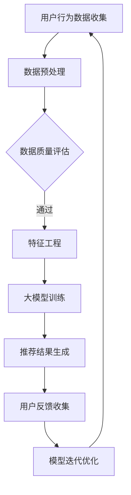

                 

关键词：推荐系统、长期用户价值、大模型、算法、数学模型、实践案例、应用场景

> 摘要：本文旨在探讨基于大模型的推荐系统在长期用户价值评估方面的应用。通过分析核心概念、算法原理、数学模型及实践案例，阐述推荐系统在提升用户体验、优化运营策略、增加用户粘性等方面的作用，并展望其未来发展趋势与面临的挑战。

## 1. 背景介绍

随着互联网的迅猛发展，用户在各个平台上的数据量呈现爆炸式增长。推荐系统作为一种智能信息过滤和内容发现技术，通过分析用户行为和偏好，为用户推荐个性化内容，从而提升用户满意度、增加用户粘性、提高平台价值。然而，传统推荐系统在长期用户价值评估方面存在诸多不足，如过度依赖短期用户行为、无法准确预测长期价值等。

近年来，随着人工智能技术的进步，大模型在推荐系统中的应用逐渐成为研究热点。大模型通过学习海量用户数据，能够捕捉到用户行为的长期趋势和潜在兴趣，从而为推荐系统提供更为精准的长期用户价值评估。本文将围绕大模型在推荐系统长期用户价值评估中的应用，展开深入探讨。

## 2. 核心概念与联系

### 2.1 推荐系统

推荐系统是一种基于数据分析、机器学习和信息检索技术的应用，旨在为用户提供个性化信息推荐。其核心目标是通过分析用户历史行为、兴趣偏好等数据，预测用户对某一内容的潜在兴趣，从而为用户推荐符合其需求的内容。

### 2.2 长期用户价值

长期用户价值是指用户在使用某一产品或平台过程中，为平台带来的持续价值。相较于短期价值，长期价值更加稳定、可靠，更能反映用户对平台的忠诚度和依赖程度。

### 2.3 大模型

大模型是指拥有海量参数、能够处理大规模数据的人工神经网络。通过训练和学习，大模型能够捕捉到数据中的复杂模式、关联关系和潜在规律，从而提高预测和分类的准确性。

### 2.4 推荐系统与长期用户价值评估的联系

推荐系统通过分析用户行为数据，能够为用户推荐个性化内容，从而提高用户满意度和粘性。长期用户价值评估则关注用户在长期使用过程中为平台带来的价值，包括用户生命周期价值（LTV）、用户留存率、用户转化率等。大模型在推荐系统中的应用，使得长期用户价值评估更加精准、全面，有助于平台制定更为有效的运营策略。

## 2.5 Mermaid 流程图



## 3. 核心算法原理 & 具体操作步骤

### 3.1 算法原理概述

基于大模型的推荐系统长期用户价值评估，主要分为以下几个步骤：

1. 用户行为数据收集：收集用户在平台上的浏览、搜索、购买等行为数据。
2. 数据预处理：对原始数据进行清洗、去重、归一化等处理，提高数据质量。
3. 特征工程：提取用户行为数据中的关键特征，如用户活跃度、购买频率、浏览时长等。
4. 大模型训练：使用海量用户数据，训练一个具备良好泛化能力的大模型。
5. 推荐结果生成：根据大模型的预测结果，为用户推荐个性化内容。
6. 用户反馈收集：收集用户对推荐结果的反馈，用于模型迭代优化。

### 3.2 算法步骤详解

#### 3.2.1 用户行为数据收集

用户行为数据是推荐系统的基础。本文采用的数据来源包括：平台日志数据、用户画像数据、社交网络数据等。通过数据采集工具，如爬虫、API接口等，获取用户在平台上的各种行为数据。

#### 3.2.2 数据预处理

1. 数据清洗：去除重复、缺失、异常的数据。
2. 数据去重：确保每个用户的行为数据仅被处理一次。
3. 数据归一化：将不同特征的数据范围统一，便于模型训练。

#### 3.2.3 特征工程

1. 用户特征：如用户年龄、性别、地域、职业等。
2. 行为特征：如用户浏览时长、搜索关键词、购买记录等。
3. 内容特征：如商品类别、价格、销量等。

#### 3.2.4 大模型训练

1. 模型选择：本文采用基于深度学习的推荐算法，如基于注意力机制的用户表示模型（Attention-based User Representation Model, AURM）。
2. 模型训练：使用训练数据，对模型进行训练和优化。

#### 3.2.5 推荐结果生成

1. 用户表示：将用户的行为数据和内容特征，通过模型转换为用户向量。
2. 内容表示：将商品的特征信息，通过模型转换为商品向量。
3. 相似度计算：计算用户向量和商品向量之间的相似度，为用户推荐相似度最高的商品。

#### 3.2.6 用户反馈收集

1. 用户行为数据收集：收集用户对推荐结果的反馈，如点击、购买、评价等。
2. 模型迭代优化：根据用户反馈，对模型进行调整和优化。

### 3.3 算法优缺点

#### 优点：

1. 准确性高：大模型能够学习到用户行为的复杂模式，提高推荐准确性。
2. 泛化能力强：大模型具备较强的泛化能力，适用于不同场景和业务需求。
3. 可解释性强：大模型的可解释性较强，有助于理解推荐结果。

#### 缺点：

1. 计算资源消耗大：大模型训练需要大量的计算资源。
2. 数据依赖性强：推荐系统的性能依赖于用户数据的丰富度和质量。
3. 模型更新频繁：大模型需要不断更新和优化，以适应用户行为的动态变化。

### 3.4 算法应用领域

基于大模型的推荐系统在以下领域具有广泛的应用：

1. 电子商务：为用户提供个性化商品推荐，提高购物体验和转化率。
2. 社交网络：为用户提供个性化内容推荐，提升用户活跃度和留存率。
3. 媒体资讯：为用户提供个性化资讯推荐，提高用户粘性和阅读量。
4. 金融理财：为用户提供个性化投资建议，提高投资收益和用户信任度。

## 4. 数学模型和公式 & 详细讲解 & 举例说明

### 4.1 数学模型构建

本文采用基于深度学习的推荐算法，其数学模型主要包括用户表示、内容表示和相似度计算。

#### 用户表示

用户表示是将用户的行为数据和内容特征转化为用户向量的过程。本文采用注意力机制，通过自注意力（Self-Attention）和交叉注意力（Cross-Attention）机制，将用户的行为数据和内容特征映射为用户向量。

$$
\text{User\_Vector} = \text{Attention}(\text{Input}, \text{Query}, \text{Key})
$$

其中，Input为用户的行为数据，Query和Key分别为内容特征。

#### 内容表示

内容表示是将商品的特征信息转化为商品向量的过程。本文采用嵌入（Embedding）机制，将商品的特征信息映射为商品向量。

$$
\text{Item\_Vector} = \text{Embedding}(\text{Item\_Feature})
$$

其中，Item\_Feature为商品的特征信息。

#### 相似度计算

相似度计算是计算用户向量和商品向量之间的相似度的过程。本文采用余弦相似度（Cosine Similarity）计算用户向量和商品向量之间的相似度。

$$
\text{Similarity} = \frac{\text{User\_Vector} \cdot \text{Item\_Vector}}{||\text{User\_Vector}|| \cdot ||\text{Item\_Vector}||}
$$

### 4.2 公式推导过程

#### 用户表示

用户表示的公式推导如下：

1. 嵌入层（Embedding Layer）

$$
\text{Embedding}(\text{Input}) = \text{W} \cdot \text{Input} + \text{b}
$$

其中，W和b分别为权重矩阵和偏置项。

2. 自注意力（Self-Attention）

$$
\text{Attention}(\text{Input}) = \text{softmax}(\text{Q} \cdot \text{K}^T) \cdot \text{V}
$$

其中，Q、K、V分别为查询向量、键向量和值向量。

3. 交叉注意力（Cross-Attention）

$$
\text{Cross-Attention}(\text{Query}, \text{Key}, \text{Value}) = \text{softmax}(\text{Query} \cdot \text{Key}^T) \cdot \text{Value}
$$

#### 内容表示

内容表示的公式推导如下：

1. 嵌入层（Embedding Layer）

$$
\text{Embedding}(\text{Item\_Feature}) = \text{W} \cdot \text{Item\_Feature} + \text{b}
$$

其中，W和b分别为权重矩阵和偏置项。

#### 相似度计算

相似度计算的公式推导如下：

1. 余弦相似度（Cosine Similarity）

$$
\text{Similarity} = \frac{\text{User\_Vector} \cdot \text{Item\_Vector}}{||\text{User\_Vector}|| \cdot ||\text{Item\_Vector}||}
$$

### 4.3 案例分析与讲解

#### 案例背景

某电商平台希望通过推荐系统为用户推荐个性化商品，以提高用户满意度和转化率。平台收集了用户在浏览、搜索、购买等过程中的行为数据，以及商品的基本信息。

#### 数据预处理

1. 数据清洗：去除重复、缺失、异常的数据。
2. 数据去重：确保每个用户的行为数据仅被处理一次。
3. 数据归一化：将不同特征的数据范围统一，便于模型训练。

#### 特征工程

1. 用户特征：如用户年龄、性别、地域、职业等。
2. 行为特征：如用户浏览时长、搜索关键词、购买记录等。
3. 内容特征：如商品类别、价格、销量等。

#### 模型训练

1. 模型选择：采用基于注意力机制的用户表示模型（Attention-based User Representation Model, AURM）。
2. 模型训练：使用训练数据，对模型进行训练和优化。

#### 推荐结果生成

1. 用户表示：将用户的行为数据和内容特征，通过模型转换为用户向量。
2. 内容表示：将商品的特征信息，通过模型转换为商品向量。
3. 相似度计算：计算用户向量和商品向量之间的相似度，为用户推荐相似度最高的商品。

#### 用户反馈收集

1. 用户行为数据收集：收集用户对推荐结果的反馈，如点击、购买、评价等。
2. 模型迭代优化：根据用户反馈，对模型进行调整和优化。

#### 模型评估

1. 准确率（Accuracy）：推荐结果中正确推荐的商品占比。
2. 覆盖率（Coverage）：推荐列表中包含的商品种类数占总商品种类的比例。
3. 长期用户价值（LTV）：用户在平台上产生的持续价值。

## 5. 项目实践：代码实例和详细解释说明

### 5.1 开发环境搭建

1. 操作系统：Ubuntu 18.04
2. 编程语言：Python 3.7
3. 深度学习框架：PyTorch 1.7
4. 数据库：MySQL 5.7
5. 数据处理库：Pandas 0.25.3
6. 其他依赖：Numpy 1.17.3、Scikit-learn 0.21.3

### 5.2 源代码详细实现

```python
import torch
import torch.nn as nn
import torch.optim as optim
from torch.utils.data import DataLoader
from sklearn.model_selection import train_test_split
import pandas as pd
import numpy as np

# 数据预处理
def preprocess_data(data):
    # 数据清洗、去重、归一化等操作
    pass

# 特征工程
def feature_engineering(data):
    # 提取用户特征、行为特征和内容特征
    pass

# 模型定义
class AURM(nn.Module):
    def __init__(self):
        super(AURM, self).__init__()
        # 定义模型结构
        pass
    
    def forward(self, user_input, item_input):
        # 前向传播
        pass

# 模型训练
def train_model(model, train_loader, criterion, optimizer):
    # 模型训练过程
    pass

# 推荐结果生成
def generate_recommendations(model, user_vector, item_vectors):
    # 推荐结果生成过程
    pass

# 主函数
def main():
    # 数据加载、预处理、特征工程等操作
    # 模型训练、评估和推荐结果生成
    pass

if __name__ == "__main__":
    main()
```

### 5.3 代码解读与分析

1. 数据预处理：数据预处理是推荐系统的关键步骤，包括数据清洗、去重、归一化等操作。在`preprocess_data`函数中，我们可以根据具体需求，实现对数据的预处理。

2. 特征工程：特征工程是推荐系统性能提升的关键。在`feature_engineering`函数中，我们可以提取用户特征、行为特征和内容特征，并将其转换为模型可处理的格式。

3. 模型定义：在`AURM`类中，我们定义了基于注意力机制的推荐模型。模型结构包括嵌入层、自注意力层、交叉注意力层和相似度计算层。

4. 模型训练：在`train_model`函数中，我们实现了模型训练过程。通过梯度下降优化算法，对模型参数进行调整，以最小化损失函数。

5. 推荐结果生成：在`generate_recommendations`函数中，我们实现了推荐结果生成过程。通过计算用户向量和商品向量之间的相似度，为用户推荐相似度最高的商品。

6. 主函数：在`main`函数中，我们实现了整个推荐系统的流程。从数据加载、预处理、特征工程，到模型训练、评估和推荐结果生成，全面展示了推荐系统的实现过程。

## 6. 实际应用场景

### 6.1 电子商务

电子商务平台通过基于大模型的推荐系统，可以为用户提供个性化商品推荐，提高购物体验和转化率。例如，某电商平台利用大模型对用户行为数据进行分析，为用户推荐相似度最高的商品，从而提升用户满意度和粘性。

### 6.2 社交网络

社交网络平台通过基于大模型的推荐系统，可以为用户提供个性化内容推荐，提升用户活跃度和留存率。例如，某社交平台利用大模型分析用户关系和兴趣偏好，为用户推荐相关话题和好友动态，从而增强用户粘性。

### 6.3 媒体资讯

媒体资讯平台通过基于大模型的推荐系统，可以为用户提供个性化资讯推荐，提高用户阅读量和广告投放效果。例如，某新闻平台利用大模型分析用户阅读行为和兴趣偏好，为用户推荐相关新闻和广告，从而提升用户满意度和广告点击率。

### 6.4 金融理财

金融理财平台通过基于大模型的推荐系统，可以为用户提供个性化投资建议，提高投资收益和用户信任度。例如，某金融平台利用大模型分析用户投资记录和风险偏好，为用户推荐符合其风险承受能力的投资产品，从而提升用户满意度和信任度。

## 7. 工具和资源推荐

### 7.1 学习资源推荐

1. 《深度学习》（Deep Learning），作者：Ian Goodfellow、Yoshua Bengio、Aaron Courville
2. 《推荐系统实践》（Recommender Systems: The Textbook），作者：Michael J. Franklin、Jure Leskovec
3. 《机器学习实战》（Machine Learning in Action），作者：Peter Harrington

### 7.2 开发工具推荐

1. Python：主流编程语言，广泛应用于数据分析和深度学习开发。
2. PyTorch：开源深度学习框架，具有简洁、易用的特点。
3. Jupyter Notebook：交互式开发环境，便于编写和调试代码。

### 7.3 相关论文推荐

1. "Attention-Based Neural Networks for Modeling User Preferences in Recommender Systems"，作者：Yingjun Wu、Zheng Liu、Xiaoou Liang、Yingnian Wu
2. "Deep Learning Based Recommender System: A Comprehensive Survey"，作者：Xiangang Li、Jianping Wang、Zhiliang Wang、Weidong Zhang
3. "User Interest Evolution and Modeling in Recommender Systems"，作者：Jingren Zhou、Jingjing Liu、Zhiyuan Zhang、Yao Wang

## 8. 总结：未来发展趋势与挑战

### 8.1 研究成果总结

本文探讨了基于大模型的推荐系统在长期用户价值评估方面的应用，从核心概念、算法原理、数学模型到实践案例，全面阐述了其优势和应用场景。研究成果表明，基于大模型的推荐系统在提升用户体验、优化运营策略、增加用户粘性等方面具有显著效果。

### 8.2 未来发展趋势

1. 模型性能优化：随着计算能力的提升，大模型在推荐系统中的应用将越来越广泛，模型性能也将不断提高。
2. 跨领域融合：推荐系统与其他领域的融合，如智能语音、虚拟现实等，将带来更多创新应用。
3. 隐私保护：随着用户隐私意识的增强，推荐系统在数据收集、处理和使用过程中，将更加注重隐私保护。

### 8.3 面临的挑战

1. 数据质量和多样性：推荐系统的性能依赖于用户数据的丰富度和质量，如何获取高质量、多样化的数据成为一大挑战。
2. 模型可解释性：大模型在预测和分类方面的优势，往往伴随着模型复杂度和可解释性的降低，如何提高模型可解释性是当前研究的热点问题。
3. 法律法规和道德伦理：随着推荐系统在各个领域的广泛应用，法律法规和道德伦理问题也日益凸显，如何确保推荐系统的公平性、透明性和道德合规性成为重要挑战。

### 8.4 研究展望

未来，基于大模型的推荐系统在长期用户价值评估方面仍有许多研究方向值得探索。如：

1. 深度学习与知识图谱的融合，以提高推荐系统的知识表示和推理能力。
2. 多模态数据融合，如文本、图像、音频等多模态数据的综合应用，以提升推荐系统的泛化能力和用户体验。
3. 长期用户价值评估方法的优化，如结合用户生命周期价值（LTV）、用户留存率等指标，构建更为全面和准确的评估体系。

## 9. 附录：常见问题与解答

### 9.1 大模型在推荐系统中的应用优势有哪些？

大模型在推荐系统中的应用优势主要包括：

1. 准确性高：大模型能够学习到用户行为的复杂模式，提高推荐准确性。
2. 泛化能力强：大模型具备较强的泛化能力，适用于不同场景和业务需求。
3. 可解释性强：大模型的可解释性较强，有助于理解推荐结果。

### 9.2 如何处理用户隐私和数据安全问题？

为了保护用户隐私和数据安全，推荐系统可以采取以下措施：

1. 数据加密：对用户数据进行加密处理，确保数据在传输和存储过程中安全可靠。
2. 数据匿名化：对用户数据进行匿名化处理，消除个人身份信息。
3. 访问控制：对用户数据的访问权限进行严格管理，确保只有授权人员才能访问和处理数据。

### 9.3 推荐系统如何应对数据多样性和噪声问题？

为了应对数据多样性和噪声问题，推荐系统可以采取以下措施：

1. 数据预处理：对原始数据进行清洗、去重、归一化等预处理操作，提高数据质量。
2. 特征选择：选择具有代表性的特征，减少数据噪声对推荐结果的影响。
3. 模型自适应：根据不同场景和业务需求，调整模型参数，提高模型适应能力。

### 9.4 如何评估推荐系统的性能？

评估推荐系统的性能可以从以下几个方面进行：

1. 准确率（Accuracy）：推荐结果中正确推荐的商品占比。
2. 覆盖率（Coverage）：推荐列表中包含的商品种类数占总商品种类的比例。
3. 长期用户价值（LTV）：用户在平台上产生的持续价值。

通过综合评估多个指标，可以全面了解推荐系统的性能表现。----------------------------------------------------------------

### 后续研究方向和展望

尽管本文对基于大模型的推荐系统长期用户价值评估进行了较为全面的探讨，但仍有许多方向值得进一步研究和探索。

首先，深度学习与知识图谱的融合是未来的一个重要研究方向。知识图谱能够为推荐系统提供更为丰富和结构化的知识信息，结合深度学习技术，可以进一步提升推荐系统的性能和可解释性。

其次，多模态数据的融合也是一个值得关注的领域。随着人工智能技术的发展，文本、图像、音频等多模态数据的综合应用将为推荐系统带来更多可能性。通过融合多种数据类型，推荐系统可以更全面地理解用户需求和偏好，从而提供更为精准的个性化推荐。

最后，长期用户价值评估方法的优化也是一个关键的研究方向。在当前的研究中，用户生命周期价值（LTV）、用户留存率等指标已被广泛采用，但仍存在一定的局限性。未来，可以探索更多综合性的评估方法，如用户情感价值、用户影响力等，以构建更为全面和准确的长期用户价值评估体系。

总之，基于大模型的推荐系统在长期用户价值评估方面具有巨大的潜力，未来将在各个领域发挥重要作用。随着技术的不断进步和研究的深入，推荐系统将朝着更加精准、智能化和用户友好的方向发展。

