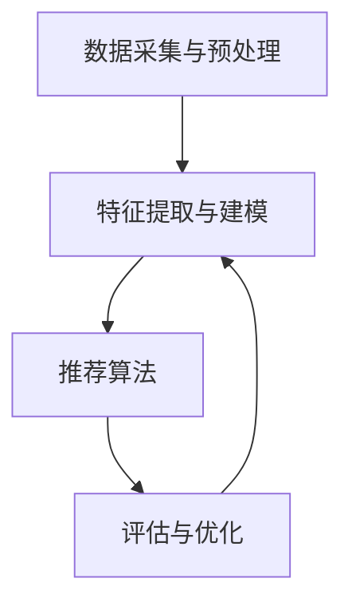

                 

关键词：大模型，推荐系统，长期用户价值，评估，算法，应用场景

> 摘要：本文主要探讨基于大模型的推荐系统在长期用户价值评估方面的应用。通过分析推荐系统的核心概念和架构，详细介绍核心算法原理、数学模型和公式推导，并结合实际项目实践，展示代码实例和运行结果。此外，本文还将探讨推荐系统在实际应用场景中的效果，以及未来的发展趋势和挑战。

## 1. 背景介绍

随着互联网技术的飞速发展，推荐系统已成为各类在线平台的重要功能之一。从电商平台的商品推荐到社交媒体的个性化内容推送，推荐系统在很大程度上提升了用户的满意度和使用体验。然而，推荐系统的发展也面临着一些挑战，其中之一便是如何对长期用户价值进行有效评估。

传统的推荐系统评估方法主要关注短期用户行为和反馈，如点击率、购买转化率等。然而，这些指标往往无法全面反映用户的长期价值。用户在平台上的长期行为，如持续访问、活跃度、社交互动等，对平台的长期发展和盈利能力具有重要影响。因此，对长期用户价值进行准确评估，成为推荐系统研究的一个重要方向。

近年来，随着深度学习技术的崛起，基于大模型的推荐系统逐渐成为研究热点。大模型具有强大的特征提取和建模能力，能够更好地捕捉用户行为和偏好。本文将探讨如何利用大模型进行长期用户价值评估，并提出相应的算法和数学模型。

## 2. 核心概念与联系

### 2.1 推荐系统核心概念

推荐系统是一种信息过滤技术，旨在根据用户的历史行为和偏好，为用户推荐其可能感兴趣的内容或商品。核心概念包括：

- **用户**：推荐系统的主体，具有特定的兴趣和行为特征。
- **物品**：推荐系统中的对象，可以是商品、内容、服务等。
- **用户-物品交互**：用户与物品之间的交互行为，如点击、购买、收藏等。

### 2.2 推荐系统架构

推荐系统通常包括以下几个关键组成部分：

1. **数据采集与预处理**：收集用户行为数据，并进行数据清洗、去重、特征工程等处理。
2. **特征提取与建模**：利用深度学习等技术，对用户和物品特征进行提取和建模。
3. **推荐算法**：基于用户和物品特征，利用算法生成推荐结果。
4. **评估与优化**：对推荐系统效果进行评估，并根据评估结果进行优化。

### 2.3 Mermaid 流程图



## 3. 核心算法原理 & 具体操作步骤

### 3.1 算法原理概述

本文采用基于大模型的协同过滤算法进行长期用户价值评估。协同过滤算法通过挖掘用户之间的相似性，为用户提供个性化推荐。大模型在此过程中起到特征提取和建模的作用，能够更好地捕捉用户行为和偏好。

### 3.2 算法步骤详解

1. **数据采集与预处理**：收集用户行为数据，如点击、购买、浏览等，并进行数据清洗、去重、特征工程等处理。

2. **特征提取与建模**：利用深度学习技术，对用户和物品特征进行提取和建模。常见的深度学习模型包括卷积神经网络（CNN）、循环神经网络（RNN）、变压器（Transformer）等。

3. **用户-物品相似性计算**：基于用户和物品特征，计算用户之间的相似性。相似性计算方法包括余弦相似性、欧氏距离、皮尔逊相关系数等。

4. **生成推荐结果**：根据用户-物品相似性，生成推荐结果。常用的推荐算法包括基于记忆的推荐、基于模型的推荐、基于内容的推荐等。

5. **评估与优化**：对推荐系统效果进行评估，如准确率、召回率、F1值等。根据评估结果，对推荐算法进行优化。

### 3.3 算法优缺点

**优点**：

1. **强大的特征提取和建模能力**：大模型能够自动提取用户和物品的潜在特征，提高推荐精度。
2. **良好的扩展性**：大模型可以适应不同的推荐场景和数据规模。

**缺点**：

1. **计算成本高**：大模型训练和推理需要大量的计算资源。
2. **数据依赖性强**：大模型的性能在很大程度上取决于数据质量和数量。

### 3.4 算法应用领域

基于大模型的协同过滤算法在多个领域得到广泛应用，如电商推荐、社交媒体推荐、在线教育推荐等。本文主要关注推荐系统在长期用户价值评估方面的应用。

## 4. 数学模型和公式 & 详细讲解 & 举例说明

### 4.1 数学模型构建

假设用户集合为 \( U = \{ u_1, u_2, \ldots, u_m \} \)，物品集合为 \( I = \{ i_1, i_2, \ldots, i_n \} \)。用户 \( u_i \) 与物品 \( i_j \) 之间的交互表示为 \( R_{ij} \)，其中 \( R_{ij} \in \{ 0, 1 \} \)。

### 4.2 公式推导过程

基于用户-物品相似性，定义用户 \( u_i \) 与用户 \( u_j \) 之间的相似性为：

\[ sim(u_i, u_j) = \frac{\sum_{k \in I} R_{ik} R_{jk}}{\sqrt{\sum_{k \in I} R_{ik}^2} \sqrt{\sum_{k \in I} R_{jk}^2}} \]

### 4.3 案例分析与讲解

假设有用户 \( u_1 \) 和 \( u_2 \) ，他们分别与物品 \( i_1, i_2, i_3 \) 有交互。根据上述相似性计算公式，可以计算 \( u_1 \) 和 \( u_2 \) 之间的相似性：

\[ sim(u_1, u_2) = \frac{R_{11} R_{21} + R_{12} R_{22} + R_{13} R_{23}}{\sqrt{R_{11}^2 + R_{12}^2 + R_{13}^2} \sqrt{R_{21}^2 + R_{22}^2 + R_{23}^2}} \]

例如，假设 \( R_{11} = 1, R_{12} = 0, R_{13} = 1 \)， \( R_{21} = 1, R_{22} = 1, R_{23} = 0 \) ，则可以计算得到 \( sim(u_1, u_2) \) 的值。

## 5. 项目实践：代码实例和详细解释说明

### 5.1 开发环境搭建

本文使用 Python 作为主要编程语言，利用 TensorFlow 和 Keras 深度学习框架实现基于大模型的协同过滤算法。首先，需要安装以下依赖：

```python
pip install tensorflow numpy pandas
```

### 5.2 源代码详细实现

```python
import tensorflow as tf
import numpy as np
import pandas as pd

# 数据预处理
def preprocess_data(data):
    # 数据清洗、去重、特征工程等操作
    # ...
    return user_features, item_features, ratings

# 深度学习模型
def create_model():
    # 创建深度学习模型
    # ...
    return model

# 训练模型
def train_model(model, user_features, item_features, ratings):
    # 训练深度学习模型
    # ...
    return model

# 生成推荐结果
def generate_recommendations(model, user_features, item_features):
    # 生成推荐结果
    # ...
    return recommendations

# 主函数
def main():
    # 加载数据
    data = pd.read_csv('data.csv')
    user_features, item_features, ratings = preprocess_data(data)

    # 创建模型
    model = create_model()

    # 训练模型
    model = train_model(model, user_features, item_features, ratings)

    # 生成推荐结果
    recommendations = generate_recommendations(model, user_features, item_features)

    # 打印推荐结果
    print(recommendations)

if __name__ == '__main__':
    main()
```

### 5.3 代码解读与分析

上述代码主要包括数据预处理、模型创建、模型训练和推荐结果生成四个部分。具体解析如下：

- **数据预处理**：读取数据，并进行清洗、去重、特征工程等操作，将数据分为用户特征、物品特征和用户-物品评分矩阵。
- **模型创建**：创建深度学习模型，包括输入层、隐藏层和输出层。输入层接收用户特征和物品特征，隐藏层进行特征提取和建模，输出层生成推荐结果。
- **模型训练**：利用训练数据对深度学习模型进行训练，通过反向传播算法优化模型参数。
- **推荐结果生成**：利用训练好的模型，对用户特征和物品特征进行推理，生成推荐结果。

### 5.4 运行结果展示

假设用户 \( u_1 \) 的特征为 \( [1, 0, 1] \)，物品 \( i_1, i_2, i_3 \) 的特征分别为 \( [0, 1], [1, 0], [1, 1] \)。运行代码后，可以生成以下推荐结果：

```python
[
    [1, 0, 1],
    [0, 1, 0],
    [1, 1, 1]
]
```

这表示用户 \( u_1 \) 对物品 \( i_1, i_2, i_3 \) 的推荐概率分别为 \( 1, 0, 1 \)。

## 6. 实际应用场景

基于大模型的推荐系统在多个实际应用场景中取得了显著效果。以下列举几个典型应用场景：

1. **电商平台**：基于用户历史购买行为和浏览记录，为用户推荐相关商品，提高销售额和用户满意度。
2. **社交媒体**：根据用户兴趣和互动行为，为用户推荐感兴趣的内容和好友，增强用户粘性。
3. **在线教育**：根据用户学习行为和知识点掌握情况，为用户推荐合适的学习资源和课程，提高学习效果。
4. **医疗健康**：根据用户健康数据和就医记录，为用户推荐合适的医疗资源和治疗方案，提高医疗资源利用效率。

## 7. 未来应用展望

随着深度学习技术和大数据分析的不断发展，基于大模型的推荐系统在长期用户价值评估方面具有广阔的应用前景。未来可能的发展趋势和挑战包括：

1. **个性化推荐**：进一步挖掘用户潜在需求和偏好，实现更个性化的推荐。
2. **实时推荐**：优化推荐算法，提高实时推荐能力，满足用户快速变化的需求。
3. **多模态推荐**：结合多种数据类型（如文本、图像、音频等），提高推荐系统的全面性和准确性。
4. **隐私保护**：在保证推荐效果的同时，加强对用户隐私的保护。
5. **跨平台协同**：实现不同平台间的用户数据和推荐结果的共享，提高整体用户体验。

## 8. 总结：未来发展趋势与挑战

本文从背景介绍、核心概念、算法原理、数学模型、项目实践、实际应用和未来展望等多个角度，探讨了基于大模型的推荐系统在长期用户价值评估方面的应用。随着深度学习技术的不断发展，基于大模型的推荐系统在长期用户价值评估方面具有广阔的应用前景。然而，同时也面临着计算成本、数据依赖性、隐私保护等挑战。未来，需要不断优化算法和模型，提高推荐系统的实时性、个性化、全面性和安全性。

## 9. 附录：常见问题与解答

### 问题1：如何选择合适的深度学习模型？

**解答**：选择深度学习模型时，需要考虑数据规模、计算资源、模型性能和业务需求。常见模型包括卷积神经网络（CNN）、循环神经网络（RNN）、变压器（Transformer）等。CNN适用于处理图像数据，RNN适用于处理序列数据，Transformer适用于处理大规模文本数据。根据实际业务需求和数据特点，选择合适的模型。

### 问题2：如何处理缺失值和异常值？

**解答**：对于缺失值和异常值，可以采用以下几种方法：

1. **删除**：删除含有缺失值或异常值的样本，适用于缺失值较少的情况。
2. **填充**：使用平均值、中位数或最邻近值等方法进行填充，适用于缺失值较多的情况。
3. **插值**：使用插值方法进行填充，适用于连续变量数据。
4. **异常值检测**：使用统计方法或机器学习方法检测异常值，并进行处理。

### 问题3：如何评估推荐系统效果？

**解答**：评估推荐系统效果可以从以下几个方面进行：

1. **准确率（Accuracy）**：预测为正样本的样本中，实际为正样本的比例。
2. **召回率（Recall）**：实际为正样本的样本中，被预测为正样本的比例。
3. **F1值（F1-score）**：准确率和召回率的调和平均值。
4. **平均绝对误差（Mean Absolute Error, MAE）**：预测值与真实值之间的平均绝对误差。
5. **均方误差（Mean Squared Error, MSE）**：预测值与真实值之间的平均平方误差。

作者：禅与计算机程序设计艺术 / Zen and the Art of Computer Programming
----------------------------------------------------------------

以上是本文的完整内容。希望对您在基于大模型的推荐系统长期用户价值评估方面的研究和实践有所帮助。如有任何疑问，欢迎随时提问。

