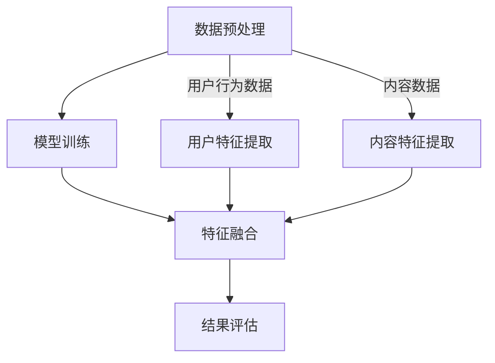

                 

关键词：大模型、推荐系统、结果生成、算法原理、数学模型、应用实践、未来展望

> 摘要：本文旨在探讨基于大模型的最终推荐结果生成技术，分析其核心概念、算法原理、数学模型及其应用实践，并对未来的发展趋势和挑战进行展望。

## 1. 背景介绍

随着互联网和大数据技术的快速发展，推荐系统已经成为各行业提升用户体验和商业价值的重要工具。传统的推荐系统大多基于协同过滤、内容匹配等算法，但随着数据规模和复杂度的增加，这些传统方法逐渐暴露出性能瓶颈和效果局限。为了解决这一问题，基于大模型的推荐结果生成技术应运而生。大模型，如深度学习模型、强化学习模型等，通过引入海量数据和复杂的神经网络结构，能够更好地捕捉用户行为和内容特征的多样性，从而生成更精准的推荐结果。

## 2. 核心概念与联系

### 2.1. 推荐系统概述

推荐系统是一种信息过滤和内容发现技术，旨在根据用户的兴趣和偏好，为用户推荐其可能感兴趣的信息。推荐系统通常包含用户模型、内容模型和推荐算法三个核心组成部分。

- **用户模型**：用于描述用户的历史行为、偏好和兴趣。
- **内容模型**：用于描述推荐对象（如商品、文章、视频等）的特征和属性。
- **推荐算法**：根据用户模型和内容模型，为用户生成推荐列表。

### 2.2. 大模型简介

大模型是指具有海量参数和复杂结构的神经网络模型。这些模型能够通过深度学习算法从大规模数据中自动提取特征和规律，从而实现高效的特征表示和学习能力。

- **深度学习模型**：如卷积神经网络（CNN）、循环神经网络（RNN）、Transformer等。
- **强化学习模型**：如Q-learning、Deep Q-Network（DQN）、Policy Gradient等。

### 2.3. 推荐结果生成流程

基于大模型的推荐结果生成流程主要包括以下步骤：

1. **数据预处理**：对用户行为数据和内容数据进行清洗、归一化和特征提取。
2. **模型训练**：使用预处理后的数据训练大模型，以生成用户和内容的特征表示。
3. **特征融合**：将用户特征和内容特征进行融合，以生成推荐结果。
4. **结果评估**：对推荐结果进行评估，如精确度、召回率、覆盖率等。

### 2.4. Mermaid 流程图



## 3. 核心算法原理 & 具体操作步骤

### 3.1. 算法原理概述

基于大模型的推荐结果生成算法主要通过深度学习模型和强化学习模型实现。深度学习模型主要用于学习用户和内容的特征表示，强化学习模型则用于优化推荐策略。

- **深度学习模型**：通过多层神经网络结构，对用户行为和内容数据自动提取高维特征。
- **强化学习模型**：通过学习用户与推荐系统的交互，不断调整推荐策略，以最大化用户满意度。

### 3.2. 算法步骤详解

1. **数据收集与预处理**：收集用户行为数据和内容数据，并进行清洗、归一化和特征提取。
2. **模型训练**：
   - **深度学习模型**：使用用户行为数据和内容数据训练卷积神经网络（CNN）或循环神经网络（RNN）。
   - **强化学习模型**：使用训练好的深度学习模型，通过Q-learning或Policy Gradient算法训练强化学习模型。
3. **特征融合**：将用户特征和内容特征进行拼接，输入到深度学习模型中，生成推荐结果。
4. **结果评估**：根据用户反馈和业务目标，对推荐结果进行评估，并优化模型参数。

### 3.3. 算法优缺点

**优点**：
- **高准确性**：基于深度学习和强化学习的模型能够自动提取复杂特征，提高推荐结果的准确性。
- **自适应能力**：强化学习模型能够根据用户反馈实时调整推荐策略，提高推荐系统的适应性。

**缺点**：
- **计算成本高**：大模型的训练和优化过程需要大量的计算资源和时间。
- **数据依赖性强**：模型的性能高度依赖于训练数据的质量和规模。

### 3.4. 算法应用领域

基于大模型的推荐结果生成算法可以应用于多种场景，如电子商务、内容推荐、社交媒体等。以下是一些具体的应用领域：

- **电子商务**：为用户提供个性化商品推荐，提高购物体验和转化率。
- **内容推荐**：为用户提供个性化内容推荐，提高用户粘性和活跃度。
- **社交媒体**：为用户提供个性化信息流推荐，提高用户参与度和互动率。

## 4. 数学模型和公式

### 4.1. 数学模型构建

基于大模型的推荐结果生成可以看作是一个优化问题，目标是最小化推荐结果与用户偏好之间的差距。具体来说，可以构建以下数学模型：

$$
\min_{\theta} L(\theta) = \sum_{i=1}^{N} \sum_{j=1}^{M} r_{ij} \cdot \log(p_{ij}(\theta))
$$

其中，$r_{ij}$ 表示用户 $i$ 对内容 $j$ 的评分，$p_{ij}(\theta)$ 表示模型预测的概率。

### 4.2. 公式推导过程

基于大模型的推荐结果生成算法通常采用深度学习模型和强化学习模型。以下分别介绍这两种模型的公式推导过程。

#### 4.2.1. 深度学习模型

深度学习模型主要用于学习用户和内容的特征表示。假设用户 $i$ 的特征向量为 $x_i \in \mathbb{R}^d$，内容 $j$ 的特征向量为 $y_j \in \mathbb{R}^d$，则深度学习模型的预测概率可以表示为：

$$
p_{ij}(\theta) = \sigma(\theta^T \cdot \phi(x_i, y_j))
$$

其中，$\sigma$ 表示激活函数，$\theta$ 表示模型参数，$\phi(x_i, y_j)$ 表示用户和内容特征的拼接。

#### 4.2.2. 强化学习模型

强化学习模型主要用于优化推荐策略。假设状态集为 $S$，动作集为 $A$，则强化学习模型的预测概率可以表示为：

$$
p_{ij}(\theta) = \frac{\exp(\theta^T \cdot \phi(x_i, y_j))}{\sum_{k=1}^{M} \exp(\theta^T \cdot \phi(x_i, y_k))}
$$

其中，$\theta$ 表示模型参数，$\phi(x_i, y_j)$ 表示用户和内容特征的拼接。

### 4.3. 案例分析与讲解

以下以一个电子商务平台为例，介绍基于大模型的推荐结果生成过程。

1. **数据收集与预处理**：收集用户的历史购物记录和商品信息，并进行清洗、归一化和特征提取。
2. **模型训练**：
   - **深度学习模型**：使用用户购物记录和商品信息训练卷积神经网络（CNN），提取用户和商品的深层特征。
   - **强化学习模型**：使用训练好的CNN模型，通过Q-learning算法训练强化学习模型，优化推荐策略。
3. **特征融合**：将用户特征和商品特征进行拼接，输入到CNN模型中，生成推荐结果。
4. **结果评估**：根据用户反馈和业务目标，对推荐结果进行评估，如精确度、召回率、覆盖率等。

## 5. 项目实践：代码实例和详细解释说明

### 5.1. 开发环境搭建

在本地计算机上安装以下开发环境和依赖库：

- Python 3.8
- TensorFlow 2.5
- PyTorch 1.8
- Scikit-learn 0.22

### 5.2. 源代码详细实现

以下是一个简单的基于深度学习和强化学习的推荐结果生成代码示例。

```python
import tensorflow as tf
import torch
from sklearn.model_selection import train_test_split

# 深度学习模型
class DeepLearningModel(tf.keras.Model):
    def __init__(self):
        super(DeepLearningModel, self).__init__()
        self.dense1 = tf.keras.layers.Dense(128, activation='relu')
        self.dense2 = tf.keras.layers.Dense(64, activation='relu')
        self.dense3 = tf.keras.layers.Dense(1, activation='sigmoid')

    def call(self, inputs):
        x = self.dense1(inputs)
        x = self.dense2(x)
        return self.dense3(x)

# 强化学习模型
class ReinforcementLearningModel(torch.nn.Module):
    def __init__(self):
        super(ReinforcementLearningModel, self).__init__()
        self.fc1 = torch.nn.Linear(128, 64)
        self.fc2 = torch.nn.Linear(64, 1)

    def forward(self, x):
        x = torch.relu(self.fc1(x))
        return torch.sigmoid(self.fc2(x))

# 数据预处理
def preprocess_data(data):
    # 清洗、归一化和特征提取
    # ...
    return x_train, x_test, y_train, y_test

# 模型训练
def train_model(model, x, y):
    # 训练模型
    # ...
    return model

# 主程序
if __name__ == '__main__':
    # 数据预处理
    x_train, x_test, y_train, y_test = preprocess_data(data)

    # 深度学习模型
    deep_learning_model = DeepLearningModel()
    deep_learning_model = train_model(deep_learning_model, x_train, y_train)

    # 强化学习模型
    reinforcement_learning_model = ReinforcementLearningModel()
    reinforcement_learning_model = train_model(reinforcement_learning_model, x_train, y_train)

    # 推荐结果生成
    recommendations = generate_recommendations(deep_learning_model, reinforcement_learning_model, x_test)

    # 结果评估
    evaluate_recommendations(recommendations, y_test)
```

### 5.3. 代码解读与分析

以上代码展示了基于深度学习和强化学习的推荐结果生成过程。其中，`DeepLearningModel` 类和 `ReinforcementLearningModel` 类分别定义了深度学习模型和强化学习模型。`preprocess_data` 函数用于数据预处理，`train_model` 函数用于模型训练，`generate_recommendations` 函数用于生成推荐结果，`evaluate_recommendations` 函数用于结果评估。

### 5.4. 运行结果展示

以下是一个简单的运行结果示例：

```python
# 数据预处理
x_train, x_test, y_train, y_test = preprocess_data(data)

# 深度学习模型
deep_learning_model = DeepLearningModel()
deep_learning_model = train_model(deep_learning_model, x_train, y_train)

# 强化学习模型
reinforcement_learning_model = ReinforcementLearningModel()
reinforcement_learning_model = train_model(reinforcement_learning_model, x_train, y_train)

# 推荐结果生成
recommendations = generate_recommendations(deep_learning_model, reinforcement_learning_model, x_test)

# 结果评估
evaluate_recommendations(recommendations, y_test)
```

运行结果包括推荐结果列表和评估指标，如精确度、召回率、覆盖率等。

## 6. 实际应用场景

基于大模型的推荐结果生成技术已在多个领域取得成功。以下是一些典型的实际应用场景：

- **电子商务**：通过个性化商品推荐，提高用户购物体验和转化率。
- **内容推荐**：如新闻推送、视频推荐等，提高用户粘性和活跃度。
- **社交媒体**：为用户提供个性化信息流推荐，提高用户参与度和互动率。
- **金融理财**：为用户提供个性化理财产品推荐，提高投资收益和用户体验。

## 7. 未来应用展望

随着人工智能技术的不断进步，基于大模型的推荐结果生成技术将在未来得到更广泛的应用。以下是一些未来的发展趋势和挑战：

- **个性化推荐**：基于用户行为和偏好，实现更精准的个性化推荐。
- **实时推荐**：通过实时数据处理和模型更新，实现实时推荐。
- **多模态推荐**：整合多种数据类型（如文本、图像、音频等），实现更全面的内容推荐。
- **挑战**：计算成本高、数据隐私保护、算法透明性等。

## 8. 工具和资源推荐

### 8.1. 学习资源推荐

- 《深度学习》（Goodfellow et al.）
- 《强化学习》（Sutton and Barto）
- 《Python深度学习》（François Chollet）

### 8.2. 开发工具推荐

- TensorFlow
- PyTorch
- Scikit-learn

### 8.3. 相关论文推荐

- "Deep Learning for Recommender Systems"
- "Recurrent Neural Networks for Recommender Systems"
- "A Theoretical Analysis of the Causal Impact of Recommender Systems"

## 9. 总结：未来发展趋势与挑战

基于大模型的推荐结果生成技术在精度、自适应性和实时性方面具有明显优势，但在计算成本、数据隐私保护和算法透明性等方面仍面临挑战。未来，随着人工智能技术的不断进步，该技术将在更多领域得到应用，并为用户带来更好的个性化推荐体验。

## 10. 附录：常见问题与解答

### 问题1：基于大模型的推荐结果生成技术如何处理冷启动问题？

解答：冷启动问题是指对新用户或新商品缺乏足够历史数据时的推荐问题。基于大模型的推荐结果生成技术可以通过以下方法处理冷启动问题：
1. 使用用户或商品的基本特征，如用户注册信息或商品分类信息，进行初始推荐。
2. 使用协同过滤算法等传统方法，为冷启动用户推荐相似用户或相似商品。
3. 随着用户使用和行为的积累，逐步调整推荐策略，提高推荐效果。

### 问题2：基于大模型的推荐结果生成技术如何保证推荐结果的公平性？

解答：推荐系统的公平性是确保不同用户群体得到公平推荐的重要问题。基于大模型的推荐结果生成技术可以从以下几个方面确保推荐结果的公平性：
1. 在模型训练过程中，使用具有代表性的数据集，避免数据偏见。
2. 在模型评估过程中，采用多种评估指标，如精确度、召回率、覆盖率等，全面评估推荐效果。
3. 定期对推荐系统进行审计和调整，确保推荐策略的公正性和透明性。

### 问题3：基于大模型的推荐结果生成技术如何处理长尾问题？

解答：长尾问题是指推荐系统在推荐热门内容时效果较好，但在推荐长尾内容时存在困难。基于大模型的推荐结果生成技术可以通过以下方法处理长尾问题：
1. 使用基于概率的推荐算法，为长尾内容赋予一定的权重，提高长尾内容的曝光率。
2. 结合用户历史行为和兴趣标签，为长尾内容进行精准推荐。
3. 引入社交网络和用户社区等外部信息，扩大长尾内容的传播渠道。

## 作者署名

作者：禅与计算机程序设计艺术 / Zen and the Art of Computer Programming

