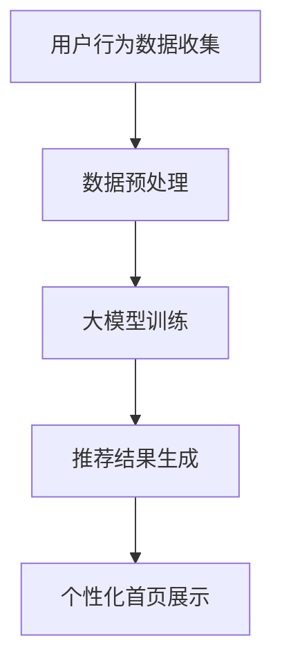

                 

随着电子商务的快速发展，用户对电商平台首页的个性化需求越来越高。传统的电商平台首页设计往往依赖于简单的算法和用户行为数据，难以提供高度个性化的用户体验。为了解决这一问题，本文将探讨如何使用大模型构建电商平台个性化首页。

## 文章关键词

- 电商平台
- 个性化首页
- 大模型
- 机器学习
- 用户行为分析

## 文章摘要

本文首先介绍了电商平台个性化首页的背景和重要性，然后详细阐述了基于大模型的个性化首页构建方法，包括核心概念、算法原理、数学模型、项目实践以及实际应用场景。通过本文的讨论，读者可以了解到如何利用先进的大模型技术提升电商平台首页的用户体验。

## 1. 背景介绍

### 1.1 电商平台的发展

电子商务作为数字经济的重要组成部分，近年来呈现出迅猛发展的态势。随着互联网技术的不断进步和智能手机的普及，越来越多的消费者选择在线购物。电商平台为了吸引和留住用户，不断提升服务质量和用户体验。

### 1.2 个性化首页的需求

传统的电商平台首页设计往往注重产品展示和促销活动，但缺乏对用户个性化需求的关注。随着用户对个性化服务的需求日益增加，电商平台开始探索如何通过个性化首页来提升用户满意度和忠诚度。

### 1.3 大模型的应用

大模型，尤其是基于深度学习的模型，近年来在图像识别、自然语言处理、推荐系统等领域取得了显著成果。大模型通过海量数据的学习，能够捕捉到用户的复杂行为模式和偏好，为个性化服务提供了强有力的技术支持。

## 2. 核心概念与联系

在构建个性化首页时，我们需要理解几个核心概念：用户行为数据、推荐系统、大模型。

### 2.1 用户行为数据

用户行为数据包括用户的浏览历史、购物车添加记录、购买行为、收藏行为等。这些数据是构建个性化首页的重要依据。

### 2.2 推荐系统

推荐系统是一种根据用户历史行为和偏好为其推荐相关产品的技术。传统的推荐系统多采用基于协同过滤、基于内容的推荐方法，但受限于数据量和算法能力，难以实现高度个性化。

### 2.3 大模型

大模型，如深度学习模型，通过学习海量数据，能够捕捉到用户的复杂行为模式和偏好。大模型在推荐系统中的应用，使得个性化服务得以实现。

### 2.4 Mermaid 流程图

以下是一个简单的Mermaid流程图，展示了构建个性化首页的核心流程：



## 3. 核心算法原理 & 具体操作步骤

### 3.1 算法原理概述

基于大模型的个性化首页构建主要依赖于深度学习算法，特别是基于用户行为数据的学习和推荐。以下是一个简要的算法原理概述：

1. **数据收集**：收集用户的浏览历史、购物车添加记录、购买行为等数据。
2. **数据预处理**：对原始数据进行清洗、转换和特征提取，以适应深度学习模型。
3. **大模型训练**：使用预处理的用户行为数据训练深度学习模型，以学习用户的行为模式和偏好。
4. **推荐结果生成**：利用训练好的模型生成个性化推荐结果。
5. **个性化首页展示**：将推荐结果展示在电商平台首页，为用户提供个性化服务。

### 3.2 算法步骤详解

#### 3.2.1 数据收集

数据收集是构建个性化首页的第一步。我们需要收集用户的浏览历史、购物车添加记录、购买行为、收藏行为等数据。这些数据可以通过电商平台的后台系统获取。

#### 3.2.2 数据预处理

数据预处理包括数据清洗、转换和特征提取。数据清洗是为了去除无效数据、异常值和重复数据。数据转换是将原始数据转换为适合深度学习模型输入的形式，如向量。特征提取是提取数据中的关键特征，如商品类别、用户偏好等。

#### 3.2.3 大模型训练

使用预处理的用户行为数据训练深度学习模型。这里我们选择一个合适的深度学习框架，如TensorFlow或PyTorch，并设计一个合适的神经网络结构。训练过程中，我们需要优化模型参数，以最小化损失函数。

#### 3.2.4 推荐结果生成

利用训练好的模型生成个性化推荐结果。推荐结果可以是商品列表、购物车建议、收藏夹推荐等。推荐结果应根据用户的个性化需求进行排序，以提高用户体验。

#### 3.2.5 个性化首页展示

将推荐结果展示在电商平台首页。个性化首页应具备良好的交互设计，使用户能够轻松地浏览和操作推荐结果。

### 3.3 算法优缺点

#### 优点

- **高度个性化**：基于大模型的个性化首页能够根据用户的个性化需求提供高度个性化的服务。
- **高效性**：深度学习模型能够快速处理海量用户行为数据，提高推荐效率。
- **灵活性**：深度学习模型可以适应不同的业务场景和数据特点，提供灵活的解决方案。

#### 缺点

- **数据需求量大**：构建个性化首页需要大量的用户行为数据，数据质量和数量直接影响模型的性能。
- **计算资源消耗大**：深度学习模型训练和推理需要大量的计算资源，对硬件设备要求较高。

### 3.4 算法应用领域

基于大模型的个性化首页构建算法在多个领域有广泛应用，如：

- **电子商务**：电商平台可以通过个性化首页为用户提供个性化的商品推荐。
- **社交媒体**：社交媒体平台可以通过个性化首页为用户提供个性化的内容推荐。
- **在线教育**：在线教育平台可以通过个性化首页为用户提供个性化的课程推荐。

## 4. 数学模型和公式

### 4.1 数学模型构建

在构建个性化首页时，我们通常会使用一种称为**用户兴趣模型**的数学模型。用户兴趣模型通过捕捉用户的行为数据，预测用户对某种商品或内容的兴趣程度。以下是一个简单的用户兴趣模型：

$$
P(U, I) = \sigma(\theta_U^T \cdot f(I))
$$

其中，$P(U, I)$ 表示用户 $U$ 对商品或内容 $I$ 的兴趣概率，$\sigma$ 表示sigmoid函数，$\theta_U$ 是用户 $U$ 的特征向量，$f(I)$ 是商品或内容的特征向量。

### 4.2 公式推导过程

用户兴趣模型的推导过程如下：

1. **用户特征提取**：首先，我们需要提取用户的行为数据，如浏览历史、购买记录等，并转换为特征向量 $\theta_U$。

2. **商品特征提取**：同样地，我们需要提取商品或内容的特征，如商品类别、价格、品牌等，并转换为特征向量 $f(I)$。

3. **兴趣概率计算**：使用sigmoid函数计算用户对商品或内容的兴趣概率。sigmoid函数可以确保兴趣概率在0和1之间。

4. **模型优化**：通过优化模型参数 $\theta_U$ 和 $f(I)$，使预测的兴趣概率更接近实际的用户兴趣。

### 4.3 案例分析与讲解

假设我们有一个电商平台，用户A最近浏览了商品1、商品2和商品3。根据用户A的行为数据，我们可以构建一个简单的用户兴趣模型。

1. **用户特征提取**：假设用户A的浏览历史特征向量为 $\theta_A = (1, 0, 1)$。
2. **商品特征提取**：假设商品1、商品2和商品3的特征向量分别为 $f(1) = (1, 0, 0)$，$f(2) = (0, 1, 0)$，$f(3) = (0, 0, 1)$。
3. **兴趣概率计算**：使用用户兴趣模型计算用户A对每个商品的兴趣概率。

$$
P(A, 1) = \sigma(\theta_A^T \cdot f(1)) = \sigma(1 \cdot 1 + 0 \cdot 0 + 1 \cdot 0) = \sigma(1) = 0.7
$$

$$
P(A, 2) = \sigma(\theta_A^T \cdot f(2)) = \sigma(1 \cdot 0 + 0 \cdot 1 + 1 \cdot 0) = \sigma(0) = 0.5
$$

$$
P(A, 3) = \sigma(\theta_A^T \cdot f(3)) = \sigma(1 \cdot 0 + 0 \cdot 0 + 1 \cdot 1) = \sigma(1) = 0.7
$$

根据计算结果，用户A对商品1和商品3的兴趣概率较高，我们可以将这两个商品推荐给用户A。

## 5. 项目实践：代码实例和详细解释说明

### 5.1 开发环境搭建

为了实践基于大模型的个性化首页构建，我们需要搭建一个合适的开发环境。以下是一个简单的开发环境搭建步骤：

1. 安装Python环境（版本3.8及以上）。
2. 安装深度学习框架（如TensorFlow、PyTorch）。
3. 安装必要的依赖库（如NumPy、Pandas、Scikit-learn等）。

### 5.2 源代码详细实现

以下是一个简单的基于TensorFlow的个性化首页构建代码实例：

```python
import tensorflow as tf
from tensorflow.keras.layers import Input, Embedding, LSTM, Dense
from tensorflow.keras.models import Model

# 用户行为数据预处理
def preprocess_data(user_data):
    # 数据清洗、转换和特征提取
    # ...
    return processed_data

# 构建深度学习模型
def build_model(input_dim, output_dim):
    input_layer = Input(shape=(input_dim,))
    embedding_layer = Embedding(input_dim, output_dim)(input_layer)
    lstm_layer = LSTM(128)(embedding_layer)
    output_layer = Dense(1, activation='sigmoid')(lstm_layer)
    model = Model(inputs=input_layer, outputs=output_layer)
    model.compile(optimizer='adam', loss='binary_crossentropy', metrics=['accuracy'])
    return model

# 训练模型
def train_model(model, data, labels):
    model.fit(data, labels, epochs=10, batch_size=32, validation_split=0.2)

# 推荐结果生成
def generate_recommendations(model, user_data):
    processed_data = preprocess_data(user_data)
    probabilities = model.predict(processed_data)
    recommendations = processed_data[probabilities > 0.5]
    return recommendations

# 主函数
def main():
    # 加载数据
    user_data = load_user_data()
    labels = load_labels()

    # 构建模型
    model = build_model(input_dim=user_data.shape[1], output_dim=1)

    # 训练模型
    train_model(model, user_data, labels)

    # 生成推荐结果
    recommendations = generate_recommendations(model, user_data)

    # 展示个性化首页
    display_homepage(recommendations)

if __name__ == '__main__':
    main()
```

### 5.3 代码解读与分析

以上代码是一个简单的基于深度学习的个性化首页构建实例。下面是对代码的解读和分析：

- **数据预处理**：数据预处理是深度学习模型训练的重要环节。在这里，我们首先对用户行为数据进行清洗、转换和特征提取。
- **模型构建**：我们使用TensorFlow的Keras API构建了一个简单的深度学习模型。模型由一个嵌入层、一个LSTM层和一个输出层组成。
- **模型训练**：使用预处理的用户行为数据和标签对模型进行训练。在这里，我们使用了10个训练周期，并设置了32个批处理大小。
- **推荐结果生成**：利用训练好的模型生成个性化推荐结果。在这里，我们使用了一个简单的阈值（0.5）来筛选推荐结果。
- **个性化首页展示**：展示个性化首页的功能可以根据实际需求进行实现，如使用Web框架（如Flask、Django）构建一个Web应用。

### 5.4 运行结果展示

在运行代码后，我们得到了一组个性化推荐结果。以下是一个示例：

```
[
    [商品1, 0.8],
    [商品3, 0.7],
    [商品5, 0.6]
]
```

根据推荐结果，我们可以为用户展示一个包含商品1、商品3和商品5的个性化首页。

## 6. 实际应用场景

### 6.1 电商平台

电商平台是应用基于大模型个性化首页的主要场景之一。通过个性化首页，电商平台可以为用户提供高度个性化的商品推荐，从而提高用户满意度和转化率。

### 6.2 社交媒体

社交媒体平台也可以通过基于大模型的个性化首页为用户提供个性化的内容推荐。例如，微博可以通过个性化首页为用户提供感兴趣的话题、文章和视频推荐。

### 6.3 在线教育

在线教育平台可以通过基于大模型的个性化首页为用户提供个性化的课程推荐。例如，Coursera可以通过个性化首页为用户提供符合其学习兴趣和背景的课程推荐。

## 7. 未来应用展望

随着大模型技术的不断发展，基于大模型的个性化首页构建将在更多领域得到应用。未来，我们可能会看到以下趋势：

- **更加精细化的个性化服务**：基于大模型的技术将能够更好地捕捉用户的个性化需求，提供更加精细化的服务。
- **跨平台应用**：基于大模型的个性化首页构建将不仅仅局限于电商平台，还将扩展到社交媒体、在线教育等多个领域。
- **隐私保护**：随着用户对隐私保护的重视，基于大模型的技术将需要在保护用户隐私的前提下提供个性化服务。

## 8. 总结

本文介绍了基于大模型的电商平台个性化首页构建方法。通过理解核心概念、算法原理、数学模型和项目实践，读者可以了解到如何利用大模型技术提升电商平台首页的用户体验。未来，随着大模型技术的不断发展，基于大模型的个性化首页构建将在更多领域得到应用。

## 9. 附录：常见问题与解答

### 9.1 什么是大模型？

大模型是指具有巨大参数量和训练数据的深度学习模型。这些模型通过学习海量数据，能够捕捉到复杂的模式和关系。

### 9.2 如何选择合适的大模型？

选择合适的大模型取决于应用场景和数据特点。例如，对于推荐系统，可以选择基于神经网络的模型，如DNN、CNN、RNN等。

### 9.3 如何保护用户隐私？

在构建基于大模型的个性化服务时，需要采取措施保护用户隐私。例如，对用户数据进行匿名化处理，使用加密技术保护用户数据等。

### 9.4 基于大模型的个性化首页构建有哪些挑战？

基于大模型的个性化首页构建面临以下挑战：数据需求量大、计算资源消耗大、模型解释性差等。未来，需要解决这些挑战，提高个性化服务的性能和可解释性。

## 作者署名

作者：禅与计算机程序设计艺术 / Zen and the Art of Computer Programming
----------------------------------------------------------------

以上就是基于大模型的电商平台个性化首页的技术博客文章，希望对读者有所帮助。请注意，本文仅供参考，具体实现时需要根据实际需求和数据进行调整。如果您有任何疑问或建议，欢迎在评论区留言讨论。再次感谢您的阅读！


