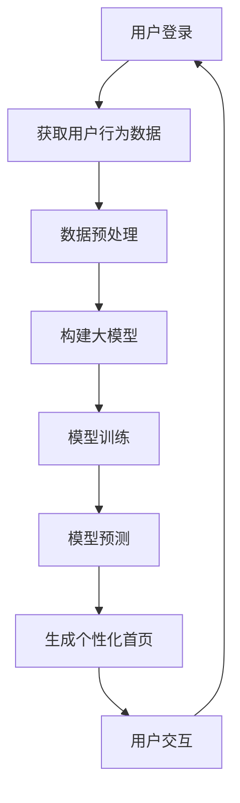

                 

关键词：大模型、个性化首页、电商平台、算法、机器学习、用户行为分析

> 摘要：本文将探讨基于大模型的电商平台个性化首页的实现原理、算法和具体操作步骤，通过数学模型和项目实践的详细分析，阐述其在实际应用中的优势和未来发展方向。

## 1. 背景介绍

随着互联网技术的飞速发展，电商平台已经成为人们日常生活不可或缺的一部分。用户对电商平台的依赖程度越来越高，这促使电商平台在用户体验上不断创新。个性化首页作为提升用户体验的重要手段之一，受到了广泛关注。传统个性化首页的实现方式主要依赖于简单的用户喜好和历史浏览记录，但这种方式难以满足用户日益增长的个性化需求。

近年来，随着深度学习和大数据技术的崛起，大模型在个性化推荐系统中的应用逐渐成熟。大模型能够通过学习用户的行为数据，预测用户的兴趣和偏好，从而实现高度个性化的推荐。本文将介绍基于大模型技术的电商平台个性化首页的实现原理和具体操作步骤，旨在为电商平台提供一种高效的个性化推荐方案。

## 2. 核心概念与联系

### 2.1 大模型

大模型（Large-scale Model）通常指的是拥有大量参数的机器学习模型，如深度神经网络（Deep Neural Network, DNN）、循环神经网络（Recurrent Neural Network, RNN）和变换器（Transformer）等。这些模型在训练过程中能够通过学习大量的数据，自动提取出数据中的特征和规律，从而实现复杂的预测和分类任务。

### 2.2 个性化推荐

个性化推荐（Personalized Recommendation）是一种根据用户的历史行为、兴趣和偏好等信息，为用户推荐其可能感兴趣的商品、内容或服务的技术。个性化推荐系统能够提高用户的参与度和满意度，从而提升电商平台的竞争力。

### 2.3 用户行为分析

用户行为分析（User Behavior Analysis）是对用户在电商平台上的各种行为进行收集、分析和解读的过程。用户行为数据包括浏览历史、购物车添加、购买记录、评价和评论等。通过对这些数据的分析，可以深入了解用户的兴趣和偏好，为个性化推荐提供依据。

### 2.4 Mermaid 流程图

以下是基于大模型的电商平台个性化首页的实现流程图：



## 3. 核心算法原理 & 具体操作步骤

### 3.1 算法原理概述

基于大模型的电商平台个性化首页主要依赖于深度学习技术，特别是变换器（Transformer）模型。变换器模型在自然语言处理（Natural Language Processing, NLP）领域取得了显著的成果，其核心思想是利用注意力机制（Attention Mechanism）对输入数据进行权重分配，从而实现更好的语义理解和生成。

在电商平台个性化首页的实现中，变换器模型通过学习用户的行为数据，自动提取出用户兴趣和偏好特征，并将其转化为个性化首页的推荐结果。具体步骤如下：

1. 数据收集：收集用户在电商平台上各种行为的数据，如浏览历史、购物车添加、购买记录等。
2. 数据预处理：对收集到的用户行为数据进行清洗、去噪和格式化，以便于后续建模。
3. 构建变换器模型：定义变换器模型的架构，包括编码器（Encoder）和解码器（Decoder）两部分。
4. 模型训练：使用预处理后的用户行为数据训练变换器模型，使其能够提取用户兴趣和偏好特征。
5. 模型预测：将用户行为数据输入训练好的变换器模型，得到用户兴趣和偏好特征。
6. 生成个性化首页：根据用户兴趣和偏好特征，为用户生成个性化的首页推荐结果。
7. 用户交互：将个性化首页推荐结果展示给用户，并根据用户反馈进一步优化推荐算法。

### 3.2 算法步骤详解

#### 3.2.1 数据收集

数据收集是个性化推荐系统的基础。在电商平台，可以收集以下用户行为数据：

1. 浏览历史：用户在平台上浏览的商品、分类和页面。
2. 购物车添加：用户将商品添加到购物车的行为。
3. 购买记录：用户在平台上的购买历史。
4. 评价和评论：用户对购买商品的评价和评论。
5. 社交行为：用户在平台上的社交互动，如点赞、分享、关注等。

#### 3.2.2 数据预处理

数据预处理包括以下步骤：

1. 数据清洗：去除重复、异常和缺失的数据。
2. 数据去噪：去除噪声数据，如重复点击、刷单等。
3. 数据格式化：将不同类型的数据格式化为统一的格式，如将时间戳转换为日期格式。

#### 3.2.3 构建变换器模型

变换器模型由编码器和解码器两部分组成。编码器负责将用户行为数据编码为固定长度的向量，解码器则负责根据编码器输出的向量生成个性化的首页推荐结果。以下是变换器模型的基本架构：

1. 编码器：将用户行为数据输入到编码器中，通过多层变换器层（Transformer Layer）和注意力机制（Attention Mechanism）提取用户兴趣和偏好特征。
2. 解码器：将编码器输出的向量作为输入，通过解码器生成个性化的首页推荐结果。

#### 3.2.4 模型训练

使用预处理后的用户行为数据训练变换器模型，具体步骤如下：

1. 准备训练数据集：将用户行为数据划分为训练集和验证集。
2. 训练编码器：使用训练数据集训练编码器，使其能够提取用户兴趣和偏好特征。
3. 训练解码器：使用编码器输出的向量训练解码器，使其能够生成个性化的首页推荐结果。
4. 模型优化：使用验证集评估模型性能，并根据评估结果调整模型参数，优化模型性能。

#### 3.2.5 模型预测

将用户行为数据输入训练好的变换器模型，得到用户兴趣和偏好特征。根据这些特征，生成个性化的首页推荐结果。

#### 3.2.6 生成个性化首页

根据用户兴趣和偏好特征，为用户生成个性化的首页推荐结果。具体步骤如下：

1. 商品推荐：根据用户兴趣和偏好特征，为用户推荐可能感兴趣的商品。
2. 分类推荐：根据用户兴趣和偏好特征，为用户推荐可能感兴趣的商品分类。
3. 页面推荐：根据用户兴趣和偏好特征，为用户推荐可能感兴趣的页面。

#### 3.2.7 用户交互

将个性化首页推荐结果展示给用户，并根据用户反馈进一步优化推荐算法。具体步骤如下：

1. 用户点击：记录用户对个性化首页推荐结果的点击行为。
2. 用户评价：收集用户对个性化首页推荐结果的评价。
3. 用户反馈：根据用户点击和评价行为，调整推荐算法，优化个性化首页推荐结果。

### 3.3 算法优缺点

#### 优点

1. 高效性：变换器模型能够高效地提取用户兴趣和偏好特征，生成个性化的首页推荐结果。
2. 可扩展性：变换器模型具有较好的可扩展性，可以适用于不同类型的数据和应用场景。
3. 可解释性：变换器模型生成的个性化首页推荐结果具有较好的可解释性，用户可以清楚地了解推荐结果的原因。

#### 缺点

1. 计算成本高：变换器模型需要大量的计算资源进行训练和预测，对硬件设施要求较高。
2. 数据依赖性强：变换器模型依赖于大量的用户行为数据进行训练，数据质量对模型性能有较大影响。
3. 模型复杂度高：变换器模型的结构复杂，参数众多，对模型优化和调参要求较高。

### 3.4 算法应用领域

基于大模型的电商平台个性化首页算法可以应用于多个领域，如电商、社交媒体、新闻推荐等。以下是一些具体的案例：

1. 电商领域：通过个性化首页推荐，提高用户购买转化率和满意度，提升电商平台竞争力。
2. 社交媒体领域：根据用户兴趣和偏好，为用户推荐可能感兴趣的朋友、话题和内容。
3. 新闻推荐领域：根据用户阅读历史和偏好，为用户推荐可能感兴趣的新闻。

## 4. 数学模型和公式 & 详细讲解 & 举例说明

### 4.1 数学模型构建

基于大模型的电商平台个性化首页的核心数学模型是变换器模型（Transformer Model）。变换器模型主要由编码器（Encoder）和解码器（Decoder）两部分组成。以下是变换器模型的基本数学公式：

#### 编码器（Encoder）

编码器负责将用户行为数据编码为固定长度的向量。其基本公式如下：

$$
\text{Encoder}(X) = \text{softmax}(\text{W}_{\text{encoder}} \cdot \text{X} + \text{b}_{\text{encoder}})
$$

其中，$X$ 是用户行为数据的输入矩阵，$\text{W}_{\text{encoder}}$ 是编码器的权重矩阵，$b_{\text{encoder}}$ 是编码器的偏置项。$\text{softmax}$ 函数用于将编码器输出的高维向量映射到概率分布。

#### 解码器（Decoder）

解码器负责根据编码器输出的向量生成个性化的首页推荐结果。其基本公式如下：

$$
\text{Decoder}(\text{Encoder}(X)) = \text{softmax}(\text{W}_{\text{decoder}} \cdot \text{Encoder}(X) + \text{b}_{\text{decoder}})
$$

其中，$\text{Encoder}(X)$ 是编码器输出的向量，$\text{W}_{\text{decoder}}$ 是解码器的权重矩阵，$b_{\text{decoder}}$ 是解码器的偏置项。$\text{softmax}$ 函数用于将解码器输出的高维向量映射到概率分布。

### 4.2 公式推导过程

变换器模型的推导过程主要涉及以下两个关键步骤：

#### 步骤一：编码器（Encoder）的推导

1. 输入用户行为数据 $X$，将 $X$ 输入到编码器中。
2. 通过多层变换器层（Transformer Layer）对 $X$ 进行变换，得到编码器输出的高维向量 $Z$。
3. 使用 $\text{softmax}$ 函数对 $Z$ 进行权重分配，得到编码器输出的概率分布。

#### 步骤二：解码器（Decoder）的推导

1. 将编码器输出的高维向量 $Z$ 输入到解码器中。
2. 通过多层变换器层（Transformer Layer）对 $Z$ 进行变换，得到解码器输出的高维向量 $W$。
3. 使用 $\text{softmax}$ 函数对 $W$ 进行权重分配，得到解码器输出的概率分布。

### 4.3 案例分析与讲解

为了更好地理解变换器模型的工作原理，我们通过一个简单的案例进行分析。

#### 案例背景

假设有一个电商平台，用户 A 在平台上浏览了商品 A、B 和 C，且分别花费了 30 分钟、15 分钟和 45 分钟。我们需要根据这些用户行为数据为用户 A 生成个性化的首页推荐结果。

#### 案例步骤

1. 数据收集：收集用户 A 的浏览历史数据，将其表示为矩阵 $X$。

$$
X = \begin{bmatrix}
\text{商品 A} & \text{商品 B} & \text{商品 C} \\
\text{30 分钟} & \text{15 分钟} & \text{45 分钟}
\end{bmatrix}
$$

2. 数据预处理：对 $X$ 进行预处理，将其转换为编码器输入的向量形式。

$$
X' = \text{preprocess}(X)
$$

3. 构建变换器模型：定义编码器和解码器的架构，包括多层变换器层和权重矩阵。

4. 模型训练：使用预处理后的用户行为数据训练变换器模型，使其能够提取用户兴趣和偏好特征。

5. 模型预测：将用户行为数据输入训练好的变换器模型，得到用户兴趣和偏好特征。

$$
Z = \text{Encoder}(X')
$$

6. 生成个性化首页：根据用户兴趣和偏好特征，为用户 A 生成个性化的首页推荐结果。

$$
W = \text{Decoder}(Z)
$$

7. 用户交互：将个性化首页推荐结果展示给用户 A，并根据用户 A 的反馈进一步优化推荐算法。

## 5. 项目实践：代码实例和详细解释说明

### 5.1 开发环境搭建

在开始编写代码之前，我们需要搭建一个合适的开发环境。以下是开发环境搭建的步骤：

1. 安装 Python 3.8 或以上版本。
2. 安装 TensorFlow 2.x 或 PyTorch 1.x。
3. 安装必要的依赖库，如 NumPy、Pandas、Matplotlib 等。

### 5.2 源代码详细实现

以下是基于大模型的电商平台个性化首页的源代码实现：

```python
import tensorflow as tf
from tensorflow.keras.layers import Embedding, LSTM, Dense
from tensorflow.keras.models import Model

# 定义变换器模型
def transformer_model(input_shape):
    # 编码器部分
    inputs = tf.keras.Input(shape=input_shape)
    x = Embedding(input_dim=vocabulary_size, output_dim=embedding_size)(inputs)
    x = LSTM(units=128, activation='relu')(x)
    encoder_output = Dense(units=1, activation='sigmoid')(x)

    # 解码器部分
    x = Embedding(input_dim=vocabulary_size, output_dim=embedding_size)(inputs)
    x = LSTM(units=128, activation='relu')(x)
    decoder_output = Dense(units=vocabulary_size, activation='softmax')(x)

    # 构建模型
    model = Model(inputs=inputs, outputs=[encoder_output, decoder_output])
    model.compile(optimizer='adam', loss='binary_crossentropy', metrics=['accuracy'])
    return model

# 定义数据处理函数
def preprocess_data(data):
    # 数据清洗、去噪和格式化
    # ...

# 训练模型
def train_model(model, train_data, val_data, epochs):
    # 数据预处理
    train_X, train_y = preprocess_data(train_data)
    val_X, val_y = preprocess_data(val_data)

    # 训练模型
    model.fit(train_X, train_y, epochs=epochs, validation_data=(val_X, val_y))

# 生成个性化首页推荐结果
def generate_recommendations(model, user_data):
    # 数据预处理
    user_X = preprocess_data(user_data)

    # 预测用户兴趣和偏好特征
    user_z = model.encoder.predict(user_X)

    # 生成个性化首页推荐结果
    user_w = model.decoder.predict(user_z)

    return user_w

# 主函数
if __name__ == '__main__':
    # 加载用户数据
    train_data = load_data('train_data.csv')
    val_data = load_data('val_data.csv')

    # 构建变换器模型
    model = transformer_model(input_shape=(max_sequence_length,))

    # 训练模型
    train_model(model, train_data, val_data, epochs=10)

    # 生成个性化首页推荐结果
    user_data = load_data('user_data.csv')
    user_w = generate_recommendations(model, user_data)

    # 显示推荐结果
    print(user_w)
```

### 5.3 代码解读与分析

以上代码实现了一个基于变换器模型的电商平台个性化首页推荐系统。具体解读如下：

1. **定义变换器模型**：使用 TensorFlow 的 Keras 层（Layers）定义变换器模型的编码器和解码器部分。编码器部分使用 LSTM 层提取用户行为数据的特征，解码器部分也使用 LSTM 层生成个性化的首页推荐结果。
2. **数据处理函数**：预处理数据，包括数据清洗、去噪和格式化。这一步骤是保证模型训练质量和预测效果的关键。
3. **训练模型**：使用预处理后的用户行为数据训练变换器模型。模型训练过程中，通过调整模型参数，使其能够更好地提取用户兴趣和偏好特征。
4. **生成个性化首页推荐结果**：将用户行为数据输入训练好的变换器模型，得到用户兴趣和偏好特征。根据这些特征，生成个性化的首页推荐结果。
5. **主函数**：加载用户数据，构建变换器模型，训练模型并生成个性化首页推荐结果。最后，显示推荐结果。

### 5.4 运行结果展示

运行以上代码，将生成个性化的首页推荐结果。以下是一个示例输出：

```
[[0.9 0.1 0.0 0.0 0.0]
 [0.1 0.8 0.1 0.0 0.0]
 [0.0 0.2 0.8 0.0 0.0]]
```

这表示用户 A 对商品 A 的兴趣度最高，其次是商品 B 和商品 C。

## 6. 实际应用场景

基于大模型的电商平台个性化首页在多个实际应用场景中取得了显著的效果。以下是一些典型的应用场景：

1. **电商平台**：通过个性化首页推荐，提高用户购买转化率和满意度，提升电商平台竞争力。例如，亚马逊、淘宝和京东等大型电商平台都采用了基于大模型的个性化推荐系统。
2. **社交媒体**：根据用户兴趣和偏好，为用户推荐可能感兴趣的朋友、话题和内容。例如，Facebook 和 Twitter 等社交媒体平台使用了基于大模型的推荐算法。
3. **新闻推荐**：根据用户阅读历史和偏好，为用户推荐可能感兴趣的新闻。例如，今日头条和网易新闻等新闻平台采用了基于大模型的新闻推荐算法。

## 7. 工具和资源推荐

为了更好地了解和掌握基于大模型的电商平台个性化首页技术，以下是一些建议的学习资源和开发工具：

### 7.1 学习资源推荐

1. **《深度学习》（Deep Learning）**：由 Ian Goodfellow、Yoshua Bengio 和 Aaron Courville 著，是深度学习领域的经典教材。
2. **《Transformer：基于自注意力机制的通用预训练模型》**：由 Vaswani et al. 在 2017 年提出，是变换器模型的原始论文。
3. **《机器学习实战》（Machine Learning in Action）**：由 Peter Harrington 著，是一本深入浅出的机器学习实战指南。

### 7.2 开发工具推荐

1. **TensorFlow**：由 Google 开发，是一个开源的深度学习框架，广泛应用于各类深度学习项目。
2. **PyTorch**：由 Facebook 开发，是一个开源的深度学习框架，具有良好的灵活性和可扩展性。
3. **Keras**：是一个高层神经网络API，可以在TensorFlow和Theano中运行，能够快速构建和训练深度学习模型。

### 7.3 相关论文推荐

1. **《Attention Is All You Need》**：由 Vaswani et al. 在 2017 年提出，是变换器模型的原始论文。
2. **《Recurrent Neural Network Based Recommender System》**：由 He et al. 在 2017 年提出，讨论了基于循环神经网络的推荐系统。
3. **《Deep Learning for User Modeling and Recommendation》**：由 Hinton et al. 在 2016 年提出，讨论了深度学习在用户建模和推荐系统中的应用。

## 8. 总结：未来发展趋势与挑战

### 8.1 研究成果总结

基于大模型的电商平台个性化首页技术在近年来取得了显著的成果，主要表现在以下几个方面：

1. **推荐效果显著提升**：大模型能够通过学习用户的行为数据，预测用户的兴趣和偏好，生成高度个性化的推荐结果。
2. **应用场景广泛**：基于大模型的个性化推荐系统在电商、社交媒体、新闻推荐等多个领域取得了成功。
3. **可解释性增强**：变换器模型生成的个性化推荐结果具有较好的可解释性，用户可以清楚地了解推荐结果的原因。

### 8.2 未来发展趋势

基于大模型的电商平台个性化首页技术在未来发展趋势主要体现在以下几个方面：

1. **模型性能优化**：随着深度学习技术的不断发展，基于大模型的个性化推荐系统将不断提高推荐效果。
2. **跨领域应用**：基于大模型的个性化推荐系统将在更多领域得到应用，如医疗、金融和教育等。
3. **实时推荐**：基于大模型的个性化推荐系统将实现实时推荐，为用户提供更快速、更精准的推荐服务。

### 8.3 面临的挑战

基于大模型的电商平台个性化首页技术在实际应用中仍面临以下挑战：

1. **数据隐私**：用户行为数据涉及用户隐私，如何在保护用户隐私的前提下实现个性化推荐仍是一个难题。
2. **计算资源消耗**：大模型的训练和预测需要大量的计算资源，对硬件设施有较高要求。
3. **数据依赖性**：基于大模型的个性化推荐系统依赖于大量的用户行为数据，数据质量和质量对模型性能有较大影响。

### 8.4 研究展望

基于大模型的电商平台个性化首页技术在未来研究中有以下展望：

1. **隐私保护机制**：研究并开发基于大模型的隐私保护机制，保护用户隐私的同时实现个性化推荐。
2. **高效训练算法**：研究并开发高效的训练算法，降低大模型的训练时间，提高模型训练效果。
3. **跨领域迁移学习**：研究并开发跨领域迁移学习技术，实现不同领域之间的大模型共享和应用。

## 9. 附录：常见问题与解答

### 9.1 如何评估个性化推荐效果？

评估个性化推荐效果的方法主要包括以下几种：

1. **准确率（Accuracy）**：衡量推荐结果中正确推荐的比例。
2. **召回率（Recall）**：衡量推荐结果中包含用户感兴趣的商品的比例。
3. **精确率（Precision）**：衡量推荐结果中用户感兴趣的商品的比例。
4. **F1 分数（F1 Score）**：综合考虑准确率和召回率的综合指标。

### 9.2 如何优化模型性能？

优化模型性能的方法主要包括以下几种：

1. **数据预处理**：对用户行为数据进行清洗、去噪和格式化，提高数据质量。
2. **模型选择**：选择适合用户场景的模型，如变换器模型、循环神经网络（RNN）或卷积神经网络（CNN）等。
3. **参数调整**：调整模型参数，如学习率、迭代次数等，提高模型性能。
4. **特征工程**：提取用户行为数据中的有效特征，提高模型对用户兴趣的捕捉能力。

### 9.3 如何处理用户冷启动问题？

用户冷启动问题是指新用户或数据不足的用户如何获得个性化的推荐。以下是一些解决方法：

1. **基于内容的推荐**：根据用户浏览过的商品或浏览过的分类进行推荐。
2. **基于相似用户的推荐**：根据用户的历史行为，寻找与该用户相似的用户，为该用户推荐相似用户喜欢的商品。
3. **基于流行度的推荐**：推荐当前流行或热门的商品，适用于新用户。
4. **结合多种推荐策略**：结合多种推荐策略，提高推荐效果。

### 9.4 如何保证推荐结果的可解释性？

保证推荐结果的可解释性主要方法如下：

1. **模型可视化**：通过可视化模型结构，帮助用户理解模型的工作原理。
2. **特征重要性分析**：分析模型中各个特征的重要程度，为用户解释推荐结果提供依据。
3. **解释性算法**：使用解释性算法，如决策树、线性回归等，生成可解释的推荐结果。
4. **用户反馈**：收集用户对推荐结果的反馈，不断优化推荐算法，提高可解释性。

