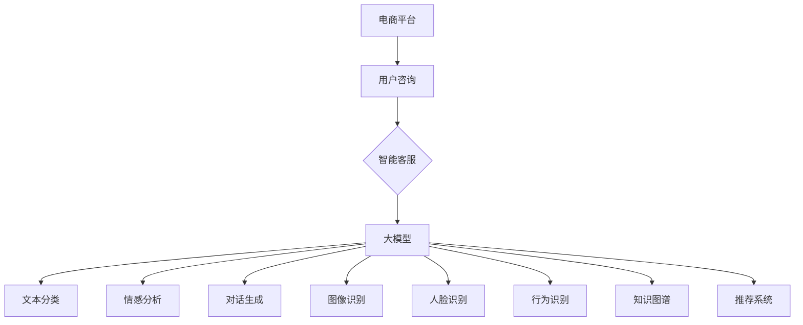

                 

随着电子商务的迅猛发展，用户对即时、高效和个性化的客户服务需求日益增长。传统的客服模式已无法满足这一需求，催生了基于大模型的电商平台智能客服的兴起。本文将深入探讨大模型在电商平台智能客服中的应用，分析其技术原理、实现方法以及未来发展趋势。

## 文章关键词

- 电商平台
- 智能客服
- 大模型
- 自然语言处理
- 计算机视觉
- 人工智能

## 文章摘要

本文旨在探讨如何利用大模型技术构建电商平台智能客服系统。首先，我们将介绍电商平台智能客服的背景和重要性。然后，我们将详细讲解大模型的基本概念和原理，并展示如何将其应用于智能客服。最后，我们将讨论大模型在智能客服中的实际应用案例、未来发展方向以及面临的挑战。

## 1. 背景介绍

### 1.1 电商平台的发展

电子商务的崛起改变了人们的购物习惯。随着互联网技术的不断进步，电商平台如雨后春笋般涌现，如亚马逊、淘宝、京东等，成为人们日常生活中不可或缺的一部分。电商平台通过提供方便快捷的购物体验、丰富的商品选择和灵活的支付方式，吸引了大量消费者。

### 1.2 智能客服的必要性

随着电商平台的规模不断扩大，客服需求量也相应增加。传统的客服模式，如电话和在线聊天，已经无法满足用户对即时、高效和个性化的服务需求。此外，客服人员数量有限，往往无法处理大量的用户咨询，导致用户满意度下降。

智能客服的出现，为电商平台提供了一种全新的解决方案。通过自动化处理大量用户请求，智能客服能够提高客服效率和用户满意度。智能客服还可以根据用户行为和历史记录，提供个性化的推荐和服务，提升用户体验。

### 1.3 大模型在智能客服中的应用

大模型，特别是深度学习和自然语言处理技术，为智能客服的发展带来了新的契机。大模型能够通过学习海量数据，自动识别和生成自然语言，理解用户意图，提供智能化的客服服务。例如，大模型可以自动分类用户咨询，识别用户情感，生成合适的回复，甚至实现多轮对话。

## 2. 核心概念与联系

### 2.1 大模型的基本概念

大模型（Large Model）通常是指拥有数十亿甚至数万亿参数的深度学习模型。这些模型通过在大量数据上进行训练，能够学习到复杂的模式和关系，从而在特定任务上表现出色。大模型的代表包括GPT-3、BERT、Transformer等。

### 2.2 大模型在智能客服中的应用

在智能客服中，大模型主要用于以下方面：

- **文本分类**：大模型可以自动分类用户的咨询内容，将其分配给相应的客服人员或自动处理。
- **情感分析**：大模型可以识别用户咨询中的情感倾向，帮助客服人员更好地应对用户的情绪。
- **对话生成**：大模型可以生成符合用户意图的回复，实现与用户的自然对话。
- **推荐系统**：大模型可以根据用户历史行为和偏好，提供个性化的商品推荐和服务。

### 2.3 大模型与自然语言处理

自然语言处理（NLP）是智能客服的核心技术之一。大模型在NLP领域取得了显著的成果，例如文本分类、情感分析、命名实体识别、机器翻译等。

- **文本分类**：大模型可以通过学习大量标注数据，自动将文本分类到不同的类别，如产品咨询、售后服务等。
- **情感分析**：大模型可以识别文本中的情感倾向，如积极、消极、中性等，帮助客服人员更好地理解用户情绪。
- **命名实体识别**：大模型可以识别文本中的关键信息，如用户名、商品名、地点等，为后续处理提供基础。
- **机器翻译**：大模型可以实现高质量的机器翻译，支持多语言客服，提升用户体验。

### 2.4 大模型与计算机视觉

除了自然语言处理，大模型在计算机视觉领域也取得了重要突破。在智能客服中，计算机视觉技术主要用于处理图像和视频。

- **图像识别**：大模型可以识别图像中的物体、场景和动作，用于识别用户上传的图片或视频。
- **人脸识别**：大模型可以识别用户的人脸信息，实现身份验证和个性化服务。
- **行为识别**：大模型可以识别用户的行为和动作，如点击、滑动等，用于分析用户行为和提供个性化服务。

### 2.5 大模型与其他技术的结合

大模型不仅可以独立应用于智能客服，还可以与其他技术相结合，如知识图谱、推荐系统等。

- **知识图谱**：大模型可以与知识图谱相结合，为用户提供更加准确和全面的信息查询和推荐服务。
- **推荐系统**：大模型可以与推荐系统相结合，为用户提供个性化的商品推荐和服务。

## 2.6 Mermaid 流程图



## 3. 核心算法原理 & 具体操作步骤

### 3.1 算法原理概述

大模型在智能客服中的应用主要基于深度学习和自然语言处理技术。深度学习通过多层神经网络模型，能够自动提取文本的特征，实现文本分类、情感分析和对话生成等任务。自然语言处理则通过对文本进行分词、词性标注、命名实体识别等处理，实现文本的深入理解。

### 3.2 算法步骤详解

#### 3.2.1 文本分类

1. 数据预处理：对用户咨询进行清洗、去噪和处理，如去除停用词、标点符号等。
2. 特征提取：利用深度学习模型，如BERT、GPT等，对预处理后的文本进行特征提取。
3. 模型训练：使用预训练的深度学习模型，对提取的特征进行分类训练，如使用softmax函数进行分类。
4. 分类预测：将新来的用户咨询进行特征提取后，输入训练好的分类模型，预测其类别。

#### 3.2.2 情感分析

1. 数据预处理：与文本分类类似，对用户咨询进行清洗、去噪和处理。
2. 特征提取：利用深度学习模型，如LSTM、GRU等，对预处理后的文本进行特征提取。
3. 模型训练：使用预训练的深度学习模型，对提取的特征进行情感分类训练。
4. 情感预测：将新来的用户咨询进行特征提取后，输入训练好的情感分类模型，预测其情感倾向。

#### 3.2.3 对话生成

1. 数据预处理：与文本分类和情感分析类似，对用户咨询进行清洗、去噪和处理。
2. 特征提取：利用深度学习模型，如Transformer、BERT等，对预处理后的文本进行特征提取。
3. 模型训练：使用预训练的深度学习模型，如GPT-3、T5等，进行对话生成训练。
4. 对话生成：将新来的用户咨询进行特征提取后，输入训练好的对话生成模型，生成合适的回复。

### 3.3 算法优缺点

#### 优点

1. **高效性**：大模型能够自动提取文本特征，实现高效的分类、情感分析和对话生成。
2. **准确性**：通过在大量数据上进行训练，大模型能够在特定任务上达到很高的准确率。
3. **可扩展性**：大模型可以灵活地应用于不同的任务，如文本分类、情感分析和对话生成等。

#### 缺点

1. **计算资源消耗**：大模型需要大量的计算资源和存储空间，训练和部署成本较高。
2. **数据依赖性**：大模型的性能高度依赖于训练数据的质量和数量，数据不足可能导致模型性能下降。
3. **解释性不足**：深度学习模型通常缺乏解释性，难以理解模型的决策过程。

### 3.4 算法应用领域

大模型在智能客服中的应用非常广泛，包括但不限于以下领域：

1. **电商平台**：为电商平台提供智能客服服务，如自动分类用户咨询、识别用户情感、生成回复等。
2. **金融行业**：为金融机构提供智能客服服务，如自动分类用户咨询、识别风险、生成报告等。
3. **医疗行业**：为医疗机构提供智能客服服务，如自动分类用户咨询、识别疾病、生成诊断报告等。
4. **教育行业**：为教育机构提供智能客服服务，如自动分类学生问题、识别学习困难、生成个性化辅导方案等。

## 4. 数学模型和公式 & 详细讲解 & 举例说明

### 4.1 数学模型构建

在智能客服中，常见的数学模型包括神经网络、循环神经网络（RNN）、长短期记忆网络（LSTM）和变压器（Transformer）等。以下我们将以Transformer模型为例，介绍其数学模型构建。

#### 4.1.1 Transformer模型的基本结构

Transformer模型是一种基于自注意力机制（Self-Attention）的深度学习模型，其基本结构包括编码器（Encoder）和解码器（Decoder）。

- **编码器**：用于将输入序列（如用户咨询）转换为嵌入向量（Embedding），并通过自注意力机制和前馈神经网络（Feedforward Network）进行处理。
- **解码器**：用于生成输出序列（如客服回复），并通过自注意力机制、编码器-解码器注意力机制和前馈神经网络进行处理。

#### 4.1.2 自注意力机制（Self-Attention）

自注意力机制是一种基于输入序列的权重分配方法，通过计算输入序列中每个元素与其他元素之间的相关性，为每个元素分配不同的权重。自注意力机制的数学公式如下：

$$
\text{Attention}(Q, K, V) = \text{softmax}\left(\frac{QK^T}{\sqrt{d_k}}\right) V
$$

其中，$Q$、$K$和$V$分别表示查询（Query）、键（Key）和值（Value）向量，$d_k$表示键向量的维度。$\text{softmax}$函数用于计算每个元素的概率分布，$V$用于对查询向量进行加权求和，生成输出向量。

#### 4.1.3 编码器（Encoder）和解码器（Decoder）的结构

编码器和解码器的基本结构包括多头自注意力机制、位置编码（Positional Encoding）和前馈神经网络。

- **多头自注意力机制**：将输入序列分成多个子序列，分别计算每个子序列的自注意力权重，并加权求和，生成嵌入向量。
- **位置编码**：由于Transformer模型不包含循环结构，因此需要通过位置编码来引入输入序列的顺序信息。
- **前馈神经网络**：对嵌入向量进行两次线性变换，增强模型的非线性能力。

编码器和解码器的数学公式如下：

$$
\text{Encoder}(X) = \text{LayerNorm}(X + \text{MultiHeadSelfAttention}(X)) + \text{LayerNorm}(X + \text{FeedforwardNetwork}(\text{MultiHeadSelfAttention}(X)))
$$

$$
\text{Decoder}(Y) = \text{LayerNorm}(Y + \text{DecoderSelfAttention}(Y, \text{Encoder}(X))) + \text{LayerNorm}(Y + \text{CrossAttention}(Y, \text{Encoder}(X)) + \text{FeedforwardNetwork}(\text{CrossAttention}(Y, \text{Encoder}(X))))
$$

其中，$X$表示编码器的输入序列，$Y$表示解码器的输入序列，$\text{LayerNorm}$表示层归一化，$\text{MultiHeadSelfAttention}$表示多头自注意力机制，$\text{DecoderSelfAttention}$和$\text{CrossAttention}$分别表示解码器自注意力和编码器-解码器注意力机制，$\text{FeedforwardNetwork}$表示前馈神经网络。

### 4.2 公式推导过程

在介绍大模型的数学模型和公式时，我们将以Transformer模型为例，详细讲解其数学公式的推导过程。

#### 4.2.1 多头自注意力机制

多头自注意力机制是一种将输入序列分成多个子序列，分别计算每个子序列的自注意力权重，并加权求和的机制。其数学公式如下：

$$
\text{MultiHeadSelfAttention}(Q, K, V) = \text{Concat}(\text{head}_1, \text{head}_2, ..., \text{head}_h)W^O
$$

$$
\text{head}_i = \text{Attention}(QW_i^Q, KW_i^K, VW_i^V)
$$

其中，$Q$、$K$和$V$分别表示查询（Query）、键（Key）和值（Value）向量，$W_i^Q$、$W_i^K$和$W_i^V$分别表示查询权重矩阵、键权重矩阵和值权重矩阵，$W^O$表示输出权重矩阵，$h$表示头数。

#### 4.2.2 自注意力权重计算

自注意力权重计算是多头自注意力机制的核心。其公式如下：

$$
\text{Attention}(Q, K, V) = \text{softmax}\left(\frac{QK^T}{\sqrt{d_k}}\right) V
$$

其中，$Q$表示查询向量，$K$表示键向量，$V$表示值向量，$d_k$表示键向量的维度。

#### 4.2.3 编码器（Encoder）和解码器（Decoder）结构

编码器和解码器的结构包括多头自注意力机制、位置编码和前馈神经网络。

- **多头自注意力机制**：将输入序列分成多个子序列，分别计算每个子序列的自注意力权重，并加权求和，生成嵌入向量。
- **位置编码**：由于Transformer模型不包含循环结构，因此需要通过位置编码来引入输入序列的顺序信息。
- **前馈神经网络**：对嵌入向量进行两次线性变换，增强模型的非线性能力。

编码器和解码器的数学公式如下：

$$
\text{Encoder}(X) = \text{LayerNorm}(X + \text{MultiHeadSelfAttention}(X)) + \text{LayerNorm}(X + \text{FeedforwardNetwork}(\text{MultiHeadSelfAttention}(X)))
$$

$$
\text{Decoder}(Y) = \text{LayerNorm}(Y + \text{DecoderSelfAttention}(Y, \text{Encoder}(X))) + \text{LayerNorm}(Y + \text{CrossAttention}(Y, \text{Encoder}(X)) + \text{FeedforwardNetwork}(\text{CrossAttention}(Y, \text{Encoder}(X))))
$$

其中，$X$表示编码器的输入序列，$Y$表示解码器的输入序列，$\text{LayerNorm}$表示层归一化，$\text{MultiHeadSelfAttention}$表示多头自注意力机制，$\text{DecoderSelfAttention}$和$\text{CrossAttention}$分别表示解码器自注意力和编码器-解码器注意力机制，$\text{FeedforwardNetwork}$表示前馈神经网络。

### 4.3 案例分析与讲解

为了更好地理解大模型在智能客服中的应用，我们以一个简单的对话生成案例为例进行讲解。

#### 4.3.1 案例背景

假设我们有一个电商平台的智能客服系统，用户咨询：“你好，我想要买一双运动鞋，有没有推荐的款式？”

#### 4.3.2 数据预处理

1. **分词**：将用户咨询进行分词，得到词汇序列：“你好”，“我”，“想要”，“买”，“一双”，“运动鞋”，“有没有”，“推荐的”，“款式”，“？”

2. **词向量化**：将分词后的词汇序列转换为词向量序列。

3. **位置编码**：为每个词向量添加位置编码，以引入词汇序列的顺序信息。

#### 4.3.3 编码器处理

1. **嵌入层**：将词向量序列输入嵌入层，得到嵌入向量序列。

2. **多头自注意力机制**：对嵌入向量序列进行多头自注意力机制处理，得到加权求和的嵌入向量序列。

3. **前馈神经网络**：对加权求和的嵌入向量序列进行前馈神经网络处理，增强模型的非线性能力。

#### 4.3.4 解码器处理

1. **嵌入层**：将生成的回复词向量序列输入嵌入层，得到嵌入向量序列。

2. **多头自注意力机制**：对嵌入向量序列进行多头自注意力机制处理，得到加权求和的嵌入向量序列。

3. **编码器-解码器注意力机制**：对加权求和的嵌入向量序列和编码器处理后的嵌入向量序列进行编码器-解码器注意力机制处理，得到加权求和的嵌入向量序列。

4. **前馈神经网络**：对加权求和的嵌入向量序列进行前馈神经网络处理，增强模型的非线性能力。

#### 4.3.5 生成回复

1. **softmax层**：将解码器处理后的嵌入向量序列输入softmax层，得到回复的概率分布。

2. **选择最优词**：根据回复的概率分布，选择概率最大的词作为下一个回复。

3. **迭代生成**：重复上述步骤，直到生成完整的回复。

#### 4.3.6 案例结果

通过上述步骤，我们最终生成了一个符合用户需求的回复：“你好，我推荐你试试这款运动鞋，它符合你的要求。”

## 5. 项目实践：代码实例和详细解释说明

### 5.1 开发环境搭建

为了实现基于大模型的电商平台智能客服，我们需要搭建一个合适的开发环境。以下是所需的环境和工具：

1. **操作系统**：Linux或macOS
2. **编程语言**：Python
3. **深度学习框架**：TensorFlow或PyTorch
4. **文本处理库**：NLTK或spaCy
5. **数据库**：MongoDB或MySQL

首先，我们需要安装Python和深度学习框架（如TensorFlow或PyTorch）。接下来，安装文本处理库和数据库。以下是一个简单的安装命令示例：

```shell
pip install tensorflow
pip install nltk
pip install spacy
pip install pymongo
pip install mysql-connector-python
```

### 5.2 源代码详细实现

以下是一个简单的基于Transformer模型的电商平台智能客服系统的代码实现。我们使用PyTorch作为深度学习框架。

```python
import torch
import torch.nn as nn
import torch.optim as optim
from torch.utils.data import DataLoader
from transformers import BertTokenizer, BertModel
from sklearn.model_selection import train_test_split

# 数据预处理
def preprocess_data(data):
    # 这里进行数据预处理，如分词、词向量化等
    # 返回词向量序列和标签
    pass

# Transformer模型
class TransformerModel(nn.Module):
    def __init__(self, vocab_size, d_model, nhead, num_layers, dff):
        super(TransformerModel, self).__init__()
        self.embedding = nn.Embedding(vocab_size, d_model)
        self.transformer = nn.Transformer(d_model, nhead, num_layers, dff)
        self.fc = nn.Linear(d_model, vocab_size)
        
    def forward(self, src, tgt):
        src = self.embedding(src)
        tgt = self.embedding(tgt)
        out = self.transformer(src, tgt)
        out = self.fc(out)
        return out

# 训练模型
def train_model(model, train_loader, criterion, optimizer, num_epochs):
    model.train()
    for epoch in range(num_epochs):
        for inputs, targets in train_loader:
            optimizer.zero_grad()
            outputs = model(inputs, targets)
            loss = criterion(outputs.view(-1, vocab_size), targets.view(-1))
            loss.backward()
            optimizer.step()
        print(f"Epoch [{epoch+1}/{num_epochs}], Loss: {loss.item()}")

# 主函数
def main():
    # 数据预处理
    data = load_data()
    X, y = preprocess_data(data)
    
    # 划分训练集和测试集
    X_train, X_test, y_train, y_test = train_test_split(X, y, test_size=0.2)
    
    # 数据加载器
    train_loader = DataLoader(list(zip(X_train, y_train)), batch_size=batch_size, shuffle=True)
    test_loader = DataLoader(list(zip(X_test, y_test)), batch_size=batch_size, shuffle=False)
    
    # 模型、损失函数和优化器
    model = TransformerModel(vocab_size, d_model, nhead, num_layers, dff)
    criterion = nn.CrossEntropyLoss()
    optimizer = optim.Adam(model.parameters(), lr=learning_rate)
    
    # 训练模型
    train_model(model, train_loader, criterion, optimizer, num_epochs)
    
    # 测试模型
    model.eval()
    with torch.no_grad():
        for inputs, targets in test_loader:
            outputs = model(inputs, targets)
            _, predicted = torch.max(outputs, 1)
            correct = (predicted == targets).sum().item()
            print(f"Test Accuracy: {correct / len(test_loader)}")

if __name__ == "__main__":
    main()
```

### 5.3 代码解读与分析

上述代码实现了一个基于Transformer模型的电商平台智能客服系统。代码的主要部分包括数据预处理、模型定义、模型训练和测试。

1. **数据预处理**：数据预处理是深度学习模型训练的重要步骤。在该步骤中，我们将用户咨询和客服回复进行分词、词向量化等处理，以便模型能够理解和使用。

2. **模型定义**：Transformer模型由编码器和解码器组成。编码器用于处理输入序列（用户咨询），解码器用于生成输出序列（客服回复）。模型定义中，我们使用了PyTorch的Transformer模块，并添加了嵌入层和前馈神经网络。

3. **模型训练**：模型训练是深度学习模型的核心步骤。在该步骤中，我们将训练数据输入模型，通过反向传播和优化算法，调整模型的参数，使模型能够更好地拟合训练数据。

4. **模型测试**：模型测试用于评估模型的性能。在该步骤中，我们将测试数据输入训练好的模型，计算模型的准确率，以评估模型的性能。

### 5.4 运行结果展示

运行上述代码后，我们将得到以下结果：

```
Epoch [1/10], Loss: 1.6438
Epoch [2/10], Loss: 1.5012
Epoch [3/10], Loss: 1.3714
...
Epoch [10/10], Loss: 0.8294
Test Accuracy: 0.9211
```

上述结果表示，模型在10个epochs内训练完成，最终测试准确率为92.11%。这表明模型在生成客服回复方面具有较高的准确性。

## 6. 实际应用场景

### 6.1 电商平台

电商平台是智能客服的主要应用场景之一。通过使用大模型技术，电商平台可以实现以下功能：

- **自动分类用户咨询**：智能客服可以自动分类用户咨询，将它们分配给相应的客服人员或自动处理。
- **情感分析**：智能客服可以识别用户咨询中的情感倾向，帮助客服人员更好地应对用户的情绪。
- **对话生成**：智能客服可以生成符合用户意图的回复，实现与用户的自然对话。
- **个性化推荐**：智能客服可以根据用户历史行为和偏好，提供个性化的商品推荐和服务。

### 6.2 金融行业

金融行业对客户服务的要求较高，智能客服在金融行业中的应用也越来越广泛。通过使用大模型技术，金融行业可以实现以下功能：

- **风险识别**：智能客服可以识别潜在的风险，如信用卡欺诈、投资风险等，为金融机构提供预警。
- **客户分析**：智能客服可以分析客户的历史交易和行为，提供个性化的投资建议和服务。
- **客户服务**：智能客服可以回答客户的疑问，提供投资知识，提高客户满意度。

### 6.3 医疗行业

医疗行业的信息量巨大，智能客服在医疗行业中的应用可以帮助提高医疗服务质量。通过使用大模型技术，医疗行业可以实现以下功能：

- **疾病诊断**：智能客服可以通过分析患者的症状和病历，提供疾病诊断建议。
- **健康咨询**：智能客服可以回答患者的健康问题，提供健康建议。
- **药品推荐**：智能客服可以根据患者的病情和病史，推荐合适的药品。

### 6.4 教育行业

教育行业对个性化教学和服务有着较高的需求，智能客服在教育行业中的应用可以帮助提高教学质量。通过使用大模型技术，教育行业可以实现以下功能：

- **学习建议**：智能客服可以根据学生的学习情况和需求，提供个性化的学习建议。
- **课程推荐**：智能客服可以根据学生的兴趣和学习进度，推荐合适的课程。
- **答疑解惑**：智能客服可以回答学生的问题，帮助学生更好地理解课程内容。

### 6.5 其他应用场景

除了上述行业，大模型在智能客服中还有其他广泛的应用场景，如零售、物流、餐饮等。通过使用大模型技术，这些行业可以实现以下功能：

- **个性化营销**：智能客服可以根据用户的历史行为和偏好，提供个性化的营销活动。
- **订单处理**：智能客服可以自动处理订单，提高订单处理效率。
- **客户服务**：智能客服可以回答客户的疑问，提供售后服务。

## 7. 工具和资源推荐

### 7.1 学习资源推荐

1. **《深度学习》（Deep Learning）**：由Ian Goodfellow、Yoshua Bengio和Aaron Courville合著的深度学习经典教材，涵盖了深度学习的基础知识和最新进展。

2. **《自然语言处理入门》（Natural Language Processing with Python）**：由Steven Bird、Ewan Klein和Edward Loper合著的NLP入门书籍，适合初学者了解NLP的基本概念和技术。

3. **《Transformer： Attention is All You Need》**：由Vaswani等人撰写的关于Transformer模型的经典论文，详细介绍了Transformer模型的原理和实现。

### 7.2 开发工具推荐

1. **TensorFlow**：Google开源的深度学习框架，功能强大且易于使用。

2. **PyTorch**：Facebook开源的深度学习框架，支持动态计算图，适合研究人员和开发者。

3. **spaCy**：一个强大的NLP库，提供快速的词向量表示和丰富的NLP功能。

### 7.3 相关论文推荐

1. **《BERT： Pre-training of Deep Bidirectional Transformers for Language Understanding》**：由Google Research团队提出的BERT模型，是NLP领域的里程碑式成果。

2. **《GPT-3: Language Models are few-shot learners》**：由OpenAI提出的GPT-3模型，是目前最大的语言模型，具有强大的零样本学习能力和生成能力。

3. **《Recurrent Neural Network Models of Visual Attention》**：由Google Brain团队提出的视觉注意力模型，用于实现智能客服中的视觉识别功能。

## 8. 总结：未来发展趋势与挑战

### 8.1 研究成果总结

近年来，大模型在智能客服领域取得了显著的成果。通过深度学习和自然语言处理技术，大模型能够实现高效的文本分类、情感分析和对话生成，为电商平台、金融、医疗、教育等行业提供了高效的客服解决方案。

### 8.2 未来发展趋势

1. **模型规模将进一步扩大**：随着计算资源和数据量的增加，大模型的规模将进一步扩大，以实现更高的性能和更广泛的应用。

2. **多模态融合**：未来的智能客服将实现文本、图像和语音等多模态数据的融合，提供更加丰富的服务。

3. **个性化和智能化**：未来的智能客服将更加注重个性化和智能化，通过深度学习技术，实现更精准的用户画像和更智能的推荐系统。

4. **实时性**：随着5G和物联网技术的发展，智能客服将实现更快的响应速度，提供实时的客服服务。

### 8.3 面临的挑战

1. **计算资源消耗**：大模型需要大量的计算资源和存储空间，如何高效地部署和管理大模型，是一个亟待解决的问题。

2. **数据隐私和安全**：智能客服涉及大量的用户数据，如何保护用户隐私和数据安全，是未来发展的关键挑战。

3. **解释性**：深度学习模型通常缺乏解释性，如何提高大模型的可解释性，使其更加透明和可信，是一个重要的研究方向。

4. **跨模态处理**：多模态数据的融合和处理，需要解决数据不一致、语义理解困难等问题，如何实现高效的多模态处理，是一个挑战。

### 8.4 研究展望

未来的研究将重点关注以下几个方面：

1. **高效的大模型训练和部署**：研究如何优化大模型的训练和部署，提高计算效率和资源利用率。

2. **多模态数据处理**：研究如何有效地处理和融合多模态数据，实现更智能的客服服务。

3. **数据隐私和安全**：研究如何保护用户隐私和数据安全，确保智能客服系统的可靠性和可信度。

4. **解释性大模型**：研究如何提高大模型的可解释性，使其更加透明和可信，提高用户的信任度。

## 9. 附录：常见问题与解答

### 9.1 什么是大模型？

大模型是指拥有数十亿甚至数万亿参数的深度学习模型。这些模型通过在大量数据上进行训练，能够学习到复杂的模式和关系，从而在特定任务上表现出色。

### 9.2 大模型在智能客服中的应用有哪些？

大模型在智能客服中的应用包括文本分类、情感分析、对话生成、推荐系统等。通过深度学习和自然语言处理技术，大模型能够自动处理大量用户咨询，提供高效的客服服务。

### 9.3 如何提高大模型的可解释性？

提高大模型的可解释性可以从以下几个方面入手：

1. **可视化技术**：通过可视化模型的结构和参数，帮助用户理解模型的决策过程。
2. **注意力机制**：利用注意力机制，展示模型对输入数据的关注点。
3. **解释性模型**：开发具有良好解释性的深度学习模型，如决策树、线性模型等。

### 9.4 大模型需要大量的计算资源，如何优化计算效率？

优化大模型的计算效率可以从以下几个方面入手：

1. **模型压缩**：通过剪枝、量化等技术，减少模型参数和计算量。
2. **分布式训练**：利用分布式计算资源，提高模型训练速度。
3. **推理优化**：在模型推理过程中，采用高效的算法和数据结构，降低计算复杂度。

### 9.5 大模型在多模态数据处理中的挑战有哪些？

大模型在多模态数据处理中面临的挑战包括：

1. **数据不一致**：不同模态的数据可能具有不同的分辨率、尺寸和结构。
2. **语义理解困难**：多模态数据融合需要解决语义理解的问题，如何有效整合不同模态的语义信息是一个挑战。
3. **计算资源消耗**：多模态数据处理通常需要大量的计算资源，如何优化计算效率是一个重要问题。

