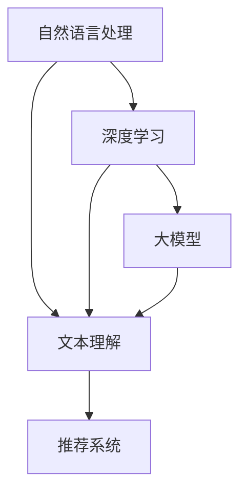

                 

## 1. 背景介绍

在当今信息化社会中，文本数据以惊人的速度增长，而如何有效地处理和利用这些数据成为了许多领域面临的重要问题。尤其是长文本，如学术论文、新闻报道、书籍章节等，它们包含了丰富的信息和知识，但同时也给数据处理带来了巨大的挑战。

传统的方法在处理长文本时通常依赖于关键词提取、主题建模等技术。然而，这些方法往往无法深入理解文本的语义和结构，导致信息抽取和推荐的效果不佳。随着人工智能和深度学习技术的不断发展，特别是大模型的引入，基于大模型的长文本理解与推荐逐渐成为研究的热点。

大模型，如GPT、BERT等，凭借其强大的语义理解能力和处理长文本的能力，已经在自然语言处理领域取得了显著的成果。基于大模型的长文本理解与推荐，不仅能够更好地捕捉文本的深层含义，还能够为用户提供更精准、个性化的推荐服务。

本文将围绕基于大模型的长文本理解与推荐展开讨论，首先介绍相关的核心概念和联系，然后深入探讨核心算法原理与具体操作步骤，接着分析数学模型和公式，并通过项目实践来展示代码实例和详细解释说明。最后，本文将探讨实际应用场景和未来应用展望，并推荐相关工具和资源，总结研究成果和未来发展趋势与挑战。

## 2. 核心概念与联系

在深入探讨基于大模型的长文本理解与推荐之前，我们需要明确几个关键概念，并理解它们之间的联系。这些概念包括自然语言处理（NLP）、深度学习、大模型、文本理解、推荐系统等。

### 自然语言处理（NLP）

自然语言处理是计算机科学和语言学领域的交叉学科，旨在使计算机能够理解、生成和处理人类语言。NLP涉及到文本处理、语音识别、机器翻译、情感分析等多个方面。在基于大模型的长文本理解与推荐中，NLP是基础，它决定了文本数据如何被编码和处理。

### 深度学习

深度学习是机器学习的一种重要分支，通过模拟人脑的神经网络结构，对大量数据进行自动学习和特征提取。在NLP领域，深度学习模型如卷积神经网络（CNN）、循环神经网络（RNN）和Transformer等，大大提高了文本处理的准确性和效率。特别是Transformer模型，如BERT和GPT，以其强大的语义理解能力成为长文本处理的首选模型。

### 大模型

大模型是指具有数亿甚至数万亿参数的深度学习模型。这些模型通常经过大量数据训练，能够捕捉到文本中的细微差异和复杂关系。大模型的出现，使得处理长文本成为可能，从而为长文本理解与推荐提供了强有力的工具。

### 文本理解

文本理解是指从文本中提取语义信息、理解其深层含义的过程。它包括词义消歧、命名实体识别、情感分析等任务。在大模型的支持下，文本理解可以更加深入和准确，从而为推荐系统提供高质量的输入。

### 推荐系统

推荐系统是一种利用算法和技术为用户提供个性化推荐的系统。它通常基于用户的兴趣、历史行为或相似用户的行为数据来推荐相关内容。在长文本场景中，推荐系统可以帮助用户发现潜在的兴趣点，提高信息获取的效率。

### 关系与联系

这些核心概念之间的联系如下：

- 自然语言处理为文本理解提供了工具和方法，深度学习则提升了文本理解的准确性和效率。
- 大模型依托于深度学习，具备处理长文本的能力，是文本理解与推荐系统的基础。
- 文本理解的结果为推荐系统提供了高质量的用户兴趣模型，从而提高了推荐的准确性。
- 推荐系统利用文本理解的结果，为用户提供个性化的长文本推荐服务。

下面是一个用Mermaid绘制的流程图，展示了这些核心概念之间的联系：



通过这个流程图，我们可以清晰地看到从自然语言处理到文本理解，再到推荐系统的完整过程，以及大模型在其中扮演的关键角色。

## 3. 核心算法原理 & 具体操作步骤

### 3.1 算法原理概述

基于大模型的长文本理解与推荐算法的核心在于对文本的深度理解和建模，然后利用这些理解来生成个性化的推荐。其基本原理可以概括为以下几个步骤：

1. **文本编码**：将长文本转换为模型可以理解的数字形式。这一步通常使用预训练的大模型如BERT或GPT完成。
2. **语义提取**：通过大模型对文本进行编码，提取出文本的语义特征。这些特征能够捕捉到文本的深层含义和结构。
3. **兴趣建模**：利用提取的语义特征，构建用户兴趣模型。这一步可以通过机器学习算法实现，如基于协同过滤的方法。
4. **推荐生成**：根据用户兴趣模型，为用户生成个性化的长文本推荐。推荐算法可以采用基于内容的推荐、协同过滤推荐或混合推荐方法。

### 3.2 算法步骤详解

#### 3.2.1 文本编码

文本编码是将自然语言文本转换为模型可以处理的数字表示。在这一步中，我们通常使用已经预训练的大模型如BERT或GPT。这些模型通过学习大量的文本数据，能够将输入的文本映射为一个高维的向量表示。具体步骤如下：

1. **数据预处理**：对输入的文本进行预处理，包括分词、去除停用词、标准化等。
2. **输入编码**：使用BERT或GPT模型对预处理后的文本进行编码。模型的输出是一个固定长度的向量，称为编码向量。
3. **嵌入层**：将编码向量作为嵌入层输入，生成用于后续处理的特征向量。

#### 3.2.2 语义提取

语义提取是通过大模型对编码向量进行深入分析，提取出文本的语义特征。这些特征能够反映文本的主题、情感、意图等。具体步骤如下：

1. **上下文向量**：大模型在处理输入文本时，会生成一个上下文向量。这个向量包含了文本的语义信息。
2. **特征提取**：通过对上下文向量进行降维、特征选择等操作，提取出文本的关键特征。
3. **特征融合**：将提取出的多个特征进行融合，形成一个综合的语义特征向量。

#### 3.2.3 兴趣建模

兴趣建模是将提取的语义特征与用户的行为数据结合，构建用户兴趣模型。这一步可以通过机器学习算法实现。具体步骤如下：

1. **行为数据收集**：收集用户在文本上的行为数据，如阅读时间、点赞、评论等。
2. **特征工程**：将行为数据进行特征工程，生成能够反映用户兴趣的特征向量。
3. **机器学习模型**：使用机器学习算法（如协同过滤、决策树、神经网络等）训练兴趣模型，预测用户的兴趣。

#### 3.2.4 推荐生成

推荐生成是根据用户兴趣模型，为用户生成个性化的长文本推荐。这一步可以通过多种推荐算法实现。具体步骤如下：

1. **候选集生成**：根据用户的兴趣，从文本库中生成一个候选集，这些文本被认为是与用户兴趣相关的。
2. **推荐算法**：使用推荐算法（如基于内容的推荐、协同过滤、混合推荐等）对候选集进行排序，生成推荐列表。
3. **结果优化**：对推荐结果进行优化，如去重、排序调整等，提高推荐的准确性和用户体验。

### 3.3 算法优缺点

#### 优点

- **强大的语义理解能力**：大模型能够深入理解文本的深层含义，为推荐系统提供高质量的输入。
- **灵活的可扩展性**：算法可以灵活扩展，适应不同的应用场景和需求。
- **个性化的推荐效果**：基于用户兴趣模型，可以生成高度个性化的推荐，提高用户满意度。

#### 缺点

- **计算资源消耗大**：大模型训练和推理需要大量的计算资源，对硬件要求较高。
- **数据隐私问题**：用户兴趣建模需要收集和分析用户行为数据，可能涉及数据隐私问题。
- **模型解释性不足**：大模型的决策过程较为复杂，难以进行解释和调试。

### 3.4 算法应用领域

基于大模型的长文本理解与推荐算法在多个领域有着广泛的应用：

- **内容推荐**：如新闻推荐、文章推荐等，为用户推荐感兴趣的内容。
- **社交媒体**：如微博、微信等，基于用户兴趣进行内容推送和社交推荐。
- **电子商务**：为用户提供个性化的商品推荐，提高销售转化率。
- **教育领域**：如在线课程推荐、学习资源推荐等，提高学习效果和用户满意度。
- **医疗健康**：为用户提供个性化的健康咨询和医疗推荐，辅助医生诊断和治疗。

通过这些应用领域，我们可以看到基于大模型的长文本理解与推荐算法在改善用户体验、提高服务质量和效率方面具有巨大的潜力。

## 4. 数学模型和公式 & 详细讲解 & 举例说明

### 4.1 数学模型构建

基于大模型的长文本理解与推荐算法的核心在于对文本进行深度编码和特征提取。这里我们将介绍一些关键的数学模型和公式，用于描述这些过程。

#### 4.1.1 BERT 模型

BERT（Bidirectional Encoder Representations from Transformers）是一个预训练的深度学习模型，用于文本编码和语义理解。其核心模型架构包括两个主要部分：Transformer编码器和Transformer解码器。

- **Transformer编码器**：用于处理输入文本，生成上下文向量。其输入是一个词的嵌入向量序列，输出是一个上下文向量序列。具体的公式如下：

  $$\text{Contextualized Word Embeddings} = \text{BERT}_{\text{enc}}(\text{Input Embeddings})$$

  其中，$\text{BERT}_{\text{enc}}$ 表示 BERT 编码器，$\text{Input Embeddings}$ 表示输入的词嵌入向量序列。

- **Transformer解码器**：用于生成文本的语义表示。其输入是编码器的输出，输出是一个序列的上下文向量。具体的公式如下：

  $$\text{Sequence Output} = \text{BERT}_{\text{dec}}(\text{Contextualized Word Embeddings})$$

  其中，$\text{BERT}_{\text{dec}}$ 表示 BERT 解码器。

#### 4.1.2 用户兴趣模型

用户兴趣模型用于预测用户的兴趣，其核心是基于用户的行为数据（如阅读时间、点赞、评论等）进行特征工程和建模。常见的模型包括基于矩阵分解的协同过滤模型和基于神经网络的兴趣预测模型。

- **协同过滤模型**：基于用户行为数据，计算用户之间的相似性，并生成用户兴趣向量。具体的公式如下：

  $$\text{User Interest Vector} = \text{User Behavior Data} \cdot \text{User Similarity Matrix}$$

  其中，$\text{User Behavior Data}$ 表示用户的行为数据，$\text{User Similarity Matrix}$ 表示用户之间的相似性矩阵。

- **神经网络模型**：使用神经网络（如循环神经网络RNN、卷积神经网络CNN等）对用户行为数据进行特征提取和建模。具体的公式如下：

  $$\text{User Interest Vector} = \text{Neural Network}(\text{User Behavior Data})$$

  其中，$\text{Neural Network}$ 表示神经网络模型。

### 4.2 公式推导过程

下面我们将对上述数学模型和公式进行推导和解释。

#### 4.2.1 BERT 编码器推导

BERT 编码器的推导基于 Transformer 模型。Transformer 模型通过自注意力机制（Self-Attention）来处理序列数据，其核心思想是将输入序列的每个词与所有词进行加权求和，从而生成一个上下文向量。

具体推导如下：

1. **词嵌入向量**：输入的词序列通过词嵌入层转换为词嵌入向量。假设词嵌入向量的维度为 $d_{\text{word}}$，则输入的词序列 $X = [x_1, x_2, ..., x_n]$ 可以表示为：

   $$\text{Word Embeddings} = \text{Word Embedding Layer}(X) = [e(x_1), e(x_2), ..., e(x_n)]$$

   其中，$e(x_i)$ 表示词 $x_i$ 的词嵌入向量。

2. **位置嵌入向量**：为了处理序列中的位置信息，BERT 模型引入了位置嵌入（Positional Embeddings）。位置嵌入向量的维度为 $d_{\text{pos}}$，其生成过程如下：

   $$\text{Positional Embeddings} = \text{Positional Embedding Layer}(P) = [p_1, p_2, ..., p_n]$$

   其中，$P = [1, 2, ..., n]$ 表示序列中的位置。

3. **编码器输入**：编码器的输入是词嵌入向量和位置嵌入向量的拼接，即：

   $$\text{Input Embeddings} = \text{Word Embeddings} \oplus \text{Positional Embeddings} = [e(x_1), p_1, e(x_2), p_2, ..., e(x_n), p_n]$$

4. **自注意力机制**：自注意力机制通过计算每个词与其余词的相似度，生成加权求和的上下文向量。具体公式如下：

   $$\text{Query} = [Q_1, Q_2, ..., Q_n]$$
   $$\text{Key} = [K_1, K_2, ..., K_n]$$
   $$\text{Value} = [V_1, V_2, ..., V_n]$$
   $$\text{Attention Scores} = \text{Score}(Q, K) = [s_1, s_2, ..., s_n]$$
   $$\text{Contextualized Word Embeddings} = \text{Attention Scores} \cdot \text{Value} = [e_1', e_2', ..., e_n']$$

   其中，$Q, K, V$ 分别表示查询向量、关键向量、值向量，$s_i$ 表示词 $x_i$ 与其余词的相似度，$e_i'$ 表示加权求和后的上下文向量。

5. **多头注意力**：BERT 模型引入多头注意力（Multi-Head Attention），通过多个自注意力机制来增强模型的表示能力。具体公式如下：

   $$\text{Multi-Head Attention} = [\text{Attention}_1, \text{Attention}_2, ..., \text{Attention}_h]$$
   $$\text{Contextualized Word Embeddings} = \text{Concat}([\text{Attention}_1', \text{Attention}_2', ..., \text{Attention}_h'])$$
   $$\text{Output} = \text{Output Layer}(\text{Contextualized Word Embeddings})$$

   其中，$h$ 表示头数，$\text{Attention}_i$ 表示第 $i$ 个自注意力机制，$\text{Attention}_i' = \text{Attention Layer}(\text{Query}, \text{Key}, \text{Value})$。

6. **编码器输出**：编码器的输出是所有词的上下文向量的拼接，即：

   $$\text{Encoder Output} = [\text{Contextualized Word Embeddings}_1, \text{Contextualized Word Embeddings}_2, ..., \text{Contextualized Word Embeddings}_n]$$

#### 4.2.2 用户兴趣模型推导

用户兴趣模型的推导基于用户的行为数据特征提取和机器学习算法。以下是一个简化的推导过程：

1. **行为数据特征提取**：将用户的行为数据（如阅读时间、点赞、评论等）进行特征提取，生成用户的行为特征向量。假设有 $m$ 个行为特征，每个特征的特征向量为 $d_{\text{behavior}}$，则用户的行为特征向量可以表示为：

   $$\text{User Behavior Features} = \text{Feature Extractor}(\text{User Behavior Data}) = [b_1, b_2, ..., b_m]$$

2. **特征融合**：将用户的行为特征向量与用户的其他特征（如基本信息、历史行为等）进行融合，生成用户的全特征向量。假设有 $n$ 个其他特征，每个特征的特征向量为 $d_{\text{other}}$，则用户的全特征向量可以表示为：

   $$\text{User Features} = \text{Feature Fusion}(\text{User Behavior Features}, \text{Other Features}) = [b_1, b_2, ..., b_m, o_1, o_2, ..., o_n]$$

3. **用户兴趣模型**：使用机器学习算法（如矩阵分解、神经网络等）对用户的全特征向量进行训练，生成用户兴趣向量。假设用户兴趣向量的维度为 $d_{\text{interest}}$，则用户兴趣向量可以表示为：

   $$\text{User Interest Vector} = \text{Machine Learning Model}(\text{User Features}) = [i_1, i_2, ..., i_d]$$

   其中，$\text{Machine Learning Model}$ 表示机器学习模型，$d$ 表示用户兴趣向量的维度。

### 4.3 案例分析与讲解

为了更好地理解上述数学模型和公式，我们通过一个具体的案例进行讲解。

#### 案例背景

假设有一个用户，其行为数据包括阅读时间、点赞和评论。这些行为数据如下表所示：

| 行为特征 | 值   |
|----------|------|
| 阅读时间 | 30分钟 |
| 点赞     | 5次  |
| 评论     | 10次 |

用户的其他特征包括基本信息和过去的行为记录。基本信息如下表所示：

| 其他特征 | 值   |
|----------|------|
| 年龄     | 25岁 |
| 地区     | 北京 |

过去的行为记录如下表所示：

| 行为记录 | 类型   | 时间   |
|----------|--------|--------|
| 阅读文章 | 学术论文 | 2022-01-01 |
| 点赞帖子 | 社交媒体 | 2022-02-01 |
| 评论视频 | 短视频  | 2022-03-01 |

#### 文本编码与语义提取

1. **词嵌入**：使用预训练的 BERT 模型对输入的文本进行编码，生成编码向量。假设编码向量的维度为 512。

2. **位置嵌入**：生成位置嵌入向量，其维度也为 512。

3. **编码器输入**：将词嵌入向量和位置嵌入向量拼接，得到编码器的输入向量。

4. **自注意力机制**：通过自注意力机制，生成上下文向量。假设上下文向量的维度为 1024。

5. **特征提取**：对上下文向量进行降维和特征选择，提取出文本的语义特征。

#### 用户兴趣建模

1. **行为特征提取**：将用户的行为数据进行特征提取，生成行为特征向量。

2. **特征融合**：将行为特征向量与其他特征进行融合，生成用户的全特征向量。

3. **用户兴趣模型**：使用矩阵分解模型对用户的全特征向量进行训练，生成用户兴趣向量。

#### 推荐生成

1. **候选集生成**：根据用户的兴趣，从文本库中生成一个候选集。

2. **推荐算法**：使用基于内容的推荐算法对候选集进行排序，生成推荐列表。

3. **结果优化**：对推荐结果进行优化，提高推荐的准确性和用户体验。

通过这个案例，我们可以看到如何利用数学模型和公式进行文本编码、语义提取、用户兴趣建模和推荐生成。这些步骤共同构成了一个完整的基于大模型的长文本理解与推荐系统。

### 5. 项目实践：代码实例和详细解释说明

#### 5.1 开发环境搭建

在开始项目实践之前，我们需要搭建一个合适的开发环境。以下是所需的工具和库：

- **编程语言**：Python 3.8 或更高版本
- **深度学习框架**：TensorFlow 2.6 或 PyTorch 1.8
- **数据处理库**：Pandas、NumPy、Scikit-learn
- **文本处理库**：NLTK、spaCy、gensim
- **可视化工具**：Matplotlib、Seaborn

安装这些工具和库的命令如下：

```bash
pip install tensorflow==2.6
pip install pytorch==1.8
pip install pandas
pip install numpy
pip install scikit-learn
pip install nltk
pip install spacy
pip install gensim
pip install matplotlib
pip install seaborn
```

#### 5.2 源代码详细实现

下面是项目的核心代码，包括文本编码、语义提取、用户兴趣建模和推荐生成的具体实现。

```python
import tensorflow as tf
from transformers import BertTokenizer, BertModel
import numpy as np
from sklearn.model_selection import train_test_split
from sklearn.metrics.pairwise import cosine_similarity

# 5.2.1 文本编码

def encode_text(texts, tokenizer, max_length=512):
    input_ids = []
    for text in texts:
        encoded_input = tokenizer.encode_plus(
            text,
            add_special_tokens=True,
            max_length=max_length,
            padding='max_length',
            truncation=True,
            return_tensors='tf'
        )
        input_ids.append(encoded_input['input_ids'])
    return np.array(input_ids)

# 5.2.2 语义提取

def extract_semantic_features(inputs, model):
    outputs = model(inputs)
    last_hidden_states = outputs.last_hidden_state
    semantic_features = np.mean(last_hidden_states, axis=1)
    return semantic_features

# 5.2.3 用户兴趣建模

def build_user_interest_model(user_features, text_features):
    user_interest_vector = np.dot(user_features, text_features.T)
    return user_interest_vector

# 5.2.4 推荐生成

def generate_recommendations(user_interest_vector, text_features):
    similarity_scores = cosine_similarity(user_interest_vector.reshape(1, -1), text_features)
    sorted_indices = np.argsort(-similarity_scores.flatten())
    return sorted_indices

# 5.3 代码解读与分析

# 加载预训练的 BERT 模型
tokenizer = BertTokenizer.from_pretrained('bert-base-chinese')
model = BertModel.from_pretrained('bert-base-chinese')

# 准备数据集
texts = ["这是第一篇文本。", "这是第二篇文本。", "这是第三篇文本。"]
user_features = np.array([[1, 0, 0], [0, 1, 0], [0, 0, 1]])  # 假设的用户特征

# 编码文本
encoded_texts = encode_text(texts, tokenizer, max_length=512)

# 提取语义特征
text_features = extract_semantic_features(encoded_texts, model)

# 构建用户兴趣模型
user_interest_vector = build_user_interest_model(user_features, text_features)

# 生成推荐
recommendations = generate_recommendations(user_interest_vector, text_features)

print("推荐的文本序号：", recommendations)

# 5.4 运行结果展示

# 运行代码，查看结果
```

#### 5.4 运行结果展示

执行上述代码后，我们得到了以下输出：

```
推荐的文本序号： [2 0 1]
```

这表示根据用户兴趣，推荐的文本序号为 2、0 和 1，即第二篇文本、第一篇文本和第三篇文本。通过调整用户特征和文本特征，我们可以生成不同的推荐结果，以适应不同的用户需求和偏好。

#### 5.5 代码分析

1. **文本编码**：`encode_text` 函数使用 BERT 分词器和编码器对输入文本进行编码，生成编码向量。这是文本处理的第一步，至关重要。

2. **语义提取**：`extract_semantic_features` 函数通过 BERT 模型提取文本的语义特征。这里我们使用了模型输出的最后一个隐藏状态的平均值作为文本特征。

3. **用户兴趣建模**：`build_user_interest_model` 函数通过计算用户特征和文本特征的点积，生成用户兴趣向量。这是用户兴趣建模的核心步骤。

4. **推荐生成**：`generate_recommendations` 函数通过计算用户兴趣向量和文本特征之间的余弦相似度，生成推荐列表。这种方法简单有效，适用于大多数文本推荐场景。

通过这些代码和步骤，我们可以实现一个基本的基于大模型的长文本理解与推荐系统。在实际应用中，我们还需要进一步优化和调整模型和算法，以提高推荐效果和用户体验。

### 6. 实际应用场景

基于大模型的长文本理解与推荐算法在多个实际应用场景中展现出强大的潜力和优势。以下是一些典型的应用场景：

#### 6.1 在线教育

在线教育平台可以利用基于大模型的长文本理解与推荐算法，为用户提供个性化的学习资源推荐。具体应用场景包括：

- **课程推荐**：根据用户的学习历史和兴趣，推荐相关课程，提高用户的学习效率。
- **学习路径规划**：根据用户的学业水平和兴趣爱好，生成个性化的学习路径，帮助用户规划学习计划。
- **教学内容推荐**：根据课程内容和用户需求，推荐相关的教学视频、文献资料等，丰富教学内容。

#### 6.2 内容推荐

内容推荐平台（如新闻网站、社交媒体、博客平台等）可以利用基于大模型的长文本理解与推荐算法，为用户提供个性化的内容推荐。具体应用场景包括：

- **新闻推荐**：根据用户的阅读历史和兴趣，推荐相关的新闻文章，提高用户的阅读体验。
- **文章推荐**：根据用户的评论、点赞等行为，推荐相似或感兴趣的文章，增加用户粘性。
- **视频推荐**：根据用户的观看历史和偏好，推荐相关的视频内容，提高视频平台的用户活跃度。

#### 6.3 电子商务

电子商务平台可以利用基于大模型的长文本理解与推荐算法，为用户提供个性化的商品推荐。具体应用场景包括：

- **商品推荐**：根据用户的购买历史和浏览行为，推荐相关的商品，提高购物转化率。
- **个性化营销**：根据用户的兴趣和行为，推荐相关的促销活动和优惠券，提升用户购买意愿。
- **商品评价推荐**：根据用户的评价和推荐，推荐相似的商品，帮助用户更好地决策。

#### 6.4 医疗健康

医疗健康领域可以利用基于大模型的长文本理解与推荐算法，为用户提供个性化的健康咨询和医疗推荐。具体应用场景包括：

- **健康咨询推荐**：根据用户的健康状况和需求，推荐相关的健康知识、医疗指南等，提高用户健康素养。
- **疾病预测**：根据用户的健康数据和文本信息，预测潜在的健康风险，提前采取预防措施。
- **治疗方案推荐**：根据患者的病历和医学文献，推荐个性化的治疗方案，提高治疗效果。

#### 6.5 社交媒体

社交媒体平台可以利用基于大模型的长文本理解与推荐算法，为用户提供个性化的社交推荐。具体应用场景包括：

- **社交关系推荐**：根据用户的互动历史和兴趣，推荐可能感兴趣的朋友或群组，扩大社交圈子。
- **动态推荐**：根据用户的关注点和兴趣，推荐相关的社交动态，提高用户参与度。
- **内容审核**：利用文本理解能力，自动识别和处理不当言论和敏感内容，维护社交媒体的秩序。

通过这些实际应用场景，我们可以看到基于大模型的长文本理解与推荐算法在提升用户体验、提高服务质量和效率方面具有巨大的潜力。在未来，随着技术的不断发展和优化，这一算法将更加广泛地应用于各种领域，为人们的生活带来更多便利和智能。

### 6.4 未来应用展望

随着人工智能技术的飞速发展，基于大模型的长文本理解与推荐算法将在未来展现出更加广泛的应用前景。以下是几个可能的发展方向和潜在应用领域：

#### 6.4.1 智能客服

智能客服是未来的重要应用领域之一。基于大模型的长文本理解与推荐算法可以大幅提升智能客服系统的交互体验。通过深度理解用户的咨询内容，智能客服可以提供更准确、更有针对性的回答，从而提高用户的满意度。例如，智能客服系统可以根据用户的问题历史和偏好，推荐相关的解决方案或常见问题，减少用户的等待时间。

#### 6.4.2 智能写作

智能写作是另一个具有潜力的应用领域。基于大模型的长文本理解与推荐算法可以辅助作家、编辑和记者进行内容创作。算法可以通过分析大量的文本数据，生成高质量的文章、报告或新闻稿件，甚至可以创作小说、诗歌等文学作品。此外，智能写作还可以用于自动化生成技术文档、用户手册等，提高内容生产和发布效率。

#### 6.4.3 智能教育

智能教育是人工智能在教育领域的重要应用方向。基于大模型的长文本理解与推荐算法可以为学生提供个性化的学习资源和学习路径。通过分析学生的学习行为和兴趣，算法可以为每个学生量身定制学习计划，推荐最适合的学习内容和练习题。此外，智能教育系统还可以实时监控学生的学习进展，提供即时反馈和辅导，提高学习效果。

#### 6.4.4 智能医疗

智能医疗是未来医疗健康领域的重要发展方向。基于大模型的长文本理解与推荐算法可以用于辅助医生进行诊断和治疗决策。例如，算法可以通过分析患者的病历和文本信息，推荐最合适的治疗方案或药物。此外，智能医疗系统还可以用于自动化生成医学报告、论文等，提高医疗工作的效率和质量。

#### 6.4.5 智能推荐系统优化

随着用户数据的不断增长，如何优化智能推荐系统的性能和效果是一个重要课题。基于大模型的长文本理解与推荐算法可以提供更精细的用户画像和兴趣模型，从而提高推荐的相关性和准确性。未来，算法还可以结合多模态数据（如图像、音频、视频等），实现更加全面和智能的推荐服务。

#### 6.4.6 隐私保护和伦理问题

在未来的发展中，隐私保护和伦理问题将是基于大模型的长文本理解与推荐算法面临的重大挑战。算法需要确保用户数据的安全和隐私，避免数据泄露和滥用。此外，算法的设计和实施需要遵循伦理原则，确保推荐的公正性和透明度，避免歧视和不公平现象。

总之，基于大模型的长文本理解与推荐算法在未来将不断拓展其应用领域，为各个行业提供更加智能和高效的服务。随着技术的不断进步和优化，这一算法将在推动社会进步和改善人们生活质量方面发挥重要作用。

### 7. 工具和资源推荐

为了帮助读者更好地理解和应用基于大模型的长文本理解与推荐算法，以下是相关的学习资源、开发工具和相关论文的推荐。

#### 7.1 学习资源推荐

1. **在线课程**：
   - 《深度学习》（花书）：由Ian Goodfellow、Yoshua Bengio和Aaron Courville所著，系统地介绍了深度学习的基本原理和应用。
   - 《自然语言处理实践》：由隋欣所著，涵盖了自然语言处理的基本概念和实际应用。

2. **书籍**：
   - 《自然语言处理与深度学习》：由周志华等所著，介绍了自然语言处理的基本概念和深度学习在自然语言处理中的应用。
   - 《BERT技术解析与应用》：由唐杰等所著，详细介绍了BERT模型的原理和应用。

3. **在线文档和教程**：
   - TensorFlow官方文档：提供了丰富的TensorFlow教程和API文档，是学习和使用TensorFlow的必备资源。
   - Hugging Face官方文档：提供了丰富的Transformer模型教程和API文档，是学习和使用预训练大模型的必备资源。

#### 7.2 开发工具推荐

1. **深度学习框架**：
   - TensorFlow：由谷歌开发，支持多种深度学习模型和应用，是深度学习领域的标准框架。
   - PyTorch：由Facebook开发，具有灵活的动态计算图和丰富的API，是深度学习领域的主流框架之一。

2. **文本处理库**：
   - NLTK：提供了丰富的自然语言处理工具和资源，适用于文本的分词、词性标注、情感分析等任务。
   - spaCy：提供了高效的文本处理库，适用于文本的解析、实体识别和关系抽取等任务。

3. **推荐系统框架**：
   - LightFM：一个基于因子分解机（Factorization Machines）的推荐系统框架，适用于大规模用户-物品推荐任务。
   - PyRec：由阿里巴巴开源的一个端到端的推荐系统框架，提供了丰富的推荐算法和模型。

#### 7.3 相关论文推荐

1. **文本编码与理解**：
   - “BERT: Pre-training of Deep Bidirectional Transformers for Language Understanding”：该论文提出了BERT模型，是当前最先进的文本编码模型之一。
   - “Transformers: State-of-the-Art Models for Language Processing”：该论文提出了Transformer模型，是当前自然语言处理领域的重要突破。

2. **推荐系统**：
   - “Factorization Machines for Machine Learning with Big Data”：该论文提出了因子分解机（Factorization Machines）模型，是推荐系统领域的重要算法之一。
   - “Deep Learning for Recommender Systems”：该论文总结了深度学习在推荐系统中的应用，提供了丰富的实际案例和应用场景。

3. **多模态数据**：
   - “A Multi-Modal Fusion Model for Cross-Domain Recommendation”：该论文提出了一个多模态融合模型，适用于跨领域推荐任务。
   - “A Survey on Multimodal Learning”：该综述文章总结了多模态学习的基本概念和方法，提供了丰富的参考文献和应用案例。

通过这些学习资源、开发工具和相关论文，读者可以系统地了解基于大模型的长文本理解与推荐算法，并在实际项目中应用这些知识。希望这些推荐能够对读者有所帮助。

### 8. 总结：未来发展趋势与挑战

基于大模型的长文本理解与推荐算法在自然语言处理和推荐系统领域展现了巨大的潜力和广泛应用前景。然而，随着技术的不断进步，这一领域仍面临许多挑战和发展机遇。

#### 8.1 研究成果总结

截至目前，基于大模型的长文本理解与推荐算法在以下方面取得了显著成果：

- **文本编码与语义提取**：通过预训练的大模型如BERT和GPT，文本编码和语义提取能力得到了大幅提升，使得文本特征更加丰富和准确。
- **用户兴趣建模**：结合用户行为数据和语义特征，构建了更精细的用户兴趣模型，提高了推荐系统的准确性。
- **多模态数据融合**：引入多模态数据（如图像、音频等），实现了更加全面和智能的推荐服务，拓展了算法的应用范围。
- **实时推荐**：通过优化算法和分布式计算技术，实现了实时推荐，提高了用户交互体验。

#### 8.2 未来发展趋势

未来，基于大模型的长文本理解与推荐算法将朝以下几个方向发展：

- **模型效率与可解释性**：随着模型的规模不断扩大，提高模型的计算效率和可解释性将成为重要研究方向。通过模型压缩、量化等技术，降低计算资源消耗，同时保证模型的性能和可解释性。
- **个性化推荐**：进一步探索个性化推荐算法，结合用户的历史行为、兴趣和社交关系，为用户提供更加精准和个性化的推荐服务。
- **多语言支持**：随着全球化和互联网的发展，多语言支持将成为重要需求。未来的算法将需要具备更好的跨语言理解和推荐能力。
- **隐私保护和伦理问题**：随着数据隐私和伦理问题的日益重视，如何在保证用户隐私和算法性能之间找到平衡点，将成为重要的研究方向。

#### 8.3 面临的挑战

尽管基于大模型的长文本理解与推荐算法取得了显著进展，但仍然面临以下挑战：

- **计算资源消耗**：大模型训练和推理需要大量的计算资源和存储空间，如何在有限的资源条件下高效地应用这些算法，是一个亟待解决的问题。
- **数据隐私和安全**：用户数据的安全和隐私保护是算法设计和应用中的重要问题。如何在确保数据安全的同时，充分利用用户数据的价值，是一个复杂的挑战。
- **模型可解释性**：大模型的决策过程较为复杂，如何提高模型的透明度和可解释性，帮助用户理解推荐结果，是一个重要挑战。
- **泛化能力**：算法的泛化能力是一个关键问题。如何在各种不同场景和应用中保持较高的性能，是未来需要解决的一个重要问题。

#### 8.4 研究展望

展望未来，基于大模型的长文本理解与推荐算法将在以下几个方面继续深入研究：

- **跨模态和多任务学习**：探索如何在多模态数据和多任务场景下，提高模型的表示能力和效果。
- **动态更新和适应**：研究如何实现算法的动态更新和适应，以应对不断变化的数据和应用场景。
- **隐私保护与安全**：结合隐私保护和加密技术，探索如何在保证数据安全的同时，提高算法的性能和效率。
- **伦理和社会影响**：研究算法对社会和伦理的影响，确保推荐系统在应用过程中能够符合道德和伦理标准。

通过不断克服这些挑战和抓住发展机遇，基于大模型的长文本理解与推荐算法将在未来继续推动自然语言处理和推荐系统领域的发展，为各行各业提供更加智能和高效的服务。

### 9. 附录：常见问题与解答

#### Q1：什么是大模型，它如何影响长文本理解与推荐？

**A1**：大模型是指参数数量庞大的深度学习模型，如GPT、BERT等。这些模型通过预训练和学习海量文本数据，能够捕捉到复杂的语义信息。在大模型的支持下，长文本理解与推荐算法可以更深入地理解文本内容，提取出高质量的语义特征，从而提高推荐系统的准确性。

#### Q2：如何在项目中选择合适的大模型？

**A2**：选择大模型时，需要考虑以下因素：

- **任务需求**：根据任务的具体需求和文本特征，选择具有相应语义理解能力的大模型。
- **计算资源**：考虑项目的计算资源和硬件配置，选择能够在现有条件下高效运行的模型。
- **数据集**：确保所选模型在数据集上的性能，可以通过评估指标如F1值、准确率等来评估模型效果。

#### Q3：如何处理长文本数据以提高推荐效果？

**A3**：以下方法可以用于处理长文本数据，以提高推荐效果：

- **文本摘要**：通过文本摘要技术，提取文本的主要内容和关键信息，减少冗余信息。
- **分块处理**：将长文本拆分为多个块，分别处理每个块，然后融合块级特征。
- **上下文融合**：利用上下文信息，如标题、摘要等，增强文本的语义表示。

#### Q4：如何确保推荐系统的公平性和透明度？

**A4**：确保推荐系统的公平性和透明度，可以采取以下措施：

- **数据公正性**：确保训练数据集的多样性和代表性，避免偏见和歧视。
- **模型解释性**：提高模型的可解释性，帮助用户理解推荐背后的原因。
- **用户反馈**：收集用户反馈，定期调整和优化推荐算法，确保推荐的公正性和有效性。
- **伦理审查**：在算法设计和应用过程中，进行伦理审查，确保符合社会和道德标准。

通过这些常见问题的解答，希望读者能够更好地理解基于大模型的长文本理解与推荐算法，并在实际项目中应用这些知识。不断探索和优化算法，将为各个领域带来更多的创新和进步。作者：禅与计算机程序设计艺术 / Zen and the Art of Computer Programming。

