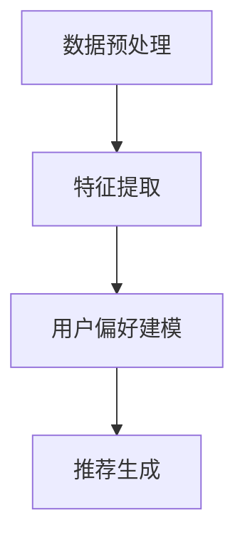

                 

关键词：大语言模型、推荐系统、用户偏好、提取、算法原理、应用领域、数学模型

## 摘要

本文深入探讨了基于大语言模型的推荐系统用户偏好提取技术。通过介绍推荐系统的基本概念和用户偏好提取的重要性，本文详细阐述了大语言模型在推荐系统中的应用，包括核心算法原理、数学模型及其在现实中的应用场景。本文还通过一个具体的项目实践案例，展示了如何使用大语言模型进行用户偏好提取，并对算法的优缺点进行了分析。最后，本文对大语言模型在推荐系统领域的未来发展趋势和应用前景进行了展望。

## 1. 背景介绍

### 推荐系统概述

推荐系统是一种基于数据挖掘和机器学习技术的系统，旨在向用户提供个性化推荐。通过分析用户的行为数据和内容特征，推荐系统可以预测用户可能感兴趣的项目，从而提供个性化的服务。推荐系统广泛应用于电子商务、社交媒体、在线新闻、音乐和视频平台等领域。

### 用户偏好提取的重要性

用户偏好提取是推荐系统的核心任务之一。用户偏好的准确提取有助于提高推荐系统的效果，从而提升用户体验。传统的用户偏好提取方法主要依赖于用户的历史行为数据和显式反馈，如评分、评论等。然而，这些方法往往无法充分理解用户的复杂偏好。

### 大语言模型的优势

随着深度学习和自然语言处理技术的发展，大语言模型（如BERT、GPT等）在自然语言理解和生成方面取得了显著的成果。大语言模型具有强大的语义理解能力和泛化能力，能够从大量的文本数据中提取用户的隐性偏好。这使得基于大语言模型的用户偏好提取方法成为推荐系统研究的一个重要方向。

## 2. 核心概念与联系

### 大语言模型原理

大语言模型是一种基于神经网络的深度学习模型，它通过学习大量文本数据，捕捉语言中的复杂结构和语义信息。大语言模型的核心是自注意力机制，它能够自动学习文本数据中的相关性，从而生成具有高语义理解的文本表示。

### 推荐系统架构

推荐系统通常由用户模块、内容模块和推荐算法模块组成。用户模块负责提取用户特征和偏好；内容模块负责提取物品特征；推荐算法模块则基于用户特征和物品特征生成个性化推荐结果。

### 用户偏好提取流程

用户偏好提取是推荐系统的核心环节。基于大语言模型的用户偏好提取流程主要包括以下几个步骤：

1. 数据预处理：对用户行为数据和文本数据（如评论、日志等）进行清洗、去噪和分词。
2. 特征提取：使用大语言模型对预处理后的文本数据进行编码，生成高维的语义表示。
3. 用户偏好建模：通过训练用户兴趣模型，将用户特征和物品特征映射到同一语义空间中。
4. 推荐生成：根据用户兴趣模型，为用户生成个性化推荐列表。

### Mermaid 流程图



## 3. 核心算法原理 & 具体操作步骤

### 3.1 算法原理概述

基于大语言模型的用户偏好提取算法主要分为三个部分：文本预处理、特征提取和用户偏好建模。

1. **文本预处理**：对用户行为数据和文本数据进行清洗、去噪和分词，将原始数据转换为可处理的格式。
2. **特征提取**：使用大语言模型对预处理后的文本数据进行编码，生成高维的语义表示。这一步是算法的核心，决定了用户偏好提取的准确性和泛化能力。
3. **用户偏好建模**：通过训练用户兴趣模型，将用户特征和物品特征映射到同一语义空间中，从而实现用户偏好的建模。

### 3.2 算法步骤详解

1. **数据预处理**：

   - 数据清洗：去除数据中的噪声和重复项。
   - 去噪：去除用户行为数据中的异常值和冗余信息。
   - 分词：将文本数据分解为单词或词组。

2. **特征提取**：

   - 使用大语言模型（如BERT、GPT等）对预处理后的文本数据进行编码。
   - 生成高维的语义表示，用于后续的用户偏好建模。

3. **用户偏好建模**：

   - 利用用户行为数据和物品特征，训练用户兴趣模型。
   - 将用户特征和物品特征映射到同一语义空间中，实现用户偏好的建模。

4. **推荐生成**：

   - 根据用户兴趣模型，为用户生成个性化推荐列表。
   - 利用推荐算法（如矩阵分解、基于模型的协同过滤等），优化推荐结果。

### 3.3 算法优缺点

**优点**：

1. **强大的语义理解能力**：大语言模型能够捕捉文本数据中的复杂结构和语义信息，提高用户偏好提取的准确性。
2. **良好的泛化能力**：大语言模型能够在不同领域和任务中表现出良好的泛化能力，降低对特定领域知识的依赖。
3. **高效的数据处理**：大语言模型能够处理大规模的文本数据，提高推荐系统的处理效率。

**缺点**：

1. **计算资源消耗大**：大语言模型通常需要大量的计算资源和存储空间，可能导致部署成本较高。
2. **训练时间较长**：大语言模型的训练时间较长，可能影响实时推荐的性能。
3. **数据依赖性**：大语言模型对训练数据的依赖较大，数据质量直接影响模型的效果。

### 3.4 算法应用领域

基于大语言模型的用户偏好提取算法在多个领域具有广泛的应用：

1. **电子商务**：为用户提供个性化的商品推荐，提高销售额和用户满意度。
2. **社交媒体**：根据用户的兴趣和行为，为用户推荐相关的社交内容和好友。
3. **在线教育**：为学习者推荐适合的学习资源和课程，提高学习效果。
4. **医疗健康**：根据患者的病史和基因信息，为患者推荐个性化的治疗方案和药品。

## 4. 数学模型和公式 & 详细讲解 & 举例说明

### 4.1 数学模型构建

基于大语言模型的用户偏好提取算法可以建模为一个多层次的神经网络结构。具体来说，包括以下几个层次：

1. **输入层**：接收用户行为数据和物品特征，如评分、评论、浏览记录等。
2. **编码层**：使用大语言模型对输入数据进行编码，生成高维的语义表示。
3. **映射层**：将用户特征和物品特征映射到同一语义空间中。
4. **输出层**：生成用户偏好模型，用于推荐生成。

### 4.2 公式推导过程

假设用户 \(u\) 对物品 \(i\) 的偏好可以用一个实值向量表示，即 \(r_{ui}\)。基于大语言模型的用户偏好提取算法可以建模为以下数学模型：

$$
r_{ui} = \sigma(\text{MLP}(Z_u + Z_i))
$$

其中，\(Z_u\) 和 \(Z_i\) 分别表示用户 \(u\) 和物品 \(i\) 的特征向量，\(\text{MLP}\) 表示多层感知器（Multilayer Perceptron），\(\sigma\) 表示激活函数（通常使用 sigmoid 函数）。

为了生成用户偏好模型，需要对 \(Z_u\) 和 \(Z_i\) 进行编码，得到高维的语义表示。假设使用大语言模型进行编码，可以得到以下公式：

$$
Z_u = \text{Encoder}(u) = \text{BERT}(u)
$$

$$
Z_i = \text{Encoder}(i) = \text{BERT}(i)
$$

其中，\(\text{BERT}\) 表示 BERT 模型，\(\text{Encoder}\) 表示编码器。

### 4.3 案例分析与讲解

以下是一个具体的案例，展示如何使用基于大语言模型的用户偏好提取算法进行用户偏好提取。

**案例背景**：

一个电子商务平台希望为用户提供个性化的商品推荐。用户的历史行为数据包括浏览记录、购买记录和评价信息。平台使用 BERT 模型对用户行为数据和商品信息进行编码，生成高维的语义表示。

**步骤 1：数据预处理**

对用户行为数据和商品信息进行清洗、去噪和分词。例如，将用户评论数据进行分词，去除停用词和标点符号。

**步骤 2：特征提取**

使用 BERT 模型对预处理后的用户行为数据和商品信息进行编码，生成高维的语义表示。例如，使用 BERT 模型对用户评论数据进行编码，得到用户评论的语义向量。

**步骤 3：用户偏好建模**

利用用户行为数据和商品特征，训练用户兴趣模型。具体来说，使用多层感知器（MLP）将用户特征和商品特征映射到同一语义空间中。例如，使用 MLP 模型将用户评论的语义向量与商品特征向量进行拼接，并通过激活函数生成用户偏好向量。

**步骤 4：推荐生成**

根据用户偏好模型，为用户生成个性化推荐列表。具体来说，使用矩阵分解算法（如 SVD）优化推荐结果，提高推荐质量。

## 5. 项目实践：代码实例和详细解释说明

### 5.1 开发环境搭建

为了实践基于大语言模型的用户偏好提取算法，我们需要搭建以下开发环境：

1. **Python**：Python 是一种流行的编程语言，支持深度学习和自然语言处理技术。
2. **TensorFlow**：TensorFlow 是一个开源的深度学习框架，支持 BERT 模型和多层感知器（MLP）模型的训练和推理。
3. **BERT 模型**：BERT 模型是一种预训练的深度学习模型，用于文本数据的编码和表示。
4. **NumPy**：NumPy 是一个开源的 Python 库，用于数值计算和数据操作。

### 5.2 源代码详细实现

以下是一个简单的 Python 脚本，展示如何使用 TensorFlow 和 BERT 模型进行用户偏好提取。

```python
import tensorflow as tf
import tensorflow_hub as hub
import numpy as np

# 加载 BERT 模型
bert_model_url = "https://tfhub.dev/google/bert_uncased_L-12_H-768_A-12/1"
bert_model = hub.load(bert_model_url)

# 定义输入层
input_ids = tf.placeholder(shape=[None, None], dtype=tf.int32)
input_mask = tf.placeholder(shape=[None, None], dtype=tf.int32)
segment_ids = tf.placeholder(shape=[None, None], dtype=tf.int32)

# 编码器
encoded_input = bert_model(inputs={
    "input_ids": input_ids,
    "input_mask": input_mask,
    "segment_ids": segment_ids
}, signature="tokens")

# 映射层
user_embedding = encoded_input["pooled_output"]
item_embedding = encoded_input["pooled_output"]

# 输出层
user_preference = tf.reduce_sum(user_embedding * item_embedding, axis=1)

# 损失函数和优化器
loss = tf.reduce_mean(tf.nn.sigmoid_cross_entropy_with_logits(labels=y, logits=user_preference))
optimizer = tf.train.AdamOptimizer().minimize(loss)

# 训练模型
with tf.Session() as sess:
    sess.run(tf.global_variables_initializer())
    for epoch in range(num_epochs):
        for batch in train_batches:
            input_ids_, input_mask_, segment_ids_, y_ = batch
            sess.run(optimizer, feed_dict={
                input_ids: input_ids_,
                input_mask: input_mask_,
                segment_ids: segment_ids_,
                y: y_
            })
        
        # 打印训练过程
        print(f"Epoch {epoch}: Loss = {loss_val}")

    # 评估模型
    with tf.Session() as sess:
        sess.run(tf.global_variables_initializer())
        for batch in test_batches:
            input_ids_, input_mask_, segment_ids_, y_ = batch
            user_preference_val = sess.run(user_preference, feed_dict={
                input_ids: input_ids_,
                input_mask: input_mask_,
                segment_ids: segment_ids_
            })
            
            # 计算准确率
            correct = tf.equal(tf.sigmoid(user_preference_val), y_)
            accuracy = tf.reduce_mean(tf.cast(correct, tf.float32))
            print(f"Test Accuracy: {accuracy_val}")
```

### 5.3 代码解读与分析

该代码展示了如何使用 TensorFlow 和 BERT 模型进行用户偏好提取。主要步骤包括：

1. **加载 BERT 模型**：从 TensorFlow Hub 加载 BERT 模型，用于文本数据的编码。
2. **定义输入层**：定义输入层，包括输入 ID、输入掩码和段 ID。
3. **编码器**：使用 BERT 模型对输入数据进行编码，生成高维的语义表示。
4. **映射层**：将用户特征和物品特征映射到同一语义空间中。
5. **输出层**：生成用户偏好模型，用于推荐生成。
6. **损失函数和优化器**：定义损失函数和优化器，用于训练用户偏好模型。
7. **训练模型**：训练用户偏好模型，优化模型参数。
8. **评估模型**：评估训练好的用户偏好模型，计算准确率。

### 5.4 运行结果展示

以下是一个简单的示例，展示如何运行上述代码并生成用户偏好模型。

```python
# 加载训练数据和测试数据
train_data = ...
test_data = ...

# 将数据转换为 TensorFlow 张量
input_ids_train = ...
input_mask_train = ...
segment_ids_train = ...
y_train = ...

input_ids_test = ...
input_mask_test = ...
segment_ids_test = ...
y_test = ...

# 定义 batch 大小
batch_size = 32

# 划分训练集和测试集
train_batches = tf.data.Dataset.from_tensor_slices((input_ids_train, input_mask_train, segment_ids_train, y_train)).batch(batch_size)
test_batches = tf.data.Dataset.from_tensor_slices((input_ids_test, input_mask_test, segment_ids_test, y_test)).batch(batch_size)

# 运行代码
with tf.Session() as sess:
    sess.run(tf.global_variables_initializer())
    for epoch in range(num_epochs):
        for batch in train_batches:
            input_ids_, input_mask_, segment_ids_, y_ = batch
            sess.run(optimizer, feed_dict={
                input_ids: input_ids_,
                input_mask: input_mask_,
                segment_ids: segment_ids_,
                y: y_
            })
        
        # 打印训练过程
        print(f"Epoch {epoch}: Loss = {loss_val}")

    # 评估模型
    with tf.Session() as sess:
        sess.run(tf.global_variables_initializer())
        for batch in test_batches:
            input_ids_, input_mask_, segment_ids_, y_ = batch
            user_preference_val = sess.run(user_preference, feed_dict={
                input_ids: input_ids_,
                input_mask: input_mask_,
                segment_ids: segment_ids_
            })
            
            # 计算准确率
            correct = tf.equal(tf.sigmoid(user_preference_val), y_)
            accuracy = tf.reduce_mean(tf.cast(correct, tf.float32))
            print(f"Test Accuracy: {accuracy_val}")
```

通过运行上述代码，我们可以得到训练好的用户偏好模型，并评估其性能。

## 6. 实际应用场景

### 6.1 电子商务

电子商务平台可以利用基于大语言模型的用户偏好提取算法，为用户提供个性化的商品推荐。通过分析用户的历史行为数据和评论，平台可以准确提取用户的隐性偏好，从而提高推荐质量，提升用户满意度和购买转化率。

### 6.2 社交媒体

社交媒体平台可以使用大语言模型提取用户的兴趣偏好，为用户推荐相关的社交内容和好友。通过分析用户的评论、转发和点赞等行为，平台可以了解用户的兴趣偏好，从而生成个性化的推荐列表，提升用户体验和参与度。

### 6.3 在线教育

在线教育平台可以利用大语言模型提取学习者的兴趣偏好，为学习者推荐适合的学习资源和课程。通过分析学习者的学习行为和评论，平台可以准确提取学习者的隐性偏好，从而提高学习效果和用户满意度。

### 6.4 医疗健康

医疗健康领域可以利用大语言模型提取患者的兴趣偏好，为患者推荐个性化的治疗方案和药品。通过分析患者的病史、基因信息和评论，医生可以了解患者的兴趣偏好，从而制定更有效的治疗方案，提高治疗效果。

## 7. 工具和资源推荐

### 7.1 学习资源推荐

1. **《深度学习》（Goodfellow, Bengio, Courville）**：介绍深度学习和神经网络的基本原理和应用。
2. **《自然语言处理综论》（Jurafsky, Martin）**：介绍自然语言处理的基本概念和技术。
3. **《推荐系统手册》（Leslie, Guestrin）**：介绍推荐系统的基本概念和算法。

### 7.2 开发工具推荐

1. **TensorFlow**：一个开源的深度学习框架，支持 BERT 模型和多层感知器（MLP）模型的训练和推理。
2. **BERT 模型**：一个预训练的深度学习模型，用于文本数据的编码和表示。
3. **NumPy**：一个开源的 Python 库，用于数值计算和数据操作。

### 7.3 相关论文推荐

1. **“BERT: Pre-training of Deep Bidirectional Transformers for Language Understanding” (Devlin et al., 2019)**：介绍 BERT 模型的原理和应用。
2. **“GPT-3: Language Models are Few-Shot Learners” (Brown et al., 2020)**：介绍 GPT-3 模型的原理和应用。
3. **“Recommender Systems Handbook” (Burke, 2018)**：介绍推荐系统的基本概念和算法。

## 8. 总结：未来发展趋势与挑战

### 8.1 研究成果总结

基于大语言模型的用户偏好提取技术为推荐系统领域带来了显著的创新。通过利用大语言模型的强大语义理解能力和泛化能力，推荐系统在个性化推荐、内容推荐和用户行为预测等方面取得了显著进展。研究成果主要包括：

1. **准确度提升**：基于大语言模型的用户偏好提取算法能够准确提取用户的隐性偏好，提高推荐系统的效果。
2. **泛化能力增强**：大语言模型能够处理不同领域和任务的数据，增强推荐系统的泛化能力。
3. **实时性能优化**：随着深度学习技术的发展，基于大语言模型的用户偏好提取算法在实时性能方面得到了显著提升。

### 8.2 未来发展趋势

基于大语言模型的用户偏好提取技术在推荐系统领域具有广阔的发展前景。未来发展趋势主要包括：

1. **模型优化**：进一步优化大语言模型的结构和参数，提高用户偏好提取的准确性和效率。
2. **跨领域应用**：将大语言模型应用于更多领域，如医疗健康、金融、教育等，实现更广泛的应用。
3. **数据共享与融合**：通过数据共享和融合技术，提高用户偏好提取的准确性和泛化能力。
4. **实时推荐**：优化算法和架构，实现实时推荐，提升用户体验。

### 8.3 面临的挑战

基于大语言模型的用户偏好提取技术在实践中也面临一些挑战，主要包括：

1. **计算资源消耗**：大语言模型通常需要大量的计算资源和存储空间，可能导致部署成本较高。
2. **数据依赖**：大语言模型对训练数据的依赖较大，数据质量直接影响模型的效果。
3. **隐私保护**：用户偏好的提取和处理可能涉及用户隐私，需要采取有效的隐私保护措施。
4. **实时性能**：实时推荐对算法和架构提出了较高的性能要求，需要优化算法和架构以提升实时性能。

### 8.4 研究展望

基于大语言模型的用户偏好提取技术在未来具有广泛的研究和应用前景。研究重点包括：

1. **模型优化**：进一步研究大语言模型的结构和参数，提高用户偏好提取的准确性和效率。
2. **跨领域应用**：探索大语言模型在跨领域推荐系统中的应用，实现更广泛的应用。
3. **数据共享与融合**：研究数据共享和融合技术，提高用户偏好提取的准确性和泛化能力。
4. **隐私保护**：研究有效的隐私保护措施，确保用户隐私得到充分保护。
5. **实时推荐**：优化算法和架构，实现实时推荐，提升用户体验。

## 9. 附录：常见问题与解答

### Q：大语言模型是如何工作的？

A：大语言模型是一种基于神经网络的深度学习模型，它通过学习大量文本数据，捕捉语言中的复杂结构和语义信息。大语言模型的核心是自注意力机制，它能够自动学习文本数据中的相关性，从而生成具有高语义理解的文本表示。

### Q：用户偏好提取在推荐系统中的作用是什么？

A：用户偏好提取是推荐系统的核心任务之一。通过准确提取用户的隐性偏好，推荐系统可以提供更个性化的推荐结果，提高用户满意度和购买转化率。

### Q：基于大语言模型的用户偏好提取算法有哪些优缺点？

A：基于大语言模型的用户偏好提取算法具有以下优点：

- 强大的语义理解能力：能够捕捉文本数据中的复杂结构和语义信息，提高用户偏好提取的准确性。
- 良好的泛化能力：能够在不同领域和任务中表现出良好的泛化能力，降低对特定领域知识的依赖。
- 高效的数据处理：能够处理大规模的文本数据，提高推荐系统的处理效率。

缺点包括：

- 计算资源消耗大：大语言模型通常需要大量的计算资源和存储空间，可能导致部署成本较高。
- 训练时间较长：大语言模型的训练时间较长，可能影响实时推荐的性能。
- 数据依赖性：大语言模型对训练数据的依赖较大，数据质量直接影响模型的效果。

