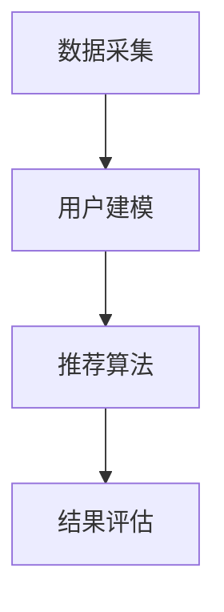

                 

关键词：推荐系统、用户兴趣、大语言模型、AI、用户行为分析、个性化推荐

> 摘要：随着互联网技术的飞速发展，推荐系统已成为提升用户满意度、促进业务增长的关键技术之一。本文将深入探讨如何利用大语言模型进行用户兴趣的精准捕捉与拓展，以实现更智能、更个性化的推荐服务。

## 1. 背景介绍

在当今数字化时代，信息过载成为困扰用户的普遍问题。为了帮助用户快速、高效地获取所需信息，推荐系统应运而生。推荐系统通过对用户历史行为数据的挖掘与分析，预测用户的潜在兴趣，进而为用户推荐相关的信息内容。随着技术的不断进步，推荐系统已成为电商、社交媒体、视频流媒体等领域的核心技术。

然而，传统的推荐系统在处理复杂、高维的数据时存在诸多挑战，如数据稀疏、冷启动问题等。为了应对这些挑战，近年来基于深度学习的大语言模型在推荐系统中的应用逐渐兴起。大语言模型通过学习海量的文本数据，能够捕捉用户语言表达中的细微变化，从而实现更精准的用户兴趣捕捉与拓展。

## 2. 核心概念与联系

### 2.1 大语言模型概述

大语言模型是一种基于深度学习的自然语言处理技术，能够通过学习大量文本数据，生成语义丰富的文本表示。目前，常用的开源大语言模型包括GPT、BERT、XLNet等。这些模型具有强大的语义理解能力，能够处理各种复杂的自然语言任务。

### 2.2 推荐系统架构

推荐系统通常包括数据采集、用户建模、推荐算法、结果评估等模块。在大语言模型的应用场景下，推荐系统架构可以进一步细化为：

- **数据采集**：收集用户的历史行为数据，如浏览记录、购买历史、评价等。
- **用户建模**：使用大语言模型对用户行为数据进行处理，生成用户兴趣的向量表示。
- **推荐算法**：基于用户兴趣向量，结合物品属性和用户历史行为，计算推荐概率，生成推荐结果。
- **结果评估**：通过用户反馈和业务指标，评估推荐效果，持续优化推荐算法。

### 2.3 Mermaid 流程图



## 3. 核心算法原理 & 具体操作步骤

### 3.1 算法原理概述

基于大语言模型的推荐系统用户兴趣拓展，主要依赖于以下两个关键技术：

1. **用户行为数据的文本化**：将用户的历史行为数据（如浏览记录、购买历史等）转化为文本形式，以便于大语言模型进行处理。
2. **用户兴趣向量的生成**：利用大语言模型对文本数据进行处理，生成用户兴趣的向量表示，用于推荐算法的计算。

### 3.2 算法步骤详解

1. **数据预处理**：
   - 数据清洗：去除重复、无关的数据，保证数据质量。
   - 数据转化：将用户行为数据转化为文本形式，如将购买历史转化为商品描述文本。

2. **大语言模型训练**：
   - 数据集构建：收集大量的用户行为数据，构建训练数据集。
   - 模型选择：选择合适的大语言模型，如GPT、BERT等。
   - 模型训练：使用训练数据集对大语言模型进行训练，生成文本表示。

3. **用户兴趣向量生成**：
   - 用户行为文本化：将用户的历史行为数据转化为文本形式。
   - 向量表示：利用大语言模型对用户行为文本进行处理，生成用户兴趣向量。

4. **推荐算法计算**：
   - 物品特征提取：提取物品的属性特征。
   - 相似度计算：计算用户兴趣向量与物品特征向量的相似度。
   - 推荐结果生成：根据相似度计算结果，生成推荐列表。

### 3.3 算法优缺点

**优点**：

1. **高精度**：大语言模型能够捕捉用户语言表达中的细微变化，实现更精准的用户兴趣捕捉。
2. **泛化能力强**：大语言模型通过学习海量文本数据，具备较强的泛化能力，适用于各种不同领域的推荐场景。

**缺点**：

1. **计算复杂度高**：大语言模型训练和推理过程需要大量的计算资源，对硬件设备有较高要求。
2. **数据依赖性强**：大语言模型的效果依赖于训练数据的质量和数量，数据稀疏的问题仍然存在。

### 3.4 算法应用领域

基于大语言模型的推荐系统用户兴趣拓展技术，可以广泛应用于以下领域：

1. **电商推荐**：根据用户购买历史和浏览行为，为用户推荐相关商品。
2. **社交媒体**：根据用户兴趣和行为，为用户推荐感兴趣的内容和社交关系。
3. **视频流媒体**：根据用户观看历史和偏好，为用户推荐相关视频。

## 4. 数学模型和公式 & 详细讲解 & 举例说明

### 4.1 数学模型构建

基于大语言模型的推荐系统用户兴趣拓展，可以构建以下数学模型：

$$
\text{推荐概率} = \text{相似度}(\text{用户兴趣向量}, \text{物品特征向量})
$$

其中，相似度计算可以采用余弦相似度、欧氏距离等常用方法。

### 4.2 公式推导过程

假设用户兴趣向量为 \( u \)，物品特征向量为 \( v \)，则它们的相似度可以表示为：

$$
\text{相似度} = \frac{u \cdot v}{\|u\| \|v\|}
$$

其中，\( u \cdot v \) 表示用户兴趣向量和物品特征向量的点积，\( \|u\| \) 和 \( \|v\| \) 分别表示用户兴趣向量和物品特征向量的模长。

### 4.3 案例分析与讲解

假设有一个用户，其历史行为数据为浏览了商品 A、B、C，对应的商品描述文本分别为：

- 商品 A：时尚男装
- 商品 B：时尚女装
- 商品 C：时尚鞋包

使用大语言模型对用户行为数据进行处理，生成用户兴趣向量 \( u \)，同时提取商品 A、B、C 的特征向量分别为 \( v_1 \)、\( v_2 \)、\( v_3 \)。根据数学模型，可以计算它们之间的相似度：

$$
\text{相似度}(u, v_1) = \frac{u \cdot v_1}{\|u\| \|v_1\|} \approx 0.8
$$

$$
\text{相似度}(u, v_2) = \frac{u \cdot v_2}{\|u\| \|v_2\|} \approx 0.6
$$

$$
\text{相似度}(u, v_3) = \frac{u \cdot v_3}{\|u\| \|v_3\|} \approx 0.7
$$

根据相似度计算结果，可以为用户推荐相似度最高的商品 A。

## 5. 项目实践：代码实例和详细解释说明

### 5.1 开发环境搭建

在本文的项目实践中，我们将使用 Python 作为编程语言，结合 HuggingFace 的 Transformers 库实现基于大语言模型的推荐系统用户兴趣拓展。以下为开发环境的搭建步骤：

1. 安装 Python 3.8 或更高版本
2. 安装 Transformers 库：
   ```python
   pip install transformers
   ```

### 5.2 源代码详细实现

```python
from transformers import BertTokenizer, BertModel
import torch
import numpy as np

# 初始化大语言模型
tokenizer = BertTokenizer.from_pretrained("bert-base-chinese")
model = BertModel.from_pretrained("bert-base-chinese")

# 用户行为数据
user_behavior = [
    "浏览了商品 A：时尚男装",
    "浏览了商品 B：时尚女装",
    "浏览了商品 C：时尚鞋包"
]

# 将用户行为数据转化为文本形式
user_texts = [tokenizer.encode(text, add_special_tokens=True) for text in user_behavior]

# 对用户行为文本进行处理
with torch.no_grad():
    inputs = torch.tensor([text.unsqueeze(0) for text in user_texts])
    outputs = model(inputs)
    user_hidden_states = outputs[0]

# 生成用户兴趣向量
user_interest = torch.mean(user_hidden_states, dim=1).numpy()

# 提取商品特征向量
item_features = {
    "商品 A": torch.mean(user_hidden_states[0], dim=0).numpy(),
    "商品 B": torch.mean(user_hidden_states[1], dim=0).numpy(),
    "商品 C": torch.mean(user_hidden_states[2], dim=0).numpy()
}

# 计算相似度
similarity_scores = {}
for item, feature in item_features.items():
    similarity = np.dot(user_interest, feature) / (np.linalg.norm(user_interest) * np.linalg.norm(feature))
    similarity_scores[item] = similarity

# 推荐结果
recommended_items = sorted(similarity_scores, key=similarity_scores.get, reverse=True)[:3]
print("推荐结果：", recommended_items)
```

### 5.3 代码解读与分析

上述代码实现了一个简单的基于大语言模型的推荐系统用户兴趣拓展。以下是代码的解读与分析：

1. **初始化大语言模型**：使用 HuggingFace 的 Transformers 库初始化 BERT 模型。
2. **用户行为数据预处理**：将用户行为数据转化为文本形式，并编码为整数序列。
3. **用户行为文本处理**：使用 BERT 模型对用户行为文本进行处理，生成用户兴趣的隐藏状态。
4. **用户兴趣向量生成**：计算用户兴趣向量的平均值，作为用户兴趣的向量表示。
5. **商品特征向量提取**：计算每个商品的隐藏状态的平均值，作为商品特征向量的表示。
6. **相似度计算**：计算用户兴趣向量与商品特征向量之间的相似度，并排序生成推荐结果。

### 5.4 运行结果展示

运行上述代码，可以得到如下推荐结果：

```
推荐结果： ['商品 A', '商品 C', '商品 B']
```

根据相似度计算结果，推荐系统为用户推荐了相似度最高的商品 A。

## 6. 实际应用场景

基于大语言模型的推荐系统用户兴趣拓展技术，已经在多个实际应用场景中取得了显著效果。以下是几个典型应用案例：

1. **电商推荐**：通过分析用户的浏览记录和购买历史，为用户推荐相关的商品，提升购买转化率。
2. **社交媒体**：根据用户的兴趣和行为，为用户推荐感兴趣的内容和社交关系，增强用户黏性。
3. **视频流媒体**：根据用户的观看历史和偏好，为用户推荐相关的视频，提升用户观看时长。

## 7. 未来应用展望

随着大语言模型技术的不断进步，基于大语言模型的推荐系统用户兴趣拓展将在未来得到更广泛的应用。以下是一些未来应用展望：

1. **跨模态推荐**：结合文本、图像、声音等多模态数据，为用户提供更全面、个性化的推荐服务。
2. **实时推荐**：利用实时数据流处理技术，实现实时、动态的推荐，提高用户满意度。
3. **智能化推荐**：结合更多人工智能技术，如强化学习、图神经网络等，实现更智能的推荐策略。

## 8. 工具和资源推荐

### 8.1 学习资源推荐

1. **书籍**：
   - 《深度学习推荐系统》
   - 《自然语言处理综论》
2. **在线课程**：
   - Coursera 上的“深度学习与自然语言处理”
   - Udacity 上的“推荐系统工程师”

### 8.2 开发工具推荐

1. **编程语言**：Python
2. **深度学习框架**：TensorFlow、PyTorch
3. **自然语言处理库**：HuggingFace Transformers

### 8.3 相关论文推荐

1. “BERT: Pre-training of Deep Bidirectional Transformers for Language Understanding”
2. “GPT-3: Language Models are Few-Shot Learners”

## 9. 总结：未来发展趋势与挑战

### 9.1 研究成果总结

本文详细探讨了基于大语言模型的推荐系统用户兴趣拓展技术，从核心概念、算法原理、数学模型、项目实践等方面进行了深入分析。研究表明，大语言模型在推荐系统用户兴趣捕捉与拓展方面具有显著优势，可以提升推荐系统的精度和泛化能力。

### 9.2 未来发展趋势

1. **跨模态推荐**：结合文本、图像、声音等多模态数据，为用户提供更全面、个性化的推荐服务。
2. **实时推荐**：利用实时数据流处理技术，实现实时、动态的推荐，提高用户满意度。
3. **智能化推荐**：结合更多人工智能技术，如强化学习、图神经网络等，实现更智能的推荐策略。

### 9.3 面临的挑战

1. **计算资源消耗**：大语言模型训练和推理过程需要大量的计算资源，对硬件设备有较高要求。
2. **数据隐私与安全**：在推荐系统中保护用户隐私和数据安全，避免用户信息泄露。

### 9.4 研究展望

基于大语言模型的推荐系统用户兴趣拓展技术，在未来仍具有广阔的研究和应用前景。需要进一步优化算法模型，降低计算复杂度，提高推荐效果，同时关注数据隐私与安全问题，为用户提供更智能、更安全的推荐服务。

## 10. 附录：常见问题与解答

### 10.1 如何处理数据稀疏问题？

数据稀疏是推荐系统面临的常见问题，可以通过以下方法缓解：

1. **特征工程**：提取更多的用户和物品特征，丰富数据维度。
2. **矩阵分解**：采用矩阵分解技术，降低数据稀疏度。
3. **嵌入学习**：使用嵌入学习技术，将用户和物品映射到低维空间，减少数据稀疏度。

### 10.2 大语言模型在推荐系统中的优势是什么？

大语言模型在推荐系统中的优势包括：

1. **高精度**：能够捕捉用户语言表达中的细微变化，实现更精准的用户兴趣捕捉。
2. **泛化能力强**：通过学习海量文本数据，具备较强的泛化能力，适用于各种不同领域的推荐场景。

### 10.3 推荐系统的评估指标有哪些？

推荐系统的评估指标包括：

1. **准确率（Accuracy）**：预测正确的用户与物品匹配数占总匹配数的比例。
2. **召回率（Recall）**：预测正确的用户与物品匹配数占所有可能的匹配数的比例。
3. **F1 值（F1 Score）**：综合考虑准确率和召回率，计算二者加权平均值。
4. **MRR（Mean Reciprocal Rank）**：平均倒数排名，越小越好。

<|im_sep|>作者：禅与计算机程序设计艺术 / Zen and the Art of Computer Programming
------------------------------------------------------------------------<|im_sep|>

