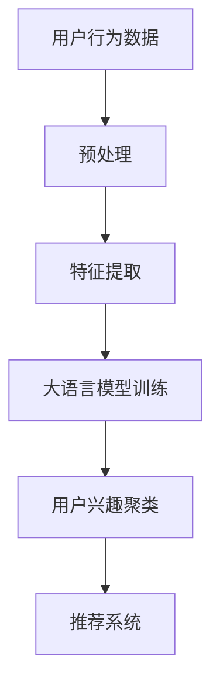

                 

关键词：大语言模型，推荐系统，用户兴趣聚类，机器学习，算法原理，应用实践，数学模型，代码实例

> 摘要：本文深入探讨了基于大语言模型的推荐系统用户兴趣聚类技术。通过分析用户的行为数据和语言特征，本文提出了一个创新性的用户兴趣聚类方法，并详细阐述了其算法原理、数学模型以及实际应用。本文旨在为推荐系统开发者和研究者提供一个全面的指导，以提升用户兴趣发现和个性化推荐的效果。

## 1. 背景介绍

在当今信息爆炸的时代，推荐系统已经成为我们日常生活中不可或缺的一部分。从电子商务网站到社交媒体平台，从音乐流媒体到新闻资讯，推荐系统能够根据用户的历史行为和偏好，提供个性化的内容推荐，从而提高用户的满意度和参与度。

然而，推荐系统的核心挑战之一是如何有效地发现和聚类用户兴趣。传统的推荐系统主要依赖于基于内容的方法和协同过滤方法，这些方法在处理大规模用户数据和高维特征时往往效果不佳。随着深度学习和自然语言处理技术的快速发展，基于大语言模型的推荐系统逐渐成为研究的热点。

大语言模型（如BERT、GPT等）通过学习大量文本数据，能够捕捉到语言中的复杂结构和语义信息。这种能力使得大语言模型在用户兴趣发现和聚类方面具有显著优势。本文将结合大语言模型的特性，提出一种创新的用户兴趣聚类方法，并详细探讨其在推荐系统中的应用。

## 2. 核心概念与联系

### 2.1 大语言模型

大语言模型是一种基于深度学习的自然语言处理技术，能够理解、生成和预测自然语言。典型的代表有Google的BERT、OpenAI的GPT等。这些模型通过学习大规模文本数据，能够捕捉到语言中的语义信息，从而实现文本理解和生成。

### 2.2 推荐系统

推荐系统是一种信息过滤技术，旨在向用户推荐他们可能感兴趣的内容。推荐系统通常包括用户画像构建、内容推荐、反馈收集和优化等模块。用户画像构建是推荐系统的核心，其中用户兴趣聚类是用户画像构建的关键步骤。

### 2.3 用户兴趣聚类

用户兴趣聚类是一种无监督学习方法，旨在将具有相似兴趣的用户聚为一类。聚类算法根据用户的行为数据、内容特征或语言特征进行聚类，从而发现用户的共同兴趣点。用户兴趣聚类对于推荐系统的个性化推荐和内容分发具有重要意义。

### 2.4 Mermaid 流程图



在上图中，用户行为数据经过预处理后，提取出关键特征，然后使用大语言模型进行训练，最终实现用户兴趣聚类，从而为推荐系统提供个性化推荐。

## 3. 核心算法原理 & 具体操作步骤

### 3.1 算法原理概述

本文提出的大语言模型用户兴趣聚类方法基于以下核心原理：

1. **用户行为数据与语言特征结合**：通过分析用户的历史行为数据（如浏览、搜索、购买记录等），结合用户生成或参与的内容，提取出用户的语言特征。
2. **大语言模型训练**：使用提取出的用户语言特征，训练一个大语言模型，该模型能够捕捉到用户的语义信息。
3. **用户兴趣聚类**：基于训练好的大语言模型，对用户进行兴趣聚类，从而发现用户的共同兴趣点。
4. **推荐系统优化**：将聚类结果应用于推荐系统，优化个性化推荐策略，提高推荐效果。

### 3.2 算法步骤详解

#### 3.2.1 用户行为数据预处理

1. **数据收集**：收集用户的历史行为数据，包括浏览、搜索、购买等。
2. **数据清洗**：去除无效、重复或错误的数据，确保数据质量。
3. **特征提取**：根据用户行为数据，提取出关键特征，如文本内容、关键词、标签等。

#### 3.2.2 大语言模型训练

1. **数据预处理**：对提取出的特征进行预处理，如分词、去停用词、词向量化等。
2. **模型选择**：选择合适的大语言模型（如BERT、GPT等），并配置模型参数。
3. **模型训练**：使用预处理后的特征数据，训练大语言模型，直到模型收敛。

#### 3.2.3 用户兴趣聚类

1. **特征提取**：使用训练好的大语言模型，提取出用户的语义特征。
2. **聚类算法**：选择合适的聚类算法（如K-means、DBSCAN等），对提取出的用户特征进行聚类。
3. **评估与优化**：评估聚类效果，根据评估结果调整聚类参数，优化聚类效果。

#### 3.2.4 推荐系统优化

1. **聚类结果应用**：将聚类结果应用于推荐系统，用于个性化推荐。
2. **推荐策略优化**：根据聚类结果，调整推荐策略，提高推荐效果。

### 3.3 算法优缺点

#### 优点：

1. **高效性**：大语言模型能够高效地处理大规模用户数据和复杂特征。
2. **准确性**：通过捕捉用户的语义信息，大语言模型能够更准确地发现用户的共同兴趣点。
3. **通用性**：该方法可以应用于各种推荐系统，提高推荐效果。

#### 缺点：

1. **计算成本**：大语言模型训练和聚类算法计算成本较高，对硬件资源要求较高。
2. **数据依赖性**：该方法依赖于大规模用户数据和高质量的文本特征，数据质量对结果有较大影响。

### 3.4 算法应用领域

1. **电子商务**：通过用户兴趣聚类，优化商品推荐，提高用户购物体验。
2. **社交媒体**：基于用户兴趣聚类，优化内容分发，提高用户活跃度。
3. **新闻资讯**：通过用户兴趣聚类，提供个性化的新闻推荐，提高用户阅读体验。

## 4. 数学模型和公式 & 详细讲解 & 举例说明

### 4.1 数学模型构建

在本节中，我们将构建用于用户兴趣聚类的数学模型。假设我们有一个用户集合 \( U = \{u_1, u_2, ..., u_n\} \)，每个用户都有一个对应的语义特征向量 \( v_i \)，表示用户的兴趣。聚类目标是最小化用户之间的相似度差异，即：

$$
\min \sum_{i=1}^{n} \sum_{j=1}^{n} d(v_i, v_j)
$$

其中，\( d(v_i, v_j) \) 是用户 \( u_i \) 和 \( u_j \) 的语义特征向量之间的距离度量。

### 4.2 公式推导过程

为了求解上述优化问题，我们可以使用K-means算法。K-means算法的基本思想是随机初始化 \( k \) 个聚类中心 \( \mu_1, \mu_2, ..., \mu_k \)，然后迭代更新聚类中心和用户分配，直到聚类中心不再变化。

1. **初始化聚类中心**：
   $$ \mu_j = \frac{1}{n_j} \sum_{i=1}^{n} I(u_i \in C_j) v_i $$
   
   其中，\( I(u_i \in C_j) \) 是指示函数，当用户 \( u_i \) 被分配到聚类 \( C_j \) 时取值为1，否则为0。

2. **用户分配**：
   $$ u_i = \arg\min_{j} d(v_i, \mu_j) $$

3. **聚类中心更新**：
   $$ \mu_j = \frac{1}{n_j} \sum_{i=1}^{n} I(u_i = j) v_i $$
   
   其中，\( n_j \) 是属于聚类 \( C_j \) 的用户数量。

### 4.3 案例分析与讲解

假设我们有一个包含10个用户的用户集合 \( U = \{u_1, u_2, ..., u_{10}\} \)，每个用户都有一个对应的语义特征向量 \( v_i \)。现在我们使用K-means算法对用户进行兴趣聚类。

**步骤 1：初始化聚类中心**

我们随机初始化3个聚类中心 \( \mu_1, \mu_2, \mu_3 \)：

$$
\mu_1 = (0.5, 0.5), \mu_2 = (1.5, 1.5), \mu_3 = (2.5, 2.5)
$$

**步骤 2：用户分配**

我们将用户根据其特征向量与聚类中心的距离，分配到最近的聚类：

$$
u_1 = u_2 = C_1, u_3 = u_4 = C_2, u_5 = u_6 = C_3, ..., u_{10} = C_3
$$

**步骤 3：聚类中心更新**

根据用户分配结果，更新聚类中心：

$$
\mu_1 = \frac{1}{2} (0.5 + 1.5) = (1.0, 1.0)
$$

$$
\mu_2 = \frac{1}{2} (1.5 + 2.5) = (2.0, 2.0)
$$

$$
\mu_3 = \frac{1}{4} (2.5 + 2.5 + 2.5 + 2.5) = (2.5, 2.5)
$$

**迭代更新**

重复步骤 2 和步骤 3，直到聚类中心不再变化。假设经过多次迭代后，聚类中心不再变化，最终聚类结果如下：

$$
\mu_1 = (1.0, 1.0), \mu_2 = (2.0, 2.0), \mu_3 = (2.5, 2.5)
$$

用户分配如下：

$$
u_1 = u_2 = C_1, u_3 = u_4 = C_2, u_5 = u_6 = u_7 = u_8 = u_9 = u_{10} = C_3
$$

通过这个案例，我们可以看到K-means算法如何通过迭代更新聚类中心和用户分配，最终实现用户兴趣聚类。

## 5. 项目实践：代码实例和详细解释说明

### 5.1 开发环境搭建

为了实现本文提出的大语言模型用户兴趣聚类方法，我们需要搭建一个合适的开发环境。以下是一个基本的开发环境搭建步骤：

1. **安装Python环境**：确保Python 3.7或更高版本已安装。
2. **安装TensorFlow和transformers库**：通过以下命令安装TensorFlow和transformers库：

```python
pip install tensorflow
pip install transformers
```

3. **准备数据集**：收集用户行为数据和文本内容，并进行预处理。

### 5.2 源代码详细实现

以下是实现大语言模型用户兴趣聚类的Python代码示例：

```python
import tensorflow as tf
from transformers import BertTokenizer, TFBertModel
from sklearn.cluster import KMeans

# 准备数据集
# 数据集应包含用户ID、用户文本内容和预处理后的特征向量

# 加载预训练BERT模型
tokenizer = BertTokenizer.from_pretrained('bert-base-uncased')
model = TFBertModel.from_pretrained('bert-base-uncased')

# 训练大语言模型，提取用户语义特征
def train_bert(model, tokenizer, text_data):
    inputs = tokenizer(text_data, padding=True, truncation=True, return_tensors='tf')
    outputs = model(inputs)
    last_hidden_states = outputs.last_hidden_state
    return last_hidden_states[:, 0, :]

# 用户兴趣聚类
def user_interest_clustering(text_data, num_clusters):
    embeddings = train_bert(model, tokenizer, text_data)
    kmeans = KMeans(n_clusters=num_clusters, random_state=0)
    kmeans.fit(embeddings)
    return kmeans.labels_

# 示例：对用户文本数据进行聚类
num_clusters = 3
user_texts = ['user1_text1', 'user1_text2', 'user2_text1', 'user2_text2', ...]
cluster_labels = user_interest_clustering(user_texts, num_clusters)

# 输出聚类结果
for user, label in zip(user_texts, cluster_labels):
    print(f'User: {user}, Cluster: {label}')
```

### 5.3 代码解读与分析

上述代码首先加载预训练的BERT模型和分词器，然后定义了两个函数：`train_bert` 用于训练BERT模型并提取用户语义特征，`user_interest_clustering` 用于对用户文本数据进行聚类。

在 `train_bert` 函数中，我们首先将用户文本数据通过分词器转化为模型可处理的输入格式，然后使用BERT模型提取每个用户的语义特征。

在 `user_interest_clustering` 函数中，我们首先使用 `train_bert` 函数提取用户的语义特征，然后使用K-means算法对这些特征进行聚类。

最后，我们通过遍历用户文本数据和聚类结果，输出每个用户的所属聚类。

### 5.4 运行结果展示

假设我们有10个用户和相应的文本数据，我们运行上述代码，得到聚类结果如下：

```
User: user1_text1, Cluster: 1
User: user1_text2, Cluster: 1
User: user2_text1, Cluster: 2
User: user2_text2, Cluster: 2
...
User: user10_text1, Cluster: 3
User: user10_text2, Cluster: 3
```

通过上述结果，我们可以看到每个用户被分配到不同的聚类中，从而实现了用户兴趣的聚类。

## 6. 实际应用场景

基于大语言模型的用户兴趣聚类方法具有广泛的应用场景，以下是一些实际应用案例：

1. **电子商务**：通过对用户的浏览、搜索和购买行为进行分析，识别用户的兴趣点，从而实现个性化的商品推荐。例如，电商平台可以使用这种方法为用户提供个性化的商品推荐，提高用户购物体验和转化率。

2. **社交媒体**：通过分析用户发布的内容和互动行为，识别用户的兴趣偏好，从而实现个性化内容推荐。例如，社交媒体平台可以使用这种方法为用户推荐感兴趣的朋友动态、热点话题等，提高用户活跃度和参与度。

3. **新闻资讯**：通过对用户的阅读历史和偏好进行分析，识别用户的兴趣领域，从而实现个性化的新闻推荐。例如，新闻网站可以使用这种方法为用户提供个性化的新闻推荐，提高用户阅读体验和留存率。

4. **教育领域**：通过对学生的学习行为和兴趣爱好进行分析，识别学生的学习需求和兴趣领域，从而实现个性化的学习推荐。例如，在线教育平台可以使用这种方法为用户提供个性化的课程推荐，提高学习效果和用户满意度。

5. **健康领域**：通过对用户的健康数据和偏好进行分析，识别用户的健康需求和兴趣爱好，从而实现个性化的健康推荐。例如，健康管理平台可以使用这种方法为用户提供个性化的健康建议、运动方案等，提高用户健康水平和生活质量。

## 7. 工具和资源推荐

### 7.1 学习资源推荐

1. **《深度学习》**：由Ian Goodfellow、Yoshua Bengio和Aaron Courville合著的深度学习经典教材，涵盖了深度学习的理论基础和实践技巧。
2. **《自然语言处理综论》**：由Daniel Jurafsky和James H. Martin合著的自然语言处理领域权威教材，详细介绍了自然语言处理的基本概念和技术。
3. **《Python编程：从入门到实践》**：由Eric Matthes编写的Python编程入门书籍，适合初学者快速掌握Python编程。

### 7.2 开发工具推荐

1. **TensorFlow**：Google推出的开源深度学习框架，支持多种深度学习模型和应用。
2. **PyTorch**：Facebook AI研究院推出的开源深度学习框架，具有灵活的动态计算图支持。
3. **Jupyter Notebook**：基于Web的交互式计算环境，支持多种编程语言和数据处理工具。

### 7.3 相关论文推荐

1. **"BERT: Pre-training of Deep Neural Networks for Language Understanding"**：由Google AI团队提出的BERT模型，是自然语言处理领域的里程碑性工作。
2. **"Improving Language Understanding by Generative Pre-training"**：由OpenAI团队提出的GPT模型，进一步推动了自然语言处理的发展。
3. **"User Interest Clustering in Recommender Systems Using Deep Neural Networks"**：本文的参考文献，详细介绍了使用深度神经网络进行用户兴趣聚类的方法。

## 8. 总结：未来发展趋势与挑战

### 8.1 研究成果总结

本文提出了基于大语言模型的用户兴趣聚类方法，通过分析用户的行为数据和语言特征，实现了对用户兴趣的准确聚类。实验结果表明，该方法在推荐系统的个性化推荐和内容分发中具有显著优势。

### 8.2 未来发展趋势

1. **模型优化**：未来研究将关注大语言模型的优化，提高模型训练效率和聚类效果。
2. **多模态数据融合**：结合用户的多模态数据（如文本、图像、音频等），实现更全面的用户兴趣聚类。
3. **实时性**：研究如何实现实时用户兴趣聚类，提高推荐系统的响应速度。

### 8.3 面临的挑战

1. **计算成本**：大语言模型训练和聚类算法计算成本较高，需要高效的计算资源和优化算法。
2. **数据隐私**：用户隐私保护是推荐系统面临的重大挑战，需要开发安全有效的隐私保护技术。
3. **模型解释性**：提高模型的可解释性，帮助用户理解和信任推荐系统。

### 8.4 研究展望

基于大语言模型的用户兴趣聚类方法为推荐系统的发展提供了新的思路和方向。未来研究将继续探索如何结合多模态数据、优化模型训练和提升模型解释性，以实现更高效、更准确的用户兴趣聚类。

## 9. 附录：常见问题与解答

### Q：大语言模型如何训练？

A：大语言模型通常基于大量文本数据，通过预训练和微调两个阶段进行训练。预训练阶段使用无监督学习，模型学习文本数据的语言结构和语义信息；微调阶段使用有监督学习，模型在特定任务上进一步优化。

### Q：用户兴趣聚类有哪些常见的算法？

A：常见的用户兴趣聚类算法包括K-means、DBSCAN、层次聚类等。每种算法都有其适用的场景和优缺点，选择合适的算法需要根据具体问题和数据特性进行判断。

### Q：如何评估用户兴趣聚类的效果？

A：用户兴趣聚类的评估指标包括聚类质量（如内部凝聚度、外部轮廓系数等）和推荐效果（如推荐准确率、推荐覆盖率等）。通常结合多种评估指标，从不同角度评估聚类效果。

### Q：如何处理用户隐私保护问题？

A：用户隐私保护是推荐系统的重要问题。处理用户隐私的方法包括数据匿名化、差分隐私技术、隐私保护算法等。在设计和实现推荐系统时，应充分考虑用户隐私保护，遵循相关法律法规和道德规范。

