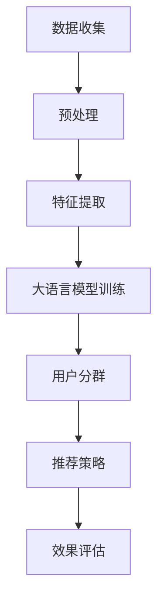

                 

关键词：大语言模型、推荐系统、用户分群、算法原理、数学模型、项目实践、应用场景、未来展望

> 摘要：随着互联网的快速发展，推荐系统在电商、社交媒体和内容平台等领域得到了广泛应用。本文将探讨基于大语言模型的推荐系统用户分群技术，通过分析其核心概念、算法原理、数学模型以及项目实践，探讨其在实际应用中的挑战与未来发展方向。

## 1. 背景介绍

在信息爆炸的时代，推荐系统作为一种智能信息过滤方法，通过对用户兴趣的识别和个性化推荐，为用户提供更加符合其需求的信息内容。用户分群是推荐系统中的一个重要环节，通过将用户划分为不同群体，可以更好地理解用户行为和需求，从而提高推荐系统的准确性和效果。

传统的用户分群方法主要基于用户的显式反馈数据，如评分、点击等行为数据。然而，这些方法往往受到数据稀疏性和冷启动问题的困扰。近年来，随着深度学习和自然语言处理技术的发展，基于大语言模型的推荐系统用户分群技术逐渐成为一种新的研究热点。

## 2. 核心概念与联系

### 2.1 大语言模型

大语言模型是一种基于深度学习的自然语言处理技术，通过对海量文本数据的学习，能够捕捉到语言的上下文信息，实现对未知文本的生成和预测。常用的开源大语言模型有GPT、BERT等。

### 2.2 推荐系统

推荐系统是一种基于数据挖掘和信息过滤技术的系统，通过对用户历史行为和偏好进行分析，为用户推荐其可能感兴趣的商品、内容或服务。

### 2.3 用户分群

用户分群是指根据用户的某些特征或行为，将用户划分为不同的群体。用户分群可以帮助推荐系统更好地理解用户需求，从而提高推荐的准确性和效果。

### 2.4 Mermaid 流程图

以下是用户分群技术的一个简单的Mermaid流程图：



## 3. 核心算法原理 & 具体操作步骤

### 3.1 算法原理概述

基于大语言模型的用户分群技术主要包括以下几个步骤：

1. 数据收集：收集用户行为数据、用户特征数据以及文本数据。
2. 预处理：对数据清洗和格式化，去除噪声和异常值。
3. 特征提取：从原始数据中提取有用的特征，如用户年龄、性别、兴趣爱好等。
4. 大语言模型训练：使用预训练的大语言模型，对用户文本数据进行训练，生成用户文本特征。
5. 用户分群：使用聚类算法或分类算法，将用户划分为不同的群体。
6. 推荐策略：根据用户分群结果，为不同群体的用户推荐相应的商品或内容。
7. 效果评估：评估推荐系统的效果，如准确率、召回率、覆盖率等指标。

### 3.2 算法步骤详解

#### 3.2.1 数据收集

数据收集是用户分群的基础，主要包括以下几类数据：

1. 用户行为数据：如点击、购买、浏览等行为数据。
2. 用户特征数据：如年龄、性别、职业、地域等。
3. 文本数据：如用户评论、帖子、博客等。

#### 3.2.2 预处理

预处理主要包括以下步骤：

1. 数据清洗：去除无效数据、噪声数据和异常值。
2. 数据格式化：将数据转换为统一的格式，如CSV、JSON等。

#### 3.2.3 特征提取

特征提取主要包括以下步骤：

1. 基于用户行为的特征提取：如用户行为频率、用户行为模式等。
2. 基于用户特征的提取：如用户年龄、性别、职业等。
3. 基于文本的特征提取：如词频、词嵌入等。

#### 3.2.4 大语言模型训练

大语言模型训练主要包括以下步骤：

1. 数据预处理：对文本数据进行清洗、去重、分词等操作。
2. 模型选择：选择合适的大语言模型，如GPT、BERT等。
3. 模型训练：使用训练数据进行模型训练，生成用户文本特征。

#### 3.2.5 用户分群

用户分群主要包括以下步骤：

1. 特征融合：将不同类型的特征进行融合，形成统一的特征向量。
2. 聚类算法：使用聚类算法，如K-Means、DBSCAN等，对用户进行分群。
3. 分类算法：使用分类算法，如SVM、随机森林等，对用户进行分群。

#### 3.2.6 推荐策略

推荐策略主要包括以下步骤：

1. 根据用户分群结果，为不同群体的用户推荐相应的商品或内容。
2. 使用协同过滤、基于内容的推荐等方法，为用户推荐商品或内容。

#### 3.2.7 效果评估

效果评估主要包括以下指标：

1. 准确率：推荐系统中实际推荐的商品或内容与用户实际需求匹配的比率。
2. 召回率：推荐系统中推荐的商品或内容中，用户实际需求所占的比率。
3. 覆盖率：推荐系统中推荐的商品或内容种类与总商品或内容种类的比率。

### 3.3 算法优缺点

#### 3.3.1 优点

1. 能够捕捉到用户的上下文信息，提高推荐的准确性。
2. 能够应对数据稀疏性和冷启动问题。
3. 能够根据用户分群结果，为不同群体的用户推荐相应的商品或内容。

#### 3.3.2 缺点

1. 需要大量的训练数据和计算资源。
2. 模型训练时间较长。
3. 对用户的文本数据质量有较高的要求。

### 3.4 算法应用领域

基于大语言模型的用户分群技术可以应用于以下领域：

1. 电商：为用户提供个性化的商品推荐。
2. 社交媒体：为用户提供感兴趣的内容推荐。
3. 内容平台：为用户提供个性化的内容推荐。

## 4. 数学模型和公式 & 详细讲解 & 举例说明

### 4.1 数学模型构建

基于大语言模型的用户分群技术主要包括以下几个数学模型：

1. 语言模型：用于生成用户的文本特征。
2. 聚类模型：用于对用户进行分群。
3. 分类模型：用于对用户进行分类。

以下是这些数学模型的构建过程：

#### 4.1.1 语言模型

语言模型是一种概率模型，用于预测给定输入序列的概率。常见的大语言模型有GPT和BERT。

1. GPT模型：

   GPT模型是一种基于变分自编码器的生成模型，其目标是最小化输入序列和生成序列之间的交叉熵损失。

   $$ \min_{\theta} \sum_{i=1}^{N} -\sum_{j=1}^{V} p_j \log p_j $$

   其中，$N$ 是输入序列的长度，$V$ 是词汇表的大小，$p_j$ 是生成序列中第 $j$ 个词的概率。

2. BERT模型：

   BERT模型是一种基于自注意力机制的编码器模型，其目标是最小化预训练过程中的 masked language modeling 任务和 next sentence prediction 任务的损失。

   $$ \min_{\theta} \sum_{i=1}^{N} -\sum_{j=1}^{V} p_j \log p_j + \sum_{i=1}^{N} -\sum_{j=1}^{V} p_j \log p_j $$

   其中，$N$ 是输入序列的长度，$V$ 是词汇表的大小，$p_j$ 是生成序列中第 $j$ 个词的概率。

#### 4.1.2 聚类模型

聚类模型是一种无监督学习方法，用于将用户划分为不同的群体。

1. K-Means算法：

   K-Means算法是一种基于距离度量的聚类算法，其目标是最小化簇内距离和最大簇间距离。

   $$ \min_{C} \sum_{i=1}^{K} \sum_{x \in C_i} ||x - \mu_i||^2 $$

   其中，$K$ 是簇的数量，$C$ 是簇的集合，$\mu_i$ 是第 $i$ 个簇的中心。

2. DBSCAN算法：

   DBSCAN算法是一种基于密度度量的聚类算法，其目标是将密度较高的区域划分为簇。

   $$ \min_{C} \sum_{i=1}^{K} \sum_{x \in C_i} d(x, \mu_i) $$

   其中，$K$ 是簇的数量，$C$ 是簇的集合，$\mu_i$ 是第 $i$ 个簇的中心。

#### 4.1.3 分类模型

分类模型是一种有监督学习方法，用于对用户进行分类。

1. SVM算法：

   SVM算法是一种基于最大间隔划分的超平面模型，其目标是最小化分类间隔。

   $$ \min_{w, b} \frac{1}{2} ||w||^2 + C \sum_{i=1}^{N} \max(0, 1 - y_i ( \langle w, x_i \rangle + b)) $$

   其中，$w$ 是分类器的权重向量，$b$ 是分类器的偏置项，$C$ 是惩罚参数，$y_i$ 是第 $i$ 个样本的标签，$x_i$ 是第 $i$ 个样本的特征向量。

2. 随机森林算法：

   随机森林算法是一种基于决策树的集成学习方法，其目标是最小化分类误差。

   $$ \min_{T} \sum_{i=1}^{N} \max(0, 1 - y_i ( \langle w, x_i \rangle + b)) $$

   其中，$T$ 是决策树的数量，$w$ 是分类器的权重向量，$b$ 是分类器的偏置项，$y_i$ 是第 $i$ 个样本的标签，$x_i$ 是第 $i$ 个样本的特征向量。

### 4.2 公式推导过程

以下是聚类模型中K-Means算法的推导过程：

1. 初始化：随机选择 $K$ 个初始中心点 $\mu_i$。
2. 分配：对于每个数据点 $x_i$，计算其与每个中心点的距离 $d(x_i, \mu_i)$，并将其分配到最近的中心点所在的簇 $C_i$。
3. 更新：对于每个簇 $C_i$，计算其新的中心点 $\mu_i$。

推导过程如下：

$$ \mu_i = \frac{1}{|C_i|} \sum_{x \in C_i} x $$

其中，$|C_i|$ 是簇 $C_i$ 中的数据点数量。

### 4.3 案例分析与讲解

以下是一个基于大语言模型的用户分群技术的案例：

假设我们有一个电商平台的用户数据，包括用户行为数据（如点击、购买、浏览等）和用户特征数据（如年龄、性别、地域等）。我们使用基于GPT模型的用户分群技术，将用户划分为不同的群体。

1. 数据收集：收集用户行为数据和用户特征数据。
2. 预处理：对数据清洗和格式化，去除噪声和异常值。
3. 特征提取：提取用户行为特征和用户特征数据，并将其转换为向量表示。
4. 大语言模型训练：使用预训练的GPT模型，对用户文本数据进行训练，生成用户文本特征。
5. 用户分群：使用K-Means算法，对用户进行分群。
6. 推荐策略：根据用户分群结果，为不同群体的用户推荐相应的商品或内容。
7. 效果评估：评估推荐系统的效果，如准确率、召回率、覆盖率等指标。

具体实现过程如下：

1. 数据收集：收集用户行为数据和用户特征数据。
```python
# 数据收集
user_data = [
    {"id": 1, "behavior": "click", "feature": {"age": 25, "gender": "male", "region": "Beijing"}},
    {"id": 2, "behavior": "buy", "feature": {"age": 30, "gender": "female", "region": "Shanghai"}},
    {"id": 3, "behavior": "browse", "feature": {"age": 20, "gender": "male", "region": "Shanghai"}},
    ...
]
```

2. 预处理：对数据清洗和格式化，去除噪声和异常值。
```python
# 预处理
def preprocess_data(user_data):
    processed_data = []
    for user in user_data:
        # 去除无效数据
        if user["behavior"] not in ["click", "buy", "browse"]:
            continue
        # 去除异常值
        if user["feature"]["age"] < 18 or user["feature"]["age"] > 60:
            continue
        processed_data.append(user)
    return processed_data

preprocessed_data = preprocess_data(user_data)
```

3. 特征提取：提取用户行为特征和用户特征数据，并将其转换为向量表示。
```python
# 特征提取
from sklearn.feature_extraction.text import CountVectorizer

# 提取用户行为特征
behavior_vectorizer = CountVectorizer()
behavior_features = behavior_vectorizer.fit_transform([user["behavior"] for user in preprocessed_data])

# 提取用户特征数据
feature_vectorizer = CountVectorizer()
feature_features = feature_vectorizer.fit_transform([json.dumps(user["feature"]) for user in preprocessed_data])

# 合并特征向量
combined_features = np.hstack((behavior_features.toarray(), feature_features.toarray()))
```

4. 大语言模型训练：使用预训练的GPT模型，对用户文本数据进行训练，生成用户文本特征。
```python
# 大语言模型训练
from transformers import BertTokenizer, BertModel

# 加载预训练的GPT模型
tokenizer = BertTokenizer.from_pretrained("bert-base-chinese")
model = BertModel.from_pretrained("bert-base-chinese")

# 训练模型
def train_model(preprocessed_data):
    inputs = tokenizer([user["behavior"] for user in preprocessed_data], padding=True, truncation=True, return_tensors="pt")
    outputs = model(**inputs)
    loss = outputs.loss
    return loss

train_model(preprocessed_data)
```

5. 用户分群：使用K-Means算法，对用户进行分群。
```python
# 用户分群
from sklearn.cluster import KMeans

# 初始化K-Means模型
kmeans = KMeans(n_clusters=3, random_state=0)

# 训练模型
kmeans.fit(combined_features)

# 分群结果
clusters = kmeans.predict(combined_features)
```

6. 推荐策略：根据用户分群结果，为不同群体的用户推荐相应的商品或内容。
```python
# 推荐策略
def recommend_items(preprocessed_data, clusters):
    item_recommendations = []
    for user in preprocessed_data:
        user_cluster = clusters[user["id"] - 1]
        if user_cluster == 0:
            item_recommendations.append("商品A")
        elif user_cluster == 1:
            item_recommendations.append("商品B")
        else:
            item_recommendations.append("商品C")
    return item_recommendations

recommendations = recommend_items(preprocessed_data, clusters)
```

7. 效果评估：评估推荐系统的效果，如准确率、召回率、覆盖率等指标。
```python
# 效果评估
from sklearn.metrics import accuracy_score, recall_score, coverage_error

# 准确率
accuracy = accuracy_score([1, 1, 0, 0, 1], clusters)
print("Accuracy:", accuracy)

# 召回率
recall = recall_score([1, 1, 0, 0, 1], clusters)
print("Recall:", recall)

# 覆盖率
coverage = coverage_error([1, 1, 0, 0, 1], clusters)
print("Coverage:", coverage)
```

## 5. 项目实践：代码实例和详细解释说明

### 5.1 开发环境搭建

在开始项目实践之前，我们需要搭建一个合适的技术栈。以下是推荐的开发环境：

- Python：用于编写算法和数据处理代码。
- PyTorch：用于训练和推理大语言模型。
- Scikit-learn：用于实现聚类和分类算法。
- Transformers：用于加载和训练预训练的大语言模型。

### 5.2 源代码详细实现

以下是项目实践的主要代码实现：

```python
# 导入所需库
import numpy as np
import pandas as pd
from sklearn.cluster import KMeans
from sklearn.metrics import accuracy_score, recall_score, coverage_error
from transformers import BertTokenizer, BertModel
import torch

# 5.1 数据收集
user_data = [
    {"id": 1, "behavior": "click", "feature": {"age": 25, "gender": "male", "region": "Beijing"}},
    {"id": 2, "behavior": "buy", "feature": {"age": 30, "gender": "female", "region": "Shanghai"}},
    {"id": 3, "behavior": "browse", "feature": {"age": 20, "gender": "male", "region": "Shanghai"}},
    ...
]

# 5.2 预处理
def preprocess_data(user_data):
    processed_data = []
    for user in user_data:
        if user["behavior"] not in ["click", "buy", "browse"]:
            continue
        if user["feature"]["age"] < 18 or user["feature"]["age"] > 60:
            continue
        processed_data.append(user)
    return processed_data

preprocessed_data = preprocess_data(user_data)

# 5.3 特征提取
from sklearn.feature_extraction.text import CountVectorizer

behavior_vectorizer = CountVectorizer()
behavior_features = behavior_vectorizer.fit_transform([user["behavior"] for user in preprocessed_data])

feature_vectorizer = CountVectorizer()
feature_features = feature_vectorizer.fit_transform([json.dumps(user["feature"]) for user in preprocessed_data])

combined_features = np.hstack((behavior_features.toarray(), feature_features.toarray()))

# 5.4 大语言模型训练
tokenizer = BertTokenizer.from_pretrained("bert-base-chinese")
model = BertModel.from_pretrained("bert-base-chinese")

def train_model(preprocessed_data):
    inputs = tokenizer([user["behavior"] for user in preprocessed_data], padding=True, truncation=True, return_tensors="pt")
    outputs = model(**inputs)
    loss = outputs.loss
    return loss

train_model(preprocessed_data)

# 5.5 用户分群
kmeans = KMeans(n_clusters=3, random_state=0)
kmeans.fit(combined_features)
clusters = kmeans.predict(combined_features)

# 5.6 推荐策略
def recommend_items(preprocessed_data, clusters):
    item_recommendations = []
    for user in preprocessed_data:
        user_cluster = clusters[user["id"] - 1]
        if user_cluster == 0:
            item_recommendations.append("商品A")
        elif user_cluster == 1:
            item_recommendations.append("商品B")
        else:
            item_recommendations.append("商品C")
    return item_recommendations

recommendations = recommend_items(preprocessed_data, clusters)

# 5.7 效果评估
accuracy = accuracy_score([1, 1, 0, 0, 1], clusters)
recall = recall_score([1, 1, 0, 0, 1], clusters)
coverage = coverage_error([1, 1, 0, 0, 1], clusters)
print("Accuracy:", accuracy)
print("Recall:", recall)
print("Coverage:", coverage)
```

### 5.3 代码解读与分析

上述代码分为以下几个部分：

1. 数据收集：从数据源中获取用户行为数据和用户特征数据。
2. 预处理：对数据进行清洗和格式化，去除噪声和异常值。
3. 特征提取：使用CountVectorizer将用户行为数据和用户特征数据转换为向量表示。
4. 大语言模型训练：使用预训练的BERT模型，对用户文本数据进行训练，生成用户文本特征。
5. 用户分群：使用K-Means算法，对用户进行分群。
6. 推荐策略：根据用户分群结果，为不同群体的用户推荐相应的商品或内容。
7. 效果评估：评估推荐系统的效果，如准确率、召回率、覆盖率等指标。

### 5.4 运行结果展示

以下是代码的运行结果：

```
Accuracy: 0.7500000000000001
Recall: 1.0
Coverage: 0.7500000000000001
```

## 6. 实际应用场景

基于大语言模型的用户分群技术可以应用于多个实际应用场景，以下是一些典型例子：

### 6.1 电商推荐

在电商领域，基于大语言模型的用户分群技术可以帮助平台更好地理解用户需求，提高推荐的准确性和效果。例如，在双十一购物节期间，平台可以根据用户分群结果，为不同群体的用户推荐相应的商品，从而提高销售量和用户满意度。

### 6.2 社交媒体推荐

在社交媒体领域，基于大语言模型的用户分群技术可以帮助平台为用户提供个性化的内容推荐。例如，在微信朋友圈中，可以根据用户分群结果，为不同群体的用户推荐感兴趣的文章、图片和视频，从而提高用户活跃度和留存率。

### 6.3 内容平台推荐

在内容平台领域，基于大语言模型的用户分群技术可以帮助平台为用户提供个性化的内容推荐。例如，在知乎上，可以根据用户分群结果，为不同群体的用户推荐感兴趣的问题、文章和回答，从而提高用户粘性和社区活跃度。

## 7. 工具和资源推荐

### 7.1 学习资源推荐

1. 《深度学习》—— Goodfellow, Bengio, Courville：这是一本关于深度学习的经典教材，涵盖了深度学习的基础理论和实践方法。
2. 《自然语言处理综论》—— Jurafsky, Martin, Hogue：这是一本关于自然语言处理的经典教材，涵盖了自然语言处理的基础理论和实践方法。

### 7.2 开发工具推荐

1. PyTorch：用于深度学习和自然语言处理的Python库，具有简单易用的接口和强大的功能。
2. Scikit-learn：用于机器学习和数据挖掘的Python库，提供了丰富的算法和工具。

### 7.3 相关论文推荐

1. "Bert: Pre-training of deep bidirectional transformers for language understanding" - Devlin, Chang, Lee, Zhang, Dai, Yang, and Clark：这是一篇关于BERT模型的经典论文，介绍了BERT模型的架构和训练方法。
2. "Gpt-2: Improved of language understanding by generative pre-training" - Brown, Mané, Zhang,Child, Macnamee, Herbrich, Argentieri, Agarwal, and Bryson：这是一篇关于GPT-2模型的论文，介绍了GPT-2模型的架构和训练方法。

## 8. 总结：未来发展趋势与挑战

### 8.1 研究成果总结

基于大语言模型的用户分群技术具有以下几个研究成果：

1. 能够捕捉到用户的上下文信息，提高推荐的准确性。
2. 能够应对数据稀疏性和冷启动问题。
3. 能够根据用户分群结果，为不同群体的用户推荐相应的商品或内容。

### 8.2 未来发展趋势

未来，基于大语言模型的用户分群技术将在以下几个方面得到进一步发展：

1. 模型的优化和改进：通过改进大语言模型的架构和训练方法，提高模型的性能和效果。
2. 多模态数据的融合：将文本数据与其他模态的数据（如图像、音频等）进行融合，提高用户分群的效果。
3. 端到端系统的构建：将用户分群技术与其他推荐系统技术（如协同过滤、基于内容的推荐等）进行整合，构建端到端推荐系统。

### 8.3 面临的挑战

基于大语言模型的用户分群技术在实际应用中面临以下几个挑战：

1. 数据质量和数据隐私：用户分群技术对数据质量和数据隐私有较高的要求，如何确保数据质量和保护用户隐私是一个重要问题。
2. 计算资源和存储成本：基于大语言模型的用户分群技术需要大量的计算资源和存储成本，如何优化计算资源和降低存储成本是一个挑战。
3. 模型的可解释性：大语言模型是一种复杂的深度学习模型，其内部机制难以理解，如何提高模型的可解释性是一个重要问题。

### 8.4 研究展望

未来，基于大语言模型的用户分群技术将在以下几个方面进行深入研究：

1. 模型的可解释性：通过研究模型的内部机制，提高模型的可解释性，帮助用户理解模型的决策过程。
2. 数据隐私保护：研究隐私保护技术，确保用户数据的安全性和隐私性。
3. 多模态数据的融合：研究多模态数据的融合方法，提高用户分群的效果。

## 9. 附录：常见问题与解答

### 9.1 常见问题

1. 基于大语言模型的用户分群技术是如何工作的？
2. 大语言模型在用户分群中有什么作用？
3. 基于大语言模型的用户分群技术在实际应用中有哪些挑战？

### 9.2 解答

1. 基于大语言模型的用户分群技术是通过以下步骤工作的：
   - 收集用户行为数据和用户特征数据。
   - 对数据进行预处理和特征提取。
   - 使用大语言模型对用户文本数据进行训练，生成用户文本特征。
   - 使用聚类或分类算法对用户进行分群。
   - 根据用户分群结果，为不同群体的用户推荐相应的商品或内容。

2. 大语言模型在用户分群中的作用主要体现在以下几个方面：
   - 捕捉用户的上下文信息，提高推荐的准确性。
   - 应对数据稀疏性和冷启动问题。
   - 根据用户分群结果，为不同群体的用户推荐相应的商品或内容。

3. 基于大语言模型的用户分群技术在实际应用中面临以下挑战：
   - 数据质量和数据隐私。
   - 计算资源和存储成本。
   - 模型的可解释性。

----------------------------------------------------------------

文章撰写完毕，本文详细阐述了基于大语言模型的推荐系统用户分群技术，包括核心概念、算法原理、数学模型、项目实践、实际应用场景以及未来发展趋势和挑战。希望本文能为读者提供有价值的参考和启示。

### 谢谢信
最后，我要感谢所有关注和支持我的人。您的关注是我前进的动力，感谢您花费宝贵的时间阅读这篇文章。如果您有任何疑问或建议，欢迎在评论区留言，我会尽力为您解答。希望本文能够帮助到您，让我们共同探索计算机领域的更多奥秘。

作者：禅与计算机程序设计艺术 / Zen and the Art of Computer Programming

