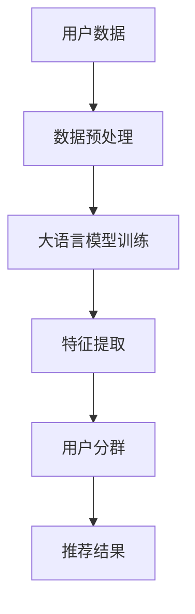

                 

关键词：大语言模型、推荐系统、用户分群、算法、数学模型、项目实践、应用场景、未来展望

> 摘要：本文将深入探讨基于大语言模型的推荐系统用户分群技术。通过介绍背景、核心概念与联系、算法原理、数学模型、项目实践和实际应用场景等内容，旨在为读者提供一个全面、易懂的指南，帮助理解和应用这一前沿技术。

## 1. 背景介绍

### 1.1 推荐系统概述

推荐系统是一种信息过滤技术，旨在根据用户的行为和偏好，向用户推荐可能感兴趣的内容。随着互联网的普及和信息爆炸，用户面临的信息选择困难日益加剧，推荐系统因此成为了现代信息检索和电子商务领域的关键技术。

### 1.2 用户分群的重要性

用户分群是将用户根据不同的特征和偏好划分为不同的群体，以便于推荐系统能够更加精准地提供个性化的推荐。有效的用户分群技术能够显著提升推荐系统的效果和用户满意度。

### 1.3 大语言模型的崛起

随着深度学习和大数据技术的发展，大语言模型（如BERT、GPT等）在自然语言处理领域取得了显著的突破。这些模型能够理解和生成复杂的自然语言文本，为推荐系统用户分群提供了新的可能性。

## 2. 核心概念与联系

在深入讨论基于大语言模型的推荐系统用户分群技术之前，我们需要先了解几个核心概念和它们之间的关系。

### 2.1 大语言模型

大语言模型是一种基于神经网络的深度学习模型，通过学习大量文本数据，能够生成或理解自然语言。这些模型具有强大的语义理解和生成能力，可以用于提取用户文本特征。

### 2.2 用户分群

用户分群是将用户根据不同的特征划分为不同的群体。这些特征可以是用户的年龄、性别、地理位置、行为偏好等。

### 2.3 推荐系统

推荐系统是一种基于用户分群和用户行为预测的技术，旨在为用户提供个性化的推荐。通过大语言模型提取用户特征，推荐系统可以更加准确地预测用户偏好。

### 2.4 Mermaid 流程图

下面是一个用Mermaid绘制的用户分群流程图，展示了大语言模型在推荐系统中的应用。



## 3. 核心算法原理 & 具体操作步骤

### 3.1 算法原理概述

基于大语言模型的推荐系统用户分群算法主要分为三个阶段：数据预处理、大语言模型训练、特征提取和用户分群。

### 3.2 算法步骤详解

#### 3.2.1 数据预处理

数据预处理是推荐系统的第一步，包括数据清洗、数据整合和数据标准化等步骤。

1. **数据清洗**：去除重复数据、缺失值填充等。
2. **数据整合**：将不同来源的数据整合到一个统一的格式中。
3. **数据标准化**：对数据特征进行标准化处理，使其符合模型的输入要求。

#### 3.2.2 大语言模型训练

大语言模型训练是利用大量文本数据进行模型训练，使其能够理解和生成自然语言。

1. **数据集准备**：选择合适的文本数据集，如用户评论、社交媒体帖子等。
2. **模型选择**：选择合适的大语言模型，如BERT、GPT等。
3. **模型训练**：使用训练数据对模型进行训练，并优化模型参数。

#### 3.2.3 特征提取

特征提取是利用训练好的大语言模型提取用户文本特征。

1. **文本编码**：将用户文本转换为模型可处理的编码形式。
2. **特征提取**：利用大语言模型提取文本特征，如词向量、句子嵌入等。

#### 3.2.4 用户分群

用户分群是根据提取的用户特征进行用户群体的划分。

1. **特征分析**：分析提取的用户特征，确定分群依据。
2. **聚类算法**：使用聚类算法（如K-means、DBSCAN等）进行用户分群。
3. **评估与优化**：评估分群效果，并根据评估结果优化分群算法。

### 3.3 算法优缺点

#### 优点

1. **强大的语义理解能力**：大语言模型能够理解和生成复杂的自然语言文本，为特征提取和用户分群提供了强大的支持。
2. **高精度**：通过用户分群，推荐系统能够更加精准地预测用户偏好，提升推荐效果。

#### 缺点

1. **计算成本高**：大语言模型训练和特征提取需要大量的计算资源和时间。
2. **数据依赖性强**：大语言模型的效果高度依赖于训练数据的质量和数量。

### 3.4 算法应用领域

基于大语言模型的推荐系统用户分群技术在多个领域具有广泛应用，如电子商务、社交媒体、在线教育等。

## 4. 数学模型和公式 & 详细讲解 & 举例说明

### 4.1 数学模型构建

基于大语言模型的推荐系统用户分群技术涉及到多个数学模型，主要包括自然语言处理模型、聚类算法模型等。

#### 4.1.1 自然语言处理模型

自然语言处理模型是一种深度学习模型，用于处理和生成自然语言。其核心是词向量模型，如Word2Vec、BERT等。

#### 4.1.2 聚类算法模型

聚类算法模型是将用户特征划分为不同群体的数学方法，如K-means、DBSCAN等。

### 4.2 公式推导过程

#### 4.2.1 词向量模型

Word2Vec模型通过计算词与词之间的相似度来生成词向量。其公式如下：

$$
\text{similarity}(w_1, w_2) = \frac{\text{dot}(v_{w_1}, v_{w_2})}{\lVert v_{w_1} \rVert \cdot \lVert v_{w_2} \rVert}
$$

其中，$v_{w_1}$和$v_{w_2}$分别为词$w_1$和$w_2$的词向量。

#### 4.2.2 K-means聚类算法

K-means聚类算法是一种基于距离的聚类方法。其公式如下：

$$
\text{assign}(x, c_j) = \arg\min_{j} \lVert x - \mu_j \rVert^2
$$

其中，$x$为用户特征向量，$\mu_j$为聚类中心。

### 4.3 案例分析与讲解

#### 4.3.1 案例背景

假设我们有一个电子商务平台，用户可以在平台上浏览和购买商品。为了提升用户体验，我们希望利用基于大语言模型的推荐系统用户分群技术对用户进行分群，以便更精准地推荐商品。

#### 4.3.2 案例实现

1. **数据预处理**：收集用户浏览和购买数据，进行数据清洗、整合和标准化处理。
2. **大语言模型训练**：选择BERT模型，使用用户评论数据训练模型。
3. **特征提取**：利用训练好的BERT模型提取用户评论特征。
4. **用户分群**：使用K-means聚类算法对用户特征进行分群。
5. **推荐结果**：根据用户分群结果，为不同用户群体推荐相应的商品。

## 5. 项目实践：代码实例和详细解释说明

### 5.1 开发环境搭建

为了实现基于大语言模型的推荐系统用户分群技术，我们需要搭建相应的开发环境。以下是开发环境的搭建步骤：

1. 安装Python环境（版本3.7及以上）。
2. 安装深度学习框架TensorFlow。
3. 安装BERT模型相关库（如transformers）。

### 5.2 源代码详细实现

以下是实现基于大语言模型的推荐系统用户分群技术的Python代码实例：

```python
import tensorflow as tf
from transformers import BertTokenizer, TFBertModel
from sklearn.cluster import KMeans

# 数据预处理
def preprocess_data(data):
    # 数据清洗、整合和标准化处理
    pass

# 大语言模型训练
def train_bert_model(data):
    tokenizer = BertTokenizer.from_pretrained('bert-base-uncased')
    model = TFBertModel.from_pretrained('bert-base-uncased')

    # 模型训练
    pass

# 特征提取
def extract_features(model, data):
    # 提取用户评论特征
    pass

# 用户分群
def cluster_users(features):
    kmeans = KMeans(n_clusters=3)
    kmeans.fit(features)
    return kmeans.labels_

# 推荐结果
def recommend_items(users, items):
    # 根据用户分群结果推荐商品
    pass

# 主函数
def main():
    # 读取数据
    data = ...

    # 数据预处理
    data = preprocess_data(data)

    # 大语言模型训练
    model = train_bert_model(data)

    # 特征提取
    features = extract_features(model, data)

    # 用户分群
    user_clusters = cluster_users(features)

    # 推荐结果
    recommend_items(user_clusters, items)

if __name__ == '__main__':
    main()
```

### 5.3 代码解读与分析

以下是代码的详细解读和分析：

- **数据预处理**：对用户数据进行清洗、整合和标准化处理，为后续模型训练和特征提取做好准备。
- **大语言模型训练**：使用BERT模型对用户评论数据进行训练，提取用户评论特征。
- **特征提取**：利用训练好的BERT模型提取用户评论特征，为用户分群提供输入。
- **用户分群**：使用K-means聚类算法对用户特征进行分群，根据分群结果推荐商品。
- **推荐结果**：根据用户分群结果，为不同用户群体推荐相应的商品。

## 6. 实际应用场景

### 6.1 电子商务

在电子商务领域，基于大语言模型的推荐系统用户分群技术可以帮助电商平台更精准地推荐商品，提升用户体验和购买转化率。

### 6.2 社交媒体

在社交媒体领域，基于大语言模型的推荐系统用户分群技术可以帮助平台为用户提供更个性化的内容推荐，增强用户粘性。

### 6.3 在线教育

在在线教育领域，基于大语言模型的推荐系统用户分群技术可以帮助教育平台为用户提供更精准的课程推荐，提高学习效果。

## 7. 未来应用展望

### 7.1 智能推荐系统

随着大语言模型和深度学习技术的不断发展，基于大语言模型的推荐系统用户分群技术将在智能推荐系统中发挥越来越重要的作用。

### 7.2 多媒体推荐

未来，基于大语言模型的推荐系统用户分群技术将不仅限于文本推荐，还将扩展到音频、视频等多媒体推荐领域。

### 7.3 个性化服务

基于大语言模型的推荐系统用户分群技术将为个性化服务提供更强有力的支持，帮助企业和平台更好地满足用户需求。

## 8. 总结：未来发展趋势与挑战

### 8.1 研究成果总结

本文介绍了基于大语言模型的推荐系统用户分群技术，详细阐述了核心概念、算法原理、数学模型、项目实践和实际应用场景等内容，为读者提供了一个全面的指南。

### 8.2 未来发展趋势

未来，基于大语言模型的推荐系统用户分群技术将在多个领域得到广泛应用，为个性化推荐和服务提供更强有力的支持。

### 8.3 面临的挑战

尽管基于大语言模型的推荐系统用户分群技术具有巨大的潜力，但在实际应用过程中仍面临一些挑战，如计算成本高、数据依赖性强等。

### 8.4 研究展望

未来的研究将集中在优化算法性能、降低计算成本、提高数据利用效率等方面，以推动基于大语言模型的推荐系统用户分群技术的进一步发展。

## 9. 附录：常见问题与解答

### 9.1 问题1：如何选择合适的大语言模型？

**解答**：选择合适的大语言模型主要取决于应用场景和数据规模。对于大规模数据和应用场景，可以使用预训练的大语言模型，如BERT、GPT等。对于小规模数据或特定任务，可以考虑使用轻量级语言模型，如TinyBERT、PicoBERT等。

### 9.2 问题2：用户分群效果如何评估？

**解答**：用户分群效果可以通过多种评估指标来评估，如聚类系数、轮廓系数、用户满意度等。在实际应用中，可以根据具体情况选择合适的评估指标。

### 9.3 问题3：如何优化推荐系统的效果？

**解答**：优化推荐系统效果的方法包括但不限于：改进用户分群算法、增加特征维度、使用协同过滤等技术、进行A/B测试等。

### 9.4 问题4：大语言模型训练需要多长时间？

**解答**：大语言模型训练时间取决于多个因素，如数据规模、模型参数、计算资源等。通常情况下，训练时间可以从几个小时到几天不等。

---

作者：禅与计算机程序设计艺术 / Zen and the Art of Computer Programming
----------------------------------------------------------------


