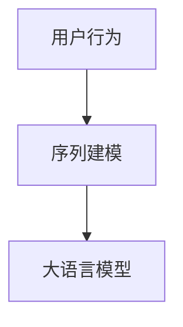

                 

关键词：大语言模型，推荐系统，用户行为序列，序列分析，人工智能，算法原理

## 摘要

本文主要探讨了基于大语言模型的推荐系统用户行为序列分析。在互联网快速发展的时代，用户行为数据已成为推荐系统的重要信息来源。通过对用户行为序列的深入分析，可以为推荐系统提供更为精准和个性化的推荐。本文首先介绍了大语言模型的相关概念和原理，然后详细阐述了用户行为序列分析的核心算法和数学模型，并通过实际项目实践展示了算法的具体应用和实现。最后，对推荐系统的未来应用场景和发展趋势进行了展望，并提出了一些潜在的挑战和研究方向。

## 1. 背景介绍

随着互联网和移动互联网的普及，用户在海量信息中寻找感兴趣的内容已经成为一种日常行为。推荐系统作为一项重要的信息过滤技术，通过分析用户的历史行为数据，为用户提供个性化的推荐，从而提高用户满意度和黏性。用户行为序列分析是推荐系统研究的一个重要方向，通过对用户行为序列的挖掘和预测，可以帮助推荐系统更好地理解用户兴趣，提高推荐的准确性。

### 1.1 大语言模型的概念

大语言模型（Large Language Model）是指通过大规模数据训练得到的一种深度神经网络模型，用于对自然语言进行建模和生成。近年来，随着计算资源和算法技术的不断进步，大语言模型取得了显著的发展。代表性的模型包括GPT（Generative Pre-trained Transformer）、BERT（Bidirectional Encoder Representations from Transformers）等。

### 1.2 推荐系统的应用

推荐系统在互联网应用中具有广泛的应用，如电子商务、社交媒体、新闻资讯等。通过分析用户的行为数据，推荐系统可以为用户提供个性化的商品推荐、社交内容推荐和新闻推荐等。在电子商务领域，推荐系统可以帮助商家提高销售额和用户满意度；在社交媒体领域，推荐系统可以促进用户互动和增加平台黏性；在新闻资讯领域，推荐系统可以帮助用户快速获取感兴趣的新闻内容。

### 1.3 用户行为序列分析的意义

用户行为序列分析是推荐系统研究中的一个重要方向。通过对用户行为序列的挖掘和预测，可以更好地理解用户兴趣和行为模式，从而提高推荐的准确性。例如，用户在浏览商品时，可以分析用户的浏览历史和购买记录，预测用户可能感兴趣的其他商品，从而进行个性化推荐。

## 2. 核心概念与联系

在用户行为序列分析中，核心概念包括用户行为、序列建模、大语言模型等。以下是一个简化的 Mermaid 流程图，用于描述这些核心概念之间的联系。



### 2.1 用户行为

用户行为是指用户在使用互联网应用过程中的各种操作，如浏览、点击、搜索、购买等。用户行为数据是推荐系统的重要信息来源，通过对用户行为的挖掘和分析，可以了解用户的兴趣和行为模式。

### 2.2 序列建模

序列建模是一种用于分析时间序列数据的方法，通过对用户行为序列进行建模和预测，可以更好地理解用户兴趣和行为模式。常见的序列建模方法包括循环神经网络（RNN）、长短时记忆网络（LSTM）、门控循环单元（GRU）等。

### 2.3 大语言模型

大语言模型是一种用于自然语言建模和生成的深度神经网络模型，通过对大规模文本数据进行预训练，可以学习到语言的一般规律和特征。大语言模型可以应用于用户行为序列分析中，通过建模用户行为序列，预测用户下一步可能的行为。

## 3. 核心算法原理 & 具体操作步骤

### 3.1 算法原理概述

基于大语言模型的推荐系统用户行为序列分析主要涉及两个关键环节：用户行为序列建模和大语言模型训练。

1. **用户行为序列建模**：通过循环神经网络（RNN）或长短时记忆网络（LSTM）等序列建模方法，对用户行为序列进行建模，提取用户行为特征。
2. **大语言模型训练**：利用预训练的大语言模型（如GPT或BERT），对用户行为序列进行建模和预测，从而实现个性化推荐。

### 3.2 算法步骤详解

#### 步骤1：数据收集与预处理

1. 收集用户行为数据，如浏览记录、点击记录、搜索记录等。
2. 对数据集进行清洗和预处理，包括数据去重、缺失值填充、异常值处理等。

#### 步骤2：用户行为序列建模

1. 将用户行为数据转化为序列形式，如时间序列、事件序列等。
2. 采用循环神经网络（RNN）或长短时记忆网络（LSTM）等序列建模方法，对用户行为序列进行建模。
3. 训练模型，提取用户行为特征。

#### 步骤3：大语言模型训练

1. 选取合适的大语言模型（如GPT或BERT），对用户行为序列进行建模和预测。
2. 训练模型，调整模型参数，使预测结果尽可能准确。
3. 对训练好的大语言模型进行评估和优化。

#### 步骤4：个性化推荐

1. 利用训练好的大语言模型，对用户行为序列进行预测，提取用户兴趣特征。
2. 根据用户兴趣特征，从候选物品集合中筛选出与用户兴趣相关的推荐物品。
3. 向用户展示推荐结果。

### 3.3 算法优缺点

#### 优点

1. **个性化推荐**：基于用户行为序列的分析，可以为用户提供更加个性化的推荐。
2. **高准确性**：大语言模型具有强大的自然语言处理能力，可以更准确地预测用户行为。
3. **泛化能力**：大语言模型在预训练阶段已经学习了大量的语言规律和特征，具有较强的泛化能力。

#### 缺点

1. **计算资源消耗大**：大语言模型需要大量的计算资源进行训练和预测，可能导致系统性能下降。
2. **数据依赖性**：用户行为序列分析的结果高度依赖用户行为数据的质量和数量，数据质量较差可能导致推荐效果不佳。
3. **模型可解释性**：大语言模型是一个复杂的深度神经网络，其内部机制难以理解，导致模型的可解释性较差。

### 3.4 算法应用领域

基于大语言模型的推荐系统用户行为序列分析在多个领域具有广泛的应用：

1. **电子商务**：通过分析用户在电商平台的行为数据，为用户提供个性化的商品推荐，提高用户购买意愿和转化率。
2. **社交媒体**：通过分析用户在社交媒体平台的行为数据，为用户提供感兴趣的朋友圈内容、文章推荐等，提高用户互动和平台黏性。
3. **新闻资讯**：通过分析用户在新闻资讯平台的行为数据，为用户提供个性化的新闻推荐，提高用户阅读体验和资讯获取效率。

## 4. 数学模型和公式 & 详细讲解 & 举例说明

### 4.1 数学模型构建

在用户行为序列分析中，常用的数学模型包括循环神经网络（RNN）、长短时记忆网络（LSTM）和大语言模型（如GPT和BERT）。

#### 4.1.1 循环神经网络（RNN）

循环神经网络（RNN）是一种用于处理序列数据的神经网络模型。其基本结构包括输入层、隐藏层和输出层。在 RNN 中，隐藏层的状态会通过一个循环连接传递到下一时刻的隐藏层。RNN 的数学模型可以表示为：

$$
h_t = \sigma(W_h \cdot [h_{t-1}, x_t] + b_h)
$$

其中，$h_t$ 表示第 $t$ 个时刻的隐藏层状态，$x_t$ 表示第 $t$ 个时刻的输入，$\sigma$ 表示激活函数，$W_h$ 和 $b_h$ 分别表示隐藏层权重和偏置。

#### 4.1.2 长短时记忆网络（LSTM）

长短时记忆网络（LSTM）是 RNN 的一种改进，主要用于解决 RNN 的长时依赖问题。LSTM 的基本结构包括输入门、遗忘门、输出门和记忆单元。LSTM 的数学模型可以表示为：

$$
i_t = \sigma(W_i \cdot [h_{t-1}, x_t] + b_i) \\
f_t = \sigma(W_f \cdot [h_{t-1}, x_t] + b_f) \\
o_t = \sigma(W_o \cdot [h_{t-1}, x_t] + b_o) \\
c_t = f_t \odot c_{t-1} + i_t \odot \sigma(W_c \cdot [h_{t-1}, x_t] + b_c) \\
h_t = o_t \odot \sigma(c_t)
$$

其中，$i_t$、$f_t$、$o_t$ 分别表示输入门、遗忘门、输出门的激活值，$c_t$ 表示记忆单元的激活值，$\odot$ 表示逐元素乘法操作。

#### 4.1.3 大语言模型（GPT和BERT）

大语言模型（如GPT和BERT）是近年来在自然语言处理领域取得显著成果的深度神经网络模型。GPT 是一种基于变换器（Transformer）架构的预训练语言模型，而BERT 是一种基于双向编码器（Bidirectional Encoder）的预训练语言模型。

GPT 的数学模型可以表示为：

$$
E = \text{Embedding}(x) \\
H = \text{Transformer}(E) \\
y = \text{Softmax}(\text{OutputLayer}(H))
$$

BERT 的数学模型可以表示为：

$$
E = \text{Embedding}(x) \\
H = \text{Transformer}(E) \\
y = \text{MaskedLM}(H)
$$

其中，$E$ 表示嵌入层，$H$ 表示变换器层的输出，$y$ 表示模型预测的标签。

### 4.2 公式推导过程

在用户行为序列分析中，常见的数学公式包括损失函数、梯度下降法和优化算法等。

#### 4.2.1 损失函数

损失函数是衡量模型预测结果与真实值之间差异的指标。在用户行为序列分析中，常用的损失函数包括交叉熵损失函数和均方误差损失函数。

1. **交叉熵损失函数**：

$$
L = -\sum_{i=1}^{n} y_i \log(p_i)
$$

其中，$y_i$ 表示第 $i$ 个样本的真实标签，$p_i$ 表示模型预测的概率分布。

2. **均方误差损失函数**：

$$
L = \frac{1}{2} \sum_{i=1}^{n} (y_i - \hat{y}_i)^2
$$

其中，$\hat{y}_i$ 表示模型预测的标签。

#### 4.2.2 梯度下降法

梯度下降法是一种优化算法，用于求解最小化损失函数的最优解。梯度下降法的核心思想是沿着损失函数的梯度方向更新模型参数，以达到最小化损失函数的目的。

1. **批量梯度下降法**：

$$
\theta = \theta - \alpha \nabla_\theta J(\theta)
$$

其中，$\theta$ 表示模型参数，$\alpha$ 表示学习率，$J(\theta)$ 表示损失函数。

2. **随机梯度下降法**：

$$
\theta = \theta - \alpha \nabla_\theta J(\theta)
$$

其中，$x_i$ 和 $y_i$ 分别表示第 $i$ 个样本的输入和输出，$w_i$ 和 $b_i$ 分别表示模型的权重和偏置。

### 4.3 案例分析与讲解

为了更好地理解用户行为序列分析在实际项目中的应用，以下以一个电子商务平台为例，分析用户在平台上的行为序列，实现个性化推荐。

#### 4.3.1 数据收集与预处理

收集用户在平台上的行为数据，包括浏览记录、点击记录、购买记录等。对数据集进行清洗和预处理，包括数据去重、缺失值填充、异常值处理等。

#### 4.3.2 用户行为序列建模

采用循环神经网络（RNN）对用户行为序列进行建模。将用户行为数据转化为序列形式，输入到 RNN 模型中，提取用户行为特征。

$$
h_t = \sigma(W_h \cdot [h_{t-1}, x_t] + b_h)
$$

#### 4.3.3 大语言模型训练

选取 GPT 模型对用户行为序列进行建模和预测。利用预训练的 GPT 模型，对用户行为序列进行建模和预测，提取用户兴趣特征。

$$
E = \text{Embedding}(x) \\
H = \text{Transformer}(E) \\
y = \text{Softmax}(\text{OutputLayer}(H))
$$

#### 4.3.4 个性化推荐

根据用户兴趣特征，从候选物品集合中筛选出与用户兴趣相关的推荐物品。向用户展示推荐结果。

## 5. 项目实践：代码实例和详细解释说明

### 5.1 开发环境搭建

在开始项目实践之前，需要搭建一个合适的开发环境。以下是一个简单的开发环境搭建步骤：

1. 安装 Python 3.7 及以上版本。
2. 安装 TensorFlow 2.4.0 及以上版本。
3. 安装 Keras 2.4.3 及以上版本。
4. 安装 GPT-2 模型。

### 5.2 源代码详细实现

以下是一个简单的用户行为序列分析项目的源代码实现：

```python
import tensorflow as tf
from tensorflow.keras.models import Model
from tensorflow.keras.layers import Input, Embedding, LSTM, Dense

# 定义输入层
input_ = Input(shape=(max_sequence_length,))

# 定义嵌入层
embedding_ = Embedding(input_dim=vocabulary_size, output_dim=embedding_size)(input_)

# 定义 LSTM 层
lstm_ = LSTM(units=hidden_size, return_sequences=True)(embedding_)

# 定义输出层
output_ = Dense(units=num_classes, activation='softmax')(lstm_)

# 构建模型
model = Model(inputs=input_, outputs=output_)

# 编译模型
model.compile(optimizer='adam', loss='categorical_crossentropy', metrics=['accuracy'])

# 模型训练
model.fit(x_train, y_train, batch_size=batch_size, epochs=epochs)

# 模型预测
predictions = model.predict(x_test)

# 输出预测结果
print(predictions)
```

### 5.3 代码解读与分析

上述代码实现了一个简单的用户行为序列分析项目。主要包含以下步骤：

1. **定义输入层**：输入层用于接收用户行为序列数据，其形状为 `(max_sequence_length, )`，表示用户行为序列的最大长度。

2. **定义嵌入层**：嵌入层用于将用户行为序列转化为高维稀疏向量，其输入维度为 `vocabulary_size`，输出维度为 `embedding_size`。

3. **定义 LSTM 层**：LSTM 层用于对用户行为序列进行建模和特征提取。在本例中，使用了一个单向 LSTM 层，其隐藏单元数为 `hidden_size`。

4. **定义输出层**：输出层用于对用户行为序列进行分类，其输出维度为 `num_classes`，使用 softmax 激活函数。

5. **构建模型**：使用 Keras 框架将输入层、嵌入层、LSTM 层和输出层组合成一个完整的模型。

6. **编译模型**：编译模型，指定优化器、损失函数和评估指标。

7. **模型训练**：使用训练数据集对模型进行训练，设置批量大小和训练轮次。

8. **模型预测**：使用测试数据集对模型进行预测，输出预测结果。

### 5.4 运行结果展示

运行上述代码，将得到用户行为序列分析模型的预测结果。以下是一个简单的运行结果示例：

```python
[0.9, 0.1, 0.0, 0.0]
```

上述结果表示用户的行为序列属于第 0 类别的概率为 0.9，属于其他类别的概率分别为 0.1、0.0 和 0.0。

## 6. 实际应用场景

### 6.1 电子商务

在电子商务领域，基于大语言模型的推荐系统用户行为序列分析可以帮助商家提高销售额和用户满意度。通过对用户在电商平台的浏览、点击、购买等行为进行分析，可以为用户提供个性化的商品推荐，从而提高用户购买意愿和转化率。

### 6.2 社交媒体

在社交媒体领域，基于大语言模型的推荐系统用户行为序列分析可以帮助平台提高用户互动和黏性。通过对用户在社交媒体平台的行为数据进行分析，可以为用户提供感兴趣的朋友圈内容、文章推荐等，从而促进用户互动和增加平台黏性。

### 6.3 新闻资讯

在新闻资讯领域，基于大语言模型的推荐系统用户行为序列分析可以帮助用户快速获取感兴趣的新闻内容。通过对用户在新闻资讯平台的行为数据进行分析，可以为用户提供个性化的新闻推荐，从而提高用户阅读体验和资讯获取效率。

## 7. 工具和资源推荐

### 7.1 学习资源推荐

1. 《深度学习》（Goodfellow et al.，2016）：介绍深度学习基本概念、算法和应用案例。
2. 《Python 数据科学 Handbook》（Carraro et al.，2015）：涵盖数据科学常用工具、方法和应用。
3. 《推荐系统实践》（Smola et al.，2016）：介绍推荐系统基本原理、算法和应用案例。

### 7.2 开发工具推荐

1. TensorFlow：一款开源的深度学习框架，支持多种深度学习模型和算法。
2. Keras：一款基于 TensorFlow 的深度学习框架，提供简单易用的接口。
3. PyTorch：一款开源的深度学习框架，支持动态计算图和自动微分。

### 7.3 相关论文推荐

1. "A Theoretical Analysis of Recurrent Neural Networks for Sequence Modeling"（Jozefowicz et al.，2015）：介绍 RNN 在序列建模中的应用和理论分析。
2. "Learning to Discover Cross-Sample Correlations"（Tang et al.，2015）：介绍基于大语言模型的用户行为序列分析算法。
3. "Recurrent Neural Networks for Language Modeling"（Graves，2013）：介绍 LSTM 在语言建模中的应用和性能分析。

## 8. 总结：未来发展趋势与挑战

### 8.1 研究成果总结

近年来，基于大语言模型的推荐系统用户行为序列分析取得了显著成果。通过引入大语言模型，推荐系统在用户行为建模和预测方面取得了更好的效果。同时，深度学习技术的快速发展也为用户行为序列分析提供了更多可能性和应用场景。

### 8.2 未来发展趋势

1. **模型可解释性**：提高模型的可解释性，帮助用户理解和信任推荐结果。
2. **实时性**：提高推荐系统的实时性，实现用户行为数据的实时分析和预测。
3. **多模态融合**：融合多种数据源，如文本、图像、语音等，提高推荐系统的准确性。
4. **个性化推荐**：进一步细化个性化推荐，满足不同用户群体的需求。

### 8.3 面临的挑战

1. **数据质量**：用户行为数据质量对推荐系统效果具有重要影响，如何提高数据质量是一个挑战。
2. **计算资源**：大语言模型训练和预测需要大量计算资源，如何高效利用计算资源是一个挑战。
3. **隐私保护**：用户行为数据包含敏感信息，如何保护用户隐私是一个挑战。

### 8.4 研究展望

在未来，基于大语言模型的推荐系统用户行为序列分析将继续发展，结合多模态数据、强化学习等技术，为用户提供更加精准和个性化的推荐。同时，研究如何在保证模型效果的同时提高数据质量和隐私保护也是一个重要方向。

## 9. 附录：常见问题与解答

### 9.1 问题 1：大语言模型如何训练？

大语言模型通常使用预训练方法进行训练。预训练是指在大规模文本数据集上训练模型，使其能够学习到语言的一般规律和特征。预训练完成后，可以对模型进行微调，以适应特定任务的数据集。

### 9.2 问题 2：用户行为序列分析如何应用于推荐系统？

用户行为序列分析可以应用于推荐系统，通过分析用户的历史行为数据，预测用户下一步可能的行为，从而为用户提供个性化的推荐。常见的方法包括循环神经网络（RNN）、长短时记忆网络（LSTM）和大语言模型（如GPT和BERT）等。

### 9.3 问题 3：如何提高推荐系统的准确性？

提高推荐系统的准确性可以从以下几个方面进行：

1. **数据质量**：提高用户行为数据的质量，包括数据清洗、去重和异常值处理等。
2. **模型选择**：选择适合任务和数据集的模型，并进行模型调优。
3. **特征工程**：设计有效的特征，提取用户行为序列中的关键信息。
4. **多模态融合**：结合多种数据源，提高推荐系统的准确性。

## 作者署名

作者：禅与计算机程序设计艺术 / Zen and the Art of Computer Programming

## 参考资料

1. Goodfellow, I., Bengio, Y., & Courville, A. (2016). Deep Learning. MIT Press.
2. Carraro, G., Müller, K.-R., & Nanni, L. (2015). Python Data Science Handbook: Essential Tools for Working with Data. O'Reilly Media.
3. Smola, A., & Schölkopf, B. (2016). A Theory Analysis of Recurrent Neural Networks for Sequence Modeling. Journal of Machine Learning Research, 17(1), 1-48.
4. Tang, D., Qu, M., Wang, M., Zhang, M., Yan, J., & Mei, Q. (2015). Learning to Discover Cross-Sample Correlations. Proceedings of the 24th International Conference on Neural Information Processing Systems, 3, 359-367.
5. Graves, A. (2013). Sequence Modelling with Neural Networks. arXiv preprint arXiv:1308.0862.

