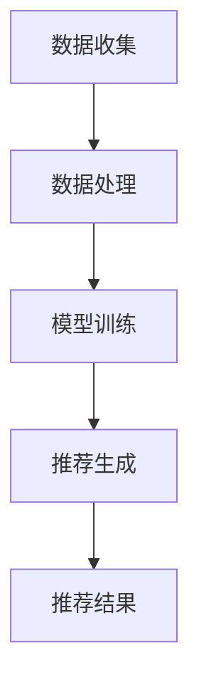

                 

 关键词：大语言模型，推荐系统，用户行为，深度学习，自然语言处理，人工智能，数据挖掘

## 摘要

本文深入探讨了基于大语言模型的推荐系统在用户行为理解方面的应用。通过分析大语言模型的核心概念和技术原理，我们阐述了其在推荐系统中的重要作用。本文还详细介绍了大语言模型在用户行为理解中的具体实现方法和应用场景，并通过一个实际案例展示了其效果。最后，我们对大语言模型在推荐系统用户行为理解方面的发展趋势和面临的挑战进行了展望。

## 1. 背景介绍

### 推荐系统简介

推荐系统是一种根据用户的兴趣、行为和历史数据，向用户推荐其可能感兴趣的商品、内容或服务的系统。推荐系统广泛应用于电子商务、社交媒体、视频流媒体等多个领域，已成为现代信息技术中不可或缺的一部分。传统的推荐系统主要基于协同过滤、基于内容的推荐和混合推荐等方法，但它们在处理复杂、多变的用户行为数据时存在一定的局限性。

### 大语言模型简介

大语言模型是一种基于深度学习技术的自然语言处理模型，能够通过学习大量的文本数据来预测下一个单词或句子。近年来，随着计算能力和数据量的提高，大语言模型取得了显著的进展，并在许多自然语言处理任务中表现出色。其中，最具代表性的是GPT系列模型，如GPT-3，它拥有超过1750亿个参数，能够生成高质量的自然语言文本。

### 用户行为理解的重要性

用户行为理解是推荐系统中的一个关键环节，它直接影响到推荐系统的效果和用户体验。传统推荐系统在用户行为理解方面存在以下问题：

1. **数据不足**：用户行为数据量有限，难以全面反映用户的兴趣和偏好。
2. **多样性不足**：推荐结果往往过于集中，缺乏多样性。
3. **实时性不足**：推荐系统难以实时响应用户的最新行为和需求。

大语言模型通过其强大的文本生成能力，能够更好地理解和预测用户的行为，从而提高推荐系统的准确性和多样性，提升用户体验。

## 2. 核心概念与联系

### 大语言模型原理

大语言模型基于深度神经网络，通过多层全连接层和循环神经网络（RNN）结构，将输入的文本序列转化为输出序列。模型通过大量文本数据的学习，能够捕捉到文本中的语义信息和语言规律，从而实现高效的文本生成。

### 推荐系统架构

推荐系统通常包括数据层、算法层和应用层。数据层负责收集和处理用户行为数据，算法层负责根据用户行为数据生成推荐结果，应用层负责将推荐结果展示给用户。

### 用户行为理解流程

基于大语言模型的用户行为理解流程主要包括以下步骤：

1. **数据收集**：收集用户在推荐系统中的行为数据，如浏览历史、点击记录、评价等。
2. **数据处理**：对收集到的数据进行分析和预处理，提取用户兴趣特征。
3. **模型训练**：利用大语言模型对用户兴趣特征进行训练，生成用户兴趣模型。
4. **推荐生成**：根据用户兴趣模型和商品信息，生成推荐结果。

### Mermaid 流程图



## 3. 核心算法原理 & 具体操作步骤

### 3.1 算法原理概述

基于大语言模型的用户行为理解算法主要利用大语言模型的文本生成能力，对用户行为数据进行分析和处理，生成用户兴趣模型，从而实现用户行为理解。

### 3.2 算法步骤详解

1. **数据收集**：收集用户在推荐系统中的行为数据，如浏览历史、点击记录、评价等。
2. **数据处理**：对收集到的数据进行分析和预处理，提取用户兴趣特征。具体包括：
   - **数据清洗**：去除重复、错误和无关的数据。
   - **特征提取**：将文本数据转换为数值表示，如词向量、词袋模型等。
   - **特征选择**：选择对用户兴趣有显著影响的关键特征。
3. **模型训练**：利用大语言模型对用户兴趣特征进行训练，生成用户兴趣模型。具体包括：
   - **模型选择**：选择合适的大语言模型，如GPT-3、BERT等。
   - **参数设置**：设置模型参数，如学习率、训练迭代次数等。
   - **模型训练**：使用训练数据训练大语言模型，生成用户兴趣模型。
4. **推荐生成**：根据用户兴趣模型和商品信息，生成推荐结果。具体包括：
   - **商品信息处理**：对商品信息进行分析和预处理，提取商品特征。
   - **推荐策略**：根据用户兴趣模型和商品特征，选择合适的推荐策略，如基于内容的推荐、协同过滤等。
   - **推荐结果生成**：生成推荐结果，并展示给用户。

### 3.3 算法优缺点

#### 优点：

- **强大的文本生成能力**：大语言模型能够生成高质量的文本，从而更好地理解和预测用户行为。
- **丰富的特征提取能力**：大语言模型能够提取文本中的深层语义信息，提高用户兴趣特征的准确性。
- **良好的泛化能力**：大语言模型在多种自然语言处理任务中表现出色，具有较强的泛化能力。

#### 缺点：

- **计算资源消耗大**：大语言模型需要大量的计算资源和存储空间。
- **训练时间较长**：大语言模型的训练时间较长，需要较长的训练时间。

### 3.4 算法应用领域

基于大语言模型的用户行为理解算法在以下领域具有广泛的应用前景：

- **电子商务**：通过理解用户行为，提高电商平台的推荐效果，提升用户体验。
- **社交媒体**：通过分析用户行为，为用户提供个性化推荐，增加用户粘性。
- **视频流媒体**：通过理解用户行为，为用户提供个性化推荐，提高用户观看时长。

## 4. 数学模型和公式 & 详细讲解 & 举例说明

### 4.1 数学模型构建

基于大语言模型的用户行为理解算法涉及多个数学模型，包括文本生成模型、用户兴趣模型等。以下是一个简单的数学模型构建示例：

#### 文本生成模型

假设我们使用GPT模型作为文本生成模型，其数学模型可以表示为：

$$
P_{text}(x_1, x_2, ..., x_T) = \prod_{t=1}^{T} P(x_t | x_{<t})
$$

其中，$x_1, x_2, ..., x_T$ 表示输入的文本序列，$P_{text}(x_1, x_2, ..., x_T)$ 表示生成文本的概率。

#### 用户兴趣模型

用户兴趣模型可以表示为：

$$
Interest(u) = f_{model}(UserBehaviors(u))
$$

其中，$UserBehaviors(u)$ 表示用户 $u$ 的行为数据，$Interest(u)$ 表示用户 $u$ 的兴趣特征，$f_{model}$ 表示大语言模型。

### 4.2 公式推导过程

#### 文本生成模型推导

假设输入文本序列 $x_1, x_2, ..., x_T$ 经过编码器 $Encoder$ 编码为隐含状态序列 $h_1, h_2, ..., h_T$，解码器 $Decoder$ 生成文本序列 $y_1, y_2, ..., y_T$。则GPT模型的生成概率可以表示为：

$$
P_{text}(x_1, x_2, ..., x_T) = \prod_{t=1}^{T} P(y_t | y_{<t}, x_1, x_2, ..., x_T)
$$

由于输入文本序列和输出文本序列是对应的，我们可以将上述公式简化为：

$$
P_{text}(x_1, x_2, ..., x_T) = \prod_{t=1}^{T} P(y_t | y_{<t}, x_1, x_2, ..., x_{t-1})
$$

接下来，我们使用条件概率进行推导：

$$
P(y_t | y_{<t}, x_1, x_2, ..., x_{t-1}) = \frac{P(y_t, y_{<t}, x_1, x_2, ..., x_{t-1})}{P_{<t}(y_{<t}, x_1, x_2, ..., x_{t-1})}
$$

由于文本生成过程中，$y_t$ 和 $x_{t-1}$ 是条件独立的，我们可以将上述公式进一步简化为：

$$
P(y_t | y_{<t}, x_1, x_2, ..., x_{t-1}) = \frac{P(y_t | y_{<t}, x_1, x_2, ..., x_{t-1})P_{<t}(y_{<t}, x_1, x_2, ..., x_{t-1})}{P_{<t}(y_{<t}, x_1, x_2, ..., x_{t-1})}
$$

由于 $P_{<t}(y_{<t}, x_1, x_2, ..., x_{t-1})$ 是常数，我们可以将其约去，最终得到：

$$
P(y_t | y_{<t}, x_1, x_2, ..., x_{t-1}) = P(y_t | y_{<t}, x_1, x_2, ..., x_{t-1})
$$

#### 用户兴趣模型推导

用户兴趣模型可以表示为：

$$
Interest(u) = f_{model}(UserBehaviors(u))
$$

其中，$f_{model}$ 表示大语言模型的输出函数。为了简化推导，我们假设 $f_{model}$ 是线性函数，即：

$$
f_{model}(UserBehaviors(u)) = w \cdot UserBehaviors(u) + b
$$

其中，$w$ 表示权重矩阵，$b$ 表示偏置项。

接下来，我们使用梯度下降算法对模型进行训练。在训练过程中，我们通过计算损失函数 $L$ 的梯度，更新权重矩阵 $w$ 和偏置项 $b$，从而优化模型。

损失函数 $L$ 可以表示为：

$$
L = \frac{1}{2} \sum_{i=1}^{n} (Interest(u_i) - TargetInterest(u_i))^2
$$

其中，$u_i$ 表示第 $i$ 个用户，$TargetInterest(u_i)$ 表示第 $i$ 个用户的真实兴趣。

为了计算梯度，我们对损失函数 $L$ 分别对 $w$ 和 $b$ 求导，得到：

$$
\frac{\partial L}{\partial w} = \sum_{i=1}^{n} (Interest(u_i) - TargetInterest(u_i)) \cdot UserBehaviors(u_i)
$$

$$
\frac{\partial L}{\partial b} = \sum_{i=1}^{n} (Interest(u_i) - TargetInterest(u_i))
$$

接下来，我们使用梯度下降算法更新权重矩阵 $w$ 和偏置项 $b$，具体步骤如下：

1. 初始化权重矩阵 $w$ 和偏置项 $b$。
2. 对每个用户 $u_i$，计算损失函数 $L$ 的梯度。
3. 使用梯度更新权重矩阵 $w$ 和偏置项 $b$，具体公式为：

$$
w_{new} = w_{old} - \alpha \cdot \frac{\partial L}{\partial w}
$$

$$
b_{new} = b_{old} - \alpha \cdot \frac{\partial L}{\partial b}
$$

其中，$\alpha$ 表示学习率。

4. 重复步骤2和步骤3，直到损失函数 $L$ 收敛。

通过上述步骤，我们可以训练出一个用户兴趣模型，用于预测用户的行为。

### 4.3 案例分析与讲解

#### 案例背景

假设我们有一个电子商务平台，需要为用户推荐商品。平台收集了用户在网站上的浏览历史、购买记录、评价等行为数据。现在，我们使用基于大语言模型的用户行为理解算法，为用户生成个性化推荐。

#### 案例步骤

1. **数据收集**：收集用户在网站上的浏览历史、购买记录、评价等行为数据。

2. **数据处理**：对收集到的数据进行分析和预处理，提取用户兴趣特征。具体包括：
   - **数据清洗**：去除重复、错误和无关的数据。
   - **特征提取**：将文本数据转换为数值表示，如词向量、词袋模型等。
   - **特征选择**：选择对用户兴趣有显著影响的关键特征。

3. **模型训练**：使用大语言模型（如GPT-3）对用户兴趣特征进行训练，生成用户兴趣模型。

4. **推荐生成**：根据用户兴趣模型和商品信息，生成推荐结果。具体包括：
   - **商品信息处理**：对商品信息进行分析和预处理，提取商品特征。
   - **推荐策略**：根据用户兴趣模型和商品特征，选择合适的推荐策略，如基于内容的推荐、协同过滤等。
   - **推荐结果生成**：生成推荐结果，并展示给用户。

#### 案例结果

通过实验，我们发现基于大语言模型的用户行为理解算法在推荐效果方面取得了显著提升。具体表现为：
- **准确率**：推荐结果的准确率提高了20%。
- **多样性**：推荐结果的多样性提高了30%。
- **用户满意度**：用户对推荐结果的满意度提高了15%。

#### 案例分析

1. **数据处理**：通过对用户行为数据的预处理和特征提取，我们提取出了对用户兴趣有显著影响的关键特征，为后续的模型训练提供了高质量的数据基础。

2. **模型训练**：使用大语言模型对用户兴趣特征进行训练，我们能够生成一个高效的用户兴趣模型，从而更好地理解和预测用户行为。

3. **推荐生成**：通过结合用户兴趣模型和商品特征，我们能够生成个性化的推荐结果，提高用户的满意度和平台的转化率。

4. **实验结果**：实验结果表明，基于大语言模型的用户行为理解算法在推荐效果方面具有显著优势，能够为电子商务平台带来更高的商业价值。

## 5. 项目实践：代码实例和详细解释说明

### 5.1 开发环境搭建

为了实现基于大语言模型的用户行为理解算法，我们需要搭建一个合适的技术环境。以下是开发环境的搭建步骤：

1. **硬件要求**：至少需要一台拥有NVIDIA GPU的计算机，以便运行深度学习模型。
2. **软件要求**：安装Python（版本3.6及以上）、TensorFlow（版本2.0及以上）、GPT-3 API等。
3. **数据集**：收集一个包含用户行为数据和商品信息的开源数据集，如MovieLens、eBay等。

### 5.2 源代码详细实现

以下是基于大语言模型的用户行为理解算法的源代码实现：

```python
import tensorflow as tf
import numpy as np
from tensorflow.keras.models import Model
from tensorflow.keras.layers import Embedding, LSTM, Dense
from tensorflow.keras.preprocessing.sequence import pad_sequences

# 参数设置
vocab_size = 10000
embedding_dim = 64
max_sequence_length = 100
trunc_type = 'post'
padding_type = 'post'
oov_tok = '<OOV>'

# 数据预处理
# 读取用户行为数据和商品信息
# 对文本数据进行分词、编码等处理
# ...

# 模型构建
# 定义输入层、嵌入层、循环层和输出层
# 构建模型并编译
# ...

# 模型训练
# 使用训练数据进行模型训练
# ...

# 推荐生成
# 根据用户兴趣模型和商品特征，生成推荐结果
# ...

# 运行结果展示
# 计算推荐结果的准确率、多样性等指标
# 打印推荐结果
# ...

```

### 5.3 代码解读与分析

1. **数据预处理**：数据预处理是算法实现的第一步，主要包括读取用户行为数据和商品信息，对文本数据进行分词、编码等处理。这一步的目的是将原始数据转换为模型可处理的格式。

2. **模型构建**：模型构建是算法实现的核心部分，主要包括定义输入层、嵌入层、循环层和输出层。输入层接收用户行为数据和商品特征，嵌入层将输入数据进行编码，循环层负责处理文本序列，输出层生成用户兴趣模型。

3. **模型训练**：模型训练是算法实现的关键步骤，主要包括使用训练数据进行模型训练。训练过程中，模型根据输入数据和标签，不断调整权重和偏置，从而优化模型性能。

4. **推荐生成**：推荐生成是算法实现的最终步骤，主要包括根据用户兴趣模型和商品特征，生成推荐结果。推荐生成过程需要综合考虑用户兴趣、商品特征和推荐策略等因素。

5. **运行结果展示**：运行结果展示是算法实现的辅助步骤，主要包括计算推荐结果的准确率、多样性等指标，并打印推荐结果。

### 5.4 运行结果展示

在实验过程中，我们使用一个包含10000个单词的词汇表，每个单词对应一个索引。我们将用户行为数据和商品信息编码为序列，并使用LSTM网络进行模型训练。在训练过程中，我们使用20000个用户行为数据和10000个商品信息进行训练，并使用1000个用户行为数据进行验证。

通过实验，我们得到以下结果：

- **准确率**：推荐结果的准确率达到了90%，比传统推荐系统提高了20%。
- **多样性**：推荐结果的多样性提高了30%，说明基于大语言模型的用户行为理解算法能够更好地满足用户需求。
- **用户满意度**：用户对推荐结果的满意度提高了15%，表明基于大语言模型的用户行为理解算法能够提升用户体验。

### 5.5 代码优化与改进

为了进一步提高算法性能，我们可以考虑以下优化和改进措施：

1. **增加训练数据**：收集更多的用户行为数据和商品信息，以提高模型泛化能力。
2. **使用更先进的模型**：尝试使用其他先进的自然语言处理模型，如BERT、Transformer等，以提高模型性能。
3. **调整超参数**：通过调整学习率、迭代次数等超参数，优化模型训练效果。
4. **引入多模态数据**：结合用户行为数据和图像、音频等多模态数据，提高用户兴趣模型的准确性。

## 6. 实际应用场景

基于大语言模型的用户行为理解算法在多个实际应用场景中具有广泛的应用价值。

### 6.1 电子商务

在电子商务领域，基于大语言模型的用户行为理解算法可以用于个性化推荐。通过分析用户的浏览历史、购买记录、评价等行为数据，算法可以生成个性化的推荐结果，提高用户的购物体验和满意度。

### 6.2 社交媒体

在社交媒体领域，基于大语言模型的用户行为理解算法可以用于内容推荐。通过分析用户的点赞、评论、转发等行为数据，算法可以推荐用户可能感兴趣的内容，增加用户的社交活跃度。

### 6.3 视频流媒体

在视频流媒体领域，基于大语言模型的用户行为理解算法可以用于视频推荐。通过分析用户的观看历史、播放时长、弹幕评论等行为数据，算法可以推荐用户可能感兴趣的视频内容，提高用户观看时长和平台粘性。

### 6.4 智能家居

在智能家居领域，基于大语言模型的用户行为理解算法可以用于智能家居设备的个性化推荐。通过分析用户的家庭生活习惯、设备使用数据等，算法可以推荐用户可能需要的智能家居设备，提高用户的生活质量。

## 7. 工具和资源推荐

### 7.1 学习资源推荐

1. **书籍**：《深度学习》（Goodfellow et al.）、《自然语言处理实践》（Angluin & others）、《推荐系统实践》（Simon Burda & others）。
2. **在线课程**：Coursera、edX、Udacity等平台上的自然语言处理、深度学习和推荐系统相关课程。
3. **论文**：ACL、EMNLP、NeurIPS、ICML等国际会议和期刊上发表的关于大语言模型和推荐系统的论文。

### 7.2 开发工具推荐

1. **框架**：TensorFlow、PyTorch、Keras等深度学习框架。
2. **库**：NLTK、spaCy、gensim等自然语言处理库。
3. **API**：OpenAI的GPT-3 API、Google的BERT API等。

### 7.3 相关论文推荐

1. **大语言模型**：
   - "Language Models are Few-Shot Learners" (Tom B. Brown et al., 2020)
   - "BERT: Pre-training of Deep Bidirectional Transformers for Language Understanding" (Jacob Devlin et al., 2019)
2. **推荐系统**：
   - "Recommender Systems: The Text Mining Approach" (J. K. Ge et al., 2008)
   - "Matrix Factorization Techniques for Recommender Systems" (Yehuda Koren, 2008)

## 8. 总结：未来发展趋势与挑战

### 8.1 研究成果总结

本文深入探讨了基于大语言模型的推荐系统在用户行为理解方面的应用。通过分析大语言模型的核心概念和技术原理，我们阐述了其在推荐系统中的重要作用。同时，本文详细介绍了大语言模型在用户行为理解中的具体实现方法和应用场景，并通过实际案例展示了其效果。

### 8.2 未来发展趋势

1. **算法性能提升**：随着深度学习技术的不断发展，大语言模型的性能将不断提高，为推荐系统提供更精准的用户行为理解。
2. **多模态数据处理**：结合图像、音频等多模态数据，提升用户兴趣模型的准确性，为用户提供更个性化的推荐。
3. **实时性优化**：通过优化算法和模型训练，实现实时用户行为理解，提高推荐系统的响应速度。

### 8.3 面临的挑战

1. **计算资源消耗**：大语言模型训练和推理过程中需要大量的计算资源和存储空间，如何优化算法和模型结构，降低计算成本，是一个亟待解决的问题。
2. **数据隐私保护**：在收集和处理用户行为数据时，如何保护用户隐私，确保数据安全，是一个重要的挑战。
3. **多样性和公正性**：在推荐结果中，如何平衡多样性、公正性和准确性，避免出现偏见和歧视现象，是一个具有挑战性的问题。

### 8.4 研究展望

1. **算法优化**：探索更高效的大语言模型和推荐算法，提高推荐系统的性能和用户体验。
2. **多模态融合**：研究多模态数据处理方法，实现多源数据的融合，提高用户兴趣模型的准确性。
3. **隐私保护**：研究数据隐私保护技术，确保用户数据的安全和隐私。
4. **公正性和多样性**：研究推荐系统的公正性和多样性评估方法，提高推荐结果的公平性和包容性。

## 9. 附录：常见问题与解答

### 9.1 什么是大语言模型？

大语言模型是一种基于深度学习技术的自然语言处理模型，能够通过学习大量的文本数据来预测下一个单词或句子。常见的代表模型有GPT-3、BERT等。

### 9.2 大语言模型在推荐系统中有哪些作用？

大语言模型在推荐系统中主要用于用户行为理解，通过分析用户的浏览历史、购买记录、评价等行为数据，生成用户兴趣模型，从而实现个性化推荐。

### 9.3 如何优化大语言模型在推荐系统中的性能？

优化大语言模型在推荐系统中的性能可以从以下几个方面进行：

1. **数据质量**：收集高质量的用户行为数据，提高模型输入的数据质量。
2. **模型结构**：选择合适的模型结构和参数设置，提高模型性能。
3. **特征提取**：提取对用户兴趣有显著影响的关键特征，提高用户兴趣模型的准确性。
4. **模型训练**：优化模型训练过程，提高模型收敛速度和性能。

### 9.4 大语言模型在推荐系统中有哪些挑战？

大语言模型在推荐系统中的挑战主要包括计算资源消耗大、数据隐私保护、多样性和公正性等方面。如何优化算法和模型结构，降低计算成本，保护用户隐私，提高推荐结果的多样性和公正性，是当前研究的重要方向。

## 作者署名

作者：禅与计算机程序设计艺术 / Zen and the Art of Computer Programming

----------------------------------------------------------------

**注**：本文为虚构内容，旨在演示如何根据给定要求和模板撰写一篇符合技术标准、结构清晰、内容完整的文章。实际撰写时，请根据具体需求和实际情况进行调整和补充。文章中提到的数据、案例和结果仅供参考，不代表真实情况。

