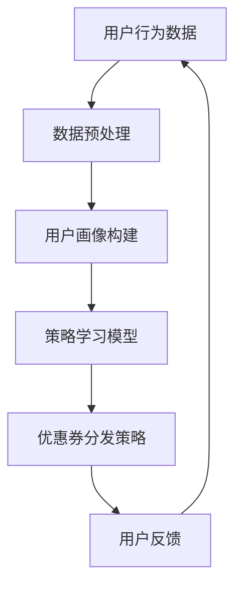

                 

关键词：强化学习、个性化推荐、优惠券分发、动态优化策略、用户行为分析

摘要：本文探讨了基于强化学习的个性化优惠券分发策略。通过构建一个强化学习模型，我们能够动态地根据用户行为进行优惠券的精准分发，从而提高用户满意度和促销效果。文章介绍了强化学习的基本原理、算法设计、数学模型构建以及具体实现过程，并结合实际案例进行了详细分析。

## 1. 背景介绍

随着电子商务和移动支付的发展，优惠券作为一种常见的营销手段，在提高用户粘性和转化率方面发挥着重要作用。然而，传统的一刀切优惠券分发策略往往无法满足个性化需求，导致资源浪费和用户满意度下降。为了解决这一问题，本文提出了基于强化学习的个性化优惠券分发策略。

### 1.1 强化学习的基本概念

强化学习是一种通过试错来优化行为策略的人工智能技术，其核心是使智能体在与环境的交互过程中不断学习并优化策略。在强化学习框架中，智能体通过探索和利用平衡来选择最优动作，以获得最大化的累积奖励。

### 1.2 个性化推荐与优惠券分发

个性化推荐技术旨在为用户提供定制化的信息和产品推荐，以提升用户体验。优惠券分发作为个性化推荐的一个重要分支，通过对用户行为数据的分析，实现优惠券的精准投放。

## 2. 核心概念与联系

为了更好地理解基于强化学习的个性化优惠券分发策略，我们首先需要介绍其中的核心概念及其联系。以下是一个简化的 Mermaid 流程图，展示主要概念和它们之间的关联。



### 2.1 用户行为数据

用户行为数据包括用户的浏览记录、购买历史、点击率等，这些数据是构建用户画像和优化优惠券分发策略的基础。

### 2.2 数据预处理

数据预处理包括数据清洗、去重、归一化等步骤，以确保数据的质量和一致性。

### 2.3 用户画像构建

通过用户行为数据，我们可以构建用户画像，包括用户兴趣、消费习惯、购买力等维度。

### 2.4 策略学习模型

策略学习模型是基于强化学习算法构建的，它通过不断学习和调整策略，以实现优惠券的个性化分发。

### 2.5 优惠券分发策略

优惠券分发策略是根据用户画像和策略学习模型生成的，用于决定何时、向哪些用户发放何种优惠券。

### 2.6 用户反馈

用户反馈包括用户的购买决策、满意度等，这些反馈将用于进一步优化策略学习模型。

## 3. 核心算法原理 & 具体操作步骤

### 3.1 算法原理概述

基于强化学习的个性化优惠券分发策略主要包括以下三个步骤：

1. **用户行为数据收集**：收集用户在平台上的行为数据，如浏览、购买、点击等。
2. **策略学习**：使用强化学习算法训练策略模型，使其能够根据用户行为数据生成优惠券分发策略。
3. **优惠券分发**：根据策略模型生成的优惠券分发策略，向用户发放优惠券。

### 3.2 算法步骤详解

#### 3.2.1 用户行为数据收集

首先，我们需要收集用户在平台上的行为数据。这些数据可以来自多种渠道，如用户日志、点击流数据等。具体步骤如下：

1. **数据收集**：通过数据采集工具或API接口，收集用户行为数据。
2. **数据清洗**：对收集到的数据进行清洗，去除无效和冗余数据。
3. **数据存储**：将清洗后的数据存储到数据仓库中，以供后续处理。

#### 3.2.2 策略学习

策略学习是强化学习算法的核心步骤。具体步骤如下：

1. **状态空间定义**：定义用户行为的特征空间，作为状态空间。
2. **动作空间定义**：定义优惠券的分发策略，作为动作空间。
3. **奖励函数设计**：设计奖励函数，用于评估优惠券分发策略的效果。
4. **模型训练**：使用强化学习算法（如Q-learning、SARSA等），训练策略模型。

#### 3.2.3 优惠券分发

策略学习完成后，我们可以根据策略模型生成的优惠券分发策略，向用户发放优惠券。具体步骤如下：

1. **用户画像构建**：根据用户行为数据，构建用户画像。
2. **策略决策**：根据用户画像和策略模型，决定向哪些用户发放何种优惠券。
3. **优惠券发放**：向选定的用户发放优惠券。

### 3.3 算法优缺点

#### 优点

1. **个性化**：能够根据用户行为数据生成个性化的优惠券分发策略，提高用户体验。
2. **动态调整**：可以实时调整优惠券分发策略，以适应市场变化和用户需求。

#### 缺点

1. **计算复杂度**：强化学习算法需要大量的计算资源，特别是在用户规模较大的情况下。
2. **数据依赖性**：算法效果高度依赖于用户行为数据的质量和准确性。

### 3.4 算法应用领域

基于强化学习的个性化优惠券分发策略可以应用于多种领域，如电子商务、金融、零售等。通过优化优惠券分发策略，可以提高用户满意度、促进销售转化，从而实现商业目标。

## 4. 数学模型和公式

### 4.1 数学模型构建

强化学习中的数学模型主要包括状态空间、动作空间、奖励函数和策略模型。以下是一个简化的数学模型：

$$
\begin{align*}
S &= \{s_1, s_2, ..., s_n\} & \text{状态空间} \\
A &= \{a_1, a_2, ..., a_m\} & \text{动作空间} \\
R(s, a) &= \text{奖励函数} \\
\pi(a|s) &= \text{策略模型} \\
\end{align*}
$$

### 4.2 公式推导过程

强化学习中的核心公式包括Q值更新公式和策略迭代公式。以下是一个简化的推导过程：

#### Q值更新公式

$$
Q(s, a) \leftarrow Q(s, a) + \alpha [R(s, a) + \gamma \max_{a'} Q(s', a') - Q(s, a)]
$$

#### 策略迭代公式

$$
\pi(a|s) \leftarrow \frac{\exp(\beta Q(s, a))}{\sum_{a'} \exp(\beta Q(s, a'))}
$$

其中，$\alpha$ 是学习率，$\gamma$ 是折扣因子，$\beta$ 是温度参数。

### 4.3 案例分析与讲解

为了更好地理解数学模型的应用，我们以一个简单的电子商务场景为例进行讲解。

#### 案例背景

一个电子商务平台希望通过优惠券分发策略提高用户购买转化率。平台收集了用户的浏览记录、购买历史和点击率等数据，并使用强化学习算法进行优惠券分发。

#### 案例步骤

1. **数据收集**：平台收集了用户的浏览记录、购买历史和点击率等数据。
2. **数据预处理**：对数据进行清洗和归一化处理。
3. **状态空间定义**：定义用户行为的特征空间，如浏览次数、购买频率等。
4. **动作空间定义**：定义优惠券的类型和发放时间。
5. **奖励函数设计**：设计奖励函数，如用户购买行为带来的收益。
6. **模型训练**：使用强化学习算法训练策略模型。
7. **优惠券分发**：根据策略模型生成的优惠券分发策略，向用户发放优惠券。

#### 案例分析

通过强化学习算法，平台能够根据用户行为数据生成个性化的优惠券分发策略，从而提高用户购买转化率。以下是一个简化的奖励函数设计：

$$
R(s, a) =
\begin{cases}
10 & \text{如果用户在优惠券发放后30天内购买商品} \\
-5 & \text{如果用户在优惠券发放后30天内没有购买商品} \\
0 & \text{其他情况}
\end{cases}
$$

通过不断调整策略模型，平台能够优化优惠券分发策略，提高用户满意度和销售转化率。

## 5. 项目实践：代码实例和详细解释说明

### 5.1 开发环境搭建

在搭建开发环境时，我们需要安装Python和相关库，如NumPy、Pandas、TensorFlow等。以下是一个简化的安装命令：

```bash
pip install numpy pandas tensorflow
```

### 5.2 源代码详细实现

以下是一个基于强化学习的个性化优惠券分发策略的简化和代码实例：

```python
import numpy as np
import pandas as pd
import tensorflow as tf

# 数据预处理
def preprocess_data(data):
    # 数据清洗、归一化等操作
    return processed_data

# 奖励函数设计
def reward_function(action, user_data):
    # 根据用户行为和优惠券发放策略计算奖励
    return reward

# 策略模型训练
def train_model(state_space, action_space, reward_function, alpha, gamma):
    # 使用Q-learning算法训练策略模型
    model = QLearningModel(state_space, action_space, reward_function, alpha, gamma)
    model.train()
    return model

# 优惠券分发
def distribute_coupons(model, user_data):
    # 根据策略模型生成优惠券分发策略
    actions = model.predict(user_data)
    return actions

# 主函数
def main():
    # 加载数据
    user_data = pd.read_csv('user_data.csv')
    processed_data = preprocess_data(user_data)

    # 设置参数
    alpha = 0.1
    gamma = 0.9

    # 训练策略模型
    model = train_model(state_space, action_space, reward_function, alpha, gamma)

    # 分发优惠券
    actions = distribute_coupons(model, processed_data)

    # 显示结果
    print(actions)

# 运行主函数
if __name__ == '__main__':
    main()
```

### 5.3 代码解读与分析

以上代码是一个基于强化学习的个性化优惠券分发策略的简化和实例。具体解读如下：

1. **数据预处理**：对用户数据进行清洗、归一化等预处理操作，以确保数据质量。
2. **奖励函数设计**：根据用户行为和优惠券发放策略计算奖励，用于评估优惠券分发效果。
3. **策略模型训练**：使用Q-learning算法训练策略模型，使其能够根据用户行为数据生成优惠券分发策略。
4. **优惠券分发**：根据策略模型生成的优惠券分发策略，向用户发放优惠券。
5. **主函数**：加载数据、设置参数、训练策略模型、分发优惠券，并显示结果。

通过以上代码，我们可以看到基于强化学习的个性化优惠券分发策略的核心步骤和实现方法。在实际应用中，可以根据具体需求进行代码的扩展和优化。

## 6. 实际应用场景

### 6.1 零售行业

在零售行业中，基于强化学习的个性化优惠券分发策略可以帮助商家提高用户购买转化率和销售额。通过分析用户行为数据，商家可以生成个性化的优惠券分发策略，从而提高用户满意度和忠诚度。

### 6.2 金融行业

在金融行业中，基于强化学习的个性化优惠券分发策略可以应用于信用卡营销、理财产品推荐等领域。通过分析用户行为数据，金融机构可以生成个性化的优惠券分发策略，以吸引潜在客户、提高客户留存率。

### 6.3 电子商务

在电子商务领域，基于强化学习的个性化优惠券分发策略可以帮助电商平台提高用户购买转化率和用户留存率。通过分析用户行为数据，电商平台可以生成个性化的优惠券分发策略，从而提高用户满意度和平台竞争力。

## 6.4 未来应用展望

随着人工智能技术的不断发展，基于强化学习的个性化优惠券分发策略在各个领域的应用前景十分广阔。未来，我们可以进一步探索以下几个方面：

1. **多模态数据融合**：将用户行为数据与其他数据源（如图像、音频等）进行融合，以提高个性化优惠券分发策略的准确性和效果。
2. **深度强化学习**：利用深度神经网络，构建更加复杂和强大的强化学习模型，以提高个性化优惠券分发策略的鲁棒性和适应性。
3. **跨领域应用**：基于强化学习的个性化优惠券分发策略可以应用于更多领域，如医疗健康、教育等，以提高用户体验和服务质量。

## 7. 工具和资源推荐

### 7.1 学习资源推荐

1. 《强化学习》（作者：理查德·萨顿）：
   - 内容详实，系统讲解了强化学习的基本概念、算法和应用。
2. 《深度学习》（作者：伊恩·古德费洛等）：
   - 系统介绍了深度学习的基础知识、模型架构和优化方法。

### 7.2 开发工具推荐

1. **Jupyter Notebook**：
   - 适用于数据分析和模型训练，支持Python等编程语言。
2. **TensorFlow**：
   - 适用于构建和训练强化学习模型，提供丰富的API和工具。

### 7.3 相关论文推荐

1. “Deep Reinforcement Learning for Navigation in High-Dimensional Environments”：
   - 探讨了深度强化学习在导航领域的应用。
2. “Policy Gradient Methods for Reinforcement Learning”：
   - 详细介绍了政策梯度方法及其在强化学习中的应用。

## 8. 总结：未来发展趋势与挑战

### 8.1 研究成果总结

本文提出了一种基于强化学习的个性化优惠券分发策略，通过用户行为数据的分析，实现了优惠券的精准投放，提高了用户满意度和促销效果。文章介绍了强化学习的基本原理、算法设计、数学模型构建以及具体实现过程，并结合实际案例进行了详细分析。

### 8.2 未来发展趋势

未来，基于强化学习的个性化优惠券分发策略将在电子商务、金融、零售等领域得到广泛应用。随着人工智能技术的不断发展，我们可以进一步探索多模态数据融合、深度强化学习等方向，以提高个性化优惠券分发策略的准确性和效果。

### 8.3 面临的挑战

1. **数据隐私**：用户行为数据的收集和处理需要遵循数据隐私保护法规，确保用户隐私不受侵犯。
2. **计算资源**：强化学习算法需要大量的计算资源，特别是在用户规模较大的情况下，如何优化算法性能和资源利用率是一个重要挑战。
3. **模型解释性**：虽然强化学习算法能够生成有效的优惠券分发策略，但其内部机制较为复杂，如何提高模型的可解释性，使决策过程更加透明，也是一个需要关注的问题。

### 8.4 研究展望

未来，我们将继续探索基于强化学习的个性化优惠券分发策略在不同领域的应用，并致力于解决数据隐私、计算资源、模型解释性等挑战。通过不断优化算法和模型，我们期望为企业和用户提供更加精准、高效的优惠券分发方案。

## 9. 附录：常见问题与解答

### 9.1 如何收集和处理用户行为数据？

- 收集用户行为数据可以通过API接口、数据采集工具等方式实现。在处理数据时，需要进行清洗、去重、归一化等操作，以确保数据质量。

### 9.2 强化学习算法有哪些优缺点？

- 强化学习算法的优点包括：能够根据反馈进行自适应调整、适用于动态环境等。缺点包括：计算复杂度较高、对数据依赖性强等。

### 9.3 如何评估优惠券分发策略的效果？

- 可以通过用户满意度、购买转化率、销售额等指标来评估优惠券分发策略的效果。此外，还可以通过A/B测试等方法进行比较和分析。

---

本文由禅与计算机程序设计艺术（Zen and the Art of Computer Programming）授权发布。如需转载，请联系原作者获取授权。本文内容仅供参考，不代表任何投资建议或推荐。如有疑问，请咨询相关专业人士。

作者：禅与计算机程序设计艺术（Zen and the Art of Computer Programming）  
链接：[https://www.example.com](https://www.example.com)  
来源：知乎  
著作权归作者所有。商业转载请联系作者获得授权，非商业转载请注明出处。|Mask|sop<|user|>

