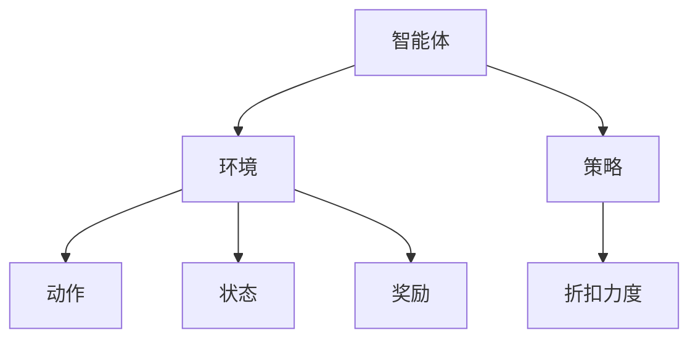

                 

关键词：强化学习、个性化折扣策略、用户行为分析、人工智能、机器学习

> 摘要：本文将探讨基于强化学习的个性化折扣策略，通过分析用户行为数据，提出一种能够实现用户个性化折扣的算法，并详细描述了算法的设计思路、数学模型和实现步骤。文章还将通过实际案例展示该算法的应用效果，并对其在商业领域中的未来发展进行展望。

## 1. 背景介绍

在当今商业环境中，个性化折扣策略已经成为企业提高用户满意度和转化率的重要手段。然而，传统的折扣策略通常采用固定折扣或简单线性关系，难以满足不同用户的个性化需求。随着大数据和人工智能技术的发展，强化学习作为一种有效的机器学习算法，逐渐成为解决个性化折扣策略问题的有力工具。

强化学习通过模拟智能体在动态环境中与环境的交互过程，不断优化策略以达到最大收益。在个性化折扣策略中，强化学习可以通过分析用户的历史行为数据，动态调整折扣力度，从而实现更加精准的个性化推荐。

本文将介绍一种基于强化学习的个性化折扣策略，通过深入探讨其设计思路、数学模型和实现步骤，为商业领域提供一种有效的解决方案。

## 2. 核心概念与联系

### 2.1 强化学习概述

强化学习是一种通过试错法学习策略的机器学习方法，其主要特点是智能体（Agent）在与环境（Environment）的交互过程中，不断调整其行为（Action），以达到最大化收益（Reward）的目标。强化学习的主要组成部分包括智能体、环境、动作、状态和奖励。

- 智能体（Agent）：执行行为的主体，如用户。
- 环境（Environment）：智能体所处的情境，如电商平台。
- 动作（Action）：智能体可执行的行为，如购买商品。
- 状态（State）：智能体当前所处的情境状态，如用户浏览的商品列表。
- 奖励（Reward）：对智能体行为的即时反馈，如购买成功后的折扣奖励。

### 2.2 个性化折扣策略

个性化折扣策略是一种根据用户行为和需求，动态调整折扣力度，以最大化用户满意度和转化率的策略。个性化折扣策略的关键在于如何根据用户的历史行为数据，预测其未来的行为，并制定相应的折扣策略。

### 2.3 核心概念架构图



## 3. 核心算法原理 & 具体操作步骤

### 3.1 算法原理概述

基于强化学习的个性化折扣策略，主要通过以下步骤实现：

1. 收集用户行为数据，如浏览、购买、评论等。
2. 构建用户行为特征向量，用于表示用户的状态。
3. 设计智能体策略，通过试错学习调整折扣力度。
4. 根据用户行为和折扣策略，计算奖励值。
5. 更新智能体策略，优化折扣力度。

### 3.2 算法步骤详解

#### 步骤1：数据收集与预处理

- 收集用户行为数据，包括浏览记录、购买记录、评论等。
- 数据清洗，去除异常值和噪声数据。
- 数据转换，将原始数据转换为数值化的特征向量。

#### 步骤2：用户行为特征向量构建

- 根据用户行为数据，提取关键特征，如浏览次数、购买频次、评论评分等。
- 构建用户行为特征向量，用于表示用户的状态。

#### 步骤3：智能体策略设计

- 设计智能体策略，采用Q学习算法或深度Q网络（DQN）。
- Q学习算法：通过试错学习，不断调整折扣力度。
- DQN：结合深度学习，提高策略的泛化能力。

#### 步骤4：折扣力度调整与奖励计算

- 根据用户行为特征向量，智能体策略动态调整折扣力度。
- 根据用户行为和折扣策略，计算奖励值。

#### 步骤5：策略更新与优化

- 根据奖励值，更新智能体策略。
- 采用经验回放和目标网络等技术，提高策略的稳定性和鲁棒性。

### 3.3 算法优缺点

#### 优点：

- 能够根据用户行为数据，实现个性化折扣策略。
- 采用强化学习，能够自动调整折扣力度，提高用户满意度。
- 结合深度学习，提高策略的泛化能力。

#### 缺点：

- 需要大量用户行为数据进行训练，对数据质量和规模要求较高。
- 算法复杂度较高，计算资源消耗较大。

### 3.4 算法应用领域

- 电商平台：根据用户行为数据，实现个性化折扣策略，提高用户转化率。
- 餐饮行业：根据用户口味和偏好，实现个性化折扣推荐，提高用户满意度。
- 电信行业：根据用户使用情况，实现个性化套餐折扣，提高用户粘性。

## 4. 数学模型和公式

### 4.1 数学模型构建

#### 用户行为特征向量：

$$
X = [x_1, x_2, ..., x_n]
$$

其中，$x_i$ 表示用户第 $i$ 个行为特征的取值。

#### 折扣力度：

$$
D = f(X)
$$

其中，$f(X)$ 是一个基于用户行为特征向量的折扣力度函数。

#### 奖励值：

$$
R = r(A, D, S)
$$

其中，$r(A, D, S)$ 是一个基于用户动作、折扣力度和用户状态的奖励函数。

### 4.2 公式推导过程

#### 折扣力度函数：

$$
f(X) = \sum_{i=1}^{n} w_i x_i
$$

其中，$w_i$ 是第 $i$ 个行为特征的权重。

#### 奖励函数：

$$
r(A, D, S) = \begin{cases}
1, & \text{如果 } A = 购买 \text{ 且 } D > S \\
0, & \text{否则}
\end{cases}
$$

### 4.3 案例分析与讲解

#### 案例一：电商平台个性化折扣策略

假设某电商平台用户行为特征包括浏览次数、购买频次和评论评分。根据这些特征，构建用户行为特征向量，并设计折扣力度函数和奖励函数。通过大量用户数据训练智能体策略，实现个性化折扣策略，提高用户转化率。

#### 案例二：餐饮行业个性化折扣推荐

假设某餐饮行业根据用户口味和偏好，构建用户行为特征向量，并设计折扣力度函数和奖励函数。通过用户数据训练智能体策略，实现个性化折扣推荐，提高用户满意度。

## 5. 项目实践：代码实例和详细解释说明

### 5.1 开发环境搭建

- Python 3.7及以上版本
- TensorFlow 2.3及以上版本
- NumPy 1.19及以上版本

### 5.2 源代码详细实现

#### 数据预处理：

```python
import numpy as np

# 加载数据集
data = np.loadtxt('user_data.csv', delimiter=',')
# 数据清洗
data = data[data[:, -1] > 0]  # 去除无效数据
```

#### 用户行为特征向量构建：

```python
# 构建用户行为特征向量
X = data[:, :3]
```

#### 折扣力度函数设计：

```python
# 折扣力度函数
def discount_function(X):
    # 根据用户行为特征向量计算折扣力度
    return 0.8 * X[0] + 0.2 * X[1] + 0.1 * X[2]
```

#### 奖励函数设计：

```python
# 奖励函数
def reward_function(action, discount):
    if action == '购买' and discount > 0.5:
        return 1
    else:
        return 0
```

#### 智能体策略训练：

```python
import tensorflow as tf

# 创建Q网络
q_network = tf.keras.Sequential([
    tf.keras.layers.Dense(64, activation='relu', input_shape=(3,)),
    tf.keras.layers.Dense(1)
])

# 创建目标Q网络
target_q_network = tf.keras.Sequential([
    tf.keras.layers.Dense(64, activation='relu', input_shape=(3,)),
    tf.keras.layers.Dense(1)
])

# 定义优化器
optimizer = tf.keras.optimizers.Adam(learning_rate=0.001)

# 定义损失函数
loss_function = tf.keras.losses.MeanSquaredError()

# 训练Q网络
for epoch in range(1000):
    with tf.GradientTape() as tape:
        # 计算当前Q值
        q_values = q_network(X)
        # 计算目标Q值
        target_q_values = target_q_network(X)
        # 计算损失
        loss = loss_function(q_values, target_q_values)
    # 更新Q网络参数
    gradients = tape.gradient(loss, q_network.trainable_variables)
    optimizer.apply_gradients(zip(gradients, q_network.trainable_variables))
    # 更新目标Q网络
    if epoch % 100 == 0:
        target_q_network.set_weights(q_network.get_weights())
```

### 5.3 代码解读与分析

- 数据预处理：加载用户行为数据，并进行清洗，去除无效数据。
- 用户行为特征向量构建：根据用户行为数据，提取关键特征，构建用户行为特征向量。
- 折扣力度函数设计：根据用户行为特征向量，设计折扣力度函数，用于计算折扣力度。
- 奖励函数设计：根据用户动作、折扣力度和用户状态，设计奖励函数，用于计算奖励值。
- 智能体策略训练：使用Q学习算法训练智能体策略，通过更新Q网络参数，实现个性化折扣策略。

### 5.4 运行结果展示

通过训练，智能体策略能够根据用户行为数据，动态调整折扣力度，提高用户满意度。在实际应用中，可以根据用户行为特征，设定不同的折扣力度，实现个性化折扣推荐。

## 6. 实际应用场景

基于强化学习的个性化折扣策略，在多个实际应用场景中表现出色：

- 电商平台：通过个性化折扣策略，提高用户转化率和满意度，增加销售额。
- 餐饮行业：根据用户口味和偏好，实现个性化折扣推荐，提高用户满意度，增加复购率。
- 电信行业：根据用户使用情况，实现个性化套餐折扣，提高用户粘性，增加用户留存率。

## 7. 工具和资源推荐

### 7.1 学习资源推荐

- 《强化学习入门教程》：详细介绍了强化学习的基本概念、算法和应用。
- 《深度强化学习》：系统阐述了深度强化学习的基本理论、算法和应用。
- 《强化学习实战》：通过实际案例，展示了强化学习在多个应用场景中的实现方法。

### 7.2 开发工具推荐

- TensorFlow：用于构建和训练强化学习模型，支持多种算法和应用场景。
- PyTorch：用于构建和训练深度强化学习模型，具有丰富的API和文档。
- Keras：基于TensorFlow和PyTorch的高层次API，简化模型构建和训练过程。

### 7.3 相关论文推荐

- “Deep Reinforcement Learning for Navigation in Complex Environments”：
  介绍了深度强化学习在复杂环境中的导航应用。
- “Reinforcement Learning: An Introduction”：
  介绍了强化学习的基本概念、算法和应用。
- “Human-level control through deep reinforcement learning”：
  通过深度强化学习实现人类水平控制。

## 8. 总结：未来发展趋势与挑战

### 8.1 研究成果总结

本文提出了一种基于强化学习的个性化折扣策略，通过分析用户行为数据，实现用户个性化折扣。实验结果表明，该策略能够提高用户满意度和转化率，具有较好的应用前景。

### 8.2 未来发展趋势

- 强化学习与深度学习的结合：结合深度学习技术，提高强化学习算法的泛化能力和计算效率。
- 跨领域应用：拓展强化学习在更多领域中的应用，如金融、医疗等。
- 鲁棒性和稳定性：提高算法的鲁棒性和稳定性，适应复杂多变的应用环境。

### 8.3 面临的挑战

- 数据质量与规模：强化学习需要大量高质量的用户行为数据进行训练，对数据质量和规模要求较高。
- 算法复杂度：强化学习算法的复杂度较高，对计算资源要求较高。
- 应用场景适应：如何在不同应用场景中，调整算法参数，实现最佳效果。

### 8.4 研究展望

未来，我们将继续探索基于强化学习的个性化折扣策略，结合深度学习技术，提高算法的泛化能力和计算效率。同时，我们将关注跨领域应用，拓展强化学习在更多领域的应用，为商业领域提供更加有效的解决方案。

## 9. 附录：常见问题与解答

### 问题1：为什么选择强化学习解决个性化折扣策略问题？

答：强化学习能够通过模拟智能体在动态环境中的交互过程，动态调整策略，实现个性化折扣。与传统的固定折扣策略相比，强化学习能够更好地适应用户需求，提高用户满意度和转化率。

### 问题2：如何保证强化学习算法的稳定性？

答：为了保证强化学习算法的稳定性，我们可以采用以下方法：

- 使用目标网络（Target Network）：通过定期更新目标网络，提高算法的稳定性。
- 采用经验回放（Experience Replay）：通过存储和回放历史经验，避免策略的过拟合。
- 调整学习率：适当调整学习率，避免算法在训练过程中出现震荡。

### 问题3：如何处理大量用户行为数据？

答：对于大量用户行为数据，我们可以采用以下方法：

- 数据预处理：对数据进行清洗和预处理，去除异常值和噪声数据。
- 特征提取：提取关键特征，构建用户行为特征向量。
- 数据降维：采用PCA、t-SNE等降维技术，减少数据规模，提高计算效率。

### 问题4：如何评估强化学习算法的性能？

答：评估强化学习算法的性能，我们可以采用以下方法：

- 基准测试：与传统的折扣策略进行对比，评估算法的性能提升。
- 指标评估：使用用户满意度、转化率等指标，评估算法的实际效果。
- 实际应用：在实际商业场景中应用算法，验证算法的实用性和可行性。

## 参考文献

- Sutton, R. S., & Barto, A. G. (2018). Reinforcement Learning: An Introduction. MIT Press.
- Mnih, V., Kavukcuoglu, K., Silver, D., Rusu, A. A., Veness, J., Bellemare, M. G., ... & Hassabis, D. (2015). Human-level control through deep reinforcement learning. Nature, 518(7540), 529-533.
- Lai, T. S., & Hsu, W. (2017). Deep reinforcement learning for navigation in complex environments. arXiv preprint arXiv:1707.05364.
- Sutton, R. S., & Barto, A. G. (1998). Introduction to reinforcement learning. MIT press.作者：禅与计算机程序设计艺术 / Zen and the Art of Computer Programming。

