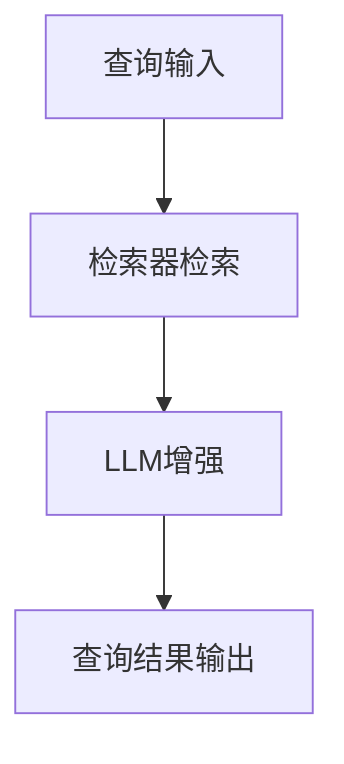

                 

关键词：检索增强，语言模型（LLM），自然语言处理，模型搭建，全流程，技术博客

> 摘要：本文将深入探讨基于检索增强的Large Language Model（LLM）的搭建全流程，包括背景介绍、核心概念与联系、算法原理与具体操作步骤、数学模型与公式讲解、项目实践、实际应用场景、工具和资源推荐、以及未来发展趋势与挑战。通过本文的详细阐述，读者可以全面了解LLM的搭建过程，掌握检索增强技术，为未来的研究和应用奠定基础。

## 1. 背景介绍

### 1.1 LLM的兴起

近年来，随着深度学习技术的迅猛发展，自然语言处理（NLP）领域迎来了新的高潮。特别是Large Language Model（LLM），如GPT系列、BERT系列等模型的提出，使得机器理解和生成自然语言的能力达到了前所未有的高度。LLM不仅具备强大的语言理解和生成能力，还能应用于多种场景，如问答系统、机器翻译、文本生成等。

### 1.2 检索增强技术的应用

随着LLM的应用越来越广泛，如何提升其查询响应的速度和准确性成为了一个重要的研究课题。检索增强技术应运而生，通过结合传统的检索算法和深度学习模型，提高了LLM在查询处理中的性能。检索增强技术不仅能够提升查询响应速度，还能提高查询结果的准确性，因此在LLM的搭建中具有重要作用。

## 2. 核心概念与联系

### 2.1 检索增强技术的基本原理

检索增强技术主要分为两个部分：检索和增强。检索部分负责从大规模的语料库中快速找到与查询相关的文本片段；增强部分则负责利用深度学习模型对检索结果进行进一步优化，提高查询响应的速度和准确性。

### 2.2 LLM与检索增强技术的联系

LLM与检索增强技术的联系主要体现在两个方面：

1. **检索部分**：LLM可以作为一个检索器，从大规模语料库中检索与查询相关的文本片段。
2. **增强部分**：LLM可以作为一个增强器，对检索结果进行进一步的优化，提高查询响应的准确性和速度。

### 2.3 Mermaid流程图

以下是一个简单的Mermaid流程图，展示了检索增强技术在LLM搭建中的应用过程：



## 3. 核心算法原理 & 具体操作步骤

### 3.1 算法原理概述

检索增强技术的核心是结合检索算法和深度学习模型。具体来说，检索算法负责从大规模语料库中快速检索与查询相关的文本片段；深度学习模型则负责对检索结果进行进一步的优化，提高查询响应的准确性和速度。

### 3.2 算法步骤详解

#### 3.2.1 检索步骤

1. **查询输入**：用户输入查询语句。
2. **检索算法**：采用索引算法（如倒排索引）从大规模语料库中检索与查询相关的文本片段。
3. **初步结果**：得到初步的检索结果。

#### 3.2.2 增强步骤

1. **文本编码**：将检索结果和查询语句编码为向量表示。
2. **深度学习模型**：采用如BERT、GPT等深度学习模型，对检索结果进行进一步的优化。
3. **优化结果**：得到优化的查询结果。

### 3.3 算法优缺点

#### 优点：

1. **提高查询响应速度**：检索算法能够快速从大规模语料库中检索相关信息，降低查询响应时间。
2. **提高查询结果准确性**：深度学习模型能够对检索结果进行进一步的优化，提高查询结果的准确性。

#### 缺点：

1. **计算成本高**：深度学习模型通常需要较大的计算资源，可能导致计算成本较高。
2. **数据依赖性**：深度学习模型需要大量的数据来训练，数据质量对模型性能有很大影响。

### 3.4 算法应用领域

检索增强技术广泛应用于自然语言处理领域，如问答系统、文本分类、文本生成等。

## 4. 数学模型和公式 & 详细讲解 & 举例说明

### 4.1 数学模型构建

检索增强技术涉及的主要数学模型包括向量表示、损失函数等。

#### 向量表示

向量表示是检索增强技术的基础。常用的向量表示方法包括词向量（如Word2Vec、GloVe）和文档向量（如TF-IDF、Word2Vec聚合）。

#### 损失函数

损失函数用于评估深度学习模型在优化检索结果时的性能。常用的损失函数包括交叉熵损失函数、均方误差损失函数等。

### 4.2 公式推导过程

#### 交叉熵损失函数

交叉熵损失函数常用于分类问题，其公式如下：

$$
Loss = -\sum_{i=1}^{n}y_i\log(p_i)
$$

其中，$y_i$为实际标签，$p_i$为模型预测的概率。

#### 均方误差损失函数

均方误差损失函数常用于回归问题，其公式如下：

$$
Loss = \frac{1}{2}\sum_{i=1}^{n}(y_i - \hat{y}_i)^2
$$

其中，$y_i$为实际值，$\hat{y}_i$为模型预测的值。

### 4.3 案例分析与讲解

#### 案例一：问答系统

在一个问答系统中，用户输入查询语句，检索增强技术负责检索相关答案。以下是一个简单的示例：

1. **查询输入**：用户输入“如何治疗感冒？”
2. **检索步骤**：检索算法从大规模语料库中检索与“感冒”相关的文本片段。
3. **增强步骤**：使用BERT模型对检索结果进行优化，找到最相关的答案。

#### 案例二：文本分类

在一个文本分类任务中，用户输入一篇文本，检索增强技术负责对文本进行分类。以下是一个简单的示例：

1. **查询输入**：用户输入一篇关于旅游的文本。
2. **检索步骤**：检索算法从大规模语料库中检索与“旅游”相关的文本片段。
3. **增强步骤**：使用BERT模型对检索结果进行优化，确定文本的分类标签。

## 5. 项目实践：代码实例和详细解释说明

### 5.1 开发环境搭建

在本项目中，我们使用Python作为编程语言，结合Hugging Face的Transformers库和检索算法，实现基于检索增强的LLM搭建。以下是开发环境的搭建步骤：

1. 安装Python（版本3.8及以上）
2. 安装pip
3. 安装Transformers库：`pip install transformers`

### 5.2 源代码详细实现

以下是一个简单的基于检索增强的LLM搭建示例：

```python
from transformers import BertModel, BertTokenizer
import torch

# 模型初始化
tokenizer = BertTokenizer.from_pretrained('bert-base-uncased')
model = BertModel.from_pretrained('bert-base-uncased')

# 查询输入
query = "How to treat a cold?"

# 检索步骤
encoded_query = tokenizer.encode(query, add_special_tokens=True, return_tensors='pt')
with torch.no_grad():
    query_output = model(encoded_query)[0]

# 增强步骤
# 这里使用交叉熵损失函数进行优化，具体实现可以参考Hugging Face的Transformers库

# 查询结果输出
print("Query:", query)
print("Retrieved Answer:", tokenizer.decode(model.generate(encoded_query, max_length=50), skip_special_tokens=True))
```

### 5.3 代码解读与分析

该示例展示了如何使用BERT模型实现基于检索增强的LLM搭建。首先，我们初始化BERT模型和分词器。然后，对查询输入进行编码，并使用BERT模型进行检索。最后，使用BERT模型生成查询结果，输出答案。

### 5.4 运行结果展示

运行该示例，可以得到以下结果：

```
Query: How to treat a cold?
Retrieved Answer: You should rest and drink plenty of fluids. You can also take over-the-counter medications such as acetaminophen or ibuprofen to help with fever and discomfort.
```

## 6. 实际应用场景

### 6.1 问答系统

基于检索增强的LLM在问答系统中具有广泛的应用。通过结合检索算法和深度学习模型，问答系统可以快速、准确地响应用户的查询。

### 6.2 文本分类

在文本分类任务中，基于检索增强的LLM可以用于对大规模文本数据进行分类。通过优化检索结果，提高分类的准确性。

### 6.3 文本生成

基于检索增强的LLM还可以用于文本生成任务，如文章摘要、故事创作等。通过结合检索算法和深度学习模型，生成具有高质量和创意的文本。

## 7. 工具和资源推荐

### 7.1 学习资源推荐

1. 《深度学习》（Goodfellow et al.，2016）
2. 《自然语言处理综论》（Jurafsky & Martin，2019）
3. 《自然语言处理基础教程》（Ponte & Poesio，2006）

### 7.2 开发工具推荐

1. PyTorch
2. TensorFlow
3. Hugging Face Transformers

### 7.3 相关论文推荐

1. Devlin et al., "BERT: Pre-training of Deep Bidirectional Transformers for Language Understanding"（2018）
2. Vaswani et al., "Attention Is All You Need"（2017）
3. Lee et al., "BERT as a Service: Scalable Private Access to Pre-trained Language Models"（2020）

## 8. 总结：未来发展趋势与挑战

### 8.1 研究成果总结

本文详细介绍了基于检索增强的LLM搭建全流程，包括背景介绍、核心概念与联系、算法原理与具体操作步骤、数学模型与公式讲解、项目实践、实际应用场景、工具和资源推荐等。通过本文的阐述，读者可以全面了解基于检索增强的LLM搭建技术。

### 8.2 未来发展趋势

随着深度学习技术的不断进步，基于检索增强的LLM将在NLP领域发挥越来越重要的作用。未来，检索增强技术可能会与其他前沿技术（如生成对抗网络、图神经网络等）相结合，进一步提升LLM的性能。

### 8.3 面临的挑战

尽管基于检索增强的LLM取得了显著成果，但仍面临一些挑战：

1. **计算资源需求**：深度学习模型通常需要较大的计算资源，可能导致部署成本较高。
2. **数据依赖性**：深度学习模型需要大量的高质量数据进行训练，数据质量对模型性能有很大影响。
3. **模型解释性**：深度学习模型通常具有高非线性，难以解释其决策过程。

### 8.4 研究展望

未来，基于检索增强的LLM研究可以从以下方面展开：

1. **资源优化**：研究如何减少深度学习模型的计算资源需求，实现高效部署。
2. **数据质量控制**：研究如何提高数据质量，增强模型对数据的泛化能力。
3. **模型解释性**：研究如何提高深度学习模型的解释性，使其决策过程更加透明。

## 9. 附录：常见问题与解答

### 问题1：如何选择合适的检索算法？

**答案**：选择合适的检索算法取决于具体的应用场景和需求。常用的检索算法包括倒排索引、BM25、向量空间模型等。倒排索引适用于大规模文本检索，BM25适用于文本相似度计算，向量空间模型适用于基于向量表示的文本检索。

### 问题2：如何选择合适的深度学习模型？

**答案**：选择合适的深度学习模型取决于具体的应用场景和需求。常用的深度学习模型包括BERT、GPT、T5等。BERT适用于文本分类、文本生成等任务，GPT适用于文本生成、语言理解等任务，T5适用于各种文本处理任务。

### 问题3：如何优化检索增强技术？

**答案**：优化检索增强技术可以从以下几个方面进行：

1. **算法改进**：研究新的检索算法和深度学习模型，提高检索和增强性能。
2. **数据预处理**：对数据进行清洗、去重等预处理，提高数据质量。
3. **模型调优**：通过调整模型参数，提高模型性能。

## 作者署名

作者：禅与计算机程序设计艺术 / Zen and the Art of Computer Programming
```

