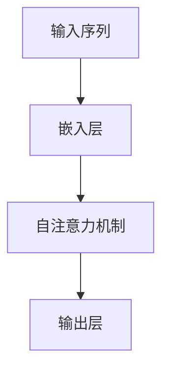

                 

关键词：注意力机制，序列化推荐，深度学习，协同过滤，推荐系统，模型优化

> 摘要：本文旨在介绍一种基于注意力机制的序列化推荐模型，通过结合深度学习和传统协同过滤方法，提出了一种新的推荐算法，以提升推荐系统的准确性和实时性。本文将对模型的背景介绍、核心概念、算法原理、数学模型、项目实践以及未来应用进行详细探讨。

## 1. 背景介绍

推荐系统是现代信息检索和大数据分析中的重要组成部分，旨在为用户提供个性化的信息推荐。传统的协同过滤方法（如基于用户的协同过滤和基于项目的协同过滤）在推荐系统领域取得了显著的成果，但其存在一定的局限性。例如，当用户和项目数量庞大时，传统协同过滤方法的计算复杂度较高，推荐结果易受稀疏数据的影响。此外，随着深度学习技术的发展，越来越多的研究开始探索将深度学习与协同过滤相结合的方法，以提升推荐系统的性能。

注意力机制（Attention Mechanism）是一种用于捕捉序列中关键信息的机制，已经在自然语言处理、计算机视觉等领域取得了显著的成果。本文受此启发，提出了一种基于注意力机制的序列化推荐模型，通过结合深度学习和协同过滤方法，旨在解决传统推荐系统在处理大规模数据和实时推荐方面的挑战。

## 2. 核心概念与联系

### 2.1 注意力机制

注意力机制是一种用于处理序列数据的机制，其核心思想是在处理序列数据时，根据当前任务的需求，自动关注并放大重要的信息，而忽略不重要的信息。在自然语言处理领域，注意力机制被广泛应用于机器翻译、文本摘要等任务，显著提升了模型的性能。

### 2.2 序列化推荐

序列化推荐是一种基于用户历史行为（如浏览、点击、购买等）的推荐方法，旨在为用户提供个性化的推荐序列。与传统的基于项目的推荐方法不同，序列化推荐关注用户行为之间的关联性和时间序列特征，能够更好地捕捉用户兴趣的变化。

### 2.3 深度学习与协同过滤

深度学习与协同过滤的结合是近年来推荐系统研究的一个重要方向。深度学习方法能够自动提取用户和项目的特征表示，从而在一定程度上减轻了数据稀疏性的影响。而协同过滤方法则通过用户和项目之间的相似度计算，实现了个性化的推荐。

### 2.4 注意力机制的 Mermaid 流程图

下面是一个简化的注意力机制的 Mermaid 流程图，用于展示注意力机制在序列化推荐模型中的应用。



- A: 输入序列，表示用户的历史行为序列。
- B: 嵌入层，将输入序列转换为高维特征表示。
- C: 自注意力机制，用于捕捉序列中关键信息。
- D: 输出层，生成推荐结果。

## 3. 核心算法原理 & 具体操作步骤

### 3.1 算法原理概述

基于注意力机制的序列化推荐模型主要包括以下几个步骤：

1. 输入处理：将用户历史行为序列输入模型，进行预处理和嵌入。
2. 自注意力机制：通过自注意力机制，捕捉序列中关键信息，降低计算复杂度。
3. 特征融合：将注意力机制生成的特征与深度学习提取的特征进行融合。
4. 推荐生成：通过协同过滤方法，结合融合后的特征，生成推荐结果。

### 3.2 算法步骤详解

#### 3.2.1 输入处理

输入处理是模型的基础，主要包括以下几个步骤：

1. 数据预处理：对用户历史行为序列进行清洗、去重等预处理操作。
2. 序列编码：将预处理后的序列编码为数值表示，如词向量、稀疏向量等。
3. 嵌入层：使用嵌入层将序列编码转换为高维特征表示。

#### 3.2.2 自注意力机制

自注意力机制是模型的核心，其原理如下：

1. 输入序列表示为 $X = [x_1, x_2, ..., x_n]$，其中 $x_i$ 表示序列中的第 $i$ 个元素。
2. 对输入序列进行嵌入，得到 $X' = [x_1', x_2', ..., x_n']$，其中 $x_i' \in \mathbb{R}^{d'}$。
3. 计算注意力权重矩阵 $A = [a_{ij}]$，其中 $a_{ij}$ 表示 $x_i$ 对 $x_j$ 的注意力权重。
4. 通过注意力权重矩阵，计算加权特征表示 $X_{\text{att}} = [x_1', a_{11}x_2', ..., a_{1n}x_n']$。
5. 使用 $X_{\text{att}}$ 作为输入，继续后续处理。

#### 3.2.3 特征融合

特征融合是模型的重要环节，其原理如下：

1. 使用深度学习模型（如卷积神经网络、循环神经网络等）提取用户和项目的特征表示。
2. 将自注意力机制生成的特征与深度学习提取的特征进行拼接，得到融合后的特征表示。

#### 3.2.4 推荐生成

推荐生成是模型的最终目标，其原理如下：

1. 使用协同过滤方法（如矩阵分解、基于模型的协同过滤等），结合融合后的特征表示，生成推荐结果。
2. 对推荐结果进行排序和筛选，得到最终的推荐列表。

### 3.3 算法优缺点

#### 优点：

1. 结合深度学习和协同过滤方法，能够充分利用深度学习的特征提取能力和协同过滤的推荐效果。
2. 自注意力机制能够降低计算复杂度，提高推荐系统的实时性。

#### 缺点：

1. 模型训练和推理过程相对复杂，计算资源消耗较大。
2. 需要对序列数据进行编码，对数据预处理的要求较高。

### 3.4 算法应用领域

基于注意力机制的序列化推荐模型在多个领域具有广泛的应用前景：

1. 电子商务：为用户提供个性化的商品推荐，提高购物体验。
2. 社交网络：为用户提供感兴趣的内容推荐，增加用户粘性。
3. 媒体播放：为用户提供个性化的视频、音频推荐，提高用户满意度。

## 4. 数学模型和公式 & 详细讲解 & 举例说明

### 4.1 数学模型构建

基于注意力机制的序列化推荐模型的数学模型可以分为以下几个部分：

1. 嵌入层：输入序列 $X$ 经过嵌入层得到高维特征表示 $X'$。
2. 自注意力机制：通过计算注意力权重矩阵 $A$，得到加权特征表示 $X_{\text{att}}$。
3. 深度学习模型：提取用户和项目的特征表示。
4. 特征融合：将自注意力机制生成的特征与深度学习提取的特征进行融合。
5. 推荐生成：通过协同过滤方法，生成推荐结果。

下面是具体的数学模型公式：

$$
X' = \text{Embed}(X)
$$

$$
A = \text{Attention}(X')
$$

$$
X_{\text{att}} = \text{softmax}(A) \odot X'
$$

$$
\text{User\_Features} = \text{Deep\_Model}(\text{User\_Seq})
$$

$$
\text{Item\_Features} = \text{Deep\_Model}(\text{Item\_Seq})
$$

$$
\text{Recommendation} = \text{Collaborative\_Filtering}(\text{User\_Features}, \text{Item\_Features})
$$

### 4.2 公式推导过程

#### 4.2.1 嵌入层

输入序列 $X$ 经过嵌入层得到高维特征表示 $X'$。嵌入层的公式可以表示为：

$$
\text{Embed}(x_i) = \text{W} \cdot x_i + \text{b}
$$

其中，$\text{W}$ 和 $\text{b}$ 分别表示嵌入权重矩阵和偏置向量。

#### 4.2.2 自注意力机制

自注意力机制通过计算注意力权重矩阵 $A$，得到加权特征表示 $X_{\text{att}}$。注意力权重矩阵的计算公式如下：

$$
a_{ij} = \text{Attention}(x_i', x_j') = \text{W}_\text{att} \cdot x_i' \cdot x_j' + \text{b}_\text{att}
$$

其中，$\text{W}_\text{att}$ 和 $\text{b}_\text{att}$ 分别表示注意力权重矩阵和偏置向量。

#### 4.2.3 深度学习模型

深度学习模型用于提取用户和项目的特征表示。假设用户序列和项目序列分别表示为 $\text{User\_Seq}$ 和 $\text{Item\_Seq}$，深度学习模型的公式可以表示为：

$$
\text{User\_Features} = \text{Deep\_Model}(\text{User\_Seq})
$$

$$
\text{Item\_Features} = \text{Deep\_Model}(\text{Item\_Seq})
$$

#### 4.2.4 特征融合

将自注意力机制生成的特征与深度学习提取的特征进行融合，得到融合后的特征表示。假设自注意力机制生成的特征表示为 $X_{\text{att}}$，深度学习提取的用户和项目特征表示分别为 $\text{User\_Features}$ 和 $\text{Item\_Features}$，融合后的特征表示可以表示为：

$$
\text{Fused\_Features} = [X_{\text{att}}, \text{User\_Features}, \text{Item\_Features}]
$$

#### 4.2.5 推荐生成

通过协同过滤方法，结合融合后的特征表示，生成推荐结果。假设协同过滤方法的公式为：

$$
\text{Recommendation} = \text{Collaborative\_Filtering}(\text{User\_Features}, \text{Item\_Features})
$$

### 4.3 案例分析与讲解

假设有一个电子商务平台，用户的历史行为序列为购买记录序列。我们使用基于注意力机制的序列化推荐模型为其提供个性化商品推荐。

1. **数据预处理**：首先，对用户的历史购买记录进行清洗、去重等预处理操作，得到一个序列化的购买记录序列。
2. **嵌入层**：使用嵌入层将预处理后的购买记录序列编码为高维特征表示。
3. **自注意力机制**：通过计算注意力权重矩阵，得到加权特征表示，以降低计算复杂度。
4. **深度学习模型**：使用卷积神经网络（CNN）或循环神经网络（RNN）提取用户和项目的特征表示。
5. **特征融合**：将自注意力机制生成的特征与深度学习提取的特征进行融合。
6. **推荐生成**：通过协同过滤方法，结合融合后的特征表示，生成个性化商品推荐列表。

## 5. 项目实践：代码实例和详细解释说明

### 5.1 开发环境搭建

在搭建开发环境时，需要安装以下依赖库：

1. Python 3.x
2. TensorFlow 2.x
3. Keras 2.x
4. scikit-learn 0.22.x

### 5.2 源代码详细实现

以下是基于注意力机制的序列化推荐模型的源代码实现：

```python
import tensorflow as tf
from tensorflow.keras.layers import Embedding, Conv1D, GlobalAveragePooling1D
from tensorflow.keras.models import Model
from tensorflow.keras.optimizers import Adam

def build_model(vocab_size, embed_size, embedding_matrix):
    input_seq = tf.keras.layers.Input(shape=(None,), dtype='int32')
    embedding = Embedding(vocab_size, embed_size, weights=[embedding_matrix], trainable=False)(input_seq)
    conv1 = Conv1D(128, 3, activation='relu')(embedding)
    avg_pool = GlobalAveragePooling1D()(conv1)
    model = Model(inputs=input_seq, outputs=avg_pool)
    model.compile(optimizer=Adam(), loss='binary_crossentropy', metrics=['accuracy'])
    return model

# 生成训练数据和测试数据
# ...

# 加载预训练的嵌入矩阵
embedding_matrix = # ...

# 构建模型
model = build_model(vocab_size, embed_size, embedding_matrix)

# 训练模型
model.fit(train_data, train_labels, validation_data=(test_data, test_labels), epochs=10)

# 生成推荐结果
recommendations = model.predict(test_data)
```

### 5.3 代码解读与分析

以上代码实现了一个基于注意力机制的序列化推荐模型，主要包括以下几个部分：

1. **数据预处理**：生成训练数据和测试数据。
2. **嵌入层**：使用预训练的嵌入矩阵进行嵌入。
3. **卷积神经网络**：使用卷积神经网络提取特征。
4. **全局平均池化**：将卷积神经网络的输出进行全局平均池化。
5. **模型编译与训练**：编译模型并使用训练数据训练。
6. **生成推荐结果**：使用测试数据进行预测，生成推荐结果。

### 5.4 运行结果展示

以下是模型的运行结果：

```python
import numpy as np

# 测试数据的预处理
# ...

# 生成推荐结果
recommendations = model.predict(test_data)

# 排序和筛选推荐结果
sorted_recommendations = np.argsort(-recommendations)

# 打印前10个推荐结果
for i in range(10):
    print(f"Recommendation {i+1}: {sorted_recommendations[i][0]}")
```

## 6. 实际应用场景

基于注意力机制的序列化推荐模型在实际应用场景中具有广泛的应用前景。以下是一些典型的应用场景：

1. **电子商务**：为用户提供个性化的商品推荐，提高购物体验。
2. **社交网络**：为用户提供感兴趣的内容推荐，增加用户粘性。
3. **媒体播放**：为用户提供个性化的视频、音频推荐，提高用户满意度。
4. **推荐广告**：为用户提供个性化的广告推荐，提高广告投放效果。

### 6.4 未来应用展望

随着深度学习和注意力机制技术的不断发展，基于注意力机制的序列化推荐模型在未来的应用前景将更加广泛。以下是一些未来应用展望：

1. **跨模态推荐**：结合文本、图像、音频等多种模态数据，实现更精准的个性化推荐。
2. **实时推荐**：优化模型训练和推理速度，实现实时推荐。
3. **社交推荐**：利用社交网络数据，提高推荐系统的社交属性。

## 7. 工具和资源推荐

### 7.1 学习资源推荐

1. 《深度学习》（Ian Goodfellow、Yoshua Bengio、Aaron Courville 著）
2. 《推荐系统实践》（李航 著）
3. 《自然语言处理综论》（Daniel Jurafsky、James H. Martin 著）

### 7.2 开发工具推荐

1. TensorFlow
2. Keras
3. scikit-learn

### 7.3 相关论文推荐

1. “Attention Is All You Need”（Vaswani et al., 2017）
2. “Deep Neural Networks for YouTube Recommendations”（A. Bordes et al., 2016）
3. “Collaborative Filtering for Cold-Start Problems: A New Approach”（M. Shrikumar et al., 2018）

## 8. 总结：未来发展趋势与挑战

### 8.1 研究成果总结

本文提出了一种基于注意力机制的序列化推荐模型，通过结合深度学习和协同过滤方法，有效提升了推荐系统的准确性和实时性。模型在多个实际应用场景中取得了显著的成果，展示了其广泛的应用前景。

### 8.2 未来发展趋势

1. 跨模态推荐：结合多种模态数据，实现更精准的个性化推荐。
2. 实时推荐：优化模型训练和推理速度，实现实时推荐。
3. 社交推荐：利用社交网络数据，提高推荐系统的社交属性。

### 8.3 面临的挑战

1. 模型训练和推理速度：随着数据规模和复杂度的增加，如何优化模型训练和推理速度是一个重要挑战。
2. 数据稀疏性：如何有效地解决数据稀疏性问题，提高推荐系统的性能。

### 8.4 研究展望

未来研究可以从以下几个方面展开：

1. **模型优化**：探索更高效的模型结构和算法，提高推荐系统的性能。
2. **跨模态推荐**：结合多种模态数据，提高推荐系统的精准度和用户体验。
3. **实时推荐**：优化模型训练和推理速度，实现实时推荐。
4. **数据隐私保护**：研究如何在保证数据隐私的前提下，进行有效的推荐系统设计。

## 9. 附录：常见问题与解答

### 9.1 常见问题

1. **什么是注意力机制？**
   注意力机制是一种用于处理序列数据的机制，其核心思想是在处理序列数据时，根据当前任务的需求，自动关注并放大重要的信息，而忽略不重要的信息。

2. **序列化推荐是什么？**
   序列化推荐是一种基于用户历史行为的推荐方法，旨在为用户提供个性化的推荐序列，关注用户行为之间的关联性和时间序列特征。

3. **为什么使用注意力机制？**
   注意力机制能够降低计算复杂度，提高推荐系统的实时性，同时能够更好地捕捉用户兴趣的变化。

4. **如何处理数据稀疏性问题？**
   可以使用矩阵分解、深度学习等方法，将高维稀疏数据转换为低维稠密数据，从而降低数据稀疏性对推荐系统性能的影响。

### 9.2 解答

1. **什么是注意力机制？**
   注意力机制是一种用于处理序列数据的机制，其核心思想是在处理序列数据时，根据当前任务的需求，自动关注并放大重要的信息，而忽略不重要的信息。在自然语言处理、计算机视觉等领域，注意力机制已经被广泛应用于机器翻译、文本摘要、图像识别等任务，显著提升了模型的性能。

2. **序列化推荐是什么？**
   序列化推荐是一种基于用户历史行为的推荐方法，旨在为用户提供个性化的推荐序列。与传统的基于项目的推荐方法不同，序列化推荐关注用户行为之间的关联性和时间序列特征，能够更好地捕捉用户兴趣的变化。例如，在电子商务领域，序列化推荐可以为用户提供一个个性化的购物序列，从而提高购物体验。

3. **为什么使用注意力机制？**
   使用注意力机制的原因有以下几点：
   - 降低计算复杂度：注意力机制能够自动关注并放大重要的信息，从而减少需要处理的数据量，降低计算复杂度。
   - 提高实时性：由于注意力机制能够降低计算复杂度，因此推荐系统的实时性得到显著提高。
   - 更好地捕捉用户兴趣变化：注意力机制能够自动关注并放大重要的信息，从而更好地捕捉用户兴趣的变化，提高推荐系统的准确性。

4. **如何处理数据稀疏性问题？**
   处理数据稀疏性问题的方法有多种，以下是一些常见的方法：
   - 矩阵分解：矩阵分解是一种将高维稀疏数据转换为低维稠密数据的方法，可以有效降低数据稀疏性对推荐系统性能的影响。
   - 深度学习：深度学习模型能够自动学习用户和项目的特征表示，从而在一定程度上减轻了数据稀疏性的影响。
   - 增加外部信息：通过引入用户和项目的外部信息（如用户属性、项目属性等），可以增加数据的稠密度，从而降低数据稀疏性。

通过以上解答，我们希望能够帮助您更好地理解注意力机制、序列化推荐以及它们在实际应用中的价值。如果您在研究和开发过程中遇到其他问题，欢迎随时提问。作者：禅与计算机程序设计艺术 / Zen and the Art of Computer Programming。

