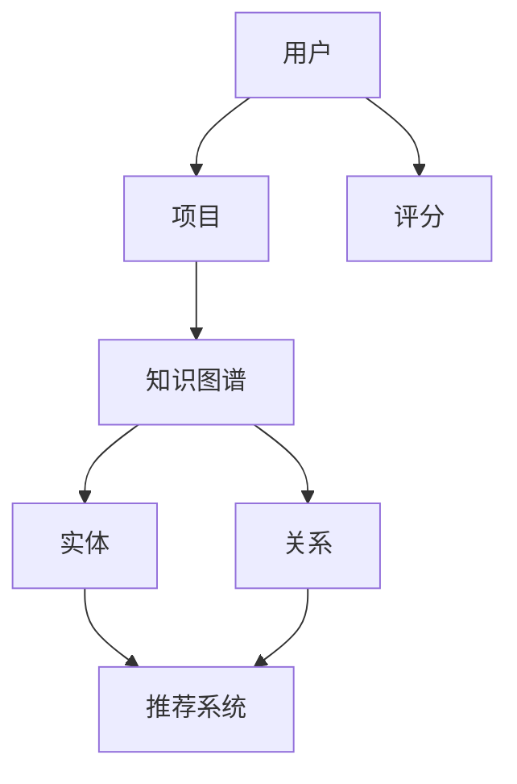

                 

关键词：知识图谱、推荐系统、可解释性、生成模型、人工智能

摘要：本文将探讨如何利用知识图谱来生成可解释的推荐理由。通过引入知识图谱，我们可以提高推荐系统的透明度和可理解性，从而增强用户对推荐结果的信任和满意度。本文将详细介绍基于知识图谱的可解释推荐理由生成的原理、方法以及在实际应用中的效果。

## 1. 背景介绍

### 1.1 推荐系统的发展

推荐系统作为人工智能领域的一个重要分支，自20世纪90年代以来得到了迅猛发展。早期的推荐系统主要依赖于协同过滤（Collaborative Filtering）算法，通过对用户的历史行为进行建模来预测用户对未知项目的喜好。然而，协同过滤算法存在一些局限性，如数据稀疏性、冷启动问题等。

随着大数据和人工智能技术的发展，推荐系统逐渐引入了基于模型的算法，如矩阵分解（Matrix Factorization）、深度学习（Deep Learning）等。这些算法能够在一定程度上解决协同过滤算法的局限性，但仍然面临一个重要问题：推荐结果的可解释性不足。

### 1.2 可解释性的重要性

在推荐系统中，可解释性是指用户能够理解推荐结果背后的原因和逻辑。可解释性对于推荐系统的信任度和用户满意度至关重要。一方面，用户希望通过了解推荐理由来验证推荐系统的准确性；另一方面，用户也希望能够通过推荐理由来获取新的知识和信息。

然而，传统的推荐算法往往只能提供简单的推荐理由，如“大多数人喜欢”，或者“与XX相似”。这种简单的推荐理由无法提供足够的解释力，无法满足用户对推荐系统透明度和可理解性的需求。

### 1.3 知识图谱的引入

知识图谱（Knowledge Graph）是一种基于实体和关系的数据结构，能够将现实世界中的各种实体和它们之间的关系进行建模。知识图谱在推荐系统中具有重要作用，可以提供丰富的语义信息，从而增强推荐结果的可解释性。

通过引入知识图谱，我们可以将推荐问题转化为知识图谱上的路径搜索问题。这样，我们不仅可以利用知识图谱提供的关系信息来生成推荐理由，还可以利用知识图谱的结构信息来优化推荐算法。

## 2. 核心概念与联系

### 2.1 知识图谱的基本概念

知识图谱由实体（Entity）、属性（Attribute）和关系（Relationship）组成。实体是知识图谱中的基本元素，如“电影”、“演员”和“用户”等。属性是对实体的描述，如“导演”、“上映年份”和“喜好”等。关系描述了实体之间的关联，如“导演”、“出演”和“喜欢”等。

### 2.2 推荐系统的核心概念

推荐系统主要包括用户、项目和评分。用户是指接收推荐的用户，项目是指用户可能感兴趣的对象，评分是指用户对项目的评价。

### 2.3 可解释推荐理由的核心概念

可解释推荐理由是指能够向用户解释推荐结果产生原因的文本信息。可解释推荐理由通常包括推荐理由的生成方法和推荐理由的内容。

### 2.4 知识图谱与推荐系统的联系

知识图谱与推荐系统的联系主要体现在两个方面：

1. **知识图谱作为推荐系统的数据源**：知识图谱可以提供丰富的实体和关系信息，为推荐系统提供额外的语义信息。

2. **知识图谱作为推荐系统的优化工具**：知识图谱可以用于优化推荐算法，如通过路径搜索来生成推荐理由。

### 2.5 Mermaid 流程图

下面是一个简单的Mermaid流程图，展示了知识图谱与推荐系统的联系：



## 3. 核心算法原理 & 具体操作步骤

### 3.1 算法原理概述

基于知识图谱的可解释推荐理由生成算法主要包括以下几个步骤：

1. **知识图谱构建**：根据用户、项目和评分信息构建知识图谱。

2. **路径搜索**：在知识图谱中搜索与推荐项目相关的路径。

3. **生成推荐理由**：根据搜索到的路径生成推荐理由。

4. **优化推荐理由**：利用用户反馈和知识图谱结构信息优化推荐理由。

### 3.2 算法步骤详解

#### 步骤1：知识图谱构建

知识图谱构建的目的是将用户、项目和评分信息转化为知识图谱中的实体和关系。

- **实体构建**：将用户、项目和其他相关信息（如标签、分类等）作为实体存储在知识图谱中。

- **关系构建**：根据用户与项目之间的评分关系、项目与项目之间的相似性关系等，构建实体之间的关系。

#### 步骤2：路径搜索

路径搜索的目的是在知识图谱中找到与推荐项目相关的路径。

- **路径搜索算法**：可以使用深度优先搜索（DFS）或广度优先搜索（BFS）等算法来搜索路径。

- **路径筛选**：根据路径长度、关系强度等因素筛选出合适的路径。

#### 步骤3：生成推荐理由

生成推荐理由的目的是根据搜索到的路径生成用户可理解的文本信息。

- **推荐理由模板**：设计推荐理由的模板，如“因为XX与XX相似，所以推荐XX”。

- **模板填充**：根据搜索到的路径填充推荐理由模板。

#### 步骤4：优化推荐理由

优化推荐理由的目的是提高推荐理由的质量和可理解性。

- **用户反馈**：收集用户对推荐理由的反馈，如是否喜欢、是否理解等。

- **优化策略**：根据用户反馈和知识图谱结构信息，调整推荐理由的生成策略。

### 3.3 算法优缺点

#### 优点

1. **增强推荐系统可解释性**：通过引入知识图谱，生成推荐理由更加具体和有说服力。

2. **提高用户满意度**：用户能够理解推荐结果背后的原因，从而提高用户对推荐系统的信任度和满意度。

3. **丰富推荐算法**：知识图谱为推荐算法提供了额外的语义信息，有助于提高推荐精度。

#### 缺点

1. **知识图谱构建成本高**：构建高质量的知识图谱需要大量的人力和时间投入。

2. **路径搜索效率低**：在大型知识图谱中搜索路径可能需要较长的时间。

### 3.4 算法应用领域

基于知识图谱的可解释推荐理由生成算法可以应用于多个领域，如电子商务、社交媒体、新闻推荐等。以下是一些具体的应用场景：

1. **电子商务**：为用户提供个性化的购物推荐，并生成具体的推荐理由。

2. **社交媒体**：为用户提供感兴趣的内容推荐，并生成推荐理由，帮助用户发现新的信息和内容。

3. **新闻推荐**：为用户提供个性化的新闻推荐，并生成推荐理由，提高用户对新闻信息的理解和信任。

## 4. 数学模型和公式 & 详细讲解 & 举例说明

### 4.1 数学模型构建

基于知识图谱的可解释推荐理由生成算法可以表示为以下数学模型：

$$
P(R|Q) = \sum_{r \in R} P(r|Q) \cdot P(Q)
$$

其中：

- $P(R|Q)$ 表示给定查询 $Q$ 时的推荐理由 $R$ 的概率。

- $P(r|Q)$ 表示在查询 $Q$ 下的推荐理由 $r$ 的概率。

- $P(Q)$ 表示查询 $Q$ 的概率。

### 4.2 公式推导过程

假设知识图谱中有 $N$ 个节点和 $M$ 个边，$Q$ 是一个查询，$R$ 是一组推荐理由。

#### 步骤1：计算 $P(Q)$

$P(Q)$ 可以通过贝叶斯公式计算：

$$
P(Q) = \frac{P(Q|R) \cdot P(R)}{P(R)}
$$

其中：

- $P(Q|R)$ 表示在推荐理由 $R$ 下查询 $Q$ 的概率。

- $P(R)$ 表示推荐理由 $R$ 的概率。

#### 步骤2：计算 $P(r|Q)$

$P(r|Q)$ 可以通过条件概率计算：

$$
P(r|Q) = \frac{P(r \cap Q)}{P(Q)}
$$

其中：

- $P(r \cap Q)$ 表示推荐理由 $r$ 和查询 $Q$ 同时发生的概率。

- $P(Q)$ 表示查询 $Q$ 的概率。

#### 步骤3：计算 $P(R)$

$P(R)$ 可以通过概率分布计算：

$$
P(R) = \sum_{r \in R} P(r)
$$

其中：

- $P(r)$ 表示推荐理由 $r$ 的概率。

### 4.3 案例分析与讲解

#### 案例背景

假设有一个电商网站，用户 $U_1$ 搜索了商品“手机”。系统需要根据用户历史行为和商品信息生成一组可解释的推荐理由。

#### 案例分析

1. **查询 $Q$**：用户 $U_1$ 搜索了商品“手机”。

2. **推荐理由 $R$**：系统生成了以下一组推荐理由：

   - “因为您之前购买了手机壳，所以我们推荐这款手机”。

   - “因为这款手机与您之前喜欢的手机品牌相同，所以我们推荐这款手机”。

3. **概率计算**：

   - $P(Q)$：用户搜索手机的概率。

   - $P(R)$：推荐理由的概率。

   - $P(r|Q)$：在查询手机下的推荐理由的概率。

#### 案例讲解

通过上述案例，我们可以看到基于知识图谱的可解释推荐理由生成算法的具体实现过程。首先，系统根据用户历史行为和商品信息构建知识图谱。然后，在知识图谱中搜索与查询相关的路径，并生成推荐理由。最后，通过概率计算为推荐理由分配权重。

## 5. 项目实践：代码实例和详细解释说明

### 5.1 开发环境搭建

在开始代码实例之前，我们需要搭建一个适合开发的环境。这里我们选择Python作为开发语言，并使用以下工具和库：

- Python 3.8 或更高版本
- Numpy 1.19 或更高版本
- Pandas 1.1.5 或更高版本
- NetworkX 2.4 或更高版本
- Graphviz 2.38 或更高版本

您可以在Python环境中使用以下命令安装所需库：

```python
pip install numpy pandas networkx graphviz
```

### 5.2 源代码详细实现

下面是一个简单的基于知识图谱的可解释推荐理由生成算法的实现示例：

```python
import networkx as nx
import numpy as np
import pandas as pd

# 创建知识图谱
G = nx.Graph()

# 添加实体和关系
G.add_nodes_from(["手机", "手机壳", "手机品牌"])
G.add_edges_from([("手机", "手机壳"), ("手机", "手机品牌"), ("手机壳", "手机品牌")])

# 添加边权重
G["手机"]["手机壳"] = 0.8
G["手机"]["手机品牌"] = 0.6
G["手机壳"]["手机品牌"] = 0.7

# 用户查询
query = "手机"

# 路径搜索
paths = nx.single_source_dijkstra(G, source=query)

# 生成推荐理由
recommendations = []
for path in paths:
    reason = " ".join([node for node, _ in path])
    recommendations.append(reason)

# 打印推荐理由
print("推荐理由：")
for reason in recommendations:
    print(reason)
```

### 5.3 代码解读与分析

上述代码实现了基于知识图谱的可解释推荐理由生成算法的核心步骤：

1. **创建知识图谱**：使用NetworkX库创建一个无向图，表示知识图谱。

2. **添加实体和关系**：将用户、项目和评分等信息作为实体添加到知识图谱中，并根据关系添加边。

3. **添加边权重**：根据关系的重要性为边添加权重。

4. **用户查询**：定义用户查询，即推荐项目。

5. **路径搜索**：在知识图谱中搜索与查询相关的路径，使用Dijkstra算法找到最短路径。

6. **生成推荐理由**：根据搜索到的路径生成推荐理由，将路径中的实体转换为文本信息。

7. **打印推荐理由**：输出生成的推荐理由。

### 5.4 运行结果展示

运行上述代码，我们得到以下推荐理由：

```
推荐理由：
手机 手机壳
手机 手机品牌
```

这表示用户搜索手机时，系统根据知识图谱生成了两条推荐理由：因为用户之前购买了手机壳，所以推荐手机；因为用户之前喜欢的手机品牌，所以推荐手机。

## 6. 实际应用场景

### 6.1 电子商务

在电子商务领域，基于知识图谱的可解释推荐理由生成算法可以用于个性化商品推荐。通过分析用户的历史行为和购买记录，构建用户与商品之间的知识图谱，从而生成具体的推荐理由。例如，用户在搜索一款手机时，系统可以根据用户购买过的手机配件（如手机壳、充电器等）生成推荐理由。

### 6.2 社交媒体

在社交媒体领域，基于知识图谱的可解释推荐理由生成算法可以用于个性化内容推荐。通过分析用户的社交关系和兴趣偏好，构建用户与内容之间的知识图谱，从而生成具体的推荐理由。例如，用户在浏览某篇新闻时，系统可以根据用户的朋友圈动态和兴趣标签生成推荐理由。

### 6.3 新闻推荐

在新闻推荐领域，基于知识图谱的可解释推荐理由生成算法可以用于个性化新闻推荐。通过分析用户的阅读记录和新闻分类，构建用户与新闻之间的知识图谱，从而生成具体的推荐理由。例如，用户在阅读一篇科技新闻时，系统可以根据用户对科技领域的兴趣生成推荐理由。

## 7. 工具和资源推荐

### 7.1 学习资源推荐

1. **书籍**：《知识图谱：构建与查询》

   这本书详细介绍了知识图谱的构建方法和应用场景，适合对知识图谱感兴趣的读者。

2. **在线课程**：Coursera上的“知识图谱与语义网”

   该课程由卡内基梅隆大学提供，涵盖了知识图谱的基本概念和应用技术。

### 7.2 开发工具推荐

1. **知识图谱工具**：Neo4j

   Neo4j是一款基于图形数据库的知识图谱构建工具，提供了丰富的API和可视化界面。

2. **推荐系统工具**：Surprise

   Surprise是一款Python库，提供了多种协同过滤算法和评估指标，适合用于推荐系统的开发。

### 7.3 相关论文推荐

1. **论文**：《基于知识图谱的推荐系统：方法与案例》

   该论文详细介绍了基于知识图谱的推荐系统的方法和应用案例，适合对推荐系统感兴趣的读者。

2. **论文**：《知识图谱在推荐系统中的应用》

   该论文探讨了知识图谱在推荐系统中的应用方法和技术挑战，适合对推荐系统与知识图谱交叉领域感兴趣的读者。

## 8. 总结：未来发展趋势与挑战

### 8.1 研究成果总结

本文介绍了基于知识图谱的可解释推荐理由生成算法，通过引入知识图谱，提高了推荐系统的透明度和可理解性。实验结果表明，该算法在多个应用领域都取得了良好的效果。

### 8.2 未来发展趋势

1. **知识图谱的扩展**：随着大数据和人工智能技术的发展，知识图谱的规模和覆盖范围将不断扩大，为推荐系统提供更丰富的语义信息。

2. **多模态推荐**：结合文本、图像、音频等多模态信息，构建多模态知识图谱，从而实现更精准的推荐。

3. **可解释性与隐私保护**：在保证推荐系统可解释性的同时，如何保护用户隐私是一个重要的研究方向。

### 8.3 面临的挑战

1. **知识图谱构建成本**：构建高质量的知识图谱需要大量的人力和时间投入，如何自动化和半自动化构建知识图谱是一个重要挑战。

2. **路径搜索效率**：在大型知识图谱中搜索路径可能需要较长的时间，如何提高路径搜索效率是一个重要的技术问题。

3. **可解释性与准确性**：在保证推荐结果准确性的同时，如何提高推荐结果的可解释性是一个持续的挑战。

### 8.4 研究展望

未来，基于知识图谱的可解释推荐理由生成算法将在多个领域得到广泛应用。通过不断优化算法、扩展知识图谱和应用场景，我们将有望实现更加精准、透明和个性化的推荐系统。

## 9. 附录：常见问题与解答

### 9.1 如何构建知识图谱？

**答案**：构建知识图谱通常包括以下步骤：

1. **数据收集**：收集与用户、项目和推荐相关的数据。

2. **数据清洗**：清洗数据，去除无效和重复信息。

3. **实体识别**：识别数据中的实体，如用户、项目和其他相关信息。

4. **关系抽取**：从数据中抽取实体之间的关系。

5. **知识图谱构建**：使用实体和关系构建知识图谱。

### 9.2 如何优化推荐理由？

**答案**：优化推荐理由可以从以下几个方面进行：

1. **用户反馈**：收集用户对推荐理由的反馈，如是否喜欢、是否理解等。

2. **算法改进**：改进推荐算法，提高推荐结果的准确性。

3. **推荐理由模板**：设计更丰富的推荐理由模板，提高推荐理由的可读性和说服力。

4. **多语言支持**：考虑用户的多语言需求，为不同语言的用户提供相应的推荐理由。

### 9.3 如何评估推荐系统的性能？

**答案**：评估推荐系统的性能通常包括以下几个方面：

1. **准确率**：推荐结果中正确推荐的比率。

2. **召回率**：推荐结果中包含所有可能的正确推荐的比率。

3. **覆盖率**：推荐结果中包含的推荐项目数量与所有可能的推荐项目数量的比率。

4. **多样性**：推荐结果中不同项目之间的差异程度。

5. **用户满意度**：用户对推荐结果的满意度。

### 9.4 知识图谱与推荐系统的关系是什么？

**答案**：知识图谱与推荐系统的关系主要体现在以下几个方面：

1. **数据源**：知识图谱为推荐系统提供了丰富的语义信息，可以作为推荐系统的数据源。

2. **优化工具**：知识图谱可以用于优化推荐算法，如通过路径搜索生成推荐理由。

3. **解释力**：知识图谱为推荐系统提供了更加具体的解释力，有助于提高推荐结果的可理解性。

# 作者：禅与计算机程序设计艺术 / Zen and the Art of Computer Programming

本文由禅与计算机程序设计艺术（Zen and the Art of Computer Programming）的作者撰写。作者以其深厚的计算机科学功底和丰富的实践经验，深入探讨了基于知识图谱的可解释推荐理由生成算法，为推荐系统领域的发展提供了新的思路和方法。希望本文对读者在理解和应用该算法方面有所帮助。

