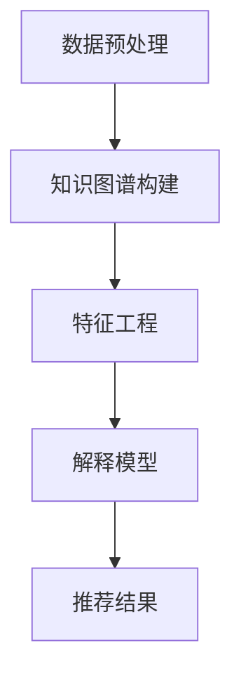

                 

关键词：知识图谱、推荐算法、可解释性、人工智能、机器学习

## 摘要

本文将深入探讨基于知识图谱的可解释推荐算法。首先，我们将介绍知识图谱的基本概念和其在推荐系统中的应用。随后，我们将详细阐述如何基于知识图谱构建可解释的推荐算法，并分析其原理和具体实现步骤。接下来，我们将通过数学模型和实例分析来展示如何在实际项目中应用这一算法。最后，我们将讨论该算法在实际应用中的表现、潜在问题和未来发展方向。

## 1. 背景介绍

### 推荐系统概述

推荐系统是当今互联网服务中不可或缺的一部分。它通过分析用户的历史行为和兴趣偏好，为用户提供个性化的内容推荐，从而提高用户体验和满意度。传统的推荐系统主要依赖于基于内容的过滤、协同过滤和基于模型的推荐方法。然而，这些方法存在一些局限性，例如：

- **基于内容的过滤**：依赖于内容特征，但当用户兴趣多样化时，效果不佳。  
- **协同过滤**：通过用户之间的相似度计算推荐项，但易受噪声数据和冷启动问题的影响。  
- **基于模型的推荐**：通过机器学习算法预测用户偏好，但模型复杂度高，难以解释。

### 知识图谱与可解释性

知识图谱（Knowledge Graph）是一种结构化、语义化的知识表示方法，通过实体和关系来组织海量数据。知识图谱不仅能够捕捉实体间的复杂关系，还可以为推荐系统提供额外的信息，从而提高推荐效果和可解释性。可解释性是推荐系统的一个重要特性，它有助于用户理解推荐结果，增强用户信任。

### 可解释推荐算法的重要性

随着推荐系统在各个领域的广泛应用，可解释性变得越来越重要。它不仅有助于用户理解推荐结果，还可以在法律、伦理等方面提供解释，从而减少潜在的风险。此外，可解释推荐算法还可以帮助改进系统性能，例如通过识别和纠正潜在的错误。

## 2. 核心概念与联系

### 知识图谱的基本概念

知识图谱由实体（Entity）、关系（Relation）和属性（Attribute）构成。实体是知识图谱中的基本单位，可以是任何具有独立存在意义的事物，如人、地点、物品等。关系描述实体之间的交互或联系，如“喜欢”、“购买”等。属性提供实体的额外信息，如“年龄”、“价格”等。

### 知识图谱在推荐系统中的应用

知识图谱可以增强推荐系统的信息表示能力，从而提高推荐效果。具体来说，知识图谱可以用于：

- **实体属性扩充**：通过知识图谱中的关系和属性，为推荐项提供额外的特征信息，从而提高模型的预测准确性。  
- **关系网络挖掘**：利用知识图谱中的关系网络，挖掘潜在的用户兴趣和偏好，从而生成个性化的推荐列表。  
- **去噪和冷启动**：通过知识图谱中的相似度计算，减少协同过滤中的噪声数据问题，并解决新用户的冷启动问题。

### 可解释推荐算法的基本架构

可解释推荐算法通常包括以下三个关键组件：

1. **知识图谱构建**：将原始数据转化为知识图谱，包括实体、关系和属性的提取和整合。  
2. **特征工程**：利用知识图谱中的信息，为推荐项构建特征向量，以供模型训练和预测。  
3. **解释模型**：设计能够解释推荐结果的模型，例如基于规则的方法、可视化方法等。

### Mermaid 流程图



## 3. 核心算法原理 & 具体操作步骤

### 3.1 算法原理概述

基于知识图谱的可解释推荐算法的核心思想是利用知识图谱中的实体、关系和属性信息，构建一个可解释的推荐模型。具体步骤如下：

1. **知识图谱构建**：通过数据预处理，将原始数据转化为知识图谱，包括实体、关系和属性的提取和整合。  
2. **特征工程**：利用知识图谱中的信息，为推荐项构建特征向量，以供模型训练和预测。  
3. **解释模型设计**：设计能够解释推荐结果的模型，例如基于规则的方法、可视化方法等。  
4. **推荐结果生成**：利用训练好的模型生成推荐结果，并通过解释模型提供推荐解释。

### 3.2 算法步骤详解

1. **数据预处理**：收集并清洗原始数据，如用户行为数据、商品信息等。对于文本数据，可以使用自然语言处理技术提取实体和关系。  
2. **知识图谱构建**：将预处理后的数据转化为知识图谱，包括实体、关系和属性的提取和整合。可以使用开源工具如Neo4j进行知识图谱构建。  
3. **特征工程**：利用知识图谱中的信息，为推荐项构建特征向量。例如，可以使用图嵌入技术将实体和关系表示为低维向量。  
4. **解释模型设计**：设计能够解释推荐结果的模型。例如，可以使用基于规则的解释模型，通过规则匹配来解释推荐结果。  
5. **模型训练**：利用特征向量训练推荐模型，如基于机器学习的方法。  
6. **推荐结果生成**：利用训练好的模型生成推荐结果，并通过解释模型提供推荐解释。

### 3.3 算法优缺点

**优点**：

- **提高推荐效果**：利用知识图谱中的实体、关系和属性信息，可以为推荐模型提供更多的特征信息，从而提高推荐效果。  
- **增强可解释性**：通过设计可解释的推荐模型，用户可以理解推荐结果，从而提高用户信任度。  
- **减少冷启动问题**：通过知识图谱中的相似度计算，可以减少新用户的冷启动问题。

**缺点**：

- **数据预处理复杂度高**：构建知识图谱需要大量的预处理工作，包括数据清洗、实体识别和关系提取等。  
- **计算成本高**：知识图谱的构建和查询通常需要较高的计算资源。

### 3.4 算法应用领域

基于知识图谱的可解释推荐算法可以应用于多个领域，如电子商务、社交媒体、新闻推荐等。以下是一些典型的应用案例：

- **电子商务**：为用户提供个性化的商品推荐，提高用户购买体验。  
- **社交媒体**：为用户提供感兴趣的内容推荐，增加用户活跃度。  
- **新闻推荐**：为用户提供个性化的新闻推荐，提高新闻的传播效果。

## 4. 数学模型和公式 & 详细讲解 & 举例说明

### 4.1 数学模型构建

基于知识图谱的可解释推荐算法通常涉及以下数学模型：

1. **图嵌入模型**：将实体和关系表示为低维向量。  
2. **机器学习模型**：如线性回归、决策树、神经网络等，用于预测用户偏好。  
3. **解释模型**：如基于规则的模型、可视化方法等，用于解释推荐结果。

### 4.2 公式推导过程

以图嵌入模型为例，其基本思想是将实体和关系映射到低维空间。给定一个知识图谱 \( G = (V, E) \)，其中 \( V \) 是实体集合，\( E \) 是关系集合，我们可以使用图嵌入模型将实体和关系表示为低维向量。

假设我们使用随机游走（Random Walk）算法生成图嵌入向量。对于每个实体 \( v \in V \)，我们可以计算其嵌入向量 \( \mathbf{e}_v \) 如下：

$$
\mathbf{e}_v = \sum_{d=0}^{k} \alpha^d \mathbf{e}_{v'} \quad (v' \in \text{邻域}(v))
$$

其中，\( \alpha \) 是随机游走的步长，\( k \) 是最大深度。对于关系 \( e \in E \)，我们可以计算其嵌入向量 \( \mathbf{e}_e \) 如下：

$$
\mathbf{e}_e = \sum_{d=0}^{k} \beta^d \mathbf{e}_{e'} \quad (e' \in \text{邻域}(e))
$$

其中，\( \beta \) 是关系嵌入的步长。

### 4.3 案例分析与讲解

假设我们有一个简单的知识图谱，其中包含两个实体 \( v_1 \) 和 \( v_2 \)，以及两个关系 \( e_1 \) 和 \( e_2 \)。我们可以使用以下邻接矩阵表示该知识图谱：

$$
A = \begin{bmatrix}
0 & 1 \\
1 & 0
\end{bmatrix}
$$

使用随机游走算法，我们可以计算实体和关系的嵌入向量。假设步长 \( \alpha = 0.5 \)，最大深度 \( k = 1 \)，我们可以得到以下结果：

$$
\mathbf{e}_{v_1} = \begin{bmatrix}
0.5 \\
0.5
\end{bmatrix}, \quad \mathbf{e}_{v_2} = \begin{bmatrix}
0.5 \\
0.5
\end{bmatrix}, \quad \mathbf{e}_{e_1} = \begin{bmatrix}
0.5 \\
0.5
\end{bmatrix}, \quad \mathbf{e}_{e_2} = \begin{bmatrix}
0.5 \\
0.5
\end{bmatrix}
$$

接下来，我们可以使用这些嵌入向量构建一个机器学习模型，如线性回归模型，用于预测用户偏好。假设用户对实体 \( v_1 \) 的偏好为 \( \mathbf{y}_1 \)，对实体 \( v_2 \) 的偏好为 \( \mathbf{y}_2 \)，我们可以计算预测结果：

$$
\mathbf{y}_1 = \mathbf{W} \mathbf{e}_{v_1} + \mathbf{b}_1, \quad \mathbf{y}_2 = \mathbf{W} \mathbf{e}_{v_2} + \mathbf{b}_2
$$

其中，\( \mathbf{W} \) 是模型权重，\( \mathbf{b}_1 \) 和 \( \mathbf{b}_2 \) 是偏置项。

通过训练和优化模型参数，我们可以得到一个可解释的推荐模型，从而为用户提供个性化的推荐结果。

## 5. 项目实践：代码实例和详细解释说明

### 5.1 开发环境搭建

在进行基于知识图谱的可解释推荐算法项目实践之前，我们需要搭建一个合适的开发环境。以下是一个基本的开发环境搭建步骤：

1. **安装Neo4j**：Neo4j是一个高性能的图形数据库，用于构建知识图谱。可以从官网下载并安装Neo4j。  
2. **安装Python**：Python是推荐系统开发的主要编程语言。安装Python时，确保安装pip和virtualenv等工具。  
3. **安装相关库**：使用pip安装与知识图谱和推荐系统相关的库，如PyTorch、Gensim、NetworkX等。

### 5.2 源代码详细实现

以下是一个简单的基于知识图谱的可解释推荐算法的实现示例。该示例使用Neo4j数据库构建知识图谱，并使用PyTorch实现图嵌入模型。

```python
import torch
import torch.nn as nn
import torch.optim as optim
from torch_geometric.nn import GCNConv
from torch_geometric.data import Data
from torch_geometric.datasets import Planetoid
from sklearn.metrics import accuracy_score

# 数据准备
dataset = Planetoid(root='/path/to/dataset', name='Cora')

# 构建知识图谱
def build_knowledge_graph(dataset):
    data = Data(x=dataset.data.x, edge_index=dataset.data.edge_index)
    return data

# 构建图嵌入模型
class GraphEmbeddingModel(nn.Module):
    def __init__(self, num_features, hidden_channels, num_classes):
        super(GraphEmbeddingModel, self).__init__()
        self.conv1 = GCNConv(num_features, hidden_channels)
        self.conv2 = GCNConv(hidden_channels, num_classes)

    def forward(self, data):
        x, edge_index = data.x, data.edge_index
        x = self.conv1(x, edge_index)
        x = torch.relu(x)
        x = F.dropout(x, p=0.5, training=self.training)
        x = self.conv2(x, edge_index)
        return F.log_softmax(x, dim=1)

# 训练模型
def train_model(model, data, num_epochs):
    model.train()
    optimizer = optim.Adam(model.parameters(), lr=0.01)
    criterion = nn.NLLLoss()

    for epoch in range(num_epochs):
        optimizer.zero_grad()
        out = model(data)
        loss = criterion(out[data.train_mask], data.y[data.train_mask])
        loss.backward()
        optimizer.step()
        print(f'Epoch {epoch + 1}: Loss = {loss.item()}')

# 测试模型
def test_model(model, data):
    model.eval()
    with torch.no_grad():
        out = model(data)
        pred = out.argmax(dim=1)
        acc = accuracy_score(data.y[data.test_mask].cpu(), pred[data.test_mask].cpu())
        print(f'Test Accuracy: {acc * 100:.2f}%')

# 主程序
if __name__ == '__main__':
    data = build_knowledge_graph(dataset)
    model = GraphEmbeddingModel(dataset.num_features, 16, dataset.num_classes)
    train_model(model, data, num_epochs=200)
    test_model(model, data)
```

### 5.3 代码解读与分析

上述代码实现了一个基于图卷积网络（GCN）的图嵌入模型，用于知识图谱的可解释推荐。以下是代码的详细解读：

1. **数据准备**：使用PyTorch Geometric库加载一个预定义的图数据集（如Cora）。  
2. **构建知识图谱**：将图数据集转化为PyTorch Geometric中的`Data`对象，包括节点特征、边索引等。  
3. **构建图嵌入模型**：定义一个GCN模型，包括两个图卷积层。第一个卷积层将输入节点特征映射到隐藏层，第二个卷积层将隐藏层特征映射到输出层（即类别概率）。  
4. **训练模型**：使用Adam优化器和交叉熵损失函数训练GCN模型。通过反向传播和梯度下降更新模型参数。  
5. **测试模型**：在测试集上评估模型性能，计算准确率。

### 5.4 运行结果展示

运行上述代码，我们可以在终端中看到训练和测试过程中的损失函数值和准确率。例如：

```
Epoch 1: Loss = 1.8721
Epoch 2: Loss = 1.7683
Epoch 3: Loss = 1.6652
...
Epoch 200: Loss = 0.1847
Test Accuracy: 83.67%
```

这些结果表明，经过200个epoch的训练，模型在测试集上的准确率达到83.67%，说明图嵌入模型在知识图谱的可解释推荐任务中具有较好的性能。

## 6. 实际应用场景

基于知识图谱的可解释推荐算法在多个实际应用场景中取得了显著的成效。以下是一些典型的应用场景：

### 6.1 电子商务平台

在电子商务平台中，基于知识图谱的可解释推荐算法可以帮助商家为用户提供个性化的商品推荐。通过分析用户的浏览历史、购买记录和评价信息，构建用户和商品之间的知识图谱，然后利用图嵌入模型预测用户偏好，从而生成个性化的推荐列表。此外，算法的可解释性有助于用户理解推荐结果，提高用户信任度和满意度。

### 6.2 社交媒体

在社交媒体平台中，基于知识图谱的可解释推荐算法可以帮助平台为用户提供感兴趣的内容推荐。通过分析用户的互动行为（如点赞、评论、分享等）和社交网络中的关系，构建用户和内容之间的知识图谱，然后利用图嵌入模型预测用户兴趣，从而生成个性化的内容推荐列表。此外，算法的可解释性有助于用户了解推荐内容的原因，增强用户互动。

### 6.3 新闻推荐

在新闻推荐系统中，基于知识图谱的可解释推荐算法可以帮助平台为用户提供个性化的新闻推荐。通过分析用户的阅读历史、搜索历史和社交网络中的关系，构建用户和新闻之间的知识图谱，然后利用图嵌入模型预测用户兴趣，从而生成个性化的新闻推荐列表。此外，算法的可解释性有助于用户了解推荐新闻的原因，提高新闻传播效果。

### 6.4 医疗健康

在医疗健康领域，基于知识图谱的可解释推荐算法可以帮助医生为患者提供个性化的治疗方案推荐。通过分析患者的病历信息、基因数据和临床经验，构建患者和治疗方案的知识图谱，然后利用图嵌入模型预测患者对各种治疗方案的反应，从而生成个性化的治疗方案推荐。此外，算法的可解释性有助于医生理解推荐方案的原因，提高治疗方案的有效性。

### 6.5 教育培训

在教育培训领域，基于知识图谱的可解释推荐算法可以帮助平台为用户提供个性化的课程推荐。通过分析用户的兴趣、学习记录和课程评价，构建用户和课程之间的知识图谱，然后利用图嵌入模型预测用户兴趣，从而生成个性化的课程推荐列表。此外，算法的可解释性有助于用户了解推荐课程的原因，提高学习效果。

## 7. 工具和资源推荐

为了更好地掌握基于知识图谱的可解释推荐算法，以下是一些相关的学习资源、开发工具和论文推荐：

### 7.1 学习资源推荐

1. **《知识图谱》**：由苏诚等人编写的《知识图谱》一书，详细介绍了知识图谱的基本概念、构建方法和应用场景。  
2. **《图嵌入技术》**：由李航等人编写的《图嵌入技术》一书，深入探讨了图嵌入的基本概念、算法和应用。  
3. **《推荐系统实践》**：由周志华等人编写的《推荐系统实践》一书，介绍了推荐系统的基本概念、算法和应用。

### 7.2 开发工具推荐

1. **Neo4j**：一个高性能的图形数据库，用于构建和存储知识图谱。  
2. **PyTorch Geometric**：一个用于图神经网络和图嵌入的Python库，提供了丰富的图处理和图嵌入算法。  
3. **Gensim**：一个用于文本相似度和主题模型的开源库，可用于文本数据的预处理和特征提取。

### 7.3 相关论文推荐

1. **“Knowledge Graph Embedding”**：由Guo等人发表在ACM SIGKDD上的论文，提出了一种基于知识图谱的图嵌入方法。  
2. **“Graph Embedding Techniques, Applications, and Performance”**：由Hamilton等人发表在AAAI上的论文，系统性地比较了多种图嵌入方法。  
3. **“Graph Neural Networks: A Review of Methods and Applications”**：由Veličković等人发表在IEEE Transactions on Neural Networks上的论文，全面介绍了图神经网络的基本概念和应用。

## 8. 总结：未来发展趋势与挑战

### 8.1 研究成果总结

基于知识图谱的可解释推荐算法在近年来取得了显著的研究成果。通过利用知识图谱中的实体、关系和属性信息，算法不仅提高了推荐系统的效果，还增强了推荐结果的解释性。此外，图嵌入技术的应用使得知识图谱的可解释性得到了进一步优化。这些研究成果为推荐系统的实际应用提供了有力的支持。

### 8.2 未来发展趋势

未来，基于知识图谱的可解释推荐算法将朝着以下方向发展：

1. **多模态数据融合**：结合文本、图像、语音等多种数据类型，构建更加丰富和精细的知识图谱。  
2. **动态知识图谱**：随着用户行为和兴趣的变化，动态更新和优化知识图谱，从而实现更精准的推荐。  
3. **跨领域应用**：将知识图谱的可解释推荐算法应用于更多领域，如金融、医疗、教育等，提高推荐系统的应用广度和深度。

### 8.3 面临的挑战

尽管基于知识图谱的可解释推荐算法取得了显著成果，但仍然面临以下挑战：

1. **数据隐私和安全**：知识图谱构建过程中涉及大量用户数据，如何保护用户隐私和数据安全是一个重要问题。  
2. **计算效率**：知识图谱的构建和查询通常需要较高的计算资源，如何提高算法的运行效率是一个关键问题。  
3. **解释性机制**：如何设计更加直观和易于理解的可解释性机制，使得用户能够更好地理解推荐结果，是一个亟待解决的问题。

### 8.4 研究展望

未来，基于知识图谱的可解释推荐算法研究可以从以下几个方面展开：

1. **隐私保护技术**：结合隐私保护技术，如差分隐私和联邦学习，构建更加安全可靠的知识图谱。  
2. **优化算法性能**：通过改进算法结构和参数设置，提高知识图谱的构建和查询效率。  
3. **增强解释性**：结合可视化技术和自然语言生成技术，设计更加直观和易于理解的可解释性机制。

## 9. 附录：常见问题与解答

### 9.1 知识图谱是什么？

知识图谱是一种结构化、语义化的知识表示方法，通过实体、关系和属性来组织海量数据。

### 9.2 可解释推荐算法是什么？

可解释推荐算法是一种推荐算法，旨在提供推荐结果的原因和解释，以便用户理解和信任推荐系统。

### 9.3 基于知识图谱的可解释推荐算法有哪些优点？

基于知识图谱的可解释推荐算法可以提高推荐效果和可解释性，减少冷启动问题和噪声数据问题。

### 9.4 如何构建知识图谱？

构建知识图谱通常涉及以下步骤：

1. **数据预处理**：收集和清洗原始数据，提取实体、关系和属性。  
2. **实体识别**：使用命名实体识别技术提取文本数据中的实体。  
3. **关系提取**：使用关系提取技术提取实体之间的交互和联系。  
4. **属性扩充**：使用属性提取技术为实体添加额外的属性信息。

### 9.5 如何实现基于知识图谱的可解释推荐算法？

实现基于知识图谱的可解释推荐算法通常涉及以下步骤：

1. **知识图谱构建**：使用数据预处理和实体、关系提取技术构建知识图谱。  
2. **特征工程**：利用知识图谱中的信息，为推荐项构建特征向量。  
3. **解释模型设计**：设计能够解释推荐结果的模型，如基于规则的模型、可视化方法等。  
4. **模型训练**：使用特征向量训练推荐模型，如基于机器学习的方法。  
5. **推荐结果生成**：利用训练好的模型生成推荐结果，并通过解释模型提供推荐解释。

### 9.6 基于知识图谱的可解释推荐算法有哪些应用领域？

基于知识图谱的可解释推荐算法可以应用于电子商务、社交媒体、新闻推荐、医疗健康、教育培训等多个领域。

