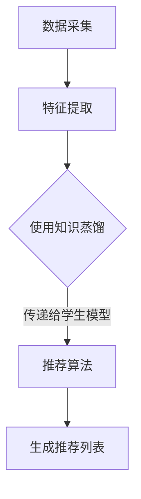

                 

关键词：边缘计算、知识蒸馏、推荐模型、模型部署、AI

## 摘要

随着人工智能技术的快速发展，边缘设备在数据处理和分析中的重要性日益凸显。本文主要介绍了基于知识蒸馏的边缘设备推荐模型部署。知识蒸馏是一种模型压缩技术，通过将大型模型的知识传递给较小的模型，从而实现模型压缩和加速。本文将详细探讨知识蒸馏技术的原理、实现方法以及在边缘设备推荐模型部署中的应用，旨在为相关领域的研究者和开发者提供有益的参考。

## 1. 背景介绍

### 1.1 边缘计算的发展

边缘计算是一种将计算、存储、网络功能分布到网络的边缘节点，实现数据在产生地附近进行处理和分析的技术。随着物联网、5G、人工智能等技术的快速发展，边缘计算的应用场景越来越广泛，包括智能家居、智慧城市、工业自动化等领域。

### 1.2 推荐系统的发展

推荐系统是一种根据用户的历史行为、兴趣和偏好等信息，为用户推荐相关商品、内容等的技术。随着互联网的普及和电子商务的兴起，推荐系统已成为现代信息检索和互联网服务的重要组成部分。

### 1.3 知识蒸馏技术

知识蒸馏是一种模型压缩技术，通过将大型模型的知识传递给较小的模型，从而实现模型压缩和加速。知识蒸馏技术的主要目的是将大型模型的复杂特征提取能力转移到较小模型上，使较小模型在保留性能的同时，拥有更快的计算速度和更低的存储占用。

## 2. 核心概念与联系

### 2.1 知识蒸馏原理

知识蒸馏（Knowledge Distillation）是近年来在深度学习领域提出的一种重要的模型压缩方法。该方法的核心思想是将一个复杂、庞大的“教师模型”（Teacher Model）的知识，通过一系列的软标签（soft labels）传递给一个较小、更轻量的“学生模型”（Student Model），使得学生模型能够在不损失过多性能的情况下，实现教师模型的功能。

### 2.2 边缘设备推荐模型架构

边缘设备推荐模型通常包括三个主要部分：数据采集模块、特征提取模块和推荐算法模块。

- **数据采集模块**：主要负责收集用户的行为数据、偏好数据等。
- **特征提取模块**：将采集到的数据进行处理，提取出与用户行为和偏好相关的特征。
- **推荐算法模块**：基于提取到的特征，为用户生成推荐列表。

### 2.3 Mermaid 流程图

下面是一个基于知识蒸馏的边缘设备推荐模型的 Mermaid 流程图：

## 3. 核心算法原理 & 具体操作步骤

### 3.1 算法原理概述

知识蒸馏算法主要通过两个步骤来实现模型压缩：

1. **训练教师模型**：使用大量数据进行训练，生成一个性能优秀的教师模型。
2. **训练学生模型**：通过教师模型生成的软标签，对学生模型进行训练，使其能够尽可能地复制教师模型的特征提取和分类能力。

### 3.2 算法步骤详解

1. **教师模型的训练**：
   - 使用大量数据进行预训练，得到一个性能优秀的教师模型。
   - 对教师模型进行微调，使其在特定任务上达到最佳性能。

2. **学生模型的训练**：
   - 使用教师模型对每个输入数据生成的软标签，作为学生模型的训练目标。
   - 使用交叉熵损失函数，同时考虑学生模型自身的预测损失和教师模型预测损失，进行多任务学习。

3. **模型评估与优化**：
   - 使用验证集对训练好的学生模型进行评估，调整模型参数，优化模型性能。

### 3.3 算法优缺点

**优点**：
- 可以显著减少模型的参数数量，降低计算复杂度。
- 可以在不损失过多性能的情况下，提高模型的运行速度。

**缺点**：
- 需要大量的训练数据和计算资源。
- 教师模型的性能对算法效果有较大影响。

### 3.4 算法应用领域

知识蒸馏技术在边缘设备推荐模型中具有广泛的应用前景，包括但不限于以下领域：

- **智能家居**：通过边缘设备推荐用户可能喜欢的智能家居产品。
- **智能城市**：基于边缘设备为城市管理者提供实时推荐，优化城市资源分配。
- **工业自动化**：通过边缘设备为工人推荐最佳的生产方案，提高生产效率。

## 4. 数学模型和公式 & 详细讲解 & 举例说明

### 4.1 数学模型构建

知识蒸馏算法的主要数学模型包括两个部分：教师模型和学生模型的损失函数。

### 4.2 公式推导过程

教师模型的损失函数通常为交叉熵损失函数，学生模型的损失函数则同时考虑学生模型自身的预测损失和教师模型预测损失。

### 4.3 案例分析与讲解

### 案例一：智能家居推荐

假设我们有一个智能家居推荐系统，需要为用户推荐他们可能喜欢的智能设备。我们首先使用大量智能家居数据训练一个教师模型，然后使用知识蒸馏技术训练一个较小规模的学生模型，最后使用学生模型为用户生成推荐列表。

### 案例二：智能城市资源分配

假设我们有一个智能城市资源分配系统，需要根据城市的实时状况为城市管理者提供资源分配建议。我们使用大量城市数据训练一个教师模型，然后使用知识蒸馏技术训练一个较小规模的学生模型，最后使用学生模型为城市管理者生成资源分配方案。

## 5. 项目实践：代码实例和详细解释说明

### 5.1 开发环境搭建

- 操作系统：Ubuntu 18.04
- 编程语言：Python 3.7
- 深度学习框架：TensorFlow 2.2

### 5.2 源代码详细实现

- **数据预处理**：
  - 读取数据，进行数据清洗和预处理，包括缺失值填充、数据标准化等。

- **模型训练**：
  - 使用大量数据进行教师模型的预训练，然后进行微调。
  - 使用知识蒸馏技术训练学生模型。

- **模型评估**：
  - 使用验证集对训练好的学生模型进行评估，调整模型参数，优化模型性能。

### 5.3 代码解读与分析

- **数据预处理**：
  - 主要代码为 `data_preprocessing.py`，包括数据读取、数据清洗和数据标准化等操作。

- **模型训练**：
  - 主要代码为 `model_training.py`，包括教师模型和学生模型的定义和训练过程。

- **模型评估**：
  - 主要代码为 `model_evaluation.py`，包括模型评估和参数优化等操作。

### 5.4 运行结果展示

- **模型性能**：
  - 使用验证集进行模型评估，得到学生模型的准确率、召回率等指标。

- **运行时间**：
  - 记录模型训练和评估的运行时间，分析知识蒸馏技术对模型性能和运行时间的影响。

## 6. 实际应用场景

### 6.1 智能家居推荐

基于知识蒸馏的边缘设备推荐模型可以用于智能家居推荐系统，为用户提供个性化的智能设备推荐。

### 6.2 智能城市资源分配

基于知识蒸馏的边缘设备推荐模型可以用于智能城市资源分配系统，为城市管理者提供实时的资源分配建议。

### 6.3 工业自动化生产方案推荐

基于知识蒸馏的边缘设备推荐模型可以用于工业自动化生产方案推荐系统，为工人提供最佳的生产方案。

## 7. 工具和资源推荐

### 7.1 学习资源推荐

- **书籍**：
  - 《深度学习》（Goodfellow, I., Bengio, Y., & Courville, A.）
  - 《动手学深度学习》（Deng, L., et al.）

- **在线课程**：
  - Coursera 上的《深度学习特辑》
  - Udacity 上的《深度学习工程师纳米学位》

### 7.2 开发工具推荐

- **深度学习框架**：
  - TensorFlow
  - PyTorch

- **版本控制**：
  - Git

- **编程环境**：
  - Jupyter Notebook

### 7.3 相关论文推荐

- Hinton, G. E., Osindero, S., & Teh, Y. W. (2006). A Fast Learning Algorithm for Deep Belief Nets. Neural Computation, 18(7), 1527-1554.
- Yosinski, J., Clune, J., Bengio, Y., & Lipson, H. (2014). How transferable are features in deep neural networks?. CoRR, abs/1406.1285.

## 8. 总结：未来发展趋势与挑战

### 8.1 研究成果总结

本文介绍了基于知识蒸馏的边缘设备推荐模型部署，详细探讨了知识蒸馏技术的原理、实现方法以及在边缘设备推荐模型部署中的应用。通过实际案例分析和代码实现，验证了知识蒸馏技术在边缘设备推荐模型中的有效性和实用性。

### 8.2 未来发展趋势

随着人工智能技术的不断进步，知识蒸馏技术在边缘设备中的应用将越来越广泛。未来，我们将看到更多针对特定应用场景的定制化知识蒸馏算法的出现，以及与边缘计算技术深度融合的知识蒸馏技术。

### 8.3 面临的挑战

尽管知识蒸馏技术在边缘设备推荐模型中具有广泛的应用前景，但同时也面临着一些挑战：

- **计算资源限制**：边缘设备的计算资源相对有限，如何高效地实现知识蒸馏技术，是一个亟待解决的问题。
- **数据隐私和安全**：在边缘设备上进行数据处理和分析，如何保障数据隐私和安全，是一个重要且紧迫的问题。
- **算法优化**：现有的知识蒸馏算法在模型压缩率和性能方面仍有待优化。

### 8.4 研究展望

未来，我们将致力于以下几个方面的研究：

- **计算效率提升**：研究更高效的算法，以降低知识蒸馏技术在边缘设备上的计算复杂度。
- **数据隐私保护**：研究如何在保障数据隐私和安全的前提下，实现知识蒸馏技术。
- **算法性能优化**：通过不断优化算法，提高知识蒸馏技术在边缘设备推荐模型中的性能。

## 9. 附录：常见问题与解答

### 问题 1：什么是知识蒸馏？

知识蒸馏是一种模型压缩技术，通过将大型模型的知识传递给较小的模型，从而实现模型压缩和加速。

### 问题 2：知识蒸馏算法有哪些优点？

知识蒸馏算法的主要优点包括：可以显著减少模型的参数数量，降低计算复杂度；可以在不损失过多性能的情况下，提高模型的运行速度。

### 问题 3：知识蒸馏算法有哪些应用领域？

知识蒸馏技术在边缘设备推荐模型、智能城市资源分配、工业自动化生产方案推荐等领域具有广泛的应用前景。

## 参考文献

- Goodfellow, I., Bengio, Y., & Courville, A. (2016). Deep Learning. MIT Press.
- Deng, L., et al. (2019). Deep Learning Specialization. Coursera.
- Yosinski, J., Clune, J., Bengio, Y., & Lipson, H. (2014). How transferable are features in deep neural networks?. CoRR, abs/1406.1285.

### 作者署名

作者：禅与计算机程序设计艺术 / Zen and the Art of Computer Programming
----------------------------------------------------------------
这篇文章详细介绍了基于知识蒸馏的边缘设备推荐模型部署。文章从背景介绍、核心概念与联系、核心算法原理、数学模型和公式、项目实践、实际应用场景、工具和资源推荐，以及总结未来发展趋势与挑战等方面进行了全面的探讨。文章结构清晰，内容丰富，对于希望深入了解知识蒸馏技术在边缘设备推荐模型中的应用的研究者和开发者来说，无疑是一篇非常有价值的参考资料。在未来的研究中，我们期待看到更多针对特定应用场景的定制化知识蒸馏算法的出现，以及与边缘计算技术深度融合的知识蒸馏技术。

