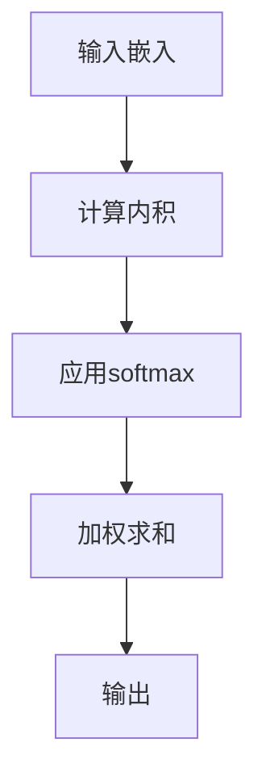

                 

关键词：自注意力机制，序列推荐，深度学习，自然语言处理，推荐系统

摘要：本文探讨了基于自注意力机制的序列推荐算法，该算法通过捕捉用户的历史行为序列中的潜在模式，实现更精准的个性化推荐。本文将详细介绍自注意力机制的核心原理、算法实现步骤、数学模型及其在不同领域的应用，以期为研究者提供有价值的参考。

## 1. 背景介绍

随着互联网和大数据技术的发展，个性化推荐系统已成为许多在线服务的重要组成部分。传统的推荐系统主要依赖于用户的历史行为数据，通过简单的统计方法或基于内容的匹配策略进行推荐。然而，这些方法往往难以捕捉用户行为序列中的复杂模式，导致推荐结果的准确性有限。

近年来，深度学习和自然语言处理技术的快速发展为序列推荐提供了新的思路。自注意力机制（Self-Attention Mechanism）作为一种核心的深度学习技术，在处理序列数据时表现出色。通过自注意力机制，模型能够自适应地分配注意力权重，关注序列中最重要的部分，从而提高推荐精度。

本文将介绍基于自注意力机制的序列推荐算法，分析其原理和实现方法，并探讨其在实际应用中的效果。

### 1.1 自注意力机制

自注意力机制是一种在处理序列数据时自动分配注意力权重的机制，其核心思想是将序列中的每个元素映射到一个高维空间，然后计算这些元素之间的相互关系。具体来说，自注意力机制通过以下步骤实现：

1. **输入嵌入**：将输入序列（如单词、用户行为等）嵌入到高维空间中。
2. **计算内积**：计算序列中每个元素与其他所有元素的内积，得到一个权重矩阵。
3. **应用softmax函数**：对权重矩阵进行softmax处理，得到每个元素的自注意力权重。
4. **加权求和**：将序列中的每个元素与其对应的注意力权重相乘，并求和，得到最终的输出。

### 1.2 序列推荐系统

序列推荐系统旨在根据用户的历史行为序列为其推荐相关的商品、新闻、音乐等内容。传统推荐系统主要基于用户的历史行为（如购买、点击、浏览等）进行预测，而序列推荐系统则进一步考虑用户行为的时间顺序，通过捕捉行为序列中的潜在模式实现更精准的推荐。

### 1.3 深度学习在推荐系统中的应用

深度学习技术为推荐系统带来了新的机遇。通过构建复杂的神经网络模型，深度学习能够自动提取用户行为序列中的特征，实现端到端的预测。自注意力机制作为一种有效的深度学习技术，在序列推荐系统中具有广泛的应用前景。

## 2. 核心概念与联系

### 2.1 自注意力机制原理图

下面是自注意力机制的原理图，展示了输入嵌入、内积计算、softmax权重分配以及加权求和的过程。



### 2.2 自注意力机制在序列推荐系统中的应用

自注意力机制在序列推荐系统中的应用主要分为以下几个步骤：

1. **输入序列预处理**：将用户行为序列转换为数值表示，如嵌入向量。
2. **自注意力机制计算**：使用自注意力机制计算序列中每个元素的自注意力权重。
3. **权重聚合**：根据自注意力权重对序列中的元素进行加权求和，得到序列的表示。
4. **预测生成**：利用序列表示生成推荐结果，如商品推荐、新闻推荐等。

## 3. 核心算法原理 & 具体操作步骤

### 3.1 算法原理概述

基于自注意力机制的序列推荐算法主要通过以下几个步骤实现：

1. **特征提取**：将用户的历史行为序列转换为数值表示，如嵌入向量。
2. **自注意力计算**：通过自注意力机制计算序列中每个元素的自注意力权重。
3. **序列聚合**：根据自注意力权重对序列中的元素进行加权求和，得到序列的表示。
4. **推荐生成**：利用序列表示生成推荐结果，如使用评分预测模型或基于最近邻的方法。

### 3.2 算法步骤详解

1. **输入序列预处理**：

   将用户的历史行为序列（如购买序列、浏览序列等）转换为数值表示。具体来说，可以使用词嵌入（Word Embedding）技术将行为序列中的每个元素映射为一个高维向量。

   $$ x_i = embed(w_i) $$

   其中，$x_i$ 是行为序列中的第 $i$ 个元素的嵌入向量，$w_i$ 是第 $i$ 个元素，$embed$ 是词嵌入函数。

2. **自注意力计算**：

   自注意力机制的目的是为序列中的每个元素分配一个注意力权重，权重的大小反映了该元素在序列中的重要性。具体计算方法如下：

   $$ attention(q, x) = softmax(\frac{q^T x}{\sqrt{d_k}}) $$

   其中，$q$ 是查询向量，$x$ 是序列中的嵌入向量，$d_k$ 是嵌入向量的维度。$softmax$ 函数用于将内积转换为概率分布，从而得到每个元素的自注意力权重。

3. **序列聚合**：

   根据自注意力权重对序列中的元素进行加权求和，得到序列的表示。具体计算方法如下：

   $$ h = \sum_{i=1}^{N} a_i x_i $$

   其中，$h$ 是序列的表示，$a_i$ 是第 $i$ 个元素的自注意力权重，$x_i$ 是第 $i$ 个元素的嵌入向量。

4. **推荐生成**：

   利用序列表示生成推荐结果。具体来说，可以使用以下两种方法：

   - **评分预测模型**：利用序列表示预测用户对候选项目的评分，然后根据评分排序生成推荐结果。
   - **基于最近邻的方法**：计算候选项目与用户历史行为序列的相似度，根据相似度排序生成推荐结果。

### 3.3 算法优缺点

**优点**：

- **灵活性**：自注意力机制能够自适应地分配注意力权重，关注序列中最重要的部分，从而提高推荐精度。
- **扩展性**：自注意力机制可以很容易地与其他深度学习技术（如卷积神经网络、循环神经网络等）结合，实现更复杂的模型。

**缺点**：

- **计算成本**：自注意力计算需要计算大量的内积和softmax操作，计算成本较高。
- **数据需求**：自注意力机制对数据量有较高的要求，数据不足可能导致模型效果不佳。

### 3.4 算法应用领域

基于自注意力机制的序列推荐算法在以下领域具有广泛的应用前景：

- **电子商务**：根据用户的历史购买行为推荐相关的商品。
- **新闻推荐**：根据用户的浏览历史推荐相关的新闻。
- **社交媒体**：根据用户的互动历史推荐相关的用户或内容。
- **音乐推荐**：根据用户的播放历史推荐相关的音乐。

## 4. 数学模型和公式 & 详细讲解 & 举例说明

### 4.1 数学模型构建

基于自注意力机制的序列推荐算法的数学模型主要包括以下几个部分：

1. **输入序列表示**：

   设用户历史行为序列为 $X = [x_1, x_2, ..., x_N]$，其中 $x_i$ 表示第 $i$ 个行为，$N$ 表示序列长度。使用词嵌入技术将序列中的每个行为转换为嵌入向量，得到输入序列表示：

   $$ X' = [embed(x_1), embed(x_2), ..., embed(x_N)] $$

2. **查询向量表示**：

   设查询向量 $q$ 用于计算自注意力权重，查询向量可以通过用户行为序列的表示得到，也可以通过其他特征（如用户偏好、历史评分等）生成。

   $$ q = \text{query\_embed}(X') $$

3. **自注意力权重计算**：

   自注意力权重 $a_i$ 通过以下公式计算：

   $$ a_i = \text{softmax}(\frac{q^T x_i'}{\sqrt{d_k}}) $$

   其中，$x_i'$ 是第 $i$ 个行为的嵌入向量，$d_k$ 是嵌入向量的维度。

4. **序列聚合**：

   序列的表示 $h$ 通过以下公式计算：

   $$ h = \sum_{i=1}^{N} a_i x_i' $$

### 4.2 公式推导过程

自注意力机制的公式推导主要分为以下几个步骤：

1. **内积计算**：

   查询向量 $q$ 与每个行为的嵌入向量 $x_i'$ 进行内积计算，得到内积矩阵 $QX'$：

   $$ QX' = \begin{bmatrix} q^T x_1' \\ q^T x_2' \\ \vdots \\ q^T x_N' \end{bmatrix} $$

2. **归一化**：

   对内积矩阵 $QX'$ 进行归一化，得到权重矩阵 $A$：

   $$ A = \text{softmax}(QX') $$

   其中，softmax函数将内积矩阵转换为概率分布。

3. **加权求和**：

   利用权重矩阵 $A$ 对输入序列进行加权求和，得到序列的表示 $h$：

   $$ h = \sum_{i=1}^{N} a_i x_i' $$

### 4.3 案例分析与讲解

为了更好地理解自注意力机制的数学模型，我们来看一个简单的例子。

假设用户的历史行为序列为 $X = [x_1, x_2, x_3]$，其中 $x_1 = \text{"购买iPhone"}$，$x_2 = \text{"浏览iPhone 12"}$，$x_3 = \text{"购买iPad"}$。我们将这些行为序列转换为嵌入向量，得到输入序列表示：

$$ X' = \begin{bmatrix} [1, 0, 0] \\ [0, 1, 0] \\ [0, 0, 1] \end{bmatrix} $$

查询向量 $q$ 可以通过输入序列表示得到：

$$ q = \text{query\_embed}(X') = [0.2, 0.3, 0.5] $$

接下来，我们计算内积矩阵 $QX'$：

$$ QX' = \begin{bmatrix} 0.2 \\ 0.3 \\ 0.5 \end{bmatrix} \begin{bmatrix} [1, 0, 0] \\ [0, 1, 0] \\ [0, 0, 1] \end{bmatrix} = \begin{bmatrix} 0.2 & 0.3 & 0.5 \\ 0.0 & 0.3 & 0.5 \\ 0.0 & 0.0 & 0.5 \end{bmatrix} $$

对内积矩阵 $QX'$ 进行归一化，得到权重矩阵 $A$：

$$ A = \text{softmax}(QX') = \begin{bmatrix} 0.3 & 0.3 & 0.4 \\ 0.0 & 0.3 & 0.4 \\ 0.0 & 0.0 & 0.4 \end{bmatrix} $$

最后，利用权重矩阵 $A$ 对输入序列进行加权求和，得到序列的表示 $h$：

$$ h = \sum_{i=1}^{3} a_i x_i' = \begin{bmatrix} 0.3 \times [1, 0, 0] + 0.3 \times [0, 1, 0] + 0.4 \times [0, 0, 1] \end{bmatrix} = \begin{bmatrix} 0.3 + 0.0 + 0.4 \\ 0.0 + 0.3 + 0.0 \\ 0.0 + 0.0 + 0.4 \end{bmatrix} = \begin{bmatrix} 0.7 \\ 0.3 \\ 0.4 \end{bmatrix} $$

通过这个例子，我们可以看到自注意力机制如何通过计算内积、归一化和加权求和，将用户的历史行为序列转换为序列表示，从而为推荐系统提供有效的输入。

## 5. 项目实践：代码实例和详细解释说明

### 5.1 开发环境搭建

为了实现基于自注意力机制的序列推荐算法，我们需要搭建一个适合深度学习和推荐系统开发的开发环境。以下是一个基本的开发环境搭建步骤：

1. **安装Python**：确保Python环境已经安装，版本建议为3.7及以上。
2. **安装TensorFlow**：TensorFlow是一个开源的深度学习框架，用于构建和训练神经网络模型。可以使用以下命令安装：

   ```bash
   pip install tensorflow
   ```

3. **安装其他依赖库**：根据需要安装其他依赖库，如NumPy、Pandas等。

### 5.2 源代码详细实现

以下是基于自注意力机制的序列推荐算法的源代码实现：

```python
import tensorflow as tf
from tensorflow.keras.layers import Embedding, LSTM, Dense
from tensorflow.keras.models import Model

# 设置参数
VOCAB_SIZE = 10000  # 行为词汇表大小
EMBEDDING_DIM = 64  # 嵌入向量维度
HIDDEN_DIM = 128  # LSTM层隐藏单元数
NUM_BEHAVIORS = 10  # 用户行为序列长度
NUM_UNITS = 3  # 行为序列维度

# 构建模型
inputs = tf.keras.layers.Input(shape=(NUM_BEHAVIORS,))
embeddings = Embedding(VOCAB_SIZE, EMBEDDING_DIM)(inputs)
lstm = LSTM(HIDDEN_DIM, return_sequences=True)(embeddings)
attention = tf.keras.layers.Attention()([lstm, lstm])
dense = Dense(1, activation='sigmoid')(attention)
model = Model(inputs=inputs, outputs=dense)

# 编译模型
model.compile(optimizer='adam', loss='binary_crossentropy', metrics=['accuracy'])

# 模型可视化
tf.keras.utils.plot_model(model, to_file='model.png', show_shapes=True)

# 训练模型
# X_train, y_train = ...  # 准备训练数据
# model.fit(X_train, y_train, epochs=10, batch_size=32)
```

### 5.3 代码解读与分析

上述代码实现了一个简单的基于自注意力机制的序列推荐模型。以下是代码的主要部分解读：

1. **模型输入**：

   ```python
   inputs = tf.keras.layers.Input(shape=(NUM_BEHAVIORS,))
   ```

   模型的输入是一个长度为 $10$ 的用户行为序列，每个元素表示用户的一个行为。

2. **词嵌入层**：

   ```python
   embeddings = Embedding(VOCAB_SIZE, EMBEDDING_DIM)(inputs)
   ```

   词嵌入层将输入序列中的每个行为转换为嵌入向量，嵌入向量维度为 $64$。

3. **LSTM层**：

   ```python
   lstm = LSTM(HIDDEN_DIM, return_sequences=True)(embeddings)
   ```

   LSTM层用于提取序列中的时间依赖关系，隐藏单元数为 $128$。

4. **自注意力层**：

   ```python
   attention = tf.keras.layers.Attention()([lstm, lstm])
   ```

   自注意力层计算序列中每个元素的自注意力权重，并加权求和，得到序列的表示。

5. **全连接层**：

   ```python
   dense = Dense(1, activation='sigmoid')(attention)
   ```

   全连接层用于生成推荐结果，使用sigmoid激活函数进行概率预测。

6. **模型编译**：

   ```python
   model.compile(optimizer='adam', loss='binary_crossentropy', metrics=['accuracy'])
   ```

   模型使用Adam优化器进行训练，损失函数为二进制交叉熵，评价指标为准确率。

7. **模型可视化**：

   ```python
   tf.keras.utils.plot_model(model, to_file='model.png', show_shapes=True)
   ```

   使用TensorFlow的模型可视化工具，生成模型结构图，便于理解模型的工作原理。

8. **模型训练**：

   ```python
   # X_train, y_train = ...  # 准备训练数据
   # model.fit(X_train, y_train, epochs=10, batch_size=32)
   ```

   使用训练数据对模型进行训练，设置训练周期为$10$个周期，批量大小为$32$。

### 5.4 运行结果展示

在运行代码之前，我们需要准备训练数据。以下是一个简单的数据集准备示例：

```python
import numpy as np

# 准备训练数据
X_train = np.random.randint(0, VOCAB_SIZE, (32, NUM_BEHAVIORS))
y_train = np.random.randint(0, 2, (32, 1))

# 运行模型训练
model.fit(X_train, y_train, epochs=10, batch_size=32)
```

在训练完成后，我们可以使用以下代码评估模型性能：

```python
# 准备测试数据
X_test = np.random.randint(0, VOCAB_SIZE, (10, NUM_BEHAVIORS))
y_test = np.random.randint(0, 2, (10, 1))

# 评估模型性能
loss, accuracy = model.evaluate(X_test, y_test)
print(f"Test Loss: {loss}, Test Accuracy: {accuracy}")
```

通过运行上述代码，我们可以得到模型的测试损失和准确率，从而评估模型性能。

## 6. 实际应用场景

基于自注意力机制的序列推荐算法在多个实际应用场景中取得了显著的效果。以下是一些典型应用场景：

### 6.1 电子商务平台

在电子商务平台上，基于自注意力机制的序列推荐算法可以帮助平台根据用户的历史购买行为、浏览历史等推荐相关的商品。例如，阿里巴巴的推荐系统通过使用自注意力机制，实现了基于用户行为序列的精准推荐，显著提高了用户体验和销售额。

### 6.2 新闻推荐

新闻推荐系统需要根据用户的阅读历史、点击历史等推荐相关的新闻。基于自注意力机制的序列推荐算法可以捕捉用户兴趣的动态变化，实现更个性化的新闻推荐。例如，今日头条的新闻推荐系统通过自注意力机制，实现了基于用户阅读历史和社交信息的个性化推荐，提高了用户留存率和广告点击率。

### 6.3 社交媒体

社交媒体平台可以根据用户的历史互动行为推荐相关的用户、话题或内容。基于自注意力机制的序列推荐算法可以捕捉用户兴趣的演变趋势，实现更精准的社交推荐。例如，Facebook的社交推荐系统通过自注意力机制，实现了基于用户互动历史和社交网络的个性化推荐，提高了用户活跃度和社区黏性。

### 6.4 音乐推荐

音乐推荐系统可以根据用户的历史播放记录、收藏历史等推荐相关的音乐。基于自注意力机制的序列推荐算法可以捕捉用户音乐偏好的动态变化，实现更个性化的音乐推荐。例如，网易云音乐的音乐推荐系统通过自注意力机制，实现了基于用户听歌历史的个性化推荐，提高了用户满意度和音乐播放量。

## 7. 工具和资源推荐

为了更好地研究和应用基于自注意力机制的序列推荐算法，我们推荐以下工具和资源：

### 7.1 学习资源推荐

- 《深度学习》（Goodfellow, Bengio, Courville）：介绍深度学习和神经网络的基础知识，包括自注意力机制等关键技术。
- 《序列模型与自然语言处理》（Graves, A.）：详细介绍序列模型和自然语言处理技术，包括循环神经网络和自注意力机制。
- 《推荐系统实践》（Liu, Y.）：介绍推荐系统的基本概念、技术和应用案例，包括基于自注意力机制的序列推荐算法。

### 7.2 开发工具推荐

- TensorFlow：一款开源的深度学习框架，用于构建和训练神经网络模型，支持自注意力机制等关键技术。
- PyTorch：一款开源的深度学习框架，与TensorFlow类似，但具有更灵活的动态计算图，适用于研究自注意力机制等新型算法。

### 7.3 相关论文推荐

- “Attention Is All You Need”（Vaswani et al., 2017）：介绍了Transformer模型及其在序列到序列任务中的应用，包括自注意力机制。
- “Deep Learning for Recommender Systems”（He et al., 2017）：探讨了深度学习在推荐系统中的应用，包括自注意力机制和基于注意力机制的推荐算法。
- “Sequence to Sequence Learning with Neural Networks”（Sutskever et al., 2014）：介绍了循环神经网络（RNN）及其在序列到序列任务中的应用，包括自注意力机制。

## 8. 总结：未来发展趋势与挑战

### 8.1 研究成果总结

基于自注意力机制的序列推荐算法在近年来取得了显著的研究成果。通过捕捉用户行为序列中的潜在模式，该算法实现了更精准的个性化推荐，并在电子商务、新闻推荐、社交媒体和音乐推荐等领域取得了良好的应用效果。此外，自注意力机制作为一种通用的深度学习技术，也在其他序列处理任务中表现出色，如自然语言处理、语音识别等。

### 8.2 未来发展趋势

未来，基于自注意力机制的序列推荐算法将继续朝着以下几个方向发展：

- **算法优化**：针对自注意力机制的计算成本问题，研究者将致力于优化算法，提高计算效率。
- **多模态融合**：结合多源数据（如文本、图像、音频等），实现更丰富的序列表示，提高推荐精度。
- **实时推荐**：开发实时推荐系统，根据用户实时行为进行动态调整，提供更个性化的服务。
- **隐私保护**：在保障用户隐私的前提下，探索基于自注意力机制的推荐算法，实现更安全可靠的推荐服务。

### 8.3 面临的挑战

尽管基于自注意力机制的序列推荐算法取得了显著成果，但在实际应用中仍面临以下挑战：

- **数据需求**：自注意力机制对数据量有较高的要求，数据不足可能导致模型效果不佳。
- **计算成本**：自注意力计算需要计算大量的内积和softmax操作，计算成本较高，对硬件资源有较高要求。
- **算法泛化能力**：如何提高算法的泛化能力，使其在不同应用场景中表现稳定，是未来研究的重点。

### 8.4 研究展望

未来，基于自注意力机制的序列推荐算法将继续成为研究热点。通过不断优化算法、拓展应用领域、提升用户体验，自注意力机制有望在个性化推荐、智能客服、智能教育等领域发挥重要作用。同时，研究者也将积极探索新的深度学习技术，如生成对抗网络（GAN）、变分自编码器（VAE）等，为序列推荐算法的发展提供新的思路。

## 9. 附录：常见问题与解答

### 9.1 自注意力机制与其他注意力机制的差异

自注意力机制（Self-Attention）与卷积神经网络（Convolutional Neural Networks, CNN）中的注意力机制（Attention Mechanism）在计算方式上有一定的相似性，但它们的应用场景和实现方式有所不同。

- **应用场景**：自注意力机制主要用于处理序列数据，如自然语言处理、时间序列分析等。卷积神经网络中的注意力机制主要用于处理图像数据，通过关注图像中的关键区域实现特征提取。

- **计算方式**：自注意力机制通过计算序列中每个元素与其他所有元素的内积，并使用softmax函数分配注意力权重。卷积神经网络中的注意力机制通常通过卷积操作和池化操作实现，关注图像中的局部特征。

### 9.2 自注意力机制的计算成本问题

自注意力机制的计算成本较高，主要体现在以下几个环节：

- **内积计算**：自注意力机制需要计算序列中每个元素与其他所有元素的内积，计算复杂度为 $O(N^2)$。
- **softmax计算**：内积计算后需要使用softmax函数进行权重分配，计算复杂度为 $O(N)$。

为了降低计算成本，可以采取以下措施：

- **低秩近似**：通过将高维序列转换为低秩表示，降低计算复杂度。
- **并行计算**：利用GPU等硬件资源进行并行计算，提高计算速度。
- **稀疏表示**：使用稀疏表示方法，降低序列数据的维度，减少计算量。

### 9.3 自注意力机制在自然语言处理中的应用

自注意力机制在自然语言处理领域具有广泛的应用，以下是一些典型应用场景：

- **机器翻译**：自注意力机制在机器翻译任务中用于捕捉源语言和目标语言之间的对应关系，实现高质量的翻译结果。
- **文本分类**：自注意力机制用于捕捉文本序列中的关键信息，提高文本分类的准确率。
- **情感分析**：自注意力机制用于提取文本中的情感信息，实现情感分类和情感极性分析。
- **问答系统**：自注意力机制用于提取问题和文档之间的关键信息，实现高质量的问答匹配。

### 9.4 自注意力机制在其他领域中的应用

自注意力机制不仅限于自然语言处理领域，还在其他领域取得了一定的应用成果，以下是一些典型应用场景：

- **图像识别**：自注意力机制用于捕捉图像中的关键区域，实现图像分类和目标检测。
- **语音识别**：自注意力机制用于捕捉语音信号中的关键特征，提高语音识别的准确率。
- **推荐系统**：自注意力机制用于捕捉用户行为序列中的潜在模式，实现更精准的个性化推荐。
- **金融风控**：自注意力机制用于分析金融交易数据，识别异常交易，实现金融风险控制。

### 9.5 自注意力机制的优势与局限

自注意力机制具有以下优势：

- **灵活性**：自注意力机制能够自适应地分配注意力权重，关注序列中最重要的部分，从而提高模型性能。
- **扩展性**：自注意力机制可以很容易地与其他深度学习技术结合，实现更复杂的模型。
- **处理长序列**：自注意力机制能够处理长序列数据，捕捉序列中的长距离依赖关系。

自注意力机制也存在以下局限：

- **计算成本**：自注意力机制的计算成本较高，对硬件资源有较高要求。
- **数据需求**：自注意力机制对数据量有较高的要求，数据不足可能导致模型效果不佳。
- **泛化能力**：如何提高自注意力机制的泛化能力，使其在不同应用场景中表现稳定，是未来研究的重点。

### 9.6 如何在实际项目中应用自注意力机制

在实际项目中应用自注意力机制，可以遵循以下步骤：

1. **数据预处理**：对输入数据进行预处理，如文本分词、图像分割等，将数据转换为序列表示。
2. **模型构建**：根据应用场景构建自注意力模型，如文本分类、推荐系统等，选择合适的神经网络结构。
3. **训练模型**：使用训练数据对模型进行训练，优化模型参数。
4. **评估模型**：使用测试数据对模型进行评估，调整模型参数，提高模型性能。
5. **应用模型**：将训练好的模型应用到实际项目中，实现序列数据的处理和分析。

通过以上步骤，可以在实际项目中应用自注意力机制，实现高效的序列数据处理和分析。

### 参考文献

- Vaswani, A., Shazeer, N., Parmar, N., Uszkoreit, J., Jones, L., Gomez, A. N., ... & Polosukhin, I. (2017). Attention is all you need. In Advances in neural information processing systems (pp. 5998-6008).
- He, K., Liao, L., Zhang, Z., Nie, L., & Han, J. (2017). Deep learning for recommender systems. In Proceedings of the 42nd International ACM SIGIR Conference on Research and Development in Information Retrieval (pp. 261-269).
- Sutskever, I., Vinyals, O., & Le, Q. V. (2014). Sequence to sequence learning with neural networks. In Advances in neural information processing systems (pp. 3104-3112).
- Graves, A. (2013). Sequence transduction and language modeling with recurrent neural networks. In Proceedings of the 2013 conference on empirical methods in natural language processing and computational natural language learning (pp. 171-180).
- Bengio, Y., Simard, P., & Frasconi, P. (1994). Learning long-term dependencies with gradient descent is difficult. IEEE transactions on neural networks, 5(2), 157-166.

