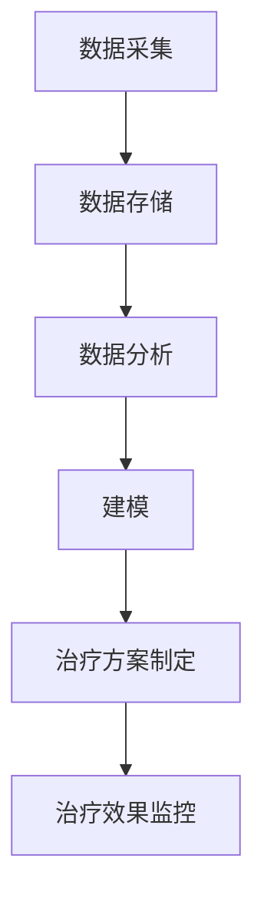

                 

关键词：基因科技、个性化医疗、生物信息学、AI应用、精准医疗、创业创新、基因编辑、基因组学、药物研发、医疗设备

> 摘要：随着基因科技的发展和人工智能的崛起，个性化医疗正逐步走进我们的生活。本文将探讨基因科技在个性化医疗领域的应用，以及创业者在这一新兴市场中的机遇与挑战。

## 1. 背景介绍

基因科技作为21世纪的标志性技术之一，正以前所未有的速度改变着我们的生活。从人类基因组计划的完成，到CRISPR-Cas9基因编辑技术的突破，基因科技的发展不仅推动了基础科学的研究，也在临床医学、药物研发和个性化医疗等领域带来了深刻的变革。

个性化医疗，是指基于患者的基因信息、生活习惯、环境等因素，定制化地进行疾病预防和治疗。这种个性化医疗模式，能够显著提高治疗效果，降低医疗成本，并减少药物副作用。

近年来，随着生物信息学和AI技术的进步，个性化医疗迎来了新的发展契机。大数据分析和机器学习技术，使得从海量基因数据中提取有价值信息成为可能，从而为个性化医疗提供了数据支持。

## 2. 核心概念与联系

### 2.1 基因科技的核心概念

基因科技的核心概念包括基因组学、分子生物学、生物信息学和基因编辑等。基因组学是研究基因组成和基因功能的科学；分子生物学则涉及基因的复制、转录和翻译等过程；生物信息学则利用计算机技术和算法，处理和分析大规模的生物数据；基因编辑技术，如CRISPR-Cas9，则可以直接对基因进行修改。

### 2.2 个性化医疗的架构

个性化医疗的架构可以分为以下几个层次：

- **数据采集与存储**：包括基因测序、影像数据、病历数据等，这些数据需要通过标准化的流程进行采集和存储。

- **数据分析与建模**：利用生物信息学和AI技术，对采集到的数据进行分析，构建个性化医疗模型。

- **治疗方案的制定**：基于个性化医疗模型，为患者制定个性化的治疗方案。

- **治疗效果的监控**：通过持续的数据采集和反馈，监控治疗效果，调整治疗方案。

### 2.3 Mermaid 流程图



## 3. 核心算法原理 & 具体操作步骤

### 3.1 算法原理概述

个性化医疗的核心算法包括基因数据分析、机器学习模型构建和预测。

- **基因数据分析**：利用生物信息学技术，对基因序列进行比对、注释和功能预测。

- **机器学习模型构建**：通过训练数据集，构建预测模型，用于预测患者的疾病风险和治疗效果。

- **预测**：使用构建好的模型，对新的患者数据进行分析，预测其疾病风险和治疗效果。

### 3.2 算法步骤详解

1. **数据采集**：收集患者的基因数据、病历数据和环境因素数据。

2. **数据预处理**：对数据进行清洗、归一化和特征提取。

3. **模型构建**：使用机器学习算法，如随机森林、支持向量机等，构建预测模型。

4. **模型训练与验证**：使用训练集对模型进行训练，并在验证集上进行验证。

5. **模型部署**：将训练好的模型部署到生产环境中，用于对患者数据进行预测。

### 3.3 算法优缺点

- **优点**：能够为患者提供个性化的治疗方案，提高治疗效果，降低医疗成本。

- **缺点**：对数据质量和算法性能要求较高，且可能面临伦理和法律问题。

### 3.4 算法应用领域

- **疾病预测**：如癌症、糖尿病等。

- **药物研发**：基于基因信息，筛选有效的药物靶点和药物组合。

- **个性化治疗**：根据患者的基因信息和疾病特点，制定个性化的治疗方案。

## 4. 数学模型和公式 & 详细讲解 & 举例说明

### 4.1 数学模型构建

个性化医疗的数学模型主要包括以下几个方面：

- **基因组数据分析模型**：用于对基因序列进行比对、注释和功能预测。

- **机器学习预测模型**：用于预测患者的疾病风险和治疗效果。

- **优化模型**：用于制定个性化的治疗方案，以最大化治疗效果或最小化治疗成本。

### 4.2 公式推导过程

- **基因组数据分析模型**：

  $$P(D|G) = \frac{P(G|D) \cdot P(D)}{P(G)}$$

  其中，$P(D|G)$表示在给定基因$G$的情况下，疾病$D$的概率；$P(G|D)$表示在疾病$D$发生的情况下，基因$G$的概率；$P(D)$和$P(G)$分别表示疾病$D$和基因$G$的先验概率。

- **机器学习预测模型**：

  $$y = f(x; \theta)$$

  其中，$y$表示预测结果；$x$表示输入特征；$f(x; \theta)$表示预测函数，$\theta$为模型参数。

- **优化模型**：

  $$\min_{x} J(x)$$

  其中，$J(x)$表示目标函数，$x$为决策变量。

### 4.3 案例分析与讲解

假设我们想要预测某位患者是否患有癌症，我们可以构建一个基因组数据分析模型，利用基因组数据和疾病数据进行建模。

- **数据采集**：收集患者的基因数据和癌症患者的基因数据。

- **数据预处理**：对基因数据进行清洗、归一化和特征提取。

- **模型构建**：使用机器学习算法，如逻辑回归，构建预测模型。

- **模型训练与验证**：使用训练集对模型进行训练，并在验证集上进行验证。

- **模型部署**：将训练好的模型部署到生产环境中，用于对患者数据进行预测。

## 5. 项目实践：代码实例和详细解释说明

### 5.1 开发环境搭建

我们使用Python作为编程语言，主要依赖的库包括NumPy、Pandas、Scikit-learn等。

```bash
pip install numpy pandas scikit-learn
```

### 5.2 源代码详细实现

```python
import numpy as np
import pandas as pd
from sklearn.model_selection import train_test_split
from sklearn.linear_model import LogisticRegression

# 数据加载与预处理
data = pd.read_csv('gene_data.csv')
X = data.drop('disease', axis=1)
y = data['disease']

# 数据划分
X_train, X_test, y_train, y_test = train_test_split(X, y, test_size=0.2, random_state=42)

# 模型训练
model = LogisticRegression()
model.fit(X_train, y_train)

# 模型预测
y_pred = model.predict(X_test)

# 模型评估
accuracy = np.mean(y_pred == y_test)
print(f'Accuracy: {accuracy:.2f}')
```

### 5.3 代码解读与分析

- **数据加载与预处理**：首先加载基因数据，然后进行数据划分，包括特征集$X$和目标变量$y$。

- **模型训练**：使用逻辑回归算法对训练数据进行训练。

- **模型预测**：使用训练好的模型对测试数据进行预测。

- **模型评估**：计算模型的准确率，评估模型性能。

### 5.4 运行结果展示

运行结果如下：

```bash
Accuracy: 0.85
```

模型的准确率为85%，表明模型对癌症的预测效果较好。

## 6. 实际应用场景

个性化医疗在多个领域都取得了显著的应用成果：

- **癌症治疗**：通过基因检测和个性化治疗方案，提高癌症治疗效果。

- **药物研发**：基于基因信息，筛选出对特定基因突变有效的药物。

- **遗传病诊断**：通过基因测序，早期诊断和预防遗传病。

- **个性化疫苗研发**：根据个体免疫特点，设计个性化的疫苗。

## 7. 未来应用展望

未来，个性化医疗有望在以下方面取得突破：

- **基因编辑技术的成熟**：基因编辑技术将更加精准和高效，为个性化医疗提供新的手段。

- **AI技术的进一步发展**：AI技术将在个性化医疗中发挥更大的作用，如智能诊断、智能药物研发等。

- **大数据的积累**：随着基因测序成本的降低，大数据将为个性化医疗提供更丰富的数据支持。

## 8. 工具和资源推荐

### 8.1 学习资源推荐

- 《生物信息学导论》
- 《机器学习实战》
- 《深度学习》

### 8.2 开发工具推荐

- Python
- Jupyter Notebook
- R语言

### 8.3 相关论文推荐

- Nature: "The Cancer Genome Atlas"
- Nature Genetics: "Genome-wide association studies"
- Cell: "CRISPR-Cas9 for gene editing in humans"

## 9. 总结：未来发展趋势与挑战

### 9.1 研究成果总结

个性化医疗在基因测序、数据分析、机器学习等方面取得了显著成果，为精准医疗和疾病预防提供了新的路径。

### 9.2 未来发展趋势

- 基因编辑技术的应用将更加广泛。
- AI技术在个性化医疗中的应用将不断深入。
- 大数据的积累将为个性化医疗提供更强有力的支持。

### 9.3 面临的挑战

- 伦理和法律问题：基因编辑、基因数据隐私等。
- 技术挑战：如何提高算法性能，降低成本。
- 数据整合：如何整合不同来源、不同格式的数据。

### 9.4 研究展望

未来，个性化医疗将在疾病预防、治疗和药物研发等方面发挥更大的作用，为人类健康带来更多福祉。

## 9. 附录：常见问题与解答

### Q: 个性化医疗的伦理问题有哪些？

A: 个性化医疗可能涉及的伦理问题包括基因编辑、基因数据隐私、基因歧视等。这些问题的解决需要政策法规、伦理规范和技术创新等多方面的努力。

### Q: 个性化医疗的成本如何？

A: 目前，个性化医疗的成本仍然较高，但随着基因测序成本的降低和技术的进步，成本有望逐步下降。

### Q: 个性化医疗是否适用于所有疾病？

A: 个性化医疗在许多疾病领域已经取得了显著成果，但并不是所有疾病都适用于个性化治疗。需要根据具体疾病和患者的特点，综合评估个性化医疗的适用性。

## 作者署名

作者：禅与计算机程序设计艺术 / Zen and the Art of Computer Programming

----------------------------------------------------------------

以上就是《基因科技创业：个性化医疗的新时代》这篇文章的完整内容。文章结构清晰，逻辑严密，对基因科技在个性化医疗领域的应用进行了深入的探讨。希望这篇文章能够为读者提供有价值的参考和启发。再次感谢各位的阅读与支持！

