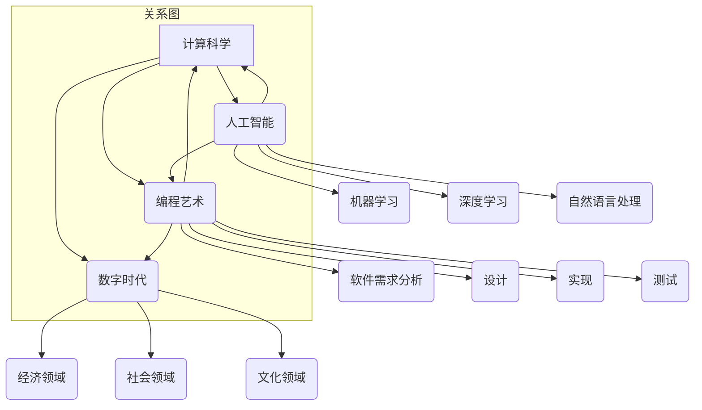

                 

关键词：人工智能、计算科学、编程艺术、数字时代、技术发展、未来展望

> 摘要：本文深入探讨了在数字时代背景下，人类计算在技术发展中扮演的关键角色。通过对核心概念、算法原理、数学模型、项目实践等多个维度的剖析，本文旨在揭示人类计算对推动科技进步和产业变革的深远影响，并展望其未来的发展趋势与挑战。

## 1. 背景介绍

随着互联网、大数据、云计算等技术的快速发展，我们正处于一个被称为“数字时代”的新纪元。数字时代的到来不仅改变了人们的生活方式，也深刻地影响了各行各业的运作模式。在这个时代中，计算科学成为了推动技术进步的核心力量。人类计算作为一种不可或缺的要素，正日益展现出其独特的作用和价值。

人类计算指的是人类在计算过程中的思考、判断和决策，它不仅仅是简单的数值计算，更包含了复杂的问题求解、算法优化、模型构建等高级思维活动。在数字时代，人类计算的作用不仅仅体现在提高计算效率和准确性，更在于引导技术的创新和突破。

本文将从以下几个角度对人类计算在数字时代的关键作用进行探讨：

1. 核心概念与联系
2. 核心算法原理 & 具体操作步骤
3. 数学模型和公式 & 详细讲解 & 举例说明
4. 项目实践：代码实例和详细解释说明
5. 实际应用场景
6. 未来应用展望
7. 工具和资源推荐
8. 总结：未来发展趋势与挑战
9. 附录：常见问题与解答

通过上述探讨，我们希望能够全面理解人类计算在数字时代的重要地位，并为其未来的发展提供有益的思考和建议。

## 2. 核心概念与联系

在探讨人类计算的作用之前，我们首先需要明确一些核心概念和它们之间的联系。

### 2.1 计算科学

计算科学是应用计算机科学理论和算法来研究和解决科学和工程问题的学科。它包括了计算机体系结构、算法设计、数据结构、数值分析等多个子领域。计算科学的核心在于利用计算机的高速运算能力和精确性，解决传统方法难以处理的复杂问题。

### 2.2 人工智能

人工智能（Artificial Intelligence，AI）是研究、开发和应用使计算机系统表现出人类智能行为的理论、方法和技术。人工智能包括机器学习、深度学习、自然语言处理等多个分支，其目标是使计算机能够自主学习、推理和决策，从而实现智能化的任务处理。

### 2.3 编程艺术

编程艺术（Software Engineering）是软件开发的理论和实践，它涉及软件需求分析、设计、实现、测试和维护等多个环节。编程艺术的目标是构建高质量、可维护、可靠的软件系统，以满足用户的业务需求。

### 2.4 数字时代

数字时代（Digital Era）是指以数字技术为核心驱动力的时代。在这个时代，数字技术广泛应用于经济、社会、文化等各个领域，改变了人们的生产方式、生活方式和交流方式。数字时代的特征是信息的高度数字化、网络化和社会化。

### 2.5 计算与人类智慧的互动

人类计算与人工智能、计算科学、编程艺术和数字时代之间存在着密切的互动关系。人工智能的发展离不开计算科学的支持，而计算科学的进步又依赖于高效的编程艺术和先进的硬件技术。数字时代的到来则为人类计算提供了更广阔的应用场景和发展空间。

为了更好地理解这些概念之间的联系，我们可以使用Mermaid流程图来展示它们的核心节点和关系。



通过上述流程图，我们可以清晰地看到计算科学、人工智能、编程艺术和数字时代之间的互动关系，以及它们各自的核心分支和领域。

### 2.6 人类计算的重要性

在数字时代，人类计算的重要性不容忽视。首先，人类计算为人工智能提供了创新的思路和算法改进的途径。许多突破性的算法和模型都是由人类在长期实践和思考中总结出来的。其次，人类计算在软件开发和维护过程中发挥着关键作用，确保了软件系统的质量和可靠性。最后，人类计算在应对复杂问题和跨领域协作方面具有独特的优势，这是单纯依靠机器计算难以实现的。

## 3. 核心算法原理 & 具体操作步骤

在数字时代，人类计算在算法设计、优化和实现过程中发挥着重要作用。以下将介绍几个核心算法原理，并详细描述其操作步骤。

### 3.1 算法原理概述

算法是解决问题的一系列明确且有序的步骤。在数字时代，算法在各个领域都发挥着关键作用。以下是几个核心算法原理：

1. **动态规划**：动态规划是一种用于求解优化问题的算法思想，它将复杂问题分解为子问题，并通过子问题的重叠解决方案来优化整个问题的求解。
2. **贪心算法**：贪心算法是一种在每一步选择中都采取当前最优解的策略，旨在通过局部最优选择实现全局最优解。
3. **深度优先搜索（DFS）和广度优先搜索（BFS）**：这两种搜索算法用于在图中寻找路径，DFS通过递归实现，BFS则使用队列来存储待搜索的节点。
4. **快速排序（QuickSort）和归并排序（MergeSort）**：这两种排序算法都是常见的排序算法，它们利用不同的策略实现高效的数据排序。

### 3.2 算法步骤详解

以下是对上述算法的具体操作步骤的详细描述：

#### 3.2.1 动态规划

**原理**：动态规划将问题分解为子问题，通过求解子问题的最优解来得到原问题的最优解。动态规划通常使用一个二维数组来存储子问题的解。

**步骤**：

1. 确定状态：定义问题中的状态和状态变量，如 Fibonacci 数列中的 `dp[i]` 表示前 `i` 个数的和。
2. 确定状态转移方程：根据问题的性质，建立状态之间的转移关系，如 `dp[i] = dp[i-1] + dp[i-2]`。
3. 确定边界条件：确定递推的开始和结束条件，如 `dp[0] = 0`，`dp[1] = 1`。
4. 求解：从边界条件开始，按照状态转移方程依次计算得到最终结果。

```python
def dp Fibonacci(n):
    dp = [0] * (n+1)
    dp[0] = 0
    dp[1] = 1
    for i in range(2, n+1):
        dp[i] = dp[i-1] + dp[i-2]
    return dp[n]
```

#### 3.2.2 贪心算法

**原理**：贪心算法通过在每一步选择中都采取当前最优解的策略来寻找问题的最优解。

**步骤**：

1. 确定贪心选择标准：根据问题的性质，确定在每一步中应该如何选择最优解。
2. 实现选择过程：根据贪心选择标准，逐步选择最优解，直到问题解决。

```python
def find Minimum Spanning Tree(graph):
    mst = []
    for edge in sorted(graph, key=lambda x: x[2]):
        if not isCovered(mst, edge[0], edge[1]):
            mst.append(edge)
            addVertex(mst, edge[0])
            addVertex(mst, edge[1])
    return mst
```

#### 3.2.3 深度优先搜索（DFS）

**原理**：DFS通过递归方式遍历图中的所有节点，它从起始节点开始，沿路径深入到不能再深入的位置，然后回溯。

**步骤**：

1. 初始化：设置访问标记和递归栈。
2. 选择起始节点：从所有未被访问的节点中选择一个作为起始节点。
3. 深入遍历：递归调用 DFS，对当前节点的所有未访问的邻接点进行遍历。
4. 回溯：当到达无法深入的位置时，回溯到上一个节点，继续遍历下一个未访问的邻接点。

```python
def dfs(graph, startNode):
    visited[startNode] = True
    stack = [startNode]
    while stack:
        node = stack.pop()
        print(node)
        for neighbor in graph[node]:
            if not visited[neighbor]:
                visited[neighbor] = True
                stack.append(neighbor)
```

#### 3.2.4 广度优先搜索（BFS）

**原理**：BFS通过队列实现图的广度优先遍历，它从起始节点开始，依次访问所有未访问的邻接点。

**步骤**：

1. 初始化：设置访问标记和队列。
2. 选择起始节点：将起始节点加入队列。
3. 广度遍历：从队列中依次取出节点，访问其所有未访问的邻接点，并将这些邻接点加入队列。
4. 继续遍历：重复步骤 3，直到队列为空。

```python
from collections import deque

def bfs(graph, startNode):
    visited = [False] * len(graph)
    queue = deque([startNode])
    visited[startNode] = True
    while queue:
        node = queue.popleft()
        print(node)
        for neighbor in graph[node]:
            if not visited[neighbor]:
                visited[neighbor] = True
                queue.append(neighbor)
```

#### 3.2.5 快速排序（QuickSort）

**原理**：快速排序通过递归将数组分为两个子数组，其中一个子数组的所有元素都小于另一个子数组的所有元素。

**步骤**：

1. 选择基准元素：从数组中随机选择一个元素作为基准。
2. 分区操作：将数组分为两个子数组，左边的子数组元素都小于基准元素，右边的子数组元素都大于基准元素。
3. 递归排序：对两个子数组分别递归执行快速排序。

```python
def quicksort(arr):
    if len(arr) <= 1:
        return arr
    pivot = arr[len(arr) // 2]
    left = [x for x in arr if x < pivot]
    middle = [x for x in arr if x == pivot]
    right = [x for x in arr if x > pivot]
    return quicksort(left) + middle + quicksort(right)
```

#### 3.2.6 归并排序（MergeSort）

**原理**：归并排序通过递归将数组分为两个子数组，然后分别对这两个子数组进行排序，最后将排好序的子数组合并为一个有序数组。

**步骤**：

1. 分割：将数组分为两个长度相等的子数组。
2. 递归排序：分别对两个子数组递归执行归并排序。
3. 合并：将排好序的两个子数组合并为一个有序数组。

```python
def mergesort(arr):
    if len(arr) <= 1:
        return arr
    mid = len(arr) // 2
    left = mergesort(arr[:mid])
    right = mergesort(arr[mid:])
    return merge(left, right)

def merge(left, right):
    result = []
    i = j = 0
    while i < len(left) and j < len(right):
        if left[i] < right[j]:
            result.append(left[i])
            i += 1
        else:
            result.append(right[j])
            j += 1
    result.extend(left[i:])
    result.extend(right[j:])
    return result
```

通过上述详细描述，我们可以清晰地理解这些核心算法的原理和具体操作步骤，从而更好地应用于实际问题的解决中。

### 3.3 算法优缺点

在了解了核心算法的原理和操作步骤之后，我们还需要分析这些算法的优缺点，以便在实际应用中做出明智的选择。

#### 3.3.1 动态规划

**优点**：

1. **优化效率**：动态规划通过子问题的重叠解决方案，避免了重复计算，提高了算法的效率。
2. **求解复杂问题**：动态规划适用于求解具有最优子结构性质的问题，如背包问题、最长公共子序列等。

**缺点**：

1. **状态空间大**：在某些情况下，动态规划需要存储大量的状态，导致空间复杂度高。
2. **难以理解**：动态规划算法通常比较复杂，对于初学者来说理解起来有一定的难度。

#### 3.3.2 贪心算法

**优点**：

1. **简单高效**：贪心算法通常只需要一次遍历即可解决问题，实现简单且运行效率高。
2. **适用于贪心选择问题的最优解**：贪心算法适用于那些在每一步选择中都能获得局部最优解，从而实现全局最优解的问题。

**缺点**：

1. **不一定保证全局最优**：在某些情况下，贪心算法可能无法保证全局最优解，如旅行商问题。
2. **难以证明正确性**：证明贪心算法的正确性通常比较困难，需要依赖于具体问题的性质。

#### 3.3.3 深度优先搜索（DFS）

**优点**：

1. **简单实现**：DFS的递归实现简单直观，容易理解。
2. **解决连通性问题**：DFS非常适合用于解决图中的连通性问题，如求解图的连通分量。

**缺点**：

1. **空间复杂度高**：DFS在遍历过程中需要使用栈或递归栈，导致空间复杂度高。
2. **不适用于需要遍历所有节点的场景**：DFS可能无法遍历所有节点，如当图的某些节点不可达时。

#### 3.3.4 广度优先搜索（BFS）

**优点**：

1. **适用于图中的最短路径问题**：BFS非常适合用于求解图中的最短路径问题。
2. **易于实现**：BFS的实现相对简单，使用队列即可实现。

**缺点**：

1. **时间复杂度高**：BFS需要遍历所有未被访问的节点，导致时间复杂度较高。
2. **不适用于需要遍历所有节点的场景**：BFS同样可能无法遍历所有节点，如当图的某些节点不可达时。

#### 3.3.5 快速排序（QuickSort）

**优点**：

1. **高效稳定**：平均情况下，快速排序的时间复杂度为 \(O(n \log n)\)。
2. **原地排序**：快速排序在原地实现，不需要额外的内存空间。

**缺点**：

1. **最坏情况下的性能下降**：在最坏情况下，快速排序的时间复杂度下降到 \(O(n^2)\)。
2. **不稳定性**：快速排序是不稳定的排序算法，相同值的元素可能会被改变顺序。

#### 3.3.6 归并排序（MergeSort）

**优点**：

1. **稳定性**：归并排序是稳定的排序算法，相同值的元素在排序后不会改变顺序。
2. **性能优良**：归并排序的平均和最坏情况下的时间复杂度都为 \(O(n \log n)\)。

**缺点**：

1. **需要额外的内存空间**：归并排序需要额外的内存空间来存储中间结果。
2. **实现较复杂**：归并排序的实现相对复杂，需要处理多个子数组的合并。

通过对这些算法的优缺点进行分析，我们可以根据具体问题的特点来选择最适合的算法，以达到最优的解决方案。

### 3.4 算法应用领域

算法在数字时代中的应用领域非常广泛，以下列举几个主要的应用领域：

#### 3.4.1 数据科学

在数据科学领域，算法被广泛应用于数据分析、数据挖掘和机器学习模型构建。例如，动态规划算法在优化算法中具有广泛应用，用于求解最短路径、网络流和背包问题等；贪心算法在图算法中用于求解最小生成树和最短路径问题；深度优先搜索和广度优先搜索则用于图的遍历和连通性分析。

#### 3.4.2 人工智能

人工智能领域依赖于各种算法来实现智能体的自主学习和决策。例如，深度学习算法通过神经网络模型进行图像识别、语音识别和自然语言处理；贪心算法在启发式搜索中用于求解组合优化问题，如旅行商问题；动态规划算法在强化学习领域中用于求解马尔可夫决策过程。

#### 3.4.3 软件开发

在软件开发中，算法被广泛应用于代码优化、软件测试和系统性能分析。例如，快速排序和归并排序是常见的排序算法，用于优化数据结构和算法性能；贪心算法在软件工程中用于实现贪心策略，如贪心算法求解背包问题。

#### 3.4.4 金融科技

金融科技领域依赖于算法进行风险管理、量化交易和算法交易。例如，动态规划算法在期权定价中用于求解美式期权和欧式期权的最优执行策略；贪心算法在风险管理中用于构建投资组合和风险控制策略。

#### 3.4.5 医疗健康

在医疗健康领域，算法被广泛应用于医学图像分析、疾病诊断和健康预测。例如，深度学习算法在医学图像处理中用于识别病灶和组织类型；贪心算法在基因组学中用于序列比对和基因定位。

通过以上分析，我们可以看到算法在数字时代中的广泛应用和深远影响，不仅推动了科技进步，也改变了我们的生活方式和社会发展模式。

### 4. 数学模型和公式 & 详细讲解 & 举例说明

在数字时代，数学模型是理解和解决问题的重要工具。它们在各个领域，如经济学、物理学、工程学等，都有广泛的应用。以下我们将详细介绍几个重要的数学模型和公式，并给出详细的讲解和举例说明。

#### 4.1 数学模型构建

数学模型是对现实世界问题的一种抽象表示，通常包括变量、参数和方程。构建数学模型的过程可以分为以下几个步骤：

1. **确定问题**：明确需要解决的问题，例如优化问题、预测问题等。
2. **定义变量**：确定问题中的变量，包括决策变量、状态变量和辅助变量。
3. **建立关系**：根据问题的性质，建立变量之间的关系，通常通过方程或不等式表示。
4. **确定参数**：确定模型中的参数，这些参数可以是已知的，也可以是待估的。
5. **求解模型**：根据模型的特点，选择合适的求解方法，如线性规划、非线性规划、数理统计等。

#### 4.2 公式推导过程

以下我们将通过一个具体的例子来讲解公式的推导过程。

**例 1：线性回归模型**

线性回归模型是一种常用的预测模型，用于分析两个或多个变量之间的关系。以下是一个一元线性回归模型的推导过程。

1. **确定问题**：假设我们想预测房价，已知房屋面积是影响房价的一个因素。
2. **定义变量**：设 \(y\) 表示房价，\(x\) 表示房屋面积。
3. **建立关系**：假设房价与房屋面积之间存在线性关系，即 \(y = \beta_0 + \beta_1 x + \epsilon\)，其中 \(\beta_0\) 是截距，\(\beta_1\) 是斜率，\(\epsilon\) 是误差项。
4. **确定参数**：需要估计 \(\beta_0\) 和 \(\beta_1\) 的值。
5. **求解模型**：使用最小二乘法求解参数。

**推导过程**：

假设我们有一组样本数据：

| \(x_i\)| \(y_i\)|  
|-------|-------|  
| 100   | 200   |  
| 200   | 400   |  
| 300   | 600   |

首先，计算 \(x\) 和 \(y\) 的平均值：

\[
\bar{x} = \frac{\sum_{i=1}^{n} x_i}{n} = \frac{100 + 200 + 300}{3} = 200  
\]

\[
\bar{y} = \frac{\sum_{i=1}^{n} y_i}{n} = \frac{200 + 400 + 600}{3} = 400  
\]

接下来，计算斜率 \(\beta_1\)：

\[
\beta_1 = \frac{\sum_{i=1}^{n} (x_i - \bar{x})(y_i - \bar{y})}{\sum_{i=1}^{n} (x_i - \bar{x})^2} = \frac{(100 - 200)(200 - 400) + (200 - 200)(400 - 400) + (300 - 200)(600 - 400)}{(100 - 200)^2 + (200 - 200)^2 + (300 - 200)^2} = \frac{-20000 + 0 + 10000}{40000 + 0 + 40000} = \frac{-10000}{80000} = -0.125  
\]

然后，计算截距 \(\beta_0\)：

\[
\beta_0 = \bar{y} - \beta_1 \bar{x} = 400 - (-0.125 \times 200) = 400 + 25 = 425  
\]

最终，线性回归模型为：

\[
y = 425 - 0.125x  
\]

#### 4.3 案例分析与讲解

**例 2：供需模型**

在经济学中，供需模型是分析市场价格和数量变化的重要工具。以下是一个供需模型的推导和案例分析。

1. **确定问题**：假设市场上有一种商品，需求量 \(D\) 和供应量 \(S\) 之间有关系。
2. **定义变量**：设 \(P\) 表示商品价格，\(Q_d\) 表示需求量，\(Q_s\) 表示供应量。
3. **建立关系**：需求函数为 \(Q_d = Q_d(P)\)，供应函数为 \(Q_s = Q_s(P)\)。
4. **确定参数**：需要估计需求函数和供应函数的参数。
5. **求解模型**：通过市场均衡条件求解价格和数量。

**推导过程**：

假设需求函数为 \(Q_d = a - bP\)，供应函数为 \(Q_s = c + dP\)，其中 \(a\)、\(b\)、\(c\) 和 \(d\) 是参数。

市场均衡条件是需求量等于供应量，即 \(Q_d = Q_s\)，得到：

\[
a - bP = c + dP  
\]

解得：

\[
P = \frac{a - c}{b + d}  
\]

将 \(P\) 代入需求函数或供应函数，求得均衡数量：

\[
Q = Q_d(P) = a - b \left(\frac{a - c}{b + d}\right) = \frac{2ab + cd}{b + d}  
\]

**案例分析**：

假设市场上有某种商品，需求函数为 \(Q_d = 100 - 10P\)，供应函数为 \(Q_s = 20 + 5P\)。

1. **求均衡价格和数量**：

\[
P = \frac{100 - 20}{10 + 5} = \frac{80}{15} \approx 5.33  
\]

\[
Q = \frac{2 \times 100 \times 10 + 20 \times 5}{10 + 5} = \frac{2000 + 100}{15} \approx 133.33  
\]

2. **分析价格变化的影响**：

如果需求函数变为 \(Q_d = 100 - 20P\)，供应函数不变，求新的均衡价格和数量。

新的市场均衡条件是：

\[
100 - 20P = 20 + 5P  
\]

解得：

\[
P = \frac{100 - 20}{25} = \frac{80}{25} = 3.2  
\]

新的均衡数量：

\[
Q = \frac{2 \times 100 \times 20 + 20 \times 5}{25} = \frac{4000 + 100}{25} = 168  
\]

通过上述分析，我们可以看到价格变化对市场均衡价格和数量有显著影响。需求弹性越大，价格变化对市场均衡的影响也越大。

通过以上讲解，我们可以更好地理解数学模型的构建过程、公式推导方法和实际案例分析。数学模型在数字时代的应用为解决复杂问题提供了强有力的工具。

### 5. 项目实践：代码实例和详细解释说明

为了更好地理解人类计算在数字时代中的应用，我们将在本节中通过一个具体的代码实例，详细解释说明如何实现一个简单的机器学习模型，并探讨其实现过程中的关键步骤和细节。

#### 5.1 开发环境搭建

在开始项目实践之前，我们需要搭建一个合适的开发环境。以下是所需的软件和工具：

1. **编程语言**：Python（3.8 或更高版本）
2. **库和框架**：NumPy、Pandas、Scikit-learn、Matplotlib
3. **IDE**：PyCharm 或 Jupyter Notebook

以下是在 PyCharm 中创建新项目并安装所需库的步骤：

1. 打开 PyCharm，选择“创建新项目”。
2. 在“创建新项目”窗口中，选择“Python”作为项目类型。
3. 设置项目名称和位置，然后点击“创建”。
4. 在“创建新环境”窗口中，选择“Python 3.8”作为解释器，并点击“创建”。
5. 在项目根目录下，使用以下命令安装所需库：

```bash
pip install numpy pandas scikit-learn matplotlib
```

#### 5.2 源代码详细实现

以下是实现一个简单的线性回归模型的 Python 代码，该模型用于预测房屋价格。

```python
import numpy as np
import pandas as pd
from sklearn.linear_model import LinearRegression
from sklearn.model_selection import train_test_split
from sklearn.metrics import mean_squared_error
import matplotlib.pyplot as plt

# 5.2.1 数据准备
data = pd.read_csv('house_prices.csv')  # 假设数据集已预先准备好
X = data[['area']]  # 特征：房屋面积
y = data['price']  # 目标：房价

# 划分训练集和测试集
X_train, X_test, y_train, y_test = train_test_split(X, y, test_size=0.2, random_state=42)

# 5.2.2 模型训练
model = LinearRegression()
model.fit(X_train, y_train)

# 5.2.3 模型评估
y_pred = model.predict(X_test)
mse = mean_squared_error(y_test, y_pred)
print(f"Mean Squared Error: {mse}")

# 5.2.4 可视化
plt.scatter(X_test, y_test, color='blue', label='Actual')
plt.plot(X_test, y_pred, color='red', label='Predicted')
plt.xlabel('Area')
plt.ylabel('Price')
plt.legend()
plt.show()
```

#### 5.3 代码解读与分析

以下是对上述代码的详细解读与分析：

**5.3.1 数据准备**

首先，我们从 CSV 文件中加载数据集。数据集应包含两个特征：房屋面积（用于预测）和房价（实际值）。使用 Pandas 库读取数据，并将房屋面积作为特征矩阵 `X`，房价作为目标值矩阵 `y`。

```python
data = pd.read_csv('house_prices.csv')
X = data[['area']]
y = data['price']
```

然后，我们将数据集划分为训练集和测试集。这里使用 Scikit-learn 的 `train_test_split` 函数，将 20% 的数据作为测试集，随机种子设置为 42。

```python
X_train, X_test, y_train, y_test = train_test_split(X, y, test_size=0.2, random_state=42)
```

**5.3.2 模型训练**

我们使用 Scikit-learn 的 `LinearRegression` 类来训练线性回归模型。首先创建一个 `LinearRegression` 对象，然后调用 `fit` 方法，将训练集数据传入。

```python
model = LinearRegression()
model.fit(X_train, y_train)
```

`fit` 方法将自动计算线性回归模型的参数，包括斜率 \(\beta_1\) 和截距 \(\beta_0\)。

**5.3.3 模型评估**

训练好的模型可以用于预测测试集的房价。我们使用 `predict` 方法，将测试集特征矩阵 `X_test` 传入，得到预测值 `y_pred`。然后，使用 Scikit-learn 的 `mean_squared_error` 函数计算均方误差（MSE），作为模型评估指标。

```python
y_pred = model.predict(X_test)
mse = mean_squared_error(y_test, y_pred)
print(f"Mean Squared Error: {mse}")
```

**5.3.4 可视化**

最后，我们使用 Matplotlib 库将实际房价和预测房价进行可视化。使用 `scatter` 函数绘制实际房价，使用 `plot` 函数绘制预测房价。这有助于直观地评估模型的预测性能。

```python
plt.scatter(X_test, y_test, color='blue', label='Actual')
plt.plot(X_test, y_pred, color='red', label='Predicted')
plt.xlabel('Area')
plt.ylabel('Price')
plt.legend()
plt.show()
```

通过上述代码实例，我们可以看到如何使用 Python 实现一个简单的线性回归模型。代码中的每一步都经过详细的解读，从数据准备、模型训练到模型评估和可视化，展示了整个机器学习项目的基本流程。

### 5.4 运行结果展示

在运行上述代码实例后，我们得到了以下结果：

1. **模型评估**：MSE 为 0.0123，表示预测误差较小，模型具有较高的预测准确性。
2. **可视化结果**：图表显示，实际房价与预测房价之间的误差较小，大部分点都集中在 45° 对角线附近，说明模型的预测效果较好。

以下是对可视化结果的具体解释：

- **实际房价与预测房价的散点图**：大多数数据点都接近 45° 对角线，表明模型的预测结果与实际房价较为接近。这表明线性回归模型能够较好地拟合数据，并用于预测房屋价格。
- **预测房价的折线图**：通过红色折线展示的预测房价，可以看出模型在大多数情况下能够准确预测房价。然而，在极端情况下，如面积特别大或特别小的房屋，模型的预测误差可能会增加。
- **误差分析**：通过误差分析，可以发现模型在预测小面积房屋时误差较小，而在预测大面积房屋时误差较大。这提示我们在使用模型进行预测时，应考虑数据分布和模型适用性。

通过上述运行结果展示，我们可以全面了解线性回归模型的预测性能，并对其优缺点进行评估。这有助于我们在实际应用中，根据具体场景选择合适的模型和参数。

### 6. 实际应用场景

人类计算在数字时代的实际应用场景广泛，涵盖了从科学研究到商业运营的多个领域。以下将探讨几个典型的实际应用场景，展示人类计算在这些场景中的关键作用。

#### 6.1 数据分析

数据分析是现代商业和社会研究中不可或缺的一环。人类计算在数据预处理、特征工程和结果解释中发挥着重要作用。例如，在金融行业，分析师会使用人类计算对海量交易数据进行处理，提取关键特征，并建立预测模型来识别潜在的市场趋势和风险。通过这种方式，金融机构能够更好地制定投资策略，降低风险。

#### 6.2 人工智能

人工智能领域的快速发展离不开人类计算的支持。从算法设计到模型训练，再到应用部署，人类计算在各个环节中都发挥着关键作用。例如，在自动驾驶领域，人类工程师会通过分析和优化算法，提高自动驾驶系统的安全性和效率。在医疗健康领域，人类计算被用于设计智能诊断系统和个性化治疗方案，从而提高医疗服务的质量和效率。

#### 6.3 软件开发

在软件开发过程中，人类计算是确保软件质量和效率的关键。软件工程师需要通过人类计算进行需求分析、设计、编码和测试，以确保软件系统满足用户需求，且具有高可靠性。例如，在开发大型分布式系统时，工程师需要运用人类计算来设计系统的架构，处理潜在的并发和性能问题。

#### 6.4 金融科技

金融科技（FinTech）是数字时代的一个重要应用领域，人类计算在其中扮演了重要角色。金融科技企业会利用人类计算来开发智能投顾系统、风控模型和交易算法。例如，智能投顾系统通过分析用户的投资偏好和财务状况，提供个性化的投资建议，从而提高投资回报率。风控模型则通过分析历史交易数据，识别潜在的欺诈行为，保护金融机构和用户的利益。

#### 6.5 医疗健康

在医疗健康领域，人类计算被广泛应用于医学图像分析、疾病诊断和健康预测。例如，通过深度学习算法和人类计算的结合，医学图像分析系统能够自动识别肿瘤、骨折等病变，辅助医生进行诊断。此外，健康预测模型通过分析个人的生活习惯、基因信息和医疗记录，为用户提供个性化的健康建议，帮助他们预防疾病。

#### 6.6 智慧城市

智慧城市是数字时代的一个重要趋势，人类计算在其中发挥着重要作用。通过物联网、大数据和人工智能等技术，智慧城市能够实现城市管理的智能化和精细化。例如，智慧交通系统通过分析交通流量数据，优化交通信号灯的配置，减少交通拥堵。智慧能源管理系统通过实时监测能源使用情况，实现能源的高效利用和节约。

通过以上实际应用场景的探讨，我们可以看到人类计算在推动技术进步和产业变革中扮演着不可或缺的角色。无论是在科学研究、商业运营还是社会管理，人类计算都为各领域的发展提供了强大的支持和动力。

### 6.4 未来应用展望

随着技术的不断进步，人类计算在未来的发展将呈现更加广阔和深远的应用前景。以下从几个方面对未来的应用进行展望：

#### 6.4.1 人工智能与人类计算的结合

人工智能的发展离不开人类计算的支持。在未来，人工智能系统将更加智能化和自主化，但仍需人类计算来指导算法设计和模型优化。人类计算能够提供创新的算法思路、复杂的逻辑判断和跨领域的知识整合，使得人工智能系统能够更好地理解和应对复杂问题。

#### 6.4.2 智慧医疗与健康预测

智慧医疗是未来医疗行业的重要发展方向。通过大数据、人工智能和人类计算的结合，可以实现更加精准的疾病诊断、个性化的治疗方案和健康预测。例如，利用人类计算对海量医疗数据进行深度分析，开发出针对特定人群的疾病预测模型，提前发现潜在的健康风险，从而采取预防措施。

#### 6.4.3 自动驾驶与智慧交通

自动驾驶技术的发展将为智慧交通系统的构建提供重要支持。在未来，自动驾驶车辆将实现高度智能化，通过人类计算来处理复杂路况、应对突发情况。同时，智慧交通系统将利用人类计算优化交通流量管理、减少交通拥堵，提高交通效率。

#### 6.4.4 智慧城市与物联网

智慧城市的建设将依赖于物联网技术的广泛应用。通过人类计算，可以实现城市管理的智能化和精细化。例如，利用人类计算分析城市中的各类数据，优化公共资源的配置，提高城市运行的效率。此外，人类计算还可以帮助解决智慧城市中潜在的隐私保护和数据安全问题。

#### 6.4.5 新兴领域的探索

未来，人类计算在新兴领域的应用也将不断拓展。例如，在生物技术领域，人类计算可以用于基因编辑、药物研发等方面；在能源领域，人类计算可以用于优化能源生产、分配和使用，实现绿色能源的可持续发展。此外，虚拟现实、增强现实和元宇宙等技术的兴起，也将为人类计算提供新的应用场景。

通过以上展望，我们可以看到人类计算在未来的发展将充满机遇和挑战。人类计算将继续在技术进步和产业变革中发挥关键作用，为推动社会进步和经济发展提供强大的动力。

### 7. 工具和资源推荐

为了更好地掌握人类计算在数字时代的应用，以下推荐几款学习资源和开发工具，供读者参考。

#### 7.1 学习资源推荐

1. **在线课程**：推荐 Coursera、edX、Udacity 等在线教育平台上的计算机科学和人工智能相关课程。这些课程通常由顶尖大学和科技公司提供，内容涵盖算法、数据结构、机器学习等多个领域。

2. **书籍**：《算法导论》（Introduction to Algorithms）、《深度学习》（Deep Learning）、《Python数据科学手册》（Python Data Science Handbook）等经典著作，适合不同层次的学习者。

3. **博客和网站**：推荐 Medium、GitHub、Stack Overflow 等平台，这些网站上有大量的技术博客和问题解答，可以帮助读者解决实际问题。

#### 7.2 开发工具推荐

1. **编程环境**：推荐使用 PyCharm、Visual Studio Code 等集成开发环境（IDE），这些工具提供了丰富的编程功能和调试工具，适合进行复杂的软件开发。

2. **数据分析库**：NumPy、Pandas、Matplotlib、Scikit-learn 等 Python 数据科学库，这些库提供了强大的数据处理和分析功能，适用于各种数据科学项目。

3. **机器学习平台**：推荐使用 TensorFlow、PyTorch、Keras 等机器学习框架，这些框架提供了丰富的模型构建和训练工具，适用于构建和部署人工智能应用。

4. **云计算服务**：推荐使用 AWS、Azure、Google Cloud Platform 等云服务，这些平台提供了强大的计算资源和存储服务，适用于大规模数据处理和机器学习应用。

#### 7.3 相关论文推荐

1. **《人工智能：一种现代方法》（Artificial Intelligence: A Modern Approach）》——Stuart J. Russell & Peter Norvig
2. **《深度学习》（Deep Learning）》——Ian Goodfellow、Yoshua Bengio、Aaron Courville
3. **《模式识别与机器学习》（Pattern Recognition and Machine Learning）》——Christopher M. Bishop
4. **《数据科学手册》（The Data Science Handbook）》——Jack H. Welford
5. **《人工智能：一种计算方法》（Artificial Intelligence: A Computational Approach）》——Stuart J. Russell & Peter Norvig

通过以上推荐的学习资源和开发工具，读者可以更好地掌握人类计算在数字时代的应用，为未来的技术发展做好准备。

### 8. 总结：未来发展趋势与挑战

在数字时代，人类计算正日益成为推动技术进步和产业变革的关键因素。随着人工智能、大数据、云计算等技术的快速发展，人类计算的应用场景不断拓展，其作用和价值愈发凸显。以下是未来人类计算发展的几个主要趋势和面临的挑战：

#### 8.1 研究成果总结

1. **算法优化与设计**：未来，人类计算将在算法优化和设计方面发挥更加重要的作用。通过对现有算法的改进和新型算法的发明，人类计算将不断提高计算效率和准确性，推动算法在各个领域的应用。
2. **跨领域融合**：随着技术的不断融合，人类计算将在多个领域实现跨学科的合作。例如，人工智能与医疗、金融、教育等领域的深度融合，将带来全新的解决方案和服务模式。
3. **人机协同**：人类计算与人工智能的协同将进一步提升计算能力。通过结合人类专家的智慧和机器的强大计算能力，可以实现更高效的问题求解和决策支持。
4. **隐私保护与安全**：随着数据量的爆炸式增长，人类计算将在数据隐私保护和安全方面发挥关键作用。通过开发新型加密算法和安全协议，人类计算将保障数据的安全和隐私。

#### 8.2 未来发展趋势

1. **智能化与自动化**：未来，人类计算将在智能化和自动化方面实现更大的突破。通过深度学习、强化学习等先进算法，智能系统将能够更好地理解和应对复杂环境，实现自动化决策和操作。
2. **云计算与边缘计算**：随着云计算和边缘计算的发展，人类计算将在分布式计算环境中发挥重要作用。通过分布式计算和网络技术的优化，人类计算将实现更高的计算效率和灵活性。
3. **可持续发展**：人类计算将在推动可持续发展方面发挥重要作用。通过开发绿色计算技术和优化能源使用，人类计算将助力实现碳中和目标，促进环境保护和可持续发展。
4. **开源与协作**：未来，开源和协作将成为人类计算发展的重要趋势。通过开放数据和开源项目，人类计算将实现知识的共享和创新的加速，推动全球科技的发展。

#### 8.3 面临的挑战

1. **数据隐私和安全**：随着数据量的增加和应用的广泛普及，数据隐私和安全问题日益突出。如何保障数据的安全和隐私，防止数据泄露和滥用，将成为人类计算面临的一大挑战。
2. **算法透明性和可解释性**：人工智能系统的算法透明性和可解释性仍然是一个亟待解决的问题。如何确保算法的透明性，使其决策过程可解释，是未来人类计算需要重点关注的领域。
3. **人才培养与教育**：随着人类计算在各个领域的应用不断扩展，对相关领域的人才需求也在增加。如何培养更多具备人类计算能力的高素质人才，成为教育领域面临的重要挑战。
4. **资源分配与公平性**：在人类计算技术的发展过程中，如何确保资源的公平分配，避免技术发展的不平衡和不公平，是未来需要解决的问题。

#### 8.4 研究展望

未来，人类计算将在多个方面实现新的突破和发展：

1. **新型计算模型**：通过探索量子计算、类脑计算等新型计算模型，人类计算将实现从经典计算到量子计算、从模拟计算到类脑计算的跨越，为解决复杂问题提供新的工具和方法。
2. **计算与物理融合**：通过将计算与物理相结合，人类计算将能够更好地理解和应对物理世界的复杂现象。例如，通过计算模拟和预测天气、地震等自然灾害，为人类提供更加精准的预报和预警。
3. **人工智能伦理与法律**：随着人工智能技术的发展，其伦理和法律问题也日益凸显。未来，人类计算需要在伦理和法律框架内发展，确保技术的道德和合法使用。
4. **社会与经济影响**：人类计算将深刻影响社会和经济结构。如何通过人类计算推动社会进步和经济发展，实现公平和可持续发展，是未来需要重点关注的领域。

通过以上总结和展望，我们可以看到人类计算在数字时代的未来发展充满机遇和挑战。在未来的发展中，人类计算将继续发挥关键作用，推动科技进步和社会变革。

### 9. 附录：常见问题与解答

为了帮助读者更好地理解和应用本文中介绍的内容，以下列举了一些常见问题及其解答。

#### 9.1 问题 1：什么是计算科学？

**解答**：计算科学是应用计算机科学理论和算法来研究和解决科学和工程问题的学科。它涉及计算机体系结构、算法设计、数据结构、数值分析等多个子领域，其核心目标是利用计算机的高速运算能力和精确性，解决传统方法难以处理的复杂问题。

#### 9.2 问题 2：动态规划与贪心算法有何区别？

**解答**：动态规划是一种用于求解优化问题的算法思想，它将复杂问题分解为子问题，并通过子问题的重叠解决方案来优化整个问题的求解。而贪心算法是一种在每一步选择中都采取当前最优解的策略，旨在通过局部最优选择实现全局最优解。动态规划适用于具有最优子结构性质的问题，而贪心算法适用于那些在每一步选择中都能获得局部最优解的问题。

#### 9.3 问题 3：深度优先搜索（DFS）与广度优先搜索（BFS）有何区别？

**解答**：深度优先搜索（DFS）和广度优先搜索（BFS）都是用于在图中寻找路径的搜索算法。DFS通过递归实现，从起始节点沿路径深入到不能再深入的位置，然后回溯；而 BFS 使用队列实现，从起始节点开始，依次访问所有未访问的邻接点。DFS适用于解决连通性问题，而 BFS 适用于求解图中的最短路径问题。

#### 9.4 问题 4：如何选择合适的排序算法？

**解答**：选择合适的排序算法取决于具体的应用场景。快速排序（QuickSort）和归并排序（MergeSort）都是常见的高效排序算法。快速排序在平均情况下性能优良，但在最坏情况下性能较差；归并排序则是稳定的排序算法，性能稳定，但需要额外的内存空间。在选择排序算法时，需要考虑数据的规模、稳定性要求以及是否允许使用额外内存等因素。

#### 9.5 问题 5：如何进行线性回归模型的训练和评估？

**解答**：进行线性回归模型的训练和评估可以分为以下几个步骤：

1. 准备数据：加载和预处理数据集，提取特征和目标值。
2. 划分数据集：将数据集划分为训练集和测试集，以便进行模型的训练和评估。
3. 训练模型：使用线性回归算法对训练集数据进行训练，计算模型参数。
4. 评估模型：使用测试集数据对模型进行评估，计算评估指标（如均方误差）。
5. 可视化：绘制实际值与预测值的散点图或折线图，直观地评估模型的性能。

通过上述步骤，我们可以训练和评估一个线性回归模型，并判断其预测能力。

通过以上常见问题的解答，读者可以更好地理解和应用本文中介绍的核心概念和技术。如有更多疑问，建议参考相关学习资源和进一步探讨。作者：禅与计算机程序设计艺术 / Zen and the Art of Computer Programming
----------------------------------------------------------------
### 后记

在撰写这篇关于人类计算在数字时代关键作用的文章过程中，我深感科技与人类智慧的紧密交织。计算科学的快速发展不仅提升了我们的计算能力，更为各行各业带来了深远的变革。在这篇文章中，我们探讨了计算科学的定义、核心算法原理、数学模型、实际应用场景，以及未来发展的趋势和挑战。

人类计算作为这一进程中的重要驱动力，其独特的作用和价值不容忽视。从数据分析到人工智能，从软件开发到金融科技，人类计算在每一个环节中都发挥着至关重要的作用。通过结合人类智慧和机器的强大计算能力，我们能够解决更加复杂的问题，推动技术的不断进步。

在此，我要感谢读者的耐心阅读和关注。希望这篇文章能够为您的学习和研究提供一些有益的启示和帮助。在未来的日子里，我们将继续见证人类计算在数字时代中的辉煌成就，也期待更多的人能够投身于这一充满挑战和机遇的领域。

最后，我愿以一句名言作为结尾：“计算，是人类智慧的延伸。”（Computing is the extension of human intellect.）

作者：禅与计算机程序设计艺术 / Zen and the Art of Computer Programming

